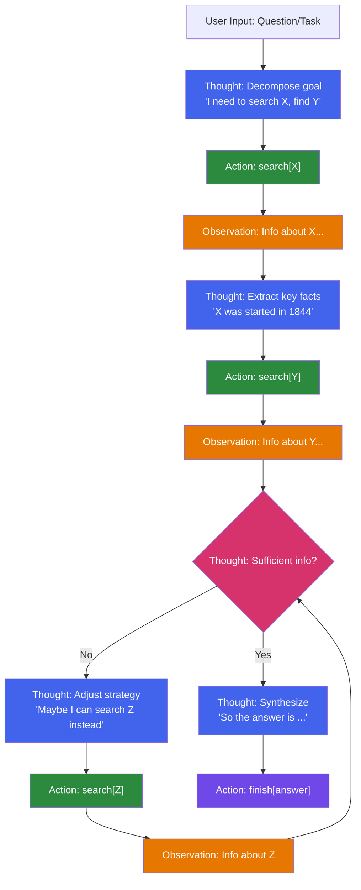
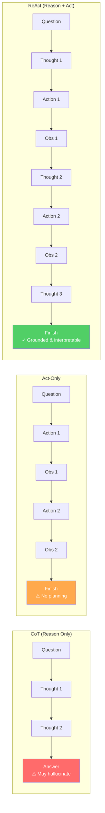
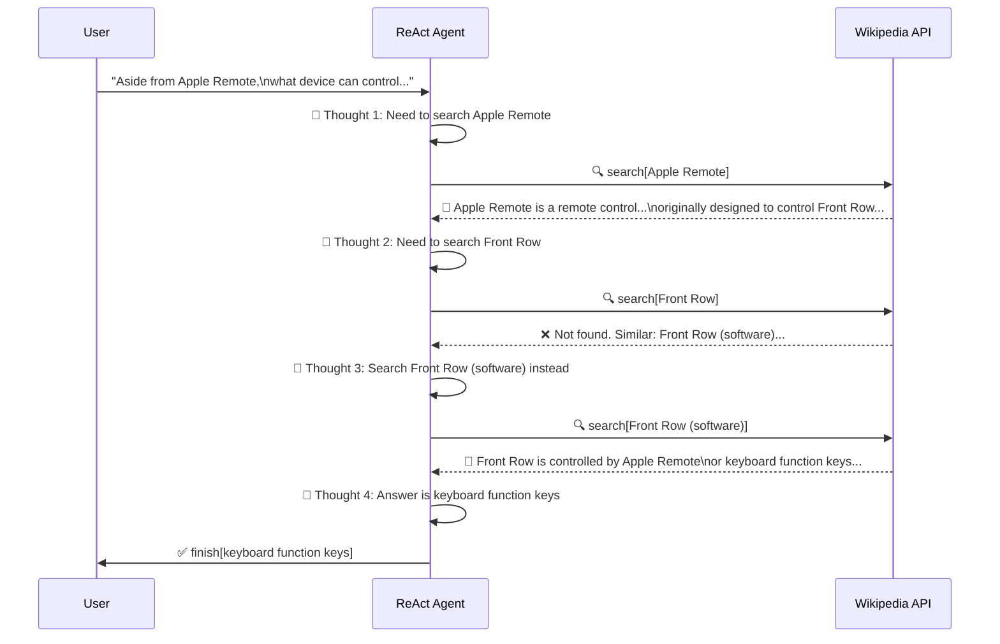
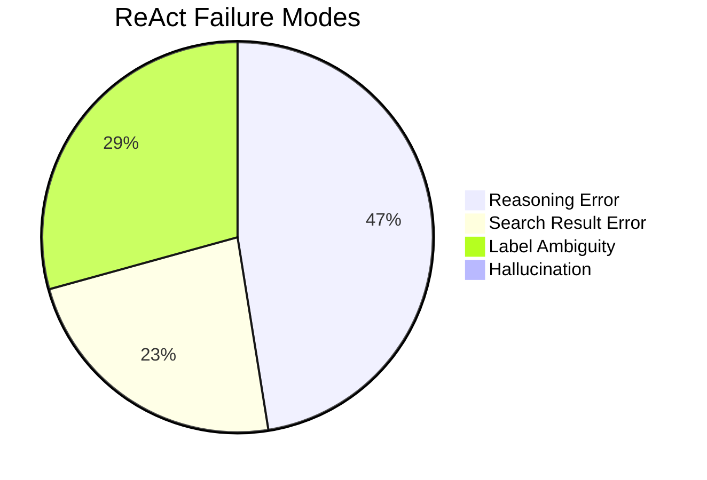
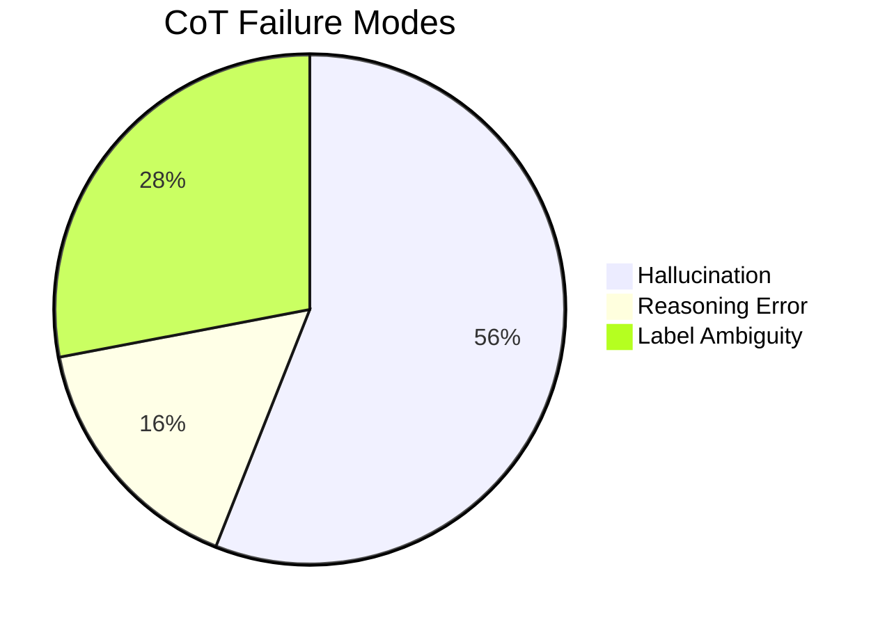

# ReAct: When LLMs Learn to "Think While Doing" — A Deep Dive into the Paper That Shaped the Agent Paradigm

> Paper: *ReAct: Synergizing Reasoning and Acting in Language Models*
> Authors: Shunyu Yao, Jeffrey Zhao, Dian Yu, Nan Du, Izhak Shafran, Karthik Narasimhan, Yuan Cao
> Affiliations: Princeton University & Google Research, Brain team
> Venue: ICLR 2023
> Link: https://arxiv.org/abs/2210.03629

This article provides a comprehensive review and analysis of the ReAct paper for students learning about Large Language Models (LLMs). We examine the paper across five dimensions: motivation, methodology, experimental findings, limitations, and lasting impact on the field.

---

## 1. Background: Why Reasoning and Acting Must Not Be Studied in Isolation

### 1.1 The Human Intelligence Analogy

The paper opens with a compelling analogy: imagine cooking in a kitchen. Between each physical action, your mind naturally produces verbal reasoning:

- **Progress tracking**: "Everything is cut, time to heat the water"
- **Exception handling**: "No salt — I'll use soy sauce and pepper instead"
- **Information seeking**: "How do I prepare dough? Let me look it up"

Meanwhile, you also **act** to support your reasoning — opening the fridge to check ingredients, consulting a recipe. This tight coupling of thought and action is fundamental to how humans solve problems efficiently.

The paper draws on the psychological theory of "inner speech" (Vygotsky, 1987; Luria, 1965), which posits that language serves not only as a communication tool but as a critical mechanism for cognitive self-regulation and strategic planning.

### 1.2 The Disconnection in LLM Research

By 2022, two parallel research lines had developed independently:

| Research Line | Representative Work | Core Capability | Fundamental Weakness |
|--------------|---------------------|-----------------|---------------------|
| **Reasoning** | Chain-of-Thought (CoT) | Generating reasoning chains for complex problems | A "black box" process relying entirely on internal knowledge, prone to hallucination, with no external verification |
| **Acting** | WebGPT, SayCan | Executing actions in interactive environments | Lacking high-level reasoning, goal planning, and the ability to reflect and adjust |

ReAct's core insight: **these two lines should not be independent — they must be unified into a single framework**.

---

## 2. The ReAct Method: An Elegant Core Idea

### 2.1 Formal Definition

In a standard agent-environment interaction, the agent receives observation $o_t$ at time step $t$ and takes action $a_t$ based on context $c_t$, within action space $A$.

ReAct's key innovation is **augmenting the action space**:

$$\hat{A} = A \cup L$$

where $L$ is the space of natural language. Actions in $L$ are called "thoughts" or "reasoning traces." They **do not affect the external environment** (producing no observation feedback) but serve to:

- Compose and reason about useful information from the current context
- Update the context $c_{t+1} = (c_t, \hat{a}_t)$ to support subsequent reasoning or acting

This design is remarkably elegant: no architectural modifications, no additional training — just a conceptual expansion of what counts as an "action."

### 2.2 The Many Roles of Thought

The paper demonstrates that thoughts can serve diverse functions:

| Thought Type | Example | Function |
|-------------|---------|----------|
| **Task decomposition** | "I need to search X, find Y, then find Z" | Breaking complex goals into sub-steps |
| **Information extraction** | "X was started in 1844" | Distilling key facts from observations |
| **Commonsense reasoning** | "X is not Y, so Z must instead be..." | Applying prior knowledge for logical inference |
| **Progress tracking** | "Now I find a lettuce. Next, I need to take it." | Maintaining working memory and current state |
| **Exception handling** | "Front Row is not found. I need to search Front Row (software)" | Adjusting strategy upon failure |
| **Answer synthesis** | "...so the answer is X" | Integrating collected information into a final conclusion |

### 2.3 Implementation: Few-Shot Prompting

ReAct is implemented through few-shot in-context learning with a frozen LLM (primarily PaLM-540B):

- Human annotators write example trajectories consisting of interleaved Thought, Action, and Observation steps
- These examples are included in the prompt, teaching the LLM to generate in the same format

For **reasoning-intensive tasks** (e.g., QA), thoughts and actions strictly alternate (dense thought). For **decision-making tasks** (e.g., text games), thoughts appear sparsely at key decision points, with the model deciding when to "pause and think."

The beauty of this approach: **writing prompts is as natural as writing down your own thinking process**. No special formatting or complex template engineering required.

### 2.4 ReAct Core Mechanism Diagrams

The following diagrams visualize the core operating mechanism of the ReAct framework:

**ReAct Complete Execution Flow:**

**ReAct vs CoT vs Act-Only Paradigm Comparison:**

**ReAct Interaction Sequence with Wikipedia API:**

**ReAct vs CoT Failure Mode Comparison:**

---

## 3. Experimental Design and Key Results

### 3.1 Four Diverse Benchmarks

The paper validates ReAct across four significantly different tasks:

| Task | Dataset | Type | Challenge |
|------|---------|------|-----------|
| Multi-hop QA | HotpotQA | Knowledge Reasoning | Reasoning across multiple Wikipedia articles |
| Fact Verification | FEVER | Knowledge Reasoning | Determining whether Wikipedia supports or refutes a claim |
| Text Game | ALFWorld | Interactive Decision Making | Multi-step household tasks in a simulated environment |
| Web Navigation | WebShop | Interactive Decision Making | Purchasing products on a simulated shopping website |

The cross-domain experimental design itself is a strength, demonstrating ReAct's generality as a framework.

### 3.2 Knowledge Reasoning Results

On HotpotQA and FEVER, ReAct uses a simple Wikipedia API with three actions: `search[entity]`, `lookup[string]`, and `finish[answer]`.

**Core results (PaLM-540B):**

| Method | HotpotQA (EM) | FEVER (Acc) |
|--------|:-------------:|:-----------:|
| Standard | 28.7 | 57.1 |
| CoT | 29.4 | 56.3 |
| CoT-SC (21 samples) | 33.4 | 60.4 |
| Act | 25.7 | 58.9 |
| **ReAct** | **27.4** | **60.9** |
| ReAct → CoT-SC | **35.1** | 62.0 |
| CoT-SC → ReAct | 34.2 | **64.6** |

Key observations:

**1. ReAct consistently outperforms Act**, proving the substantive value of reasoning traces for guiding actions.

**2. The ReAct vs CoT comparison is highly instructive**:
- On FEVER, ReAct significantly beats CoT (60.9 vs 56.3), because fact verification demands accurate external information retrieval
- On HotpotQA, CoT slightly leads (29.4 vs 27.4), because CoT offers more flexibility in constructing reasoning chains

**3. Combining both yields the best results**: ReAct → CoT-SC and CoT-SC → ReAct both significantly outperform either method alone. This reveals a crucial principle — **the fusion of internal and external knowledge is the way forward**.

### 3.3 Error Mode Analysis: The Most Valuable Finding

The paper manually annotated 100 samples each for ReAct and CoT on HotpotQA (50 correct + 50 incorrect), producing one of the paper's most academically significant contributions:

| Mode | ReAct | CoT |
|------|:-----:|:---:|
| **Success: True Positive** | 94% | 86% |
| **Success: False Positive** (hallucinated but coincidentally correct) | 6% | 14% |
| **Failure: Reasoning Error** | 47% | 16% |
| **Failure: Search Result Error** | 23% | — |
| **Failure: Hallucination** | 0% | 56% |
| **Failure: Label Ambiguity** | 29% | 28% |

This data reveals a fundamental trade-off:

- **CoT's fatal flaw is hallucination**: 56% of failures come from fabricated facts, because CoT relies entirely on internal knowledge with no external verification
- **ReAct's weakness is reasoning flexibility**: The alternating structure (Thought-Action-Observation) ensures factual grounding but constrains reasoning freedom, causing 47% of errors

The implication is profound: **no single method is perfect — each paradigm has inherent structural trade-offs**.

### 3.4 Interactive Decision Making Results

On ALFWorld and WebShop, ReAct demonstrates remarkable few-shot capabilities:

**ALFWorld Success Rates** (134 evaluation instances):

| Method | Overall Success Rate |
|--------|:-------------------:|
| BUTLER (imitation learning, 10^5 training examples) | 37% |
| Act (best of 6) | 45% |
| **ReAct (best of 6)** | **71%** |

**WebShop Results:**

| Method | Score | Success Rate |
|--------|:-----:|:-----------:|
| IL+RL (10,587 training examples) | 62.4 | 28.7% |
| Act (1-shot) | 62.3 | 30.1% |
| **ReAct (1-shot)** | **66.6** | **40.0%** |

With just 1-2 few-shot examples, ReAct dramatically outperforms imitation and reinforcement learning methods trained on tens of thousands of examples. This powerfully demonstrates that **LLMs can efficiently transfer pre-trained knowledge to novel interactive tasks through the "think while doing" paradigm**.

### 3.5 Fine-tuning Experiments: An Underappreciated Finding

The paper includes a crucial but often overlooked experiment comparing fine-tuning performance on HotpotQA:

- During prompting: ReAct performs worst on smaller models (simultaneously learning reasoning and acting is too demanding for in-context learning)
- **After fine-tuning with just 3,000 examples: ReAct becomes the best method**
  - PaLM-8B fine-tuned ReAct outperforms all PaLM-62B prompting methods
  - PaLM-62B fine-tuned ReAct outperforms all PaLM-540B prompting methods

This reveals that **the ReAct paradigm teaches models a transferable meta-skill — "how to retrieve and use information" — rather than memorizing facts**. In contrast, fine-tuning Standard or CoT essentially trains models to memorize (potentially hallucinated) knowledge, limiting generalization.

---

## 4. Four Distinctive Features of ReAct

### A. Intuitive and Easy to Design

Writing ReAct prompts is as natural as a human writing down their thinking process while performing a task. No special format, thought template, or careful example selection is required.

### B. General and Flexible

Because the thought space is free-form natural language and the thought-action occurrence format is adjustable (dense vs sparse), ReAct adapts to fundamentally different tasks — from QA to fact-checking, from text games to web navigation.

### C. Performant and Robust

ReAct demonstrates strong generalization from just 1-6 few-shot examples, consistently outperforming baselines across domains.

### D. Human-Aligned and Controllable

This is perhaps ReAct's most far-reaching contribution. The presence of reasoning traces enables:

- **Interpretability**: Humans can clearly see the model's reasoning process and decision basis
- **Diagnosability**: Errors can be easily traced to specific reasoning steps
- **Controllability**: Humans can modify the agent's behavior in real-time by editing thoughts

Figure 5 in the paper presents a compelling human-in-the-loop case: in an ALFWorld task, editing just two thoughts successfully corrected a previously failing trajectory. This kind of "on-the-fly policy editing" is impossible with traditional RL methods.

---

## 5. Limitations and Reflections

### 5.1 Context Length Bottleneck

Complex tasks require extensive few-shot examples to demonstrate reasoning and acting patterns, which can easily exceed the LLM's context window. This motivated the paper's fine-tuning experiments.

### 5.2 Rigidity of the Alternating Structure

While the thought-action-observation structure ensures grounding, it sacrifices reasoning flexibility. In scenarios requiring long reasoning chains, forced insertion of action/observation steps may disrupt the coherence of thought.

### 5.3 Dependence on External Environment Quality

23% of ReAct's errors stem from uninformative search results. When external tools return low-quality information, the model struggles to recover. This exposes an inherent fragility of the grounding paradigm — the environment you ground in must itself be reliable.

### 5.4 Repetitive Generation

The paper notes a specific technical issue: the model sometimes repeatedly generates the same thought-action pairs, entering a loop. The authors speculate this may be due to greedy decoding, and that beam search could help mitigate this.

### 5.5 Unexplored Multimodal Settings

All environments in the paper are text-based. Real-world agents typically need to process visual, audio, and other multimodal inputs. ReAct's performance and adaptation in these settings remain unexplored.

---

## 6. Knowledge Extension: ReAct's Place in LLM Agent History

### 6.1 Building on CoT's Reasoning Paradigm

Chain-of-Thought (CoT, Wei et al., 2022) is ReAct's most direct predecessor. CoT discovered that LLMs can generate intermediate reasoning steps when prompted with "let's think step by step" examples. But CoT is fundamentally a "closed-loop fantasy" — reasoning occurs entirely inside the model, with no external world verification.

ReAct's contribution lies in **breaking this closed loop**, enabling reasoning to interact with the external world.

### 6.2 Seeding the Modern Agent Ecosystem

After ReAct's publication, its core ideas rapidly evolved into the foundational DNA of the entire LLM Agent ecosystem:

| Subsequent Work | Relationship to ReAct |
|-----------------|----------------------|
| **LangChain Agent** | Directly implements the Thought-Action-Observation loop |
| **AutoGPT / BabyAGI** | Extends ReAct's ideas to autonomous task planning and execution |
| **Reflexion** (Shinn et al., 2023) | Adds a "reflection" mechanism on top of ReAct, enabling Agents to learn from failure |
| **Toolformer** (Schick et al., 2023) | Uses fine-tuning rather than prompting to learn tool usage |
| **Tree of Thoughts** (Yao et al., 2023) | Same first author's follow-up, expanding linear reasoning to tree-structured search |
| **Function Calling** (OpenAI, 2023) | Productizes ReAct's Action concept into an API calling capability |

### 6.3 The Deeper Insight: Agent = Reasoning + Acting + Memory + Tools

ReAct established a clear conceptual framework: a complete LLM Agent requires at minimum four core components:

1. **Reasoning**: Thinking, planning, reflection
2. **Acting**: Executing operations, calling tools
3. **Memory**: Tracking context, maintaining state (implicitly achieved through thoughts in ReAct)
4. **Tool Interface**: A standardized way to interact with external environments

This framework remains the best mental model for understanding LLM Agent design today.

---

## 7. Key Concept Clarifications

Several core concepts are essential for understanding this paper, particularly the ones that are easily confused:

### 7.1 Reasoning vs Acting

- **Reasoning**: The model generates internal thinking processes without interacting with the external environment. Typical example: CoT
- **Acting**: The model generates action instructions executed by an external environment, receiving feedback. Typical example: WebGPT
- **ReAct's innovation**: Interleaving both within a single generation sequence

### 7.2 Grounding

A central concept in the ReAct paper. Grounding means the model's reasoning process can be **verified and anchored** through interaction with the external world, rather than floating entirely within the model's internal knowledge.

- CoT is "ungrounded" — reasoning relies entirely on internal knowledge
- ReAct is "grounded" — reasoning can access real information at any time through Actions/Observations

### 7.3 Hallucination

In NLP, hallucination refers to the model generating content that appears plausible but is factually incorrect. The paper's error analysis clearly shows:

- 56% of CoT's errors come from hallucination
- ReAct reduces hallucination to 0% (in failure modes) through external retrieval
- But this introduces 23% "search result errors"

This is essentially a **risk transfer**: from uncontrollable internal hallucination to observable, diagnosable external information quality issues.

### 7.4 In-Context Learning

ReAct's core implementation mechanism. Without modifying model parameters, the model "learns" new behavioral patterns solely through examples provided in the prompt. This means ReAct's cost is extremely low — no training required, just prompt design.

---

## 8. Practical Advice for LLM Learners

### 8.1 How to Implement ReAct Hands-On

If you want to build a ReAct-style Agent yourself, here is a recommended learning path:

1. **Understand prompt design**: Carefully study the complete prompts in Appendix C, understanding the Thought-Action-Observation alternation pattern
2. **Start with simple tasks**: Build a ReAct Agent that can call a search engine to answer questions
3. **Expand the toolset**: Gradually add calculator, code executor, database query, and other tools
4. **Handle edge cases**: Design error recovery mechanisms, maximum step limits, and fallback strategies (like the paper's ReAct → CoT-SC)

### 8.2 Recommended Follow-Up Reading

In priority order:

1. **CoT (Wei et al., 2022)**: Understanding ReAct's direct predecessor
2. **Self-Consistency (Wang et al., 2022)**: Understanding the CoT-SC baseline in the paper
3. **Reflexion (Shinn et al., 2023)**: A significant improvement on ReAct
4. **Toolformer (Schick et al., 2023)**: The fine-tuning route for tool learning
5. **Tree of Thoughts (Yao et al., 2023)**: The same author's further exploration of reasoning structures

---

## 9. Overall Assessment

### Strengths

- **The core idea is remarkably simple and elegant**: Adding thought to the action space is almost "obvious" in hindsight — but it is precisely such insights that tend to be most transformative
- **Comprehensive and rigorous experimental design**: Spanning four significantly different domains with thorough baseline comparisons and ablation studies
- **Deep and insightful error analysis**: The quantitative comparison of CoT and ReAct failure modes is one of the paper's most valuable academic contributions
- **Established the LLM Agent paradigm**: A vast body of subsequent work builds on this foundation

### Limitations

- Prompting approach is constrained by context window length
- Fine-tuning experiments are limited in scale (3,000 examples), unable to fully demonstrate ReAct's potential at larger training scales
- All environments are text-based, with no multimodal settings explored
- Systematic analysis of thought quality control is lacking

### Historical Significance

ReAct is more than a technical paper — it is a paradigm manifesto. In an elegantly minimal form, it answers a fundamental question: **How can LLMs seamlessly combine thinking and acting, like humans, to solve complex tasks?** The Thought-Action-Observation paradigm it established has become the cornerstone of virtually every LLM Agent framework that followed. For any student of LLMs, this paper is essential reading for understanding modern AI Agents.
