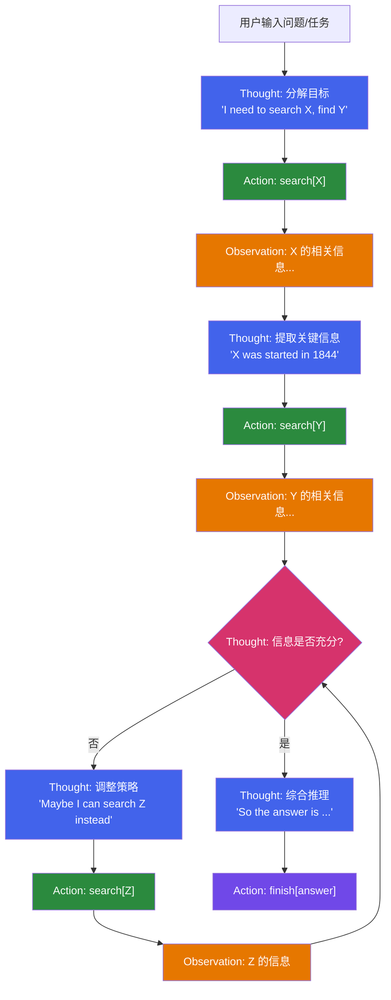
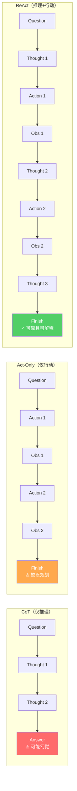
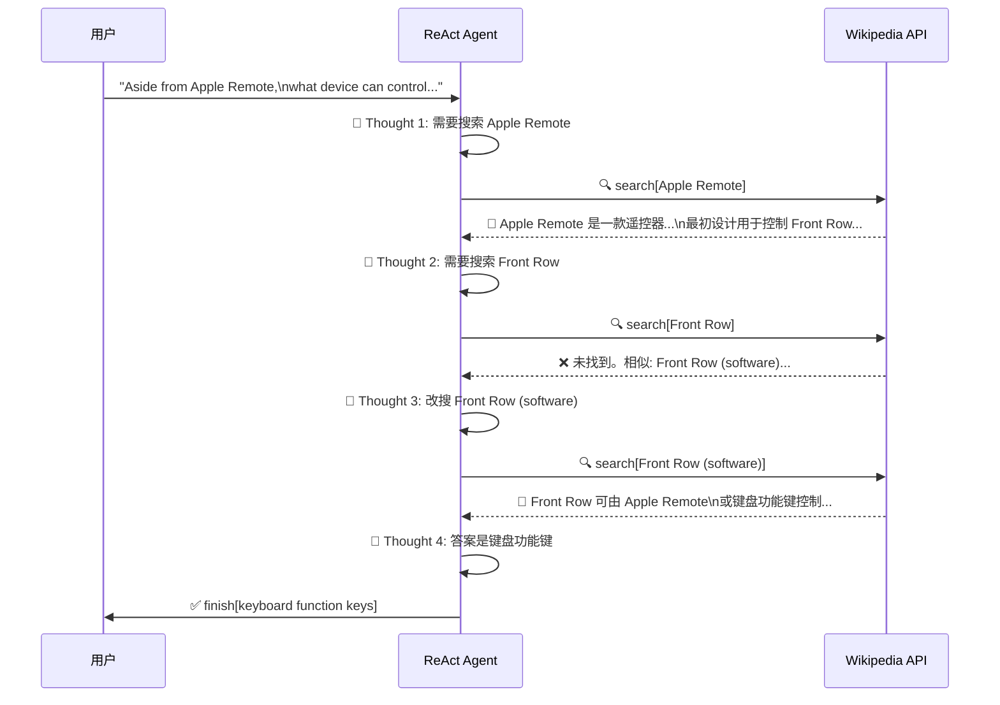
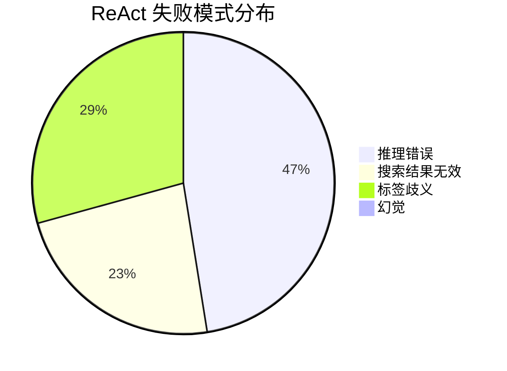
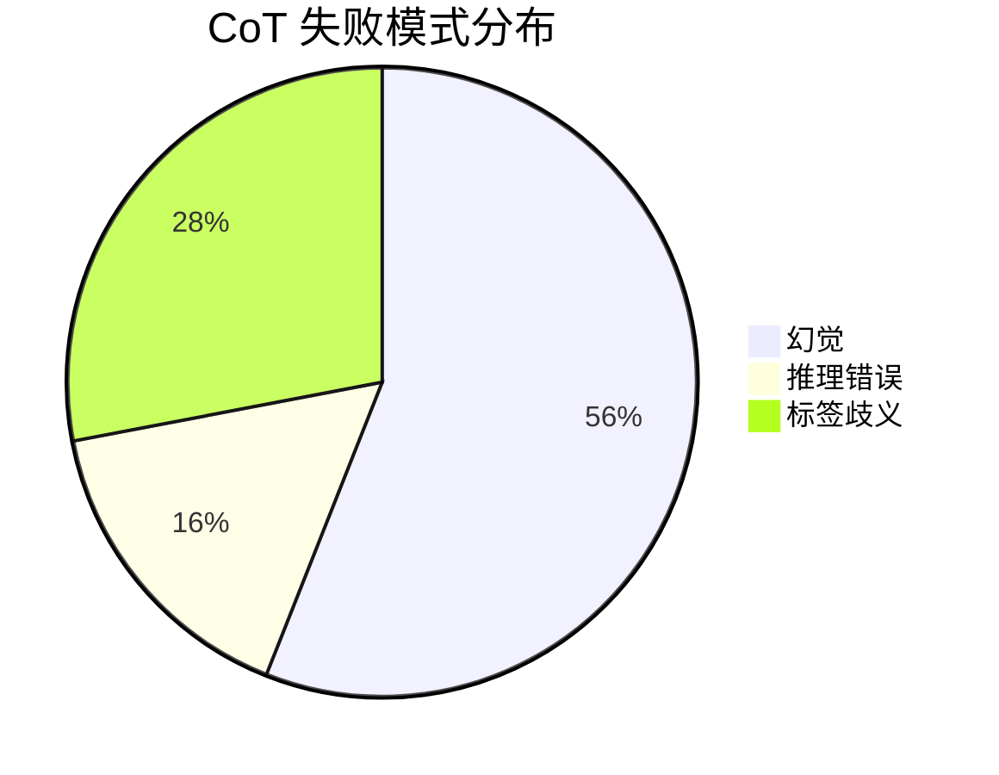

# ReAct: 当大语言模型学会"边想边做" —— 一篇改变 LLM Agent 范式的论文精读

> 论文：*ReAct: Synergizing Reasoning and Acting in Language Models*
> 作者：Shunyu Yao, Jeffrey Zhao, Dian Yu, Nan Du, Izhak Shafran, Karthik Narasimhan, Yuan Cao
> 机构：Princeton University & Google Research, Brain team
> 发表：ICLR 2023
> 链接：https://arxiv.org/abs/2210.03629

本文面向正在学习大语言模型（LLM）的同学，对 ReAct 这篇里程碑式论文进行详细评鉴与深度解析。我们将从"为什么需要 ReAct""它到底做了什么""实验说明了什么""它的局限在哪""对后续工作的深远影响"五个维度展开，力图帮助读者建立起对 LLM Agent 范式的系统理解。

---

## 一、论文背景：推理与行动，为何不能各自为政？

### 1.1 人类智能的启示

论文开篇借用了一个非常生动的比喻：想象你在厨房做菜。在每两个具体动作之间，你的脑海中会自然产生语言化的"内心独白"：

- **追踪进度**："菜都切好了，现在该烧水了"
- **处理异常**："没有盐了，用酱油和胡椒代替吧"
- **寻求外部信息**："面团怎么做来着？让我搜一下"

同时，你也会通过**行动**来支撑推理——打开冰箱看看有什么食材、翻开菜谱查看步骤。这种"思考"与"行动"的紧密交织，正是人类高效解决问题的核心机制。

这里引用了心理学中"内部言语"（inner speech）理论，来自 Vygotsky 和 Luria 等学者的研究。该理论认为，语言不仅是交流工具，更是人类认知调控和策略执行的重要手段。

### 1.2 LLM 面临的割裂困境

在 2022 年的研究格局下，LLM 的"推理"和"行动"能力被分别研究，形成了两条独立的研究路线：

| 路线 | 代表工作 | 核心能力 | 根本缺陷 |
|------|----------|----------|----------|
| **推理路线** | Chain-of-Thought (CoT) | 生成推理链以解决复杂问题 | 推理过程是"黑盒"——完全依赖模型内部知识，容易产生幻觉，无法获取外部信息进行事实验证 |
| **行动路线** | WebGPT、SayCan | 在交互环境中执行动作 | 缺乏高层次推理和目标规划能力，只会机械执行而不会反思和调整 |

ReAct 的核心洞察是：**这两条路线不应该是独立的，而应该被整合到一个统一的框架中**。

---

## 二、ReAct 方法：优雅至极的核心思想

### 2.1 形式化定义

ReAct 的方法论可以用一个极简的数学表达来概括。

在标准的智能体-环境交互框架中，智能体在时间步 t 接收观察 $o_t$，根据上下文 $c_t$ 执行动作 $a_t$。传统的动作空间为 $A$。

ReAct 的关键创新在于**扩展动作空间**：

$$\hat{A} = A \cup L$$

其中 $L$ 是自然语言空间。处于 $L$ 中的动作被称为"思考"（thought）或"推理轨迹"（reasoning trace），它们**不会影响外部环境**（不会产生环境反馈），而是用于：

- 在当前上下文中组织和推理有用信息
- 更新上下文 $c_{t+1} = (c_t, \hat{a}_t)$ 以支撑后续的推理或行动

这个设计堪称精妙：它没有修改模型架构，没有引入额外训练，仅仅是在概念层面将"思考"纳入了智能体的动作空间。

### 2.2 思考的多种用途

论文中展示了 thought 可以扮演的多种角色：

| 思考类型 | 示例 | 功能 |
|----------|------|------|
| **任务分解** | "I need to search X, find Y, then find Z" | 将复杂目标拆解为子步骤 |
| **信息提取** | "X was started in 1844" | 从观察结果中提取关键事实 |
| **常识推理** | "X is not Y, so Z must instead be..." | 利用先验知识进行逻辑推断 |
| **进度追踪** | "Now I find a lettuce. Next, I need to take it." | 维护工作记忆，标记当前状态 |
| **异常处理** | "Front Row is not found. I need to search Front Row (software)" | 面对失败时调整搜索策略 |
| **答案综合** | "...so the answer is X" | 整合已收集信息得出最终结论 |

### 2.3 实现方式：Few-shot Prompting

ReAct 的实现极其简洁——它通过 few-shot in-context learning 来引导冻结的 LLM（主要使用 PaLM-540B）。具体来说：

- 人工编写若干示例轨迹（trajectory），每个轨迹由交替出现的 Thought、Action、Observation 步骤组成
- 将这些示例作为 prompt 的一部分，让 LLM "学会"以同样的格式生成推理和行动

对于**推理密集型任务**（如问答），Thought 和 Action 严格交替出现（dense thought）。
对于**决策密集型任务**（如文本游戏），Thought 只在关键节点稀疏出现（sparse thought），让模型自主决定何时"停下来想一想"。

这种设计的美妙之处在于：**prompt 的撰写就像人类写下自己的思考过程一样自然**，没有任何特殊格式要求或复杂的模板设计。

### 2.4 ReAct 核心机制图

下面的图表直观展示了 ReAct 框架的核心运行机制：

**ReAct 完整运行流程：**

**ReAct vs CoT vs Act-Only 范式对比：**

**知识推理任务中 ReAct 与 Wikipedia API 的交互序列：**

**ReAct 与 CoT 错误模式对比：**

---

## 三、实验设计与核心结果

### 3.1 实验涵盖的四大任务

论文在四个差异显著的基准任务上验证了 ReAct：

| 任务 | 数据集 | 类型 | 挑战 |
|------|--------|------|------|
| 多跳问答 | HotpotQA | 知识推理 | 需要跨多个Wikipedia文章推理 |
| 事实验证 | FEVER | 知识推理 | 判断命题是否被维基百科支持/驳斥 |
| 文本游戏 | ALFWorld | 交互决策 | 在模拟家居环境中完成多步任务 |
| 网页导航 | WebShop | 交互决策 | 在模拟购物网站上根据指令购买商品 |

这种跨领域的实验设计本身就是一个亮点——它有力地论证了 ReAct 作为通用框架的适用性。

### 3.2 知识推理任务的结果

在 HotpotQA 和 FEVER 上，ReAct 使用了一个简单的 Wikipedia API，支持三种操作：

- `search[entity]`：搜索实体页面
- `lookup[string]`：在当前页面中查找字符串
- `finish[answer]`：提交最终答案

**核心数据（PaLM-540B）：**

| 方法 | HotpotQA (EM) | FEVER (Acc) |
|------|:-------------:|:-----------:|
| Standard | 28.7 | 57.1 |
| CoT | 29.4 | 56.3 |
| CoT-SC (21 samples) | 33.4 | 60.4 |
| Act | 25.7 | 58.9 |
| **ReAct** | **27.4** | **60.9** |
| ReAct → CoT-SC | **35.1** | 62.0 |
| CoT-SC → ReAct | 34.2 | **64.6** |

几个关键观察：

**1. ReAct 稳定优于 Act**，证明推理轨迹对指导行动具有实质性价值。

**2. ReAct vs CoT 的对比极具启发性**：
- 在 FEVER 上 ReAct 显著优于 CoT（60.9 vs 56.3），因为事实验证需要获取精确的外部信息
- 在 HotpotQA 上 CoT 略胜（29.4 vs 27.4），因为 CoT 在构建推理结构方面更灵活

**3. 两者结合效果最佳**：ReAct → CoT-SC 和 CoT-SC → ReAct 均显著超越单一方法。这揭示了一个重要原则——**内部知识与外部知识的融合是未来方向**。

### 3.3 错误模式分析：最有价值的发现

论文对 ReAct 和 CoT 在 HotpotQA 上各 100 个样本（50 正确 + 50 错误）进行了人工标注分析，这是全文最具学术价值的部分之一：

| 模式 | ReAct | CoT |
|------|:-----:|:---:|
| **成功：真正确** | 94% | 86% |
| **成功：假正确**（幻觉但碰巧答对） | 6% | 14% |
| **失败：推理错误** | 47% | 16% |
| **失败：搜索结果无效** | 23% | - |
| **失败：幻觉** | 0% | 56% |
| **失败：标签歧义** | 29% | 28% |

这组数据揭示了一个深刻的trade-off：

- **CoT 的致命伤是幻觉**：56% 的错误来自捏造事实。这是因为 CoT 完全依赖模型内部知识，没有外部验证机制
- **ReAct 的弱点是推理灵活性**：交替结构（Thought-Action-Observation）虽然保证了事实可靠性，却限制了推理的自由度，导致 47% 的错误来自推理过程

这个发现的启示非常深远：**没有完美的单一方法，每种范式都有其固有的结构性优缺点**。

### 3.4 交互决策任务的结果

在 ALFWorld（文本游戏）和 WebShop（网页购物）上，ReAct 展现了惊人的 few-shot 能力：

**ALFWorld 成功率**（134个评估实例）：

| 方法 | 整体成功率 |
|------|:---------:|
| BUTLER（模仿学习，10^5 条训练数据） | 37% |
| Act (best of 6) | 45% |
| **ReAct** (best of 6) | **71%** |

**WebShop 结果：**

| 方法 | 得分 | 成功率 |
|------|:----:|:-----:|
| IL+RL（10,587 条训练数据） | 62.4 | 28.7% |
| Act（1-shot） | 62.3 | 30.1% |
| **ReAct**（1-shot） | **66.6** | **40.0%** |

仅凭 1-2 个 few-shot 示例，ReAct 就大幅超越了用数万条数据训练的模仿学习和强化学习方法。这个结果充分展示了：**LLM 通过"边想边做"可以高效地将预训练知识迁移到全新的交互任务中**。

### 3.5 微调实验：被低估的重要发现

论文还做了一组容易被忽视但极为重要的实验——在 HotpotQA 上对比不同方法的微调效果：

- Prompting 阶段：ReAct 在小模型上表现最差（因为同时学习推理和行动对 in-context learning 要求太高）
- **微调阶段：仅用 3,000 个样本微调后，ReAct 变成了表现最好的方法**
  - PaLM-8B 微调 ReAct 超过所有 PaLM-62B prompting 方法
  - PaLM-62B 微调 ReAct 超过所有 PaLM-540B prompting 方法

这说明：**ReAct 的"推理+行动"模式本质上教会了模型"如何获取信息"这一可迁移的元技能**，而非死记硬背知识点。相比之下，微调 Standard 或 CoT 本质上是让模型记忆（可能是编造的）事实，泛化能力有限。

---

## 四、论文的四大独到特征

论文在第 2 节末尾总结了 ReAct 的四个独到特征，值得逐一品味：

### A. 直觉且易于设计

编写 ReAct prompt 就像人类在做任务时自然地写下思考过程——不需要任何特殊格式、特殊的 thought 模板、或精心挑选的示例。这极大降低了使用门槛。

### B. 通用且灵活

由于 thought 空间是自由的自然语言，且 thought-action 的出现格式可以灵活调整（dense vs sparse），ReAct 可以适配截然不同的任务——从 QA 到事实核查，从文本游戏到网页导航。

### C. 高性能且鲁棒

ReAct 在仅有 1-6 个 few-shot 示例的情况下就展现出强大的泛化能力，并在多个领域稳定优于基线方法。

### D. 人类对齐且可控

这是 ReAct 最深远的贡献之一。推理轨迹的存在使得：

- **可解释性**：人类可以清楚地看到模型的思考过程和决策依据
- **可诊断性**：可以轻松定位错误发生在哪个推理步骤
- **可干预性**：人类可以通过编辑 thought 来即时修正模型行为

论文中 Figure 5 展示了一个精彩的人机协作案例：在 ALFWorld 任务中，仅通过编辑两条 thought，就成功纠正了原本失败的轨迹。这种"在线策略编辑"是传统 RL 方法无法实现的。

---

## 五、局限性与反思

### 5.1 Prompting 的上下文长度瓶颈

复杂任务需要大量的 few-shot 示例来展示推理和行动的模式，但这很容易超出 LLM 的上下文窗口限制。这也是论文中微调实验的出发点之一。

### 5.2 推理-行动交替结构的刚性

虽然交替结构保证了 grounding，但也牺牲了推理的灵活性。在需要长链推理的场景中，被迫插入 Action/Observation 步骤可能打断思维的连贯性。

### 5.3 对外部环境质量的依赖

ReAct 23% 的错误来自搜索结果无效。当外部工具返回的信息质量不佳时，模型很难自行恢复。这暴露了"接地"范式的固有脆弱性——你接地的环境本身需要可靠。

### 5.4 重复生成问题

论文提到了一个具体的技术问题：模型有时会反复生成相同的 thought-action 对，陷入死循环。论文推测这可能与贪心解码有关，beam search 等更好的解码策略或许能缓解。

### 5.5 未探索的多模态场景

论文中所有交互环境都是文本化的。真实世界的 Agent 通常需要处理视觉、语音等多模态输入，ReAct 在这些场景中的表现和适配方式尚未被探索。

---

## 六、知识延伸：ReAct 在 LLM Agent 发展史中的位置

### 6.1 上承：CoT 开创的推理范式

Chain-of-Thought (CoT, Wei et al., 2022) 是 ReAct 最直接的前驱。CoT 发现了 LLM 的一个惊人属性：只要在 prompt 中展示"让我们一步一步思考"的示例，模型就能学会生成中间推理步骤。但 CoT 本质上是一个"闭环幻想"——推理过程完全在模型内部，没有外部世界的校验。

ReAct 的贡献在于**打破了这个闭环**，让推理过程能够与外部世界交互。

### 6.2 下启：现代 Agent 框架的基因

ReAct 论文发表后，它的核心思想迅速演化为整个 LLM Agent 生态的基础 DNA：

| 后续工作 | 与 ReAct 的关系 |
|----------|----------------|
| **LangChain Agent** | 直接实现了 ReAct 的 Thought-Action-Observation 循环 |
| **AutoGPT / BabyAGI** | 将 ReAct 的思想扩展到自主任务规划和执行 |
| **Reflexion** (Shinn et al., 2023) | 在 ReAct 基础上增加了"反思"机制，让 Agent 能从失败中学习 |
| **Toolformer** (Schick et al., 2023) | 通过微调而非 prompting 来学习工具使用 |
| **Tree of Thoughts** (Yao et al., 2023) | 同一作者的后续工作，将线性推理扩展为树状搜索 |
| **Function Calling** (OpenAI, 2023) | 将 ReAct 的 Action 概念产品化为 API 调用能力 |

### 6.3 深层启示：Agent = 推理 + 行动 + 记忆 + 工具

ReAct 为后来者建立了一个清晰的概念框架：一个完整的 LLM Agent 至少需要四个核心组件：

1. **推理能力**（Reasoning）：思考、规划、反思
2. **行动能力**（Acting）：执行操作、调用工具
3. **记忆机制**（Memory）：跟踪上下文、维护状态（ReAct 中通过 thought 隐式实现）
4. **工具接口**（Tool Interface）：与外部环境交互的标准化方式

这个框架至今仍是理解 LLM Agent 设计的最佳心智模型。

---

## 七、关键概念辨析

以下是阅读这篇论文时需要理解的几个核心概念，特别是容易混淆的部分：

### 7.1 Reasoning vs Acting

- **Reasoning（推理）**：模型在内部生成思考过程，不与外部环境交互。典型代表是 CoT
- **Acting（行动）**：模型生成动作指令，交由外部环境执行并接收反馈。典型代表是 WebGPT
- **ReAct 的创新**：将两者交织在同一个生成序列中

### 7.2 Grounding（接地）

这是 ReAct 论文中一个核心概念。所谓 grounding，是指模型的推理过程能够通过与外部世界的交互来**校验和锚定**，而不是完全漂浮在模型内部知识的"空中"。

- CoT 是"ungrounded"的——推理完全依赖内部知识
- ReAct 是"grounded"的——推理可以随时通过 Action/Observation 获取真实信息

### 7.3 Hallucination（幻觉）

在 NLP 中，幻觉指模型生成看似合理但事实上错误的内容。论文的错误分析清楚地展示了：

- CoT 的 56% 错误来自幻觉
- ReAct 通过外部检索将幻觉降到了 0%（在错误模式中）
- 但代价是引入了 23% 的"搜索结果错误"

这本质上是一种**风险转移**：从不可控的内部幻觉，转移为可观察、可诊断的外部信息质量问题。

### 7.4 In-context Learning（上下文学习）

ReAct 的核心实现方式。不修改模型参数，仅通过在 prompt 中提供示例，让模型"学会"新的行为模式。这也意味着 ReAct 的成本极低——不需要训练，只需要设计好 prompt。

---

## 八、写给 LLM 学习者的实践建议

### 8.1 如何动手实现 ReAct

如果你想亲手实现一个 ReAct 风格的 Agent，以下是建议的学习路径：

1. **理解 prompt 设计**：仔细阅读论文附录 C 中的完整 prompt，理解 Thought-Action-Observation 的交替模式
2. **从简单任务开始**：先实现一个能调用搜索引擎回答问题的 ReAct Agent
3. **扩展工具集**：逐步加入计算器、代码执行器、数据库查询等工具
4. **处理边界情况**：设计错误恢复机制、最大步数限制、回退策略（如论文中的 ReAct → CoT-SC）

### 8.2 阅读本文的延伸文献

按优先级排序：

1. **CoT (Wei et al., 2022)**：理解 ReAct 的直接前驱
2. **Self-Consistency (Wang et al., 2022)**：理解论文中 CoT-SC 基线
3. **Reflexion (Shinn et al., 2023)**：ReAct 的重要后续改进
4. **Toolformer (Schick et al., 2023)**：用微调替代 prompting 的工具学习路线
5. **Tree of Thoughts (Yao et al., 2023)**：同一作者对推理结构的进一步探索

---

## 九、总结评价

### 优点

- **核心思想极其简洁优雅**：将 thought 纳入 action space 这一想法，在形式上几乎是"显而易见"的，但正是这种"显而易见"的洞察往往最具变革力
- **实验设计全面而严谨**：覆盖四个差异显著的领域，基线对比充分，消融研究到位
- **错误分析深入且具启发性**：对 CoT 和 ReAct 错误模式的定量对比，是全文最有价值的学术贡献之一
- **开创了 LLM Agent 的范式框架**：后续大量工作在此基础上发展

### 局限

- Prompting 方法受限于上下文窗口长度
- 微调实验规模有限（3,000 条数据），未能充分展示 ReAct 在大规模训练下的潜力
- 所有环境均为文本化，未涉及多模态场景
- 对于 thought 质量的控制缺乏系统化分析

### 历史定位

ReAct 不仅是一篇技术论文，更是一个范式宣言。它以极简的形式回答了一个根本性问题：**LLM 如何像人类一样，将思考与行动无缝结合以解决复杂任务？** 它所建立的 Thought-Action-Observation 范式，成为此后几乎所有 LLM Agent 框架的基石。对于每一位学习 LLM 的同学来说，这篇论文都是理解现代 AI Agent 不可跳过的必读文献。
