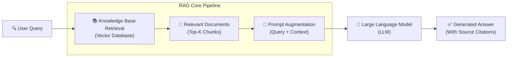
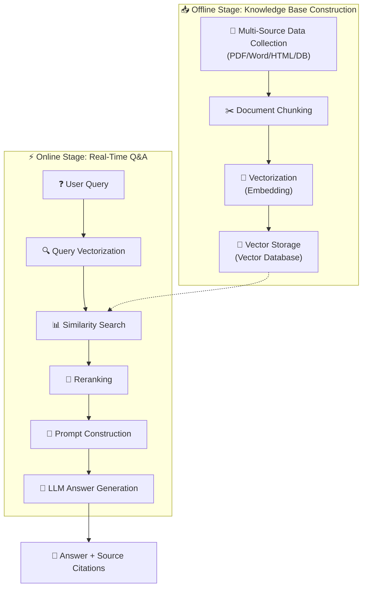
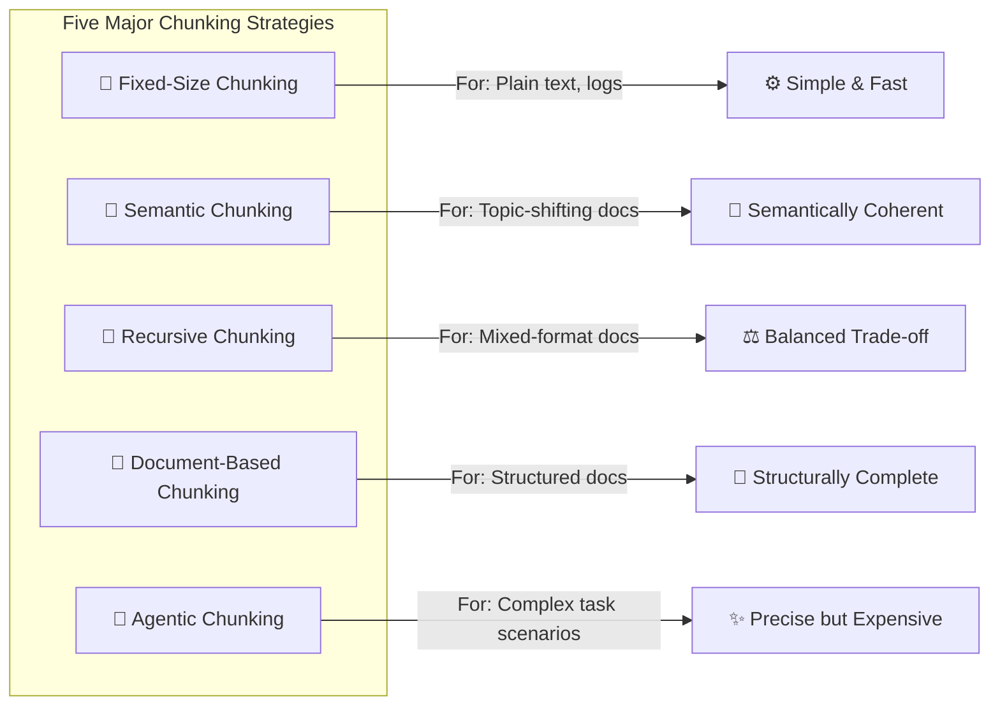
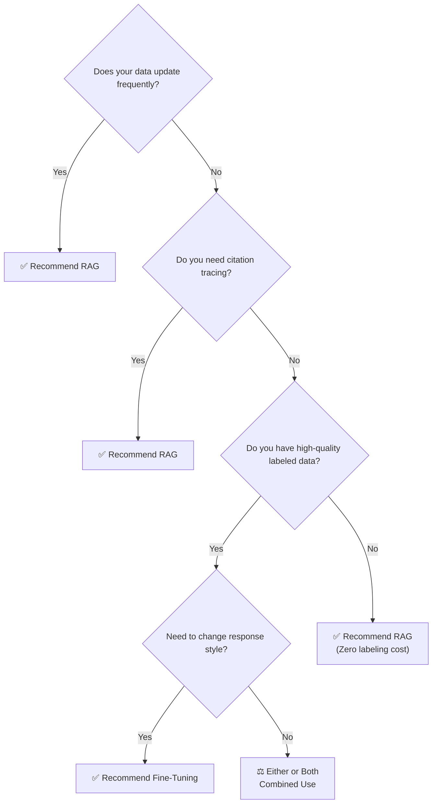

# RAG from Beginner to Production: A Complete Guide to Building Enterprise-Grade Retrieval-Augmented Generation Systems

> **Abstract**: Retrieval-Augmented Generation (RAG) has become the core technical paradigm for addressing the knowledge limitations and hallucination issues of large language models. This article systematically covers RAG's development background, working principles, core components, and end-to-end implementation, including knowledge base construction, chunking strategies, embedding model selection, vector databases, retrieval optimization, reranking, evaluation frameworks, and more, with comparative analysis and complete code examples using LangChain and LlamaIndex. Finally, we explore RAG's frontier directions and engineering challenges in production deployment, guiding you from theoretical foundations to industrial-grade practice.


## 1. Introduction: The "Knowledge Dilemma" of LLMs and the Birth of RAG

### 1.1 When Large Models "Confabulate"

Since late 2022, large language models (LLMs) represented by ChatGPT have swept the globe. They can write articles, generate code, and answer complex questions, demonstrating remarkable language understanding and generation capabilities. However, nearly everyone who has used an LLM has encountered the same awkward situation — the model "confidently talks nonsense."

This phenomenon is known as "hallucination" in academia. The model confidently delivers an answer, sometimes with seemingly reasonable reasoning, but the content is entirely inconsistent with facts. For instance, when asked "Who won the 2025 Nobel Prize in Physics?", the model might fabricate a name — because its knowledge is cut off at some point in the training data, and it knows nothing about events that occurred afterward.

The root cause of hallucination lies in a fundamental limitation of LLMs: their parametric knowledge is static. The knowledge "learned" during training is encoded in billions or even hundreds of billions of parameters, and once training is complete, this knowledge is "frozen." This means:

- **Knowledge update is difficult**: Updating the model's knowledge requires retraining or fine-tuning, which is extremely costly.
- **Insufficient domain knowledge coverage**: Pre-training corpora mainly come from the public internet, leaving the model unaware of enterprise-specific proprietary documents, industry secrets, and the latest regulations.
- **Inability to cite sources**: The model cannot clearly indicate information sources when generating output, which is unacceptable in fields like law, finance, and healthcare that demand high explainability.

The traditional solution is fine-tuning — performing additional training on the model with domain-specific data. But fine-tuning also faces challenges: each knowledge update requires retraining; data privacy concerns (sensitive enterprise data needs cloud-based training); and for small businesses, GPU computing costs are prohibitive. As one financial risk control system demonstrated, adopting a RAG architecture reduced model parameters by 60% while improving policy interpretation accuracy from 78% to 92%.

### 1.2 RAG: Equipping LLMs with a "Smart Librarian"

Facing these challenges, Retrieval-Augmented Generation (RAG) emerged. RAG's core concept is simple yet elegant: instead of making the model "remember" all knowledge, teach it to "look up" knowledge when needed.

Think of RAG as a "smart librarian":

- When a user asks a question, the librarian (RAG's retrieval module) quickly finds the most relevant books or articles on the shelves (knowledge base).
- Then these found materials, along with the user's question, are handed to an expert (the large language model).
- The expert provides an authoritative answer based on these materials and can include citations.

RAG was first proposed by Facebook AI Research (now Meta AI) in 2020 in the paper *Retrieval-Augmented Generation for Knowledge-Intensive NLP Tasks*. The paper's core contribution was designing an end-to-end differentiable architecture that jointly trains a pre-trained retriever and generator, achieving state-of-the-art results on multiple knowledge-intensive tasks at the time.

Since then, RAG has evolved from an academic concept to an industrial standard. Early RAG methods relied on single-round relevance retrieval of initial input to obtain relevant text fragments. As application scenarios became more complex, researchers progressively proposed iterative retrieval, hybrid retrieval, self-reflective retrieval, and other enhanced approaches, moving RAG from "usable" to "effective." RAG combines search layers with generation layers, enabling models to cite facts from proprietary data.



### 1.3 Three Core Values of RAG

Understanding RAG's value can be approached from three dimensions:

**1. Knowledge Freshness Layer**: Enables minute-level knowledge updates through vector databases. When enterprise policies change or new documents are added, only the vector index needs updating, and the RAG system can immediately use the latest information to answer questions without retraining the model.

**2. Trust Enhancement Layer**: RAG inherently supports citation tracing mechanisms. Since answers are generated based on specific retrieved documents, the system can clearly indicate "this answer comes from which page of which document," which is crucial in scenarios like legal documents and medical diagnosis. One legal document generation system improved clause citation accuracy to 95% by introducing a citation position prediction model.

**3. Cost Optimization Layer**: RAG reduces dependence on ultra-large parameter models. A medium-scale model paired with a high-quality knowledge base often outperforms a larger parameter model lacking domain knowledge in specific domains. This means significantly reduced inference compute costs.

RAG constructs a three-layer value system: the knowledge freshness layer enables minute-level updates through vector databases; the trust enhancement layer introduces citation tracing mechanisms for verifiable results; and the cost optimization layer reduces model parameter scale and inference compute costs.


## 2. RAG Technical Architecture Overview

Before diving into details, we need to establish a complete understanding of RAG system architecture. A standard enterprise-grade RAG system contains five core stages, forming a closed-loop data flow. As Microsoft Foundry documentation states, RAG follows a three-step process: retrieve, augment, and generate.



Next, we will dive deep into each layer of this architecture.

### 2.1 Knowledge Base Construction: From Raw Documents to Searchable Vectors

Knowledge base construction is the foundational engineering of a RAG system, and its quality directly determines the system's upper bound. This stage consists of three phases:

**Phase 1: Data Collection and Preprocessing**

RAG systems draw from highly diverse knowledge sources: structured data (e.g., tabular data in MySQL databases), semi-structured documents (e.g., PDF, Word, Markdown), and unstructured data (e.g., plain text, audio transcriptions). The data collection stage requires designing a unified ingestion pipeline to funnel data from different sources into the processing workflow.

The preprocessing stage includes text cleaning, format standardization, entity recognition, and other NLP tasks. For documents with significant noise (e.g., watermarks in scanned documents, ad bars on web pages), specialized cleaning strategies are needed.

**Phase 2: Document Chunking**

Splitting long documents into smaller pieces suitable for retrieval and generation is the most critical yet often overlooked step in RAG. The choice of chunking strategy directly determines the balance between retrieval precision and answer completeness. Since appended documents can be very large, chunking is an essential step in the RAG pipeline that directly impacts retrieval efficiency and accuracy. We will explore various chunking strategies in detail in Chapter 3.

**Phase 3: Vectorization and Storage**

Chunked text needs to be converted into vectors through embedding models. These vectors are coordinate points in high-dimensional space, where semantically similar texts are close to each other. Finally, the generated vectors, along with original text and metadata, are stored in a vector database for the online retrieval stage.

### 2.2 Retrieval Augmentation: Finding "The Right Few" from Massive Vectors

The retrieval stage is the "soul" of a RAG system, with the core challenge being — how to find the Top-K most relevant document chunks from millions or even billions of vectors with millisecond-level latency.

Modern RAG systems typically employ a three-tier retrieval mechanism:

- **Semantic Retrieval**: Based on vector similarity computation (Cosine Similarity), finding documents semantically closest to the query in vector space.
- **Keyword Retrieval**: Based on traditional information retrieval algorithms like BM25, handling exact match requirements (e.g., product model numbers, names, dates).
- **Hybrid Retrieval**: Combining results from semantic and keyword retrieval through weighted fusion, leveraging each method's strengths.

Additionally, the retrieval stage needs to handle advanced issues such as: How to handle complex multi-hop user queries? How to determine whether retrieval is actually needed (some questions the model can answer on its own)? How to prevent noisy documents from polluting the context? These advanced strategies will be discussed in detail in Chapter 5.

### 2.3 Generation Augmentation: Making LLMs "Speak with Evidence"

The core task of the generation stage is: effectively fusing retrieved documents with user queries to guide LLMs to generate accurate answers based on "factual evidence." While this seems simple, it involves two major technical challenges:

**Challenge 1: Context Window Management**

Although modern LLM context windows are getting larger (e.g., Claude's 200K, GPT-4 Turbo's 128K), this doesn't mean all retrieval results can be crammed in indiscriminately. Too much irrelevant information dilutes the model's attention on key content (the "context dilution" problem), degrading generation quality. Therefore, how to precisely select Top-K documents and how to compress and refine context content are important engineering considerations in the generation stage.

**Challenge 2: Prompt Engineering and Citation Tracing**

An excellent RAG system requires not only accurate answers but also clear citation sources. This demands explicit instructions in the prompt: annotate information sources in the answer, do not fabricate information not present in the retrieved content, and clearly inform the user when retrieved content is insufficient to answer.


## 3. Chunking Strategies: The "Golden First Step" of RAG

### 3.1 Why Is Chunking So Important?

If you ask RAG developers "what is the most underestimated critical step?", the overwhelming answer would be: **chunking**.

A chunking strategy is a method of breaking down large documents into smaller, manageable sections for AI retrieval. Poor chunking leads to irrelevant results, inefficiency, and reduced business value. In RAG systems, chunking involves splitting large documents into smaller, manageable pieces — these fragments can be paragraphs, sentences, phrases, or token-limited segments, enabling the model to more easily search and retrieve only what it needs.

The impact of chunking on RAG systems is comprehensive:

- **Retrieval Precision**: If chunks are too large, a single chunk may contain multiple different topics, creating "noise" during retrieval; if chunks are too small, context may be lost, causing critical information fragmentation.
- **Generation Quality**: LLMs depend on complete, coherent context to generate quality answers. Incorrectly split text chunks cause the model to "take things out of context."
- **System Efficiency**: Chunking strategy also determines vector database storage costs and retrieval speed. Finer chunking means more vector entries and higher retrieval overhead.

### 3.2 Five Major Chunking Strategies in Depth



#### Strategy 1: Fixed-Size Chunking

This is the most intuitive chunking approach: splitting text equally according to a predefined token count or character count. Since direct splitting can break semantic flow, it is recommended to maintain some overlap between two consecutive chunks. For example, setting chunk_size=500, chunk_overlap=50 means each chunk is 500 characters with 50 characters of overlap between adjacent chunks.

**Pros**: Simple to implement, fast processing, no dependency on complex models.
**Cons**: May cut in the middle of sentences or paragraphs, breaking semantic integrity; poor adaptability to documents with vastly different structures.

Fixed-size chunking is a common starting point for RAG projects, particularly suitable for scenarios where document structure is unknown or content is relatively uniform (e.g., logs, plain text), serving as a solid baseline. NVIDIA's cross-dataset evaluation shows that page-level chunking is the most effective strategy for RAG systems, providing the highest average accuracy and most consistent performance.

#### Strategy 2: Semantic Chunking

Semantic chunking splits text based on semantic similarity rather than physical structure, ensuring each chunk is highly topic-coherent. It typically works by computing the cosine similarity of sentence embeddings and splitting when similarity falls below a threshold.

Unlike fixed-size chunking, semantic chunking preserves the natural flow of language and maintains complete ideas. Because each chunk is more semantically rich, it improves retrieval accuracy, which in turn enables LLMs to produce more coherent and relevant responses.

**Pros**: Creates the most logically coherent chunks, significantly improving subsequent retrieval and generation quality; particularly suitable for documents with frequent topic shifts.
**Cons**: High computational cost (requires calling embedding models), slower processing, threshold tuning depends on experience.

#### Strategy 3: Recursive Chunking

Recursive chunking is a smarter combined strategy that tries multiple separators in priority order for recursive splitting. For example: first split by paragraph (\n\n), if paragraphs are still too large, split by sentence, and finally force-split by character count.

LangChain's `RecursiveCharacterTextSplitter` is the standard implementation of this strategy. It preserves higher-level semantic structures (paragraph > sentence > word) as much as possible, is highly adaptable, handles multiple document types, and is currently one of the most commonly used chunking approaches in RAG development.

**Pros**: Achieves a good balance between simplicity and semantic completeness.
**Cons**: Slightly more complex to implement, higher performance overhead than pure fixed-size chunking.

#### Strategy 4: Document-Based Chunking

Document-based chunking leverages the document's own metadata and structural information (e.g., heading hierarchy, tables, image captions, PDF page numbers) for intelligent splitting. For example, treating all content under a first-level heading as one large chunk, or making each table a separate chunk.

**Pros**: Perfectly aligns with the logical structure of specific document types (e.g., legal contracts, academic papers, manuals), with strong information organization.
**Cons**: Depends on high-quality document parsing and structure recognition, relatively weaker generalizability. BookRAG has explored this direction in depth, building hierarchical index structures to better handle complex documents with layered structures.

#### Strategy 5: Agentic Chunking (LLM-Based Chunking)

This is a more cutting-edge dynamic strategy that determines how to chunk based on the specific task an Agent will execute. The Agent first understands the task, then adaptively extracts and organizes the most relevant information blocks from the document.

**Pros**: Extremely high flexibility and specificity, maximizing task effectiveness.
**Cons**: Complex implementation, high cost, typically requires strong planning and reasoning capabilities, not yet widely adopted. The Adaptive Chunking framework was created to challenge the "one strategy fits all documents" paradigm, dynamically selecting the most appropriate chunking strategy based on the document's intrinsic characteristics.

### 3.3 Chunking Strategy Selection Guidelines

When choosing a chunking strategy, follow these principles:

1. **Start with recursive chunking**: For most scenarios, recursive chunking (chunk_size=500~1000 tokens, overlap=10%~20%) is a reliable choice.
2. **Fine-tune based on document type**: Prioritize document-based chunking for Markdown/HTML documents; prioritize semantic chunking for documents with frequent topic shifts like meeting notes.
3. **Evaluate and iterate**: Use evaluation frameworks like Ragas (detailed in Chapter 8) to test the actual performance of different chunking strategies and find the best fit for your business scenario.
4. **Consider dynamic overlap**: Overlap size is crucial for semantic continuity; NVIDIA's experiments show that 15% overlap performs best across multiple datasets.


## 4. Embedding Models and Vector Databases: The "Nervous System" of RAG

### 4.1 What Are Embeddings? The Magic from Semantics to Mathematics

If a RAG system is an intelligent agent, then embeddings are its "neural signals." Embeddings are numerical representations of meaning and patterns in language — these numbers help the system find information highly relevant to a question or topic.

Technically, embedding models convert words, sentences, or documents into a sequence of numbers called vectors. These vectors are coordinate points in high-dimensional space, where semantically similar texts are close together and semantically unrelated texts are far apart. The quality of embeddings directly determines the quality of context retrieved by the RAG system.

Embedding technology has a longer history than large language models, from early Word2Vec and GloVe to BERT and Sentence-BERT, to the latest BGE, Voyage, and LLM2Vec series — embedding model capabilities continue to evolve. Currently, most embeddings are created by language models, and unlike assigning static vectors to each word, language models create contextualized word vectors, giving the same word different representations in different contexts.

### 4.2 Key Evaluation Dimensions for Embedding Models

For RAG to efficiently retrieve relevant information, high-quality embedding models are essential. A suitable embedding model can significantly improve retrieval accuracy, answer relevance, and overall system performance while managing costs. When selecting embedding models, evaluate these key dimensions:

**1. Context Window**

The context window determines how much text the model can process at once. Larger windows allow the model to capture the overall semantics of long documents; smaller windows require splitting text into smaller chunks, increasing the risk of semantic fragmentation. For example, OpenAI's text-embedding-ada-002 supports a context window of 8,191 tokens, while BGE-M3 supports up to 8,192 tokens.

**2. Embedding Dimension**

Higher vector dimensions allow the model to express richer semantic information, but also increase storage and computation costs. Common dimension ranges from 384 (e.g., MiniLM-L6-v2) to 4,096 (e.g., Voyage-large-2). A balance between precision and efficiency must be found.

**3. Multilingual Support**

If your knowledge base contains documents in mixed Chinese-English or more languages, you need embedding models that support multiple languages. BGE-M3 and Multilingual-E5 excel in this area.

**4. Retrieval Performance**

MTEB (Massive Text Embedding Benchmark) is a community-operated authoritative leaderboard comparing over 100 text embedding models across multiple tasks, covering 1,000+ languages, serving as an excellent starting point for model selection.

### 4.3 Popular Embedding Models Overview and Selection Guide

Here is an overview of mainstream embedding models in the RAG field as of 2025:

| Model | Dimensions | Context Length | Features | Use Cases |
|-------|-----------|----------------|----------|-----------|
| OpenAI text-embedding-3-small | 1536 | 8191 | Cost-effective | General purpose |
| OpenAI text-embedding-3-large | 3072 | 8191 | Highest accuracy | High-quality requirements |
| BAAI/bge-large-zh-v1.5 | 1024 | 512 | Best for Chinese | Chinese knowledge bases |
| BAAI/bge-m3 | 1024 | 8192 | Multilingual, dense+sparse | Multilingual hybrid retrieval |
| voyage-code-2 | 1536 | 16000 | Code-optimized | Code retrieval |
| intfloat/e5-mistral-7b-instruct | 4096 | 32768 | LLM-based | Long documents, high precision |

**Selection Guide**:

- **Quick prototyping**: Start with OpenAI text-embedding-3-small or BGE-small.
- **Chinese scenarios**: Prioritize BAAI/bge-large-zh-v1.5.
- **Multilingual mix**: Consider BGE-M3, which supports both dense and sparse retrieval.
- **High precision needs**: Use OpenAI text-embedding-3-large or the Voyage series.
- **Long document scenarios**: Choose models with context windows larger than 8K (e.g., e5-mistral-7b-instruct or Voyage series).

The core principle of embedding model selection is **scenario-specific fit**: there is no universally optimal model, only the best choice for your business needs.

### 4.4 Vector Databases: The "Memory Center" of RAG

Vector databases are the core storage and retrieval engine of RAG systems. Their task is to find the most similar Top-K vectors among massive vectors with millisecond-level latency and return the corresponding original document content.

#### Mainstream Vector Database Comparison

| Product | Architecture | Single Index Capacity | Hybrid Search | Deployment | Typical Use Cases |
|---------|-------------|----------------------|---------------|------------|-------------------|
| Milvus | Distributed cloud-native | Billions | ✔️ | Self-hosted/Managed | Large-scale production |
| Qdrant | Open source/Cloud-hosted | Tens of millions | ✔️ | Self-hosted/Cloud | Real-time recommendations, RAG |
| Chroma | Embedded lightweight | Millions | ❌ | Local | Rapid prototyping |
| Weaviate | Distributed | Hundreds of billions | ✔️ | Self-hosted/Cloud | Knowledge graphs, hybrid search |
| Pinecone | Serverless | Billions | ✔️ | Fully managed | Maintenance-free production |
| PGVector | PostgreSQL extension | Millions | Partial | Self-hosted | Existing PostgreSQL stack |

Different scenarios have significantly different vector database requirements. RAG scenarios need to find content semantically relevant to user questions among massive documents, demanding high recall quality, flexible metadata addition, multi-tenancy support, and low storage costs. Recommendation systems prioritize high QPS and low latency.

#### Selection Decision Framework

**Scenario 1: Prototype Validation / Personal Projects**
- Recommended: Chroma or FAISS (in-memory)
- Reason: Zero configuration, fast development, free

**Scenario 2: Small-to-Medium Enterprise Applications**
- Recommended: Qdrant (self-hosted) or Tencent Cloud Vector Database
- Reason: Feature-complete, good performance, cost-effective

**Scenario 3: Large-Scale Enterprise Production**
- Recommended: Milvus or Pinecone
- Reason: Distributed architecture, high availability, powerful observability

**Scenario 4: Existing PostgreSQL Infrastructure**
- Recommended: PGVector
- Reason: Seamless integration, simple operations

**Scenario 5: Knowledge Graph Capabilities Needed**
- Recommended: Weaviate
- Reason: Native GraphQL support, built-in semantic search and knowledge graphs


## 5. Retrieval Optimization: Making RAG Go from "Usable" to "Effective"

Basic vector similarity search is sufficient for building a "usable" RAG prototype, but creating an "effective" production-grade system requires a series of advanced retrieval strategies.

### 5.1 Query Transformation: Helping Users "Ask Better Questions"

Users' original queries are often short, vague, lacking context, and far from optimal retrieval instructions. Query Transformation processes queries through LLMs to generate higher-quality retrieval signals.

**Strategy 1: HyDE (Hypothetical Document Embeddings)**

HyDE's approach is quite clever: have the LLM first generate a "hypothetical" answer document based on the user's question, then use this hypothetical document's vector for retrieval. Because the hypothetical document typically contains richer context and keywords, its retrieval effectiveness often surpasses the original short question. This method can significantly improve retrieval recall in the absence of labeled data.

**Strategy 2: Multi-Query Decomposition**

For complex questions, decompose them into multiple sub-queries, retrieve separately, then synthesize results. For example, break "What are the feature differences between Milvus and Zilliz Cloud?" into "What are Milvus's features?" and "What are Zilliz Cloud's features?", retrieve separately, then provide a combined answer.

**Strategy 3: Hypothetical Question Generation**

During the offline stage, use LLMs to generate 3-5 potential user questions for each document chunk. During the online stage, first perform query-to-query retrieval to search for related hypothetical questions, then find the corresponding document chunks. This query-to-query retrieval belongs to symmetric in-domain training, which is more intuitive than cross-domain Q-A retrieval.

### 5.2 Hybrid Retrieval: The Dual-Sword Combination of Keywords and Semantics

Each single retrieval method has its shortcomings: pure vector retrieval excels at semantic understanding but lacks sensitivity to exact keyword matching; pure keyword retrieval (e.g., BM25) is precise but cannot understand synonyms and context.

Hybrid Retrieval was created to bridge this gap. It simultaneously executes vector retrieval and keyword retrieval, then merges both sets of results through weighted fusion (e.g., RRF — Reciprocal Rank Fusion) into a final retrieval result. Modern RAG systems commonly employ a three-tier retrieval mechanism: semantic retrieval based on vector similarity computation, keyword retrieval through BM25 for exact matching needs, and hybrid retrieval combining semantic and keyword weighted fusion.

Code example (Python pseudocode):

```python
def hybrid_retrieval(query, vector_db, keyword_index):
    # Semantic retrieval
    semantic_results = vector_db.similarity_search(query, k=5)
    # Keyword retrieval
    keyword_results = keyword_index.search(query, limit=3)
    # Weighted fusion (example weights)
    final_results = merge_results(
        semantic_results, weight=0.7,
        keyword_results, weight=0.3
    )
    return final_results
```

### 5.3 Reranking: The "Final Gatekeeper" for Retrieval Results

If hybrid retrieval is the "preliminary round," then reranking is the "expert review." Reranking is the critical technical step in RAG systems for fine-grained reordering of initially retrieved document results. Positioned between initial retrieval and final generation, it re-scores and reorders the large set of candidate documents, placing the most relevant and accurate few at the top.

**Why Is Reranking Needed?**

Initial vector retrievers have inherent limitations: embedding models learn broad semantic similarity, but "relevance" is a more specific, task-oriented concept; to improve recall, more documents are typically retrieved, but these inevitably include imprecise or redundant ones.

Reranking introduces cross-encoders that perform deep pairwise interaction and relevance judgment between query and document, achieving far higher precision than embedding models that only compute vector distances.

**Popular Reranking Models**

| Model | Features | Use Cases |
|-------|----------|-----------|
| Cohere Rerank | Commercial API, excellent performance | Quick integration |
| BAAI/bge-reranker-v2-m3 | Open source, multilingual | Chinese/multilingual scenarios |
| Qwen3-Reranker-0.6B | Lightweight, open source | Resource-constrained environments |
| Jina Reranker | Long context support | Long document scenarios |

### 5.4 Index Strategy Optimization

Index strategy optimization is equally important. Hierarchical index construction is an effective approach: build two-level indexes for documents — summary-level index and document chunk-level index. During retrieval, first search at the summary level, then drill down to the corresponding document chunks. This strategy is particularly suitable for massive and hierarchical data scenarios, such as libraries or knowledge bases. Another important strategy is automatic document chunk merging: when the number of recalled child chunks under a parent chunk exceeds a threshold, directly provide the complete parent chunk as context to the LLM, balancing retrieval precision with context completeness.


## 6. Generation Optimization: Making LLM Output "Substantive"

### 6.1 Core Principles of Prompt Engineering

Even with perfectly retrieved documents, the LLM may still "turn a blind eye" if prompt design is poor. Prompt design for RAG scenarios should follow these principles:

**1. Explicitly Instruct "Only Base Answers on Provided Materials"**

The prompt should include instructions like: "Please answer the user's question based solely on the following reference materials. If the materials do not contain relevant information, clearly state that you don't know. Do not fabricate."

**2. Present Retrieved Content in Structured Format**

Present retrieved documents to the model in a clear structure (e.g., numbered, titled, source-annotated), helping the model distinguish between different information sources.

**3. Require Citation Sources**

Instruct the model in the prompt to annotate information sources in the answer, such as "Please list the document numbers you cited at the end of your answer."

**4. Constrain Answer Length and Format**

Specify the answer format (e.g., bullet points, comparison table) and length limits as needed, preventing verbose model responses.

### 6.2 Engineering Implementation of Citation Tracing

Citation tracing is key to building user trust in RAG systems. Its engineering implementation typically includes the following steps:

1. During the retrieval stage, assign unique identifiers and metadata (e.g., document name, page number) to each document chunk.
2. In the prompt, present identifiers alongside document content.
3. Require the model to annotate citation points using identifiers in the answer.
4. In post-processing, map identifiers back to links or positions in original documents.

One legal document generation system improved clause citation accuracy to 95% by introducing a citation position prediction model.


## 7. LangChain vs LlamaIndex: In-Depth Comparison of Two Major Frameworks

In RAG development, LangChain and LlamaIndex are two names you cannot avoid. Both are powerful tools for building LLM applications, but their design philosophies and core strengths are fundamentally different.

### 7.1 Architectural Philosophy Differences

**LangChain: Orchestration-First**

LangChain is a modular framework for building LLM applications, providing core components like Chains, Agents, Memory, and Tools. It is the Swiss Army knife for building multi-step workflows and tool-using agents. LangChain's philosophy is to provide a "universal toolbox" that lets developers flexibly combine various components to build complex AI applications.

**LlamaIndex: Retrieval-First**

LlamaIndex is a data-centric RAG framework with powerful document connectors (LlamaHub), advanced indexing, and query engines. Its philosophy is: if your core task is making an LLM deeply understand your private data, then retrieval quality is everything.

A simple rule of thumb: if your application needs complex workflow orchestration, multi-agent collaboration, tool calling, LangChain is more suitable; if your application is centered on document retrieval and Q&A, LlamaIndex is simpler and more focused.

### 7.2 Core Component Comparison

| Dimension | LangChain | LlamaIndex |
|-----------|-----------|------------|
| Core Abstractions | Chain, Agent, Memory | Index, QueryEngine, Retriever |
| Document Processing | Document Loaders (basic) | LlamaHub (rich loader ecosystem) |
| Chunking Strategy | TextSplitters (fixed/recursive) | NodeParser (finer-grained node management) |
| Index Types | VectorStore (external dependency) | Vector/List/Tree/Knowledge Graph Index |
| Retrieval Capability | Retrievers (composable) | QueryEngine + Router (more powerful) |
| Observability | Third-party integration dependent | Built-in RAG evaluation and observability tools |

### 7.3 Performance and Developer Experience

LlamaIndex typically leads in retrieval-centric workflows, including ingestion and query speed and quality in RAG scenarios. A 2025 comparison cited LlamaIndex as "40% faster in document retrieval than LangChain" in specific tests. Of course, actual results vary by chunking strategy, embedding model, and storage backend.

**Developer Experience**:
- LangChain: Easy to prototype chains and agents; LCEL (LangChain Expression Language) makes workflows readable and testable.
- LlamaIndex: Very smooth for pure RAG scenarios; with built-in loaders, chunkers, and query engines, you can go from PDF to precise answers quickly.

### 7.4 Selection Recommendations

**Choose LangChain**: If you need to build not just RAG but a complex AI application involving multi-turn conversations, tool calling, API integration, and state management, LangChain is the more mature choice.

**Choose LlamaIndex**: If your core task is building a high-quality knowledge base Q&A system with fine-grained control over indexing, retrieval, and evaluation, LlamaIndex is the more focused and efficient choice.

**Use Both**: This is not uncommon — many teams use LlamaIndex for document ingestion, indexing, and retrieval, and LangChain for agent logic and workflow orchestration.


## 8. Evaluation System: Data-Driven RAG System Evolution

"Without measurement, there is no optimization." RAG system evaluation is a systematic engineering effort that requires quantitative analysis from two dimensions: retrieval quality and generation quality.

### 8.1 Two Major Dimensions of RAG Evaluation

**Retrieval Dimension (Retrieval Quality)**

Evaluating the retriever's ability to find relevant documents:
- **Hit Rate**: Proportion of retrieval results containing at least one relevant document.
- **MRR (Mean Reciprocal Rank)**: Mean of the reciprocal rank of the first relevant document.
- **NDCG (Normalized Discounted Cumulative Gain)**: Relevance measure considering ranking positions.
- **Recall@K**: Proportion of relevant documents in the top K results.

**Generation Dimension (Generation Quality)**

Evaluating generated answer quality:
- **Faithfulness**: Whether the answer is faithful to the retrieved context, without hallucination.
- **Answer Relevancy**: Whether the answer directly addresses the user's question.
- **Context Relevancy**: How relevant the retrieved documents are to the question.

### 8.2 Ragas Framework in Practice

Ragas (Retrieval Augmented Generation Assessment) is an open-source framework specifically designed for evaluating RAG pipelines, providing a comprehensive set of quantifiable evaluation metrics. The Ragas framework evaluates three core capabilities of RAG systems through quantitative metrics: retrieval accuracy, generation quality, and information completeness.

**Four Core Ragas Metrics**:

1. **Context Precision**: Proportion of truly relevant documents among retrieved documents.
2. **Context Recall**: Extent to which retrieved documents cover the information needed for the answer.
3. **Faithfulness**: Whether the generated answer is consistent with the context.
4. **Answer Relevancy**: How relevant the answer is to the question.

**Quick Start with Ragas**:

```python
from ragas import evaluate
from ragas.metrics import (
    faithfulness,
    answer_relevancy,
    context_precision,
    context_recall
)
from datasets import Dataset

# Prepare evaluation data
data = {
    "question": ["What is RAG?"],
    "answer": ["RAG is Retrieval-Augmented Generation..."],
    "contexts": [["RAG combines retrieval and generation..."]],
    "ground_truth": ["RAG stands for Retrieval-Augmented Generation..."]
}
dataset = Dataset.from_dict(data)

# Run evaluation
result = evaluate(
    dataset,
    metrics=[faithfulness, answer_relevancy, context_precision, context_recall]
)
print(result)
```

### 8.3 Industrial-Grade Evaluation Standards Reference

Referencing industrial practice, establish an evaluation framework across four dimensions:

| Dimension | Metric | Industrial Standard |
|-----------|--------|-------------------|
| Retrieval Quality | Recall@K, NDCG | ≥0.85 |
| Generation Quality | BLEU, ROUGE | ≥0.75 |
| Faithfulness | Faithfulness (Ragas) | ≥0.90 |
| Response Latency | P99 Latency | <1000ms |


## 9. Hands-On: Building a RAG Q&A System with LangChain + Chroma

With the theory covered, let's build a minimal RAG Q&A system. We'll use LangChain + Chroma + OpenAI.

### 9.1 Environment Setup

```python
# Install dependencies
# pip install langchain langchain-openai chromadb pypdf tiktoken

import os
from langchain_openai import OpenAIEmbeddings, ChatOpenAI
from langchain_community.document_loaders import PyPDFLoader
from langchain.text_splitter import RecursiveCharacterTextSplitter
from langchain_community.vectorstores import Chroma
from langchain.chains import RetrievalQA

# Set OpenAI API key
os.environ["OPENAI_API_KEY"] = "your-api-key-here"
```

### 9.2 Knowledge Base Construction

```python
# 1. Load PDF document
loader = PyPDFLoader("path/to/your/document.pdf")
documents = loader.load()

# 2. Recursive chunking (recommended)
text_splitter = RecursiveCharacterTextSplitter(
    chunk_size=800,
    chunk_overlap=100,
    separators=["\n\n", "\n", ".", "!", "?", ";", " "]
)
chunks = text_splitter.split_documents(documents)
print(f"Document split into {len(chunks)} chunks")

# 3. Vectorization and storage
embeddings = OpenAIEmbeddings(model="text-embedding-3-small")
vectorstore = Chroma.from_documents(
    documents=chunks,
    embedding=embeddings,
    persist_directory="./chroma_db"
)
print("Vector database created")
```

### 9.3 Retrieval and Q&A

```python
# 4. Create retriever
retriever = vectorstore.as_retriever(
    search_type="similarity",  # Options: "similarity", "mmr"
    search_kwargs={"k": 4}     # Return Top-4 most relevant chunks
)

# 5. Initialize LLM
llm = ChatOpenAI(model="gpt-4o-mini", temperature=0)

# 6. Create RAG chain
qa_chain = RetrievalQA.from_chain_type(
    llm=llm,
    chain_type="stuff",  # Concatenate all retrieved content before feeding to LLM
    retriever=retriever,
    return_source_documents=True  # Return citation sources
)

# 7. Ask a question
query = "Please summarize the description of RAG's core architecture in the document"
result = qa_chain.invoke({"query": query})

print("Answer:", result["result"])
print("\nCitation Sources:")
for doc in result["source_documents"]:
    print(f"- Page {doc.metadata.get('page', '?')}: {doc.page_content[:100]}...")
```

### 9.4 Advanced: Adding Reranking

```python
from langchain.retrievers import ContextualCompressionRetriever
from langchain.retrievers.document_compressors import CohereRerank

# Enhance retrieval precision with Cohere reranking
compressor = CohereRerank(
    cohere_api_key="your-cohere-key",
    top_n=3  # Select Top-3 from initial retrieval results
)

compression_retriever = ContextualCompressionRetriever(
    base_compressor=compressor,
    base_retriever=retriever
)

# Use the enhanced retriever
qa_chain_enhanced = RetrievalQA.from_chain_type(
    llm=llm,
    retriever=compression_retriever,
    return_source_documents=True
)
```


## 10. RAG's Frontier Evolution: From Classical Paradigm to Agents

### 10.1 Self-RAG: Teaching Models to "Self-Reflect"

Self-RAG is a novel framework that enhances language model quality and factuality through retrieval and self-reflection. Its core innovation lies in training the model to adaptively retrieve passages when needed and using special tokens (Reflection Tokens) to generate and reflect on both retrieved content and its own generated results.

Self-RAG's working principle can be summarized as:
1. The model dynamically decides "whether retrieval is needed" during generation.
2. If retrieval is needed, it calls the retriever to obtain relevant passages.
3. After generating an answer fragment, the model self-evaluates the quality and relevance of that fragment.
4. Based on the evaluation, it decides whether to continue generating, re-retrieve, or revise content.

This mechanism lets AI "think thrice before answering," knowing when to look up information, when to think independently, and being able to self-evaluate answer reliability. Self-RAG's 6-step intelligent decision mechanism includes: determining retrieval necessity, executing retrieval, generating content, reflecting on content quality, deciding whether to revise or continue, and final output.

### 10.2 GraphRAG: Enhancing Relational Reasoning with Knowledge Graphs

Traditional RAG excels at handling "single-hop" questions (one question corresponding to one answer) but performs poorly on "multi-hop reasoning" (requiring chaining multiple information fragments to answer). GraphRAG was created to address this limitation.

GraphRAG constructs structured knowledge graphs from source corpora, enabling semantics-aware retrieval and multi-hop reasoning. Unlike pure vector retrieval, GraphRAG can trace explicit relationships between entities. For example, answering "Who was the most famous inventor who collaborated with Edison?" requires first finding Edison's collaborators, then identifying the most famous among them — this requires understanding the "collaboration" relationship and the "famous" attribute.

GraphRAG combines three powerful retrieval methods: knowledge graph-based relationship queries (SPARQL), semantic similarity-based vector search, and full-text keyword matching. This gives GraphRAG significant advantages over traditional RAG when handling complex, multi-document, multi-hop problems.

### 10.3 Multimodal RAG: Breaking the Text Boundary

As application scenarios expand, knowledge bases often contain a mix of text, images, tables, charts, and other modalities. Multimodal RAG achieves unified understanding of mixed text-image documents through cross-modal semantic alignment capabilities.

For example, when answering "What sales trend does the chart show?", the system needs to understand both the chart data in the image and the related text descriptions simultaneously. This requires the RAG system to have:
- Multimodal embedding models (mapping images and text to the same vector space)
- Multimodal document parsing (identifying images, tables, formulas in PDFs)
- Cross-modal retrieval and generation capabilities

Frameworks like HetaRAG have explored this direction by orchestrating vector indexes, knowledge graphs, full-text engines, and structured databases to achieve unified retrieval of cross-modal evidence.

### 10.4 Agentic RAG: From Tool to Agent

Agentic RAG is the fusion of RAG with AI Agent concepts. In traditional RAG, the retrieval-generation flow is fixed; in Agentic RAG, the system itself is an "agent" capable of dynamically planning and adjusting retrieval strategies based on the task.

A typical Agentic RAG workflow includes:
1. **Task Understanding**: Analyzing user intent and decomposing into subtasks.
2. **Tool Selection**: Deciding which retrieval tools to use (vector store, knowledge graph, SQL database, etc.).
3. **Multi-Round Interaction**: Deciding whether further retrieval is needed based on intermediate results.
4. **Result Synthesis**: Fusing multi-source information into a coherent answer.

LangGraph is an intelligent reasoning framework built on graph neural networks and RAG technology, with its core design philosophy of modeling knowledge associations through graph structures and combining dynamic retrieval mechanisms for adaptive optimization of the reasoning process. The LangGraph in-depth practice guide details three core patterns — Agentic RAG, Self-RAG, and Adaptive RAG — providing developers with complete technical solutions from theory to implementation.


## 11. RAG vs Fine-Tuning: How to Choose and Combine

### 11.1 Core Dimension Comparison

RAG and fine-tuning are two mainstream methods for adapting LLMs to specific domains, each with its own focus, advantages, and drawbacks:

| Dimension | Fine-Tuning | RAG |
|-----------|-------------|-----|
| Core Idea | Reshape the model (generalist → specialist) | External knowledge base (real-time information supplement) |
| Knowledge Update | Requires retraining, long cycle | Minute-level updates, instant effect |
| Data Requirements | Requires high-quality labeled data | Only needs document ingestion, no labeling |
| Explainability | Poor, black-box output | Strong, traceable citation sources |
| Hallucination Control | May still fabricate | Constrained to retrieved content, highly controllable |
| Compute Cost | High training cost, low inference cost | Additional retrieval latency |
| Use Cases | Style transfer, task customization | Knowledge Q&A, document queries |

Research on medical LLMs shows that RAG and FT+RAG consistently outperform fine-tuning alone across multiple metrics, particularly on LLAMA and PHI models. Fine-tuning provides deep domain expertise and specialized language understanding, while RAG ensures access to current, relevant information.

### 11.2 Technical Selection Decision Tree



### 11.3 Combined Use: SensiLoRA-RAG

RAG and fine-tuning are not mutually exclusive but rather complementary technologies that can work together. SensiLoRA-RAG is a two-stage framework combining parameter-sensitive Low-Rank Adaptation (LoRA) with RAG, designed to enhance LLM performance in domain-specific Q&A tasks. Experiments demonstrate it significantly outperforms baseline methods in answer accuracy, domain relevance, and adaptability.

The general approach for combined solutions is: first use LoRA for lightweight fine-tuning to familiarize the model with domain terminology and expression habits; then pair it with RAG for real-time knowledge support. This preserves the style adaptation advantages from fine-tuning while solving the knowledge update problem through RAG.


## 12. Engineering Challenges in Production Deployment

The gap between theoretical implementation and production deployment of RAG systems is enormous. Industry practice shows that a considerable proportion of enterprise RAG systems fail to meet expectations in production environments. As industry reports indicate, while over 80% of enterprises have experimented with AI, fewer than 30% have successfully scaled it to core business operations.

### 12.1 Latency and Throughput Optimization

Production RAG systems face strict latency requirements. A complete RAG pipeline includes: query vectorization (20-100ms), vector retrieval (10-50ms), reranking (50-200ms), and LLM generation (500-2000ms), with total latency potentially reaching several seconds.

**Optimization Strategies**:
- Choose appropriate vector indexes (HNSW achieves good balance between recall and performance)
- Use batch processing to reduce Embedding API call frequency
- Cache hot queries (Query → Answer cache)
- Choose faster small models (e.g., Phi-3, Llama-3-8B instead of large models)

### 12.2 Data Quality and Knowledge Freshness

RAG system effectiveness is highly dependent on knowledge base quality. "Garbage In, Garbage Out" applies equally to RAG.

**Key Challenges**:
- Incomplete document parsing (tables, images, formulas lost in PDFs)
- Missing metadata causing retrieval filtering failures
- Index rebuild window during knowledge updates

**Best Practices**:
- Use professional document parsing tools (e.g., MinerU, Unstructured)
- Establish a comprehensive metadata system (source, timestamp, version, permissions)
- Design incremental index update mechanisms instead of full rebuilds

### 12.3 Security and Access Control

Enterprise-grade RAG must support multi-tenant data isolation. Different users/departments should only access documents within their authorized scope.

**Implementation Approaches**:
- Add tenant ID/department ID as metadata filter fields in vector storage
- Enforce permission filter conditions during retrieval
- Desensitize sensitive documents before ingestion

### 12.4 Cost Control

RAG operational costs come mainly from three sources: Embedding API fees, vector database storage/compute fees, and LLM inference fees.

**Cost Optimization Ideas**:
- Use open-source embedding models instead of commercial APIs (e.g., BGE series)
- Tiered storage based on document hotness (hot/cold data separation)
- Use small models for simple questions, large models for complex ones
- Regularly clean expired and low-quality documents


## 13. Future Outlook and Summary

### 13.1 2026 RAG Technology Trends

RAG technology is evolving from "usable" to "intelligent." The following trends are worth watching:

1. **From RAG to Agentic RAG**: RAG will evolve from passive tools to agents capable of active planning and dynamic decision-making.
2. **Long Context and RAG Fusion**: As LLM context windows continue to expand, the "retrieval as context" paradigm will change, but RAG won't disappear — it will evolve from "finding content" to "finding precise content."
3. **Multimodal RAG Becomes Standard**: Mixed text-image Q&A will move from experimental to mainstream.
4. **Distributed RAG**: The emergence of distributed RAG frameworks like DRAGON will push RAG from centralized to edge-cloud collaborative architectures, achieving lower latency and better privacy protection.
5. **Evaluation-Driven Automatic Optimization**: Automated parameter tuning based on evaluation frameworks like Ragas will significantly reduce RAG system operational barriers.

### 13.2 Summary: RAG Best Practice Checklist

Condensing this article's core points into a practical checklist:

**Knowledge Base Construction**
- [ ] Choose appropriate chunking strategy based on document type (recursive chunking is a safe starting point)
- [ ] Set reasonable chunk_size (500-1000 tokens) and overlap (10-20%)
- [ ] Preserve document metadata (source, page number, heading hierarchy)
- [ ] Specially handle tables and images in PDFs

**Embedding and Vector Storage**
- [ ] Select appropriate embedding model based on language and scenario
- [ ] Consider scale, latency, and operational cost when selecting vector databases
- [ ] Establish incremental index update mechanisms

**Retrieval Optimization**
- [ ] Implement hybrid retrieval (vector + BM25)
- [ ] Introduce reranking to improve precision
- [ ] Decompose and transform complex queries

**Generation Optimization**
- [ ] Carefully design RAG prompts (explicit citation requirements)
- [ ] Implement citation tracing functionality
- [ ] Set answer confidence thresholds (trigger clarification dialogue at low confidence)

**Evaluation and Iteration**
- [ ] Build test sets (real user questions + expected answers)
- [ ] Use Ragas for continuous system performance monitoring
- [ ] Regularly A/B test different strategy combinations

**Production Operations**
- [ ] Implement permission isolation and audit logging
- [ ] Build monitoring and alerting systems (latency, error rate, hallucination rate)
- [ ] Design degradation strategies (fallback when retrieval fails)

---

*RAG technology is evolving at an astonishing pace. Today's best practices may be superseded by new breakthroughs tomorrow. But the core philosophy will not change: giving models access to the most accurate knowledge exactly when they need it most. Master this philosophy, and you have grasped the "Dao" of RAG — as for the "techniques," this article has mapped out the complete knowledge landscape for you, and the rest is about continuous refinement through practice.*
