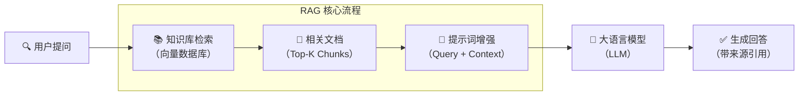
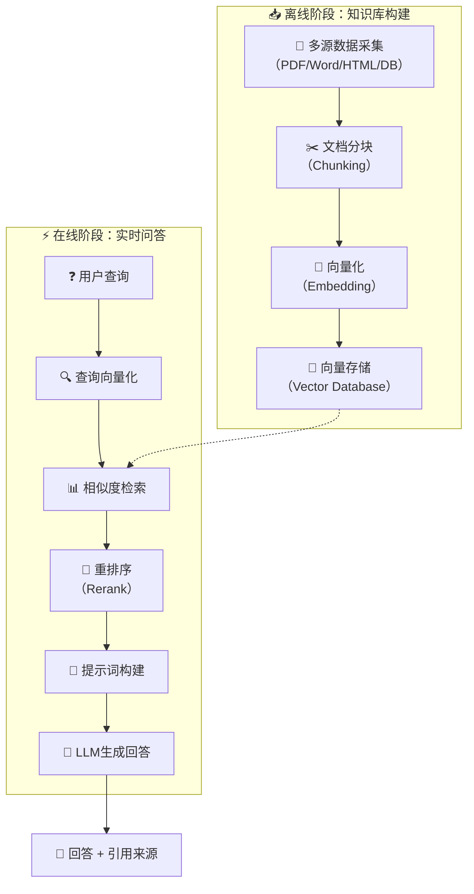
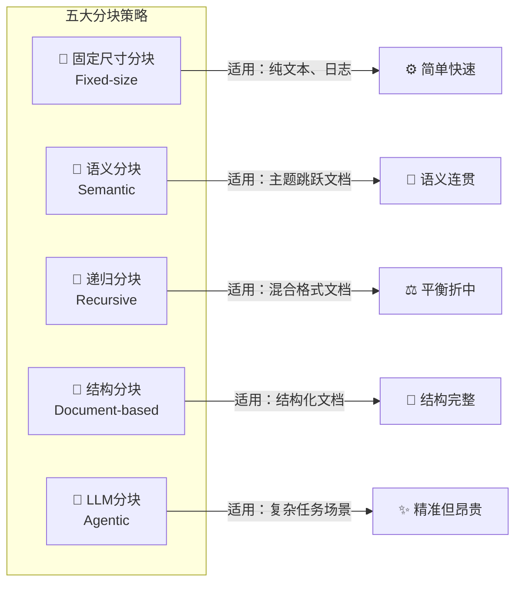
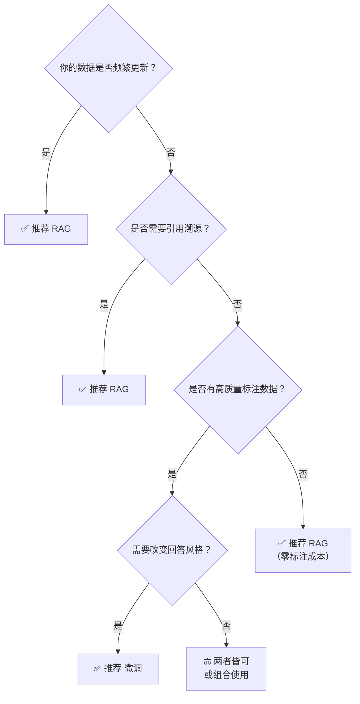

# RAG从入门到生产：构建企业级检索增强生成系统的完整指南

> **摘要**：检索增强生成（Retrieval-Augmented Generation，简称RAG）已成为解决大语言模型知识局限和幻觉问题的核心技术范式。本文将系统梳理RAG的发展背景、工作原理、核心组件与全流程实战，涵盖知识库构建、分块策略、嵌入模型选型、向量数据库、检索优化、重排序、评估框架等关键环节，并提供LangChain与LlamaIndex的对比分析与完整代码示例。最后，探讨RAG的前沿方向与生产环境落地的工程挑战，助你从理论入门到工业级实践。


## 一、引言：大语言模型的“知识困局”与RAG的诞生

### 1.1 当大模型也会“胡说八道”

2022年末以来，以ChatGPT为代表的大语言模型（Large Language Model, LLM）席卷全球。它们能够撰写文章、编写代码、回答复杂问题，展现出令人惊叹的语言理解和生成能力。然而，几乎所有使用过LLM的人都曾遭遇过同一种尴尬——模型“一本正经地胡说八道”。

这种现象在学术界被称为“幻觉”（Hallucination）。模型自信满满地给出一个答案，甚至附上看似合理的推理过程，但其内容却与事实完全不符。比如，当你询问“2025年诺贝尔物理学奖得主是谁”时，模型可能会煞有介事地编造一个名字——因为它的知识截止于训练数据的某个时间点，对之后发生的事情一无所知。

幻觉问题的根源在于LLM的根本性限制：它们依赖的参数化知识（Parametric Knowledge）是静态的。模型在训练阶段“学”到的知识被编码在数十亿乃至数千亿的参数中，一旦训练完成，这些知识就被“冻结”了。这意味着：

- **知识更新困难**：想要更新模型的知识，就需要重新训练或微调，成本极高。
- **专业知识覆盖不足**：预训练语料主要来自公开互联网，对特定企业内部的专有文档、行业机密、最新政策法规等一无所知。
- **无法提供来源**：模型输出内容时无法明确告知信息来源，这在法律、金融、医疗等对可解释性要求极高的领域是不可接受的。

传统解决方案是微调（Fine-tuning），即用领域特定数据对模型进行额外训练。但微调同样面临挑战：每次知识更新都需要重新训练；数据隐私问题（企业敏感数据需要上云训练）；以及对小企业而言，GPU算力成本难以承受。正如某金融风控系统的实践显示，采用RAG架构后，模型参数量减少60%，同时将政策解读准确率从78%提升至92%。

### 1.2 RAG：给大模型配一个“智能图书馆员”

面对上述困局，检索增强生成（Retrieval-Augmented Generation, RAG）应运而生。RAG的核心理念朴素而优雅：不让模型“记住”所有知识，而是让它学会在需要时“查找”知识。

你可以把RAG想象成一个“智能图书馆员”：

- 用户提问时，图书馆员（RAG的检索模块）快速在书架（知识库）中找到最相关的几本书或文章。
- 然后将这些找到的资料连同用户的问题，一起交给专家（大语言模型）。
- 专家基于这些资料给出权威回答，并可以附上引用的出处。

RAG由Facebook AI Research（现Meta AI）的研究团队于2020年在论文《Retrieval-Augmented Generation for Knowledge-Intensive NLP Tasks》中首次提出。论文的核心贡献是设计了一个端到端可微的架构，将预训练的检索器（Retriever）与生成器（Generator）联合训练，在多个知识密集型任务上取得了当时的最优结果。

自那以后，RAG经历了从学术概念到工业标准的技术演进。早期RAG方法依赖于对初始输入进行单轮相关性检索来获取相关文本片段。随着应用场景的复杂化，研究者逐步提出了迭代检索、混合检索、自反思检索等增强方案，使RAG从“能用”走向“好用”。RAG将搜索层与生成层结合，让模型能够引用来自自有数据的事实。



### 1.3 RAG的三大核心价值

理解RAG的价值，可以从三个维度来看：

**1. 知识保鲜层**：通过向量数据库实现分钟级知识更新。当企业政策发生变化或新文档入库时，只需更新向量索引，RAG系统就能立即使用最新信息回答问题，无需重新训练模型。

**2. 可信增强层**：RAG天然支持引用溯源机制。由于答案是基于检索到的具体文档生成的，系统可以明确指出“这个回答来自于哪份文件的哪一页”，这在法律文书、医疗诊断等场景中至关重要。某法律文书生成系统通过引入引用位置预测模型，将条款引用准确率提升至95%。

**3. 成本优化层**：RAG减少了对超大参数模型的依赖。一个搭配高质量知识库的中等规模模型，在特定领域的表现往往优于一个参数规模更大但缺乏领域知识的通用模型。这意味着推理算力消耗的显著降低。

RAG构建了三层价值体系：知识保鲜层通过向量数据库实现分钟级知识更新；可信增强层引入引用溯源机制，使生成结果可验证；成本优化层则减少模型参数规模，降低推理算力消耗。


## 二、RAG技术架构全景解析

在深入细节之前，我们需要先建立一个完整的RAG系统架构认知。一个标准的企业级RAG系统包含五个核心环节，形成一个数据流动的闭环链路。正如微软Foundry文档所述，RAG遵循三步流程：检索、增强和生成。



接下来，我们将按照这个架构逐层深入剖析。

### 2.1 知识库构建：从原始文档到可检索向量

知识库构建是RAG系统的基础工程，其质量直接决定了整个系统的上限。这个环节主要包含三个阶段：

**第一阶段：数据采集与预处理**

RAG系统的知识来源非常多样化：结构化数据（如MySQL数据库中的表格数据）、半结构化文档（如PDF、Word、Markdown）和非结构化数据（如纯文本、音频转录文字）。数据采集环节需要设计统一的接入管道，将不同来源的数据汇聚到处理流程中。

预处理阶段包含文本清洗、格式标准化、实体识别等NLP任务。对于包含大量噪音的文档（如扫描件中的水印、网页中的广告栏），需要专门的清洗策略。

**第二阶段：文档分块（Chunking）**

将长篇文档切分成适合检索和生成的小块，是RAG中最关键也最容易被忽视的环节。分块策略的选择直接决定了检索精度和答案完整性之间的平衡。由于附加文档可能非常大，分块是RAG流程中必不可少的一步，它直接影响检索的效率和准确性。我们将在第三章详细展开各种分块策略。

**第三阶段：向量化与存储**

分块后的文本需要通过嵌入模型（Embedding Model）转换为向量。这些向量是高维空间中的坐标点，语义相近的文本在向量空间中也彼此靠近。最后，生成的向量连同原始文本和元数据一起存入向量数据库，供在线检索阶段调用。

### 2.2 检索增强：从海量向量中找到“对的那几条”

检索环节是RAG系统的“灵魂”，其核心挑战在于——如何从数百万甚至数十亿的向量中，以毫秒级的延迟找到与用户问题最相关的Top-K个文档块。

现代RAG系统通常采用三级检索机制：

- **语义检索**：基于向量相似度计算（Cosine Similarity），在向量空间中寻找与查询语义最接近的文档。
- **关键词检索**：基于BM25等传统信息检索算法，处理精确匹配需求（如产品型号、人名、日期等）。
- **混合检索**：将语义检索和关键词检索的结果进行加权融合，取长补短。

此外，检索环节还需要处理一些高级问题，例如：如何应对用户的复杂多跳问题？如何判断是否真的需要检索（有些问题模型本身就能回答）？如何避免噪声文档污染上下文？这些进阶策略将在第五章详细讨论。

### 2.3 生成增强：让大模型“言之有据”

生成环节的核心任务是：将检索到的文档与用户查询进行有效融合，引导LLM基于“事实依据”生成准确答案。这看似简单，实则蕴含两大技术挑战：

**挑战一：上下文窗口管理**

现代LLM的上下文窗口虽然越来越大（如Claude的200K、GPT-4 Turbo的128K），但并不意味着可以无节制地塞入所有检索结果。过多的无关信息会稀释模型对关键内容的注意力（即“上下文稀释”问题），导致生成质量下降。因此，如何精准选择Top-K文档、如何压缩和精炼上下文内容，是生成环节的重要工程考量。

**挑战二：提示词工程与引用溯源**

优秀的RAG系统不仅需要答案准确，还需要明确的引用来源。这要求在提示词中明确指示模型：在回答中标注信息来源、不得编造检索内容中不存在的信息、当检索内容不足以回答时应明确告知用户。


## 三、分块策略：RAG的“黄金第一步”

### 3.1 分块为何如此重要？

如果问RAG开发者“最容易被低估的关键环节是什么”，绝大多数人会回答：**分块（Chunking）** 。

分块策略是一种将大型文档分解为较小、可管理的部分的方法，用于AI检索。糟糕的分块会导致结果不相关、效率低下并降低业务价值。在RAG系统中，分块是将大文档分割成更小、可管理的部分，这些片段可以是段落、句子、词组或受token限制的片段，使模型能更轻松地仅搜索和检索所需内容。

分块对RAG系统的影响是全方位的：

- **检索精度**：如果块太大，一个块里可能包含多个不同主题，检索时容易产生“噪音”；如果块太小，则可能丢失上下文，导致关键信息断裂。
- **生成质量**：LLM依赖完整、连贯的上下文来生成优质答案。被错误切割的文本块会让模型“断章取义”。
- **系统效率**：分块策略还决定了向量数据库的存储成本和检索速度。越精细的分块意味着越多的向量条目和越高的检索开销。

### 3.2 五大分块策略深度解析



#### 策略一：固定尺寸分块（Fixed-size Chunking）

这是最直观的分块方式：按照预定义的token数或字符数，将文本均等切分。由于直接分割会破坏语义流，建议在两个连续的块之间保持一些重叠。例如，设置chunk_size=500，chunk_overlap=50，意味着每个块500字符，相邻块之间有50字符的重叠区。

**优点**：实现简单、处理速度快、不依赖复杂模型。
**缺点**：可能在句子中间或段落中间切断，破坏语义完整性；对不同结构差异大的文档适应性差。

固定尺寸分块是RAG项目的常见起点，特别适合文档结构未知或内容比较单调的场景（如日志、纯文本），可作为不错的baseline。NVIDIA的跨数据集评估表明，页面级分块是RAG系统最有效的分块策略，可提供最高的平均准确性和最一致的性能。

#### 策略二：语义分块（Semantic Chunking）

语义分块根据文本的语义相似度而非物理结构进行切分，确保每个Chunk内部主题高度相关。工作方式通常是通过计算句子Embedding的余弦相似度，当相似度低于某个阈值时进行分割。

与固定大小分块不同，语义分块保持了语言的自然流畅并保留了完整的思想。由于每个块更加语义丰富，它提高了检索准确性，进而使LLM产生更加连贯和相关的响应。

**优点**：能创建逻辑上最连贯的Chunk，对后续检索和生成质量提升显著，特别适用于处理主题跳跃较多的文档。
**缺点**：计算成本高（需要调用Embedding模型），处理速度较慢，阈值调优依赖经验。

#### 策略三：递归分块（Recursive Chunking）

递归分块是一种更智能的组合式策略，按优先级顺序尝试多种分隔符进行递归分割。例如：优先按段落（\n\n）分割，如果段落仍过大，再按句子分割，最后才按字符数强制分割。

LangChain中的`RecursiveCharacterTextSplitter`正是这种策略的标准实现。它尽可能保留高级别的语义结构（段落>句子>词），适应性强，能处理多种类型文档，是目前RAG开发中最常用的分块方案之一。

**优点**：在简单性和语义完整性之间取得良好平衡。
**缺点**：实现稍复杂，性能开销高于纯固定大小分块。

#### 策略四：结构分块（Document-based Chunking）

结构分块利用文档本身的元数据和结构信息（如标题层级、表格、图片说明、PDF页码等）进行智能分割。例如，将一个一级标题下的所有内容作为一个大Chunk，或将每个表格单独作为一个Chunk。

**优点**：完美贴合特定类型文档（如法律合同、学术论文、手册）的逻辑结构，信息组织性强。
**缺点**：依赖高质量的文档解析和结构识别，通用性相对较弱。BookRAG正是在这个方向上进行了深入探索，通过构建层次化索引结构来更好地处理具有层级结构的复杂文档。

#### 策略五：LLM分块 / 智能体分块（Agentic Chunking）

这是一种更前沿的动态策略，根据Agent将要执行的具体任务来决定如何分块。Agent会先理解任务，然后自适应地从文档中提取和组织最相关的信息块。

**优点**：灵活性和针对性极高，能最大化任务效果。
**缺点**：实现复杂，成本高，通常需要强大的规划和推理能力，目前还不普及。Adaptive Chunking框架的出现正是为了挑战“一种策略适应所有文档”的范式，它根据文档的内在特征动态选择最合适的分块策略。

### 3.3 分块策略选型建议

选择分块策略时，建议遵循以下原则：

1. **从递归分块开始**：对于大多数场景，递归分块（chunk_size=500~1000 tokens，overlap=10%~20%）是一个可靠的选择。
2. **根据文档类型微调**：处理Markdown/HTML文档时优先考虑结构分块；处理会议记录等主题跳跃的文档时优先考虑语义分块。
3. **评估并迭代**：通过Ragas等评估框架（将在第八章详述）测试不同分块策略的实际效果，找到最适合你业务场景的方案。
4. **考虑动态重叠**：重叠区域的大小对语义连续性至关重要，NVIDIA的实验表明15%的重叠值在多个数据集上表现最佳。


## 四、嵌入模型与向量数据库：RAG的“神经系统”

### 4.1 什么是嵌入？从语义到数学的魔法

如果说RAG系统是一个智能体，那么嵌入（Embedding）就是它的“神经信号”。嵌入是对语言中含义与模式的数值化表示，这些数字帮助系统找到与问题或主题高度相关的信息。

从技术上讲，嵌入模型将词、句子或文档转换为一串称为向量的数字。这些向量是高维空间中的坐标点，语义相近的文本在向量空间中彼此靠近，语义无关的文本则相距较远。嵌入的质量直接决定了RAG系统检索到的上下文质量。

嵌入技术的历史比大语言模型更悠久，从早期的Word2Vec、GloVe到后来的BERT、Sentence-BERT，再到最新的BGE、Voyage、LLM2Vec系列，嵌入模型的能力在持续进化。目前，大多数嵌入都由语言模型创建，与给每个词分配静态向量不同，语言模型会创建上下文化的词向量，让同一词语在不同语境下拥有不同表示。

### 4.2 嵌入模型的关键评估维度

RAG要想高效地检索到相关信息，离不开高质量的embedding模型。一个合适的embedding模型，能在兼顾成本的基础上，显著提升检索的准确率、回答的相关性，以及整个系统的性能。选择嵌入模型时，需要重点评估以下维度：

**1. 上下文窗口（Context Window）**

上下文窗口决定了模型一次能处理的文本长度。窗口越大，模型越能捕获长文档的整体语义；窗口越小，则必须将文本切分成更小块，增加语义断裂的风险。例如，OpenAI的text-embedding-ada-002支持8191个token的上下文窗口，而BGE-M3支持高达8192个token。

**2. 向量维度（Embedding Dimension）**

向量维度越高，模型能表达的语义信息越丰富，但同时存储和计算成本也越高。常见的维度范围从384（如MiniLM-L6-v2）到4096（如Voyage-large-2）。需要在精度和效率之间找到平衡。

**3. 多语言支持**

如果你的知识库包含中英混合或更多语言的文档，需要选择支持多语言的嵌入模型。BGE-M3、Multilingual-E5等模型在这方面表现优异。

**4. 检索性能**

MTEB（Massive Text Embedding Benchmark）是社区运营的权威排行榜，比较了超过100种文本嵌入模型在多种任务上的表现，涵盖1000+语言，是选型的良好起点。

### 4.3 主流嵌入模型速览与选型建议

以下是2025年RAG领域的主流嵌入模型概览：

| 模型 | 维度 | 上下文长度 | 特点 | 适用场景 |
|------|------|------------|------|----------|
| OpenAI text-embedding-3-small | 1536 | 8191 | 性价比高 | 通用场景 |
| OpenAI text-embedding-3-large | 3072 | 8191 | 精度最高 | 对质量要求极高的场景 |
| BAAI/bge-large-zh-v1.5 | 1024 | 512 | 中文最优 | 中文知识库 |
| BAAI/bge-m3 | 1024 | 8192 | 多语言、稠密+稀疏 | 多语言混合检索 |
| voyage-code-2 | 1536 | 16000 | 代码优化 | 代码检索 |
| intfloat/e5-mistral-7b-instruct | 4096 | 32768 | LLM-based | 长文档、高精度 |

**选型建议**：

- **快速原型**：从OpenAI text-embedding-3-small或BGE-small开始。
- **中文场景**：优先选择BAAI/bge-large-zh-v1.5。
- **多语言混合**：考虑BGE-M3，它同时支持稠密和稀疏检索。
- **高精度需求**：使用OpenAI text-embedding-3-large或Voyage系列。
- **长文档场景**：选择上下文窗口大于8K的模型（如e5-mistral-7b-instruct或Voyage系列）。

选择嵌入模型的核心原则是**场景适配**：没有放之四海而皆准的最优模型，只有最适合业务需求的选择。

### 4.4 向量数据库：RAG的“记忆中枢”

向量数据库是RAG系统的核心存储和检索引擎。它的任务是在海量向量中以毫秒级延迟找到最相似的Top-K个向量，并返回对应的原始文档内容。

#### 主流向量数据库对比

| 产品 | 架构类型 | 单索引容量 | 混合检索 | 部署方式 | 典型场景 |
|------|----------|------------|----------|----------|----------|
| Milvus | 分布式云原生 | 百亿级 | ✔️ | 自建/托管 | 大规模生产环境 |
| Qdrant | 开源/云托管 | 千万级 | ✔️ | 自建/云 | 实时推荐、RAG |
| Chroma | 嵌入式轻量级 | 百万级 | ❌ | 本地 | 快速原型开发 |
| Weaviate | 分布式 | 千亿级 | ✔️ | 自建/云 | 知识图谱、混合搜索 |
| Pinecone | Serverless | 十亿级 | ✔️ | 全托管 | 免运维生产环境 |
| PGVector | PostgreSQL插件 | 百万级 | 部分 | 自建 | 已有PostgreSQL栈 |

不同场景对向量数据库的需求差异显著。RAG场景需要在海量文档中找到与用户问题语义相关的内容，对召回质量要求高，可灵活添加元信息，支持多租户，存储成本低。推荐系统则更看重高QPS和低延迟。

#### 选型决策框架

**场景一：原型验证/个人项目**
- 推荐：Chroma或FAISS（内存版）
- 理由：零配置、开发速度快、免费

**场景二：中小型企业应用**
- 推荐：Qdrant（自建）或腾讯云向量数据库
- 理由：功能完善、性能良好、性价比高

**场景三：大规模企业生产**
- 推荐：Milvus或Pinecone
- 理由：分布式架构、高可用性、强大的可观测性

**场景四：已有PostgreSQL基础设施**
- 推荐：PGVector
- 理由：无缝集成、运维简单

**场景五：需要知识图谱能力**
- 推荐：Weaviate
- 理由：原生支持GraphQL、内置语义搜索与知识图谱


## 五、检索优化：让RAG从“能用”到“好用”

基础的向量相似度搜索足以搭建一个“能用”的RAG原型，但要打造“好用”的生产级系统，还需要一系列进阶检索策略。

### 5.1 查询转换：帮用户“问得更好”

用户的原始查询往往简短、模糊、缺乏上下文，并非最佳的检索指令。查询转换（Query Transformation）通过LLM对查询进行“加工”，生成更优质的检索信号。

**策略一：HyDE（假设性文档嵌入）**

HyDE的做法非常巧妙：让LLM根据用户问题先生成一个“假设性”的答案文档，再用这个假设性文档的向量去检索。因为假设性文档通常包含了更丰富的上下文和关键词，其检索效果往往优于原始的简短问题。这一方法在缺乏标注数据的情况下能显著提高检索召回率。

**策略二：多查询分解（Multi-Query）**

对于复杂问题，可以将其分解为多个子查询分别检索，再综合结果。例如，将“Milvus和Zilliz Cloud功能差异是什么？”分解为“Milvus的功能特性有哪些？”和“Zilliz Cloud的功能特性有哪些？”，分别检索后再综合回答。

**策略三：假设性问题生成（Hypothetical Questions）**

在离线阶段先用LLM为每个文档块生成3-5个潜在用户问题，在线阶段先做query-to-query检索，搜索相关假设问题，再找到对应文档块。这种query-to-query检索属于对称域内训练，比跨域的Q-A检索更直观。

### 5.2 混合检索：关键词与语义的双剑合璧

单一检索方式各有短板：纯向量检索擅长语义理解但对精确关键词匹配敏感度不足；纯关键词检索（如BM25）精确但无法理解同义词和上下文。

混合检索（Hybrid Search）正是为弥补这一鸿沟而生。它同时执行向量检索和关键词检索，然后将两组结果通过加权融合（如RRF——Reciprocal Rank Fusion）合并为最终检索结果。现代RAG系统普遍采用三级检索机制：语义检索基于向量相似度计算，关键词检索通过BM25算法处理精确匹配需求，混合检索则结合语义与关键词的加权融合算法。

代码示例（Python伪代码）：

```python
def hybrid_retrieval(query, vector_db, keyword_index):
    # 语义检索
    semantic_results = vector_db.similarity_search(query, k=5)
    # 关键词检索
    keyword_results = keyword_index.search(query, limit=3)
    # 加权融合（示例权重）
    final_results = merge_results(
        semantic_results, weight=0.7,
        keyword_results, weight=0.3
    )
    return final_results
```

### 5.3 重排序：为检索结果做“最后把关”

如果说混合检索是“海选”，那么重排序（Rerank）就是“专家评审”。重排序是在RAG系统中对初步检索到的文档结果进行精细化重新排序的关键技术环节。它位于初始检索和最终生成之间，对初步检索到的大量候选文档进行重新评分和排序，将最相关、最准确的少量文档排在顶部。

**为什么需要重排序？**

初始的向量检索器存在固有局限性：Embedding模型学习的是广泛的语义相似性，但“相关”是一个更具体、更任务导向的概念；为了提高召回率通常会检索较多文档，但其中必然包含不精确或冗余的文档。

重排序通过引入交叉编码器，对查询和文档进行成对的深度交互和相关性判断，其精度远高于仅计算向量距离的嵌入模型。

**主流重排序模型**

| 模型 | 特点 | 适用场景 |
|------|------|----------|
| Cohere Rerank | 商业API，效果优秀 | 快速集成 |
| BAAI/bge-reranker-v2-m3 | 开源、多语言 | 中文/多语言场景 |
| Qwen3-Reranker-0.6B | 轻量级、开源 | 资源受限环境 |
| Jina Reranker | 长上下文支持 | 长文档场景 |

### 5.4 索引策略优化

索引策略优化同样不容忽视。分层索引构建是一种有效方案：为文档建立两级索引——摘要级别索引和文档块级别索引。检索时先在摘要层级检索，再深入到对应文档块检索。这种策略特别适合海量数据与分层数据场景，如图书馆或知识库。另一项重要策略是自动合并文档块：当某父块下的子块被召回数量超过阈值时，直接将完整的父块作为上下文提供给LLM，以平衡检索精度与上下文完整性。


## 六、生成优化：让大模型输出“言之有物”

### 6.1 提示词工程的核心原则

即便检索到了完美的文档，如果提示词设计不当，大模型仍可能“视而不见”。RAG场景下的提示词设计需要遵循以下原则：

**1. 明确指示“只能依据给定资料”**

提示词中应包含类似“请仅基于以下提供的参考资料回答用户的问题。如果资料中不包含相关信息，请明确表示不知道，不要编造。”的指令。

**2. 结构化呈现检索内容**

将检索到的文档以清晰的结构（如编号、标题、来源标注）呈现给模型，帮助模型区分不同信息源。

**3. 要求提供引用来源**

在提示词中要求模型在回答中标注信息来源，如“请在回答末尾列出你所引用的文档编号”。

**4. 限制回答长度与格式**

根据需要指定回答的格式（如分点列出、表格对比）和长度限制，避免模型冗长回答。

### 6.2 引用溯源的工程实现

引用溯源是RAG系统建立用户信任的关键。其工程实现通常包括以下步骤：

1. 在检索阶段，为每个文档块分配唯一标识符和元数据（如文档名、页码）。
2. 在提示词中，将标识符与文档内容一并呈现。
3. 要求模型在回答中使用标识符标注引用点。
4. 在后处理阶段，将标识符映射回原始文档的链接或位置。

某法律文书生成系统通过引入引用位置预测模型，将条款引用准确率提升至95%。


## 七、LangChain vs LlamaIndex：两大框架深度对比

在RAG开发中，LangChain和LlamaIndex是两个绕不开的名字。它们都是构建LLM应用的强大工具，但设计哲学和核心优势截然不同。

### 7.1 架构理念差异

**LangChain：编排优先（Orchestration-first）**

LangChain是一个用于构建LLM应用的模块化框架，提供链（Chains）、代理（Agents）、记忆（Memory）、工具调用（Tools）等核心组件。它是构建多步骤工作流和使用工具的代理的瑞士军刀。LangChain的理念是提供一个“通用工具箱”，让开发者可以灵活组合各种组件来构建复杂的AI应用。

**LlamaIndex：检索优先（Retrieval-first）**

LlamaIndex则是一个以数据为中心的RAG框架，拥有强大的文档连接器（LlamaHub）、先进的索引和查询引擎。它的理念是：如果你的核心任务是让大模型“吃透”你的私有数据，那么检索的质量就是一切。

简单的判断法则：如果应用需要处理复杂的工作流编排、多代理协作、工具调用，LangChain更合适；如果应用是以文档检索和问答为核心，LlamaIndex更简单、更专注。

### 7.2 核心组件对比

| 维度 | LangChain | LlamaIndex |
|------|-----------|------------|
| 核心抽象 | Chain、Agent、Memory | Index、QueryEngine、Retriever |
| 文档处理 | Document Loaders（基础） | LlamaHub（丰富的加载器生态） |
| 分块策略 | TextSplitters（固定/递归） | NodeParser（更细粒度的节点管理） |
| 索引类型 | VectorStore（依赖外部） | 向量/列表/树/知识图谱索引 |
| 检索能力 | Retrievers（可组合） | QueryEngine + Router（更强大） |
| 可观测性 | 依赖第三方集成 | 内置RAG评估和可观测性工具 |

### 7.3 性能与开发体验

LlamaIndex通常在以检索为中心的工作流程中处于领先地位，包括RAG场景中的摄取和查询速度以及质量。一项面向2025年的比较引用LlamaIndex在特定测试中“文档检索速度比LangChain快40%”。当然，实际结果会因分块策略、嵌入模型、存储后端而异。

**开发体验**：
- LangChain：易于原型设计链和代理，LCEL（LangChain Expression Language）使流程具有可读性和可测试性。
- LlamaIndex：对于纯RAG场景非常顺畅，可以使用内置的加载器、分块器和查询引擎，从PDF快速获得精确的答案。

### 7.4 选型建议

**选择LangChain**：如果你需要构建的不仅是RAG，而是一个包含多轮对话、工具调用、API集成、状态管理的复杂AI应用，LangChain是更成熟的选择。

**选择LlamaIndex**：如果你的核心任务是构建高质量的知识库问答系统，需要精细控制索引、检索和评估流程，LlamaIndex是更专注、更高效的选择。

**同时使用两者**：这并不罕见——许多团队用LlamaIndex处理文档摄取、索引和检索，用LangChain处理代理逻辑和工作流编排。


## 八、评估体系：用数据驱动RAG系统进化

“没有度量，就无法优化。”RAG系统的评估是一个系统工程，需要从检索质量和生成质量两个维度进行量化分析。

### 8.1 RAG评估的两大维度

**检索维度（Retrieval Quality）**

评估检索器找到相关文档的能力：
- **Hit Rate**：检索结果中至少包含一个相关文档的比例。
- **MRR（Mean Reciprocal Rank）**：第一个相关文档排名的倒数均值。
- **NDCG（Normalized Discounted Cumulative Gain）**：考虑排序位置的相关性度量。
- **Recall@K**：前K个结果中包含的相关文档比例。

**生成维度（Generation Quality）**

评估生成答案的质量：
- **Faithfulness（忠实度）**：答案是否忠实于检索到的上下文，有无幻觉。
- **Answer Relevancy（答案相关性）**：答案是否直接回应了用户的问题。
- **Context Relevancy（上下文相关性）**：检索到的文档与问题的相关程度。

### 8.2 Ragas框架实战

Ragas（Retrieval Augmented Generation Assessment）是一个专门用于评估RAG管道的开源框架，提供了一套全面的、可量化的评估指标。Ragas框架通过量化指标评估RAG系统的三大核心能力：检索准确性、生成质量和信息完整性。

**Ragas四大核心指标**：

1. **Context Precision（上下文精确度）**：检索到的文档中真正相关的比例。
2. **Context Recall（上下文召回率）**：检索到的文档覆盖答案所需信息的程度。
3. **Faithfulness（忠实度）**：生成的答案是否与上下文一致。
4. **Answer Relevancy（答案相关性）**：答案与问题的相关程度。

**快速上手Ragas**：

```python
from ragas import evaluate
from ragas.metrics import (
    faithfulness,
    answer_relevancy,
    context_precision,
    context_recall
)
from datasets import Dataset

# 准备评估数据
data = {
    "question": ["什么是RAG？"],
    "answer": ["RAG是检索增强生成..."],
    "contexts": [["RAG结合检索和生成..."]],
    "ground_truth": ["RAG是Retrieval-Augmented Generation的缩写..."]
}
dataset = Dataset.from_dict(data)

# 运行评估
result = evaluate(
    dataset,
    metrics=[faithfulness, answer_relevancy, context_precision, context_recall]
)
print(result)
```

### 8.3 工业级评估标准参考

参考工业实践，建立包含四个维度的评估框架：

| 维度 | 指标 | 工业级标准 |
|------|------|------------|
| 检索质量 | Recall@K, NDCG | ≥0.85 |
| 生成质量 | BLEU, ROUGE | ≥0.75 |
| 忠实度 | Faithfulness（Ragas） | ≥0.90 |
| 响应延迟 | P99延迟 | <1000ms |


## 九、实战：LangChain + Chroma 快速搭建RAG问答系统

理论讲完了，让我们动手实现一个最简化的RAG问答系统。我们将使用LangChain + Chroma + OpenAI来完成。

### 9.1 环境准备

```python
# 安装依赖
# pip install langchain langchain-openai chromadb pypdf tiktoken

import os
from langchain_openai import OpenAIEmbeddings, ChatOpenAI
from langchain_community.document_loaders import PyPDFLoader
from langchain.text_splitter import RecursiveCharacterTextSplitter
from langchain_community.vectorstores import Chroma
from langchain.chains import RetrievalQA

# 设置OpenAI API密钥
os.environ["OPENAI_API_KEY"] = "your-api-key-here"
```

### 9.2 知识库构建

```python
# 1. 加载PDF文档
loader = PyPDFLoader("path/to/your/document.pdf")
documents = loader.load()

# 2. 递归分块（推荐）
text_splitter = RecursiveCharacterTextSplitter(
    chunk_size=800,
    chunk_overlap=100,
    separators=["\n\n", "\n", "。", "！", "？", "；", ".", "!", "?", ";", " "]
)
chunks = text_splitter.split_documents(documents)
print(f"文档已切分为 {len(chunks)} 个块")

# 3. 向量化与存储
embeddings = OpenAIEmbeddings(model="text-embedding-3-small")
vectorstore = Chroma.from_documents(
    documents=chunks,
    embedding=embeddings,
    persist_directory="./chroma_db"
)
print("向量数据库已创建")
```

### 9.3 检索与问答

```python
# 4. 创建检索器
retriever = vectorstore.as_retriever(
    search_type="similarity",  # 可选："similarity", "mmr"
    search_kwargs={"k": 4}     # 返回Top-4最相关的块
)

# 5. 初始化LLM
llm = ChatOpenAI(model="gpt-4o-mini", temperature=0)

# 6. 创建RAG链
qa_chain = RetrievalQA.from_chain_type(
    llm=llm,
    chain_type="stuff",  # 将所有检索内容拼接后输入LLM
    retriever=retriever,
    return_source_documents=True  # 返回引用来源
)

# 7. 提问
query = "请总结文档中关于RAG核心架构的描述"
result = qa_chain.invoke({"query": query})

print("回答:", result["result"])
print("\n引用来源:")
for doc in result["source_documents"]:
    print(f"- 第{doc.metadata.get('page', '?')}页: {doc.page_content[:100]}...")
```

### 9.4 进阶：添加重排序

```python
from langchain.retrievers import ContextualCompressionRetriever
from langchain.retrievers.document_compressors import CohereRerank

# 使用Cohere重排序增强检索精度
compressor = CohereRerank(
    cohere_api_key="your-cohere-key",
    top_n=3  # 从初始检索结果中精选Top-3
)

compression_retriever = ContextualCompressionRetriever(
    base_compressor=compressor,
    base_retriever=retriever
)

# 使用增强后的检索器
qa_chain_enhanced = RetrievalQA.from_chain_type(
    llm=llm,
    retriever=compression_retriever,
    return_source_documents=True
)
```


## 十、RAG的前沿演进：从经典范式到智能体

### 10.1 Self-RAG：让模型学会“自我反思”

Self-RAG是一种新颖的框架，通过检索和自反思来增强语言模型的质量和事实性。它的核心创新在于：训练模型学习在需要时自适应地检索段落，并使用特殊标记（Reflection Tokens）生成并反思检索到的内容和自身的生成结果。

Self-RAG的工作原理可以概括为：
1. 模型在生成过程中动态决定“是否需要检索”。
2. 如需检索，调用检索器获取相关段落。
3. 生成答案片段后，模型自我评估该片段的质量和相关性。
4. 根据评估结果决定是继续生成、重新检索还是修正内容。

这种机制让AI“三思而后答”，知道什么时候该查资料、什么时候该独立思考，还能自我评估答案的可靠性。Self-RAG的6步智能决策机制包括：判断检索必要性、执行检索、生成内容、反思内容质量、决定是否修正或继续、最终输出。

### 10.2 GraphRAG：用知识图谱增强关系推理

传统RAG擅长处理“单跳”问题（一个问题对应一个答案），但在“多跳推理”（需要串联多个信息片段才能回答）方面表现不佳。GraphRAG正是为解决这一局限而生的。

GraphRAG通过将源语料构建为结构化知识图谱，实现语义感知的检索和多跳推理。与纯向量检索不同，GraphRAG能够追踪实体之间的显式关系，例如回答“谁是与爱迪生合作过的最著名的发明家？”时，需要先找到爱迪生的合作伙伴，再从这些合作伙伴中找出最著名的——这需要理解“合作”关系和“著名”属性。

GraphRAG结合了三种强大的检索方法：基于知识图谱的关系查询（SPARQL）、语义相似度的向量搜索，以及基于全文的关键词匹配。这使得GraphRAG在处理复杂、多文档、多跳的问题时，比传统RAG有显著优势。

### 10.3 多模态RAG：打破文本的边界

随着应用场景的扩展，知识库中往往混合了文本、图片、表格、图表等多种模态的信息。多模态RAG通过跨模态的语义对齐能力，实现了对图文混排文档的统一理解。

例如，在回答“图中显示的销售趋势如何？”时，系统需要同时理解图片中的图表数据和相关的文字描述。这要求RAG系统具备：
- 多模态嵌入模型（将图片和文本映射到同一向量空间）
- 多模态文档解析（识别PDF中的图片、表格、公式）
- 跨模态检索与生成能力

HetaRAG等框架已经在这个方向上进行了探索，通过编排向量索引、知识图谱、全文引擎和结构化数据库，实现跨模态证据的统一检索。

### 10.4 Agentic RAG：从工具到智能体

Agentic RAG是RAG与AI Agent概念的融合。在传统RAG中，检索-生成流程是固定的；而在Agentic RAG中，系统本身是一个“智能体”，能够根据任务动态规划和调整检索策略。

典型的Agentic RAG流程包括：
1. **任务理解**：分析用户意图，拆解为子任务。
2. **工具选择**：决定使用哪种检索工具（向量库、知识图谱、SQL数据库等）。
3. **多轮交互**：根据中间结果决定是否需要进一步检索。
4. **结果综合**：将多源信息融合为连贯答案。

LangGraph是基于图神经网络与RAG技术构建的智能推理框架，其核心设计理念在于通过图结构建模知识关联，结合动态检索机制实现推理过程的自适应优化。LangGraph深度实践指南中详细介绍了Agentic RAG、Self-RAG和Adaptive RAG三大核心模式，为开发者提供了从理论到落地的完整技术方案。


## 十一、RAG与微调：如何选择与结合

### 11.1 核心维度对比

RAG和微调是两种让大模型适应特定领域的主流方法，它们各有侧重、各有利弊：

| 维度 | 微调（Fine-tuning） | RAG |
|------|---------------------|-----|
| 核心思想 | 重塑模型（通才变专才） | 配外挂知识库（实时补信息） |
| 知识更新 | 需要重新训练，周期长 | 分钟级更新，即改即用 |
| 数据需求 | 需要高质量标注数据 | 仅需文档入库，无需标注 |
| 可解释性 | 较差，黑盒输出 | 强，可追溯引用来源 |
| 幻觉控制 | 可能仍会编造 | 受限于检索内容，可控性强 |
| 算力成本 | 训练成本高，推理成本低 | 检索有额外延迟 |
| 适用场景 | 风格迁移、任务定制 | 知识问答、文档查询 |

医学LLM的研究表明，RAG和FT+RAG在多个指标上持续优于单独的微调方案，特别是在LLAMA和PHI模型上表现突出。微调提供深度领域专业知识和专业化语言理解，而RAG确保获取当前、相关的信息。

### 11.2 技术选型决策树



### 11.3 组合使用：SensiLoRA-RAG

RAG和微调并非互斥选项，而是可以协同工作的互补技术。SensiLoRA-RAG是一个参数敏感的低秩适应（LoRA）与RAG相结合的两阶段框架，旨在增强LLM在特定领域问答任务中的表现，实验证明它在答案准确性、领域相关性和适应性方面显著优于基线方法。

组合方案的一般思路是：先用LoRA对模型进行轻量级微调，让模型熟悉领域术语和表达习惯；再搭配RAG提供实时知识支持。这样既保留了微调带来的风格适配优势，又通过RAG解决了知识更新问题。


## 十二、生产环境落地的工程挑战

RAG系统的理论实现与生产落地之间存在巨大的鸿沟。行业实践表明，有相当高比例的企业RAG系统在生产环境中未能达到预期效果。正如行业报告所指出的，尽管超过80%的企业都进行过AI实验，但能成功将其扩展到核心业务的企业不足30%。

### 12.1 延迟与吞吐量优化

生产环境的RAG系统面临严格的延迟要求。一个完整的RAG链路包括：查询向量化（20-100ms）、向量检索（10-50ms）、重排序（50-200ms）、LLM生成（500-2000ms），总延迟可能达到数秒。

**优化策略**：
- 选择合适的向量索引（HNSW在召回率和性能之间取得良好平衡）
- 使用批处理降低Embedding API调用频率
- 对热点查询进行缓存（Query → Answer缓存）
- 选择更快的小型模型（如Phi-3、Llama-3-8B替代大模型）

### 12.2 数据质量与知识保鲜

RAG系统的效果高度依赖于知识库的质量。“Garbage In, Garbage Out”在RAG中同样适用。

**关键挑战**：
- 文档解析不完整（PDF中的表格、图片、公式丢失）
- 元数据缺失导致检索过滤失效
- 知识更新时索引重建的窗口期

**最佳实践**：
- 使用专业的文档解析工具（如MinerU、Unstructured）
- 建立完善的元数据体系（来源、时间、版本、权限）
- 设计增量索引更新机制而非全量重建

### 12.3 安全与权限控制

企业级RAG必须支持多租户数据隔离。不同用户/部门只能访问其权限范围内的文档。

**实现方案**：
- 在向量存储中添加租户ID/部门ID作为元数据过滤字段
- 检索时强制注入权限过滤条件
- 对敏感文档进行脱敏处理后再入库

### 12.4 成本控制

RAG的运营成本主要来自三部分：Embedding API费用、向量数据库存储/计算费用、LLM推理费用。

**成本优化思路**：
- 使用开源嵌入模型替代商业API（如BGE系列）
- 根据文档热度分级存储（冷热数据分离）
- 对简单问题使用小模型、复杂问题使用大模型
- 定期清理过期和低质量文档


## 十三、未来展望与总结

### 13.1 2026年RAG技术趋势

RAG技术正在从“能用”走向“智能”。以下趋势值得关注：

1. **从RAG到Agentic RAG**：RAG将从被动工具演进为主动规划、动态决策的智能体。
2. **长上下文与RAG的融合**：随着LLM上下文窗口的持续扩展，“检索即上下文”的模式将发生变化，但RAG不会消失——它将从“找内容”演进为“找精准内容”。
3. **多模态RAG成为标配**：图文混合问答将从实验走向主流。
4. **分布式RAG**：DRAGON等分布式RAG框架的出现，将推动RAG从集中式向端云协同架构演进，实现更低延迟和更好隐私保护。
5. **评估驱动的自动优化**：基于Ragas等评估框架的自动化参数调优将大幅降低RAG系统的运维门槛。

### 13.2 总结：RAG最佳实践checklist

将本文的核心要点浓缩为一份实践检查清单：

**知识库构建**
- [ ] 根据文档类型选择合适的分块策略（递归分块是安全的起点）
- [ ] 设置合理的chunk_size（500-1000 tokens）和overlap（10-20%）
- [ ] 保留文档元数据（来源、页码、标题层级）
- [ ] 对PDF中的表格和图片进行专门处理

**嵌入与向量存储**
- [ ] 根据语言和场景选择合适的嵌入模型
- [ ] 向量数据库选型需考虑规模、延迟和运维成本
- [ ] 建立增量索引更新机制

**检索优化**
- [ ] 实现混合检索（向量+BM25）
- [ ] 引入重排序提升精度
- [ ] 对复杂查询进行分解和转换

**生成优化**
- [ ] 精心设计RAG提示词（明确引用要求）
- [ ] 实现引用溯源功能
- [ ] 设置答案置信度阈值（低置信度时触发澄清对话）

**评估与迭代**
- [ ] 建立测试集（真实用户问题+预期答案）
- [ ] 使用Ragas持续监控系统性能
- [ ] 定期A/B测试不同策略组合

**生产运维**
- [ ] 实现权限隔离和审计日志
- [ ] 建立监控告警体系（延迟、错误率、幻觉率）
- [ ] 设计降级方案（检索失败时的fallback策略）

---

*RAG技术正在以令人惊叹的速度演进。今天的最佳实践，明天可能就会被新的突破所取代。但核心理念不会变：让模型在最需要的时候，获取最准确的知识。掌握这个理念，你就掌握了RAG的“道”——至于“术”的层面，本文已为你绘制了完整的知识地图，剩下的就是在实践中不断精进了。*