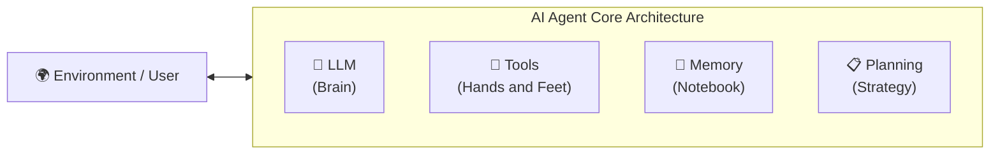
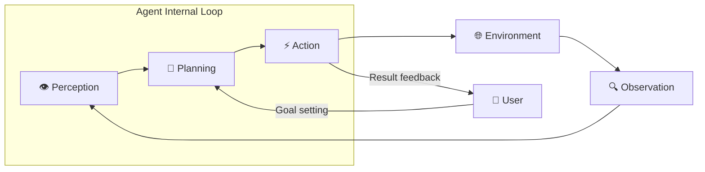
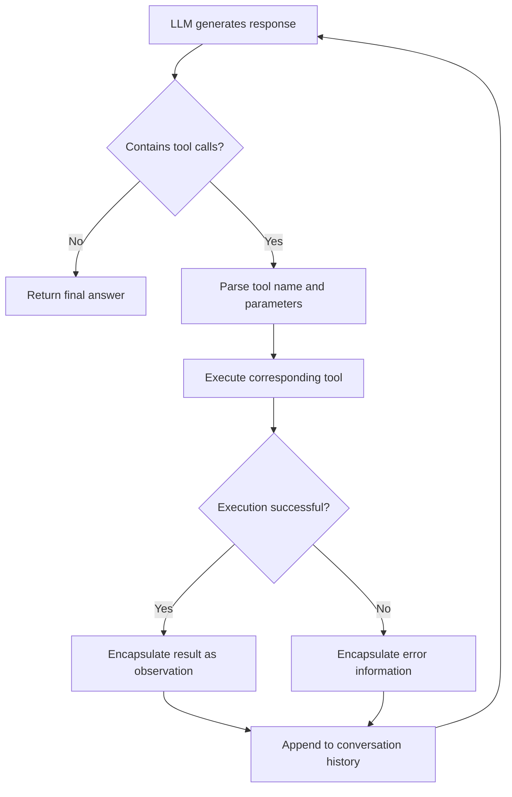
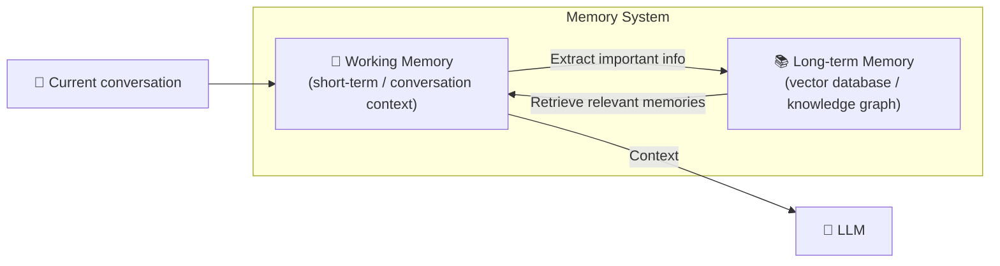
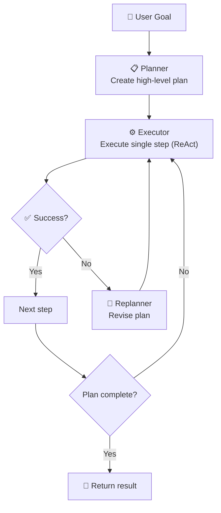
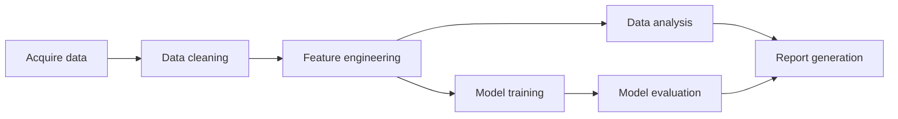
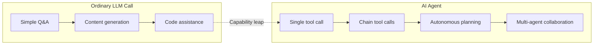
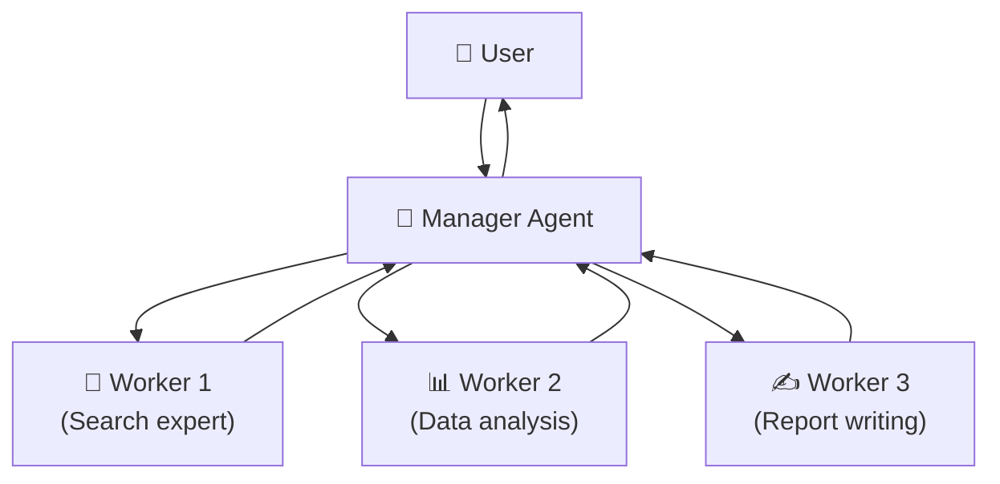
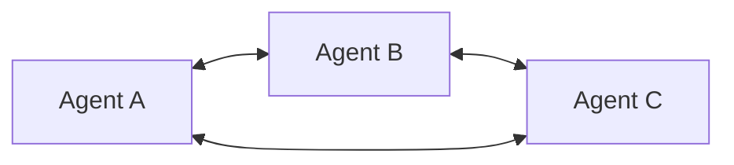

# From LLM to Autonomous Agent: In-Depth Analysis of AI Agent Architecture and Engineering Practice

> **Abstract**: The explosion of large language models has brought "talking AI" into millions of households, but true intelligence should not stop at "question and answer." AI Agent, as the next evolutionary form of LLMs, empowers models with autonomous decision-making, multi-step planning, and environment interaction capabilities, regarded as a key path toward artificial general intelligence. This article systematically dissects the core architecture of AI Agents — the perception-planning-action-observation loop, deeply interprets its four core components (LLM brain, tools, memory, planning), and demonstrates the essential differences between Agents and ordinary LLM calls with detailed engineering cases and code examples. Finally, it explores cutting-edge topics such as multi-agent collaboration and reflection mechanisms, helping you build a complete understanding from principles to production.


## 1. Introduction: The "Second Half" of LLMs and the Rise of Agents

### 1.1 When LLMs Learn to "Do Things"

Since 2023, we have witnessed the astonishing capabilities of large language models such as GPT-4, Claude, and DeepSeek — they can write poetry, program, translate, summarize reports, and have outperformed humans in almost every language exam. In recent years, tools like Claude Code, Copilot CLI, and Codex have undoubtedly boosted productivity by more than an order of magnitude. However, when we attempt to integrate LLMs into actual business systems, a significant bottleneck emerges: **LLMs are good at "talking," but not very good at "doing."**

Imagine a typical scenario: a user requests, "Help me check the cheapest flight from Beijing to Shanghai next Tuesday and add it to my calendar." In the traditional LLM call mode, the model can at most generate a textual description of how to check flights, or fabricate a non-existent flight. It cannot truly access the flight booking system, compare prices, or operate a calendar application.

These are the fundamental limitations of **plain LLM calls**:
- **Knowledge is static**: Information after the training data cutoff is unknown.
- **Behavior is passive**: Only responds to the current input, cannot actively plan multi-step operations.
- **Environment is isolated**: Cannot interact with external systems (databases, APIs, sensors).
- **Memory is short-lived**: Conversation history is forgotten once it exceeds the context window.

### 1.2 AI Agent: From "Language Engine" to "Action Engine"

AI Agent is precisely designed to solve these limitations. If an LLM is a powerful "brain," then an Agent equips that brain with "hands and feet," "eyes," and a "notebook" to form a complete intelligent entity.

An AI Agent is defined as an autonomous computational entity that can perceive its environment, reason and make decisions, and take actions to achieve specific goals. Agent = LLM (brain) + Tools + Memory + Planning. This formula concisely and profoundly reveals the core architecture of an Agent.



From a broader perspective, an AI Agent is a new software paradigm that deeply integrates the reasoning capabilities of LLMs with traditional software tools, data interfaces, and business logic, creating intelligent entities capable of autonomously completing complex tasks. 2023 is known as the "first year of AI Agents," and 2024-2025 has witnessed accelerated evolution from proof-of-concept to production deployment.

### 1.3 Why Are Agents the Next Stop for LLM Applications?

Understanding the value of Agents can be seen through the evolution of software interaction modes:

| Era | Interaction Mode | Representative Technology | User Role |
|------|----------|----------|----------|
| CLI Era | Precise commands | Shell, DOS | Memorize commands |
| GUI Era | Click and menu | Windows, Web | Learn interfaces |
| Chat Era | Natural language conversation | ChatGPT, Wenxin Yiyan | Describe needs |
| **Agent Era** | **Goal delegation** | AutoGPT, LangGraph | **Define goals** |

In the Agent era, users only need to describe "what goal to achieve," and the intelligent entity plans "how to do it." This marks a fundamental shift from "process-oriented" to "goal-oriented" human-computer interaction. LangChain's 2024 "State of AI Agents" report shows that more than 51% of surveyed enterprises have deployed Agent applications in production, with customer service automation, data analysis, and code generation being the three major use cases.

This article will take you deep into the underlying architecture and engineering practices of AI Agents. Whether you are a developer looking to build your first Agent from scratch or an architect hoping to integrate Agents into existing systems, this 20,000-word in-depth guide will provide systematic knowledge support.


## 2. Core Architecture of AI Agents: Perception-Planning-Action-Observation Loop

### 2.1 Fundamental Behavior Pattern of Autonomous Agents

The behavior of any agent can be abstracted as a continuous **perception-planning-action-observation** loop. This loop originates from the classic feedback loop in cybernetics and has been inherited and advanced by AI Agents.



Let's dissect this loop layer by layer:

#### Stage 1: Perception

Perception is the first checkpoint for the Agent to establish contact with the outside world. In this step, the Agent needs to:

- **Receive user input**: the user's natural language instruction or goal description.
- **Understand the environment state**: extract structured information from environmental feedback (e.g., API responses, database query results, sensor readings).
- **Filter and refine**: compress massive environmental information into a "cognitive state" valuable for the current task.

Traditional software systems receive precise instructions, while Agents receive vague, open-ended goals. For example, "help me analyze the recent sales data" — the Agent needs to perceive that the task theme is "sales data analysis," which implies the need to access a sales database, and possible tools include SQL queries and data visualization tools.

The quality of the perception stage directly determines the correctness of subsequent planning and actions. In engineering practice, perception is typically accomplished by the following modules working together:

- **Input parser**: identifies user intent, extracts key entities and parameters.
- **Environment adapter**: unifies data from different sources (JSON, tables, text) into a format understandable by the LLM.
- **Context aggregator**: fuses current perception with historical memory to form a complete cognitive state.

#### Stage 2: Planning

Planning is the "thinking center" of the Agent and the key differentiator from ordinary LLM calls. In this step, the Agent needs to decompose a macro goal into an executable sequence of steps.

**Levels of planning**:

1. **Task decomposition**: break down a complex goal into subtasks. For example, "book the cheapest flight from Beijing to Shanghai" can be decomposed into:
   - Query flight list
   - Filter the cheapest flight
   - Obtain user identity information
   - Call the booking API
   - Confirm the order and add to calendar

2. **Path selection**: when multiple feasible paths exist, the Agent needs to evaluate and choose the optimal solution. For example, if booking fails, try other dates or switch to trains.

3. **Resource scheduling**: determine when to call which tool and with what parameters.

There are two mainstream paradigms for planning implementation in the industry:

- **ReAct paradigm** (Reasoning + Acting): interleaves reasoning and action — each step follows Thought → Action → Observation, then proceeds to the next step. This is currently the most widely adopted planning framework.

- **Plan-and-Solve paradigm**: first generates a complete plan, then executes it step by step. Suitable for tasks with clear steps and little environmental change.

Regardless of the paradigm, planning requires the LLM to have **multi-step reasoning** capabilities, which ordinary "question-answer" calls do not possess.

#### Stage 3: Action

Action is the process by which the Agent turns decisions into actual effects. The Agent's action space is determined by its **tools**.

Common types of actions include:

- **Information retrieval**: calling search engines, querying databases, reading documents.
- **Computation and reasoning**: executing code, calling mathematical functions.
- **External operations**: sending HTTP requests, calling APIs, writing files.
- **Human-computer interaction**: asking users for clarification, requesting authorization.

In engineering implementation, actions typically manifest as **tool calls** — the Agent generates a structured tool call instruction (e.g., a JSON-formatted function name and parameters), and the executor actually calls the corresponding API or function, returning the result to the Agent. OpenAI's Function Calling and Anthropic's Tool Use are standardized implementations of this pattern.

#### Stage 4: Observation

Observation is the stage where the Agent receives feedback from the environment. The results of actions are encapsulated as "observations" and fed back into the perception module, forming a closed loop.

Observation content may include:

- **Tool execution results**: data returned by APIs, output from code execution.
- **Environment state changes**: whether a file was successfully written, whether a database record was updated.
- **Error messages**: reasons for tool call failures.

The value of the observation stage lies in **correction and iteration**. When the Agent finds that the result of a certain action does not match expectations, it can adjust subsequent plans. For example, if a flight query API returns "no results," the Agent may adjust the date range or switch to another mode of transportation.

### 2.2 The Essence of the Loop: LLM Implementation of a Markov Decision Process

From a theoretical perspective, the Agent's perception-planning-action-observation loop is a concrete implementation of a **Markov Decision Process** in the LLM era.

- **State**: the Agent's cognition of the environment (including conversation history, tool call records, current goal).
- **Action**: operations executable by the Agent (tool calls, generating answers).
- **Policy**: the mapping function from state to action — in an Agent, this policy is realized by the LLM's reasoning ability.
- **Reward**: the environment's feedback on actions (task completion, user satisfaction).

Traditional reinforcement learning requires extensive training to learn a policy, whereas LLM Agents leverage the common sense and reasoning abilities pre-trained in the model to achieve **zero-shot or few-shot policy generation** — a paradigm shift.


## 3. Core Components in Detail (1): The LLM — Agent's "Brain"

### 3.1 The Role of LLMs in Agents

The LLM is the core source of Agent intelligence. But unlike traditional chat scenarios, the LLM in an Agent undertakes richer responsibilities:

- **Understanding intent**: parse the user's vague goals, extract key information.
- **Reasoning and planning**: decompose goals into executable sequences of steps.
- **Tool orchestration**: decide when to call which tool and construct the correct parameters.
- **Information integration**: fuse multi-source information returned by tools into a coherent output.
- **Reflection and error correction**: determine whether to adjust strategies based on observations.

An excellent Agent LLM needs the following key capabilities:

**1. Instruction following ability**

Agent scenarios require the LLM to strictly follow complex instruction templates — when to think, when to act, when to finish. Models that have undergone instruction fine-tuning (such as GPT-4, Claude-3.5, Qwen2.5-Instruct) are more suitable as the Agent brain than raw pre-trained models.

**2. Function calling ability**

The model needs to be able to generate structured tool call instructions. Modern LLMs typically acquire this capability through specific training (Function Calling fine-tuning) or system prompts. Take OpenAI as an example:

```python
# Example tool definition
tools = [{
    "type": "function",
    "function": {
        "name": "search_flights",
        "description": "Search for flight information on a specified route and date",
        "parameters": {
            "type": "object",
            "properties": {
                "origin": {"type": "string", "description": "Departure city code, e.g., PEK"},
                "destination": {"type": "string", "description": "Arrival city code, e.g., SHA"},
                "date": {"type": "string", "description": "Departure date, format YYYY-MM-DD"}
            },
            "required": ["origin", "destination", "date"]
        }
    }
}]
```

**3. Long context handling ability**

When Agents perform multi-step tasks, conversation history and tool call records accumulate rapidly, challenging the model's context window. Choosing a model with a sufficiently large context window (e.g., GPT-4 Turbo's 128K, Claude's 200K) is an important consideration for production environments.

**4. Reasoning depth**

Facing complex tasks, the model needs **chain-of-thought** ability. In Agent scenarios, CoT is manifested as the interleaved output of Thought-Action-Observation. Research shows that explicitly asking the model to "think step by step" significantly improves task success rates.

### 3.2 Agent LLM Selection Guide

| Dimension | Closed-source models (GPT-4/Claude) | Open-source models (Llama3/Qwen2.5/DeepSeek) |
|------|--------------------------|--------------------------------------|
| Reasoning ability | ★★★★★ | ★★★★☆ (rapidly catching up) |
| Function calling stability | ★★★★★ | ★★★★ (requires specific versions) |
| Context window | 128K-1M | 32K-128K |
| Latency | Relatively low (API) | Depends on deployment resources |
| Cost | Pay per token | Fixed hardware cost |
| Data privacy | Data may leave jurisdiction | Fully local |

**Selection recommendations**:
- **Rapid prototyping**: prefer closed-source APIs for fastest validation.
- **Data-sensitive scenarios**: choose domestic open-source models like Qwen2.5, DeepSeek for local deployment.
- **High-concurrency production**: evaluate open-source models + inference acceleration frameworks (vLLM, TensorRT-LLM).
- **Complex reasoning tasks**: currently GPT-4, Claude-3.5-Opus remain leading.

### 3.3 LLM Call vs Agent Call: Essential Differences

| Comparison Dimension | Ordinary LLM Call | AI Agent |
|----------|-------------|----------|
| Interaction mode | Single/multi-turn conversation | Goal delegation + autonomous multi-step execution |
| Output content | Pure text answer | Thought process + tool calls + final answer |
| Knowledge source | Model parameters (static) | Parameters + real-time tool calls (dynamic) |
| Error handling | Relies on user correction | Autonomously observes feedback and adjusts |
| Task complexity | Suitable for single-step informational tasks | Suitable for multi-step operational tasks |
| Controllability | High (output ends the call) | Requires setting max steps, timeout, etc. |
| Cost structure | Single API call | Multiple calls (LLM + tools) |

A code comparison is more intuitive:

```python
# Ordinary LLM call (pseudocode)
def llm_chat(query):
    response = llm.generate(query)
    return response  # one call, returns text

# Agent call (pseudocode)
def agent_run(goal):
    memory = [{"role": "user", "content": goal}]
    max_steps = 10
    
    for step in range(max_steps):
        # 1. Planning: LLM generates next action
        action = llm.plan(memory)
        
        # 2. Action: execute tool
        observation = execute_tool(action)
        
        # 3. Observation: store result in memory
        memory.append({"role": "tool", "content": observation})
        
        # 4. Check if goal is achieved
        if action.type == "finish":
            return action.final_answer
```


## 4. Core Components in Detail (2): Tools — Agent's "Hands and Feet"

### 4.1 Tools: Bridging the Digital and Real Worlds

If the LLM determines "how far the Agent can think," then tools determine "how much the Agent can do." Tools are the interfaces through which the Agent interacts with the external world, translating the model's reasoning ability into practical utility.

A tool is essentially a **standardized function interface** with three elements:
- **Name and description**: let the LLM understand what the tool does.
- **Parameter definition**: names, types, descriptions, and required status of input parameters.
- **Execution logic**: actual code or API calls that accomplish the function.

### 4.2 Taxonomy of Tool Types

**1. Information retrieval tools**
- **Search engines**: Google Search API, Bing API, Tavily (optimized for Agents)
- **Internal knowledge bases**: vector database retrieval (RAG)
- **Database queries**: SQL executor, graph database queries

**2. Computation and code tools**
- **Python interpreter**: execute code in a secure sandbox
- **Mathematical computation**: complex formula solving, statistical analysis
- **Data visualization**: generate charts and return images

**3. External service tools**
- **API call tools**: RESTful API, GraphQL
- **Email/messaging tools**: Gmail API, Slack Webhook
- **Calendar management tools**: Google Calendar API

**4. File and system tools**
- **File read/write**: local or cloud storage file operations
- **Browser automation**: Playwright, Selenium wrappers

**5. Human-in-the-loop tools**
- **AskUser tool**: ask users questions to clarify needs
- **Authorization confirmation tool**: request user approval before sensitive operations

### 4.3 Engineering Specifications for Tool Definitions

A well-designed tool definition should follow the three principles of **clarity, precision, and safety**. Below is a standard definition example in OpenAI Function Calling format:

```python
{
    "type": "function",
    "function": {
        "name": "send_email",
        "description": "Send an email to a specified recipient",
        "parameters": {
            "type": "object",
            "properties": {
                "to": {
                    "type": "string",
                    "description": "Recipient email address"
                },
                "subject": {
                    "type": "string",
                    "description": "Email subject"
                },
                "body": {
                    "type": "string",
                    "description": "Email body, supports Markdown format"
                },
                "cc": {
                    "type": "array",
                    "items": {"type": "string"},
                    "description": "List of CC email addresses"
                }
            },
            "required": ["to", "subject", "body"]
        }
    }
}
```

**Golden rules for tool definitions**:

1. **Descriptions must be specific and discriminative**. If there are multiple tools with similar functions, subtle differences in descriptions determine whether the LLM selects correctly. For example, the descriptions of "search_products_by_name" and "search_products_by_category" need to clearly indicate the different search fields.

2. **Parameter types and descriptions must be precise**. The LLM relies on parameter descriptions to understand what values to pass. For special types like dates and enums, provide format examples in the description.

3. **Consider error handling**. The tool executor should be able to catch exceptions and return clear error messages, which will be returned to the LLM as observations to help it adjust strategies.

4. **Principle of least privilege**. Tools in production environments should have their capability boundaries restricted. For example, a file writing tool should restrict the directories it can operate on; a code execution tool should use a sandbox environment.

### 4.4 Internal Flow of Tool Calls



This process is called the **tool call loop** and continues until the LLM decides no further tool calls are needed or a preset maximum number of loop iterations is reached.


## 5. Core Components in Detail (3): Memory — Agent's "Notebook"

### 5.1 Memory: Giving Agents "Experience" and "Context"

If an Agent has no memory, then every conversation would be a "first meeting." Memory endows the Agent with the following abilities:

- **Context coherence**: remember conversation history, understand the relationship between current questions and previous discussions.
- **Knowledge accumulation**: store information acquired during task execution for future use.
- **Self-evolution**: learn from successful and failed experiences to optimize future behavioral strategies.

From a cognitive science perspective, the human memory system is divided into sensory memory, short-term memory, and long-term memory. The AI Agent's memory architecture draws on this model, forming a **dual-layer memory system**.

### 5.2 Dual-Layer Memory Architecture



**1. Working Memory**

Working memory corresponds to the LLM's **context window**, storing within the current session:
- User's historical questions
- Agent's thought processes
- Tool call records and results
- Intermediate reasoning steps

Characteristics of working memory:
- **Limited capacity**: constrained by the model's context window (4K~1M tokens).
- **Volatile**: disappears after the session ends.
- **Immediately accessible**: the LLM can directly "see" the content of working memory.

Managing working memory well is a core challenge of Agent engineering. Common management strategies include:

- **Sliding window**: keep only the most recent N messages, discard older ones.
- **Summary compression**: use an LLM to compress long conversation history into a summary, replacing the original content.
- **Importance filtering**: retain key decision points and important information, discard redundant content.

**2. Long-term Memory**

Long-term memory breaks the limits of a single session, persistently storing important information for retrieval in future sessions.

Implementation of long-term memory typically relies on:

- **Vector databases**: store memory fragments (e.g., user preferences, historical task results) as vector embeddings, retrieve via semantic similarity.
- **Knowledge graphs**: store entities and their relationships, supporting precise structured queries.
- **Key-value stores**: simple storage of user preferences (e.g., "user lives in Beijing").

Long-term memory enables the Agent to:
- **Personalize**: remember user habits and preferences.
- **Accumulate learning**: knowledge gained from previous tasks can be reused.
- **Cross-session continuity**: interrupted tasks can be resumed in a new session.

### 5.3 Engineering Implementation of Memory

Take LangChain's Memory module as an example:

```python
from langchain.memory import ConversationSummaryMemory, VectorStoreRetrieverMemory
from langchain_openai import ChatOpenAI

# Working memory: summary compression
summary_memory = ConversationSummaryMemory(
    llm=ChatOpenAI(model="gpt-4o-mini"),
    max_token_limit=500,
    return_messages=True
)

# Long-term memory: vector store
vector_memory = VectorStoreRetrieverMemory(
    retriever=vectorstore.as_retriever(k=5),
    memory_key="long_term_context"
)

# Combine in an Agent
agent = create_agent(
    llm=llm,
    tools=tools,
    memory=summary_memory,  # working memory
    # retrieved long-term memory can be added to system prompt
)
```

### 5.4 Relationship Between Memory and RAG

Long-term memory in Agents shares similarities with RAG (Retrieval-Augmented Generation), but with different emphases:

| Dimension | RAG | Agent Long-term Memory |
|------|-----|---------------|
| Knowledge source | Static document corpus | Dynamic conversation/task records |
| Update frequency | Batch indexing | Real-time writing |
| Retrieved content | Document fragments | Experiences/preferences/facts |
| Typical use | Answering knowledge-based questions | Personalized context supplementation |

In practice, the two are often combined: RAG provides domain knowledge, while long-term memory provides user personalization information, together forming the Agent's knowledge base.


## 6. Core Components in Detail (4): Planning — Agent's "Strategy Center"

### 6.1 Hierarchical Model of Planning Ability

Planning is the most core feature distinguishing Agents from ordinary LLMs. From simple to complex, planning ability can be divided into three levels:

**L1: Single-step tool call**

This is the most basic form of "planning" — the LLM determines that a tool is needed, generates a single tool call, and generates an answer directly based on the result. Strictly speaking, this is not yet true planning, but rather "tool-augmented LLM."

**L2: Chain tool calls**

The LLM calls multiple tools in sequence, with the result of each step influencing the choice of the next. For example, first search for a product ID, then query inventory with that ID, and finally generate a report from the inventory information. This requires the model to have the ability to "adjust subsequent behavior based on intermediate results."

**L3: True autonomous planning**

Before acting, the Agent explicitly formulates a **plan** — which could be a step-by-step checklist or a tree-like decision structure. During execution, the Agent continuously monitors progress, adjusts the plan based on environmental feedback, or even discards and restarts. This is the frontier of current AI Agent research.

### 6.2 In-depth Comparison of Mainstream Planning Paradigms

#### Paradigm 1: ReAct

ReAct was proposed by Google Research in 2022, short for **Re**asoning + **Act**ing. Its core idea is to interleave reasoning and action, each step following the cycle of Thought → Action → Observation.

ReAct execution flow:
```
Thought: I need to first query flight information
Action: search_flights(origin="PEK", destination="SHA", date="2024-12-20")
Observation: [Returns 3 flights, the cheapest is MU5102, price 580 RMB]

Thought: I found the cheapest flight, now need to query user information to complete booking
Action: get_user_profile()
Observation: [Returns user name, ID number, preferences]

Thought: Information is complete, can proceed with booking
Action: book_flight(flight_no="MU5102", passenger={...})
Observation: [Booking successful, order number FLT123456]

Thought: Task complete, inform user of the result
Final Answer: I have booked the cheapest flight MU5102 from Beijing to Shanghai on December 20 for 580 RMB, order number FLT123456.
```

Advantages of ReAct:
- **High flexibility**: each step can be adjusted based on the latest observation.
- **Strong interpretability**: Thought clearly shows the reasoning process.
- **Error recovery**: if one step fails, immediate adjustment is possible.

Limitations of ReAct:
- **Lack of global perspective**: thinking and acting on the fly may lead to shortsightedness, lacking long-term planning.
- **Efficiency issues**: thought steps increase latency.

#### Paradigm 2: Plan-and-Solve

Plan-and-Solve adopts a two-stage strategy of "plan first, then execute":

```
Stage 1: Make a plan
User goal: Book the cheapest flight from Beijing to Shanghai and add to calendar

Plan:
1. Query flights from PEK to SHA on December 20
2. Filter the cheapest flight
3. Obtain user identity information
4. Execute flight booking
5. Add the itinerary to calendar

Stage 2: Execute the plan
Execute each step as above, make local adjustments if problems arise
```

Advantages of Plan-and-Solve:
- **Globally optimal**: overall planning may be better than stepwise decisions.
- **High execution efficiency**: once the plan is determined, the execution phase requires less frequent "thinking."

Limitations of Plan-and-Solve:
- **Poor adaptability**: if the environment changes significantly after the plan is made, adjustment costs are high.
- **Dependence on plan quality**: if the initial plan is flawed, the entire execution is affected.

#### Paradigm 3: Plan-and-Execute (LangGraph standard mode)

This is the paradigm advocated by the LangGraph framework, combining the advantages of the above two:

- A dedicated **Planner** generates a high-level plan.
- An **Executor** executes specific steps; the Executor itself can be a ReAct Agent.
- A **Replanner** revises the plan when necessary based on execution feedback.



### 6.3 Key Technique in Planning: Task Decomposition

The success of complex tasks often depends on the quality of decomposition. Effective task decomposition should follow the **MECE principle** — mutually exclusive, collectively exhaustive.

**Decomposition method 1: Tree decomposition**

```
Goal: Write quarterly sales analysis report
├── 1. Data acquisition
│   ├── 1.1 Extract Q3 sales data from database
│   ├── 1.2 Extract customer segmentation data from CRM
│   └── 1.3 Obtain competitor information from marketing department
├── 2. Data analysis
│   ├── 2.1 Calculate year-over-year/quarter-over-quarter growth rates
│   ├── 2.2 Analyze contribution of top 10 customers
│   └── 2.3 Identify causes of abnormal fluctuations
├── 3. Report writing
│   ├── 3.1 Write executive summary
│   ├── 3.2 Create data charts
│   └── 3.3 Propose recommendations for next quarter
└── 4. Review and release
    ├── 4.1 Send to manager for review
    └── 4.2 Revise based on feedback
```

**Decomposition method 2: Dependency graph decomposition**

For tasks with sequential dependencies, use a directed acyclic graph:



### 6.4 Reflection and Self-Correction

Human experts constantly reflect when solving problems: "Am I doing it right?" "Is there a better way?" Agent planning also needs to introduce a similar **reflection mechanism**.

The Reflexion framework (Shinn et al., 2023) is a representative work in this direction. It allows the Agent, after executing a task, to generate a **reflection text** about its own performance, storing the reflection in long-term memory to guide similar future tasks.

Common triggers for reflection:
- **Tool call failure**: incorrect parameters, insufficient permissions, empty results.
- **Task timeout**: maximum execution steps exceeded without completion.
- **Low confidence**: the LLM's confidence score for its own answer falls below a threshold.

The output of reflection typically includes:
- **Problem diagnosis**: what went wrong?
- **Attribution analysis**: is it a planning problem, execution problem, or environmental problem?
- **Improvement strategy**: what should be done differently next time a similar situation occurs?


## 7. Agent vs Ordinary LLM Call: A Table Showing All Differences

After the in-depth analysis in the previous chapters, we can systematically compare the essential differences between Agents and ordinary LLM calls across multiple dimensions.

### 7.1 Core Comparison Table

| Comparison Dimension | Ordinary LLM Call | AI Agent |
|----------|-------------|----------|
| **Autonomy** | Passive response, question-answer | Active planning, multi-step execution |
| **Decision mode** | Single-step reasoning | Multi-step reasoning and reflection |
| **Environment interaction** | None (only processes input text) | Yes (interacts with external world via tools) |
| **State maintenance** | Only conversation history (limited) | Working memory + long-term memory |
| **Task complexity** | Simple Q&A, content generation | Complex multi-step operations, goal-driven tasks |
| **Error handling** | Relies on user to point out errors | Autonomously observes and adjusts strategy |
| **Knowledge timeliness** | Training cutoff date | Real-time via tools |
| **Extensibility** | Depends on model upgrades | Extend capabilities by adding tools |
| **Interpretability** | Only outputs answers | Displays complete thought and action traces |
| **Cost structure** | Single API call | Multiple calls (LLM + tools) |

### 7.2 Scenario Applicability Comparison

**Scenarios suitable for ordinary LLM calls**:
- Text summarization, translation, polishing
- Creative writing, brainstorming
- Common-sense knowledge Q&A
- Code explanation and simple generation

**Scenarios suitable for AI Agents**:
- Tasks requiring real-time data (query stock prices, weather, news)
- Tasks requiring multi-step operations (booking services, sending emails, manipulating files)
- Tasks requiring combining multiple capabilities (search first, then analyze, then generate a report)
- Tasks requiring integration with external systems (CRM operations, database queries)

### 7.3 Complexity and Cost Curves



As task complexity increases, the success rate of ordinary LLM calls drops rapidly, while Agents push the success boundary much further by introducing planning and tool calls. Of course, this capability improvement comes with increased costs: a single Agent run may involve 10+ LLM calls, plus additional tool execution overhead. Therefore, in engineering practice, tasks should undergo **complexity assessment**; simple tasks can be downgraded to ordinary LLM calls to save costs.


## 8. Hands-on: Building a ReAct Agent with LangGraph

Now that the theory is covered, let's build a complete ReAct Agent with tool calling and memory capabilities through a hands-on code example. We will use LangGraph (LangChain's next-generation Agent framework) for implementation.

### 8.1 Environment Setup

```python
# Install dependencies
# pip install langgraph langchain-openai langchain-community tavily-python

import os
from typing import TypedDict, Annotated, Sequence
from langgraph.graph import StateGraph, END
from langgraph.graph.message import add_messages
from langchain_openai import ChatOpenAI
from langchain_community.tools.tavily_search import TavilySearchResults
from langchain_core.messages import BaseMessage, HumanMessage, AIMessage, ToolMessage
from langchain_core.tools import tool
import json

# Set API keys
os.environ["OPENAI_API_KEY"] = "your-openai-key"
os.environ["TAVILY_API_KEY"] = "your-tavily-key"  # search tool
```

### 8.2 Define Tools

```python
# Tool 1: Web search
tavily_tool = TavilySearchResults(max_results=3)

# Tool 2: Custom calculator
@tool
def calculator(expression: str) -> str:
    """Calculate the result of a mathematical expression. Input should be a valid Python math expression, e.g., '2 + 3 * 4'"""
    try:
        # Note: production environments should use safer expression evaluation methods
        result = eval(expression, {"__builtins__": {}}, {})
        return f"Calculation result: {result}"
    except Exception as e:
        return f"Calculation error: {str(e)}"

# Tool 3: Get current time
@tool
def get_current_time() -> str:
    """Get current date and time"""
    from datetime import datetime
    return datetime.now().strftime("%Y-%m-%d %H:%M:%S")

# Tool list
tools = [tavily_tool, calculator, get_current_time]

# Convert tools to LLM-understandable format
tools_for_llm = [tool._to_openai_tool() for tool in tools]
```

### 8.3 Define Agent State

In LangGraph, state is a shared dictionary passed between graph nodes. We define a state containing a message list:

```python
class AgentState(TypedDict):
    messages: Annotated[Sequence[BaseMessage], add_messages]
```

`add_messages` is a reducer function that tells LangGraph how to merge new messages into the existing state.

### 8.4 Define Node Functions

```python
# Initialize LLM
llm = ChatOpenAI(model="gpt-4o-mini", temperature=0)
llm_with_tools = llm.bind_tools(tools_for_llm)

def agent_node(state: AgentState) -> dict:
    """Agent decision node: calls LLM, decides next action"""
    messages = state["messages"]
    response = llm_with_tools.invoke(messages)
    return {"messages": [response]}

def should_continue(state: AgentState) -> str:
    """Routing function: decides whether to execute a tool or end"""
    messages = state["messages"]
    last_message = messages[-1]
    
    # If LLM didn't request any tool calls, end
    if not hasattr(last_message, "tool_calls") or not last_message.tool_calls:
        return "end"
    else:
        return "continue"

def tool_node(state: AgentState) -> dict:
    """Tool execution node: executes the tool requested by the LLM"""
    messages = state["messages"]
    last_message = messages[-1]
    
    tool_messages = []
    for tool_call in last_message.tool_calls:
        tool_name = tool_call["name"]
        tool_args = tool_call["args"]
        
        # Find the corresponding tool and execute it
        for tool in tools:
            if tool.name == tool_name:
                result = tool.invoke(tool_args)
                tool_messages.append(
                    ToolMessage(content=str(result), tool_call_id=tool_call["id"])
                )
                break
    
    return {"messages": tool_messages}
```

### 8.5 Build the Graph

```python
# Create state graph
workflow = StateGraph(AgentState)

# Add nodes
workflow.add_node("agent", agent_node)
workflow.add_node("tool", tool_node)

# Set entry point
workflow.set_entry_point("agent")

# Add edges
workflow.add_conditional_edges(
    "agent",
    should_continue,
    {
        "continue": "tool",
        "end": END
    }
)
workflow.add_edge("tool", "agent")  # after tool execution, go back to agent for further thinking

# Compile the graph
app = workflow.compile()
```

### 8.6 Run the Agent

```python
def run_agent(user_input: str):
    """Run Agent and print execution process"""
    print(f"👤 User: {user_input}\n")
    print("=" * 50)
    
    inputs = {"messages": [HumanMessage(content=user_input)]}
    
    step = 0
    for output in app.stream(inputs):
        step += 1
        for key, value in output.items():
            if key == "agent":
                msg = value["messages"][-1]
                if hasattr(msg, "tool_calls") and msg.tool_calls:
                    print(f"🤔 Step {step} thinking: preparing to call tool")
                    for tc in msg.tool_calls:
                        print(f"   🔧 Calling {tc['name']}({tc['args']})")
                else:
                    print(f"💬 Step {step} reply: ")
            elif key == "tool":
                msg = value["messages"][-1]
                print(f"   📋 Tool returned: {msg.content[:100]}...")
    
    # Print final answer
    final_state = app.invoke(inputs)
    final_message = final_state["messages"][-1]
    print("\n" + "=" * 50)
    print(f"🤖 Final answer:\n{final_message.content}")

# Test
if __name__ == "__main__":
    run_agent("Find out who won the 2024 Nobel Prize in Physics and briefly introduce their contribution in Chinese")
```

### 8.7 Example Output

```
👤 User: Find out who won the 2024 Nobel Prize in Physics and briefly introduce their contribution in Chinese

==================================================
🤔 Step 1 thinking: preparing to call tool
   🔧 Calling tavily_search_results_json({'query': '2024 Nobel Prize in Physics winner'})
   📋 Tool returned: [{"title": "2024 Nobel Prize in Physics announced", "content": "The Royal Swedish Academy of Sciences has awarded the 2024 Nobel Prize in Physics to John J. Hopfield and Geoffrey E. Hinton..."}]...
==================================================
💬 Final answer:
The 2024 Nobel Prize in Physics was awarded to John J. Hopfield and Geoffrey E. Hinton for their "foundational discoveries and inventions in artificial neural networks and machine learning."

**Main contributions**:
- **John J. Hopfield**: Proposed the Hopfield network in 1982, a recurrent neural network capable of storing and reconstructing information patterns, laying the theoretical foundation for associative memory.
- **Geoffrey E. Hinton**: Known as the "godfather of deep learning," invented core technologies such as the Boltzmann machine and backpropagation algorithm, providing the key theoretical foundation for the explosion of modern artificial intelligence.
```

This example fully demonstrates the operation flow of a ReAct Agent: perceive user question → plan (need to search) → act (call search tool) → observe results → generate final answer.


## 9. Multi-Agent Collaboration: From Individual Intelligence to Collective Intelligence

### 9.1 Why Multi-Agent?

The capability of a single Agent is limited by its tools and the LLM's reasoning boundaries. When facing more complex tasks, **multi-agent collaboration** shows unique advantages:

- **Task parallelization**: different Agents handle different subtasks simultaneously, improving efficiency.
- **Complementary expertise**: different Agents are equipped with different tools and domain knowledge (e.g., data analysis Agent, code writing Agent, customer service Agent).
- **Cross-validation**: multiple Agents' judgments on the same problem can cross-check each other, reducing error rates.
- **Robustness**: when a single Agent fails, others can take over or remediate.

### 9.2 Mainstream Multi-Agent Architecture Patterns

**Pattern 1: Hierarchical (Manager-Worker)**

One manager Agent is responsible for task decomposition and allocation, and multiple worker Agents execute specific tasks.



**Pattern 2: Peer-to-Peer**

Agents communicate equally, reaching consensus through negotiation or voting.



**Pattern 3: Debate**

Multiple Agents argue from different perspectives, and a judge Agent or consensus mechanism finally reaches a conclusion. This pattern performs well in scenarios requiring rigorous reasoning (e.g., legal analysis, scientific argumentation).

### 9.3 Multi-Agent Implementation in LangGraph

LangGraph natively supports building multi-agent systems. Each Agent can be a subgraph, communicating via edges between nodes.

```python
# Multi-agent collaboration example: writing + review team

def create_writer_agent():
    """Create writing Agent subgraph"""
    writer_graph = StateGraph(...)
    # ... add nodes and edges
    return writer_graph.compile()

def create_reviewer_agent():
    """Create reviewer Agent subgraph"""
    reviewer_graph = StateGraph(...)
    # ... add nodes and edges
    return reviewer_graph.compile()

# Main graph: orchestrate two Agents
main_graph = StateGraph(TeamState)

main_graph.add_node("writer", create_writer_agent())
main_graph.add_node("reviewer", create_reviewer_agent())
main_graph.add_node("finalizer", finalizer_node)

main_graph.add_edge("writer", "reviewer")
main_graph.add_conditional_edges(
    "reviewer",
    needs_revision,  # determine if revision is needed
    {
        "revise": "writer",  # go back to writing Agent for revision
        "approve": "finalizer"
    }
)
```


## 10. Evaluation Framework: How to Measure Agent Quality?

### 10.1 Unique Challenges of Agent Evaluation

Evaluating an Agent is much harder than evaluating an ordinary LLM because:
- **Task diversity**: Agents can perform many more types of tasks than fixed test sets.
- **Process complexity**: not only the final answer but also the correctness of intermediate steps matters.
- **Environmental dependency**: tool call success rates are affected by external factors (API availability, network latency).
- **Non-determinism**: the same problem may lead the Agent to take different paths to the correct result.

### 10.2 Mainstream Evaluation Frameworks

**1. AgentBench**

An Agent evaluation benchmark jointly released by Tsinghua University and other institutions, covering 8 environments (operating system, database, knowledge graph, web shopping, etc.), evaluating Agents' task completion capabilities in real-world scenarios.

**2. WebArena**

An Agent evaluation benchmark focused on web interaction environments. The Agent needs to complete tasks such as booking, shopping, and information finding through a browser. WebArena provides real website replicas to avoid interference with production websites.

**3. GAIA**

A general AI Agent evaluation benchmark proposed by Meta AI, emphasizing tasks that require complex reasoning and multi-step actions, designed as a test set that is "easy for humans, difficult for AI."

### 10.3 Key Evaluation Metrics

| Metric Category | Specific Metric | Description |
|----------|----------|------|
| **Task completion** | Success Rate | Whether the user goal is achieved |
| **Execution efficiency** | Steps to Completion | Number of steps required to complete the task |
| | Token Usage | Total LLM call tokens |
| | Wall Time | End-to-end time taken |
| **Process quality** | Tool Selection Accuracy | Whether the correct tool was selected |
| | Parameter Accuracy | Whether tool parameters are correct |
| **Robustness** | Error Recovery Rate | Ability to recover after encountering errors |
| **Safety** | Harmful Action Rate | Whether dangerous operations were performed |

### 10.4 Combining Human Evaluation and Automated Evaluation

Although automated evaluation is efficient, it cannot completely replace human judgment — especially for open-ended "good vs. bad." Industry best practices include:

- **Automated evaluation**: used for regression testing and continuous integration to quickly detect regressions.
- **Human spot checks**: regularly sample online cases for expert evaluation to calibrate automated metrics.
- **User feedback**: collect end-user satisfaction scores as the ultimate measure.


## 11. Frontier Exploration and Future Outlook

### 11.1 Current Technology Frontiers

**1. Automated tool use (Tool Creation)**

Current Agents rely on manually predefined tools. Future Agents should be able to **create tools themselves** — when they find that existing tools are insufficient to complete a task, the Agent can write code to generate new tools, or search the web for available APIs and learn how to call them. Research like Gorilla and ToolLLM is advancing this direction.

**2. Ultra-long task planning**

Existing Agents excel at minute-scale tasks (within 10 steps), but struggle with hour-scale or day-scale long-term tasks (e.g., "continuously monitor competitor dynamics and send a weekly summary email"). This requires Agents to have **temporal awareness** and **persistent execution** capabilities.

**3. Building world models**

When humans plan, they rely on an internal model of how the world works. If AI Agents could build a similar world model, they could perform "mental simulation" — rehearsing possible outcomes before acting to select the optimal strategy.

### 11.2 Safety and Alignment

As Agent autonomy increases, safety and alignment issues become more prominent:

- **Principle of least privilege**: tools should be designed with the least privilege principle; Agents can only access resources necessary to complete the task.
- **Human-in-the-loop**: critical operations (e.g., sending emails, executing transactions, deleting files) must be confirmed by a human.
- **Behavioral boundaries**: through system prompts and constraint rules, clearly define what the Agent "cannot do."
- **Audit logs**: record every thought, decision, and action of the Agent for traceability and analysis.

### 11.3 Agentic RAG: Deep Integration of Agent and RAG

The companion article "RAG from Beginner to Production" detailed RAG technology. When Agent and RAG combine, a more powerful **Agentic RAG** paradigm is born. In Agentic RAG:

- The Agent autonomously decides when to retrieve, what to retrieve, and how to use the retrieved results.
- The Agent can dynamically switch retrieval strategies (vector retrieval, keyword retrieval, knowledge graph query).
- The Agent verifies and cross-checks retrieved information rather than accepting it all.

This marks the evolution of RAG from "passive context augmentation" to "active knowledge acquisition."


## 12. Conclusion: Best Practice Checklist for Building AI Agents

Condense the core points of this article into an actionable practice checklist:

### Architecture Design Phase
- [ ] Clarify the Agent's goal boundaries — what it should do and what it should not do
- [ ] Choose a planning paradigm suitable for the task (ReAct / Plan-and-Solve / Plan-and-Execute)
- [ ] Design a dual-layer memory architecture: working memory management strategy + long-term memory storage solution
- [ ] Plan maximum steps and timeout to prevent infinite loops

### Tool Development Phase
- [ ] Follow the "clarity, precision, safety" principles when writing tool descriptions
- [ ] Design comprehensive error handling and return values for each tool
- [ ] Implement the principle of least privilege, restrict the tool's capability scope
- [ ] Add human confirmation steps for sensitive tools

### LLM Selection and Tuning
- [ ] Choose models with strong instruction following and function calling capabilities
- [ ] Write detailed system prompts tailored to the domain
- [ ] Consider matching context window with expected task steps

### Evaluation and Iteration
- [ ] Build a test set covering diverse scenarios
- [ ] Deploy automated evaluation pipelines (success rate and efficiency metrics)
- [ ] Regularly perform human spot checks on online case quality
- [ ] Establish a closed loop from user feedback to Agent optimization

### Production Deployment
- [ ] Implement observability for Agent execution (logging, tracing, metrics)
- [ ] Design degradation strategies (fallback when LLM is unavailable)
- [ ] Implement cost monitoring and quota management
- [ ] Establish audit logs to meet compliance requirements

---

*AI Agents represent the key leap of artificial intelligence from "being able to talk" to "being able to do things." When we equip LLMs with hands, feet, a notebook, and a strategic brain, they are no longer passive Q&A machines, but intelligent entities capable of autonomous action in the digital world. This article has drawn a complete technical map of AI Agents for you, but true understanding can only be gained through practice. Now, open your editor and build your first Agent — let AI start "doing things."*
```