# From Thinking to Reflection: A Detailed Guide to Three Advanced Paradigms for Complex Reasoning in LLMs

> **Abstract**: Large Language Models perform excellently on simple Q&A, but often struggle with complex tasks requiring multi-step reasoning, long-term planning, or self-correction. Chain-of-Thought, Plan-and-Solve, and Reflexion are three progressively advanced prompting and augmentation techniques. They respectively endow models with the abilities to “think while calculating,” “plan before acting,” and “correct mistakes from reflection.” This article provides an in-depth analysis of the core principles, workflows, and implementation details of these three paradigms, supplemented by Mermaid diagrams and code examples, and helps readers make optimal technical choices for different business scenarios through comparative analysis. Whether you are an engineer building AI agents or a researcher aiming to improve model reasoning quality, this comprehensive guide offers a systematic knowledge framework.


## 1. Introduction: When LLMs Need to “Think Carefully”

### 1.1 The Gap Between “Fast Thinking” and “Slow Thinking”

Nobel laureate Daniel Kahneman, in *Thinking, Fast and Slow*, proposed the dual-system theory of human cognition: **System 1** is fast, intuitive, and automatic; **System 2** is slow, rational, and requires deliberate effort.

Large language models exhibit similar behavior. When asked “What is the capital of France?” the model can almost instantly answer “Paris” — a typical System 1 behavior, relying on internalized knowledge associations from training. However, when the question becomes “Xiao Ming has 5 apples. He gives 2 to Xiao Hong, then receives 3 from Xiao Li, and then eats 1. How many are left?” the model might still answer, but without explicit step‑by‑step reasoning, the error rate rises significantly.

Even more complex are tasks involving logical deduction, mathematical calculations, and multiple constraints. For example:

> “There are three people in a room. A is 2 years older than B. B’s age is three times C’s age. Three years ago, the sum of their ages was 47. How old is A now?”

Faced with such questions, models that rely purely on “intuition” often become confused. This is because language models are fundamentally **next‑token predictors based on statistical patterns**, rather than truly understanding logical relationships and performing deductive reasoning.

### 1.2 Three Core Challenges of Complex Reasoning

Overall, large language models face three major challenges when tackling complex tasks:

| Challenge Dimension | Specific Manifestation | Example Scenario |
|---------------------|------------------------|------------------|
| **Multi‑step reasoning** | Requires chaining multiple logical steps; an error in any intermediate step leads to a wrong final answer | Math word problems, symbolic reasoning, code debugging |
| **Long‑term planning** | The task must be broken into sub‑goals with proper execution order | Travel planning, project management, complex report writing |
| **Error correction** | Initial attempts may fail; need to adjust strategy based on feedback | Code fixing, negotiation dialogues, complex queries |

Traditional prompting methods (e.g., zero‑shot, few‑shot) are insufficient for these challenges. Researchers have therefore proposed a series of **structured prompting and augmentation techniques** that guide or equip models with capabilities closer to human “System 2” slow thinking.

### 1.3 Positioning and Relationships of the Three Advanced Paradigms

This article focuses on three representative techniques that have proven effective in real‑world applications:

- **Chain‑of‑Thought (CoT)**: Teaches the model to “think while calculating” by explicitly showing intermediate reasoning steps.
- **Plan‑and‑Solve (PaS)**: Guides the model to “plan before acting” — formulating a detailed plan before execution.
- **Reflexion**: Gives the model the ability to “correct mistakes” via metacognitive self‑evaluation and strategy adjustment based on feedback.

These three paradigms are not isolated; they exhibit a progressive and integrative relationship. Understanding their principles, applicability, and engineering implementation is crucial for building high‑quality AI applications.

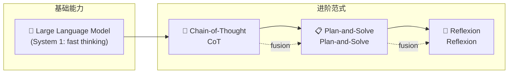

Let’s start with the most fundamental one: Chain‑of‑Thought, and then go deeper step by step.


## 2. Chain‑of‑Thought: Teaching the Model to “Think While Calculating”

### 2.1 Origin and Core Idea of Chain‑of‑Thought

The formal concept of Chain‑of‑Thought was introduced by Jason Wei et al. at Google Research in their 2022 paper *Chain‑of‑Thought Prompting Elicits Reasoning in Large Language Models*. The paper caused a sensation because it revealed a simple yet powerful fact: **adding a phrase like “Let’s think step by step” to the prompt significantly improves model performance on complex reasoning tasks**.

The core idea of CoT can be summarized as: **guiding the model to produce intermediate reasoning steps before arriving at the final answer**. This mimics the natural cognitive process of humans solving complex problems — we don’t jump directly to a conclusion; we write down key steps on scratch paper and derive them one by one.

Classic experiments in the paper showed that on math word problems (GSM8K dataset), the PaLM 540B model using CoT prompting achieved 58% accuracy, compared to only 33% with standard prompting. This near‑doubling of performance convincingly demonstrated the effectiveness of CoT.

### 2.2 Detailed Workflow of Chain‑of‑Thought

The CoT workflow consists of three stages:

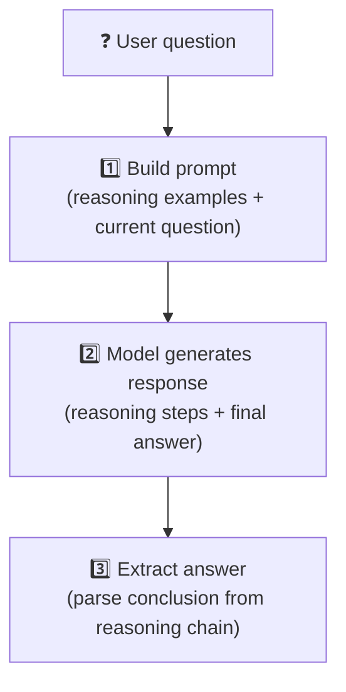

**Stage 1: Build a prompt containing reasoning examples**

CoT prompting is typically **few‑shot** — before asking the target question, a few examples with complete reasoning processes are given. For example:

```
Q: There are 5 apples in a basket. Xiao Ming takes 2, and Xiao Hong puts in 3. How many apples are in the basket now?
A: Initially 5 apples. After Xiao Ming takes 2, 5‑2=3 remain. After Xiao Hong adds 3, the basket has 3+3=6. So the answer is 6.

Q: Xiao Hua buys 3 books, each costs 8 yuan. He pays with a 50‑yuan bill. How much change should he get?
A: Total cost of 3 books is 3×8=24 yuan. With 50 yuan, change is 50‑24=26 yuan. So the answer is 26 yuan.

Q: There are 6 rows of desks, each row has 5 desks. After 8 desks are moved away, how many desks remain?
A: …
```

After seeing the first two examples, the model learns the pattern of “calculate step by step, then give the final answer” and generates a similar structure for the third question.

**Stage 2: Model generates a response with a reasoning chain**

When the model receives the above prompt, it continues the pattern and generates:

```
There are 6 rows, each with 5 desks, so total desks = 6×5=30. After moving away 8, remaining desks = 30‑8=22. So the answer is 22.
```

**Stage 3: Parse and extract the final answer**

In practice, we usually need to extract the final answer from the model’s full output. This can be done by regex matching patterns like “the answer is …” or using an additional classifier.

### 2.3 Variant of CoT: Zero‑shot CoT

Few‑shot CoT requires manually writing examples, which may be inconvenient in some scenarios. Kojima et al. (2022) proposed **zero‑shot Chain‑of‑Thought**, whose key finding is: **simply appending “Let’s think step by step” to the question activates the model’s reasoning ability**.

The zero‑shot CoT prompt format is extremely simple:

```
Q: [user question]
Let’s think step by step.
```

Surprisingly, this extremely simple change achieves improvements comparable to few‑shot CoT on many reasoning tasks. The reason might be that the language model has seen a large amount of data in its pre‑training corpus where “Let’s think step by step” is followed by reasoning steps, and this phrase triggers a specific generation pattern.

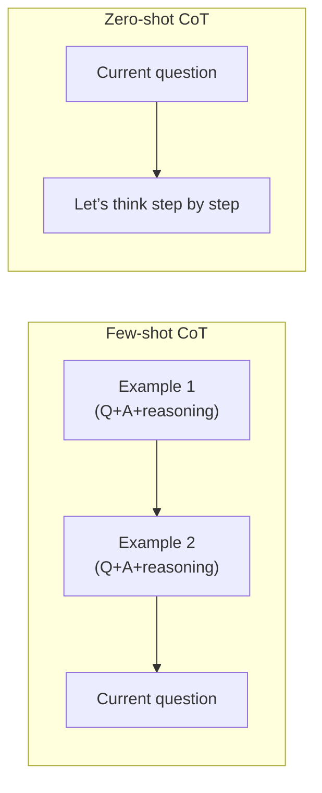

### 2.4 Applicable Scenarios and Limitations of CoT

**Applicable scenarios:**

1. Math word problems: multi‑step arithmetic.
2. Logical reasoning: conditional judgments, syllogisms.
3. Commonsense reasoning: chaining multiple facts.
4. Code debugging: tracing variable changes step by step.

**Limitations:**

1. **Dependence on model scale**: The paper showed that CoT’s benefits become significant only when the model has more than 100B parameters. Small models may see no improvement or even degradation.
2. **Cannot interact with the environment**: CoT reasoning relies entirely on the model’s internal knowledge; it cannot call external tools or query real‑time information.
3. **Lacks error correction**: If the model makes a mistake in one reasoning step, subsequent steps will be based on that false premise, leading to a wrong final answer without self‑correction.
4. **Struggles with very long tasks**: When a task requires dozens of steps, CoT is challenged by context window and attention limitations.

### 2.5 Engineering Implementation Example of CoT

Below is Python code implementing zero‑shot CoT using the OpenAI API:

```python
import openai

def zero_shot_cot(question: str, model: str = "gpt-4") -> str:
    """Answer a question using zero‑shot Chain‑of‑Thought"""
    
    prompt = f"""Question: {question}

Let’s think step by step."""
    
    response = openai.ChatCompletion.create(
        model=model,
        messages=[{"role": "user", "content": prompt}],
        temperature=0
    )
    
    return response.choices[0].message.content

# Example usage
question = "A swimming pool is 25 meters long. Xiao Ming swims 8 laps (there and back). How many meters did he swim in total?"
answer = zero_shot_cot(question)
print(answer)
```

Example output:
```
One lap is going there and back, so distance per lap = 25×2=50 meters.
Xiao Ming swims 8 laps, so total distance = 8×50=400 meters.
Therefore, Xiao Ming swam 400 meters in total.
```

### 2.6 Advanced CoT: Self‑Consistency

An advanced version of CoT is **self‑consistency**. The idea: because there is randomness in the generation of reasoning chains (controlled by the temperature parameter), we can run CoT multiple times, generate several reasoning paths, then vote on the final answers, selecting the most frequent answer as the final output.

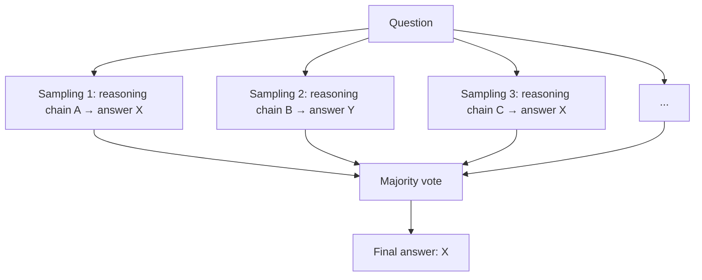

Self‑consistency can further improve accuracy on math reasoning tasks, but at the cost of multiple API calls.


## 3. Plan‑and‑Solve: Guiding the Model to “Plan Before Acting”

### 3.1 From “Think While Doing” to “Plan Before Acting”

CoT solves the “how to reason” problem, but it has a fundamental limitation when facing complex tasks that require multi‑step operations and external tool calls: CoT is a **linear** process that cannot handle branches, loops, or situations needing re‑planning.

Consider this task:
> “Please plan a 3‑day trip to Beijing with a budget of 3000 yuan. It should include transportation, accommodation, attractions, and meals, and also consider the weather.”

This is clearly not a problem that can be “pushed through in one breath”. It requires:
- Searching for attraction information (needs tools)
- Checking hotel prices (needs tools)
- Looking up weather (needs tools)
- Trade‑offs based on the budget
- Finally generating a structured itinerary

CoT cannot effectively handle such tasks because it lacks interaction with the external environment and cannot search for optimal solutions in a complex space. This is exactly the problem that the Plan‑and‑Solve paradigm addresses.

### 3.2 Core Architecture of Plan‑and‑Solve

Plan‑and‑Solve was proposed by Wang et al. in 2023. Its core idea is to clearly separate task processing into two phases:

1. **Planning phase**: The model first generates a detailed step‑by‑step plan, listing all sub‑tasks required to achieve the goal and their execution order.
2. **Execution phase**: The model (or agent) follows the plan step by step, and can call tools during execution.

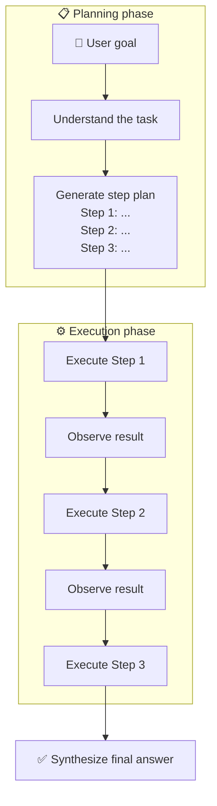

This “plan‑then‑execute” paradigm has significant advantages:
- **Global view**: During planning, the model can consider all parts of the task holistically, avoiding local optima that lead to global suboptimality.
- **Clear structure**: The plan is an intermediate output that can be manually reviewed and debugged.
- **Execution efficiency**: Once the plan is set, execution can focus on tool calls and result processing without repeated complex reasoning.

### 3.3 Prompt Design for Plan‑and‑Solve

Designing a Plan‑and‑Solve prompt requires explicitly guiding the model to produce two‑phase output. Below is a typical zero‑shot Plan‑and‑Solve prompt template:

```
You are a task planning expert. When a user presents a goal, respond in the following format:

First, analyze the user’s goal and understand the core task.

Then, generate a detailed step plan. The plan should include all sub‑tasks needed to complete the goal, and indicate which tool (if any) each step requires.

Plan format:
Step 1: [task description] - [tool name if needed]
Step 2: [task description] - [tool name if needed]
...

Finally, after generating the plan, ask the user whether to confirm execution.

---
User goal: {user_goal}
```

The model, receiving this prompt, might generate a plan like:

```
Analysis: The user needs to plan a 3‑day Beijing trip within 3000 yuan, including transportation, accommodation, attractions, meals, and weather.

Plan:
Step 1: Query the weather forecast for Beijing for the next 3 days - [Weather API]
Step 2: Search for popular attractions in Beijing and filter those that are free or cheap - [Search engine]
Step 3: Query prices of budget hotels, controlling within 300 yuan per night - [Hotel booking API]
Step 4: Query economical transportation options to/from Beijing and costs - [Transport API]
Step 5: Based on the above, create a detailed 3‑day itinerary ensuring total cost ≤ 3000 yuan - [no tool]
Step 6: Present the itinerary to the user and ask for final confirmation

Please confirm whether to execute this plan?
```

### 3.4 Plan‑and‑Execute with Replanning Capability

Pure Plan‑and‑Solve assumes the plan is perfect once made, but in real environments, unexpected situations often arise during execution:
- A tool call fails (e.g., API returns an error)
- Intermediate results differ from expectations (e.g., hotel prices far exceed budget)
- Environmental information changes (e.g., sudden weather change makes outdoor attractions infeasible)

Therefore, modern agent frameworks like LangGraph have introduced **Plan‑and‑Execute with Replanning**, where the plan is dynamically evaluated during execution and re‑planning is triggered when necessary.

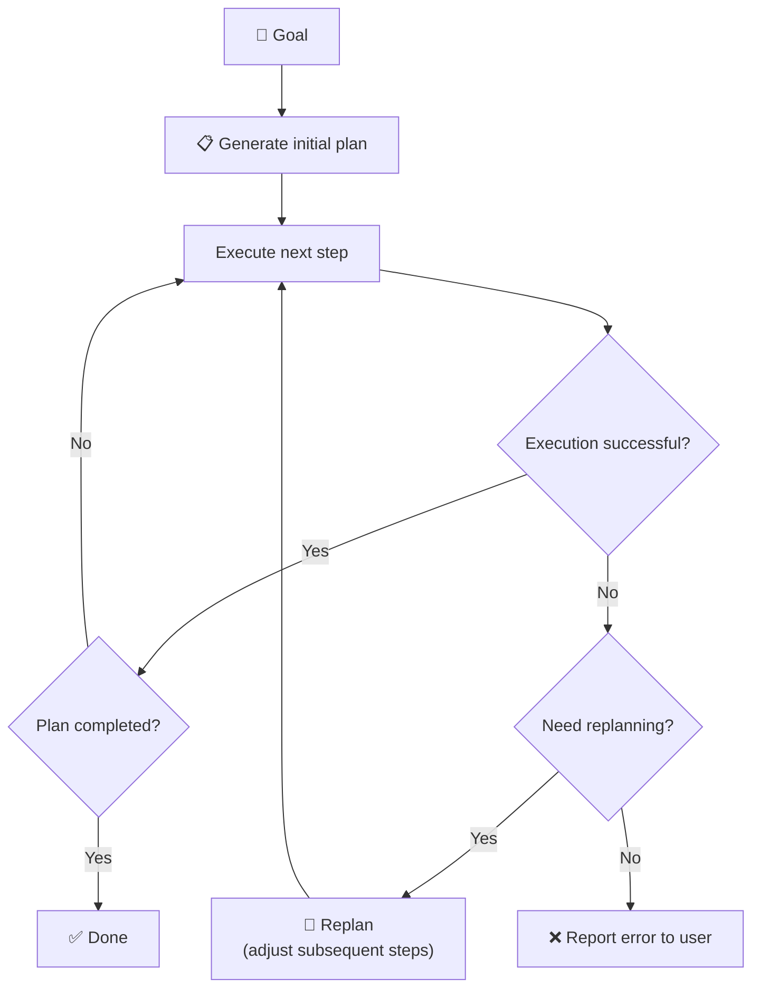

This dynamic adjustment capability makes Plan‑and‑Execute more suitable for long‑running tasks in production environments. The Reflexion mechanism, introduced next, is a further deepening of this idea.

### 3.5 Comparison between Plan‑and‑Solve and CoT

| Dimension | Chain‑of‑Thought | Plan‑and‑Solve |
|-----------|------------------|----------------|
| **Reasoning structure** | Linear chain | Hierarchical plan tree |
| **Task length** | Suitable for medium length (3‑10 steps) | Suitable for long tasks (10+ steps) |
| **Tool interaction** | Cannot call tools | Can call tools during execution |
| **Error recovery** | Cannot correct reasoning errors | Can replan parts of the plan |
| **Interpretability** | Reasoning steps readable | Plan document clear and auditable |
| **Computational cost** | Single LLM call | Multiple LLM calls (planning + each step execution) |
| **Applicable scenarios** | Math, logic puzzles | Travel planning, project decomposition, complex reports |

### 3.6 Engineering Implementation Example of Plan‑and‑Solve

The following code shows a simplified Plan‑and‑Execute agent:

```python
import openai
from typing import List, Dict, Any

class PlanAndExecuteAgent:
    def __init__(self, model: str = "gpt-4"):
        self.model = model
        self.plan: List[Dict[str, Any]] = []
        self.execution_history: List[Dict] = []
    
    def generate_plan(self, goal: str) -> List[str]:
        """Generate a task plan"""
        prompt = f"""You are a task planning expert. Generate a detailed step plan for the user’s goal.
        
User goal: {goal}

Output the plan in the following format (one step per line, starting with "Step N:"):
Step 1: [description of first step]
Step 2: [description of second step]
...
"""
        response = openai.ChatCompletion.create(
            model=self.model,
            messages=[{"role": "user", "content": prompt}],
            temperature=0
        )
        
        plan_text = response.choices[0].message.content
        steps = []
        for line in plan_text.split('\n'):
            if line.strip().startswith('Step'):
                steps.append(line.strip())
        return steps
    
    def execute_step(self, step: str, tools: Dict) -> str:
        """Execute a single step"""
        # Parse whether the step needs tools
        # Simplified implementation: directly call LLM to execute the step
        prompt = f"""Execute the following task step. You may use the provided tools:
        
Step: {step}
Available tools: {list(tools.keys())}

Output the execution result."""
        
        response = openai.ChatCompletion.create(
            model=self.model,
            messages=[{"role": "user", "content": prompt}],
            temperature=0,
            functions=tools  # pass tool definitions
        )
        
        return response.choices[0].message.content
    
    def run(self, goal: str, tools: Dict) -> str:
        """Run the full planning‑execution flow"""
        # 1. Generate plan
        steps = self.generate_plan(goal)
        print(f"📋 Generated plan ({len(steps)} steps):")
        for s in steps:
            print(f"   {s}")
        
        # 2. Execute step by step
        results = []
        for i, step in enumerate(steps):
            print(f"\n⚙️ Executing Step {i+1}...")
            result = self.execute_step(step, tools)
            results.append(result)
            self.execution_history.append({
                "step": step,
                "result": result
            })
            print(f"   Result: {result[:100]}...")
        
        # 3. Synthesize
        final_prompt = f"""Based on the following execution history and the original goal, generate the final answer.
        
Original goal: {goal}
Execution history: {self.execution_history}

Provide a complete final answer."""
        
        final_response = openai.ChatCompletion.create(
            model=self.model,
            messages=[{"role": "user", "content": final_prompt}],
            temperature=0
        )
        
        return final_response.choices[0].message.content
```


## 4. Reflexion: Endowing the Model with the Ability to “Correct Mistakes”

### 4.1 From “One‑shot Attempt” to “Iterative Improvement”

Both CoT and Plan‑and‑Solve assume that the model’s initial reasoning or plan is (or should be) correct. However, in real‑world complex tasks, first attempts often fail — that is the norm, not the exception.

An important trait of human experts is **metacognitive ability** — the capacity to examine one’s own thinking process, identify errors, and learn from them to improve. The Reflexion framework, inspired by this, aims to give AI agents a similar ability for reflection and self‑correction.

Reflexion was proposed by Shinn et al. in 2023, with the full name *Reflexion: Language Agents with Verbal Reinforcement Learning*. Its core innovation is: **introducing a language‑based feedback loop, allowing the agent to verbally express its evaluation of its own performance, and store that reflection as long‑term memory to guide future actions**.

### 4.2 Architecture of Reflexion

The Reflexion framework consists of three core components:

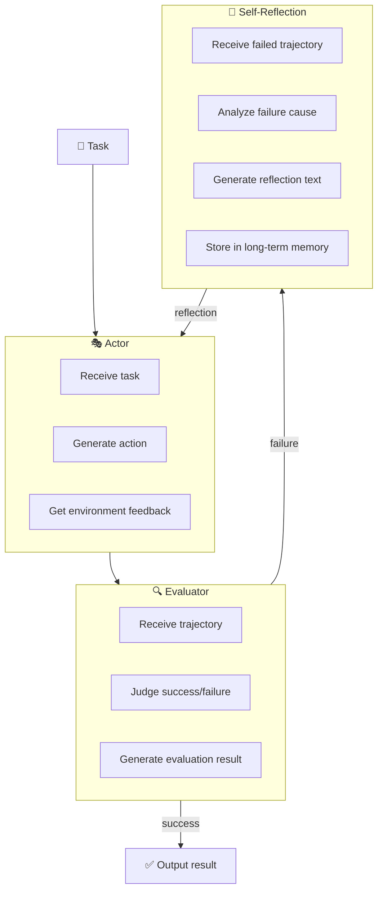

**Actor**: Responsible for generating actions based on the current task and existing memory (including past reflections). It can be any agent capable of interacting with the environment, such as a ReAct agent or a Plan‑and‑Execute agent.

**Evaluator**: Takes the actor’s trajectory (a sequence of actions and observations) and determines whether the task has been successfully completed. In programming tasks, the evaluator could be the result of running unit tests; in Q&A tasks, it could be a comparison of the answer with a ground truth.

**Self‑Reflection**: This is the core module of Reflexion. When the evaluator deems the task a failure, the Self‑Reflection module analyzes the failed trajectory and generates a natural language **reflection text**. This reflection typically includes:
- Where did the error occur?
- Why did it occur?
- How to improve next time?

The generated reflection text is stored in **long‑term memory** (e.g., a vector database). When executing a similar task later, relevant reflections are retrieved and provided as additional context to the actor, helping it avoid repeating the same mistakes.

### 4.3 The Reflection Generation Process

The generation of reflections itself relies on the LLM’s meta‑reasoning ability. A typical prompt is:

```
You are analyzing a failure case of an AI agent performing a task. Read the following execution trajectory carefully and generate a reflection.

Task description: {task_description}
Execution trajectory:
{trajectory}

Task final status: Failure

Analyze the cause of failure and propose concrete suggestions for improvement in the next execution.

Reflection format:
Failure cause: [analysis]
Improvement suggestions: [specific actionable suggestions]
```

Example reflection generated by the model:

```
Failure cause: In Step 2, when querying hotels, the agent mistakenly used “Beijing” as the city code instead of “BJS”, causing the API to return an empty result. The agent did not check the API’s return status and directly assumed no hotels were available, skipping accommodation arrangement.

Improvement suggestions:
1. Before calling the API, consult the city code table to ensure the correct city code is used.
2. After each API call, always check the return status. If an error or empty result occurs, first try correcting parameters and call again, rather than skipping directly.
3. Critical steps (such as accommodation booking) should not be abandoned after a single failure; alternative solutions should be attempted.
```

### 4.4 Storing and Retrieving Reflection Memories

Reflection texts need to be stored and retrieved effectively so they can be used in future related tasks. In engineering, vector databases are typically used:

```python
from langchain.vectorstores import Chroma
from langchain.embeddings import OpenAIEmbeddings

# Initialize vector store
vectorstore = Chroma(
    collection_name="reflexion_memory",
    embedding_function=OpenAIEmbeddings()
)

def store_reflection(task: str, reflection: str):
    """Store a reflection in long‑term memory"""
    vectorstore.add_texts(
        texts=[reflection],
        metadatas=[{"task": task}]
    )

def retrieve_relevant_reflections(task: str, k: int = 3) -> List[str]:
    """Retrieve historical reflections most relevant to the current task"""
    docs = vectorstore.similarity_search(task, k=k)
    return [doc.page_content for doc in docs]
```

When executing a new task, the actor’s prompt includes the retrieved relevant reflections:

```
Below are historical reflections from similar tasks. Please refer to them when planning.

[Reflection 1]: ...
[Reflection 2]: ...

Current task: {task}
Incorporate the lessons learned above and generate an execution plan.
```

### 4.5 Typical Application Scenarios for Reflexion

**1. Code generation and debugging**

Reflexion excels at programming tasks. The actor attempts to write code, the evaluator runs unit tests; if tests fail, Self‑Reflection analyzes the error messages and code logic, generating improvement suggestions. After a few iterations, the agent can usually produce code that passes the tests.

**2. Complex Q&A and reasoning**

In multi‑step reasoning Q&A tasks (e.g., HotpotQA), Reflexion allows the agent to learn from incorrect inferences. For example, if the agent mistakenly uses an unreliable fact, the reflection will point out that the source is unreliable, guiding the agent to seek more authoritative sources in the next retrieval.

**3. Decision‑making tasks**

In sequential decision‑making environments such as web navigation or games, Reflexion significantly improves the agent’s success rate. The agent remembers which action paths lead to dead ends and which strategies are more effective.

### 4.6 Relationship Between Reflexion and RLHF

The design philosophy of Reflexion shares similarities with **Reinforcement Learning from Human Feedback**, but the implementation paths are quite different:

| Dimension | RLHF | Reflexion |
|-----------|------|-----------|
| **Feedback form** | Scalar reward signal | Natural language reflection |
| **Learning method** | Updates model parameters | In‑context learning (no parameter update) |
| **Data requirement** | Large amount of human preference labels | Small number of task execution trajectories |
| **Generalization** | Internalized into model weights | Relies on memory retrieval |
| **Computational cost** | High (model training) | Low (LLM inference) |

Reflexion is essentially a form of **in‑context reinforcement learning**, leveraging the LLM’s metacognitive ability to achieve “verbal reinforcement” while avoiding expensive parameter updates.

### 4.7 Limitations of Reflexion

1. **Reflection quality depends on the LLM**: If the underlying LLM’s meta‑reasoning ability is insufficient, the generated reflections may be low‑quality or even introduce misleading suggestions.
2. **Memory bloat**: As the number of task executions grows, the reflection memory store expands; eviction strategies are needed.
3. **Reflection generalization**: Overly specific reflections may not generalize to slightly different new tasks; the model needs appropriate abstraction ability.
4. **Evaluator dependency**: Reflexion requires a reliable evaluator to judge task success. For open‑domain tasks, automatic evaluation is challenging in itself.


## 5. Comparison and Fusion of the Three Paradigms

### 5.1 Progressive Relationship of Capabilities

Looking at CoT, Plan‑and‑Solve, and Reflexion together, we see a clear **progression of capabilities**:

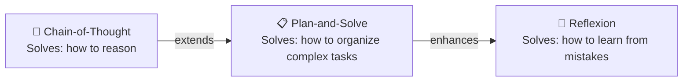

- **CoT** is the foundation: it gives the model the most basic “slow thinking” ability — making reasoning steps explicit.
- **Plan‑and‑Solve** adds **structured decomposition** and **tool‑calling** on top of CoT, enabling the model to handle longer, more complex tasks.
- **Reflexion** adds a **feedback‑learning loop** on top of Plan‑and‑Solve, allowing the model to iteratively improve and gradually approach the optimal solution.

### 5.2 Decision Framework for Technology Selection

In practice, the appropriate technique should be chosen based on task characteristics:

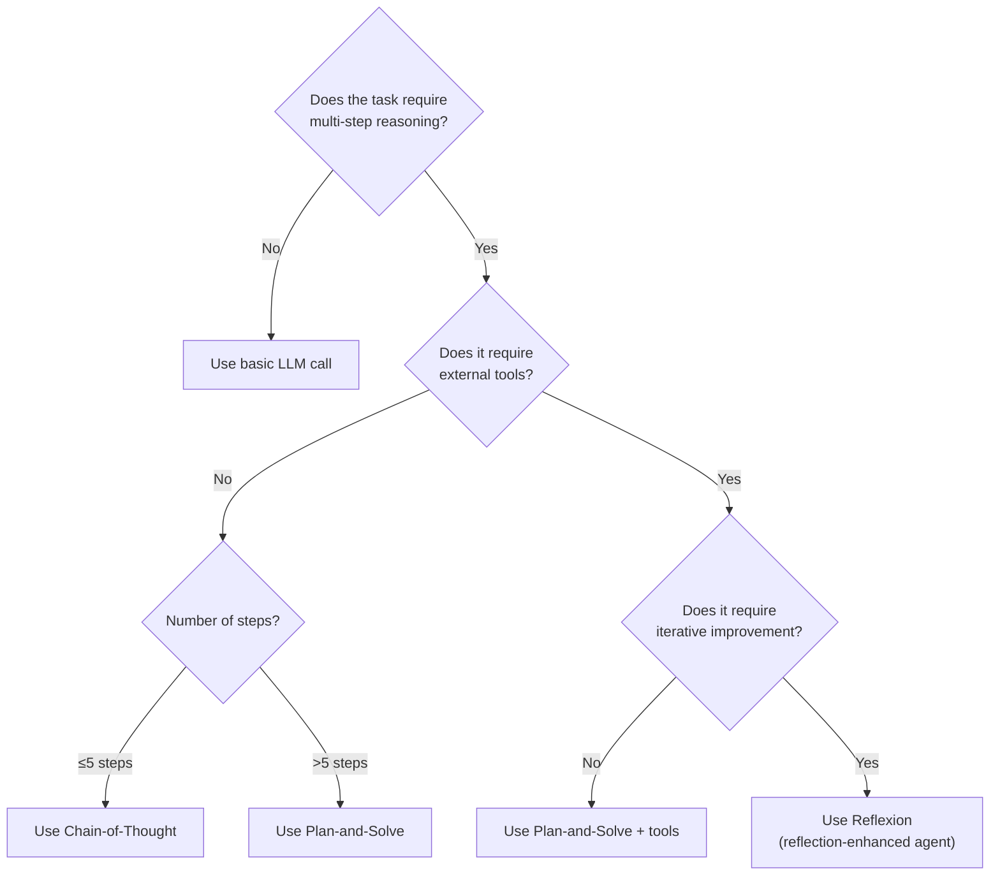

### 5.3 Integration Trend: Next‑Generation Agent Architectures

Modern AI agent frameworks (e.g., LangGraph, AutoGPT, MetaGPT) have organically fused these three paradigms:

- **Planning phase** uses Plan‑and‑Solve ideas to generate a structured task decomposition.
- **Execution phase** uses CoT for fine‑grained reasoning on each atomic task.
- **Overall flow** incorporates Reflexion, triggering reflection and replanning when tasks fail or results are unsatisfactory.

This architecture of “CoT for step, Plan for task, Reflexion for learning” has become the **de facto standard** for current agent systems.

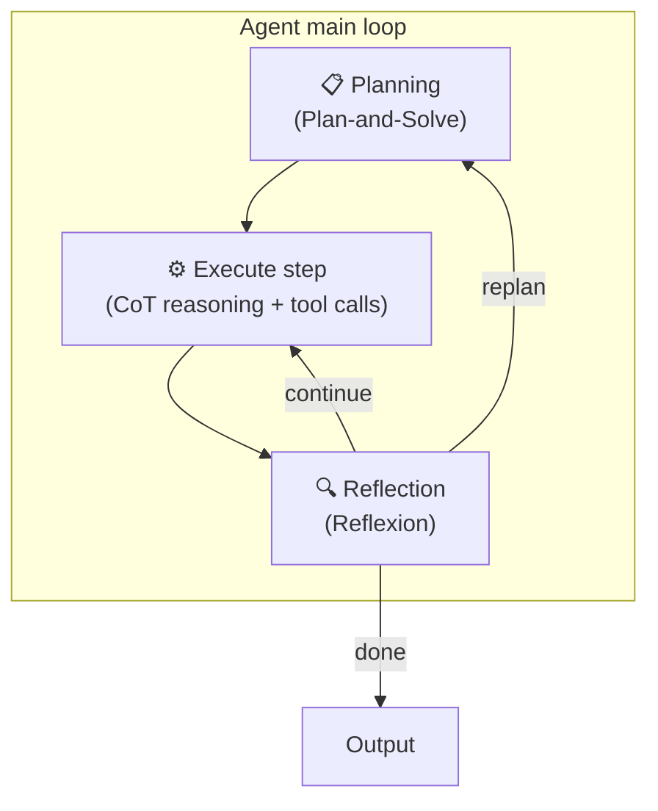


## 6. Hands‑on: Building a Reflective Reasoning Agent

Now that the theory is covered, let’s build a reasoning agent that integrates ideas from CoT, Plan‑and‑Solve, and Reflexion. This agent will solve a classic logic puzzle — the **Einstein Puzzle** (Who owns the fish?).

### 6.1 Task Definition

The Einstein Puzzle is a classic logic puzzle involving five people of different nationalities, living in five houses of different colors, smoking different brands of cigarettes, drinking different beverages, and keeping different pets. Based on 15 clues, you must deduce who owns the fish. This puzzle requires systematic, multi‑step logical deduction and is an excellent benchmark for reasoning ability.

### 6.2 Agent Design

We will implement a **Plan‑and‑Execute with Reflexion** agent:

1. **Planner**: Generates a logical reasoning plan (e.g., “build a table”, “analyze clues one by one”, “use elimination”).
2. **Executor**: Uses CoT to perform reasoning step by step, recording the reasoning state.
3. **Evaluator**: Checks whether the reasoning result is self‑consistent and whether any clues were missed.
4. **Reflector**: If evaluation fails, analyzes reasoning flaws, generates improvement suggestions, and re‑executes.

### 6.3 Code Implementation

```python
import openai
import json
from typing import List, Dict, Optional, Tuple

class ReflexionReasoningAgent:
    def __init__(self, model: str = "gpt-4"):
        self.model = model
        self.reflection_memory: List[str] = []
        self.max_iterations = 3
        
    def plan(self, problem: str) -> List[str]:
        """Generate a reasoning plan"""
        # Incorporate historical reflections into the prompt
        reflection_context = ""
        if self.reflection_memory:
            reflection_context = "\n\nHistorical reflections (please refer to them):\n" + "\n".join(
                [f"- {r}" for r in self.reflection_memory[-3:]]
            )
        
        prompt = f"""You are a logic reasoning expert. Create a detailed reasoning plan for the following problem.

Problem:
{problem}

{reflection_context}

Generate a step‑by‑step reasoning plan. Each step should describe a specific reasoning operation. Format:
Step 1: [what to do first]
Step 2: [what to do next]
...

Plan:"""
        
        response = openai.ChatCompletion.create(
            model=self.model,
            messages=[{"role": "user", "content": prompt}],
            temperature=0
        )
        
        plan_text = response.choices[0].message.content
        steps = []
        for line in plan_text.split('\n'):
            if line.strip().startswith('Step'):
                steps.append(line.strip())
        return steps
    
    def execute_reasoning(self, problem: str, plan: List[str]) -> Tuple[str, str]:
        """Execute reasoning using CoT"""
        plan_str = "\n".join(plan)
        
        prompt = f"""Follow the plan below and reason step by step to solve the problem. For each step, show your thinking process (Chain‑of‑Thought).

Problem:
{problem}

Reasoning plan:
{plan_str}

Start reasoning, marking each step with "Step N:". Show your intermediate conclusions after each step. Finally, give the answer.
"""
        
        response = openai.ChatCompletion.create(
            model=self.model,
            messages=[{"role": "user", "content": prompt}],
            temperature=0
        )
        
        trajectory = response.choices[0].message.content
        
        # Extract final answer (simplified; a production system would need more robust parsing)
        lines = trajectory.split('\n')
        answer = ""
        for i in range(len(lines)-1, -1, -1):
            if "answer" in lines[i].lower() or "final" in lines[i].lower() or "fish" in lines[i].lower():
                answer = '\n'.join(lines[i:])
                break
        
        return trajectory, answer
    
    def evaluate(self, problem: str, trajectory: str, answer: str) -> Tuple[bool, str]:
        """Evaluate reasoning quality"""
        prompt = f"""Evaluate the quality of the following logical reasoning.

Original problem:
{problem}

Reasoning process:
{trajectory}

Final answer:
{answer}

Evaluate along these dimensions:
1. Is the reasoning complete? Were all given clues used?
2. Are there any logical contradictions?
3. Is the answer clear?

If evaluation passes, respond with "PASS" and a brief explanation. If not, respond with "FAIL" and specify the issues."""
        
        response = openai.ChatCompletion.create(
            model=self.model,
            messages=[{"role": "user", "content": prompt}],
            temperature=0
        )
        
        eval_result = response.choices[0].message.content
        passed = "PASS" in eval_result and "FAIL" not in eval_result
        
        return passed, eval_result
    
    def reflect(self, problem: str, trajectory: str, eval_result: str) -> str:
        """Generate a reflection"""
        prompt = f"""The following is a failed logical reasoning attempt. Analyze the failure cause and generate a reflection to help avoid similar mistakes next time.

Problem: {problem}
Reasoning process: {trajectory}
Evaluation result: {eval_result}

Generate a reflection (start with "Reflection:" and include the failure cause and concrete improvement suggestions):"""
        
        response = openai.ChatCompletion.create(
            model=self.model,
            messages=[{"role": "user", "content": prompt}],
            temperature=0.3  # add a little randomness for diverse reflections
        )
        
        reflection = response.choices[0].message.content
        return reflection
    
    def solve(self, problem: str) -> Dict:
        """Main solving flow"""
        for iteration in range(self.max_iterations):
            print(f"\n{'='*60}")
            print(f"🔄 Iteration {iteration + 1}/{self.max_iterations}")
            
            # 1. Plan
            print("📋 Generating reasoning plan...")
            plan = self.plan(problem)
            for step in plan:
                print(f"   {step}")
            
            # 2. Execute reasoning
            print("\n🧠 Executing reasoning...")
            trajectory, answer = self.execute_reasoning(problem, plan)
            print(f"   Reasoning complete, answer preview: {answer[:100]}...")
            
            # 3. Evaluate
            print("\n🔍 Evaluating reasoning quality...")
            passed, eval_result = self.evaluate(problem, trajectory, answer)
            print(f"   Evaluation result: {'✅ PASS' if passed else '❌ FAIL'}")
            
            if passed:
                return {
                    "success": True,
                    "answer": answer,
                    "trajectory": trajectory,
                    "iterations": iteration + 1
                }
            
            # 4. Reflect
            print("\n💭 Generating reflection...")
            reflection = self.reflect(problem, trajectory, eval_result)
            self.reflection_memory.append(reflection)
            print(f"   {reflection[:200]}...")
        
        return {
            "success": False,
            "message": f"Failed evaluation after {self.max_iterations} iterations",
            "reflections": self.reflection_memory
        }

# Example usage
agent = ReflexionReasoningAgent(model="gpt-4")

einstein_puzzle = """
There are five houses in a row, each of a different color. The owners have different nationalities, drink different beverages, smoke different brands of cigarettes, and keep different pets.

Clues:
1. The Brit lives in the red house.
2. The Swede keeps dogs.
3. The Dane drinks tea.
4. The green house is immediately left of the white house.
5. The owner of the green house drinks coffee.
6. The person who smokes Pall Mall keeps birds.
7. The owner of the yellow house smokes Dunhill.
8. The person in the center house drinks milk.
9. The Norwegian lives in the first house.
10. The person who smokes Blends lives next to the one who keeps cats.
11. The person who keeps horses lives next to the person who smokes Dunhill.
12. The person who smokes Blue Master drinks beer.
13. The German smokes Prince.
14. The Norwegian lives next to the blue house.
15. The person who smokes Blends has a neighbor who drinks water.

Question: Who owns the fish?
"""

result = agent.solve(einstein_puzzle)
print("\n" + "="*60)
print("🏁 Final result:")
if result["success"]:
    print(f"Answer: {result['answer']}")
    print(f"Iterations completed: {result['iterations']}")
else:
    print(f"Solving failed: {result['message']}")
```

### 6.4 Analysis of Running Effect

In a typical run, the agent might go through the following process:

**First round**:
- Plan: creates a plan to “analyze clues one by one and fill a table”.
- Execution: performs reasoning but might miss a clue, resulting in an inability to uniquely determine the fish owner.
- Evaluation: fails, pointing out “clues 10‑15 were not used after step 5, answer incomplete”.
- Reflection: generates an experience like “during reasoning, maintain a checklist to ensure every clue is used”.

**Second round**:
- Plan: based on the reflection, the plan now includes a “maintain clue usage checklist” step.
- Execution: applies all clues completely.
- Evaluation: passes.
- Returns the correct answer.

This example clearly demonstrates how Reflexion solves complex reasoning problems through the “try‑fail‑reflect‑improve” cycle.


## 7. Frontier Exploration: Beyond Current Paradigms

### 7.1 Tree‑of‑Thoughts

Although CoT is effective, its linear structure limits the model’s ability to **explore** the reasoning space. For a complex problem, there may be multiple reasoning paths — some lead to dead ends, others to the correct answer. CoT can only follow one path without turning back.

**Tree‑of‑Thoughts** extends CoT by modeling reasoning as a **search tree**:
- Each node represents an intermediate reasoning state.
- From each node, the model can generate multiple candidate “next thoughts”.
- The model evaluates each candidate’s value and continues with the most promising path.
- If a path proves invalid, it can backtrack to the branch point and try another path.

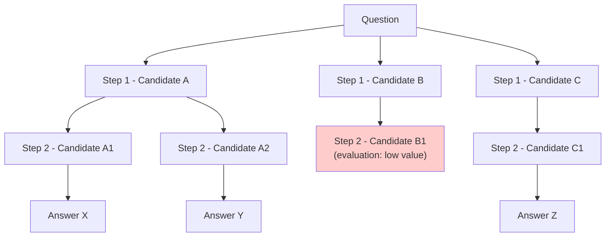

Tree‑of‑Thoughts performs well on tasks that require search (e.g., 24‑point game, creative writing), but at the cost of significantly increased computation.

### 7.2 Graph‑of‑Thoughts

Graph‑of‑Thoughts further generalizes the tree concept, allowing arbitrary **graph structures** among reasoning nodes. In a Graph‑of‑Thoughts, the model can connect, merge, and cross‑reference different reasoning fragments, forming a richer and more flexible reasoning network.

### 7.3 Multi‑Agent Debate

Another interesting direction is to have multiple agents hold different viewpoints and engage in debate, approaching truth through the clash of opinions. Each agent uses CoT to generate its own arguments, then they cross‑examine each other, and finally a judge agent draws a conclusion based on the debate process. This approach shows promise in scenarios requiring multi‑perspective examination, such as fact‑checking and policy analysis.

### 7.4 Deep Integration with Reinforcement Learning

Reflexion has already shown the role of language feedback in agent learning. A future trend is to integrate language feedback more closely with **parametric reinforcement learning** — using language feedback to generate training signals to fine‑tune model parameters, so that the model can improve not only in‑context but also permanently enhance its reasoning ability. Research such as Quiet‑STaR and RLFV (Reinforcement Learning from Verbal Feedback) is exploring this direction.


## 8. Summary and Best Practice Recommendations

### 8.1 Core Value Recap of the Three Paradigms

| Paradigm | One‑sentence summary | When to use |
|----------|----------------------|--------------|
| **Chain‑of‑Thought** | Writing out the thinking process naturally improves accuracy | Math problems, logic puzzles, Q&A that requires showing steps |
| **Plan‑and‑Solve** | Plan first, then act — keeps complex tasks under control | Travel planning, report writing, multi‑step operations |
| **Reflexion** | Reflect on failures, do better next time | Tasks needing iterative improvement, exploratory tasks |

### 8.2 Engineering Practice Checklist

**Chain‑of‑Thought implementation checklist**:
- [ ] For complex reasoning tasks, add “Let’s think step by step” to the prompt
- [ ] Assess whether few‑shot examples are needed (provide 2‑3 examples with complete reasoning)
- [ ] Consider using self‑consistency (multiple samples + voting) to further improve accuracy
- [ ] For small models (<10B), evaluate whether CoT actually helps

**Plan‑and‑Solve implementation checklist**:
- [ ] Clearly separate planning and execution phases
- [ ] The output of the planning phase should be structured and traceable
- [ ] Keep human confirmation points during execution (ask for confirmation before critical actions)
- [ ] Design a replanning mechanism to handle unexpected situations during execution

**Reflexion implementation checklist**:
- [ ] Design a reliable evaluator (automated tests, rule checks, LLM evaluation)
- [ ] Build a storage and retrieval system for reflection memories
- [ ] Set a maximum number of iterations to avoid infinite loops
- [ ] Monitor reflection quality to prevent low‑quality reflections from polluting the memory store

### 8.3 Cost‑Effectiveness Trade‑offs

Finally, it must be recognized that **stronger reasoning ability comes at a cost**:

- **CoT**: Adds about 20‑50% extra output tokens (because of the reasoning steps).
- **Plan‑and‑Solve**: Requires multiple LLM calls (planning + per‑step execution), total cost may double or more.
- **Reflexion**: Cost depends on the number of iterations, potentially 3‑10 times the base call.

Therefore, in practice, the trade‑off should be based on the value of the task and user tolerance. A common strategy is **hierarchical routing**:
- Simple questions → basic LLM.
- Moderately complex questions → CoT.
- Complex but structured problems → Plan‑and‑Solve.
- High‑value problems that can tolerate longer waiting times → Reflexion.

---

*From Chain‑of‑Thought to Reflexion, we have witnessed the evolution of large language models from “fast thinking” toward “slow thinking”. These three paradigms not only represent advances in prompt engineering but also reflect our ongoing exploration of the nature of intelligence — intelligence is not just knowledge storage, but also the ability to reason, plan, and learn. When your AI application needs to solve truly complex problems, we hope this article provides clear guidance.*
```