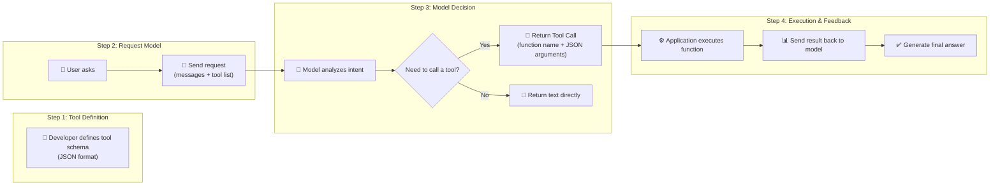

# Large Model Tool Use (Function Calling): From Principles to Terminal AI Agents — A Complete Guide

> **Abstract**: No matter how intelligent a large language model is, it remains a brain “frozen” by its training data — it cannot query real-time weather, send emails, or execute terminal commands for you. Tool Use (Function Calling) is the key technology that breaks this barrier, evolving the model from “only talking” to “truly acting.” This article systematically dissects the core principles of OpenAI Function Calling, including JSON Schema tool definitions, model decision‑making, parameter parsing, and result feedback mechanisms, and deeply analyzes the implementation differences of Claude Tool Use. Finally, we turn our gaze to cutting‑edge applications — Codex CLI, Copilot CLI, and Cursor — interpreting how AI agents move from API interfaces to the terminal, becoming programming partners that can truly “get their hands dirty.”


## 1. Introduction: A Paradigm Shift Sparked by a Weather Query

Imagine this scenario: you open an AI assistant and ask, “What’s the current weather in Jiangsu Province?” If this were before 2023, a large language model would likely produce a plausible‑sounding answer — but unfortunately, that answer would be fabricated. GPT‑3.5’s knowledge ends in September 2021, GPT‑4’s in April 2023; they simply don’t know the weather “now.”

This is the fundamental limitation of traditional LLMs: **knowledge staleness and lack of external interaction**. The model’s parameters store knowledge “learned” during training, not real‑time information. It cannot browse the web, call APIs, or operate databases. Faced with requests like “now,” “my,” “help me do,” the LLM can only guess an answer based on its parametric memory — academically called “hallucination.”

In June 2023, OpenAI released a seemingly low‑key but profoundly influential feature: **Function Calling**. It allows developers to describe available functions in the API request, and the model intelligently decides whether to call a function, returning structured JSON parameters. This mechanism elevates the LLM from a “responder” to an “actor” — the model no longer directly generates the final answer, but outputs a machine‑readable “tool call instruction,” letting the application layer execute the actual operation and then feed the result back to the model for the final reply.

The significance of this paradigm shift cannot be overstated. If we think of the LLM as the brain, Function Calling connects the brain with “hands and feet” — the brain thinks “I need to check the weather,” the hands and feet execute the API call, and finally the brain organizes the returned data into user‑friendly natural language. This is the cornerstone of AI Agent technology.


## 2. Core Principles of Function Calling: A Four‑Step Closed Loop

### 2.1 Overall Architecture: The Model Doesn’t Execute, It Only “Orders”

Before diving into API details, a common misconception must be clarified: **The large model itself does not execute any function**. The name “Function Calling” is somewhat misleading — the model does not actually call your code. Its real mode of operation is: after understanding the user’s intent, the model judges that “this request requires a certain tool,” then generates a structured JSON object telling the application layer, “Please call this function with the following parameters.” The actual execution is still done by your application code.

The entire flow forms a four‑step closed loop:



### 2.2 Step 1: Tool Definition — Tell the Model “What You Can Do”

Tool definition is the starting point of the whole process. The developer declares to the model “which functions you can use.” Each declaration contains three core fields:

- **`type`**: fixed as `"function"` (the newer API uniformly uses the `tools` field).
- **`name`**: a unique identifier for the function, used by the model to “name” which function to call.
- **`description`**: a natural language description of what the function does. **This is the most critical line** — the model uses this description to decide whether the current task requires calling this function.
- **`parameters`**: defines the parameter types, required fields, value ranges, etc., using JSON Schema.

A complete tool definition example:

```json
{
  "type": "function",
  "function": {
    "name": "get_current_weather",
    "description": "Get the current weather for a specified location",
    "parameters": {
      "type": "object",
      "properties": {
        "location": {
          "type": "string",
          "description": "City and state/province, e.g., San Francisco, CA"
        },
        "unit": {
          "type": "string",
          "enum": ["celsius", "fahrenheit"],
          "description": "Temperature unit"
        }
      },
      "required": ["location"]
    }
  }
}
```

When this definition is sent together with the user request to the model, the model knows: “I have a tool that can get the weather; it needs a location and optionally a temperature unit.” This is the classic example given by OpenAI.

### 2.3 Step 2: Model Decision — Judge “Whether to Call” and “Which One to Call”

When the user asks “What’s the weather like in San Francisco now?”, the model receives the message content and the list of available tools. The model has been fine‑tuned to detect when a function should be called — based on semantic matching between the user input and the tool descriptions.

This process can be broken into two sub‑decisions:

**Decision 1: Is a tool needed?** The model evaluates: can I answer this question directly? If the question involves real‑time information, user‑private data, or needs to perform an action, the model decides “a tool call is needed.” If the question is knowledge‑based like “What is function calling?”, the model can answer directly and will not trigger a tool call.

**Decision 2: Which tool to call?** When multiple tools are defined, the model selects the most appropriate one (or ones) based on semantic matching of the tool descriptions. The model determines the required tool through semantic analysis, then extracts parameter values from the context to fill in.

### 2.4 Step 3: Parameter Generation — From Natural Language to Structured JSON

Once the model decides to call a certain tool, it extracts the required parameters from the user’s natural language and generates a structured JSON object. The model’s response is not ordinary text, but a `tool_call` object containing the function name and arguments:

```json
{
  "role": "assistant",
  "tool_calls": [
    {
      "id": "call_abc123",
      "type": "function",
      "function": {
        "name": "get_current_weather",
        "arguments": "{\"location\": \"San Francisco, CA\", \"unit\": \"celsius\"}"
      }
    }
  ]
}
```

The `arguments` field is a JSON string whose structure strictly follows the parameters schema declared in the tool definition. This is the advantage of Function Calling over traditional “let the model output JSON” approaches: **the model is specially trained to output arguments that better conform to the schema, greatly reducing parsing failures**.

It is worth emphasizing that OpenAI originally used the `functions` and `function_call` parameters for this functionality; those are now **deprecated**, and the official recommendation for new code is to use the `tools` and `tool_choice` style instead. `tool_choice` can be set to:
- `"auto"`: the model decides whether to call a tool (default).
- `"none"`: force no tool call.
- `{"type": "function", "function": {"name": "xxx"}}`: force a specific function call.

### 2.5 Step 4: Execution & Feedback — Closing the Loop

After the model returns the tool call, control passes back to the application code:
1. **Parse the tool call**: extract `function.name` and `function.arguments`.
2. **Execute the corresponding function**: call your pre‑implemented function with the parsed arguments.
3. **Obtain the execution result**: the function returns data (e.g., a weather API response).
4. **Send the result back to the model**: as a `role: "tool"` message, including the `tool_call_id` and the function output.
5. **Model generates the final answer**: the model, having received the real data, organizes it into natural language and returns it to the user.

This closed loop implements the complete chain of “brain thinks → hands and feet act → brain synthesizes and reports.” As summarized in agent design patterns: function calling is the technical mechanism that bridges the gap between LLM reasoning capabilities and a vast array of external functionalities.


## 3. Detailed Tool Schema Definition: Engineering Practice with JSON Schema

### 3.1 Core Elements of a Schema

The tool schema is the “contract” of Function Calling. A high‑quality definition enables the model to accurately understand the tool’s purpose and usage. Beyond the three elements mentioned earlier (`name`, `description`, `parameters`), JSON Schema supports many rich constraints.

**Basic types**: `type` supports `string`, `number`, `integer`, `boolean`, `object`, `array`. For example, when querying orders, you can use `integer` for quantity and `boolean` for payment status.

**Enum values (`enum`)**: When a parameter has only a few fixed options, use `enum` to restrict the value range, reducing the risk of the model “improvising.” For example, temperature units: `["celsius", "fahrenheit"]`.

**Required fields (`required`)**: Use an array to mark which parameters are required; the model ensures these fields appear in the generated arguments.

**Numeric constraints**: `minimum`, `maximum` limit the numeric range; `multipleOf` restricts multiples. For example, a weight parameter can be limited between 0.1 and 50.

**String format (`format`)**: Can declare `date`, `date-time`, `email`, `uri`, etc., guiding the model to output compliant strings.

**Nested objects and arrays**: Schemas support multi‑level nesting. For example, a function that extracts people data can have an array parameter, each element containing fields like name, birthday, location — exactly what the OpenAI `extract_people_data` example does.

### 3.2 Complex Schema in Practice: Defining a Multi‑Parameter Function

Here is a production‑like example — a function definition for creating an order:

```json
{
  "type": "function",
  "function": {
    "name": "create_order",
    "description": "Create a new order for a user",
    "parameters": {
      "type": "object",
      "properties": {
        "customer_id": {
          "type": "string",
          "description": "Unique customer identifier"
        },
        "items": {
          "type": "array",
          "description": "List of ordered items",
          "items": {
            "type": "object",
            "properties": {
              "product_id": {"type": "string"},
              "quantity": {"type": "integer", "minimum": 1},
              "color": {"type": "string", "enum": ["red", "black", "blue"]},
              "size": {"type": "string", "enum": ["S", "M", "L", "XL"]}
            },
            "required": ["product_id", "quantity"]
          }
        },
        "shipping_method": {
          "type": "string",
          "enum": ["standard", "express"],
          "description": "Shipping method"
        },
        "payment_type": {
          "type": "string",
          "enum": ["online", "cod"],
          "description": "Payment method: online or cash on delivery"
        }
      },
      "required": ["customer_id", "items"]
    }
  }
}
```

When the user says “Order 3 XL red T‑shirts for me, use express shipping and COD,” the model can parse the product parameters, shipping method, and payment type, and generate the corresponding structured parameters. This declarative schema design allows the developer to simply define the tool interface, and the model automatically maps natural language to API calls.

### 3.3 Structured Outputs: Tighter Output Control

The JSON Schema constraints of Function Calling are already powerful, but in scenarios with extreme formatting requirements, deviations can still occur. In August 2024, OpenAI introduced **Structured Outputs**, which allow specifying a strict JSON Schema via the `response_format` field and using `strict: true` to force the model to output content that perfectly conforms to the schema.

The main differences between Function Calling (`tools` mode) and Structured Outputs are:
- **Function Calling**: The model returns tool call instructions that trigger external function execution; more flexible.
- **Structured Outputs**: The model directly returns structured data conforming to the schema; suitable for scenarios needing strict formatting (e.g., entity extraction, form filling).

They can be used together: add `"strict": true` inside the tool definition to ensure the model‑generated arguments strictly follow the schema, further reducing parsing failures.


## 4. How Large Models Choose Tools, Pass Parameters, and Parse Results

### 4.1 Tool Selection Mechanism: Semantic Matching and Intent Recognition

How does the model pick the correct tool from multiple candidates? The answer lies in the `description` field of the tool definition. The model’s tool selection is essentially **semantic similarity matching** — it semantically compares the user input against the `name` and `description` of all tools and selects the most relevant one(s).

This process is broken into two phases in the implementation of Function Calling in models like Qwen3‑14B:
- **Intent recognition phase**: Determine what operation the user wants to perform via semantic analysis.
- **Parameter filling phase**: Extract specific parameter values from the conversation context.

For example, in an e‑commerce scenario with four tools defined — `check_inventory`, `calculate_shipping`, `create_order`, `send_notification` — the model will trigger different tool chains for “check inventory” vs. “place an order.” More complex is chained calling: a single user utterance like “Order 3 XL red T‑shirts for me, use express shipping and COD” may trigger a multi‑tool combination of inventory check → shipping calculation → order creation.

### 4.2 Parallel Tool Calls

Modern Function Calling supports **parallel invocation of multiple tools**. When a user request requires fetching several independent pieces of information at once, the model can return multiple tool calls in a single response; the application layer executes them in parallel, greatly reducing latency. For example, “Compare today’s weather in Beijing and Shanghai” can trigger two `get_weather` calls simultaneously, each with a different city parameter.

### 4.3 Parameter Extraction: From Natural Language to Typed Values

The accuracy of parameter extraction depends on two factors: **the quality of the schema definition** and **the model’s instruction‑following ability**.

**Schema‑level optimization tips**:
- Make `description` specific, preferably including examples. E.g., `"date": {"type": "string", "description": "Departure date in YYYY-MM-DD format"}`.
- Use `enum` to restrict discrete options, preventing the model from inventing non‑existent values.
- Add `minimum`/`maximum` constraints for numeric parameters.

**Prompt‑level cooperation**: Although the tool definition itself provides sufficient guidance, sometimes adding extra instructions in the system prompt about usage scenarios and call order can further improve model stability.

### 4.4 Result Parsing and Error Handling

Upon receiving a tool call, the application layer needs to:
1. **Validate parameters**: check type matching, required fields, enum values, etc. This prevents runtime errors caused by model output deviations.
2. **Execute the function**: call the actual business logic or API.
3. **Wrap the return result**: send the execution result (success data or error information) back to the model in the standard tool message format.

Error handling is especially critical. If an external API call fails, the raw error stack should not be dumped to the model. Instead, return a structured error description, e.g., `{"error": "API rate limit exceeded", "suggestion": "Please try again later"}`. The model, receiving the error information, can explain the issue to the user or attempt an alternative approach.


## 5. Claude Tool Use: A Different Implementation Philosophy

### 5.1 Similarities and Differences in Core Mechanisms

Anthropic’s Claude family also provides tool‑use capabilities. The underlying logic is highly similar to OpenAI’s: the model does not execute the function itself but returns a structured tool‑use instruction, and the application layer performs the actual execution.

However, there are significant differences in API design:

| Dimension | OpenAI Function Calling | Claude Tool Use |
|-----------|-------------------------|-----------------|
| **Trigger method** | Response contains `tool_calls` array | Response `stop_reason` is `"tool_use"` |
| **Tool definition** | `tools` parameter, `type: "function"` | `tools` parameter, supports more granular `input_schema` |
| **Parallel calls** | Supported | Supported |
| **Code execution** | Indirectly via function calls | Can directly write and execute Python code (sandboxed) |
| **Extended thinking** | Independent of tool calls | Can interleave tool calls within extended thinking |

When Claude receives the user request and tool list, if it decides a tool is needed, the API response’s `stop_reason` becomes `tool_use`, and the `content` block contains the tool name and input parameters.

### 5.2 Claude’s Unique Advantage: Code Execution

Claude Tool Use has a capability not currently available in OpenAI: **code execution**. Claude can write Python code to invoke tool functions, potentially containing multiple tool calls and pre/post‑processing logic. The code runs in a sandbox container; when a function is called, code execution pauses and the API returns a `tool_use` block.

This means Claude can not only fill parameters for functions but also write glue code for complex toolchains — for example, first calling an API to fetch raw data, then using Python to clean the format, and finally feeding the result to the next tool. This “programmatic tool use” expands the agent’s capability boundary to a new dimension. Claude Sonnet 4 further strengthens this feature, supporting alternating reasoning and tool calls during extended thinking, significantly improving response quality.

### 5.3 Selection Reference

- **If your application requires fine‑grained function call control and a rich ecosystem (e.g., LangChain integration)**, OpenAI is the more mature choice.
- **If you need the agent to autonomously write code to handle complex tool chains**, Claude’s code execution ability may be a better fit.
- **The tool‑use paradigm supported by both is architecturally similar** — the four‑step closed loop of schema definition, intent recognition, parameter filling, and result feedback applies to any LLM tool‑use implementation.


## 6. Codex CLI and Copilot CLI: AI Agents Invade the Terminal

If Function Calling taught LLMs to call APIs, then Codex CLI and Copilot CLI are bringing that capability down to the environment developers know best — the **terminal command line**.

### 6.1 The Rise of Terminal AI Agents

Traditional AI coding assistants (e.g., GitHub Copilot code completion) are limited to “suggesting the next line of code” inside the editor. The new generation of terminal AI agents is completely different: **they are AI agents that can autonomously plan and execute complex tasks**, understanding code context and the GitHub ecosystem, handling tasks such as exploring new codebases, implementing features from issues, and local debugging.

Common characteristics of such tools include:
- **Natural language driven**: describe requirements in everyday language, the agent automatically translates them into command execution.
- **File modification ability**: directly read and write project files.
- **Command execution**: run terminal commands in a sandboxed environment.
- **MCP integration**: support Model Context Protocol to connect to external tools and data sources.

### 6.2 Codex CLI: OpenAI’s Terminal Pioneer

Codex CLI is OpenAI’s terminal AI programming assistant, positioned similarly to Claude Code. It can accept instructions, modify files, run commands, and extend capabilities via MCP servers. Simon Willison noted in his review that both Codex CLI and Claude Code already support image pasting, while Copilot CLI did not have this feature at launch.

### 6.3 GitHub Copilot CLI: Deep Ecosystem Integration

In September 2025, GitHub officially released the public beta of Copilot CLI. As the “native son” of the GitHub ecosystem, its biggest advantage is deep integration with the GitHub platform:
- **Flexible model choice**: defaults to Claude Sonnet 4, but can switch to GPT‑5 via `COPILOT_MODEL=gpt-5`.
- **Billing integration**: directly uses your existing GitHub Copilot subscription, no extra API key management.
- **GitHub workflow automation**: perform operations like “list PRs awaiting review” or “create an issue from a bug description” directly in the terminal, without switching pages.
- **Dependency upgrade and security fixes**: scan project vulnerabilities, upgrade packages, handle breaking changes, and run tests — all fully automated.

When you embed Copilot CLI into cloud development environments like Coder workspaces, it upgrades from a “terminal AI assistant” to a “scalable, replicable automated development node,” allowing developers to run multiple Copilot sessions in parallel in the background.

### 6.4 Under the Hood of Terminal Agents: Still Function Calling

Whether Codex CLI or Copilot CLI, the core mechanism of “understand natural language → choose an action → execute a command” is essentially a terminal version of Function Calling:
- The user inputs a natural language instruction.
- The agent maintains an internal set of tool definitions: `read_file`, `write_file`, `run_command`, `search_code`, `create_pr`, etc.
- The LLM decides which tool to call and generates parameters (e.g., file path, command content).
- The agent execution layer performs the actual file operations or commands in a sandboxed environment.
- The execution result is fed back to the LLM to generate the next action or final answer.

This “tool call + execution feedback” loop is the complete path from API interface to real operation. For developers, it means AI is no longer just “suggesting” but can actually “do the work” — a hallmark of the coming Agentic Coding era.


## 7. Cursor: From Editor to AI‑Native Platform

### 7.1 The Ultimate Form of Tool Use: Multi‑Agent Collaboration

If Codex and Copilot CLI bring tool use to the terminal, then Cursor pushes this paradigm to its extreme — **parallel multi‑agent collaboration**.

In October 2025, Cursor released the milestone version 2.0, featuring two core breakthroughs:

**Proprietary coding model Composer**: Cursor built its own coding model from scratch, using a Mixture‑of‑Experts (MoE) architecture optimized for low‑latency agentic coding. Official data shows it is 4x faster than comparable models, completing most coding tasks within 30 seconds.

**Multi‑agent interface**: Up to 8 AI agents can run in parallel from a single prompt, each working in an isolated environment using git worktrees to prevent file conflicts. This means you can have one agent fixing a bug, another writing unit tests, and another optimizing performance — all in parallel.

### 7.2 Productized Practices of Tool Use

Cursor productizes tool‑use capabilities into several core features:

**Plan Mode**: Cursor proactively asks clarifying questions to improve planning quality and displays an interactive UI for easy answers. This upgrades the “intent recognition” step of tool use from fully automatic to human‑in‑the‑loop — the model asks when uncertain, avoiding wrong actions.

**AI Code Review**: Directly review code changes via AI inside the editor and surface issues. Bugbot automatically runs on hosting platforms like GitHub/GitLab. This essentially makes `code_review` a built‑in tool that the agent triggers automatically and returns review comments.

**Built‑in Browser Tool**: Cursor 2.0 added a browser tool, allowing the AI to test its own written code — open a webpage, click buttons, verify functionality, all automated. This is a brand new tool type, extending the agent’s action ability from code operations to UI interaction.

### 7.3 The Cursor Lesson: The Future of Tool Use Is a “Tool Ecosystem”

Cursor’s success reveals a trend: the value of tool use lies not in the precise execution of a single tool, but in **the richness of tools and the agent’s ability to compose them autonomously**. When an AI has enough tools (file read/write, command execution, browser operation, code review, Git operations, etc.) and can dynamically orchestrate call order based on the task, it is no longer a “helper tool” but a true “collaborative partner.”

This is the complete narrative of Function Calling evolving from an API feature to the infrastructure of AI agents: **starting from “let the model call one function” and ending with “let the model autonomously combine multiple capabilities to complete complex tasks.”**


## 8. Summary and Selection Recommendations

### 8.1 Key Points Recap

1. **Function Calling is the cornerstone of AI Agents**: Through the four‑step closed loop of “tool definition → model decision → parameter generation → execution feedback,” it transforms the LLM from a passive responder into an active actor.
2. **Schema definition determines call quality**: The precision of tool descriptions and parameter schemas directly affects the model’s selection accuracy and parameter correctness. Following JSON Schema standards and wisely using enums and constraints are key engineering practices.
3. **The model only “decides,” it does not “execute”**: All actual execution of tool calls is done by the application layer, ensuring security and controllability.
4. **OpenAI and Claude have different strengths**: OpenAI’s Function Calling has a mature ecosystem and thorough documentation; Claude’s Tool Use supports code execution, making it better suited for complex toolchains that need glue logic.
5. **Terminal agents are a cutting‑edge application of tool use**: Codex CLI and Copilot CLI bring tool‑use capabilities to the terminal, enabling AI to manipulate files, run commands, and manage Git workflows.
6. **Cursor shows the future of multi‑agent collaboration**: 8 agents working in parallel, a proprietary model, built‑in browser tool — tool use is evolving from “single tool, single task” to “autonomous orchestration of multiple tools.”

### 8.2 Technology Selection Decision Framework

| Your Need | Recommended Solution |
|-----------|----------------------|
| Add API calling capability to an existing application | OpenAI Function Calling (`tools` mode) |
| Need strict structured output | OpenAI Structured Outputs |
| Need the agent to write code to handle complex logic | Claude Tool Use (code execution) |
| AI coding assistant in a terminal environment | Codex CLI / Copilot CLI |
| Ultimate in‑IDE AI experience | Cursor |
| Need multi‑model switching and ecosystem integration | Use a unified wrapper like LangChain |

### 8.3 Final Words

From OpenAI’s release of Function Calling in June 2023 to Cursor writing code with 8 parallel agents in 2025, in just over two years, tool use has evolved from an API feature into the core paradigm of AI agents. It breaks the limitation of LLMs “only talking, not doing,” giving models real “hands and feet” to interact with the digital world.

For developers, understanding Function Calling is not just about mastering an API — it is the gateway to understanding how AI agents work. When you can define tools, orchestrate call chains, and handle execution feedback, you are no longer just an “API caller” — you become a designer and commander of AI agents.

This is perhaps the shape of future software development: humans define goals and constraints, AI agents autonomously choose tools, execute tasks, and report results. And Function Calling is the first trumpet call of this future, already here.
```