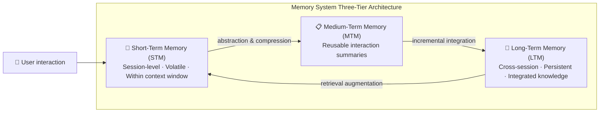
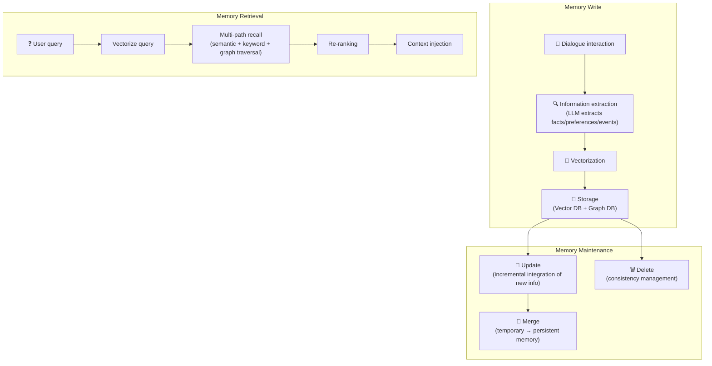
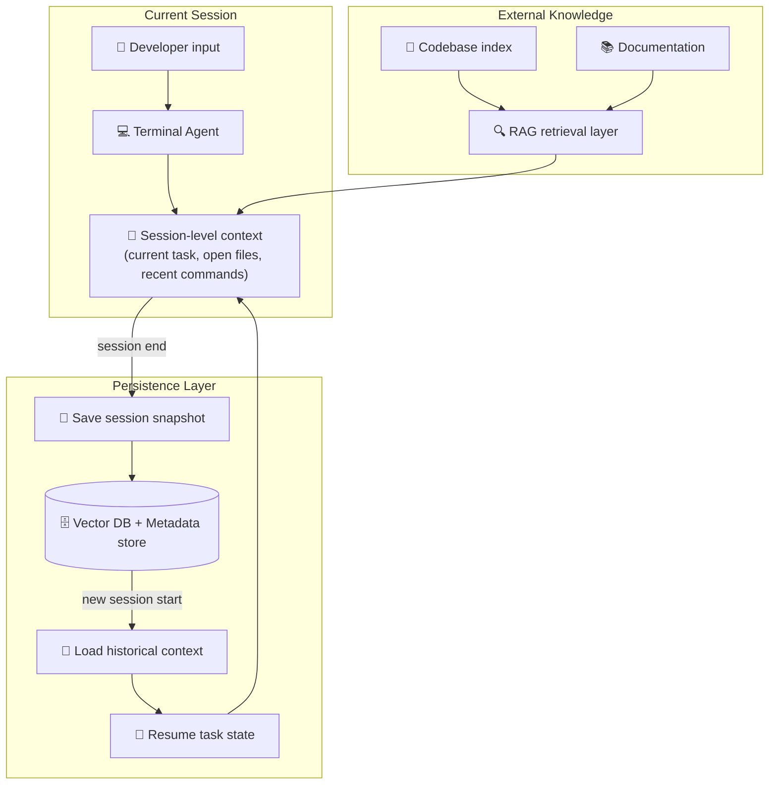

```markdown
# Large Model Memory Module: From “Goldfish Memory” to “Lifelong Learning” — A Complete Guide to AI Agent Memory Systems (2023-2026)

> **Abstract**: Have you ever experienced this scenario: you discuss a project background with ChatGPT for an hour, and the next day when you open a new window, it blankly asks “How can I help you?” This “conversational amnesia” is the Achilles’ heel of all large language model applications. By 2026, the memory module has become one of the most critical components in AI agent architectures. This article systematically analyzes the technical principles of short-term memory (dialogue context) and long-term memory (vector databases + RAG + knowledge graphs), deeply dissects the three core strategies of memory storage, compression, and summarization, and provides a comprehensive comparison of mainstream frameworks such as Mem0, Zep, and LangMem. Additionally, it reviews the four paradigm shifts in memory module capabilities from 2023 to 2026, and finally focuses on how to use memory modules to prevent terminal AI tools like Codex CLI and Copilot CLI from suffering engineering “amnesia.” Whether you are an AI application developer, architect, or technical manager, this in‑depth guide will provide a complete knowledge map for building production‑ready agent memory systems.


## 1. Introduction: Why Do Large Models Need “Memory”?

### 1.1 When the Smartest AI Suffers from “Amnesia”

In 2026, the capabilities of large language models are already astonishing. Gemini 3.1 Pro has a context window of up to 1M to 2M tokens, capable of processing a novel trilogy like *The Three‑Body Problem* in one go. Claude and ChatGPT have each introduced memory features that can remember user preferences and work habits across sessions.

Yet a fundamental contradiction remains: **the model’s knowledge is “frozen” in its training data, but real‑world interaction is a continuous stream**. You spend an entire afternoon debugging code, analyzing data, and discussing architecture with an AI assistant, but when you close the window and reopen it the next day, everything resets — the AI doesn’t recognize you, doesn’t remember yesterday’s discussion, and doesn’t know the project context. This experience is not just “inconvenient”; it is a core obstacle preventing AI agents from moving from “demo‑grade” to “production‑grade.”

As observed in the field of AI coding agents, AI coding agents face a paradox: they possess massive parametric knowledge but cannot remember a conversation from an hour ago. Your AI assistant isn’t “broken”; it has simply “run out of memory.”

### 1.2 The Memory Module: An “OS‑Level” Component for AI Agents

The essence of a memory module is to build an **external storage and management system** for large language models. It is not an optional add‑on, but the **infrastructure** that determines whether an AI application can operate reliably over the long term. When LLM agents move from single‑session demos to persistent, long‑cycle deployments, the memory system becomes the primary scalability challenge.

The core value of a memory module can be summarized in four dimensions:

| Dimension | Without Memory Module | With Memory Module |
|-----------|-----------------------|--------------------|
| **Cross‑session continuity** | Each conversation starts from scratch | Remembers historical interactions, seamless continuation |
| **Personalization** | Generic answers, lack of individualization | Understands user preferences, habits, project context |
| **Task complexity** | Can only handle single‑turn simple tasks | Supports multi‑turn, multi‑day, cross‑project complex workflows |
| **Efficiency & cost** | Must repeatedly describe context | Automatically loads relevant memories, reduces repetitive input |

Production data from Alibaba Cloud Polar Agent Memory shows that compared to stuffing full historical context into the prompt, introducing a long‑term memory engine can achieve quantifiable improvements: 30% lower response time, 20% lower token consumption, and 40% better answer quality.

### 1.3 Three‑Tier Classification of Memory Systems

Before diving into technical details, we need a holistic cognitive framework for memory systems. Modern AI agent memory systems typically adopt a **three‑tier classification**:



- **Short‑term memory**: session‑level dialogue context stored in the model’s context window, disappears when the session ends.
- **Medium‑term memory**: reusable summaries abstracted from one or a few interactions, used to accelerate later retrieval.
- **Long‑term memory**: persistent structured knowledge and experience across sessions, stored via vector databases, knowledge graphs, etc.

The three‑tier architecture proposed in the LightMem paper is a typical representative of this classification, organizing memory as short‑term (immediate dialogue context), medium‑term (reusable interaction summaries), and long‑term (integrated knowledge). In 2026, cutting‑edge research on AI agent memory systems also clearly distinguishes three time spans: session‑level short‑term memory, cross‑session medium‑term memory, and persistent long‑term memory.


## 2. Short‑Term Memory: Dialogue Context Management and Context Engineering

### 2.1 Physical Constraints of the Context Window

Short‑term memory is essentially the LLM’s **context window** — the maximum number of tokens the model can “see” at once. This window is both the only channel for the model to understand conversational continuity and the physical ceiling on conversation length.

From 2025 to 2026, mainstream model context windows have exploded:

| Model | Context Window | Release |
|-------|----------------|---------|
| GPT‑4 (early) | 8K‑128K | 2023‑2024 |
| Gemini 1.5 Pro | 1M‑2M | 2025‑2026 |
| GPT‑5.4 | ~400K | 2026 |
| Claude Opus 4.6 | 200K+ | 2026 |

Gemini 3.1 Pro’s 1M token context window means it can process a novel trilogy like *The Three‑Body Problem* or hours of meeting recordings in one go. The underlying core technology is an improved Transformer architecture combining locality‑sensitive hashing and sliding‑window attention. Gemini 1.5 Pro processes ultra‑long contexts through five technical paths: enabling the native 1M token window, chunked embedding + vector retrieval augmentation, dynamic truncation and priority annotation, etc.

However, enlarging the context window does not “solve” the memory problem; it merely pushes the bottleneck further out. Even with a 1M token window, if a user’s interactions span multiple days and dozens of sessions, an external memory system is still needed to bridge those gaps. More importantly, stuffing all history into the context is costly — technologies like LongRoPE2 can extend the context window to target lengths while maintaining performance, but computational cost grows linearly with window size.

### 2.2 Core Context Management Strategies

When dialogue content exceeds the model’s context window, strategies must be used to decide what stays in the window and what gets compressed or discarded.

**Strategy 1: Sliding Window**

The sliding window is the simplest and most direct approach: keep the most recent N turns of dialogue and discard anything older. Early versions of ChatGPT with a 32K token window used this strategy, preserving temporal information through positional encoding.

Optimizations include **window overlap design**, setting a 30% overlap (e.g., window size 4096, stride 2867) to ensure continuity across windows. This effectively reduces semantic fragmentation in long‑text generation tasks.

**Strategy 2: Memory Compression**

Memory compression uses a summarization model to condense historical dialogue into key vectors or summary text stored in an external memory bank. Compression is not simple truncation; it is semantic distillation.

LangChain’s `ConversationSummaryBufferMemory` combines a buffer and a summarization mechanism: it keeps a buffer of recent interactions, but when the token threshold is reached, instead of simply discarding old dialogue, it compiles them into a summary and uses both the buffer and the summary concurrently.

**Strategy 3: Adaptive Fidelity Memory**

Adaptive Focus Memory (AFM) assigns each historical message one of three fidelity levels: FULL, COMPRESSED, or PLACEHOLDER, dynamically adjusted based on message importance. This method maximizes context utilization while preserving critical information accuracy.

**Strategy 4: Hierarchical Encoding**

Divides dialogue into three layers — “current turn – short‑term memory – long‑term knowledge” — processed by different granularity models. This allows the system to use the full context for the current turn while historical information participates in a compressed form.

### 2.3 Context Compression Practice in LangChain Deep Agents

LangChain Deep Agents SDK provides a production‑grade reference implementation for context management. It implements three main compression techniques triggered at different frequencies:

1. **Offloading large tool results**: When a tool response exceeds 20,000 tokens, Deep Agents offloads it to the file system, replacing it with a file path reference and the first 10 lines preview. The agent can later re‑read or search the content as needed.

2. **Offloading large tool inputs**: When the session context exceeds 85% of the model’s available window, Deep Agents truncates old tool call content, replacing it with file pointers on disk, reducing the size of the active context.

3. **Summarization generation**: When offloading no longer frees enough space, Deep Agents uses an LLM to generate a structured summary of the session — including session intent, created artifacts, next steps, etc. — to replace the full conversation history.

This layered “offload → truncate → summarize” strategy enables Deep Agents to handle long‑running tasks far exceeding the model’s native context window.

### 2.4 A Unified Theory of the Memory Compression Spectrum

A 2026 frontier paper proposes an intriguing perspective: memory systems and skill discovery are essentially different manifestations of the same problem — extracting reusable knowledge from interaction trajectories. The authors introduce the **Experience Compression Spectrum** framework, positioning memory, skills, and rules as different points on the same compression axis:

- **Episodic memory**: compression ratio ~5‑20×
- **Procedural skills**: compression ratio ~50‑500×
- **Declarative rules**: compression ratio >1000×

Higher compression ratios directly reduce context consumption, retrieval latency, and computational overhead. The paper also reveals a surprising fact: the cross‑citation rate between the memory research community and the skill research community is less than 1%, even though they address the same fundamental problem. This finding points the way for future memory systems: **adaptive compression** — dynamically selecting compression levels based on task demands rather than fixing a preset compression rate.


## 3. Long‑Term Memory: Vector Databases, RAG, and Knowledge Graphs

### 3.1 Long‑Term Memory vs. RAG: Different Positioning

Many developers wonder: isn’t RAG just long‑term memory? They do overlap, but their positioning differs.

Milvus’s blog comparing Claude Cowork and RAG gives a clear distinction:

- **RAG is knowledge‑driven**: the system retrieves authoritative facts from a stable, versioned corpus to serve as references when answering user questions. The retrieval corpus is typically static, controlled by the developer.

- **Cowork‑style memory is task‑driven**: the agent reads and writes its own evolving task state — it decides what information from the current task is relevant, stores it as memory entries, and later retrieves it as the task progresses.

A simpler formulation: **RAG retrieves “world knowledge”; long‑term memory stores “self‑experience.”** They are not substitutes but complements. Modern agent systems typically use both: RAG provides domain knowledge, while long‑term memory provides user personalization and task evolution state.

### 3.2 Vector Databases: The Storage Engine for Long‑Term Memory

Vector databases are the infrastructure for implementing long‑term memory. They encode memory fragments as high‑dimensional vectors, enabling fast retrieval based on semantic similarity.

Common architectures include:

- **Pure vector storage**: each memory stored independently, retrieved via cosine similarity. Simple and efficient, but cannot handle cross‑fact reasoning. Pure RAG with vector‑only storage retrieves well but has poor cross‑referencing ability.

- **Hybrid vector + graph structure**: Both Mem0 and Zep adopt this architecture. Vector indexes handle semantic search, while knowledge graphs handle entity‑relation reasoning. Mem0’s compression engine can compress chat history into optimized memory representations, claiming up to 80% reduction in prompt tokens.

- **Dual‑mode storage**: Alibaba Cloud Polar Agent Memory uses both a vector database for semantic similarity search (ANN) and a knowledge graph engine for storing and reasoning about complex relationships among entities and events.

- **Hierarchical indexing**: OpenViking uses a file‑system paradigm instead of pure vector storage, organizing context (memories, resources, skills) under `viking://` URIs, divided into three layers: L0 (~100 tokens), L1 (~2K tokens), L2 (full content).

- **Compressed index + vector storage**: zer0dex adopts a two‑layer architecture: a compressed human‑readable index (~3KB) acting as a semantic directory telling the agent what categories of knowledge exist, paired with vector storage for detailed retrieval. Evaluation data shows recall of 91.2% vs. 80.3% for pure RAG, with particularly significant improvement in cross‑referencing ability (80.0% vs. 37.5%).

### 3.3 Full Lifecycle Management of Long‑Term Memory

A complete long‑term memory system needs to cover the following lifecycle stages:



Using Polar Agent Memory’s engineering practice as an example:

1. **Memory extraction**: Slice long dialogues, use LLM prompt engineering to extract explicit facts, preferences, or needs from the user, and construct them as nodes in a knowledge graph.
2. **Vectorization and storage**: Semantic vectorization of memory fragments for fuzzy matching, while also extracting keywords for precise filtering; store in vector database and graph database.
3. **Memory fusion**: Newly extracted memories are temporarily stored for verification, then merged with persistent memory.
4. **Memory retrieval**: Multi‑path recall combining semantic vectors and keywords, discover implicit associations via knowledge graph, then re‑rank using a Rerank model.
5. **Memory source management**: When a dialogue record is deleted, automatically trigger invalidation or reconstruction of associated memories, ensuring consistency between memory and source information.

### 3.4 Episodic Memory vs. Semantic Memory

Cognitive psychology distinguishes between “episodic memory” and “semantic memory”:

- **Episodic memory**: memory of specific events (“Last Tuesday, the user and I discussed database selection”).
- **Semantic memory**: abstracted facts and concepts (“The user prefers PostgreSQL”).

Modern agent memory systems are moving toward more granular episodic memory. Research “Beyond Fact Retrieval” proposes a generative semantic workspace that allows agents to reason over episodic memory over long time spans, not merely retrieve isolated facts. GAAMA builds a concept‑mediated hierarchical knowledge graph, preserving verbatim episodes from raw dialogues, extracting atomic facts and topic‑level concept nodes, and synthesizing higher‑order reflections.

### 3.5 Agentic Memory: Autonomous Memory Management

Traditional memory systems implement memory management (when to store, retrieve, update, discard) as **external fixed rules**. Agentic Memory (AgeMem) proposes a more radical approach: **integrate both long‑term and short‑term memory management directly into the agent’s decision policy**, letting the LLM agent autonomously decide what to store, when to store it, what to retrieve, when to update, when to summarize, and when to discard.

This means the agent is no longer passively following a predefined memory strategy but can dynamically adjust its memory behavior based on task demands — a paradigm shift from “memory as a tool” to “memory as a capability.”


## 4. Deep Dive into Memory Access, Compression, and Summarization Strategies

### 4.1 Write Strategy: When to Store and What to Store

Memory write is the first gate determining long‑term memory quality. Writing too frequently leads to storage bloat and noise accumulation; writing too conservatively may lose critical information.

**Mainstream write strategies**:

| Strategy | Mechanism | Advantages | Disadvantages |
|----------|-----------|------------|---------------|
| **Real‑time write** | Extract and store after every interaction | No information loss | High storage overhead, much noise |
| **Session‑end write** | Batch extract summary after session ends | Global perspective possible | May lose intermediate details |
| **Importance‑triggered write** | Write when importance exceeds threshold | Balances accuracy and cost | Needs reliable importance evaluation |
| **Manual‑mark write** | User explicitly asks to “remember” something | High precision, privacy‑controllable | Relies on user initiative |

Early versions of Claude Memory used a mechanism of “retrieve relevant historical dialogue when the user actively requests it,” rather than persistent automatic memory, to protect privacy. OpenAI ChatGPT’s memory feature supports both explicit user requests to save and automatically gathering insights from past conversations.

### 4.2 Retrieval Strategy: How to Find Relevant Memories

Retrieval is the key step that turns stored memory into actual value. Retrieval quality directly affects whether the agent gets the right context at the right time.

**Multi‑path recall + re‑ranking** is the current mainstream approach:

1. **Semantic vector retrieval**: cosine similarity matching between the query embedding and memory embeddings.
2. **Keyword exact retrieval**: BM25 or similar for exact matches (e.g., product names, dates).
3. **Knowledge graph traversal**: discover implicitly related memories via entity relations (e.g., “who participated in Project A” → “documents related to Project A”).
4. **Re‑ranking**: use a cross‑encoder to re‑score results from multiple recall paths, select Top‑K.

Polar Agent Memory’s multi‑path recall practice shows that combining semantic vectors, keyword retrieval, and knowledge graph relationships, followed by re‑ranking with a Rerank model, significantly improves retrieval accuracy. LightMem’s online retrieval uses a two‑stage process of vector coarse retrieval followed by semantic consistency re‑ranking, achieving notable F1 gains with median latency of 83ms (retrieval) and 581ms (end‑to‑end).

### 4.3 Compression Strategy: From “What to Store” to “What to Forget”

Compression strategy determines whether a long‑term memory system can run sustainably. Without effective compression, the memory store expands indefinitely.

**Three dimensions of compression**:

1. **Summarization compression**: use an LLM to merge multiple related memories into a more condensed memory. LangChain’s `ConversationSummaryMemory` continuously generates summaries as the conversation proceeds; old summaries are “read” together with new dialogue content to produce a fresh, updated summary.

2. **Forgetting mechanism**: SuperLocalMemory V3.3 implements a biologically inspired forgetting mechanism, combining cognitive quantization and multi‑channel retrieval, designing a mathematical memory lifecycle dynamics for AI coding agents.

3. **Importance decay**: compute decay weights based on memory access frequency, timestamp, and task relevance; low‑weight memories are gradually phased out. LightMem modularizes memory management into retrieval, writing, and long‑term integration, separating online processing from offline consolidation, achieving efficient memory recall under limited computational resources.

**Challenges of compression**:

Practice with frameworks like Mem0 shows that while they add graph databases, decay algorithms, compression logic, etc., the result is that you end up maintaining more “memory infrastructure” than the agent itself. When introducing complex compression mechanisms, a balance must be struck between effectiveness and operational complexity.

### 4.4 Summarization Strategy: From “Compression” to “Abstraction”

Summarization is a higher‑level operation than compression — it is not just information reduction, but knowledge abstraction.

**Levels of summarization**:

- **L1: Turn‑by‑turn summary**: brief summary after each dialogue turn.
- **L2: Session summary**: overall summary after a session ends, including key decisions and outputs.
- **L3: Cross‑session topic summary**: identify recurring themes across multiple sessions, synthesize into persistent knowledge.

Deep Agents’ summarization mechanism embodies a fusion of L2 and L3: the LLM generates a structured summary containing session intent, created artifacts, and next steps, used to replace the full conversation history.

**Semantic compression** is another key concept: use an LLM to in‑place summarize a long dialogue history, preserving meaning, key entities, dates, and conversation tone, rather than simple truncation. This method dramatically reduces token consumption while maintaining semantic coherence.


## 5. Landscape of Industry Solutions and Research Frontiers

### 5.1 In‑Depth Comparison of Mainstream Memory Frameworks

By 2026, the AI agent memory framework ecosystem is quite mature. Below is a systematic comparison of five mainstream frameworks:

**Mem0**
- **Architecture**: hybrid vector + knowledge graph + KV storage
- **Key features**: most active open‑source community (48K+ GitHub stars), YC‑backed ($24M), most mature hosted platform
- **Temporal capability**: weak (flat vectors, no explicit temporal modeling)
- **LoCoMo benchmark**: ~64%
- **Use cases**: chatbots, personal assistants, personalized memory
- **Pricing**: free → $19/month → $249/month (Pro includes graph memory)

**Zep**
- **Architecture**: knowledge graph + timestamp annotation (episodic memory graph)
- **Key features**: production‑grade temporal awareness, graph structure supports relational reasoning, LongMemEval 63.8% (vs Mem0 49.0%, a 15‑point gap)
- **Temporal capability**: strong (explicit temporal tree)
- **LoCoMo benchmark**: ~78% (third‑party evaluation)
- **Use cases**: long‑running agent sessions, applications needing temporal reasoning
- **Note**: Zep uses 340× more memory per conversation than Mem0

**LangMem (LangChain Memory)**
- **Architecture**: modular memory strategies (ConversationBuffer/Summary/Entity, etc.)
- **Key features**: seamless integration with LangChain ecosystem, multiple memory types combinable
- **Temporal capability**: depends on chosen strategy
- **Use cases**: LangChain native agents
- **Pricing**: completely open‑source free

**Letta (MemGPT)**
- **Architecture**: hierarchical memory architecture (like OS virtual memory)
- **Key features**: self‑editing memory, suitable for complex agents, supports ultra‑long conversations via memory paging
- **Use cases**: ultra‑long task execution, complex agent workflows
- **Pricing**: open‑source + hosted service

**TiMem**
- **Architecture**: hierarchical induction + automatic abstraction
- **Key features**: official data LongMemEval‑S 76.88%, 52% token efficiency improvement
- **Temporal capability**: medium
- **Use cases**: scenarios needing automatic memory induction and efficient token utilization

**Selection decision framework**:

| Your Need | Recommended Framework | Rationale |
|-----------|-----------------------|-----------|
| Quick integration, rich community | Mem0 | Best documentation, most integrations, most mature |
| Need precise temporal reasoning (“what happened last month”) | Zep | Temporal knowledge graph gives +15 accuracy points |
| Deep LangChain/LangGraph usage | LangMem | Native integration, zero extra dependencies |
| Ultra‑long tasks (hours to days) | Letta | Hierarchical memory, virtual memory paradigm |
| Extreme token efficiency | TiMem | Claimed -52% token consumption |

### 5.2 Overview of Industry Solutions

**OpenAI ChatGPT Memory**

OpenAI started small‑scale testing of memory features in February 2024, upgraded to a long‑term memory system in April 2025. The memory system works in two ways: memories that users explicitly request to save, and insights that ChatGPT automatically gathers from past conversations to improve future conversations. In 2026, OpenAI CEO Sam Altman called memory one of the most important “breakthrough” areas for AI, with the company fully investing in feature upgrades for 2026. However, Altman also admitted that the memory feature is still in a “very rough, very early” stage, analogous to the “GPT‑2 era.”

**Anthropic Claude Memory**

Claude Memory first opened to individual users in August 2025 and expanded to team scenarios in September 2025. The upgraded memory system can learn users’ personal preferences and work patterns and allows users to create different memory spaces for multiple projects. Unlike ChatGPT’s persistent memory, Claude’s memory feature requires the user to actively trigger retrieval of relevant historical dialogue; it does not automatically build a user profile. Users can audit what the AI remembers, instruct it to focus on specific issues, or forget specific data points. Privacy‑wise, Claude provides an “incognito chat” mode for traceless conversations.

**Google Gemini Long Context**

Google has taken a different technical route: solving “memory” through ultra‑long context windows (1M‑2M tokens) rather than building a separate external memory system. Gemini 3.1 Pro natively supports a 1M token context window, with an underlying improved Transformer architecture combining locality‑sensitive hashing and sliding‑window attention. The March 2026 GA version brings production‑grade reliability, improved latency, and enhanced retrieval precision. Google’s “infinite attention mechanism” opens up the context window, allowing Gemini to reference unlimited input without losing any memory. This “memory as context” model bypasses external memory systems but brings cost challenges — the computational overhead of ultra‑long contexts grows linearly with window size.

**Alibaba Cloud Polar Agent Memory**

Polar Agent Memory is a long‑term memory engine deployed on PolarDB for AI nodes, achieving cross‑session personalized memory through dual‑mode storage (vector database + knowledge graph). Its core components include a memory manager (full lifecycle management), a general AI service (dialogue slicing & summarization, entity/relation extraction, vectorization, re‑ranking), and dual‑mode storage architecture. Measured improvements: 30% lower response time, 20% lower token consumption, 40% better answer quality.

### 5.3 Research Frontiers (2025‑2026)

**LightMem (ACL 2026)**

Proposed by Zhang et al. (12 authors), a lightweight LLM agent memory system. Core innovations: using SLMs to drive memory operations, modular design, and online/offline separation. Achieved ~2.5 average F1 improvement on LoCoMo benchmark, median latency 83ms (retrieval), 581ms (end‑to‑end).

**Agentic Memory (AgeMem)**

A unified framework that integrates both long‑term and short‑term memory management directly into the agent’s decision policy, letting the LLM agent autonomously decide when and what to remember.

**Experience Compression Spectrum**

A framework unifying memory, skills, and rules, positioning them as different points on the same compression axis. The paper notes that all existing systems operate at fixed compression levels, lacking adaptive cross‑level compression capabilities.

**SuperLocalMemory V3.3**

A biologically inspired, local‑first agent memory system implementing a complete cognitive memory taxonomy and mathematical lifecycle dynamics, designed for AI coding agents with forgetting mechanisms, cognitive quantization, and multi‑channel retrieval.

**Memory Fabric**

A multi‑user shared memory framework, systematically evaluating from early Neural Turing Machines and KV memory networks to AutoGen, AgentVerse, etc., through the lens of memory fabric.


## 6. Evolution of Memory Module Capabilities: 2023‑2026

### 6.1 Phase 1 (2023): Context is Memory

2023 was the breakout year for LLM applications, but “memory” was almost synonymous with “stuffing all historical messages into the prompt.” Typical characteristics included:

- **Full‑history pass‑through**: each turn feeds the entire history to the model.
- **Sliding window truncation**: when conversation exceeds context limit, simply discard the earliest messages.
- **No cross‑session capability**: each new conversation starts from scratch.

The core limitation of this phase was **statelessness** — the agent had no notion of “where we left off last time.” MemGPT (the precursor to Letta) proposed a hierarchical memory architecture that year, simulating OS virtual memory management, becoming one of the earliest systematic attempts to solve the memory problem.

### 6.2 Phase 2 (2024): RAG as Long‑Term Memory

In 2024, developers discovered that the RAG pattern could naturally extend to the “long‑term memory” scenario:

- **Vector databases store conversation history**: slice and vectorize historical dialogue, retrieve on demand.
- **Dedicated memory frameworks like Mem0 emerge**: specialized for agent memory, diverging from general‑purpose RAG.
- **OpenAI ChatGPT Memory goes live**: first time “memory” is offered as a product feature to ordinary users.

The breakthrough of this phase was **cross‑session continuity**, but the “intelligence” of memory remained limited — typically flat fact fragments lacking support for temporal relationships and multi‑hop reasoning.

### 6.3 Phase 3 (2025): Temporal Awareness and Graphification

In 2025, memory systems upgraded from “storing facts” to “storing relationships”:

- **Knowledge graph + timestamp annotation**: frameworks like Zep introduce episodic memory graphs, preserving entities, events, and temporal information.
- **Automatic memory compression and summarization**: LangChain Deep Agents implements context compression and structured summary generation.
- **Claude Memory fully opened**: learns user preferences and work patterns, supports multiple project memory spaces.

The advance of this phase was **temporal awareness and relational reasoning**, but memory systems still followed a “passive” mode — memory strategies predefined by developers.

### 6.4 Phase 4 (2026): Autonomous Memory Management and Spectral Compression

In 2026, the boundaries of memory systems are being further broken:

- **Agentic Memory**: memory management becomes part of the agent’s autonomous decision‑making.
- **Lightweight SLM‑driven**: LightMem uses small language models for memory operations, reducing latency and cost.
- **Spectral compression**: moving from fixed compression rates to adaptive multi‑level compression.
- **Biology‑inspired**: introducing forgetting mechanisms, lifecycle management, and other cognition‑inspired memory dynamics.
- **Memory fabric**: multi‑user shared memory, memory exchange protocols between agents.

The core proposition of memory systems in 2026 is: **memory is no longer a question of “what to store,” but a question of “how to autonomously manage the knowledge lifecycle.”**


## 7. Memory Module in Practice: How Codex CLI and Copilot CLI Avoid Engineering “Amnesia”

### 7.1 Special Challenges for Terminal AI Agents

Terminal AI programming assistants like Codex CLI (OpenAI) and Copilot CLI (GitHub) face even more severe memory challenges than ordinary chatbots:

- **Long‑spanning tasks**: a single code refactoring may span hours or even days.
- **Huge context**: project files, code structure, historical decisions, dependency information — enormous volume.
- **Window closure resets everything**: traditionally, closing the terminal window means losing all session state.
- **Need for resumability**: developers should be able to resume seamlessly after interruption, not start from scratch.

### 7.2 Claude Cowork’s “State Persistence” Approach

Claude Cowork is an agent mode within Claude Desktop that can read and modify local files, break tasks into smaller steps, and work continuously without losing state. Its memory is **read‑write**: the agent decides what information from the current task or conversation is relevant, stores it as memory entries, and later retrieves it as the task progresses.

Claude Cowork does not rely on an external vector database RAG; it achieves “memory” through **task state persistence + context continuation** — it can maintain multi‑step tasks for hours without resetting, track intermediate results, and reuse information across sessions.

### 7.3 Building a “Never‑Forget” Development Agent with Memory Modules

For self‑built or customized terminal AI programming assistants, the following architecture can achieve engineering‑grade memory persistence:



**Concrete implementation strategies**:

1. **Session snapshot storage**: at the end of each session, automatically save key state (current task description, list of modified files, to‑do items, important decisions) to a vector database. Use Mem0’s `m.add()` API to add structured memory fragments, associated with `project_id` and `session_id`.

2. **Session resume prompt**: when a new session starts, automatically retrieve historical memories relevant to the current project and inject them as system prompt into the agent’s context.

3. **Project‑level memory indexing**: use zer0dex’s compressed index scheme, maintaining a `MEMORY.md` file per project as a semantic directory telling the agent “what known information exists for this project.”

4. **Incremental task tracking**: following Deep Agents’ file‑system offloading strategy, store large tool responses (e.g., code analysis results) as files, keeping only file path references in the context.

5. **Importance‑driven memory write**: not every interaction is worth storing in long‑term memory. Define rules (e.g., “modified more than 3 files,” “command executed for more than 10 minutes”) to trigger memory write.

### 7.4 Best Practices for Avoiding “Window‑Close Amnesia”

**Codex CLI / Copilot CLI memory‑augmented mode design**:

```python
from mem0 import Memory
import hashlib

class PersistentTerminalAgent:
    def __init__(self, project_path: str):
        self.memory = Memory()
        self.project_id = hashlib.md5(project_path.encode()).hexdigest()
        self.session_id = f"{self.project_id}_{int(time.time())}"
    
    def on_session_start(self):
        """Restore memories from previous session"""
        memories = self.memory.search(
            query=f"Project {self.project_id} last session state and todos",
            user_id=self.project_id,
            limit=5
        )
        if memories:
            resume_context = "\n".join([m["memory"] for m in memories])
            return f"[Historical context]\nLast session state: {resume_context}\nPlease continue from where you left off."
        return None
    
    def on_session_end(self):
        """Save current session snapshot"""
        summary = self.generate_session_summary()  # call LLM to generate summary
        self.memory.add(summary, user_id=self.project_id)
    
    def on_major_action(self, action: str, result: str):
        """Store memory for significant actions"""
        if self.is_significant(action):  # determine if action is significant
            self.memory.add(
                f"[{datetime.now()}] {action}\nResult: {result}",
                user_id=self.project_id
            )
```

### 7.5 From “Memory” to “Continuity”

The ultimate goal of a memory module is not “remembering more information” but providing **continuity experience**. For terminal AI programming assistants, this means:

- **Cross‑session task continuation**: for code not finished yesterday, the agent proactively reminds “we last modified the third file; do you want to continue?”
- **Project knowledge accumulation**: the agent gradually learns the project’s code style, common patterns, team preferences.
- **Learning from mistakes**: the agent remembers which actions caused problems before, avoiding repeated errors.

This is exactly the direction where Agentic Memory and reflection mechanisms converge — the agent not only remembers “what happened,” but also “what worked and what didn’t,” continuously optimizing its own behavior.


## 8. Summary and Outlook

### 8.1 Key Points Recap

1. **The memory module is an “OS‑level” infrastructure for AI agents**. An agent without memory is just a “one‑shot tool”; an agent with memory is a “continuously evolving partner.”

2. **The key to short‑term memory management is context engineering**: sliding windows, memory compression, summarization generation, adaptive fidelity — these strategies collectively determine how well a limited context window can be utilized.

3. **Long‑term memory ≠ RAG**. RAG retrieves “world knowledge”; long‑term memory stores “self‑experience.” Production systems need both working together.

4. **Framework selection requires multi‑dimensional consideration**: Mem0 is mature and easy to use; Zep is strong in temporal reasoning; LangMem integrates tightly with LangChain; Letta is suitable for ultra‑long tasks; TiMem is token‑efficient. There is no “best framework,” only the “most suitable framework.”

5. **Four paradigm shifts in memory capabilities from 2023 to 2026**: from “context is memory” to “RAG as memory,” to “temporal awareness and graphification,” to “autonomous memory management” — each shift has significantly raised the ceiling of agent capabilities.

6. **Terminal AI tools need specially designed memory persistence solutions**. Session snapshots, project indexing, incremental tracking, importance‑driven storage — these strategies can help tools like Codex CLI and Copilot CLI bid farewell to “window‑close amnesia.”

### 8.2 Future Outlook

- **Adaptive compression**: agents will be able to dynamically choose compression levels based on task demands, automatically balancing accuracy and efficiency.
- **Cross‑agent memory sharing**: multiple agents share experiences, forming “collective memory” and “organizational knowledge bases.”
- **Privacy‑ and compliance‑aware memory**: as AI memory capabilities grow, the right to be forgotten, data provenance, and audit logs will become as important as memory itself.
- **On‑device lightweight memory**: LightMem and similar approaches prove that SLMs can drive efficient memory operations; future memory modules may run entirely on user devices, realizing “private lifelong learning assistants.”

---

*Memory is the foundation of intelligence. When an AI agent has a truly working memory system, it is no longer just a “clever question‑answering machine,” but a digital partner that can grow and evolve together with humans. I hope this article helps you understand the technical landscape of memory modules and provides a practical roadmap for building your own agent memory systems.*
```