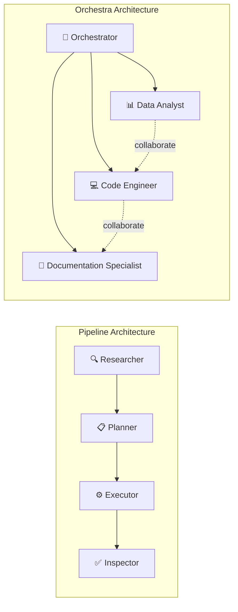
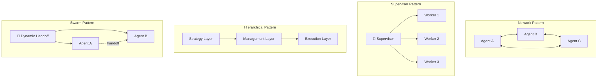
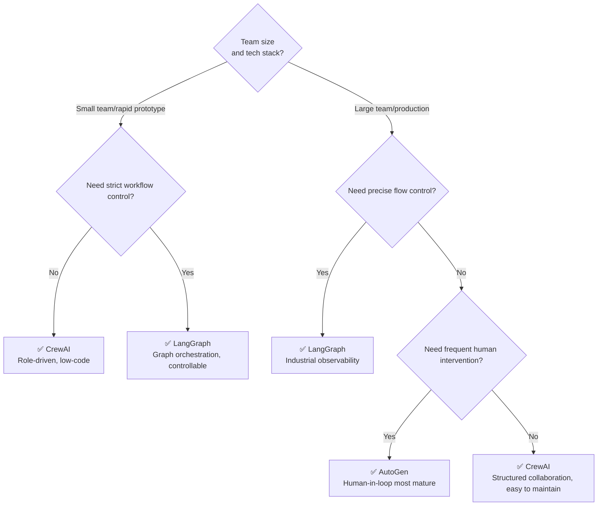

# Multi-Agent Collaboration: A Distributed Task Processing Paradigm in the AI Era

> **Abstract**: No matter how powerful a single large language model is, it remains a "lone wolf" – when task complexity exceeds the cognitive boundaries of a single model, when required tools go beyond the invocation scope of a single agent, or when context length surpasses the model's memory window, a single agent hits its limits. Multi-agent collaboration emerges precisely to address this challenge: by decomposing complex tasks and having multiple specialized agents work together, we achieve emergent intelligence where "1+1>2". This article systematically outlines the technical landscape of multi-agent collaboration – from architectural evolution, division of labor mechanisms, communication protocols, mainstream frameworks, to cutting-edge trends. It provides developers with a complete knowledge map from principles to implementation, including practical comparisons of frameworks such as AutoGen, LangGraph, and CrewAI, as well as the latest research results including C2C, IoA protocols, and AgentNet.


## 1. From "Lone Wolf" to "Symphony Orchestra": The Rise of Multi-Agent Collaboration

### 1.1 The Capability Boundaries of a Single Agent

In the practice of LLM application development, an unavoidable issue is that no matter how powerful a single agent is, its "lone wolf" operating model often proves inadequate for complex tasks. It is like asking a programmer to independently handle the entire process from requirements analysis, coding, testing, to deployment – even with exceptional ability, inefficiency easily arises due to task overload.

Specifically, single-agent systems face three core pain points:

- **Tool selection difficulty**: Equipping a single agent with a large number of tools (database operations, email sending, data analysis, etc.) causes it to suffer from "choice phobia", leading to tool misuse or inefficient invocation.
- **Context explosion**: The agent's working memory must carry large amounts of information such as user history, intermediate results, and tool call records, easily resulting in information overload and attention dispersion.
- **Role confusion**: Forcing one agent to play multiple roles – data analyst, software engineer, product manager – makes its system prompt wordy and contradictory, affecting the accuracy of core decisions.

OpenAI's technology roadmap divides large model capabilities into five stages: Chatbot → Reasoner → Agent → Innovator → Organizational AI. A single agent is only at the third stage; moving to higher levels requires multi-agent collaboration.

### 1.2 Core Advantages of Multi-Agent Collaboration

Multi-agent systems draw on the division of labor in modern companies, and their advantages over a single agent are evident:

- **Specialization**: Each agent focuses on a specific domain, resulting in stronger capabilities and more precise decisions.
- **Modularity**: Agents can be independently developed, tested, updated, and maintained, flexibly combined like Lego bricks.
- **Controllability**: Communication flows among agents are clearly defined, making system behavior more predictable and easier to manage.
- **Parallelization**: Multiple agents can process different subtasks simultaneously, significantly increasing overall throughput.

From an industrial deployment perspective, a retail company deployed 50,000 agent nodes to achieve real-time analysis and decision support for after-sales data across national stores. A logistics platform built an agent network capable of simultaneously handling 12 types of complex tasks including cross-border customs clearance, route planning, and anomaly alerts. Test data shows that under 100,000-level concurrency, the throughput of an agent cluster is 37 times higher than a monolithic architecture.

### 1.3 From Proof of Concept to Industrial Deployment

Research on multi-agent systems is not new, but the explosion of LLMs has injected fresh vitality into this field. Traditional multi-agent systems relied on predefined rules and finite state machines, whereas LLM-based MAS (Multi-Agent System) integrates natural language reasoning, dynamic planning, and adaptive collaboration, giving agents unprecedented flexibility and generality.

During 2025-2026, multi-agent collaboration has rapidly moved from academic proof-of-concept to industrial deployment. GitHub data shows that CrewAI ran 1.1 billion agent automation tasks in the third quarter of 2025. Frameworks like LangGraph and AutoGen continue to see rising GitHub stars, and multi-agent architecture is becoming the standard configuration for enterprise-level AI applications.

## 2. Evolution Path of Multi-Agent Architectures

### 2.1 Limitations of Traditional Architectures

Early multi-agent systems adopted a "central dispatcher + worker node" factory model, whose core problems included:

- **Rigid processes**: Tasks must be passed in a predetermined order; failure in one link blocks the entire chain.
- **Static routing**: Relies on hardcoded rule engines that cannot adapt to changes in business rules.
- **Resource silos**: Each node must load complete domain knowledge, with memory usage as high as 85%.

Practice on an e-commerce platform shows that error rates under this architecture spike by 400% during promotional periods, mainly due to context loss caused by task accumulation.

### 2.2 Pipeline vs. Symphony Orchestra

Modern multi-agent architectures draw on two classic collaboration patterns:

**Pipeline Pattern**: Agents handle tasks in a fixed sequence, with the output of one agent becoming the input of the next. A typical application is a content production pipeline: Researcher Agent → Strategy Planning Agent → Execution Agent → Quality Inspection Agent. This pattern has a clear structure and is easy to debug, but lacks flexibility – if one link gets stuck, the whole chain is blocked.

**Orchestration Pattern**: An orchestrator coordinates multiple specialized agents working in parallel or interleaved, similar to a conductor coordinating sections of an orchestra. This pattern is highly dynamic, adjusting agent participation and order in real time based on the task, but requires sophisticated orchestration logic and is more complex to debug.



### 2.3 Modern Three-Layer Collaboration System

The new generation of agent architecture builds a three-layer collaboration system:

**Intelligent Scheduling Layer**: Uses a publish-subscribe model for dynamic task sharding, including a task parser (converts natural language instructions into structured task graphs), a priority engine (makes routing decisions based on QoS parameters), and elastic queues (supports Kafka and RocketMQ dual protocols, single cluster can carry million-level TPS). Implementation in a financial risk control system shows that dynamic weight adjustment reduces high-priority task latency from seconds to milliseconds.

**Intelligent Execution Layer**: Builds pluggable agent containers supporting hot deployment of Python/Java/Go multi-language agents in seconds, maintains task state via knowledge graphs to avoid information loss, and implements fine-grained CPU/memory quota management based on cgroups. Test data shows dynamic resource scheduling increases cluster utilization from 45% to 78%.

**Intelligent Monitoring Layer**: Adopts an "observe-analyze-decide" closed loop, integrates Prometheus and SkyWalking covering over 200 monitoring metrics, predicts resource usage trends using LSTM models and provides 15-minute advance warnings, and automatically triggers scaling/degradation policies – one case reduced manual intervention by 60%.

### 2.4 Three Dimensions of Organizational Architecture

From a more abstract organizational perspective, multi-agent workflows can be classified along three dimensions:

- **Organizational structure dimension**: Hierarchical, Peer-to-Peer, Hybrid.
- **Adaptability dimension**: Static workflow vs. Dynamic workflow.
- **Generation method dimension**: Predefined workflow vs. Automatically generated workflow.

Combinations of these three dimensions yield a rich architectural design space, with different frameworks having different emphases within it.

## 3. How Multiple Agents Divide Labor and Collaborate

### 3.1 Role Definition and Task Decomposition

Effective division of labor begins with clear role definitions. Each agent should be assigned clear responsibilities, domain expertise, and available tools. Taking CrewAI as an example, its role-driven design includes:

- **Role**: Defines the agent's position in the team (e.g., "Researcher", "Strategist", "Executor").
- **Goal**: Specifies the concrete goal the agent needs to achieve.
- **Tools**: Functions, APIs, code executors, etc., that the agent can invoke.
- **Backstory**: Optional detailed role description to enhance role consistency.

Task decomposition follows a recursive process "from goal to subtasks". For example, a high-level goal of "write a market analysis report" can be decomposed into: data collection → competitive analysis → trend forecasting → report writing → review and release. Each subtask is assigned to the most suitable agent for execution.

### 3.2 Four Mainstream Collaboration Patterns

Based on practical summaries of frameworks like LangGraph and AutoGen, multi-agent collaboration can be grouped into four core patterns:



**Network Pattern**: Agents can communicate directly, forming a mesh topology. Flexible but complex; communication links grow quadratically with the number of agents. Suitable for scenarios with few agents and fixed interaction relationships.

**Supervisor Pattern**: All agents coordinate through a central supervisor, offering clear structure and easy control. The supervisor handles routing decisions, conflict mediation, and result aggregation. This is currently the most commonly used pattern in production environments.

**Hierarchical Pattern**: Introduces a multi-level management structure – strategy layer → management layer → execution layer – decomposing tasks level by level. Suitable for very large systems, each layer has its own supervisor agent.

**Swarm Pattern**: Agents dynamically hand over control to each other, based on their respective domains to determine who is best suited for the current task. The LangGraph Swarm library is an implementation of this pattern, allowing agents to dynamically hand off control.

### 3.3 Dynamic Agent Generation: From Static Teams to Self-Growing Systems

One of the biggest limitations of traditional multi-agent systems is that the number and types of agents are fixed at system design time. When task types exceed the capabilities of predefined agents, the system cannot cope.

To address this, researchers have proposed dynamic agent generation schemes: automatically creating and integrating new agents based on task context without human intervention. These include two methods:

- **Initial Automatic Agent Generation (IAAG)**: At system startup, automatically generates the optimal agent configuration based on the task description.
- **Dynamic Real-Time Agent Generation (DRTAG)**: During system operation, creates new specialized agents in real time based on evolving dialogue and task context.

Experimental results show that the DRTAG method significantly improves system adaptability and task performance compared to static MAS architectures. MAS² further proposes a "recursive self-generation" paradigm: a multi-agent system autonomously builds tailored multi-agent systems for different problems, surpassing state-of-the-art MAS solutions on seven benchmarks.

### 3.4 Decentralized Collaboration: Lessons from AgentNet

Traditional multi-agent systems rely on centralized coordination, leading to scalability bottlenecks, reduced adaptability, and single points of failure. Privacy and proprietary knowledge issues further hinder cross-organizational collaboration, resulting in "siloed" expertise.

AgentNet proposes a decentralized RAG-enhanced framework with core innovations including:

1. **Fully decentralized coordination mechanism**: Eliminates the need for a central orchestrator, enhancing system robustness and emergent intelligence.
2. **Dynamic agent graph topology**: Adjusts connection relationships and routing strategies among agents in real time based on task requirements.
3. **Retrieval-based memory system**: Supports continuous skill optimization and specialization of agents.

Experiments show that AgentNet surpasses single-agent and centralized multi-agent baselines in task accuracy.

## 4. Communication Mechanisms Among Multiple Agents

### 4.1 From RPC to Natural Language Communication

RESTful/gRPC protocols from traditional microservice architectures face three major challenges in multi-agent scenarios:

- **Semantic gap**: Fixed interfaces struggle to express complex business intentions.
- **Version hell**: Interface changes affect all callers collectively.
- **Coupling trap**: Service providers must predefine all possible invocation scenarios.

Refactoring data from a logistics system shows that the number of RPC interfaces grows by an average of 230% per year, with maintenance costs rising exponentially.

Natural language communication protocols bring a paradigm shift: agents no longer communicate through strict API schemas but exchange intentions, states, and results using natural language. The flexibility of such protocols allows them to adapt to never-predefined new scenarios, greatly reducing coupling among agents.

### 4.2 Comparison of Mainstream Agent Communication Protocols

During 2025-2026, multiple agent communication protocols have emerged, providing standardized connection frameworks for multi-agent systems:

**Model Context Protocol (MCP)**: An open standard proposed by Anthropic, defining how agents interact with tools and data sources. MCP uses a client-server architecture, with agents as clients and tools/data sources as servers exposing standardized interfaces.

**Agent-to-Agent Protocol (A2A)**: A service-oriented protocol defined by Google, where agents achieve interoperability by publishing an "Agent Card" (containing name, description, version, URL, and skills list). Communication is **stateless**, each interaction independent.

**LLM Delegate Protocol (LDP)**: Elevates model-level attributes (model family, inference profile, quality calibration, cost characteristics) to first-class citizens of the protocol. LDP introduces five key mechanisms:
- Rich delegate identity cards
- Progressive payload modes with automatic negotiation and degradation
- Multi-round delegate sessions with persistent context
- Structured provenance tracking
- Protocol-level security boundaries (trust domains)

Experiments show that identity-aware routing achieves lower latency on simple tasks; semantic framework payload reduces token consumption by 37% without quality loss; governance sessions eliminate 39% of token overhead over 10 dialogue rounds.

**KVComm**: Unlike natural language communication, KVComm achieves efficient agent-to-agent communication by selectively sharing KV pairs from models. Experiments show that transmitting only about 30% of layer KV pairs achieves performance comparable to "directly merging inputs into one model", opening a new path for large-scale efficient multi-agent systems.

### 4.3 Three-Layer Semantic Architecture of Communication

Examining agent communication from the perspective of human communication, it can be organized into three layers:

1. **Communication Layer**: Ensures both parties can "hear" each other – reliable transport, streaming, connection management. Existing protocols are quite mature at this layer.

2. **Syntactic Layer**: Ensures messages are structurally parsable – schema definitions, message formats, lifecycle management. Protocols like A2A and MCP provide rich support at this layer.

3. **Semantic Layer**: Ensures both parties truly "understand" each other – clarification, context alignment, verification. Surprisingly, current mainstream protocols have the weakest support at this layer; semantic responsibility is often pushed to prompts, wrappers, or application-layer orchestration logic.

This "semantic gap" leads to a critical problem: when an agent receives an ambiguous instruction, it cannot proactively ask "Which one do you mean?" like a human, but must rely on predefined disambiguation logic or directly "guess".

### 4.4 IoA Task Protocol: A New Milestone in Standardized Collaboration

In January 2026, the IETF published the Internet of Agents Task Protocol draft, defining a standardized framework for heterogeneous agent collaboration. Core capabilities of the IoA task protocol include:

- **Dynamic team formation**: Dynamically selects the set of agents to participate in collaboration based on task requirements.
- **Adaptive task coordination**: Supports role adjustments and process changes during task execution.
- **Structured communication**: Supports cross-device, cross-framework agent communication via layered architecture and extensible message formats.

The IoA protocol is particularly suitable for scenarios such as intelligent transportation, smart healthcare, and large-scale human-agent collaboration across heterogeneous network environments, and can be deployed on fixed networks, edge-cloud infrastructure, and even 6G mobile networks.

### 4.5 Communication Cost Modeling: The C2C Framework

Most existing frameworks treat communication as instantaneous and free, ignoring that communication itself is a costly resource in real-world collaboration. C2C (Communication to Completion) is the first framework to explicitly model communication as a constrained resource.

C2C introduces the concept of **Alignment Factor**, inspired by shared mental model theory, quantifying the link between task understanding and work efficiency. Experiments covering 15 software engineering workflows, 3 complexity levels, and 5-17 agent scales show that cost-aware strategies achieve over 40% efficiency improvement compared to unconstrained interaction.

The experiments also revealed several emergent collaboration patterns:
- Agents naturally adopt a **hub-and-spoke topology** centered on a manager
- Strategically upgrade from **asynchronous to synchronous channels** based on complexity
- **Prioritize high-value help requests**
- These patterns are consistent across multiple cutting-edge models including GPT-5.2, Claude Sonnet 4.5, and Gemini 2.5 Pro

## 5. In-Depth Comparison of Mainstream Frameworks

### 5.1 LangGraph: Graph-Based Orchestration for Industrial-Grade Choices

LangGraph, the next-generation agent orchestration framework from the LangChain ecosystem, has a core innovation of reconstructing agent workflows using **directed graph models** – abstracting LLM calls, tool executions, etc., as nodes, and enabling dynamic jumps via conditional edges.

LangGraph supports four multi-agent architecture patterns: network pattern, supervisor pattern, supervisor (tool-calling) pattern, and hierarchical pattern. Its subgraph mechanism solves the state passing problem in multi-graph collaboration, allowing multiple agents to share critical context while maintaining their own independent states.

**Pros**: Graph-based orchestration offers the highest engineering controllability, supporting complex branching, loops, and conditional logic. Seamless integration with the LangChain ecosystem and strong observability.

**Cons**: Steep learning curve; may introduce excessive abstraction for simple tasks. Some developers find its abstraction too complex and debugging difficult.

**Use cases**: Production-grade multi-agent systems that require precise control over execution flow and support for complex branching logic.

### 5.2 AutoGen: Dialogue-Driven Multi-Agent Collaboration Framework

AutoGen, incubated and open-sourced by Microsoft Research, is a programming framework for building multi-agent AI applications, supporting agents to converse, plan, and use tools – autonomously or under human supervision.

Orchestration patterns supported by AutoGen include:
- **Sequential pattern**: Processes tasks in a predetermined order, suitable for linear workflows.
- **Concurrent pattern**: Multiple agents process independent subtasks in parallel.
- **Group chat pattern**: Dynamic collaboration through a conversational interface.
- **Handoff pattern**: Smoothly transitions control between specialized agents.

**Pros**: Emphasizes conversational collaboration among agents, supports synchronous and asynchronous interactions, and has the most mature support for human-in-the-loop. AutoGen excels in code generation scenarios with leading execution speed.

**Cons**: For strictly process-oriented tasks, the conversational pattern may introduce unnecessary interaction overhead. Requires a fair amount of code configuration.

**Use cases**: Research scenarios, tasks needing flexible dialogue collaboration, code generation and debugging, tasks requiring human supervision.

### 5.3 CrewAI: Role-Based Structured Collaboration Framework

CrewAI is an open-source framework for orchestrating role-based collaborative AI agents, with tasks, tools, and processes. Its core philosophy is "run a multi-agent system like a film crew."

In CrewAI, a multi-agent team is called a Crew. Each agent has a clear role, description, and tools, and tasks have dependencies and handoff rules. Its hierarchical pattern demonstrates strong task decomposition capabilities in complex scenarios like medical emergency simulations.

**Pros**: The role-based abstraction is very intuitive, friendly to non-technical users. Built-in handoff mechanisms and task orchestration make building structured workflows simple. The ecosystem is growing rapidly, having run 1.1 billion automation tasks in Q3 2025.

**Cons**: May introduce unnecessary complexity overhead for simple use cases; parameter tuning in dynamic environments is challenging; SaaS pricing for managed services may be high.

**Use cases**: Workflows with clear multi-role division of labor (research → planning → execution → inspection), teams wanting to design multi-agent systems in a structured way without manual orchestration.

### 5.4 Framework Selection Decision Tree



**Additional notes**:
- For ultimate execution speed: AutoGen leads in task completion speed.
- If you already have a LangChain stack: LangGraph integrates seamlessly.
- For cross-framework standardized communication: Look into protocol-layer solutions like MCP, A2A.

## 6. Cutting-Edge Research and Development Trends

### 6.1 Multi-Agent Reflection

Single-agent reflection (Reflexion) has been shown to significantly improve reasoning quality. MAR (Multi-Agent Reflexion) extends this concept to multi-agent scenarios: replacing a single self-reflection model with a group of LLM agents, each acting as a unique critic. When the executor produces an incorrect answer, the system aggregates opinions from multiple critics instead of relying on a single reflection.

MIRROR further proposes a two-layer reflection mechanism:
- **Intra-Reflection**: Critically evaluates intended actions before execution.
- **Inter-Reflection**: Further adjusts execution trajectories based on observed outcomes.

Experiments show that the two-layer reflection mechanism significantly reduces error rates in tool calling and has been accepted to IJCAI 2025.

### 6.2 Multi-Agent Debate

Multi-Agent Debate (MAD) improves reasoning quality through iterative inter-agent communication. Multiple agents each generate reasoning solutions, then critique and refine each other's solutions, finally reaching a conclusion through consensus mechanisms.

A key finding of MAD is that multi-agent debate enables relatively small LLMs (7-9B parameters) to achieve accuracy comparable to large models (27B parameters). This means MAD not only improves quality but also offers a path to cost reduction and efficiency gains.

However, MAD also faces the risk of "debate collapse" – when agents are led astray by incorrect reasoning, the final decision may collectively deviate. Research has proposed uncertainty-driven policy optimization (dynamically adjusting debate strategies by detecting self-contradiction, peer conflict, and low-confidence outputs) and memory masking (allowing agents to mask erroneous memories from the previous round at the start of each debate round) to address this challenge.

### 6.3 Multi-Agent RAG

The evolution of RAG from single-agent to multi-agent has been a notable trend in 2025. The mRAG framework decomposes the RAG process into multiple specialized agents: a planning agent, a search agent, a reasoning agent, and a coordination agent, using reward-guided trajectory sampling to optimize inter-agent collaboration and enhance response generation.

MAIN-RAG goes further by introducing a multi-agent filtering mechanism, where multiple specialized agents perform multi-round screening and verification of retrieved results, significantly reducing hallucination rates in RAG. SIRAG adopts a process-supervised multi-agent framework, bridging the coordination gap between retriever and generator via lightweight agents.

These studies show that assigning each step of RAG (query rewriting, multi-path retrieval, result filtering, answer generation, hallucination detection) to different specialized agents can significantly improve the overall quality of RAG systems without substantially increasing model parameters.

### 6.4 Self-Evolving Multi-Agent Systems

Enabling multi-agent systems to autonomously improve their own configurations is a frontier direction in 2026. CoMAS (Co-Evolving Multi-Agent Systems) achieves unsupervised self-evolution through inter-agent interaction rewards, allowing agents to continuously learn from their collaboration experiences. MAS-ZERO is the first framework for automatic MAS design at inference time, using meta-level design to iteratively design, critique, and optimize instance-tailored MAS configurations for each problem without requiring a validation set.

Autogenesis proposes a complete self-evolution protocol stack (Self Evolution Protocol Layer), specifying closed-loop operational interfaces for improvement proposals, evaluation, and submission, supporting auditable provenance and rollback.

### 6.5 Scalability Challenges in Multi-Agent Systems

As the number of agents increases, multi-agent systems face unique scalability challenges. Research reveals an important finding: in homogeneous settings (all agents using the same model and configuration), increasing the number of agents exhibits **strong diminishing returns**; whereas introducing heterogeneity (different models, prompts, or tools) consistently yields significant gains.

This means simply stacking identical agents is not an effective strategy for scaling multi-agent systems. More promising scaling paths include:

- **Heterogeneous agent compositions**: Mixing models of different sizes and specializations.
- **Hierarchical architectures**: Using management-layer agents to reduce coordination complexity among execution-layer agents.
- **Intelligent middleware**: Cognitive Fabric Nodes create an intermediate "cognitive fabric" layer among agents, reducing direct communication overhead.
- **Lifelong learning memory**: Improving system capability along two dimensions – "scaling team size" and "scaling time experience" – together.

## 7. Summary and Best Practices

### 7.1 Key Points Recap

1. **Multi-agent collaboration is essential for complex tasks**. The three pain points of single agents – context explosion, tool selection difficulty, and role confusion – mean that beyond a certain complexity, multi-agent architecture must be introduced.

2. **Four mainstream architectural patterns each have their use cases**: Network pattern suits small-scale flexible collaboration, supervisor pattern suits production environments, hierarchical pattern suits very large systems, and swarm pattern suits dynamic task allocation.

3. **Communication protocols evolve from "pipes" to "nervous systems"**. Natural language communication breaks through the semantic limitations of RPC; standardized protocols like MCP, A2A, and LDP are building the infrastructure for agent interconnection. The C2C framework reminds us: communication is not free; cost-aware collaboration yields over 40% efficiency improvement.

4. **Framework selection should match team characteristics**: LangGraph suits production-grade systems needing precise process control, AutoGen suits dialogue-driven and code generation scenarios, CrewAI suits structured workflows with clear roles.

5. **Frontier directions worth attention**: Multi-agent reflection, debate, RAG, and self-evolution are pushing multi-agent systems from "static configuration" to "dynamic growth".

### 7.2 Practice Checklist

**Architecture design phase**:
- [ ] Analyze task complexity to determine whether multi-agent is truly needed (for simple tasks, a single agent may be more efficient).
- [ ] Choose the architectural pattern based on task characteristics (pipeline vs. symphony orchestra vs. supervisor pattern).
- [ ] Design agent role boundaries, ensuring clear responsibilities without overlap.
- [ ] Determine the communication protocol (direct call within the same framework vs. cross-framework MCP/A2A).

**Development implementation phase**:
- [ ] Write clear role descriptions and goal definitions for each agent.
- [ ] Design state sharing mechanisms (LangGraph subgraphs, shared memory, or external storage).
- [ ] Implement observability: record each agent's inputs, outputs, tool calls, and execution times.
- [ ] Set collaboration guardrails: maximum iterations, timeout mechanisms, conflict resolution strategies.

**Deployment and operations phase**:
- [ ] Monitor efficiency metrics of multi-agent collaboration (task completion time, token consumption, success rate).
- [ ] Analyze bottleneck agents – which agent is slowest, most error-prone.
- [ ] Periodically assess whether to add new agents or optimize existing agent prompts.
- [ ] Monitor costs: multi-agent means multiple LLM calls; cost control cannot be ignored.

### 7.3 Future Outlook

Multi-agent collaboration is moving from "engineer handcrafted orchestration" to "system self-growth". When agents can dynamically generate, self-reflect, debate each other, and continuously evolve, we will be close to true "organizational AI". From the standardization of the IoA protocol to the decentralization of AgentNet, from the cost modeling of C2C to the zero-supervision design of MAS-ZERO – these frontier explorations are jointly painting a future picture: AI agents are no longer tools that passively respond to instructions, but intelligent agent networks capable of autonomously forming teams, dynamically allocating tasks, and continuously optimizing collaboration.

In this transformation, understanding the architecture, communication, division of labor, and evaluation mechanisms of multi-agent collaboration will be a key capability in moving from "AI user" to "AI system designer".
```