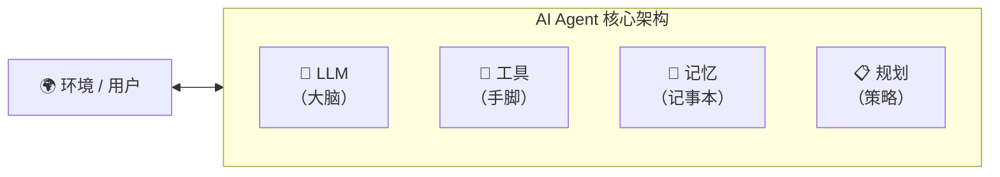
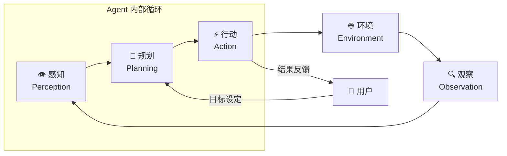
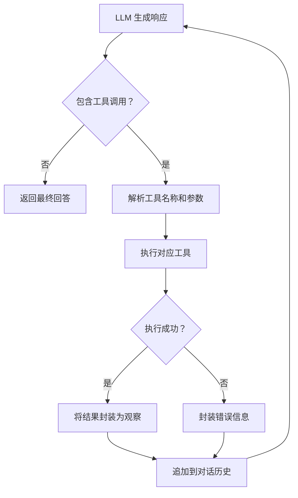
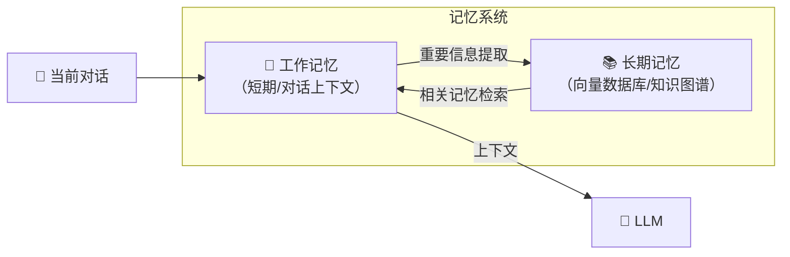
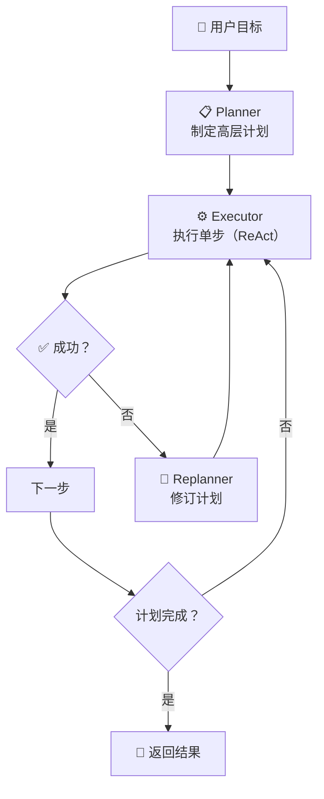
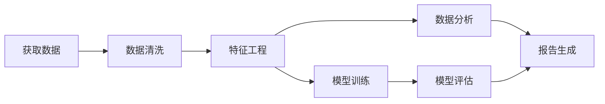
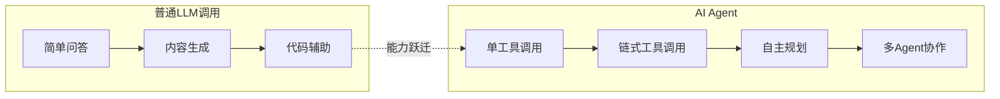
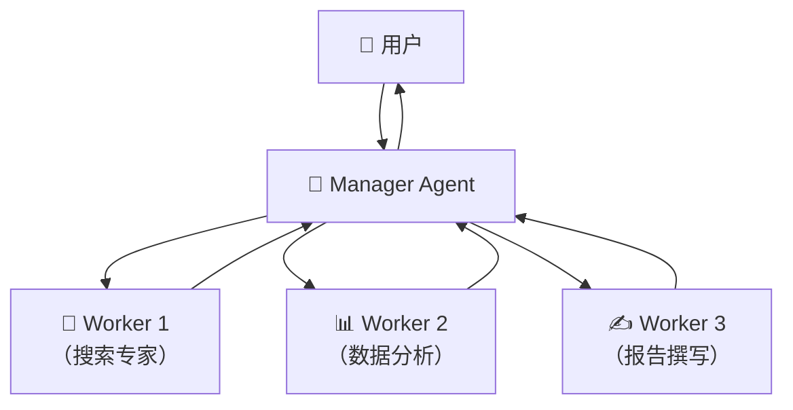
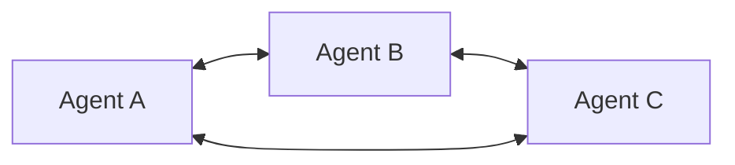

# 从LLM到自主智能体：AI Agent架构深度解析与工程实践

> **摘要**：大语言模型的爆发让“会说话的AI”走入千家万户，但真正的智能不应止步于“一问一答”。AI Agent（人工智能代理）作为LLM的下一站进化形态，赋予模型自主决策、多步规划和环境交互的能力，被视为通向通用人工智能的关键路径。本文将系统剖析AI Agent的核心架构——感知-规划-行动-观察循环，深入解读其四大核心组件（LLM大脑、工具、记忆、规划），并以详实的工程案例与代码示例展示Agent与普通LLM调用的本质区别。最后，探讨多Agent协作、反思机制等前沿话题，助你建立从原理到生产的完整认知。


## 一、引言：大模型的“下半场”与Agent的崛起

### 1.1 当LLM学会“做事”

2023年以来，我们见证了以GPT-4、Claude、DeepSeek为代表的大语言模型的惊人能力——它们能写诗、编程、翻译、总结报告，几乎在每一场语言类考试中都交出了超越人类的答卷，又在近年见到了Claude Code、Copilot CLI、Codex等工具，无疑将生产力提升了一个量级不止。然而，当我们自己企图将LLM集成到实际业务系统中时，一个显著的瓶颈浮现出来：**大模型很会“说”，却不太会“做”**。

想象一个典型场景：用户请求“帮我查一下下周二北京到上海的机票，选最便宜的一班，并添加到我的日历中”。在传统的LLM调用模式下，模型最多只能生成一段关于如何查询机票的文字说明，或者凭空编造一个不存在的航班信息。它无法真正访问机票预订系统，无法比较价格，更无法操作日历应用。

这就是**单纯LLM调用的根本局限**：
- **知识是静态的**：训练数据截止日期之后的信息无从知晓。
- **行为是被动的**：只能响应当前输入，无法主动规划多步操作。
- **环境是隔绝的**：无法与外部系统（数据库、API、传感器）交互。
- **记忆是短暂的**：对话历史一旦超出上下文窗口就被遗忘。

### 1.2 AI Agent：从“语言引擎”到“行动引擎”

AI Agent（人工智能代理）正是为解决这些局限而生。如果说LLM是一台强大的“大脑”，那么Agent就是为这个大脑配备了“手脚”、“眼睛”和“记事本”的完整智能体。

AI Agent被定义为一种能够感知环境、进行推理决策并采取行动以实现特定目标的自主计算实体。Agent = LLM（大脑） + 工具（Tools） + 记忆（Memory） + 规划（Planning）。这一公式简洁而深刻地揭示了Agent的核心架构。



从更宏观的视角看，AI Agent是一种新型的软件范式，它将LLM的推理能力与传统的软件工具、数据接口、业务逻辑深度融合，创造出能够自主完成复杂任务的智能体。2023年被称为“AI Agent元年”，2024-2025年则见证了从概念验证到生产落地的加速演进。

### 1.3 为什么Agent是LLM应用的下一站？

理解Agent的价值，可以从软件交互模式的演变来看：

| 时代 | 交互模式 | 代表技术 | 用户角色 |
|------|----------|----------|----------|
| CLI时代 | 精确命令 | Shell, DOS | 记忆命令 |
| GUI时代 | 点击与菜单 | Windows, Web | 学习界面 |
| Chat时代 | 自然语言对话 | ChatGPT, 文心一言 | 描述需求 |
| **Agent时代** | **目标委托** | AutoGPT, LangGraph | **定义目标** |

在Agent时代，用户只需描述“要达成什么目标”，智能体自行规划“如何去做”。这标志着人机交互从“过程导向”向“目标导向”的根本转变。2024年LangChain发布的《State of AI Agents》报告显示，超过51%的受访企业已在生产环境中部署了Agent应用，其中客服自动化、数据分析、代码生成是三大主力场景。

本文将带你深入AI Agent的底层架构与工程实践。无论你是想从零搭建第一个Agent的开发者，还是希望将Agent集成到现有系统的架构师，这篇2万字的深度指南都将提供系统性的知识支撑。


## 二、AI Agent的核心架构：感知-规划-行动-观察循环

### 2.1 自主智能体的根本行为模式

任何智能体的行为都可以被抽象为一个持续的**感知-规划-行动-观察**循环。这个循环源于控制论中的经典反馈回路，被AI Agent继承并发扬光大。



让我们逐层解剖这个循环：

#### 环节一：感知（Perception）

感知是Agent与外部世界建立联系的第一道关卡。在这一步，Agent需要：

- **接收用户输入**：用户的自然语言指令或目标描述。
- **理解环境状态**：从环境反馈中提取结构化信息（如API响应、数据库查询结果、传感器读数）。
- **过滤与精炼**：将海量环境信息压缩为对当前任务有价值的“认知状态”。

传统软件系统接收的是精确指令，而Agent接收的是模糊、开放的目标。例如“帮我分析一下最近的销售数据”，Agent需要感知到：任务主题是“销售数据分析”，隐含需要访问销售数据库、可能需要的工具包括SQL查询和数据可视化工具。

感知环节的质量直接决定了后续规划和行动的正确性。工程实践中，感知通常由以下模块协同完成：

- **输入解析器**：识别用户意图、提取关键实体和参数。
- **环境适配器**：将不同来源的数据（JSON、表格、文本）统一为LLM可理解的格式。
- **上下文聚合器**：将当前感知与历史记忆融合，形成完整的认知状态。

#### 环节二：规划（Planning）

规划是Agent的“思考中枢”，也是区别于普通LLM调用的关键所在。在这一步，Agent需要将宏观目标分解为可执行的步骤序列。

**规划的层次**：

1. **任务分解**：将复杂目标拆解为子任务。例如“预订北京到上海的机票”可分解为：
   - 查询航班列表
   - 筛选价格最低的航班
   - 获取用户身份信息
   - 调用预订API
   - 确认订单并添加到日历

2. **路径选择**：当有多条可行路径时，Agent需要评估并选择最优方案。例如订票失败时是尝试其他日期还是转用火车。

3. **资源调度**：确定何时调用哪个工具、传递什么参数。

规划的实现在工业界有两种主流范式：

- **ReAct范式**（Reasoning + Acting）：将推理和行动交织进行——每一步先思考（Thought），然后行动（Action），接收观察（Observation），再进入下一步思考。这是目前最广泛采用的规划框架。

- **Plan-and-Solve范式**：先一次性生成完整计划，再逐步执行。适合步骤明确、环境变化较少的任务。

无论哪种范式，规划都要求LLM具备**多步推理**能力，这是普通“一问一答”式调用所不具备的。

#### 环节三：行动（Action）

行动是Agent将决策转化为实际效果的过程。Agent的行动空间由其拥有的**工具（Tools）** 决定。

常见的行动类型包括：

- **信息检索**：调用搜索引擎、查询数据库、阅读文档。
- **计算与推理**：执行代码、调用数学函数。
- **外部操作**：发送HTTP请求、调用API、写入文件。
- **人机交互**：向用户提问澄清、请求授权。

在工程实现上，行动通常表现为**工具调用**——Agent生成一个结构化的工具调用指令（如JSON格式的函数名和参数），由执行器实际调用相应的API或函数，并将结果返回给Agent。OpenAI的Function Calling和Anthropic的Tool Use都是这一模式的标准化实现。

#### 环节四：观察（Observation）

观察是Agent从环境中获得反馈的环节。行动产生的结果被封装为“观察”，输入回感知模块，形成闭环。

观察的内容可能包括：

- **工具执行结果**：API返回的数据、代码执行的输出。
- **环境状态变化**：文件是否成功写入、数据库记录是否更新。
- **错误信息**：工具调用失败的原因。

观察环节的价值在于**纠偏与迭代**。当Agent发现某一步行动的结果与预期不符时，它可以调整后续计划。例如，查询航班API返回“无结果”，Agent可能调整日期范围或改用其他交通方式查询。

### 2.2 循环的本质：马尔可夫决策过程的LLM实现

从理论角度看，Agent的感知-规划-行动-观察循环是**马尔可夫决策过程**在LLM时代的具体实现。

- **状态（State）**：Agent对环境的认知（包括对话历史、工具调用记录、当前目标）。
- **动作（Action）**：Agent可执行的操作（工具调用、生成回答）。
- **策略（Policy）**：从状态到动作的映射函数——在Agent中，这个策略由LLM的推理能力实现。
- **奖励（Reward）**：环境对动作的反馈（任务完成度、用户满意度）。

传统强化学习需要大量训练来习得策略，而LLM Agent利用预训练模型中蕴含的常识和推理能力，实现了**零样本或少样本的策略生成**——这是一种范式跃迁。


## 三、核心组件详解（一）：大模型——Agent的“大脑”

### 3.1 LLM在Agent中的角色定位

LLM是Agent智能的核心来源。但与传统聊天场景不同，Agent中的LLM承担了更丰富的职责：

- **理解意图**：解析用户的模糊目标，提取关键信息。
- **推理与规划**：将目标分解为可执行的步骤序列。
- **工具编排**：决定何时调用哪个工具，并构造正确的参数。
- **信息整合**：将工具返回的多源信息融合为连贯的输出。
- **反思与纠错**：根据观察结果判断是否需要调整策略。

一个优秀的Agent LLM需要具备以下关键能力：

**1. 指令遵循能力**

Agent场景要求LLM严格遵循复杂的指令模板——何时思考、何时行动、何时结束。经过指令微调的模型（如GPT-4、Claude-3.5、Qwen2.5-Instruct）比原始预训练模型更适合作为Agent大脑。

**2. 函数调用能力**

模型需要能够生成结构化的工具调用指令。现代LLM通常通过特定训练（Function Calling fine-tuning）或系统提示来获得这一能力。以OpenAI为例：

```python
# 工具定义示例
tools = [{
    "type": "function",
    "function": {
        "name": "search_flights",
        "description": "搜索指定日期和航线的航班信息",
        "parameters": {
            "type": "object",
            "properties": {
                "origin": {"type": "string", "description": "出发城市代码，如PEK"},
                "destination": {"type": "string", "description": "到达城市代码，如SHA"},
                "date": {"type": "string", "description": "出发日期，格式YYYY-MM-DD"}
            },
            "required": ["origin", "destination", "date"]
        }
    }
}]
```

**3. 长上下文处理能力**

Agent在执行多步任务时，对话历史和工具调用记录会迅速累积，对模型的上下文窗口提出挑战。选择上下文窗口足够大的模型（如GPT-4 Turbo的128K、Claude的200K）是生产环境的重要考量。

**4. 推理深度**

面对复杂任务，模型需要具备**链式思维**能力。CoT在Agent场景下体现为Thought-Action-Observation的交替输出。研究表明，显式要求模型“一步一步思考”能显著提升任务成功率。

### 3.2 Agent LLM的选型指南

| 维度 | 闭源模型（GPT-4/Claude） | 开源模型（Llama3/Qwen2.5/DeepSeek） |
|------|--------------------------|--------------------------------------|
| 推理能力 | ★★★★★ | ★★★★☆（快速追赶中） |
| 函数调用稳定性 | ★★★★★ | ★★★★（需特定版本） |
| 上下文窗口 | 128K-1M | 32K-128K |
| 延迟 | 较低（API） | 取决于部署资源 |
| 成本 | 按token付费 | 固定硬件成本 |
| 数据隐私 | 数据离境 | 完全本地化 |

**选型建议**：
- **快速原型验证**：优先使用闭源API，最快验证想法。
- **数据敏感场景**：选择Qwen2.5、DeepSeek等国产开源模型本地部署。
- **高并发生产环境**：评估开源模型+推理加速框架（vLLM、TensorRT-LLM）。
- **复杂推理任务**：目前GPT-4、Claude-3.5-Opus仍处于领先地位。

### 3.3 LLM调用 vs Agent调用：本质差异

| 对比维度 | 普通LLM调用 | AI Agent |
|----------|-------------|----------|
| 交互模式 | 单轮/多轮对话 | 目标委托+自主多步执行 |
| 输出内容 | 纯文本回答 | 思考过程+工具调用+最终回答 |
| 知识来源 | 模型参数（静态） | 参数+实时工具调用（动态） |
| 错误处理 | 依赖用户纠正 | 自主观察反馈并调整 |
| 任务复杂度 | 适合单步信息型任务 | 适合多步操作型任务 |
| 可控性 | 高（输出即结束） | 需要设置最大步数、超时等约束 |

用代码对比更直观：

```python
# 普通LLM调用（伪代码）
def llm_chat(query):
    response = llm.generate(query)
    return response  # 一次调用，返回文本

# Agent调用（伪代码）
def agent_run(goal):
    memory = [{"role": "user", "content": goal}]
    max_steps = 10
    
    for step in range(max_steps):
        # 1. 规划：LLM生成下一步行动
        action = llm.plan(memory)
        
        # 2. 行动：执行工具
        observation = execute_tool(action)
        
        # 3. 观察：将结果存入记忆
        memory.append({"role": "tool", "content": observation})
        
        # 4. 检查是否达成目标
        if action.type == "finish":
            return action.final_answer
```


## 四、核心组件详解（二）：工具——Agent的“手脚”

### 4.1 工具：连接数字世界与现实世界的桥梁

如果说LLM决定了Agent“能想多远”，那么工具就决定了Agent“能做多少”。工具是Agent与外部世界交互的接口，将模型的推理能力转化为实际效用。

工具的本质是一个**标准化的函数接口**，包含三个要素：
- **名称与描述**：让LLM理解这个工具能做什么。
- **参数定义**：输入参数的名称、类型、描述、是否必填。
- **执行逻辑**：实际完成功能的代码或API调用。

### 4.2 工具的类型体系

**1. 信息检索工具**
- **搜索引擎**：Google Search API、Bing API、Tavily（专为Agent优化）
- **内部知识库**：向量数据库检索（RAG）
- **数据库查询**：SQL执行器、图数据库查询

**2. 计算与代码工具**
- **Python解释器**：安全沙箱中执行代码
- **数学计算**：复杂公式求解、统计分析
- **数据可视化**：生成图表并返回图片

**3. 外部服务工具**
- **API调用工具**：Restful API、GraphQL
- **邮件/消息工具**：Gmail API、Slack Webhook
- **日程管理工具**：Google Calendar API

**4. 文件与系统工具**
- **文件读写**：本地或云存储文件操作
- **浏览器自动化**：Playwright、Selenium封装

**5. 人机协作工具**
- **AskUser工具**：向用户提问以澄清需求
- **授权确认工具**：敏感操作前请求用户批准

### 4.3 工具定义的工程规范

一个设计良好的工具定义应遵循**清晰、精确、安全**三大原则。以下是OpenAI Function Calling格式的标准定义示例：

```python
{
    "type": "function",
    "function": {
        "name": "send_email",
        "description": "向指定收件人发送邮件",
        "parameters": {
            "type": "object",
            "properties": {
                "to": {
                    "type": "string",
                    "description": "收件人邮箱地址"
                },
                "subject": {
                    "type": "string",
                    "description": "邮件主题"
                },
                "body": {
                    "type": "string",
                    "description": "邮件正文，支持Markdown格式"
                },
                "cc": {
                    "type": "array",
                    "items": {"type": "string"},
                    "description": "抄送邮箱列表"
                }
            },
            "required": ["to", "subject", "body"]
        }
    }
}
```

**工具定义的黄金法则**：

1. **描述要具体、有区分度**。如果有多个功能相似的工具，描述中的细微差别决定了LLM能否正确选择。例如，“search_products_by_name”和“search_products_by_category”的描述需要明确指出搜索字段的不同。

2. **参数类型和描述要精确**。LLM依赖参数描述来理解该传递什么值。对于日期、枚举值等特殊类型，在描述中给出格式示例。

3. **考虑错误处理**。工具执行器应能捕获异常并返回清晰的错误信息，这些信息会作为观察返回给LLM，帮助它调整策略。

4. **最小权限原则**。生产环境中的工具应限制其能力边界。例如，文件写入工具应限制可操作的目录，代码执行工具应使用沙箱环境。

### 4.4 工具调用的内部流程



这个过程被称为**工具调用循环**，会持续进行直到LLM决定不再需要调用工具，或者达到预设的最大循环次数。


## 五、核心组件详解（三）：记忆——Agent的“记事本”

### 5.1 记忆：让Agent拥有“经验”和“上下文”

如果Agent没有记忆，那么每一次对话都将是“初次见面”。记忆赋予Agent以下能力：

- **上下文连贯**：记住对话历史，理解当前问题与先前讨论的关系。
- **知识积累**：将执行任务过程中获取的信息存储下来，供未来使用。
- **自我进化**：从成功和失败的经验中学习，优化未来的行为策略。

从认知科学视角，人类的记忆系统分为感觉记忆、短时记忆和长时记忆。AI Agent的记忆架构借鉴了这一模型，形成**双层记忆体系**。

### 5.2 双层记忆架构



**1. 工作记忆**

工作记忆对应LLM的**上下文窗口**，保存了当前会话中的：
- 用户的历史问题
- Agent的思考过程
- 工具调用的记录与结果
- 中间推理步骤

工作记忆的特点：
- **容量有限**：受模型上下文窗口限制（4K~1M tokens）。
- **易失性**：会话结束后即消失。
- **即时可访问**：LLM可以直接“看到”工作记忆中的内容。

管理好工作记忆是Agent工程的核心挑战。常用的管理策略包括：

- **滑动窗口**：只保留最近的N条消息，旧消息丢弃。
- **摘要压缩**：用LLM将长对话历史压缩为摘要，替换原始内容。
- **重要性过滤**：保留关键决策点和重要信息，丢弃冗余内容。

**2. 长期记忆**

长期记忆突破单次会话的限制，将重要信息持久化存储，供未来会话检索使用。

长期记忆的实现通常依赖：

- **向量数据库**：将记忆片段（如用户偏好、历史任务结果）向量化存储，通过语义相似度检索。
- **知识图谱**：存储实体及其关系，支持精确的结构化查询。
- **键值存储**：简单的用户偏好存储（如“用户住在北京”）。

长期记忆使Agent能够：
- **个性化**：记住用户的习惯和偏好。
- **累积学习**：从以往任务中获取的知识可复用。
- **跨会话连续**：中断的任务可以在新会话中恢复。

### 5.3 记忆的工程实现

以LangChain的Memory模块为例：

```python
from langchain.memory import ConversationSummaryMemory, VectorStoreRetrieverMemory
from langchain_openai import ChatOpenAI

# 工作记忆：摘要压缩
summary_memory = ConversationSummaryMemory(
    llm=ChatOpenAI(model="gpt-4o-mini"),
    max_token_limit=500,
    return_messages=True
)

# 长期记忆：向量存储
vector_memory = VectorStoreRetrieverMemory(
    retriever=vectorstore.as_retriever(k=5),
    memory_key="long_term_context"
)

# 在Agent中组合使用
agent = create_agent(
    llm=llm,
    tools=tools,
    memory=summary_memory,  # 工作记忆
    # 检索到的长期记忆可添加到系统提示中
)
```

### 5.4 记忆与RAG的关系

Agent中的长期记忆与RAG（检索增强生成）有相似之处，但侧重点不同：

| 维度 | RAG | Agent长期记忆 |
|------|-----|---------------|
| 知识来源 | 静态文档库 | 动态对话/任务记录 |
| 更新频率 | 批量索引 | 实时写入 |
| 检索内容 | 文档片段 | 经验/偏好/事实 |
| 典型用途 | 回答知识性问题 | 个性化上下文补充 |

在实践中，两者常结合使用：RAG提供领域知识，长期记忆提供用户个性化信息，共同构成Agent的知识基础。


## 六、核心组件详解（四）：规划——Agent的“策略中枢”

### 6.1 规划能力的层次模型

规划是Agent区别于普通LLM最核心的特征。从简单到复杂，规划能力可分为三个层次：

**L1：单步工具调用**

这是最基础的“规划”形式——LLM判断需要使用某个工具，生成一次工具调用，根据结果直接生成回答。严格来说，这还不算真正的规划，只是“工具增强的LLM”。

**L2：链式工具调用**

LLM依次调用多个工具，每一步的结果影响下一步的选择。例如，先搜索产品ID，再用ID查询库存，最后用库存信息生成报告。这需要模型具备“根据中间结果调整后续行为”的能力。

**L3：真正的自主规划**

Agent在行动之前，先显式地制定一份**计划**——可能是分步骤的清单，也可能是树状的决策结构。在执行过程中，Agent持续监控进度，根据环境反馈调整计划，甚至推翻重来。这是当前AI Agent研究的前沿。

### 6.2 主流规划范式深度对比

#### 范式一：ReAct

ReAct由Google Research在2022年提出，全称为**Re**asoning + **Act**ing。它的核心思想是将推理和行动**交织进行**，每一步都遵循 Thought → Action → Observation 的循环。

ReAct的执行流程：
```
Thought: 我需要先查询航班信息
Action: search_flights(origin="PEK", destination="SHA", date="2024-12-20")
Observation: [返回3个航班，最便宜的是MU5102，价格580元]

Thought: 我找到了最便宜的航班，现在需要查询用户信息以完成预订
Action: get_user_profile()
Observation: [返回用户姓名、身份证号、偏好]

Thought: 信息齐全，可以执行预订
Action: book_flight(flight_no="MU5102", passenger={...})
Observation: [预订成功，订单号FLT123456]

Thought: 任务完成，告知用户结果
Final Answer: 已为您预订12月20日北京至上海MU5102航班，票价580元，订单号FLT123456。
```

ReAct的优点：
- **灵活性高**：每一步都能根据最新观察调整。
- **可解释性强**：Thought清晰展示了推理过程。
- **错误恢复**：某一步失败可立即调整。

ReAct的局限：
- **缺乏全局视角**：边想边做可能导致短视，缺乏长远规划。
- **效率问题**：思考步骤增加延迟。

#### 范式二：Plan-and-Solve

Plan-and-Solve采用“先规划、后执行”的两阶段策略：

```
阶段一：制定计划
用户目标：预订北京到上海的最便宜机票并添加到日历

Plan:
1. 查询12月20日PEK→SHA航班
2. 筛选价格最低的航班
3. 获取用户身份信息
4. 执行机票预订
5. 将行程添加到日历

阶段二：执行计划
逐项执行上述步骤，遇到问题再局部调整
```

Plan-and-Solve的优点：
- **全局最优**：整体规划可能比逐步决策更优。
- **执行效率高**：计划一旦确定，执行阶段无需频繁“思考”。

Plan-and-Solve的局限：
- **适应性差**：计划制定后，如果环境发生重大变化，调整成本高。
- **计划质量依赖**：如果初始计划有缺陷，整个执行都会受影响。

#### 范式三：Plan-and-Execute（LangGraph标准模式）

这是LangGraph框架推崇的范式，结合了上述两者的优点：

- 由专门的**Planner**生成高层计划。
- 由**Executor**执行具体步骤，Executor本身可以是ReAct Agent。
- 由**Replanner**根据执行反馈，在必要时修订计划。



### 6.3 规划中的关键技术：任务分解

复杂任务的成功往往取决于分解的质量。有效的任务分解需要遵循**MECE原则**——相互独立、完全穷尽。

**分解方法一：树状分解**

```
目标：撰写季度销售分析报告
├── 1. 数据获取
│   ├── 1.1 从数据库提取Q3销售数据
│   ├── 1.2 从CRM提取客户分层数据
│   └── 1.3 从市场部获取竞品信息
├── 2. 数据分析
│   ├── 2.1 计算同比/环比增长率
│   ├── 2.2 分析Top10客户贡献
│   └── 2.3 识别异常波动原因
├── 3. 报告撰写
│   ├── 3.1 撰写执行摘要
│   ├── 3.2 制作数据图表
│   └── 3.3 提出下季度建议
└── 4. 审核发布
    ├── 4.1 发送给经理审阅
    └── 4.2 根据反馈修改
```

**分解方法二：依赖图分解**

对于有先后依赖关系的任务，使用有向无环图表示：



### 6.4 反思与自我纠错

人类专家在解决问题时会不断反思：“我做得对吗？”“有没有更好的方法？”Agent的规划也需引入类似的**反思机制**。

Reflexion框架（Shinn et al., 2023）是这一方向的代表工作。它让Agent在执行任务后，生成对自身表现的**反思文本**，并将反思存储到长期记忆中，指导未来的类似任务。

反思的常见触发条件：
- **工具调用失败**：参数错误、权限不足、返回空结果。
- **任务超时**：超过最大执行步数仍未完成。
- **低置信度**：LLM对自身回答的置信度评分低于阈值。

反思的输出通常包括：
- **问题诊断**：哪里出错了？
- **归因分析**：是计划问题、执行问题还是环境问题？
- **改进策略**：下次遇到类似情况应该怎么做？


## 七、Agent vs 普通LLM调用：一张表看懂所有区别

经过前述各章节的深度剖析，我们可以从多个维度系统对比Agent与普通LLM调用的本质差异。

### 7.1 核心对比表

| 对比维度 | 普通LLM调用 | AI Agent |
|----------|-------------|----------|
| **自主性** | 被动响应，一问一答 | 主动规划，多步执行 |
| **决策模式** | 单步推理 | 多步推理与反思 |
| **环境交互** | 无（仅处理输入文本） | 有（通过工具与外部世界交互） |
| **状态维护** | 仅对话历史（有限） | 工作记忆+长期记忆 |
| **任务复杂度** | 简单问答、内容生成 | 复杂多步操作、目标驱动任务 |
| **错误处理** | 依赖用户指出错误 | 自主观察并调整策略 |
| **知识时效** | 训练截止日期 | 实时通过工具获取 |
| **可扩展性** | 依赖模型升级 | 通过添加工具扩展能力 |
| **可解释性** | 仅输出答案 | 展示完整思考与行动轨迹 |
| **成本结构** | 单次API调用 | 多次调用（LLM+工具） |

### 7.2 场景适用性对比

**适合普通LLM调用的场景**：
- 文本摘要、翻译、润色
- 创意写作、头脑风暴
- 基于常识的知识问答
- 代码解释与简单生成

**适合AI Agent的场景**：
- 需要访问实时数据的任务（查询股价、天气、新闻）
- 需要多步操作的任务（预订服务、发送邮件、操作文件）
- 需要结合多种能力的任务（先搜索信息，再分析，再生成报告）
- 需要与外部系统集成的任务（CRM操作、数据库查询）

### 7.3 复杂度与成本曲线



随着任务复杂度的提升，普通LLM调用的成功率快速下降，而Agent通过引入规划与工具调用，将成功边界大幅外推。当然，这种能力提升伴随着成本增加：一次Agent运行可能涉及10+次LLM调用，以及额外的工具执行开销。因此在工程实践中，需要对任务进行**复杂度评估**，简单任务降级为普通LLM调用以节省成本。


## 八、实战：用LangGraph构建ReAct Agent

理论讲完了，让我们通过一个完整的代码示例，亲手构建一个具备工具调用和记忆能力的ReAct Agent。我们将使用LangGraph（LangChain的下一代Agent框架）来实现。

### 8.1 环境准备

```python
# 安装依赖
# pip install langgraph langchain-openai langchain-community tavily-python

import os
from typing import TypedDict, Annotated, Sequence
from langgraph.graph import StateGraph, END
from langgraph.graph.message import add_messages
from langchain_openai import ChatOpenAI
from langchain_community.tools.tavily_search import TavilySearchResults
from langchain_core.messages import BaseMessage, HumanMessage, AIMessage, ToolMessage
from langchain_core.tools import tool
import json

# 设置API密钥
os.environ["OPENAI_API_KEY"] = "your-openai-key"
os.environ["TAVILY_API_KEY"] = "your-tavily-key"  # 搜索工具
```

### 8.2 定义工具

```python
# 工具一：网络搜索
tavily_tool = TavilySearchResults(max_results=3)

# 工具二：自定义计算器
@tool
def calculator(expression: str) -> str:
    """计算数学表达式的结果。输入应为合法的Python数学表达式，如 '2 + 3 * 4'"""
    try:
        # 注意：生产环境应使用更安全的表达式求值方法
        result = eval(expression, {"__builtins__": {}}, {})
        return f"计算结果：{result}"
    except Exception as e:
        return f"计算错误：{str(e)}"

# 工具三：获取当前时间
@tool
def get_current_time() -> str:
    """获取当前日期和时间"""
    from datetime import datetime
    return datetime.now().strftime("%Y-%m-%d %H:%M:%S")

# 工具列表
tools = [tavily_tool, calculator, get_current_time]

# 将工具转换为LLM可理解的格式
tools_for_llm = [tool._to_openai_tool() for tool in tools]
```

### 8.3 定义Agent状态

在LangGraph中，状态是一个共享字典，在图节点之间传递。我们定义的状态包含消息列表：

```python
class AgentState(TypedDict):
    messages: Annotated[Sequence[BaseMessage], add_messages]
```

`add_messages`是一个reducer函数，告诉LangGraph如何合并新消息到现有状态中。

### 8.4 定义节点函数

```python
# 初始化LLM
llm = ChatOpenAI(model="gpt-4o-mini", temperature=0)
llm_with_tools = llm.bind_tools(tools_for_llm)

def agent_node(state: AgentState) -> dict:
    """Agent决策节点：调用LLM，决定下一步行动"""
    messages = state["messages"]
    response = llm_with_tools.invoke(messages)
    return {"messages": [response]}

def should_continue(state: AgentState) -> str:
    """路由函数：判断是执行工具还是结束"""
    messages = state["messages"]
    last_message = messages[-1]
    
    # 如果LLM没有请求工具调用，则结束
    if not hasattr(last_message, "tool_calls") or not last_message.tool_calls:
        return "end"
    else:
        return "continue"

def tool_node(state: AgentState) -> dict:
    """工具执行节点：执行LLM请求的工具"""
    messages = state["messages"]
    last_message = messages[-1]
    
    tool_messages = []
    for tool_call in last_message.tool_calls:
        tool_name = tool_call["name"]
        tool_args = tool_call["args"]
        
        # 找到对应的工具并执行
        for tool in tools:
            if tool.name == tool_name:
                result = tool.invoke(tool_args)
                tool_messages.append(
                    ToolMessage(content=str(result), tool_call_id=tool_call["id"])
                )
                break
    
    return {"messages": tool_messages}
```

### 8.5 构建图

```python
# 创建状态图
workflow = StateGraph(AgentState)

# 添加节点
workflow.add_node("agent", agent_node)
workflow.add_node("tool", tool_node)

# 设置入口点
workflow.set_entry_point("agent")

# 添加边
workflow.add_conditional_edges(
    "agent",
    should_continue,
    {
        "continue": "tool",
        "end": END
    }
)
workflow.add_edge("tool", "agent")  # 工具执行后回到agent继续思考

# 编译图
app = workflow.compile()
```

### 8.6 运行Agent

```python
def run_agent(user_input: str):
    """运行Agent并打印执行过程"""
    print(f"👤 用户: {user_input}\n")
    print("=" * 50)
    
    inputs = {"messages": [HumanMessage(content=user_input)]}
    
    step = 0
    for output in app.stream(inputs):
        step += 1
        for key, value in output.items():
            if key == "agent":
                msg = value["messages"][-1]
                if hasattr(msg, "tool_calls") and msg.tool_calls:
                    print(f"🤔 第{step}步思考：准备调用工具")
                    for tc in msg.tool_calls:
                        print(f"   🔧 调用 {tc['name']}({tc['args']})")
                else:
                    print(f"💬 第{step}步回复：")
            elif key == "tool":
                msg = value["messages"][-1]
                print(f"   📋 工具返回：{msg.content[:100]}...")
    
    # 打印最终答案
    final_state = app.invoke(inputs)
    final_message = final_state["messages"][-1]
    print("\n" + "=" * 50)
    print(f"🤖 最终回答：\n{final_message.content}")

# 测试
if __name__ == "__main__":
    run_agent("帮我查一下2024年诺贝尔物理学奖得主是谁，并用中文简要介绍其贡献")
```

### 8.7 输出示例

```
👤 用户: 帮我查一下2024年诺贝尔物理学奖得主是谁，并用中文简要介绍其贡献

==================================================
🤔 第1步思考：准备调用工具
   🔧 调用 tavily_search_results_json({'query': '2024年诺贝尔物理学奖得主'})
   📋 工具返回：[{"title": "2024年诺贝尔物理学奖揭晓", "content": "瑞典皇家科学院宣布，将2024年诺贝尔物理学奖授予John J. Hopfield和Geoffrey E. Hinton..."}]
==================================================
💬 最终回答：
2024年诺贝尔物理学奖授予了John J. Hopfield（约翰·霍普菲尔德）和Geoffrey E. Hinton（杰弗里·辛顿），以表彰他们“在人工神经网络和机器学习方面的奠基性发现和发明”。

**主要贡献**：
- **John J. Hopfield**：1982年提出霍普菲尔德网络，这是一种能够存储和重建信息模式的递归神经网络，为联想记忆奠定了理论基础。
- **Geoffrey E. Hinton**：被称为“深度学习之父”，发明了玻尔兹曼机、反向传播算法等核心技术，为现代人工智能的爆发提供了关键理论基础。
```

这个示例完整展示了ReAct Agent的运作流程：感知用户问题 → 规划（需要搜索） → 行动（调用搜索工具） → 观察结果 → 生成最终回答。


## 九、多Agent协作：从个体智能到群体智能

### 9.1 为什么需要多Agent？

单个Agent的能力受限于其拥有的工具和LLM的推理边界。面对更复杂的任务时，**多Agent协作**展现出独特优势：

- **任务并行化**：不同Agent同时处理不同子任务，提升效率。
- **专长互补**：不同Agent配备不同工具和专业知识（如数据分析Agent、代码编写Agent、客服Agent）。
- **交叉验证**：多个Agent对同一问题的判断可以相互校验，降低错误率。
- **鲁棒性**：单个Agent失败时，其他Agent可接管或补救。

### 9.2 主流多Agent架构模式

**模式一：层级式（Manager-Worker）**

一个管理者Agent负责任务分解和分配，多个工作者Agent执行具体任务。



**模式二：对等式（Peer-to-Peer）**

Agent之间平等对话，通过协商或投票达成共识。



**模式三：辩论式（Debate）**

多个Agent从不同角度论证，最终由一个裁判Agent或共识机制得出结论。这种模式在需要严谨推理的场景（如法律分析、科学论证）中表现优异。

### 9.3 LangGraph中的多Agent实现

LangGraph天然支持多Agent系统的构建。每个Agent可以是一个子图，通过节点间的边进行通信。

```python
# 多Agent协作示例：写作+审校团队

def create_writer_agent():
    """创建写作Agent子图"""
    writer_graph = StateGraph(...)
    # ... 添加节点和边
    return writer_graph.compile()

def create_reviewer_agent():
    """创建审校Agent子图"""
    reviewer_graph = StateGraph(...)
    # ... 添加节点和边
    return reviewer_graph.compile()

# 主图：编排两个Agent
main_graph = StateGraph(TeamState)

main_graph.add_node("writer", create_writer_agent())
main_graph.add_node("reviewer", create_reviewer_agent())
main_graph.add_node("finalizer", finalizer_node)

main_graph.add_edge("writer", "reviewer")
main_graph.add_conditional_edges(
    "reviewer",
    needs_revision,  # 判断是否需要修改
    {
        "revise": "writer",  # 回到写作Agent修改
        "approve": "finalizer"
    }
)
```


## 十、评估体系：如何衡量Agent的好坏？

### 10.1 Agent评估的独特挑战

评估Agent远比评估普通LLM困难，因为：
- **任务多样性**：Agent可执行的任务类型远多于固定测试集。
- **过程复杂性**：不仅要看最终答案，还要评估中间步骤的正确性。
- **环境依赖性**：工具调用成功率受外部环境（API可用性、网络延迟）影响。
- **非确定性**：同一问题，Agent可能采取不同路径到达正确结果。

### 10.2 主流评估框架

**1. AgentBench**

由清华大学等机构联合发布的Agent评测基准，涵盖8个环境（操作系统、数据库、知识图谱、网页购物等），评估Agent在真实场景中的任务完成能力。

**2. WebArena**

专注于Web交互环境的Agent评测，Agent需要通过浏览器完成预订、购物、信息查找等任务。WebArena提供了真实的网站副本，避免对生产网站的干扰。

**3. GAIA**

由Meta AI提出的Agent通用智能评估基准，强调需要复杂推理和多步行动的任务，被设计为“对人类简单，对AI困难”的测试集。

### 10.3 关键评估指标

| 指标类别 | 具体指标 | 说明 |
|----------|----------|------|
| **任务完成度** | Success Rate | 是否达成用户目标 |
| **执行效率** | Steps to Completion | 完成任务所需的步数 |
| | Token Usage | LLM调用总token数 |
| | Wall Time | 端到端耗时 |
| **过程质量** | Tool Selection Accuracy | 是否正确选择了工具 |
| | Parameter Accuracy | 工具参数是否正确 |
| **鲁棒性** | Error Recovery Rate | 遇到错误后能否恢复 |
| **安全性** | Harmful Action Rate | 是否执行了危险操作 |

### 10.4 人工评估与自动评估的结合

自动评估虽然高效，但难以完全替代人工判断——特别是对于开放性的“好与坏”。工业界的最佳实践是：

- **自动评估**：用于回归测试和持续集成，快速发现退化。
- **人工抽检**：定期抽取线上Case进行专家评估，校准自动指标。
- **用户反馈**：收集终端用户的满意度评分，作为最终衡量标准。


## 十一、前沿探索与未来展望

### 11.1 当前技术前沿

**1. 工具使用的自动化（Tool Creation）**

当前Agent依赖人工预定义的工具。未来的Agent应能**自行创建工具**——当发现现有工具不足以完成任务时，Agent可以编写代码生成新工具，或在Web上搜索可用的API并学习其调用方式。Gorilla和ToolLLM等研究正在推进这一方向。

**2. 超长任务规划**

现有Agent擅长分钟级的任务（10步以内），但面对小时级、天级的长期任务（如“持续监控竞品动态，每周发送摘要邮件”）仍力不从心。这需要Agent具备**时序感知**和**持久化执行**能力。

**3. 世界模型的构建**

人类规划时依赖对世界运行规律的内在模型。AI Agent若能构建类似的世界模型（World Model），就能进行“心理模拟”——在行动前预演可能的结果，选择最优策略。

### 11.2 安全与对齐

随着Agent自主性的增强，安全与对齐问题愈发突出：

- **权限最小化**：工具的设计应遵循最小权限原则，Agent只能访问完成任务必需的资源。
- **人类在环**：关键操作（如发送邮件、执行交易、删除文件）必须经过人类确认。
- **行为边界**：通过系统提示和约束规则，明确Agent“不能做什么”。
- **审计日志**：记录Agent的每一次思考、决策和行动，便于事后追溯和分析。

### 11.3 Agentic RAG：Agent与RAG的深度融合

本文姊妹篇《RAG从入门到生产》中详述了RAG技术。当Agent与RAG结合，诞生了更强大的**Agentic RAG**范式。在Agentic RAG中：

- Agent自主决定何时检索、检索什么、如何利用检索结果。
- Agent可以动态切换检索策略（向量检索、关键词检索、知识图谱查询）。
- Agent对检索到的信息进行验证和交叉比对，而非全盘接受。

这标志着RAG从“被动的上下文增强”演进为“主动的知识获取”。


## 十二、总结：构建AI Agent的最佳实践Checklist

将本文的核心要点浓缩为一份可操作的实践检查清单：

### 架构设计阶段
- [ ] 明确Agent的目标边界——它应该做什么，不应该做什么
- [ ] 选择适合任务的规划范式（ReAct / Plan-and-Solve / Plan-and-Execute）
- [ ] 设计双层记忆架构：工作记忆管理策略 + 长期记忆存储方案
- [ ] 规划最大步数和超时时间，防止无限循环

### 工具开发阶段
- [ ] 遵循“清晰、精确、安全”原则编写工具描述
- [ ] 为每个工具设计完善的错误处理和返回值
- [ ] 实施最小权限原则，限制工具的能力范围
- [ ] 对敏感工具添加人类确认环节

### LLM选型与调优
- [ ] 选择具备强大指令遵循和函数调用能力的模型
- [ ] 针对领域特点编写详尽的系统提示词
- [ ] 考虑上下文窗口与预期任务步数的匹配

### 评估与迭代
- [ ] 建立包含多样化场景的测试集
- [ ] 部署自动评估流水线（成功率和效率指标）
- [ ] 定期人工抽检线上Case质量
- [ ] 建立从用户反馈到Agent优化的闭环

### 生产部署
- [ ] 实现Agent执行的可观测性（日志、追踪、指标）
- [ ] 设计降级策略（LLM不可用时的fallback）
- [ ] 实施成本监控与配额管理
- [ ] 建立审计日志，满足合规要求

---

*AI Agent代表了人工智能从“会说话”走向“会做事”的关键跃迁。当我们为LLM装上了手脚、记事本和策略大脑，它就不再是一个被动的问答机器，而是一个能够在数字世界中自主行动的智能体。本文为你绘制了AI Agent的完整技术地图，但真正的理解只能在实践中获得。现在，打开你的编辑器，构建你的第一个Agent——让AI开始“做事”。*