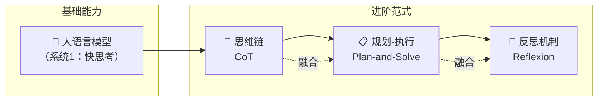
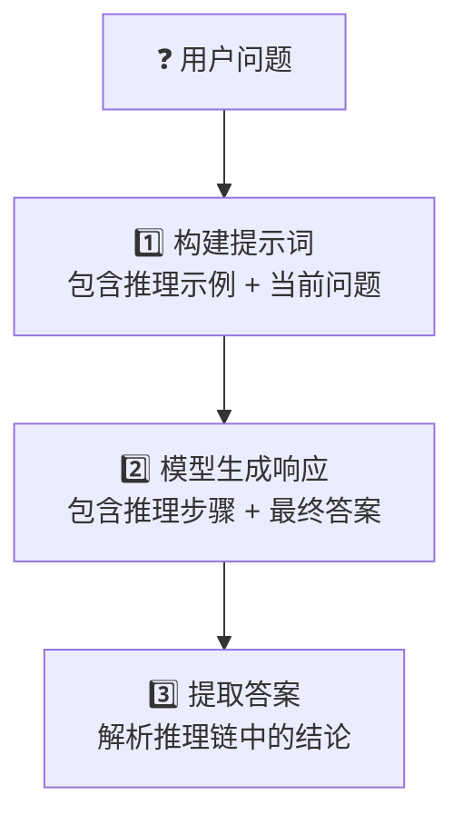
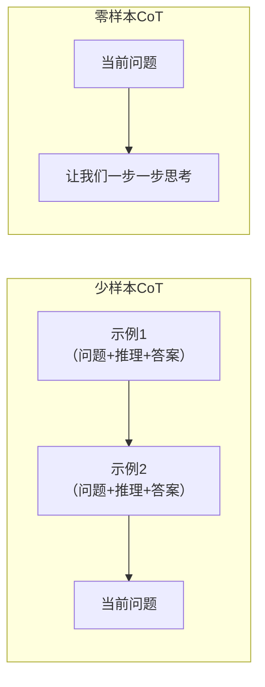
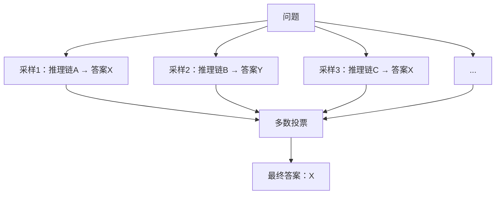
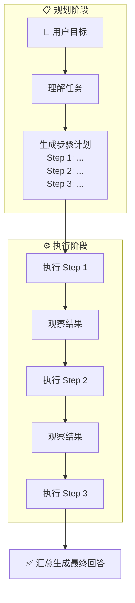
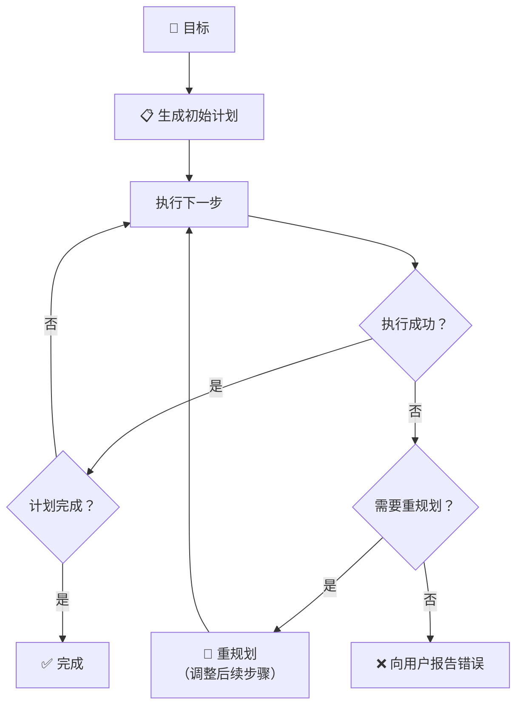
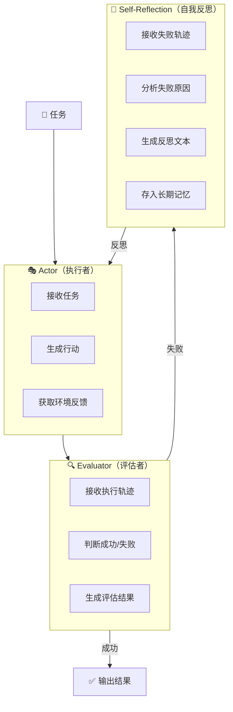
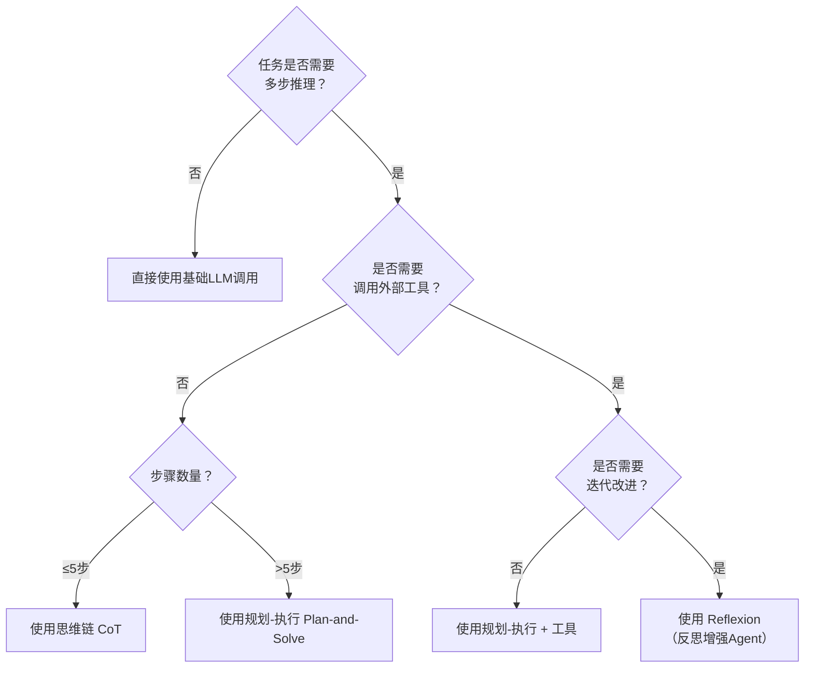
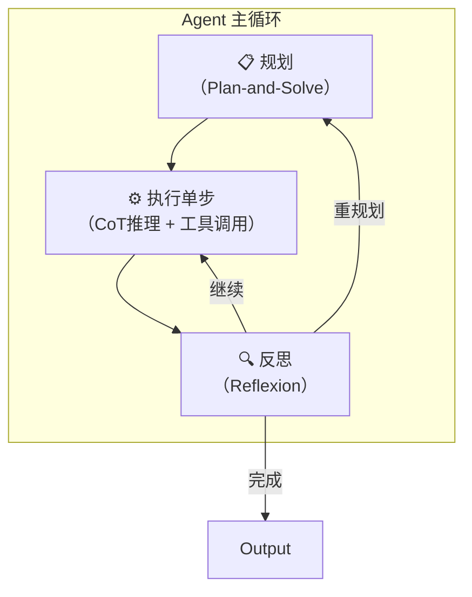
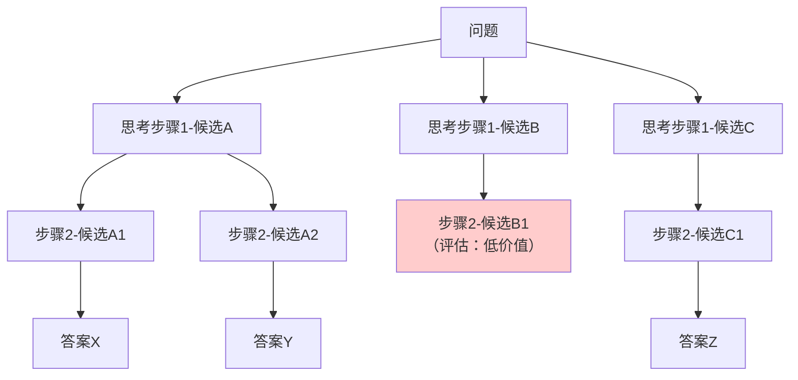

# 从思考到反思：大模型复杂推理的三种进阶范式详解

> **摘要**：大语言模型在简单问答上表现优异，但面对需要多步推理、长期规划或自我纠错的复杂任务时，往往力不从心。思维链（Chain-of-Thought）、规划执行（Plan-and-Solve）和反思机制（Reflexion）是三种逐层递进的提示与增强技术，它们分别赋予模型“边想边算”、“先谋后动”和“知错能改”的能力。本文将深入剖析这三种范式的核心原理、工作流程与实现细节，辅以Mermaid图解和代码示例，并通过对比分析帮助读者在不同业务场景下做出最优技术选型。无论你是正在构建AI Agent的工程师，还是希望提升模型推理质量的研究者，这篇万字长文都将提供系统性的知识框架。


## 一、引言：当大模型需要“认真思考”

### 1.1 “快思考”与“慢思考”的差距

诺贝尔经济学奖得主丹尼尔·卡尼曼在《思考，快与慢》中提出了人类认知的双系统理论：**系统1**是快速、直觉、自动的思考模式；**系统2**是缓慢、理性、需要刻意努力的推理模式。

大语言模型的表现同样遵循这一规律。当被问及“法国的首都是哪里？”时，模型几乎可以瞬间给出“巴黎”——这是典型的系统1行为，依赖训练过程中内化的知识关联。但当问题变为“小明有5个苹果，他给了小红2个，又从小李那里得到了3个，然后吃掉1个，最后还剩几个？”时，模型虽然也能回答，但如果没有明确的逐步推理过程，出错概率会显著上升。

更为复杂的是涉及逻辑推导、数学计算、多条件约束的任务。例如：

> “一个房间里有3个人。A比B大2岁，B的年龄是C的3倍。3年前，三人的年龄之和是47岁。请问A现在多少岁？”

面对此类问题，纯凭“直觉”输出的模型常常会陷入混乱。这是因为语言模型的本质是**基于统计模式的下一个token预测**，而非真正理解逻辑关系并执行演绎推理。

### 1.2 复杂推理的三大核心挑战

综合来看，大语言模型在应对复杂任务时面临三大核心挑战：

| 挑战维度 | 具体表现 | 示例场景 |
|----------|----------|----------|
| **多步推理** | 需要串联多个逻辑步骤，中间任何一环出错都会导致最终答案错误 | 数学应用题、符号推理、代码调试 |
| **长期规划** | 任务需要分解为多个子目标，且需合理安排执行顺序 | 旅行规划、项目管理、复杂报告撰写 |
| **错误修正** | 初始尝试可能失败，需要根据反馈调整策略 | 代码修复、谈判对话、复杂查询 |

传统提示方法（如零样本提示、少样本提示）在应对这些挑战时显得力不从心。为此，研究者们提出了一系列**结构化提示与增强技术**，引导或赋予模型更接近人类“系统2”的慢思考能力。

### 1.3 三种进阶范式的定位与关系

本文将聚焦三种最具代表性且已在实际应用中验证有效的技术：

- **思维链**：教会模型“边想边算”，将复杂推理过程显式化为中间步骤。
- **规划-执行**：引导模型“先谋后动”，在行动之前制定完整计划，再逐步落实。
- **反思机制**：赋予模型“知错能改”的元认知能力，根据执行反馈进行自我评估和策略调整。

这三种范式并非孤立存在，而是呈现出能力上的递进与融合关系。理解它们的原理、适用场景和工程实现，对于构建高质量的AI应用具有重要的指导意义。



接下来，让我们从最基础的思维链开始，逐层深入。


## 二、思维链：教会模型“边想边算”

### 2.1 思维链的诞生与核心思想

思维链的正式概念由Google Research的Jason Wei等人在2022年论文《Chain-of-Thought Prompting Elicits Reasoning in Large Language Models》中提出。这篇论文一经发表便引起轰动，因为它揭示了一个简单而强大的事实：**在提示词中加入“让我们一步一步思考”这样的引导语，就能显著提升模型在复杂推理任务上的表现**。

思维链的核心思想可以概括为一句话：**通过生成中间推理步骤来引导模型得出最终答案**。这种方法模仿了人类解决复杂问题时的自然认知过程——我们不会直接跳到结论，而是会在草稿纸上写下关键步骤，逐一推导。

论文中的经典实验显示，在数学应用题（GSM8K数据集）上，使用思维链提示的PaLM 540B模型达到了58%的准确率，而标准提示仅有33%。这一接近翻倍的提升充分证明了思维链的有效性。

### 2.2 思维链的工作机制详解

思维链的工作流程可以分为三个阶段：


**阶段一：构建包含推理示例的提示词**
思维链提示通常采用**少样本**的形式，即在提问之前，先给出几个包含完整推理过程的示例。例如：
```
问：一个篮子里有5个苹果，小明拿走2个，小红又放进去3个。篮子里现在有多少个苹果？
答：篮子初始有5个苹果。小明拿走2个后，剩下5-2=3个。小红放进去3个后，篮子里有3+3=6个。所以答案是6。

问：小华买了3本书，每本8元。他用一张50元付款，能找回多少钱？
答：3本书的总价是3×8=24元。用50元付款，应找回50-24=26元。所以答案是26元。

问：教室里有6排桌子，每排5张。搬走了8张后，还剩多少张桌子？
答：……
```

模型在看到前两个示例后，学会了“先分步计算、再给出最终答案”的模式，从而对第三个问题生成类似结构的回答。

**阶段二：模型生成带推理链的响应**

当模型接收到上述提示时，它会延续示例中的模式，生成：

```
教室里有6排桌子，每排5张，所以总共有6×5=30张桌子。搬走了8张后，剩下30-8=22张桌子。所以答案是22张。
```

**阶段三：解析与提取最终答案**

在实际应用中，通常需要从模型的完整输出中提取最终答案。这可以通过正则表达式匹配“答案是XXX”的模式，或使用额外的分类器来实现。

### 2.3 思维链的变体：零样本CoT

少样本CoT需要人工编写示例，这在某些场景下不够便捷。Kojima等人在2022年提出了**零样本思维链**，其核心发现是：**仅仅在问题末尾加上一句“Let's think step by step”（让我们一步一步思考），就能激活模型的推理能力。**

零样本CoT的提示词格式极其简单：

```
问：[用户问题]
让我们一步一步思考。
```
令人惊讶的是，这种极其简单的改动就能在多个推理任务上取得与少样本CoT相媲美的提升。背后的原因可能是：语言模型在预训练语料中见过大量包含“让我们一步一步思考”后紧跟推理过程的数据，这句提示触发了特定的生成模式。



### 2.4 思维链的适用场景与局限

**适用场景：**

1.数学应用题：需要多步算术运算的题目。

2.逻辑推理：涉及条件判断、三段论推理的问题。

3.常识推理：需要调用常识并串联多个事实的问题。

4.代码调试：分析代码错误时需要逐步追踪变量变化。

**局限性：**

1.依赖模型规模：论文表明，CoT的效果在模型参数量达到100B以上时才显著显现。小型模型使用CoT可能无明显提升，甚至出现性能下降。

2.无法与环境交互：CoT的推理完全基于模型内部知识，不能调用外部工具或查询实时信息。

3.缺乏纠错机制：如果模型在某一步推理出错，后续步骤会基于错误的前提继续，导致最终答案错误且无法自我修正。

4.对于超长任务乏力：当任务需要数十个步骤时，CoT的上下文窗口和注意力机制都会受到挑战。

### 2.5 思维链的工程实现示例

以下是使用OpenAI API实现零样本CoT的Python代码：

```python
import openai

def zero_shot_cot(question: str, model: str = "gpt-4") -> str:
    """使用零样本思维链回答问题"""
    
    prompt = f"""问题：{question}

让我们一步一步思考。"""
    
    response = openai.ChatCompletion.create(
        model=model,
        messages=[{"role": "user", "content": prompt}],
        temperature=0
    )
    
    return response.choices[0].message.content

# 示例使用
question = "一个游泳池长25米，小明游了8个来回，他一共游了多少米？"
answer = zero_shot_cot(question)
print(answer)
```

输出示例：
```
一个来回是游过去再游回来，所以距离是25×2=50米。
小明游了8个来回，所以总距离是8×50=400米。
因此，小明一共游了400米。
```

### 2.6 CoT的进阶：自洽性

思维链的一个进阶版本是**自洽性**。其思想是：由于模型生成推理链时存在随机性（通过temperature参数控制），我们可以多次运行CoT，生成多条推理路径，然后对最终答案进行投票，选择出现次数最多的答案作为最终输出。



自洽性在数学推理任务中能进一步提升准确率，但代价是增加了多次API调用的成本。


## 规划-执行：引导模型“先谋后动”

### 3.1 从“边想边做”到“先谋后动”

思维链解决了“如何推理”的问题，但它在面对需要多步操作、涉及外部工具调用的复杂任务时存在一个根本性的局限：CoT是一个“直线型”的过程，无法处理分支、循环或需要重新规划的情况。
考虑这样一个任务：
> “请帮我规划一次为期3天的北京旅行，预算3000元。需要包含交通、住宿、景点和餐饮安排，并考虑天气情况。”

这显然不是一个可以“一口气推到底”的问题。它需要：

先搜索景点信息（需要工具）
查询酒店价格（需要工具）
了解天气（需要工具）
根据预算进行权衡和取舍
最终生成结构化的行程表

思维链无法有效应对这类任务，因为它缺乏与外部环境的交互能力，也无法在复杂空间中搜索最优方案。这正是规划-执行范式要解决的核心问题。

### 3.2 Plan-and-Solve的核心架构

Plan-and-Solve由Wang等人在2023年提出，其核心思想是将任务处理明确分为两个阶段：

1. **规划阶段**：模型首先生成一个详细的步骤计划，列出完成目标所需的所有子任务及执行顺序。
2. **执行阶段**：模型（或Agent）按照计划逐步执行每个子任务，在执行过程中可以调用工具。



这种“先规划再执行”的范式具有显著优势：
- **全局视角**：在规划阶段，模型可以通盘考虑任务的各个部分，避免局部最优导致的全局次优。
- **结构清晰**：计划作为中间产出，便于人工审核和调试。
- **执行效率**：一旦计划确定，执行阶段可以专注于工具调用和结果处理，无需反复进行复杂的推理。

### 3.3 Plan-and-Solve的提示词设计

设计Plan-and-Solve的提示词需要明确引导模型进行两阶段输出。以下是零样本Plan-and-Solve提示词的典型模板：

```
你是一个任务规划专家。当用户提出一个目标时，请按以下格式回应：

首先，分析用户的目标，理解需要完成的核心任务。

然后，生成一个详细的步骤计划。计划应包含完成目标所需的所有子任务，并标注每个步骤需要调用的工具（如果需要）。

计划格式：
Step 1: [任务描述] - [工具名称（如需要）]
Step 2: [任务描述] - [工具名称（如需要）]
...

最后，在生成计划后，请询问用户是否确认执行该计划。

---
用户目标：{user_goal}
```

模型收到此提示后，会生成类似如下的计划：

```
分析：用户需要规划一次3天北京旅行，预算3000元，需考虑交通、住宿、景点、餐饮和天气。

计划：
Step 1: 查询北京未来3天的天气预报 - [天气API]
Step 2: 搜索北京热门景点并筛选免费或低价景点 - [搜索引擎]
Step 3: 查询经济型酒店价格，预算控制在每晚300元以内 - [酒店预订API]
Step 4: 查询往返北京的经济交通方式及费用 - [交通查询API]
Step 5: 根据以上信息，制定详细的3天行程表，确保总费用不超过3000元 - [无需工具]
Step 6: 向用户呈现行程表并征求最终确认

请确认是否执行此计划？
```

### 3.4 带重规划能力的Plan-and-Execute

纯粹的Plan-and-Solve假设计划一经制定就完美无缺，但在真实环境中，计划执行过程中常常会遇到意外情况：
- 某一步的工具调用失败（如API返回错误）
- 中间结果与预期不符（如酒店价格远超预算）
- 环境信息发生变化（如天气突变导致户外景点不可行）

为此，LangGraph等现代Agent框架引入了**Plan-and-Execute with Replanning**模式，在执行过程中动态评估计划的有效性，并在必要时触发重新规划。



这种动态调整能力使Plan-and-Execute更适合生产环境中的长时任务。下文将要介绍的Reflexion机制正是在此基础上的进一步深化。

### 3.5 Plan-and-Solve与CoT的对比

| 维度 | 思维链 | 规划-执行 |
|------|--------|-----------|
| **推理结构** | 线性链条 | 层次化计划树 |
| **任务长度** | 适合中等长度（3-10步） | 适合长任务（10步以上） |
| **工具交互** | 无法调用工具 | 可在执行阶段调用工具 |
| **错误恢复** | 推理错误无法纠正 | 可重规划部分步骤 |
| **可解释性** | 推理步骤可读 | 计划文档清晰可审核 |
| **计算开销** | 单次LLM调用 | 多次LLM调用（规划+每步执行） |
| **适用场景** | 数学、逻辑推理题 | 旅行规划、项目分解、复杂报告 |

### 3.6 Plan-and-Solve工程实现示例

以下代码展示了一个简化版的Plan-and-Execute Agent：

```python
import openai
from typing import List, Dict, Any

class PlanAndExecuteAgent:
    def __init__(self, model: str = "gpt-4"):
        self.model = model
        self.plan: List[Dict[str, Any]] = []
        self.execution_history: List[Dict] = []
    
    def generate_plan(self, goal: str) -> List[str]:
        """生成任务计划"""
        prompt = f"""你是一个任务规划专家。请为用户目标生成一个详细的步骤计划。
        
用户目标：{goal}

请按以下格式输出计划（每行一个步骤，以"Step N:"开头）：
Step 1: [第一步的任务描述]
Step 2: [第二步的任务描述]
...
"""
        response = openai.ChatCompletion.create(
            model=self.model,
            messages=[{"role": "user", "content": prompt}],
            temperature=0
        )
        
        plan_text = response.choices[0].message.content
        steps = []
        for line in plan_text.split('\n'):
            if line.strip().startswith('Step'):
                steps.append(line.strip())
        return steps
    
    def execute_step(self, step: str, tools: Dict) -> str:
        """执行单个步骤"""
        # 解析步骤是否需要工具
        # 简化实现：直接调用LLM执行步骤
        prompt = f"""执行以下任务步骤，可以使用提供的工具：
        
步骤：{step}
可用工具：{list(tools.keys())}

请输出执行结果。"""
        
        response = openai.ChatCompletion.create(
            model=self.model,
            messages=[{"role": "user", "content": prompt}],
            temperature=0,
            functions=tools  # 传递工具定义
        )
        
        return response.choices[0].message.content
    
    def run(self, goal: str, tools: Dict) -> str:
        """运行完整的规划-执行流程"""
        # 1. 生成计划
        steps = self.generate_plan(goal)
        print(f"📋 生成计划（共{len(steps)}步）：")
        for s in steps:
            print(f"   {s}")
        
        # 2. 逐步执行
        results = []
        for i, step in enumerate(steps):
            print(f"\n⚙️ 执行 Step {i+1}...")
            result = self.execute_step(step, tools)
            results.append(result)
            self.execution_history.append({
                "step": step,
                "result": result
            })
            print(f"   结果：{result[:100]}...")
        
        # 3. 汇总
        final_prompt = f"""根据以下执行历史和原始目标，生成最终回答。
        
原始目标：{goal}
执行历史：{self.execution_history}

请提供一份完整的最终回答。"""
        
        final_response = openai.ChatCompletion.create(
            model=self.model,
            messages=[{"role": "user", "content": final_prompt}],
            temperature=0
        )
        
        return final_response.choices[0].message.content
```


## 四、反思机制：赋予模型“知错能改”的能力

### 4.1 从“一次性尝试”到“迭代改进”

无论是思维链还是规划-执行，其默认假设都是：模型的初始推理或计划是（或应该是）正确的。但现实世界的复杂任务中，首次尝试失败是常态而非例外。

人类专家的一个重要特质是**元认知能力**——能够审视自己的思考过程，识别错误，并从错误中学习改进。Reflexion框架正是受此启发，旨在为AI Agent赋予类似的反思与自我纠错能力。

Reflexion由Shinn等人在2023年提出，全称为**Reflexion: Language Agents with Verbal Reinforcement Learning**。其核心创新在于：**引入语言形式的反馈循环，让Agent能够口头表达对自己的表现评估，并将这种反思作为长期记忆存储，指导未来的行动**。

### 4.2 Reflexion的架构原理

Reflexion框架由三个核心组件构成：



**Actor（执行者）**：负责根据当前任务和已有记忆（包括过去的反思）生成行动。它可以是任何能够与环境交互的Agent，如ReAct Agent或Plan-and-Execute Agent。

**Evaluator（评估者）**：接收Actor的执行轨迹（一系列行动和观察），判断任务是否成功完成。在编程任务中，评估者可以是单元测试的执行结果；在问答任务中，可以是答案与标准答案的比对。

**Self-Reflection（自我反思）**：这是Reflexion的核心模块。当评估者判定任务失败时，Self-Reflection模块会分析失败轨迹，生成一段自然语言的**反思文本**。这段反思通常包含：
- 哪里出错了？
- 为什么会出错？
- 下次应该如何改进？

生成的反思文本会被存入**长期记忆**（如向量数据库）。在下一次执行类似任务时，相关的反思会被检索出来，作为额外的上下文提供给Actor，帮助它避免重蹈覆辙。

### 4.3 反思的生成过程

反思的生成本身依赖LLM的元推理能力。典型提示词如下：

```
你正在分析一个AI Agent执行任务的失败案例。请仔细阅读以下执行轨迹，并生成一段反思。

任务描述：{task_description}
执行轨迹：
{trajectory}

任务最终状态：失败

请分析失败原因，并提出下次执行时应如何改进的具体建议。

反思格式：
失败原因：[分析]
改进建议：[具体可操作的建议]
```

模型生成的反思示例：

```
失败原因：Agent在Step 2中查询酒店时，错误地使用了"北京"作为城市代码而非"BJS"，导致API返回空结果。Agent没有检查API返回的状态，直接假设没有可用酒店，跳过了住宿安排。

改进建议：
1. 在调用API前，应先查阅城市代码表，确保使用正确的城市代码。
2. API调用后，必须检查返回状态。如果返回错误或空结果，应先尝试纠正参数重新调用，而非直接跳过。
3. 关键步骤（如住宿预订）不应因一次失败就放弃，应尝试备选方案。
```

### 4.4 反思记忆的存储与检索

反思文本需要被有效地存储和检索，以便在未来的相关任务中发挥作用。工程实现上通常采用向量数据库：

```python
from langchain.vectorstores import Chroma
from langchain.embeddings import OpenAIEmbeddings

# 初始化向量存储
vectorstore = Chroma(
    collection_name="reflexion_memory",
    embedding_function=OpenAIEmbeddings()
)

def store_reflection(task: str, reflection: str):
    """将反思存入长期记忆"""
    vectorstore.add_texts(
        texts=[reflection],
        metadatas=[{"task": task}]
    )

def retrieve_relevant_reflections(task: str, k: int = 3) -> List[str]:
    """检索与当前任务最相关的历史反思"""
    docs = vectorstore.similarity_search(task, k=k)
    return [doc.page_content for doc in docs]
```

在执行新任务时，Actor的提示词会包含检索到的相关反思：

```
以下是关于类似任务的历史反思经验，请在规划时参考：

[反思1]：...
[反思2]：...

当前任务：{task}
请结合以上经验教训，生成执行计划。
```

### 4.5 Reflexion的典型应用场景

**1. 代码生成与调试**

Reflexion在编程任务中表现出色。Actor尝试编写代码，Evaluator运行单元测试，如果测试失败，Self-Reflection分析错误信息和代码逻辑，生成改进建议。迭代几轮后，Agent通常能生成通过测试的代码。

**2. 复杂问答与推理**

在需要多步推理的问答任务中（如HotpotQA），Reflexion能让Agent从错误推理中学习。例如，如果Agent错误地使用了一个事实，反思会指出该事实的来源不可靠，引导Agent在下次检索时寻找更权威的来源。

**3. 决策任务**

在网页导航、游戏等需要序列决策的环境中，Reflexion能显著提升Agent的成功率。Agent会记住哪些行动路径通向死胡同，哪些策略更有效。

### 4.6 Reflexion与RLHF的关系

Reflexion的设计理念与**基于人类反馈的强化学习**有异曲同工之妙，但实现路径截然不同：

| 维度 | RLHF | Reflexion |
|------|------|-----------|
| **反馈形式** | 标量奖励信号 | 自然语言反思 |
| **学习方式** | 更新模型参数 | 上下文学习（无参数更新） |
| **数据需求** | 大量人类偏好标注 | 少量任务执行轨迹 |
| **泛化能力** | 内化到模型权重中 | 依赖记忆检索 |
| **计算成本** | 高（模型训练） | 低（LLM推理） |

Reflexion本质上是一种**基于上下文的强化学习**，利用LLM的元认知能力实现“口头强化”，避免了昂贵的参数更新。

### 4.7 Reflexion的局限性

1. **反思质量依赖LLM**：如果底层LLM的元推理能力不足，生成的反思可能质量低下，甚至引入误导性建议。
2. **记忆膨胀**：随着任务执行次数增加，反思记忆库会不断膨胀，需要设计淘汰策略。
3. **反思泛化**：过于具体的反思可能无法泛化到稍有不同的新任务，需要模型具备适当的抽象能力。
4. **评估者依赖**：Reflexion需要一个可靠的评估者来判断任务成功与否。对于开放域任务，自动评估本身就具有挑战性。


## 五、三种范式的对比与融合

### 5.1 能力递进关系

将CoT、Plan-and-Solve、Reflexion放在一起审视，可以发现一条清晰的**能力递进路线**：


- **CoT**是基础：它赋予了模型最基本的“慢思考”能力——将推理过程显式化。
- **Plan-and-Solve**在CoT之上叠加了**结构化分解**和**工具调用**能力，使模型能处理更长、更复杂的任务。
- **Reflexion**则在Plan-and-Solve之上引入了**反馈学习循环**，使模型能迭代改进，逐步逼近最优解。

### 5.2 技术选型决策框架

在实际工程中，应根据任务特性选择合适的技术范式：



### 5.3 融合趋势：下一代Agent架构

现代AI Agent框架（如LangGraph、AutoGPT、MetaGPT）已经将这三种范式有机融合：

- **规划阶段**使用Plan-and-Solve思想，生成结构化任务分解。
- **执行阶段**的每个原子任务使用CoT进行精细推理。
- **整体流程**引入Reflexion机制，在任务失败或结果不理想时触发反思和重规划。

这种“CoT for step, Plan for task, Reflexion for learning”的架构已成为当前Agent系统的**事实标准**。




## 六、实战：构建具有反思能力的推理Agent

理论讲完，让我们动手构建一个融合了CoT、Plan-and-Solve和Reflexion思想的推理Agent。这个Agent将解决一个经典的逻辑推理问题——**爱因斯坦谜题**（谁养鱼？）。

### 6.1 任务定义

爱因斯坦谜题是一道经典的逻辑推理题，包含5个不同国籍的人，住在5栋不同颜色的房子里，抽不同的烟，喝不同的饮料，养不同的宠物。根据15条线索，推理出谁养鱼。这道题需要系统性、多步骤的逻辑推导，是测试推理能力的绝佳基准。

### 6.2 Agent设计

我们将实现一个**Plan-and-Execute with Reflexion** Agent：

1. **规划器**：生成逻辑推理的计划（如“建立表格”、“逐条分析线索”、“使用排除法”等）。
2. **执行器**：使用CoT逐步执行推理，并记录推理状态。
3. **评估器**：检查推理结果是否自洽、是否遗漏线索。
4. **反思器**：如果评估未通过，分析推理漏洞，生成改进建议，重新执行。

### 6.3 代码实现

```python
import openai
import json
from typing import List, Dict, Optional, Tuple

class ReflexionReasoningAgent:
    def __init__(self, model: str = "gpt-4"):
        self.model = model
        self.reflection_memory: List[str] = []
        self.max_iterations = 3
        
    def plan(self, problem: str) -> List[str]:
        """生成推理计划"""
        # 整合历史反思到提示词中
        reflection_context = ""
        if self.reflection_memory:
            reflection_context = "\n\n历史反思经验（请务必参考）：\n" + "\n".join(
                [f"- {r}" for r in self.reflection_memory[-3:]]
            )
        
        prompt = f"""你是一个逻辑推理专家。请为以下问题制定一个详细的推理计划。

问题：
{problem}

{reflection_context}

请生成一个步骤化的推理计划。每一步应描述一个具体的推理操作。格式如下：
Step 1: [第一步要做什么]
Step 2: [第二步要做什么]
...

计划："""
        
        response = openai.ChatCompletion.create(
            model=self.model,
            messages=[{"role": "user", "content": prompt}],
            temperature=0
        )
        
        plan_text = response.choices[0].message.content
        steps = []
        for line in plan_text.split('\n'):
            if line.strip().startswith('Step'):
                steps.append(line.strip())
        return steps
    
    def execute_reasoning(self, problem: str, plan: List[str]) -> Tuple[str, str]:
        """执行推理，使用CoT"""
        plan_str = "\n".join(plan)
        
        prompt = f"""请按照以下计划，一步一步推理解决该问题。在每一步中，请展示你的思考过程（思维链）。

问题：
{problem}

推理计划：
{plan_str}

请开始推理，使用"Step N:"标记每一步。每一步后展示你的中间结论。最终给出答案。
"""
        
        response = openai.ChatCompletion.create(
            model=self.model,
            messages=[{"role": "user", "content": prompt}],
            temperature=0
        )
        
        trajectory = response.choices[0].message.content
        
        # 提取最终答案（简化实现，实际应用需要更鲁棒的解析）
        lines = trajectory.split('\n')
        answer = ""
        for i in range(len(lines)-1, -1, -1):
            if "答案" in lines[i] or "最终" in lines[i] or "养鱼" in lines[i]:
                answer = '\n'.join(lines[i:])
                break
        
        return trajectory, answer
    
    def evaluate(self, problem: str, trajectory: str, answer: str) -> Tuple[bool, str]:
        """评估推理质量"""
        prompt = f"""请评估以下逻辑推理的质量。

原始问题：
{problem}

推理过程：
{trajectory}

最终答案：
{answer}

请从以下维度评估：
1. 推理是否完整？是否使用了所有给定线索？
2. 推理是否存在逻辑矛盾？
3. 答案是否明确？

如果评估通过，请回复"通过"并简要说明。如果未通过，请回复"未通过"并指出具体问题。"""
        
        response = openai.ChatCompletion.create(
            model=self.model,
            messages=[{"role": "user", "content": prompt}],
            temperature=0
        )
        
        eval_result = response.choices[0].message.content
        passed = "通过" in eval_result and "未通过" not in eval_result
        
        return passed, eval_result
    
    def reflect(self, problem: str, trajectory: str, eval_result: str) -> str:
        """生成反思"""
        prompt = f"""以下是一次失败的逻辑推理。请分析失败原因，并生成一条反思经验，帮助下次避免类似错误。

问题：{problem}
推理过程：{trajectory}
评估结果：{eval_result}

请生成反思（以"反思："开头，包含失败原因和具体改进建议）："""
        
        response = openai.ChatCompletion.create(
            model=self.model,
            messages=[{"role": "user", "content": prompt}],
            temperature=0.3  # 稍微增加随机性以获得多样的反思
        )
        
        reflection = response.choices[0].message.content
        return reflection
    
    def solve(self, problem: str) -> Dict:
        """主求解流程"""
        for iteration in range(self.max_iterations):
            print(f"\n{'='*60}")
            print(f"🔄 迭代 {iteration + 1}/{self.max_iterations}")
            
            # 1. 规划
            print("📋 生成推理计划...")
            plan = self.plan(problem)
            for step in plan:
                print(f"   {step}")
            
            # 2. 执行推理
            print("\n🧠 执行推理...")
            trajectory, answer = self.execute_reasoning(problem, plan)
            print(f"   推理完成，答案预览：{answer[:100]}...")
            
            # 3. 评估
            print("\n🔍 评估推理质量...")
            passed, eval_result = self.evaluate(problem, trajectory, answer)
            print(f"   评估结果：{'✅ 通过' if passed else '❌ 未通过'}")
            
            if passed:
                return {
                    "success": True,
                    "answer": answer,
                    "trajectory": trajectory,
                    "iterations": iteration + 1
                }
            
            # 4. 反思
            print("\n💭 生成反思...")
            reflection = self.reflect(problem, trajectory, eval_result)
            self.reflection_memory.append(reflection)
            print(f"   {reflection[:200]}...")
        
        return {
            "success": False,
            "message": f"经过{self.max_iterations}次迭代仍未通过评估",
            "reflections": self.reflection_memory
        }

# 使用示例
agent = ReflexionReasoningAgent(model="gpt-4")

einstein_puzzle = """
有5栋不同颜色的房子，住着5个不同国籍的人，每人抽不同牌子的烟，喝不同的饮料，养不同的宠物。

已知线索：
1. 英国人住在红房子里。
2. 瑞典人养狗。
3. 丹麦人喝茶。
4. 绿房子在白房子左边。
5. 绿房子主人喝咖啡。
6. 抽Pall Mall烟的人养鸟。
7. 黄房子主人抽Dunhill烟。
8. 住在中间房子的人喝牛奶。
9. 挪威人住第一间房子。
10. 抽Blends烟的人住在养猫人的隔壁。
11. 养马的人住在抽Dunhill烟人的隔壁。
12. 抽Blue Master烟的人喝啤酒。
13. 德国人抽Prince烟。
14. 挪威人住在蓝房子隔壁。
15. 抽Blends烟的人有一个喝水的邻居。

问：谁养鱼？
"""

result = agent.solve(einstein_puzzle)
print("\n" + "="*60)
print("🏁 最终结果：")
if result["success"]:
    print(f"答案：{result['answer']}")
    print(f"完成迭代次数：{result['iterations']}")
else:
    print(f"求解失败：{result['message']}")
```

### 6.4 运行效果分析

在一次典型运行中，Agent可能会经历以下过程：

**第一轮**：
- 规划：制定了一个“逐条分析线索，填充表格”的计划。
- 执行：进行了推理，但可能在某一步遗漏了一条线索，导致最终无法唯一确定养鱼者。
- 评估：未通过，指出“推理在第5步后未使用线索10-15，答案不完整”。
- 反思：生成了“在推理过程中应建立清单，确保每条线索都被使用”的经验。

**第二轮**：
- 规划：根据反思，计划中增加了“建立线索使用清单”的步骤。
- 执行：完整应用了所有线索。
- 评估：通过。
- 返回正确答案。

这个示例清晰地展示了Reflexion如何通过“尝试-失败-反思-改进”的循环，最终解决复杂推理问题。


## 七、前沿探索：超越现有范式

### 7.1 思维树

思维链虽然有效，但其线性结构限制了模型在推理空间中进行**探索**的能力。对于一个复杂问题，可能存在多条推理路径，某些路径是死胡同，某些能通向正确答案。CoT只能选择一条路径走下去，没有回头路。

**思维树**扩展了CoT，将推理过程建模为一棵**搜索树**：
- 每个节点代表一个中间推理状态。
- 从每个节点出发，模型可以生成多个候选的“下一步思考”。
- 模型评估每个候选的价值，选择最有希望的路径继续探索。
- 如果某条路径被证明无效，可以回溯到分支点，尝试其他路径。



思维树在需要搜索求解的任务（如24点游戏、创意写作）中表现出显著优势，但代价是计算开销大幅增加。

### 7.2 思维图

思维图进一步泛化了思维树的概念，允许推理节点之间形成任意的**图结构**。在思维图中，模型可以将不同的推理片段连接、合并、交叉引用，形成一个更丰富、更灵活的推理网络。

### 7.3 多Agent辩论

另一个有趣的方向是让多个Agent持有不同观点进行辩论，通过观点交锋来逼近真理。每个Agent使用CoT生成自己的论证，然后相互质询，最后由裁判Agent根据辩论过程得出结论。这种方法在事实核查、政策分析等需要多角度审视的场景中显示出潜力。

### 7.4 与强化学习的深度融合

Reflexion已经展示了语言反馈在Agent学习中的作用。未来的趋势是将语言反馈与**参数化强化学习**更紧密地结合——使用语言反馈来生成训练信号，微调模型参数，使模型不仅能在上下文中改进，还能永久性地提升推理能力。Quiet-STaR和RLVF（Reinforcement Learning from Verbal Feedback）等研究正在这一方向上探索。


## 八、总结与最佳实践建议

### 8.1 三种范式的核心价值回顾

| 范式 | 一句话概括 | 何时使用 |
|------|------------|----------|
| **思维链** | 把思考过程写出来，准确率自然高 | 数学题、逻辑推理题、需要展示过程的问答 |
| **规划-执行** | 先做计划再行动，复杂任务不乱套 | 旅行规划、报告撰写、多步操作任务 |
| **反思机制** | 失败了就反思，下次做得更好 | 需要迭代改进的任务、探索性任务 |

### 8.2 工程实践Checklist

**思维链实施清单**：
- [ ] 对于复杂推理任务，在提示词中加入“让我们一步一步思考”
- [ ] 评估是否需要少样本示例（提供2-3个带完整推理过程的示例）
- [ ] 考虑使用自洽性（多次采样+投票）进一步提升准确率
- [ ] 对于小型模型（<10B），评估CoT是否真的带来提升

**规划-执行实施清单**：
- [ ] 明确区分规划阶段和执行阶段
- [ ] 规划阶段的输出应该是结构化的、可追踪的
- [ ] 在执行阶段保留人工确认点（关键操作前请求确认）
- [ ] 设计重规划机制，处理执行过程中的意外情况

**反思机制实施清单**：
- [ ] 设计可靠的评估器（自动测试、规则检查、LLM评估）
- [ ] 建立反思记忆的存储与检索系统
- [ ] 限制最大迭代次数，防止无限循环
- [ ] 监控反思质量，避免低质量反思污染记忆库

### 8.3 成本与效果权衡

最后，必须认识到：**更强的推理能力是有代价的**。

- **CoT**：额外增加约20-50%的输出token（因为包含推理步骤）。
- **Plan-and-Solve**：需要多次LLM调用（规划+每步执行），总成本可能翻倍甚至更多。
- **Reflexion**：成本取决于迭代次数，可能达到基础调用的3-10倍。

因此，在实际应用中，应根据任务的价值和用户的容忍度做出权衡。一种常见的策略是**分级路由**：
- 简单问题直接使用基础LLM。
- 中等复杂问题使用CoT。
- 复杂但结构化的问题使用Plan-and-Solve。
- 高价值、允许较长等待时间的问题使用Reflexion。

---

*从思维链到反思机制，我们见证了大语言模型从“快思考”向“慢思考”的演进。这三种范式不仅代表着提示工程的技术进步，更折射出我们对智能本质的持续探索——智能不仅是知识的存储，更是推理、规划与学习的能力。当你的AI应用需要解决真正复杂的问题时，希望本文能为你提供清晰的路径指引。*