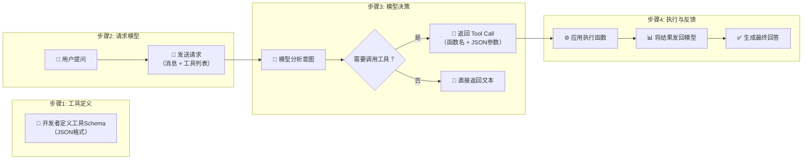

# 大模型工具调用（Tool Use / Function Calling）：从原理到终端智能体全解析

> **摘要**：大语言模型再聪明，终究只是一颗被训练数据“冻住”的大脑——它无法查询实时天气，不能发送邮件，更不可能帮你执行终端命令。工具调用（Tool Use / Function Calling）正是打破这层壁垒的关键技术，让模型从“只会说”进化为“真能做”。本文将系统解析OpenAI Function Calling的核心原理，包括JSON Schema工具定义、模型决策流程、参数解析与结果反馈机制，并深入剖析Claude Tool Use的实现差异。最后，我们将视角投向前沿应用——Codex CLI、Copilot CLI与Cursor，解读AI Agent如何从API接口走向终端，成为真正能“动手”的编程伙伴。


## 一、引言：一个天气预报引发的范式跃迁

想象这样一个场景：你打开一个AI助手，问了一句“江苏现在的天气怎么样？”如果是2023年之前的大语言模型，它可能会给你一段看似合理的回答——但很遗憾，那段回答很可能是编造的。因为GPT-3.5的知识截止于2021年9月，GPT-4的知识截止于2023年4月，它们根本不知道“现在”的天气。

这就是传统LLM的根本性局限：**知识的时效性与外部交互的缺失**。模型的参数中存储的是训练时“学”到的知识，而不是实时信息。它不会上网查天气，不会调用API，更不会操作数据库。面对“现在”、“我的”、“帮我做”这类请求时，LLM只能凭借参数记忆“猜”一个答案——学术上称之为“幻觉”。

2023年6月，OpenAI发布了一项看似低调却影响深远的功能：**Function Calling**（函数调用）。它允许开发者在API请求中描述可用的函数，模型则能智能地决定是否调用某个函数，并返回结构化的JSON参数。这一机制让LLM从“回答者”跃迁为“行动者”——模型不再直接生成最终答案，而是输出一个机器可读的“工具调用指令”，由应用层执行实际的操作，再将结果反馈给模型完成最终回复。

这一范式跃迁的意义怎么强调都不为过。如果把LLM比作大脑，Function Calling就是为大脑接上了“手脚”——大脑负责思考“我需要查天气”，手脚负责执行API调用，最后大脑将返回的数据组织成用户友好的自然语言。这正是AI Agent技术的基石。


## 二、Function Calling 核心原理：四步闭环

### 2.1 整体架构：模型不执行，只负责“点菜”

在深入API细节之前，需要先澄清一个常见误解：**大模型本身并不执行任何函数**。Function Calling这个名称有些误导——模型不会真的去调用你的代码。它的真实工作方式是：模型在理解用户意图后，判断“这个请求需要某个工具来完成”，然后生成一个结构化的JSON对象，告诉应用层“请帮我调用这个函数，参数如下”。实际执行仍由你的应用代码完成。

整个流程形成一个四步闭环：



### 2.2 步骤一：工具定义——告诉模型“你能做什么”

工具定义是整个流程的起点。开发者需要向模型声明“你可以使用哪些函数”，每条声明包含三个核心字段：

- **`type`**：固定为`"function"`（新版API统一使用`tools`字段）。
- **`name`**：函数的唯一标识符，模型用它来“点名”调用哪个函数。
- **`description`**：用自然语言描述这个函数的功能。**这是最关键的一行**——模型正是通过描述文字来判断“当前任务是否需要调用这个函数”。
- **`parameters`**：用JSON Schema定义参数的类型、是否必填、取值范围等约束。

一个完整的工具定义示例如下：

```json
{
  "type": "function",
  "function": {
    "name": "get_current_weather",
    "description": "获取指定地点的当前天气信息",
    "parameters": {
      "type": "object",
      "properties": {
        "location": {
          "type": "string",
          "description": "城市和州/省，例如：江苏, 无锡"
        },
        "unit": {
          "type": "string",
          "enum": ["celsius", "fahrenheit"],
          "description": "温度单位"
        }
      },
      "required": ["location"]
    }
  }
}
```

当这段定义随用户请求一起发送给模型时，模型就知道：“我有一个能查天气的工具，需要提供地点和可选温度单位”。这正是OpenAI官方给出的经典示例。

### 2.3 步骤二：模型决策——判断“要不要调用”与“调用哪个”

当用户提问“旧金山现在天气怎么样？”时，模型会接收到消息内容和可用的工具列表。模型经过微调（Fine-tuning），能够检测何时需要调用函数——基于用户的输入和工具描述进行语义匹配。

这一过程可以拆解为两个子决策：

**决策一：是否需要工具？** 模型会评估：这个问题我能直接回答吗？如果问题涉及实时信息、用户私有数据、需要执行操作等，模型就判断“需要调用工具”。如果问题是“什么是函数调用？”这种知识型问题，模型可以直接回答，不会触发工具调用。

**决策二：调用哪个工具？** 当定义了多个工具时，模型根据工具描述的语义匹配度选择最合适的一个（或多个）。模型通过语义分析确定所需工具，再从上下文中提取参数信息完成填充。

### 2.4 步骤三：参数生成——从自然语言到结构化JSON

一旦模型决定调用某个工具，它就会从用户的自然语言中提取所需参数，生成一个结构化的JSON对象。模型返回的不是普通文本，而是一个包含函数名和参数的`tool_call`对象：

```json
{
  "role": "assistant",
  "tool_calls": [
    {
      "id": "call_abc123",
      "type": "function",
      "function": {
        "name": "get_current_weather",
        "arguments": "{\"location\": \"San Francisco, CA\", \"unit\": \"celsius\"}"
      }
    }
  ]
}
```

`arguments`字段是一个JSON字符串，其结构严格遵循你在工具定义中声明的parameters schema。这正是Function Calling相比传统“让模型输出JSON”方式的优势所在：**模型经过专门训练，输出的参数更符合Schema要求，大幅降低解析失败的几率**。

值得强调的是，OpenAI最初使用`functions`和`function_call`参数实现这一功能，现在这些参数已被标记为**弃用**，官方推荐新代码统一使用`tools`和`tool_choice`的新风格。`tool_choice`参数可以设置为：
- `"auto"`：模型自行决定是否调用（默认）。
- `"none"`：强制不调用任何工具。
- `{"type": "function", "function": {"name": "xxx"}}`：强制调用指定函数。

### 2.5 步骤四：执行与反馈——完成闭环

模型返回tool call后，接下来的工作交还给应用代码：

1. **解析tool call**：提取`function.name`和`function.arguments`。
2. **执行对应函数**：调用你提前实现好的函数，传入解析后的参数。
3. **获取执行结果**：函数返回数据（如天气API响应）。
4. **将结果发回模型**：以`role: "tool"`的消息格式，附上`tool_call_id`和函数输出。
5. **模型生成最终回复**：模型拿到真实数据后，组织成自然语言返回给用户。

这个闭环实现了“大脑思考 → 手脚执行 → 大脑整合汇报”的完整链路。正如Agent设计模式中所总结的：函数调用是连接LLM推理能力与大量外部功能之间差距的技术机制。


## 三、工具Schema定义详解：JSON Schema的工程实践

### 3.1 Schema的核心要素

工具Schema是Function Calling的“契约”。一份高质量的定义能让模型准确理解工具的用途和用法。除了前面提到的`name`、`description`、`parameters`三要素外，JSON Schema还支持丰富的约束特性。

**基础类型**：`type`支持`string`、`number`、`integer`、`boolean`、`object`、`array`。例如查询订单时可以用`integer`表示数量、`boolean`表示是否已支付。

**枚举值（enum）**：当参数只有几个固定选项时，使用`enum`限制取值范围，减少模型“自由发挥”的风险。如温度单位的`["celsius", "fahrenheit"]`。

**必填字段（required）**：用数组标注哪些参数是必需的，模型会确保这些字段出现在生成的arguments中。

**数值约束**：`minimum`、`maximum`限定数值范围，`multipleOf`限定倍数。例如重量参数可以限制在0.1到50之间。

**字符串格式（format）**：可声明`date`、`date-time`、`email`、`uri`等格式，引导模型输出符合规范的字符串。

**嵌套对象与数组**：Schema支持多层嵌套。例如提取人员信息的函数，参数可以是一个数组，每个元素包含name、birthday、location等字段。这正是OpenAI官方示例中`extract_people_data`函数的做法。

### 3.2 复杂Schema实战：多参数函数定义

以下是一个更接近生产场景的示例——创建订单的函数定义：

```json
{
  "type": "function",
  "function": {
    "name": "create_order",
    "description": "为用户创建一个新订单",
    "parameters": {
      "type": "object",
      "properties": {
        "customer_id": {
          "type": "string",
          "description": "客户唯一标识"
        },
        "items": {
          "type": "array",
          "description": "订单商品列表",
          "items": {
            "type": "object",
            "properties": {
              "product_id": {"type": "string"},
              "quantity": {"type": "integer", "minimum": 1},
              "color": {"type": "string", "enum": ["红色", "黑色", "蓝色"]},
              "size": {"type": "string", "enum": ["S", "M", "L", "XL"]}
            },
            "required": ["product_id", "quantity"]
          }
        },
        "shipping_method": {
          "type": "string",
          "enum": ["standard", "express"],
          "description": "配送方式"
        },
        "payment_type": {
          "type": "string",
          "enum": ["online", "cod"],
          "description": "支付方式：在线支付或货到付款"
        }
      },
      "required": ["customer_id", "items"]
    }
  }
}
```

当用户输入“帮我下单3件XL码红色T恤，使用顺丰到付”时，模型能解析出商品参数、物流方式、支付类型，并生成对应的结构化参数。这种声明式的Schema设计，让开发者只需定义工具接口，模型就能自动完成从自然语言到API调用的映射。

### 3.3 Structured Outputs：更严格的输出控制

Function Calling的JSON Schema约束已经足够强大，但在一些对格式有极致要求的场景下仍可能发生偏离。2024年8月，OpenAI推出了**Structured Outputs**功能，允许通过`response_format`字段指定严格的JSON Schema，并通过`strict: true`强制模型输出完全符合Schema的内容。

Function Calling（tools模式）与Structured Outputs的主要区别在于：
- **Function Calling**：模型返回的是tool call指令，用于触发外部函数执行，灵活性更高。
- **Structured Outputs**：模型直接返回符合Schema的结构化数据，适合需要严格格式化的场景（如实体提取、表单填充）。

两者可以结合使用：在工具定义中加入`"strict": true`，确保模型生成的参数绝对符合Schema，进一步降低解析失败的概率。


## 四、大模型如何选择工具、传递参数与解析结果

### 4.1 工具选择机制：语义匹配与意图识别

模型如何从多个候选工具中选出正确的那个？答案藏在工具定义的`description`字段中。模型的工具选择本质上是**语义相似度匹配**——它将用户输入与所有工具的name和description进行语义对比，选出最相关的那个（或多个）。

这一过程在Qwen3-14B的Function Calling实现中被拆解为两阶段：
- **意图识别阶段**：通过语义分析确定用户想要完成什么操作。
- **参数填充阶段**：从对话上下文中提取具体参数值。

以电商场景为例，当定义了`check_inventory`、`calculate_shipping`、`create_order`、`send_notification`四个工具时，模型面对“查询库存”和“下单购买”会分别触发不同的工具链。更复杂的是链式调用：用户一句“帮我下单3件XL码红色T恤，使用顺丰到付”可能触发库存检查→运费计算→订单创建的多工具组合。

### 4.2 并行工具调用

现代Function Calling支持**并行调用多个工具**。当用户请求需要同时获取多个独立信息时，模型可以在一次响应中返回多个tool call，应用层并行执行，大幅降低延迟。例如“比较北京和上海今天的天气”可以同时触发两次`get_weather`调用，分别传入不同城市的参数。

### 4.3 参数提取：从自然语言到类型化数值

参数提取的精准度取决于两个因素：**Schema定义的质量**和**模型的指令遵循能力**。

**Schema层面的优化技巧**：
- `description`要具体，最好包含示例。例如`"date": {"type": "string", "description": "出发日期，格式YYYY-MM-DD"}`。
- 使用`enum`限制离散选项，避免模型创造不存在的值。
- 对数值参数加上`minimum`/`maximum`约束。

**提示词层面的配合**：虽然工具定义本身就提供了足够的引导，但有时在系统提示词中额外说明工具的使用场景和调用顺序，能进一步提升模型表现的稳定性。

### 4.4 结果解析与错误处理

应用层收到tool call后，需要：
1. **校验参数**：检查类型是否匹配、必填项是否齐全、枚举值是否合法。这一步能防止因模型输出偏差导致的运行时错误。
2. **执行函数**：调用实际的业务逻辑或API。
3. **封装返回结果**：将执行结果（成功数据或错误信息）以标准的tool message格式发回模型。

错误处理尤为关键。如果外部API调用失败，不应该将原始报错堆栈直接丢给模型，而是返回结构化的错误描述，例如`{"error": "API rate limit exceeded", "suggestion": "请稍后重试"}`。模型收到错误信息后，可以据此向用户解释原因或尝试其他备选方案。


## 五、Claude Tool Use：另一种实现哲学

### 5.1 核心机制的相似与差异

Anthropic的Claude系列模型同样提供了工具调用能力，其底层逻辑与OpenAI高度相似：模型不直接执行函数，而是返回一个结构化的tool use指令，由应用层实际执行。

但两者在API设计上有显著差异：

| 维度 | OpenAI Function Calling | Claude Tool Use |
|------|-------------------------|-----------------|
| **触发方式** | 响应中返回`tool_calls`数组 | 响应中`stop_reason`为`"tool_use"` |
| **工具定义** | `tools`参数，`type: "function"` | `tools`参数，支持更细粒度的`input_schema` |
| **并行调用** | 支持 | 支持 |
| **代码执行** | 通过函数调用间接实现 | 可直接编写并执行Python代码（沙箱环境） |
| **扩展思考** | 独立于工具调用 | 可在扩展思考中穿插工具调用 |

Claude在接收到用户请求和工具列表后，如果判断需要使用工具，其API响应中的`stop_reason`会变为`tool_use`，`content`块中则包含工具名称和输入参数。

### 5.2 Claude的独特优势：Code Execution

Claude Tool Use有一个OpenAI目前不具备的能力：**代码执行**。Claude可以编写Python代码来调用工具函数，可能包含多个工具调用和预处理/后处理逻辑，代码在沙箱容器中运行，当函数被调用时，代码执行暂停，API返回tool_use块。

这意味着Claude不仅能为函数填充参数，还能为复杂的工具链编写胶水代码——例如先调用API获取原始数据，再用Python清洗格式，最后将结果喂给下一个工具。这种“编程式工具调用”将Agent的能力边界扩展到了一个新维度。Claude Sonnet 4进一步强化了这一特性，支持在扩展思考过程中交替进行推理和工具调用，使响应质量显著提升。

### 5.3 选型参考

- **如果你的应用需要精细的函数调用控制和丰富的生态（如LangChain集成）**，OpenAI是更成熟的选择。
- **如果你需要Agent自主编写代码来处理复杂工具链**，Claude的代码执行能力可能更契合。
- **两者都支持的工具调用范式在工程实现上是相通的**——Schema定义、意图识别、参数填充、结果反馈的四步闭环对任何LLM工具调用都适用。


## 六、Codex CLI与Copilot CLI：AI Agent杀入终端

如果说Function Calling是让LLM学会了调用API，那么Codex CLI和Copilot CLI则是让这种能力“下沉”到了开发者最熟悉的环境——**终端命令行**。

### 6.1 终端AI Agent的崛起

传统AI编程助手（如GitHub Copilot代码补全）仅限于编辑器内“提示下一行代码”。而新一代终端AI Agent则完全不同：**它们是能自主规划、执行复杂任务的AI代理**，能理解代码上下文和GitHub生态系统，处理探索新代码库、根据Issue实现功能特性、本地问题调试等复杂任务。

这类工具的共同特征包括：
- **自然语言驱动**：用日常语言描述需求，Agent自动转化为命令执行。
- **文件修改能力**：直接读写项目文件。
- **命令执行**：在沙箱环境中运行终端命令。
- **MCP集成**：支持Model Context Protocol，可连接外部工具和数据源。

### 6.2 Codex CLI：OpenAI的终端先锋

Codex CLI是OpenAI推出的终端AI编程助手，定位与Claude Code相似。它能够接受指令、修改文件、运行命令，并通过MCP服务器扩展能力。Simon Willison在评测中指出，Codex CLI和Claude Code都已支持图片粘贴功能，而Copilot CLI在发布初期尚未加入此特性。

### 6.3 GitHub Copilot CLI：生态整合的深度玩家

2025年9月，GitHub正式推出了Copilot CLI的公测版。作为GitHub生态的“亲儿子”，它的最大优势在于与GitHub平台的深度集成：

- **模型选择灵活**：默认使用Claude Sonnet 4，但可通过`COPILOT_MODEL=gpt-5`切换到GPT-5。
- **计费整合**：直接使用现有GitHub Copilot订阅账户计费，无需额外API密钥管理。
- **GitHub工作流自动化**：在终端内完成“列出待Review的PR”、“根据Bug描述创建Issue”等操作，无需切换页面。
- **依赖升级与安全修复**：扫描项目漏洞、升级依赖包、处理破坏性变更并运行测试——全自动化完成。

当你把Copilot CLI嵌入到Coder工作空间等云端开发环境时，它从“终端里的AI助手”升级为“可规模化复制的自动化开发节点”，开发者可以在后台并行运行多个Copilot会话。

### 6.4 终端Agent的底层：仍然是Function Calling

无论是Codex CLI还是Copilot CLI，其“理解自然语言→选择操作→执行命令”的核心机制，本质上就是Function Calling的终端版本：
- 用户输入自然语言指令。
- Agent内部维护了一套工具定义：`read_file`、`write_file`、`run_command`、`search_code`、`create_pr`等。
- LLM决定调用哪个工具，生成参数（如文件路径、命令内容）。
- Agent执行层在沙箱环境中执行实际的文件操作或命令。
- 执行结果反馈给LLM，用于生成下一步操作或最终回复。

这种“工具调用+执行反馈”的循环，正是从API接口走向实际操作的完整路径。对于开发者而言，这意味着AI不再只是“建议”，而是可以直接动手“干活”——这也是Agentic Coding时代到来的标志。


## 七、Cursor：从编辑器到AI原生平台

### 7.1 工具调用的终极形态：多Agent协作

如果Codex和Copilot CLI是将工具调用带入终端，那么Cursor则是将这一范式推向了极致——**多Agent并行协作**。

2025年10月，Cursor发布了里程碑式的2.0版本，带来了两项核心突破：

**自研编程模型Composer**：Cursor从零打造了自己的编程模型，采用混合专家（MoE）架构，专为低延迟的智能体式编码优化。官方数据显示其速度比同类模型快4倍，能在30秒内完成多数编程任务。

**多智能体界面**：单个提示下最多可并行运行8个AI Agent，每个Agent在独立环境中工作，使用git worktrees防止文件冲突。这意味着你可以同时让一个Agent修复bug、一个Agent编写单元测试、一个Agent优化性能——所有工作并行推进。

### 7.2 工具调用的产品化实践

Cursor将工具调用能力产品化为几大核心功能：

**Plan模式**：Cursor会主动提出澄清细节的问题来提升规划质量，并显示交互式UI让用户轻松回答。这实际上是让工具调用的“意图识别”环节从全自动升级为人机协同——模型不确定时主动询问，避免错误执行。

**AI代码审查**：在编辑器中直接通过AI审查代码变更并找出问题，Bugbot则会在GitHub/GitLab等托管平台上自动运行。这本质上是将`code_review`作为一个内置工具，Agent自动触发并返回审查意见。

**内置浏览器工具**：Cursor 2.0加入了浏览器工具，让AI能自己测试自己写的代码——打开网页、点击按钮、验证功能，全程自动化。这是一个全新的工具类型，将Agent的行动能力从代码操作扩展到了UI交互。

### 7.3 Cursor的启示：工具调用的未来是“工具生态”

Cursor的成功揭示了一个趋势：工具调用的价值不在于单个工具的精准执行，而在于**工具的丰富性和Agent自主组合工具的能力**。当AI拥有足够多的工具（文件读写、命令执行、浏览器操作、代码审查、Git操作等），并能根据任务动态编排调用顺序时，它就不再是一个“辅助工具”，而是一个真正的“协作伙伴”。

这正是Function Calling从API功能演进为AI Agent基础设施的完整叙事：**从“让模型调用一个函数”开始，到“让模型自主组合多种能力完成复杂任务”为止**。


## 八、总结与选型建议

### 8.1 核心要点回顾

1. **Function Calling是AI Agent的基石**：它通过“工具定义→模型决策→参数生成→执行反馈”的四步闭环，让LLM从被动的回答者变为主动的行动者。

2. **Schema定义决定调用质量**：工具描述和参数Schema的精确程度直接影响模型的选择准确率和参数正确性。遵循JSON Schema规范、合理使用枚举和约束是工程实践的关键。

3. **模型只“决策”不“执行”**：所有工具调用的实际执行都由应用层完成，这保证了安全性和可控性。

4. **OpenAI与Claude各有侧重**：OpenAI的Function Calling生态成熟、文档完善；Claude的Tool Use支持代码执行，更适合需要胶水逻辑的复杂工具链场景。

5. **终端Agent是工具调用的前沿应用**：Codex CLI和Copilot CLI将工具调用能力带入终端，让AI能够操作文件、执行命令、管理Git工作流。

6. **Cursor展示了多Agent协作的未来**：8个Agent并行工作、自研模型、内置浏览器工具——工具调用正在从“单工具单任务”演进为“多工具自主编排”。

### 8.2 技术选型决策框架

| 你的需求 | 推荐方案 |
|----------|----------|
| 为现有应用添加API调用能力 | OpenAI Function Calling（tools模式） |
| 需要严格的结构化输出 | OpenAI Structured Outputs |
| 需要Agent编写代码处理复杂逻辑 | Claude Tool Use（代码执行） |
| 终端环境中的AI编程助手 | Codex CLI / Copilot CLI |
| 追求极致的IDE内AI体验 | Cursor |
| 需要多模型切换和生态整合 | 使用LangChain等框架统一封装 |

### 8.3 写在最后

从2023年6月OpenAI发布Function Calling，到2025年Cursor用8个Agent并行写代码，短短两年多的时间，工具调用从一个API特性演变成了AI Agent的核心范式。它打破了LLM“只说不做”的局限，让模型真正拥有了与数字世界交互的“手脚”。

对于开发者而言，理解Function Calling不仅仅是掌握一个API的使用方法，更是理解AI Agent如何工作的入口。当你能够定义工具、编排调用链、处理执行反馈时，你就不再只是一个“API调用者”——你成为了AI Agent的设计者和指挥者。

这或许就是未来软件开发的形态：人类定义目标和约束，AI Agent自主选择工具、执行任务、汇报结果。而Function Calling，正是这个未来已经到来的第一声号角。