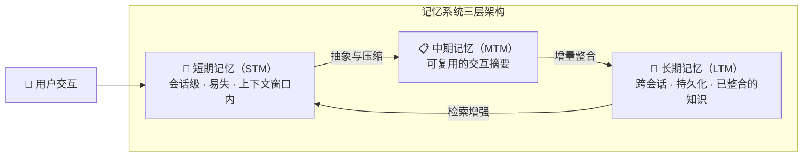
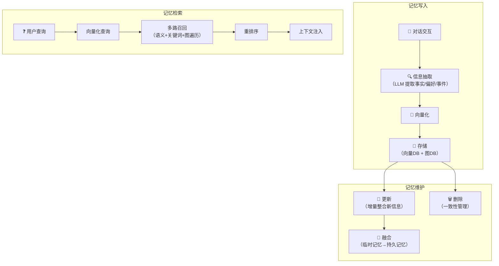
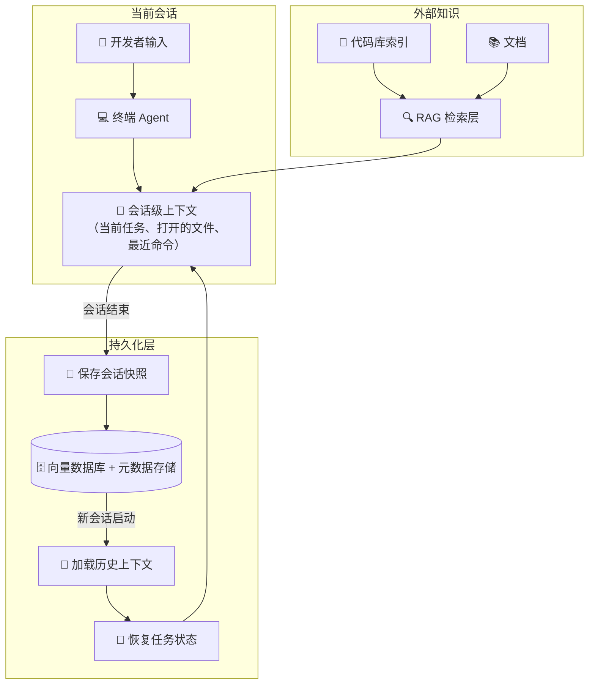

# 大模型记忆模块：从“鱼的记忆”到“终身学习”——AI Agent 记忆系统全解析（2023-2026）

> **摘要**：你是否经历过这样的场景：和 ChatGPT 聊了一个小时的项目背景，第二天打开新窗口时它一脸茫然地问“有什么可以帮您？”这种“对话失忆症”是所有大语言模型应用的阿克琉斯之踵。2026年，记忆模块已成为 AI Agent 架构中最关键的组件之一。本文将系统解析短期记忆（对话上下文）与长期记忆（向量数据库+RAG+知识图谱）的技术原理，深入剖析记忆的存取、压缩、总结三大核心策略，并全景式对比 Mem0、Zep、LangMem 等主流框架。此外，还将回顾 2023 至 2026 年间记忆模块能力的四次范式跃迁，最终聚焦如何利用记忆模块让 Codex CLI、Copilot CLI 等终端 AI 工具避免工程“失忆”。无论你是 AI 应用开发者、架构师还是技术管理者，这篇两万字深度指南都将为你构建可落地的 Agent 记忆系统提供完整知识地图。


## 一、引言：大模型为什么需要“记忆”？

### 1.1 当最聪明的 AI 患上“失忆症”

2026年，大语言模型的能力已经令人惊叹。Gemini 3.1 Pro 拥有高达 1M 至 2M token 的上下文窗口，可以一次性处理像《三体》三部曲这样的长篇小说。Claude 和 ChatGPT 也各自推出了记忆功能，能跨会话记住用户的偏好和工作习惯。

然而，一个根本性的矛盾依然存在：**模型的知识被“冻结”在训练数据中，而真实世界的交互是持续流式的**。你花了一整个下午和 AI 助手调试代码、分析数据、讨论架构方案，但当你关闭窗口、第二天重新打开时，一切归零——AI 不认识你、不记得昨天的讨论、不了解项目上下文。这种体验不仅是“不方便”，更是 AI Agent 从“演示级”走向“生产级”的核心障碍。

正如 AI 编程 Agent 领域所观察到的，AI 编码 Agent 面临着一个悖论：它们拥有海量的参数化知识，却记不住一小时前的对话。你的 AI 助手不是“坏了”，它只是“内存耗尽”了。

### 1.2 记忆模块：AI Agent 的“操作系统级”组件

记忆模块的本质，是为大语言模型构建一个**外部存储与管理系统**。它不是一个可选的附加功能，而是决定 AI 应用能否长期、可靠运行的**基础设施**。当 LLM Agent 从单会话演示走向持久化、长周期部署时，记忆系统成为首要的扩展性挑战。

记忆模块的核心价值可以概括为四个维度：

| 维度 | 无记忆模块 | 有记忆模块 |
|------|-----------|-----------|
| **跨会话连续性** | 每次对话从零开始 | 记住历史交互，无缝延续 |
| **个性化程度** | 通用回答，缺乏个人化 | 理解用户偏好、习惯、项目背景 |
| **任务复杂度** | 只能处理单轮简单任务 | 支持多轮、多天、跨项目的复杂工作流 |
| **效率与成本** | 每次需重复描述背景 | 自动加载相关记忆，减少重复输入 |

阿里云 Polar Agent Memory 的实践数据显示，相比将全量历史上下文塞入 prompt 的方案，引入长期记忆引擎可以带来响应时间降低 30%、Token 消耗降低 20%、回答效果提升 40% 的可量化改善。

### 1.3 记忆系统的三层分类法

在深入技术细节之前，需要先建立对记忆系统的整体认知框架。现代 AI Agent 记忆系统通常采用**三层分类法**：



- **短期记忆**：会话级的对话上下文，存储在模型的上下文窗口中，会话结束即消失。
- **中期记忆**：从单次或几次交互中抽象出的可复用摘要，用于加速后续检索。
- **长期记忆**：跨会话持久化的结构化知识与经验，通过向量数据库、知识图谱等存储。

LightMem 论文提出的三层架构正是这一分类法的典型代表，将记忆组织为短期记忆（即时对话上下文）、中期记忆（可复用交互摘要）和长期记忆（整合后的知识）。2026年 AI Agent 记忆系统的前沿研究中，定义“记忆”的三个时间跨度也被明确区分为：会话级短期记忆、跨会话中期记忆和持久化长期记忆。


## 二、短期记忆：对话上下文管理与上下文工程

### 2.1 上下文窗口的物理约束

短期记忆的本质是 LLM 的**上下文窗口**——模型一次能够“看到”的最大 token 数量。这个窗口既是模型理解对话连续性的唯一通道，也是制约对话长度的物理天花板。

2025-2026年，主流模型的上下文窗口发生了爆发式增长：

| 模型 | 上下文窗口 | 发布时间 |
|------|-----------|----------|
| GPT-4 (早期) | 8K-128K | 2023-2024 |
| Gemini 1.5 Pro | 1M-2M | 2025-2026 |
| GPT-5.4 | ~400K | 2026 |
| Claude Opus 4.6 | 200K+ | 2026 |

Gemini 3.1 Pro 的 1M token 上下文窗口意味着可以一次性处理像《三体》三部曲这样的长篇小说，或者数小时的会议录音，其底层核心技术是改进版的 Transformer 架构，结合了局部敏感哈希和滑动窗口注意力。Gemini 1.5 Pro 处理超长上下文时需启用原生 1M token 窗口、分块嵌入+向量检索增强、动态截断与优先级标注等五种技术路径。

然而，上下文窗口的扩大并没有“解决”记忆问题，它只是将瓶颈后移了。即使有 1M token 的窗口，如果用户的交互跨越数天、涉及数十个会话，仍然需要外部记忆系统来桥接这些断点。更关键的是，将所有历史塞入上下文的成本高昂——LongRoPE2 等技术虽能将上下文窗口扩展到目标长度并保持性能，但计算开销随窗口线性增长。

### 2.2 核心上下文管理策略

当对话内容超出模型上下文窗口时，必须有策略地管理哪些内容留在窗口内、哪些被压缩或丢弃。

**策略一：滑动窗口**

滑动窗口法是最简单直接的方案：固定保留最近 N 轮对话，超出的部分直接丢弃。ChatGPT 早期版本的 32K token 窗口就是这种策略的典型应用，通过位置编码保留时序信息。

滑动窗口的优化方案包括**窗口重叠设计**，设置 30% 的重叠率（如窗口大小 4096，步长 2867），确保跨窗口信息连续性。这种方法在长文本生成任务中能有效减少语义断裂。

**策略二：记忆压缩技术**

记忆压缩使用摘要模型将历史对话压缩为关键向量或摘要文本，存储于外部记忆库。压缩不是简单的截断，而是语义的提炼。

LangChain 的 ConversationSummaryBufferMemory 结合了缓冲区和摘要机制：保留最近交互的缓冲区，但当达到 token 阈值时，不是简单丢弃旧对话，而是将它们编译成摘要，并同时使用缓冲区和摘要。

**策略三：自适应保真度记忆**

Adaptive Focus Memory（AFM）将每条历史消息分配为三种保真度级别之一：FULL（完整保留）、COMPRESSED（压缩保留）或 PLACEHOLDER（仅占位），基于消息的重要性动态调整。这种方法在保持关键信息精度的同时最大化上下文利用率。

**策略四：层次化编码**

将对话分为“当前轮次—短期记忆—长期知识”三层，分别用不同粒度的模型处理。这允许系统在处理当前轮次时使用完整上下文，而历史信息则以压缩形式参与。

### 2.3 LangChain Deep Agents 的上下文压缩实践

LangChain Deep Agents SDK 提供了一个生产级的上下文管理参考实现。它实现了三种主要的压缩技术，按不同频率触发：

1. **大型工具结果的卸载**：当工具响应超过 20,000 token 时，Deep Agents 将其卸载到文件系统，替换为文件路径引用和前 10 行预览。Agent 后续可按需重新读取或搜索内容。

2. **大型工具输入的卸载**：当会话上下文超过模型可用窗口的 85% 时，Deep Agents 会截断旧的工具调用内容，替换为磁盘上的文件指针，减少活跃上下文的体积。

3. **摘要生成**：当卸载不再能腾出足够空间时，Deep Agents 使用 LLM 生成会话的结构化摘要——包括会话意图、已创建的产物、下一步计划等——来替换完整的对话历史。

这套“卸载→截断→摘要”的分层策略，使得 Deep Agents 能够处理远超模型原生上下文窗口的长时间任务。

### 2.4 记忆压缩的光谱统一理论

2026年的一篇前沿论文提出了一个引人深思的观点：记忆系统与技能发现本质上是同一问题的不同表现——从交互轨迹中提取可复用知识。研究者提出了 **Experience Compression Spectrum**（经验压缩光谱）框架，将记忆、技能和规则定位为同一条压缩轴上的不同节点：

- **情节记忆**：压缩比约 5-20 倍
- **程序性技能**：压缩比约 50-500 倍
- **声明性规则**：压缩比约 1000 倍以上

更高的压缩比直接减少上下文消耗、检索延迟和计算开销。论文还揭示了一个令人惊讶的事实：记忆研究和技能研究两个社区之间的交叉引用率不足 1%，尽管它们解决的是同一根本问题。这一发现指明了未来记忆系统的发展方向：**自适应压缩**——根据任务需求动态选择压缩级别，而不是固定在预设的压缩率上。


## 三、长期记忆：向量数据库、RAG 与知识图谱

### 3.1 长期记忆 vs RAG：定位差异

许多开发者会困惑：RAG 不就是长期记忆吗？两者确实有重叠，但定位不同。

Milvus 博客对 Claude Cowork 和 RAG 的对比分析给出了清晰的区分：

- **RAG 是知识驱动的**：系统从稳定的、版本化的语料库中检索权威事实，回答用户问题时作为参考依据。检索语料通常不变，由开发者控制内容。

- **Cowork 式记忆是任务驱动的**：Agent 读写自己不断演变的任务状态——它决定哪些当前任务的信息是相关的，将其存储为记忆条目，并在任务进展中稍后检索。

更简洁的表述是：**RAG 检索“世界知识”，长期记忆存储“自我经验”**。两者并非替代关系，而是互补关系。现代 Agent 系统通常同时使用：RAG 提供领域知识，长期记忆提供用户个性化信息和任务演进状态。

### 3.2 向量数据库：长期记忆的存储引擎

向量数据库是实现长期记忆的基础设施。它通过将记忆片段编码为高维向量，实现基于语义相似度的快速检索。

常见的架构包括：

- **纯向量存储**：每条记忆独立存储，通过余弦相似度检索。优点是简单高效，缺点是无法处理跨事实的关系推理。全 RAG 方案仅靠向量存储，检索良好但交叉引用能力差。

- **混合向量+图结构**：Mem0 和 Zep 都采用了这种架构。向量索引负责语义搜索，知识图谱负责实体关系推理。Mem0 的压缩引擎能将聊天历史压缩为优化的记忆表示，宣称可实现高达 80% 的 prompt token 减少。

- **双模存储**：阿里云 Polar Agent Memory 同时使用向量数据库进行语义相似度搜索（ANN）和知识图谱引擎存储与推理实体及事件间的复杂关系。

- **分层索引**：OpenViking 使用文件系统范式替代纯向量存储，将上下文（记忆、资源、技能）组织在 `viking://` URI 下，分为 L0（~100 token）、L1（~2K token）、L2（完整内容）三层。

- **压缩索引+向量存储**：zer0dex 采用双层架构，一个压缩的人类可读索引（~3KB）作为语义目录，告诉 Agent 知识的类别存在性，配合向量存储进行细节检索。其评测数据显示 recall 达到 91.2%，而纯 RAG 为 80.3%，跨引用能力提升尤其显著（80.0% vs 37.5%）。

### 3.3 长期记忆的全生命周期管理

一个完整的长期记忆系统需要覆盖以下生命周期环节：



以 Polar Agent Memory 的工程实践为例：

1. **记忆提取**：对长对话切片，通过 LLM 提示工程提取用户明确表达的事实、偏好或需求，并构建为知识图谱节点。
2. **向量化与存储**：记忆片段进行语义向量化支持模糊匹配，同时提取关键词用于精确过滤，存储至向量数据库和图数据库。
3. **记忆融合**：新提取的记忆暂存待验证，随后与持久记忆融合更新。
4. **记忆检索**：结合语义向量与关键词进行多路召回，通过知识图谱发现隐式关联，最后使用 Rerank 模型重排序。
5. **记忆源管理**：删除对话记录时自动触发关联记忆的失效或重建，保证记忆与源信息的一致性。

### 3.4 情节记忆 vs 语义记忆

认知心理学区分“情节记忆”和“语义记忆”：

- **情节记忆**：对具体事件的记忆（“上周二我和用户讨论了数据库选型”）。
- **语义记忆**：抽象化的事实和概念（“用户偏好使用 PostgreSQL”）。

现代 Agent 记忆系统正在向更精细的情节记忆方向发展。Beyond Fact Retrieval 研究提出了生成式语义工作空间，让 Agent 能够在长周期内推理情节记忆，而不仅仅是检索孤立的事实。GAAMA 通过构建概念介导的层次化知识图谱，从原始对话中保存逐字情节、提取原子事实和主题级概念节点、合成高阶反思。

### 3.5 Agentic Memory：自主记忆管理

传统记忆系统将记忆管理（何时存储、检索、更新、丢弃）作为**外部固定规则**来实现。Agentic Memory（AgeMem）则提出了一个更激进的方案：将长期记忆和短期记忆管理**直接集成到 Agent 的决策策略中**，让 LLM Agent 自主决定存储什么、何时存储、检索什么、何时更新、何时摘要、何时丢弃。

这意味着 Agent 不再被动接受预定义的记忆策略，而是能根据任务需求动态调整自己的记忆行为——这是一个从“记忆作为工具”到“记忆作为能力”的范式跃迁。


## 四、记忆的存取、压缩与总结策略深度解析

### 4.1 写入策略：何时存、存什么

记忆写入是决定长期记忆质量的第一个关口。写入太频繁会导致存储膨胀和噪音积累；写入太保守则会丢失关键信息。

**主流写入策略**：

| 策略 | 机制 | 优点 | 缺点 |
|------|------|------|------|
| **实时写入** | 每条交互后立即提取并存储 | 信息不丢失 | 存储开销大，噪音多 |
| **会话结束写入** | 会话结束后批量提取摘要 | 可综合全局视角 | 可能丢失中间细节 |
| **重要性触发写入** | 当信息重要性超过阈值时写入 | 平衡精度与成本 | 需要可靠的重要性评估 |
| **手动标记写入** | 用户显式要求“记住”某条信息 | 高精度，隐私可控 | 依赖用户主动性 |

Claude Memory 的早期版本采用了“用户主动请求时检索相关历史对话”的机制，而非持久性自动记忆，以保障隐私安全。OpenAI ChatGPT 的记忆功能则同时支持用户显式请求保存和从过往对话中自动收集见解。

### 4.2 检索策略：如何找到相关记忆

检索是将存储的记忆转化为实际价值的关键环节。检索质量直接影响 Agent 能否在正确的时间获取正确的上下文。

**多路召回 + 重排序**是当前主流方案：

1. **语义向量检索**：用查询的嵌入向量与记忆库做余弦相似度匹配。
2. **关键词精确检索**：使用 BM25 等算法处理精确匹配需求（如产品名、日期）。
3. **知识图谱遍历**：通过实体关系发现隐式关联记忆（如“谁参与了项目A”→“项目A的相关文档”）。
4. **重排序**：使用交叉编码器对多路召回结果重新打分，精选 Top-K。

Polar Agent Memory 的多路召回实践显示，结合语义向量、关键词检索和知识图谱连接关系，并通过 Rerank 模型重排序，能显著提升检索准确性。LightMem 的在线检索采用向量粗检索后跟语义一致性重排序的两阶段过程，在中位延迟 83ms（检索）和 581ms（端到端）下取得了显著的 F1 提升。

### 4.3 压缩策略：从“存什么”到“忘什么”

压缩策略决定长期记忆系统能否可持续运行。没有有效的压缩，记忆库会无限膨胀。

**压缩的三个维度**：

1. **摘要压缩**：用 LLM 将多条相关记忆合成为一条更精炼的记忆。LangChain 的 ConversationSummaryMemory 会随着对话进行持续生成总结，旧的总结会与新对话内容一起被“阅读”，生成全新的、与时俱进的摘要。

2. **遗忘机制**：SuperLocalMemory V3.3 实现了受生物学启发的遗忘机制，结合认知量化和多通道检索，为 AI 编码 Agent 设计了数学化的记忆生命周期动力学。

3. **重要性衰减**：根据记忆的访问频率、时间戳和任务相关性计算衰减权重，低权重记忆被逐步淘汰。LightMem 将记忆管理模块化为检索、写入和长期整合，并分离在线处理和离线整合，在有限计算资源下实现高效记忆调用。

**压缩的挑战**：

Mem0 等框架的实践表明，虽然它们添加了图数据库、衰减算法、压缩逻辑等能力，但结果是需要维护比 Agent 本身更多的“记忆基础设施”。在引入复杂的压缩机制时，必须在效果和运维复杂度之间取得平衡。

### 4.4 总结策略：从“压缩”到“抽象”

总结是比压缩更高层次的操作——它不仅是信息的精简，更是知识的抽象。

**总结的层次**：

- **L1：逐轮摘要**：每轮对话后生成简短摘要。
- **L2：会话摘要**：会话结束后生成整体摘要，包含关键决策和产出。
- **L3：跨会话主题摘要**：识别跨多个会话的重复主题，合成为持久知识。

Deep Agents 的摘要机制体现了 L2 和 L3 的融合：LLM 生成包含会话意图、已创建产物和下一步计划的结构化摘要，用于替换完整对话历史。

**语义压缩**是另一个关键概念：使用 LLM 将长对话历史就地总结，保留含义、关键实体、日期和对话语调，而非简单截断。这种方法在保持语义连贯性的同时大幅减少 token 消耗。


## 五、大厂方案与科研前沿全景

### 5.1 主流记忆框架深度对比

2026 年，AI Agent 记忆框架生态已经相当成熟。以下是对 5 个主流框架的系统对比：

**Mem0**
- **架构**：混合向量 + 知识图谱 + KV 存储
- **核心特点**：开源社区最活跃（48K+ GitHub stars），YC 投资（$24M），最成熟的托管平台
- **时序能力**：弱（扁平向量，无显式时序建模）
- **LoCoMo 基准**：~64%
- **适用场景**：聊天机器人、个人助理、个性化记忆
- **定价**：免费 → $19/月 → $249/月（Pro 版含图记忆）

**Zep**
- **架构**：知识图谱 + 时间戳标注（情节记忆图谱）
- **核心特点**：生产级时序感知，图结构支持关系推理，LongMemEval 63.8%（vs Mem0 49.0%，差距 15 个百分点）
- **时序能力**：强（显式时序树）
- **LoCoMo 基准**：~78%（第三方评测）
- **适用场景**：长时间运行的 Agent 会话、需要时序推理的应用
- **注意**：Zep 每个对话使用的内存是 Mem0 的 340 倍

**LangMem（LangChain Memory）**
- **架构**：模块化内存策略（ConversationBuffer/Summary/Entity 等）
- **核心特点**：与 LangChain 生态无缝集成，多种内存类型可组合
- **时序能力**：取决于所选策略
- **适用场景**：LangChain 原生 Agent
- **定价**：完全开源免费

**Letta（MemGPT）**
- **架构**：分层内存架构（类似 OS 虚拟内存）
- **核心特点**：自编辑内存，适合复杂 Agent，通过内存分页管理实现超长对话
- **适用场景**：超长任务执行、复杂 Agent 工作流
- **定价**：开源 + 托管服务

**TiMem**
- **架构**：分层归纳 + 自动抽象
- **核心特点**：官方数据 LongMemEval-S 76.88%，token 效率提升 52%
- **时序能力**：中等
- **适用场景**：需要自动记忆归纳和高效 token 利用的场景

**选型决策框架**：

| 你的需求 | 推荐框架 | 理由 |
|----------|----------|------|
| 快速集成，社区生态丰富 | Mem0 | 文档最全，集成最多，最成熟 |
| 需要精确的时序推理（“上个月发生了什么”） | Zep | 时序知识图谱架构带来 15 点准确率优势 |
| 深度使用 LangChain/LangGraph | LangMem | 原生集成，零额外依赖 |
| 处理超长任务（数小时到数天） | Letta | 分层内存架构，虚拟内存范式 |
| 极致的 token 效率 | TiMem | 官方宣称 -52% token 消耗 |

### 5.2 大厂方案一览

**OpenAI ChatGPT Memory**

OpenAI 于 2024 年 2 月启动记忆功能小规模测试，2025 年 4 月升级为长期记忆系统。记忆系统以两种方式工作：用户显式请求保存的记忆，以及 ChatGPT 从过往对话中自动收集的见解来改进未来的对话。2026 年，OpenAI CEO Sam Altman 将记忆功能称为 AI 最重要的“突破性”领域之一，公司正全力投入 2026 年的功能升级。不过，Altman 也坦承记忆功能仍处于“非常粗糙、非常早期”的阶段，类似于“GPT-2 时代”。

**Anthropic Claude Memory**

Claude Memory 于 2025 年 8 月首次对个人用户开放，9 月扩展至团队场景。升级后的记忆系统能够学习用户的个人偏好和工作模式，并允许用户为多个项目创建不同的记忆空间。与 ChatGPT 的持久性记忆不同，Claude 的记忆功能需要用户主动触发检索相关历史对话，不会自动建立用户档案。用户可以审计 AI 记住的内容，指示其关注特定问题或忘记特定数据点。隐私方面，Claude 提供了“隐身聊天”模式，可实现无痕迹对话。

**Google Gemini 长上下文**

Google 走了一条不同的技术路线：通过超长上下文窗口（1M-2M token）来解决“记忆”问题，而非构建独立的外部记忆系统。Gemini 3.1 Pro 原生支持 1M token 上下文窗口，底层采用改进版 Transformer 架构，结合局部敏感哈希和滑动窗口注意力。2026 年 3 月 GA 版本带来了生产级可靠性、改进的延迟和增强的检索精度。Google 通过“无限注意力机制”打开了上下文窗口，使 Gemini 能够引用无限的输入而不会丢失任何记忆。这种“内存即上下文”的模式绕过了外部记忆系统，但也带来了成本挑战——超长上下文的计算开销随窗口线性增长。

**阿里云 Polar Agent Memory**

Polar Agent Memory 是一个部署在 PolarDB for AI 节点上的长期记忆引擎，通过向量数据库与知识图谱双模存储实现跨会话个性化记忆能力。其核心组件包括记忆管理器（全生命周期管理）、通用 AI 服务（对话切片与摘要、实体/关系抽取、向量化、重排序）和双模存储架构。实际改善数据：响应时间降低 30%、Token 消耗降低 20%、回答效果提升 40%。

### 5.3 科研前沿突破（2025-2026）

**LightMem（ACL 2026）**

由 Zhang 等 12 位作者提出的轻量级 LLM Agent 记忆系统，核心创新在于使用 SLM 驱动记忆操作、模块化设计以及在线/离线分离。在 LoCoMo 基准上取得了约 2.5 的平均 F1 提升，中位延迟 83ms（检索）、581ms（端到端）。

**Agentic Memory（AgeMem）**

将长期记忆和短期记忆管理直接集成到 Agent 决策策略中的统一框架，让 LLM Agent 自主决定记忆操作的时机和内容。

**Experience Compression Spectrum**

统一了记忆、技能和规则的框架，将它们定位为同一条压缩轴上的不同节点。论文指出所有现有系统都在固定压缩级别上运行，缺少自适应跨级压缩能力。

**SuperLocalMemory V3.3**

受生物学启发的本地优先 Agent 记忆系统，实现了完整的认知记忆分类学及数学化的生命周期动力学，为 AI 编码 Agent 设计了遗忘机制、认知量化和多通道检索。

**Memory Fabric**

多用户共享记忆框架，从早期的神经图灵机、KV 记忆网络到 AutoGen、AgentVerse 等，通过记忆织物的视角进行系统化评估。


## 六、记忆模块能力的演变：2023-2026

### 6.1 第一阶段（2023）：上下文即记忆

2023 年是 LLM 应用的爆发年，但“记忆”的概念几乎等同于“把历史消息全部塞进 prompt”。典型特征包括：

- **全量历史透传**：每轮对话将完整历史作为输入传给模型。
- **滑动窗口截断**：当对话超出上下文限制时，简单丢弃最早的消息。
- **无跨会话能力**：每次新对话从零开始。

这一阶段的核心限制是**无状态**——Agent 没有“上次我们聊到哪了”的概念。MemGPT（Letta 前身）在这一年提出了分层内存架构，模拟操作系统的虚拟内存管理，成为最早尝试系统化解决记忆问题的方案之一。

### 6.2 第二阶段（2024）：RAG 作为长期记忆

2024 年，开发者发现 RAG 模式可以自然延伸到“长期记忆”场景：

- **向量数据库存储对话历史**：将历史对话切片后向量化存储，按需检索。
- **Mem0 等专用记忆框架出现**：从通用 RAG 中分化出专门针对 Agent 记忆的框架。
- **OpenAI ChatGPT Memory 上线**：首次将“记忆”作为产品功能提供给普通用户。

这一阶段的突破在于**跨会话连续性**，但记忆的“智能程度”仍然有限——通常是扁平的事实片段，缺乏对时序关系和多跳推理的支持。

### 6.3 第三阶段（2025）：时序感知与图谱化

2025 年，记忆系统从“存事实”升级为“存关系”：

- **知识图谱 + 时间戳标注**：Zep 等框架引入情节记忆图谱，保留实体、事件和时序信息。
- **自动记忆压缩与摘要**：LangChain Deep Agents 实现上下文压缩和结构化摘要生成。
- **Claude Memory 全量开放**：学习用户偏好和工作模式，支持多项目记忆空间。

这一阶段的进步是**时序感知和关系推理**，但记忆系统仍然遵循“被动”模式——记忆策略由开发者预定义。

### 6.4 第四阶段（2026）：自主记忆管理与光谱化压缩

2026 年，记忆系统的边界被进一步打破：

- **Agentic Memory**：记忆管理成为 Agent 自主决策的一部分。
- **轻量级 SLM 驱动**：LightMem 使用小型语言模型进行记忆操作，降低延迟和成本。
- **光谱化压缩**：从固定压缩率走向自适应多级压缩。
- **生物学启发**：引入遗忘机制、生命周期管理等认知启发的记忆动力学。
- **记忆织构**：多用户共享记忆，Agent 间的记忆交换协议。

2026 年记忆系统的核心命题是：**记忆不再是“存储什么”的问题，而是“如何自主管理知识生命周期”的问题**。


## 七、记忆模块实战：Codex CLI、Copilot CLI 如何避免工程“失忆”

### 7.1 终端 AI Agent 的特殊挑战

Codex CLI（OpenAI）、Copilot CLI（GitHub）等终端 AI 编程助手面临比普通聊天机器人更严峻的记忆挑战：

- **任务跨时长**：一次代码重构可能跨越数小时甚至数天。
- **上下文庞大**：项目文件、代码结构、历史决策、依赖关系等信息量巨大。
- **窗口关闭即清零**：传统上，关闭终端窗口意味着所有会话状态丢失。
- **需要可恢复性**：开发者中断工作后应该能无缝恢复，而非从零开始。

### 7.2 Claude Cowork 的“状态持久化”方案

Claude Cowork 是 Claude Desktop 中的一个 Agent 模式，它能读取和修改本地文件，将任务分解为更小的步骤，并在不丢失状态的情况下持续工作。其记忆是**可读写的**：Agent 决定当前任务或对话中的哪些信息是相关的，将其存储为记忆条目，并在任务进展中检索。

Claude Cowork 不依赖外部的向量数据库 RAG，而是通过**任务状态持久化 + 上下文延续**来实现“记忆”效果——它能保持数小时的多步任务不重置，跟踪中间结果，并在会话间复用信息。

### 7.3 利用记忆模块构建“永不失忆”的开发 Agent

对于自研或定制化的终端 AI 编程助手，可以通过以下架构实现工程级记忆持久化：



**具体实现策略**：

1. **会话快照存储**：每次会话结束时，自动保存关键状态（当前任务描述、已修改的文件列表、待办事项、重要决策）到向量数据库。使用 Mem0 的 `m.add()` API 添加结构化记忆片段，关联 `project_id` 和 `session_id`。

2. **会话恢复提示**：新会话启动时，自动检索与当前项目相关的历史记忆，将其作为系统提示注入到 Agent 上下文中。

3. **项目级记忆索引**：使用 zer0dex 的压缩索引方案，为每个项目维护一个 `MEMORY.md` 文件，作为语义目录告诉 Agent“这个项目有哪些已知信息”。

4. **增量任务追踪**：参照 Deep Agents 的文件系统卸载策略，将大型工具响应（如代码分析结果）存储为文件，在上下文中仅保留文件路径引用。

5. **重要性驱动的记忆写入**：并非所有交互都值得存入长期记忆。可以设计规则（如“修改了超过 3 个文件”、“执行时间超过 10 分钟的命令”）触发记忆写入。

### 7.4 避免“窗口关闭即失忆”的最佳实践

**Codex CLI / Copilot CLI 记忆增强模式设计**：

```python
from mem0 import Memory
import hashlib

class PersistentTerminalAgent:
    def __init__(self, project_path: str):
        self.memory = Memory()
        self.project_id = hashlib.md5(project_path.encode()).hexdigest()
        self.session_id = f"{self.project_id}_{int(time.time())}"
    
    def on_session_start(self):
        """恢复上次会话的记忆"""
        memories = self.memory.search(
            query=f"项目 {self.project_id} 的上次会话状态和待办事项",
            user_id=self.project_id,
            limit=5
        )
        if memories:
            resume_context = "\n".join([m["memory"] for m in memories])
            return f"[历史上下文]\n上次会话状态：{resume_context}\n请从上次中断处继续。"
        return None
    
    def on_session_end(self):
        """保存当前会话的快照"""
        summary = self.generate_session_summary()  # 调用 LLM 生成摘要
        self.memory.add(summary, user_id=self.project_id)
    
    def on_major_action(self, action: str, result: str):
        """重要操作触发记忆存储"""
        if self.is_significant(action):  # 判断是否为重要操作
            self.memory.add(
                f"[{datetime.now()}] {action}\n结果：{result}",
                user_id=self.project_id
            )
```

### 7.5 从“记忆”到“连续性”

记忆模块的终极目标不是“记住更多信息”，而是提供**连续性体验**。对于终端 AI 编程助手而言，这意味着：

- **跨会话任务延续**：昨天没改完的代码，今天 Agent 主动提醒“我们上次修改到第 3 个文件，需要继续吗？”
- **项目知识积累**：Agent 逐渐了解项目的代码风格、常用模式、团队偏好。
- **错误经验学习**：Agent 记住哪些操作曾导致问题，避免重蹈覆辙。

这正是 Agentic Memory 和反思机制融合的方向——Agent 不仅记住“发生了什么”，还记住“什么有效、什么无效”，从而持续优化自身行为。


## 八、总结与展望

### 8.1 核心要点回顾

1. **记忆模块是 AI Agent 的“操作系统级”基础设施**。没有记忆的 Agent 只是“一次性工具”，有记忆的 Agent 才是“持续进化的伙伴”。

2. **短期记忆管理的关键是上下文工程**：滑动窗口、记忆压缩、摘要生成、自适应保真度——这些策略共同决定有限上下文窗口能被利用到什么程度。

3. **长期记忆 ≠ RAG**。RAG 是“检索世界知识”，长期记忆是“存储自我经验”。生产级系统需要两者协同工作。

4. **主流框架选型需考虑多维度**：Mem0 成熟易用，Zep 时序推理强，LangMem 与 LangChain 集成，Letta 适合超长任务，TiMem token 效率高。没有“最好的框架”，只有“最合适的框架”。

5. **2023-2026 记忆能力的四次跃迁**：从“上下文即记忆”到“RAG 作为记忆”，到“时序感知与图谱化”，再到“自主记忆管理”——每次跃迁都显著提升了 Agent 的能力上限。

6. **终端 AI 工具需要专门设计的记忆持久化方案**。会话快照、项目索引、增量追踪、重要性驱动存储，这些策略能让 Codex CLI、Copilot CLI 等工具告别“窗口关闭即失忆”。

### 8.2 未来展望

- **自适应压缩**：Agent 将能根据任务需求动态选择压缩级别，在精度与效率之间自动平衡。
- **跨 Agent 记忆共享**：多个 Agent 之间共享经验，形成“群体记忆”和“组织知识库”。
- **隐私与合规记忆**：随着 AI 记忆能力增强，遗忘权、数据溯源、审计日志等将变得和记忆本身同样重要。
- **端侧轻量化记忆**：LightMem 等方案证明 SLM 可以驱动高效的记忆操作，未来记忆模块可能完全运行在用户设备上，实现“私有化终身学习助手”。

---

*记忆是智能的基石。当一个 AI Agent 拥有了真正可工作的记忆系统，它就不再是一个“聪明的问答机器”，而是一个能够与人类共同成长、持续进化的数字伙伴。希望本文能帮助你理解记忆模块的技术全景，并为你构建自己的 Agent 记忆系统提供切实可行的路线图。*