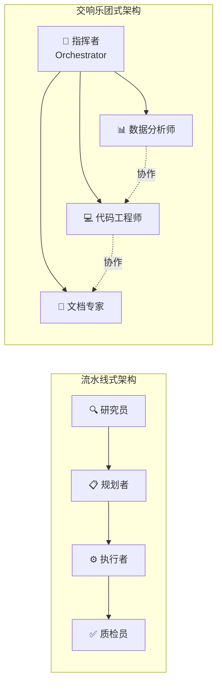
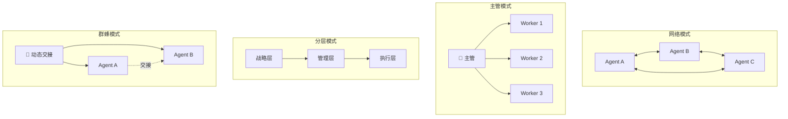
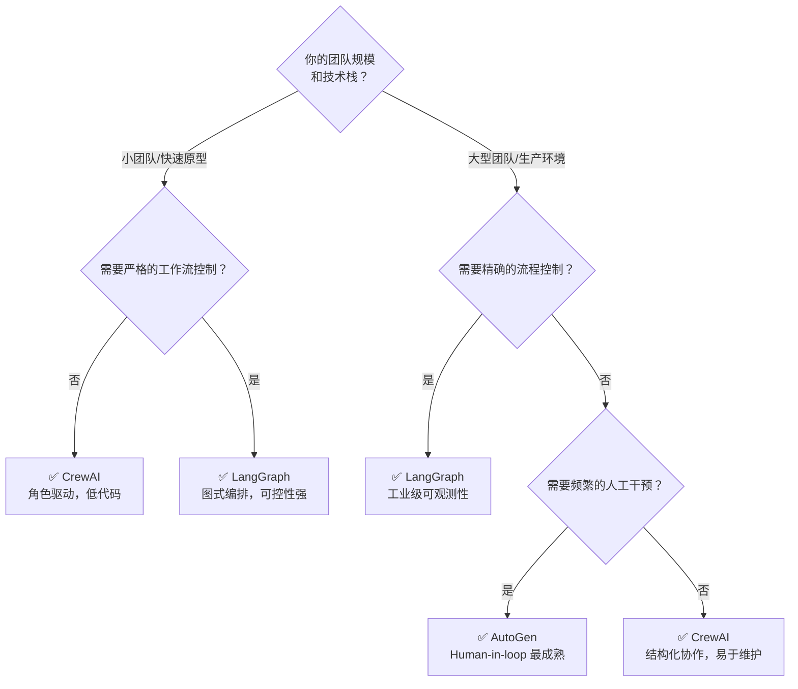

# 多智能体协作：AI时代的分布式任务处理范式

> **摘要**：单一大语言模型的能力再强，终究是“独行侠”——当任务复杂度超出单个模型的认知边界，当所需工具超出单个Agent的调用范围，当上下文长度超出模型的记忆窗口，单个Agent便会陷入瓶颈。多智能体协作（Multi-Agent Collaboration）正是为解决这一困局而生：通过将复杂任务分解给多个专业化的Agent协同完成，实现“1+1>2”的涌现智能。本文将从架构演进、分工机制、通信协议、主流框架到前沿趋势，系统梳理多智能体协作的技术全景，结合AutoGen、LangGraph、CrewAI等框架的实战对比，以及C2C、IoA协议、AgentNet等最新研究成果，为开发者提供从原理到落地的完整知识地图。

## 一、从“独行侠”到“交响乐团”：多智能体协作的崛起

### 1.1 单智能体的能力边界

在大模型应用开发的实践中，一个难以回避的问题是：无论单个Agent的能力多么强大，其“独行侠”式的作业模式在应对复杂任务时往往显得力不从心。这好比让一位程序员独立负责从需求分析、编码、测试到部署上线的全流程——即便其能力卓越，也极易因任务过载而效率低下。

具体而言，单Agent系统面临三大核心痛点：

- **工具选择困难**：为单个Agent配备大量工具（数据库操作、邮件发送、数据分析等）会使其陷入“选择恐惧症”，导致工具误用或调用效率低下。
- **上下文爆炸**：Agent的工作记忆需要承载用户历史、中间结果、工具调用记录等大量信息，容易导致信息过载和注意力分散。
- **角色迷失**：迫使一个Agent扮演数据分析师、软件工程师、产品经理等多个角色，会使其系统提示词变得冗长矛盾，影响核心决策的准确性。

OpenAI的技术路线图将大模型能力划分为五个阶段：聊天机器人→推理者→智能体→创新者→组织级AI。单智能体仅处于第三阶段，要迈向更高层级，必须依靠多智能体协作。

### 1.2 多智能体协作的核心优势

多智能体系统借鉴了现代公司的分工模式，其优势对比单智能体非常明显：

- **专业化**：每个Agent专注于特定领域，能力更强，决策更精准。
- **模块化**：Agent可以独立开发、测试、更新和维护，像乐高积木一样灵活组合。
- **可控性**：Agent之间的通信流程被明确定义，系统行为更可预测、更易管理。
- **并行化**：多个Agent可同时处理不同子任务，显著提升整体吞吐量。

从产业落地看，某零售企业通过部署5万个智能体节点，实现了全国门店售后数据的实时分析与决策支持；某物流平台构建的智能体网络，可同时处理跨境清关、路径规划、异常预警等12类复杂任务。某测试数据显示，在10万级并发场景下，智能体集群的吞吐量比单体架构提升37倍。

### 1.3 从概念验证到产业落地

多智能体系统的研究并非新事物，但LLM的爆发为这一领域注入了全新的活力。传统多Agent系统依赖预定义的规则和有限的状态机，而基于LLM的MAS（Multi-Agent System）将自然语言推理、动态规划和自适应协作融为一体，使Agent具备了前所未有的灵活性和通用性。

2025-2026年，多智能体协作已从学术概念验证快速走向产业落地。GitHub数据显示，CrewAI在2025年第三季度运行了11亿次Agent自动化任务。LangGraph、AutoGen等框架的GitHub星数持续攀升，多Agent架构正成为企业级AI应用的标准配置。

## 二、多智能体架构的演进路径

### 2.1 传统架构的局限性

早期多Agent系统采用“中心调度+工人节点”的工厂模式，其核心问题在于：

- **刚性流程**：任务必须按预设顺序传递，某环节故障将导致全链路阻塞。
- **静态路由**：依赖硬编码的规则引擎，无法适应业务规则变化。
- **资源孤岛**：每个节点需加载完整领域知识，内存占用率高达85%。

某电商平台的实践表明，这种架构在促销期间错误率会飙升400%，主要源于任务堆积导致的上下文丢失。

### 2.2 流水线式 vs 交响乐团式

现代多智能体架构借鉴了两种经典的协作模式：

**流水线式（Pipeline Pattern）** ：Agent按固定顺序接力处理任务，上一个Agent的输出成为下一个Agent的输入。典型应用如内容生产流水线：研究员Agent→策略规划Agent→执行Agent→质检Agent。这种模式结构清晰、易于调试，但缺乏灵活性，一个环节卡住则整条链受阻。

**交响乐团式（Orchestration Pattern）** ：由一个指挥者（Orchestrator）协调多个专业Agent并行或交错工作，类似于乐团指挥协调各声部。这种模式动态性强，能根据任务实时调整Agent参与度和顺序，但对编排逻辑要求高，调试复杂度较大。

### 2.3 现代三层协作体系

新一代智能体架构构建了三层协作体系：

**智能调度层**：采用发布-订阅模式实现动态任务分片，包含任务解析器（将自然语言指令转换为结构化任务图）、优先级引擎（基于QoS参数进行路由决策）和弹性队列（支持Kafka与RocketMQ双协议，单集群可承载百万级TPS）。某金融风控系统的实现显示，通过动态权重调整，高优先级任务处理时延从秒级降至毫秒级。

**智能执行层**：构建可插拔的Agent容器，支持Python/Java/Go多语言Agent的秒级热部署，通过知识图谱维护任务状态避免信息丢失，基于cgroups实现CPU/内存的精细化配额管理。测试数据显示，动态资源调度使集群整体利用率从45%提升至78%。

**智能监控层**：采用“观测-分析-决策”闭环设计，集成Prometheus与SkyWalking覆盖200+监控指标，基于LSTM模型预测资源使用趋势并提前15分钟预警，自动触发扩容/降级策略，某案例中减少60%人工干预。

### 2.4 组织架构的三个维度

从更抽象的组织学视角，多智能体工作流可以从三个维度进行分类：

- **组织结构维度**：层级式（Hierarchical）、对等式（Peer-to-Peer）、混合式（Hybrid）。
- **适应性维度**：静态工作流 vs 动态工作流。
- **生成方法维度**：预定义工作流 vs 自动生成工作流。

这三种维度的组合形成了丰富的架构设计空间，不同框架在其中的定位各有侧重。

## 三、多智能体如何分工与协同

### 3.1 角色定义与任务分解

有效的分工始于明确的角色定义。每个Agent应被赋予清晰的职责边界、专业领域和可用工具。以CrewAI为例，Agent的角色驱动设计包含：

- **角色（Role）** ：定义Agent在团队中的定位（如“研究员”、“策略师”、“执行者”）。
- **目标（Goal）** ：明确Agent需要达成的具体目标。
- **工具（Tools）** ：Agent可调用的函数、API、代码执行器等。
- **背景故事（Backstory）** ：可选的详细角色描述，增强角色一致性。

任务分解则遵循“从目标到子任务”的递归过程。例如，一个“撰写市场分析报告”的宏观目标可被分解为：数据收集→竞争分析→趋势预测→报告撰写→审核发布。每个子任务被分配给最匹配的Agent执行。

### 3.2 四种主流协作模式

基于对LangGraph、AutoGen等框架的实践总结，多智能体协作可归纳为四种核心模式：

**网络模式（Network Pattern）** ：Agent之间可以直接通信，形成网状拓扑。灵活但复杂度高，通信链路随Agent数量呈平方增长，适合Agent数量较少且交互关系固定的场景。

**主管模式（Supervisor Pattern）** ：所有Agent通过一个中心主管进行协调，结构清晰、易于控制。主管负责路由决策、冲突调解和结果汇总。这是目前生产环境中最常用的模式。

**分层模式（Hierarchical Pattern）** ：引入多层管理结构，战略层→管理层→执行层逐级分解任务。适合超大型系统，每一层都有独立的主管Agent。

**群蜂模式（Swarm Pattern）** ：Agent动态地相互交接控制权，基于各自的专业领域判断谁最适合处理当前任务。LangGraph Swarm库正是这一模式的实现，Agent可以动态handoff控制权。

### 3.3 动态Agent生成：从静态团队到自生长系统

传统多Agent系统的最大局限之一是Agent数量和类型在系统设计阶段就被固定。当任务类型超出预定义Agent的能力范围时，系统便无法应对。

针对这一问题，研究者提出了动态Agent生成方案：根据任务上下文自动创建和集成新Agent，无需人工干预。具体包括两种方法：

- **初始自动Agent生成（IAAG）** ：在系统启动时，根据任务描述自动生成最优的Agent配置。
- **动态实时Agent生成（DRTAG）** ：在系统运行过程中，根据不断变化的对话和任务上下文实时创建新的专业Agent。

实验结果表明，DRTAG方法相比静态MAS架构显著提升了系统适应性和任务性能。MAS²进一步提出了“递归自生成”范式：一个多Agent系统能够自主地为不同问题构建量身定制的多Agent系统，在7个基准测试上超越了SOTA的MAS方案。

### 3.4 去中心化协作：AgentNet的启示

传统多Agent系统依赖中心化协调，导致可扩展性瓶颈、适应性降低和单点故障风险。隐私和专有知识问题进一步阻碍了跨组织协作，导致专业知识“孤岛化”。

AgentNet提出了一种去中心化的RAG增强框架，其核心创新包括：

1. **完全去中心化协调机制**：消除了中心编排器的需求，增强了系统的鲁棒性和涌现智能。
2. **动态Agent图拓扑**：根据任务需求实时调整Agent之间的连接关系和路由策略。
3. **检索式记忆系统**：支持Agent持续进行技能优化和专业化。

实验显示，AgentNet在任务准确性上超越了单Agent和中心化多Agent基线。

## 四、多智能体间的通信机制

### 4.1 从RPC到自然语言通信

传统微服务架构中的RESTful/gRPC协议在多Agent场景中面临三大挑战：

- **语义鸿沟**：固定接口难以表达复杂业务意图。
- **版本地狱**：接口变更导致所有调用方集体受影响。
- **耦合陷阱**：服务提供方需预定义所有可能的调用场景。

某物流系统的改造数据显示，RPC接口数量年均增长230%，维护成本呈指数级上升。

自然语言通信协议则带来了范式革命：Agent之间不再通过严格的API Schema通信，而是使用自然语言交换意图、状态和结果。这种协议的弹性使其能适应从未预定义的新场景，大幅降低Agent间的耦合度。

### 4.2 主流Agent通信协议对比

2025-2026年，多种Agent通信协议相继涌现，为多智能体系统提供了标准化的连接框架：

**Model Context Protocol（MCP）** ：由Anthropic提出的开放标准，定义了Agent如何与工具和数据源交互。MCP采用客户端-服务器架构，Agent作为客户端，工具和数据源作为服务器暴露标准化的接口。

**Agent-to-Agent Protocol（A2A）** ：Google定义的服务导向协议，Agent通过发布“Agent Card”（包含名称、描述、版本、URL和技能列表）实现互操作性。通信是**无状态**的，每次交互独立。

**LLM Delegate Protocol（LDP）** ：将模型级属性（模型家族、推理画像、质量校准、成本特性）提升为协议的一等公民。LDP引入了五个关键机制：
- 丰富的委托身份卡片
- 渐进式载荷模式与自动协商和降级
- 带持久上下文的多轮委托会话
- 结构化的溯源追踪
- 协议级安全边界（信任域）

实验表明，身份感知路由在简单任务上实现了更低延迟；语义框架载荷减少了37%的token消耗且无质量损失；治理会话在10轮对话中消除了39%的token开销。

**KVComm**：区别于自然语言通信，KVComm通过选择性地共享模型的KV对来实现Agent间的高效通信。实验表明，仅需传输约30%的层KV对即可达到与“直接将输入合并到一个模型”相当的性能，为大规模高效多Agent系统开辟了新路径。

### 4.3 通信的三层语义架构

从人类通信的视角来审视Agent通信，可以将其组织为三层架构：

1. **通信层（Communication Layer）** ：确保双方能够“听到”彼此——可靠的传输、流式处理和连接管理。现有协议在此层已相当成熟。

2. **语法层（Syntactic Layer）** ：确保消息在结构上可解析——Schema定义、消息格式、生命周期管理。A2A、MCP等协议在此层提供了丰富支持。

3. **语义层（Semantic Layer）** ：确保双方真正“理解”彼此——澄清、上下文对齐、验证。令人惊讶的是，当前主流协议在此层支持最弱，语义责任往往被推给Prompt、Wrapper或应用层编排逻辑。

这种“语义短板”导致了一个关键问题：当Agent收到模糊指令时，它无法像人类那样主动追问“你指的是哪一个？”，而只能依赖预定义的消歧逻辑或直接“猜测”。

### 4.4 IoA任务协议：标准化协作的新里程碑

2026年1月，IETF发布了Internet of Agents任务协议草案，为异构Agent协作定义了标准化框架。IoA任务协议的核心能力包括：

- **动态团队组建**：根据任务需求动态选择参与协作的Agent集合。
- **自适应任务协调**：支持任务执行过程中的角色调整和流程变更。
- **结构化通信**：通过分层架构和可扩展消息格式，支持跨设备、跨框架的Agent通信。

IoA协议特别适用于智能交通、智慧医疗、大规模人机协作等跨异构网络环境的场景，可部署在固定网络、边缘-云基础设施乃至6G移动网络中。

### 4.5 通信成本建模：C2C框架

现有大多数框架将通信视为即时的、免费的，忽略了真实世界协作中通信本身是一种有成本的资源。C2C（Communication to Completion）框架首次将通信作为受约束的资源进行显式建模。

C2C引入了**对齐因子（Alignment Factor）** 概念，受共享心智模型理论启发，量化了任务理解与工作效率之间的联系。实验覆盖15个软件工程工作流、3个复杂度层级、5-17个Agent规模，结果显示：成本感知策略相比无约束交互实现了超过40%的效率提升。

实验还揭示了几个涌现的协作模式：
- Agent自然采用以管理者为中心的**轮辐式拓扑结构**
- 根据复杂度策略性地从**异步信道升级到同步信道**
- **优先处理高价值帮助请求**
- 这些模式在GPT-5.2、Claude Sonnet 4.5、Gemini 2.5 Pro等多个前沿模型上表现一致

## 五、主流框架深度对比

### 5.1 LangGraph：图式化编排的工业级选择

LangGraph作为LangChain生态的新一代Agent编排框架，其核心创新在于用**有向图模型**重构Agent工作流——将LLM调用、工具执行等模块抽象为节点，通过条件边实现动态跳转。

LangGraph支持四种多智能体架构模式：网络模式、主管模式、主管（工具调用）模式和分层模式。其子图机制解决了多图协作时的状态传递问题，使得多个Agent可以在保持各自独立状态的同时共享关键上下文。

**优点**：图式编排提供了最高的工程可控性，支持复杂分支、循环和条件逻辑。与LangChain生态无缝集成，可观测性强。

**缺点**：学习曲线较陡，对于简单任务可能引入过度抽象。部分开发者认为其抽象过于复杂，调试困难。

**适用场景**：需要精确控制执行流程、支持复杂分支逻辑的生产级多Agent系统。

### 5.2 AutoGen：对话驱动的多Agent协作框架

AutoGen由Microsoft Research孵化并开源，是一个用于构建多Agent AI应用的编程框架，支持Agent之间进行对话、规划和使用工具——自主或在人工监督下运行。

AutoGen支持的编排模式包括：
- **顺序模式**：按预定顺序处理任务，适合线性工作流。
- **并发模式**：多个Agent并行处理独立子任务。
- **群聊模式**：通过对话式界面实现动态协作。
- **交接模式**：在专业Agent之间平滑过渡控制权。

**优点**：强调Agent之间的对话式协作，支持同步和异步交互，对人工干预的支持最为完善。AutoGen在代码生成场景中表现突出，执行速度领先。

**缺点**：对于严格流程化的任务，对话模式可能引入不必要的交互开销。需要较多代码配置。

**适用场景**：研究场景、需要灵活对话协作、代码生成和调试、需要人工监督的任务。

### 5.3 CrewAI：基于角色的结构化协作框架

CrewAI是一个开源框架，用于协调基于角色的协作式AI Agent，具有任务、工具和流程。其核心理念是“像运营电影摄制组一样运营多Agent系统”。

在CrewAI中，多Agent团队被称为Crew。每个Agent有明确的角色、描述和工具，任务具有依赖关系和移交规则。其分级模式在医疗急救模拟等复杂场景中展示了强大的任务分解能力。

**优点**：基于角色的抽象非常直观，对非技术用户友好。内置的移交机制和任务编排让构建结构化工作流变得简单。生态系统发展迅速，2025年第三季度已运行11亿次自动化任务。

**缺点**：对于简单用例可能引入不必要的复杂性开销，动态环境中的调参挑战较大，托管服务的SaaS定价可能较高。

**适用场景**：具有明确多角色分工的工作流（研究→规划→执行→质检），希望用结构化方式设计多Agent系统而无需手动编排的团队。

### 5.4 框架选型决策树

**补充说明**：
- 追求极致执行速度：AutoGen任务完成速度领先。
- 已有LangChain技术栈：LangGraph无缝集成。
- 需要跨框架标准化通信：关注MCP、A2A等协议层方案。

## 六、前沿研究与发展趋势

### 6.1 多智能体反思机制

单Agent的反思（Reflexion）已被证明能显著提升推理质量。MAR（Multi-Agent Reflexion）将这一概念扩展到多Agent场景：用一组LLM Agent取代单一的自我反思模型，每个Agent作为独特的批评者。当执行者产出错误答案时，系统不依赖单一反思，而是聚合多个批评者的意见。

MIRROR则进一步提出了双层反思机制：
- **Intra-Reflection（内部反思）** ：在执行前批判性地评估预期行动。
- **Inter-Reflection（交互反思）** ：基于观察结果进一步调整执行轨迹。

实验表明，双层反思机制能显著降低工具调用中的错误率，已入选IJCAI 2025。

### 6.2 多智能体辩论

多Agent辩论（Multi-Agent Debate，MAD）通过迭代式Agent间通信来提升推理质量。多个Agent分别生成推理方案，然后相互批评和优化，最终通过共识机制达成结论。

MAD的一个关键发现是：多Agent辩论能使相对较小的LLM（7-9B参数）达到与大型模型（27B参数）相当的准确率。这意味着MAD不仅提升了质量，还提供了降本增效的新路径。

然而，MAD也面临“辩论崩塌”的风险——当Agent被错误推理引导时，最终决策可能集体偏离。研究提出了基于不确定性驱动的策略优化（通过检测自相矛盾、同伴冲突和低置信输出来动态调整辩论策略）和记忆掩码（允许Agent在每轮辩论开始时屏蔽上一轮的错误记忆）来应对这一挑战。

### 6.3 多智能体RAG

RAG从单Agent走向多Agent是2025年的显著趋势。mRAG框架将RAG流程分解为多个专业Agent：规划Agent、搜索Agent、推理Agent和协调Agent，通过奖励引导的轨迹采样来优化Agent间的协作并增强响应生成。

MAIN-RAG更进一步，引入多Agent过滤机制，由多个专业Agent对检索结果进行多轮筛选和验证，显著降低RAG中的幻觉率。SIRAG则采用过程监督的多Agent框架，通过轻量级Agent桥接检索器和生成器之间的协调鸿沟。

这些研究表明，将RAG的各个环节（查询改写、多路检索、结果筛选、答案生成、幻觉检测）分配给不同的专业Agent，能在不显著增加模型参数的情况下大幅提升RAG系统的整体质量。

### 6.4 自进化的多智能体系统

让多Agent系统能够自主改进自身配置是2026年的前沿方向。CoMAS（Co-Evolving Multi-Agent Systems）通过Agent间交互奖励实现无监督自进化，使Agent能够从彼此协作的经验中持续学习。MAS-ZERO则首次实现了推理时的自动MAS设计框架，通过元级别设计来迭代地设计、批评和优化针对每个问题实例量身定制的MAS配置，无需验证集。

Autogenesis提出了一个完整的自进化协议栈（Self Evolution Protocol Layer），指定了改进提案、评估和提交的闭环操作接口，支持可审计的溯源和回滚。

### 6.5 多智能体系统的可扩展性挑战

随着Agent数量增加，多智能体系统面临独特的可扩展性挑战。研究揭示了一个重要发现：在同质化设置中（所有Agent使用相同模型和配置），增加Agent数量表现出**强烈的边际递减效应**；而引入异质性（不同模型、提示词或工具）则能持续带来显著增益。

这意味着简单堆叠相同Agent并非扩展多智能体系统的有效策略。更有前景的扩展路径包括：

- **异构Agent组合**：混合使用不同规模、不同专长的模型。
- **分层架构**：通过管理层Agent降低执行层Agent的协调复杂度。
- **智能中间件**：Cognitive Fabric Nodes创建Agent之间的“认知织物”中间层，降低直连通信开销。
- **终身学习记忆**：在“扩展团队规模”和“扩展时间经验”两个维度上共同提升系统能力。

## 七、总结与最佳实践

### 7.1 核心要点回顾

1. **多智能体协作是解决复杂任务的必由之路**。单Agent的上下文爆炸、工具选择困难和角色迷失三大痛点，决定了超越一定复杂度后必须引入多Agent架构。

2. **四种主流架构模式各有适用场景**：网络模式适合小规模灵活协作，主管模式适合生产环境，分层模式适合超大型系统，群蜂模式适合动态任务分配。

3. **通信协议从“管道”进化为“神经系统”** 。自然语言通信突破RPC的语义限制，MCP、A2A、LDP等标准化协议正在构建Agent互联的基础设施。C2C框架提醒我们：通信不是免费的，成本感知协作带来40%以上效率提升。

4. **框架选型需匹配团队特点**：LangGraph适合需要精确流程控制的生产级系统，AutoGen适合对话驱动和代码生成场景，CrewAI适合角色清晰的结构化工作流。

5. **前沿方向值得关注**：多Agent反思、辩论、RAG和自进化正在将多智能体系统从“静态配置”推向“动态生长”。

### 7.2 实践Checklist

**架构设计阶段**：
- [ ] 分析任务复杂度，判断是否真正需要多Agent（简单任务单Agent可能更高效）。
- [ ] 根据任务特点选择架构模式（流水线 vs 交响乐团 vs 主管模式）。
- [ ] 设计Agent的角色边界，确保职责清晰、互不重叠。
- [ ] 确定通信协议（同一框架内直接调用 vs 跨框架MCP/A2A）。

**开发实施阶段**：
- [ ] 为每个Agent编写清晰的角色描述和目标定义。
- [ ] 设计状态共享机制（LangGraph子图、共享Memory或外部存储）。
- [ ] 实现可观测性：记录每个Agent的输入、输出、工具调用和执行时间。
- [ ] 设置协作护栏：最大迭代次数、超时机制、冲突解决策略。

**上线运维阶段**：
- [ ] 监控多Agent协作的效率指标（任务完成时间、Token消耗、成功率）。
- [ ] 分析瓶颈Agent——哪个Agent最慢、最容易出错。
- [ ] 定期评估是否需要增加新Agent或优化现有Agent的提示词。
- [ ] 关注成本：多Agent意味着多轮LLM调用，成本控制不可忽视。

### 7.3 未来展望

多智能体协作正从“工程师手工编排”走向“系统自主生长”。当Agent能够动态生成、自我反思、相互辩论、持续进化时，我们离真正的“组织级AI”就不远了。从IoA协议的标准化到AgentNet的去中心化，从C2C的成本建模到MAS-ZERO的零监督设计——这些前沿探索正在共同描绘一个未来图景：AI Agent不再是被动响应指令的工具，而是能够自主组建团队、动态分配任务、持续优化协作的智能体网络。

在这场变革中，理解多智能体协作的架构、通信、分工与评估机制，将是从“AI使用者”迈向“AI系统设计者”的关键能力。