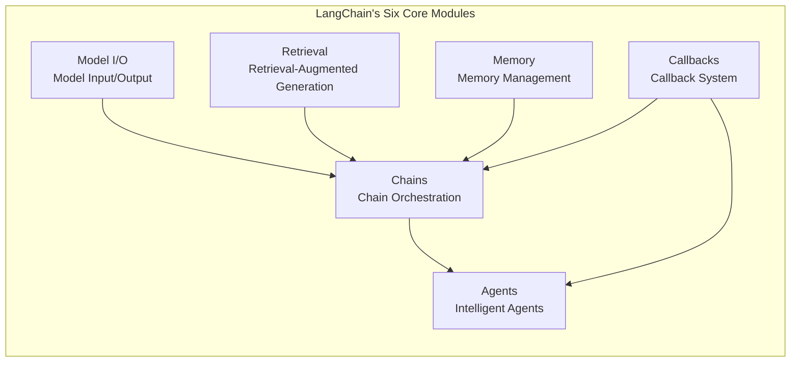

Here is the complete English translation of the provided document:

# A Comprehensive Guide to LangChain: From Core Components to Production-Grade Agent Development — The Essential Developer's Guide for 2026

> **Abstract**: LangChain has become the de facto standard framework for building large language model applications. In October 2025, both LangChain and LangGraph reached their v1.0 milestones, marking the ecosystem's official transition from a "prototype development tool" to a "production-grade infrastructure." In 2026, LangChain's monthly Python downloads surpassed the OpenAI SDK, making it the preferred platform for AI Agent development. However, after three years of rapid evolution, the LangChain ecosystem has undergone profound changes in its component architecture, programming paradigms, and deployment models—from Chains to ReAct Agents, from SequentialChain to LCEL, and from a single framework to a dual-core LangChain+LangGraph engine. This article systematically reviews LangChain's core components, programming paradigms, ecosystem tools, and selection strategies to help developers quickly orient themselves and get up to speed with the 2026 technology stack.

## I. What is LangChain: Positioning, Evolution, and Its New Look in 2026

### 1.1 One-Sentence Positioning

If a large language model is like a "brain," then LangChain is the workflow orchestration framework that equips this brain with "hands and feet," a "notepad," and a "logical process." It provides a set of standardized modular abstractions that allow developers to deeply integrate LLMs with external data sources, computational tools, and APIs to quickly build complex intelligent applications.

From a broader perspective, LangChain is a framework for developing applications driven by LLMs. It does this by providing standardized and rich module abstractions, establishing input and output specifications for LLMs, and leveraging its core concept, Chains, to flexibly link the entire application development process.

### 1.2 From 2023 to 2026: The Evolution of Three Generations of Agent Frameworks

The official LangChain blog reviewed the evolution of Agent development patterns over the past three years, summarizing it into three generational shifts:

**First Generation (2023): The Chaining Era.** The original `langchain` became popular because it provided the most convenient way to connect foundation models to data or APIs. It functioned more as an "easy-to-use button for learning prompt engineering and RAG" rather than a production-grade tool. The typical architecture was a fixed chain invocation—prompt template → model call → output processing, suitable for linear tasks with fixed steps like translation and summarization.

**Second Generation (2024-2025): The Orchestration Era.** LangGraph emerged as a lower-level, more flexible solution with a built-in runtime supporting persistence and state management, resolving `langchain`'s shortcomings in control and scalability. In October 2025, both LangChain and LangGraph released v1.0, promising stability and no breaking changes.

**Third Generation (2025-2026): The Harness Era.** DeepAgents, an "all-batteries-included" Agent suite, supports long-term task planning, cyclical tool calling, context offloading to file systems, and sub-agent orchestration. It works better now because LLM reasoning capabilities have significantly improved, allowing you to delegate more decision-making power to the LLM rather than hardcoding orchestration patterns.

In 2026, the recommended combination for the LangChain ecosystem is: **`langchain` as the high-level abstraction for rapidly building Agents, `langgraph` as the underlying runtime engine, and `deepagents` as the advanced suite for complex tasks.**

### 1.3 Why Do We Need a Framework? A Sincere Answer

In response to the skepticism of "LLMs are getting stronger, do we still need a framework?", the LangChain team gave a pragmatic answer: A good framework should encode best practices into the framework itself, reduce boilerplate code, help achieve a higher level of quality, create standards and readability for large teams, and pave the way to production.

However, frameworks are not a panacea. If your Agent only involves a linear process calling 2-3 tools, using the OpenAI Agents SDK or Vercel AI SDK directly is more lightweight. Frameworks provide the most value in the "middle ground": human-in-the-loop workflows, multi-agent coordination, unified tool schemas across large codebases, and needs for persistent execution or built-in tracing.

### 1.4 Market Position in 2026

In 2026, LangChain remains the foundation of the Agent ecosystem. It is the most mature choice, boasting a massive community and over 600 integrations. LangChain and LangGraph run dozens of validated deployment use cases in production environments for companies like Klarna, Cisco, and Vizient.

More crucial data: In June 2025, LangChain's monthly Python downloads surpassed the OpenAI SDK, marking the industry's shift from single API calls to Agent frameworks supporting multiple models, tools, and orchestrations. The State of AI Agents report published by LangChain shows that 51% of respondents are already using Agents in production, and 78% plan to deploy them soon.

---

## II. A Panoramic View of LangChain's Core Components

LangChain abstracts the capabilities of LLMs in various scenarios at a high level through modularity. Its core modules can be categorized into six major types:



### 2.1 Model I/O: Unified Model Interface

The Model I/O module is responsible for standardizing interactions with various LLMs and includes three sub-modules:

* **Prompt Templates**: Manages the templated generation of prompts, supporting variable injection, few-shot examples, and message role orchestration. PromptTemplate enables developers to use multiple components to construct input prompts for models.
* **Model Wrappers**: Unifies integrations with APIs from different vendors like OpenAI, Anthropic, Qwen, and Ernie Bot, shielding underlying differences.
* **Output Parsers**: Formats the raw text output of models into structured data (JSON, CSV, Pydantic models), supporting automatic correction and retries.

### 2.2 Retrieval: Retrieval-Augmented Generation Module

The Retrieval module is responsible for retrieving relevant information from external data sources and passing it to the LLM during the generation step. It includes document loading, splitting, and embedding.

Core sub-modules include:

* **Document Loaders**: Supports loading 80+ data sources, including PDFs, Word documents, Markdown, webpages, and databases.
* **Text Splitters**: Splits long documents into chunks suitable for retrieval. `RecursiveCharacterTextSplitter` is currently the most commonly used solution, recursively splitting by the priority of paragraphs → sentences → words.
* **Embeddings**: Converts text into vector representations, supporting mainstream embedding models like OpenAI, BGE, and Cohere.
* **Vector Stores**: Vector database integrations (FAISS, Chroma, Pinecone, Milvus, Weaviate, etc.), supporting semantic similarity search.
* **Retrievers**: Retriever abstractions, supporting advanced strategies like vector search, BM25 keyword search, hybrid search, and multi-query search.

### 2.3 Chains: Chain Orchestration (including LCEL)

Chains are the most important modules in the LangChain framework, linking multiple modules to build applications collaboratively. They serve as high-level abstractions for the actual operation of many features.

Traditional Chains include:
* **LLMChain**: The simplest single-step chain—prompt + model + optional output parser.
* **SequentialChain**: Connects multiple chains sequentially, where the output of the previous step serves as the input for the next.
* **RetrievalQA**: A dedicated chain for RAG, encapsulating the Q&A process of the retriever and LLM.

However, the recommended practice in 2026 is to use **LCEL (LangChain Expression Language)** to build chains. LCEL is a revolutionary declarative language that fundamentally changes how complex AI applications are built by introducing the pipe operator `|` and the standardized `Runnable` interface.

**Core Advantages of LCEL**:

| Feature | Traditional SequentialChain | LCEL |
|---------|-----------------------------|------|
| Syntax | Verbose, requires manual `output_key` specification | Concise pipe syntax `chain = prompt \| llm \| parser` |
| Streaming Support | Requires extra configuration | Native support for sync/async streaming |
| Batch Processing | Not supported | Native support for parallel batch processing |
| Intermediate Result Access | Difficult | Easy to insert debugging nodes |
| Composability | Limited | Can be combined freely like building blocks |

```python
# LCEL Chain Construction Example
from langchain_openai import ChatOpenAI
from langchain_core.prompts import ChatPromptTemplate
from langchain_core.output_parsers import StrOutputParser

llm = ChatOpenAI(model="gpt-4o-mini")
prompt = ChatPromptTemplate.from_template("Please answer in English: {question}")

# LCEL Pipe Syntax
chain = prompt | llm | StrOutputParser()

# Execute in one line
response = chain.invoke({"question": "What is LangChain?"})
```

LCEL was designed from the ground up to support moving prototypes directly into production environments without code changes, suitable for everything from simple "prompt + model" chains to complex chains with hundreds of steps.

### 2.4 Memory: Memory Management

The Memory module constructs historical information in various ways, maintaining information about entities and their relationships. LangChain provides a rich set of Memory types:

| Memory Type | Applicable Scenario | Characteristics |
|-------------|---------------------|-----------------|
| ConversationBufferMemory | Short conversations | Fully retains all history |
| ConversationBufferWindowMemory | Limited-length conversations | Sliding window, retains the most recent K turns |
| ConversationSummaryMemory | Long conversations | LLM automatically generates summaries to compress history |
| ConversationSummaryBufferMemory | Mixed scenarios | Retains recent K turns + summaries |
| ConversationKGMemory | Knowledge-intensive conversations | Distills conversations into a knowledge graph |
| VectorStoreRetrieverMemory | Cross-session persistent memory | Vector database semantic retrieval of history |

In 2026, LangChain revealed a more advanced memory architecture in LangSmith Agent Builder: Agent memory is represented as a collection of files (a virtual file system), physically stored in Postgres, supporting user-level and organizational-level memory isolation.

### 2.5 Agents: Intelligent Agents

Agents are currently the hottest practical development area. Agents in LangChain interact with user inputs and process them using different models. The Agent decides what actions to take and in what order to execute them.

LangChain 1.0 cemented the **ReAct loop** as the core of its Agent architecture, making it the default structure for building reliable, interpretable, and production-ready Agents. The ReAct loop pattern is: Reason → Tool Call → Observe → Decide → Loop or Output.

**The 2026 Agent Development Paradigm**:

`create_agent` is the primary function for building Agents in LangChain, located in the `langchain.agents` module.

```python
from langchain.agents import create_agent
from langchain_openai import ChatOpenAI

llm = ChatOpenAI(model="gpt-4o")
agent = create_agent(
    llm=llm,
    tools=[...],                    # Tool list
    system_prompt="You are a helpful assistant",
    middleware=[...],               # Middleware (summarization, PII detection, human-in-the-loop)
    checkpoint=True                 # Enable state persistence
)

result = agent.invoke({"messages": [{"role": "user", "content": "..."}]})
```

### 2.6 Callbacks: Callback System

Callbacks allow you to hook into various stages of your LLM application for logging, monitoring, streaming, and other tasks. It is deeply integrated with LangSmith to provide full-chain observability.

---

## III. LangChain vs. LangGraph: How to Understand this "Golden Duo"?

### 3.1 Accurate Understanding of Their Relationship

Many developers are confused about the relationship between LangChain and LangGraph. Strictly speaking, LangGraph is the **production-grade runtime engine** of the LangChain ecosystem. They are different layers of the same platform maintained by the same team:

* **LangChain**: The base library, providing integrations, prompt templates, and basic chains.
* **LangGraph**: The advanced orchestration layer built on top of LangChain.

You can think of LangGraph as LangChain 2.0—the production-ready evolution. LangChain provides the "bricks" (basic components), while LangGraph provides the blueprints and scaffolding to design and build complex "buildings" (dynamic workflows).

### 3.2 Core Abstractions of LangGraph

LangGraph models workflows as directed graphs, introducing three core concepts:

* **State**: A shared data container running throughout the workflow, persisted to checkpoints.
* **Node**: The unit that executes specific tasks (e.g., calling an LLM, running a tool).
* **Edge**: Connects nodes, controls the flow of execution, and supports conditional branching and loops.

```python
from langgraph.graph import StateGraph, MessagesState, START, END

def llm_node(state: MessagesState):
    response = llm.invoke(state["messages"])
    return {"messages": state["messages"] + [response]}

graph = StateGraph(MessagesState)
graph.add_node("llm", llm_node)
graph.add_edge(START, "llm")
graph.add_edge("llm", END)
app = graph.compile()
```

LangGraph supports four multi-agent architecture patterns:
* **Network Pattern**: Agents communicate directly with each other.
* **Supervisor Pattern**: A central supervisor coordinates Worker Agents.
* **Hierarchical Pattern**: Strategic layer → Management layer → Execution layer.
* **Swarm Pattern** (LangGraph Swarm): Agents dynamically hand over control.

### 3.3 When to Use LangChain vs. When to Use LangGraph?

| Scenario | Recommended Solution |
|----------|----------------------|
| Simple RAG, translation, summarization | LangChain chain invocations are sufficient |
| Requires loops, conditional branching, human-in-the-loop approval | LangGraph |
| Multi-Agent Collaboration | LangGraph |
| Requires state persistence and recovery | LangGraph |
| Rapid prototype validation | LangChain's `create_agent` |

---

## IV. Deep Dive into LCEL: The New Paradigm of Declarative Chain Programming

### 4.1 The Runnable Protocol

The foundation of LCEL is the `Runnable` protocol—any object implementing methods like `invoke`, `stream`, or `batch` can participate in an LCEL pipeline. Core Runnable types include:

* **RunnablePassthrough**: Passes input through unchanged; can be used with `RunnableParallel` for branched processing.
* **RunnableLambda**: Wraps regular Python functions into Runnables.
* **RunnableParallel**: Executes multiple branches in parallel, merging the results into a dictionary.
* **RunnableBranch**: Selects different execution branches based on conditions.

### 4.2 Automatic Capabilities of LCEL

When you build chains using LCEL syntax, you automatically gain the following production-grade capabilities:

* **Streaming**: The `.stream()` method automatically outputs token by token.
* **Batching**: The `.batch()` method processes multiple inputs in parallel.
* **Async Support**: `.ainvoke()`, `.astream()`, and `.abatch()` methods.
* **Fallbacks**: `.with_fallbacks()` specifies alternative solutions.
* **Intermediate Result Access**: You can insert debugging nodes to view the output at any step.

### 4.3 Practical Patterns

```python
from langchain_core.runnables import RunnablePassthrough, RunnableParallel

# Pattern 1: Branch Processing
chain = RunnableParallel(
    summary=prompt1 | llm | parser,
    keywords=prompt2 | llm | parser
)

# Pattern 2: Conditional Branching
from langchain_core.runnables import RunnableBranch

branch = RunnableBranch(
    (lambda x: "complex" in x["query"], complex_chain),
    (lambda x: "simple" in x["query"], simple_chain),
    default_chain
)

# Pattern 3: Data Augmentation
chain = {
    "context": retriever,
    "question": RunnablePassthrough()
} | prompt | llm | parser
```

---

## V. LangSmith: Agent Observability and Deployment Platform

### 5.1 What is LangSmith?

LangSmith is the **full-chain observability platform** for the LangChain ecosystem. It helps you understand and improve AI Agent applications, functioning like a dashboard that shows what's happening inside the application, allowing you to:

* **Debug**: Quickly locate root causes when issues arise.
* **Test**: Evaluate the quality of prompts and logic.
* **Monitor**: Monitor the running status of your application in real-time.
* **Evaluate**: Quantify answer quality.
* **Trace**: Track usage, speed, and costs.

### 5.2 Key Updates in 2026

* **LangSmith Fleet (formerly Agent Builder)**: The February 2026 update introduced file upload capabilities, a centralized tool registry, and the ability to convert any conversation into a reusable Agent.
* **LangSmith Sandboxes**: Provides isolated, temporary code execution environments for Agents, supporting fine-grained access and resource controls.
* **Polly AI Assistant**: Fully available in LangSmith, acting as a co-pilot to perform operations like an engineer.
* **ABAC and Audit Logs**: Enterprise-grade access control and operation tracking.

### 5.3 Deployment CLI

The LangGraph Deploy CLI allows you to deploy Agents to a LangSmith Deployment in one step right from the terminal.

---

## VI. LangChain Ecosystem Overview and Comparative Selection

### 6.1 Horizontal Comparison of Mainstream Frameworks

In the 2026 AI Agent framework ecosystem, major competitors include LangChain/LangGraph, CrewAI, AutoGen, LlamaIndex, PydanticAI, etc.

| Framework | Core Positioning | Strengths | Weaknesses |
|-----------|------------------|-----------|------------|
| **LangChain** | All-purpose application development framework | Most mature ecosystem, 600+ integrations, largest community | Steep learning curve, multiple layers of abstraction |
| **LangGraph** | Stateful Agent workflow engine | Graph-based orchestration, supports loops/branches/human-in-the-loop | Requires understanding graph concepts |
| **CrewAI** | Role-based multi-Agent orchestration | Highly intuitive, fastest for prototyping (<3 hours), least code | Limited depth, no native RBAC |
| **AutoGen** | Conversational multi-Agent systems | Excellent in multi-Agent collaboration and research scenarios | High cost (24,200 tokens/query), reliability needs validation |
| **LlamaIndex** | Data-intensive RAG | Best RAG retrieval quality, 300+ data connectors | Orchestration capabilities fall short of LangGraph |
| **PydanticAI** | Type-safe Agents | Type-safe, production-grade, standard Python experience | Smaller integration ecosystem |

### 6.2 Selection Decision Tree

```mermaid
flowchart TD
    Start{"What is your core need?"}
    
    Start -->|Document Retrieval and Q&A| RAG["✅ LlamaIndex<br>Best Retrieval Quality"]
    Start -->|Simple RAG / Prototype Validation| LC["✅ LangChain<br>Quick Startup, Rich Ecosystem"]
    Start -->|Complex Agent Workflows<br>(Branches/Loops/Human-in-the-loop)| LG["✅ LangGraph<br>Graph Orchestration, Production-Grade"]
    Start -->|Multi-Agent Role Delegation<br>(Researcher+Writer+Reviewer)| Crew["✅ CrewAI<br>Role-Driven, Minimal Code"]
    Start -->|Conversational Multi-Agent Research| AG["✅ AutoGen<br>Agent Conversational Collaboration"]
    Start -->|Strict Type Safety<br>Structured Output| Pyd["✅ PydanticAI<br>Type-Safe, Production-Grade"]
```

The LangChain framework is positioned as an all-purpose application development framework; its advantages lie in modularization, comprehensive features, and the most mature ecosystem (MIT license). LangGraph focuses on multi-Agent orchestration and stateful workflows, evolving from LangChain as a specialized framework for complex state management.

**Recommendations**:
* If your team already uses the LangChain tech stack, use LangGraph directly as your production-grade runtime.
* If you are starting from scratch and your task type is primarily document Q&A, LlamaIndex is more focused and efficient.
* If you need to quickly build a multi-role Agent system, CrewAI has the gentlest learning curve.

---

## VII. Practical Guide: Building a Complete LangChain Agent from Scratch

### 7.1 Environment Setup

```python
# Install core libraries
# pip install langchain langchain-openai langgraph

import os
from langchain.agents import create_agent
from langchain_openai import ChatOpenAI
from langchain_community.tools.tavily_search import TavilySearchResults
from langchain_core.messages import HumanMessage

# Set API Keys
os.environ["OPENAI_API_KEY"] = "your-key"
os.environ["TAVILY_API_KEY"] = "your-key"
```

### 7.2 Defining Tools

```python
# Web Search Tool
search_tool = TavilySearchResults(max_results=3)

# Custom Calculator Tool
from langchain_core.tools import tool

@tool
def calculator(expression: str) -> str:
    """Calculates a mathematical expression; input must be a valid Python math expression."""
    try:
        result = eval(expression, {"__builtins__": {}}, {})
        return f"Calculation Result: {result}"
    except Exception as e:
        return f"Calculation Error: {e}"

tools = [search_tool, calculator]
```

### 7.3 Creating the Agent

```python
llm = ChatOpenAI(model="gpt-4o-mini", temperature=0)

agent = create_agent(
    llm=llm,
    tools=tools,
    system_prompt="""You are a helpful assistant. When the user asks a question that requires real-time information, use the search tool.
    When it involves math calculations, use the calculator tool. Please answer in English.""",
)

# Execute
result = agent.invoke({
    "messages": [HumanMessage(content="Who is the winner of the 2025 Nobel Prize in Physics?")]
})

print(result["messages"][-1].content)
```

### 7.4 Advanced: Building Stateful Workflows with LangGraph

```python
from langgraph.graph import StateGraph, MessagesState, START, END
from langgraph.prebuilt import ToolNode

# Define Node
def agent_node(state: MessagesState):
    response = llm_with_tools.invoke(state["messages"])
    return {"messages": [response]}

# Build Graph
graph = StateGraph(MessagesState)
graph.add_node("agent", agent_node)
graph.add_node("tools", ToolNode(tools))

graph.add_edge(START, "agent")
graph.add_conditional_edges(
    "agent",
    lambda state: "tools" if state["messages"][-1].tool_calls else END
)
graph.add_edge("tools", "agent")

app = graph.compile()

# Execute
result = app.invoke({"messages": [HumanMessage(content="Search for new features in LangChain 1.0")]})
```

---

## VIII. Conclusion and Best Practices

### 8.1 Core Takeaways Review

1.  **LangChain is the "Operating System" for LLM Application Development**: It provides six core modules—Model I/O, Retrieval, Chains, Memory, Agents, and Callbacks—allowing developers to build complex AI applications like assembling building blocks.
2.  **LangChain + LangGraph = Dual-Core Engine**: LangChain offers foundational components and rapid prototyping capabilities, while LangGraph provides production-grade graph orchestration and state management. In 2026, `create_agent` + LangGraph is the recommended combination.
3.  **LCEL is a Must-Learn New Syntax**: A declarative, pipelined approach to chain construction that automatically grants production capabilities like streaming, batching, and async support.
4.  **Framework Selection Must Be Scenario-Driven**: Use LangChain's basic chains for simple linear tasks; LangGraph for complex branching/loops; LlamaIndex for pure document Q&A; and CrewAI for multi-role delegation.
5.  **LangSmith Patches the Observability Shortfall**: From debugging and evaluation to deployment, LangSmith provides a complete enterprise-grade toolchain.

### 8.2 Practice Checklist

* Evaluate whether a framework is needed based on task complexity (SDKs might be lighter for simple tasks).
* Prioritize LCEL syntax for new projects; avoid the deprecated `SequentialChain`.
* Prioritize `create_agent` for Agent development rather than manual assembly.
* Integrate LangSmith in production environments for tracing and monitoring.
* Use LangGraph's state persistence features for long-running tasks.
* Regularly follow the official LangChain blog and newsletter for version updates.

### 8.3 Learning Path Recommendations

**Beginner Level (1-2 Weeks)**:
* Set up the development environment and run your first LangChain program.
* Understand Model I/O, Prompt templates, and basic LCEL syntax.
* Implement a simple RAG Q&A system.

**Intermediate Level (2-4 Weeks)**:
* Deep dive into advanced LCEL patterns (branching, parallelism, fallbacks).
* Master Agent tool definitions and the ReAct loop.
* Use LangSmith for debugging and evaluation.

**Production Level (1-2 Months)**:
* Learn LangGraph's graph orchestration and state management.
* Build multi-Agent collaboration systems.
* Integrate LangSmith Deployment for pushing to production.

---

*LangChain has traversed a three-year evolution from a "prototype development tool" to a "production-grade infrastructure." The LangChain ecosystem in 2026 possesses both LangChain's rapid development capabilities and LangGraph's powerful orchestration engine, alongside LangSmith's full-chain observability—a trinity that forms the most complete technology stack for LLM application development. We hope this article helps you find a clear bearing within LangChain's vast ecosystem so you can quickly build your own AI Agent applications.*