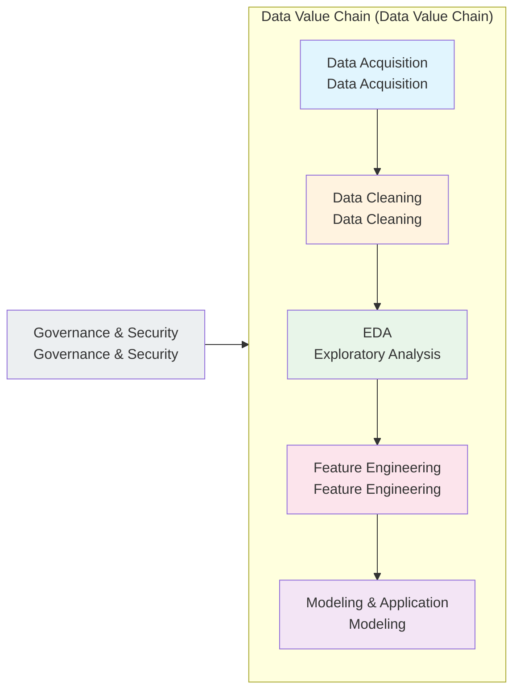
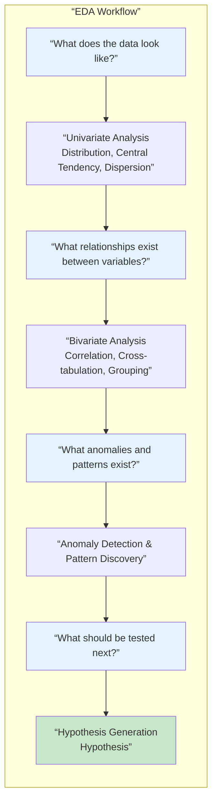
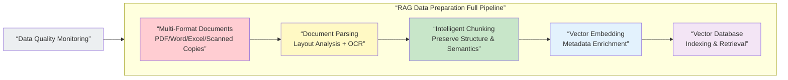
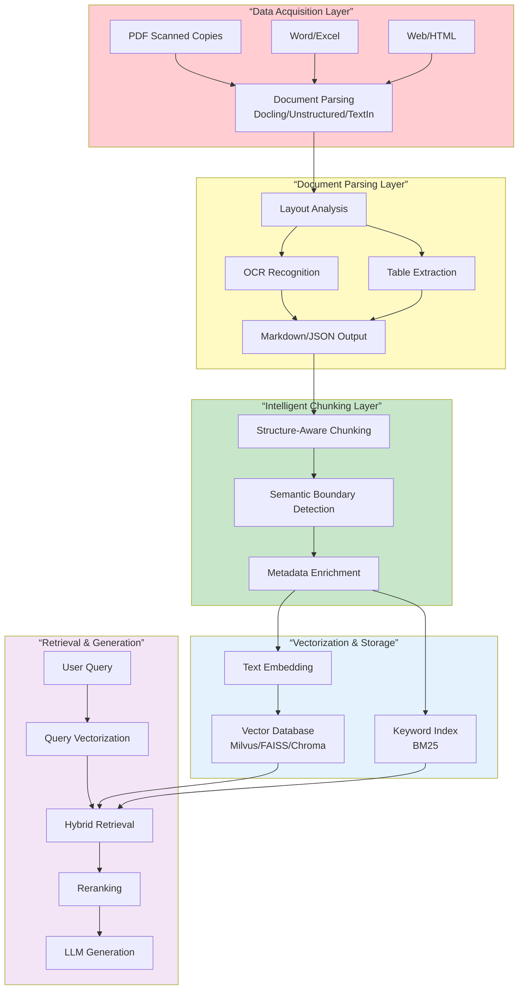
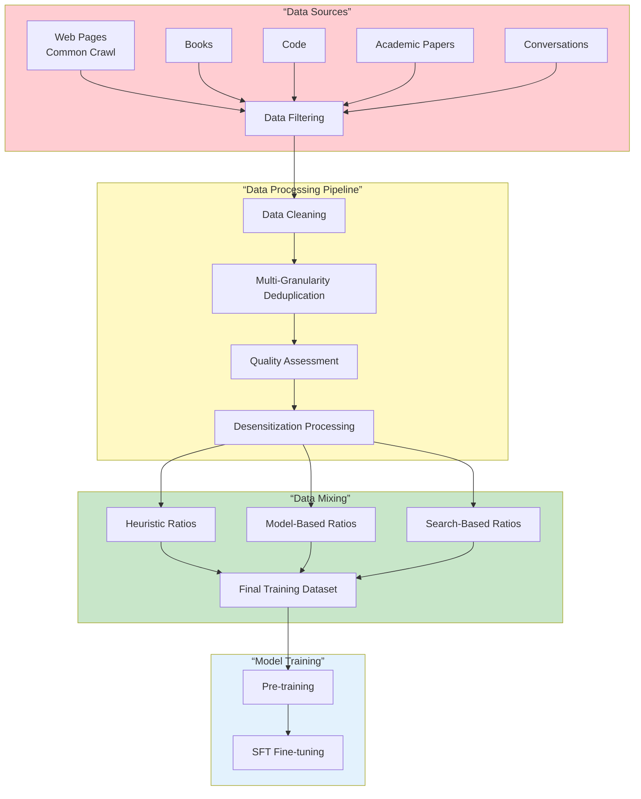

```markdown
# Data Alchemy: A Comprehensive Practical Guide from Raw Data to Intelligent Applications

## Core Technologies and Cutting-Edge Practices in Data Processing, Data Mining, and EDA

> Data is the oil of the new era, but crude oil cannot directly power engines. Transforming raw data into intelligent applications requires a complete "alchemy" process—data preprocessing, exploratory data analysis, feature engineering, model building, and application deployment. This article systematically organizes every key link in this data value chain, with a special focus on the new challenges faced by data engineering in the LLM and RAG era: parsing massive unstructured documents, preparing data for vector databases, cleaning and quality control of large-scale pre-training data, data desensitization, and privacy protection. The entire text adopts an engineering perspective and best practices, serving as an essential reference guide for every data engineer, AI developer, and architect.

### Recommended Reading and Knowledge Structure

This article is quite lengthy; reading it on-demand is recommended. All readers should first read Chapters 1, 2, and 3 to build foundational understanding, then choose different paths based on their professional direction:
- **Data Engineers**: Focus on Chapters 4, 5, and 8 (RAG data preparation, LLM training data construction, data security and governance)
- **Data Analysts/Scientists**: Focus on Chapters 1, 2, and 6 (data preprocessing, EDA, data mining overview)
- **AI Application Developers**: Focus on Chapters 4 and 7 (RAG document processing, MCP protocol and toolchain)
- **Technical Managers**: Focus on the Introduction, Chapter 2 (data value chain), Chapter 8 (data security and governance), and Chapter 9 (summary and trend outlook)

Additionally, it is recommended to read this article in conjunction with the author's other piece *Foundational Knowledge and Must-Knows in Data Analysis and Statistics*. The latter systematically covers the theoretical foundations of descriptive and inferential statistics, the philosophical core of probability theory and Bayesian thinking, and an in-depth review of visualization. The two articles complement each other by covering the "statistical theory" and "engineering practice" dimensions respectively.

## Introduction: Why Data Preparation Is More Important Than Models

In 2026, as AI and big data surge forward, a seemingly counterintuitive truth is being confirmed by more and more practitioners: **Models matter, but data quality matters more**.

From machine learning to deep learning, from traditional BI to large language models, data preparation has always been the most time-consuming, tedious, and decisive part of data science projects. Data preparation aims to denoise raw datasets, discover relationships across datasets, and extract valuable insights, which is crucial for a wide range of data-driven applications. Statistics show that over 80% of the time in data science projects is spent on data cleaning and preparation. In the LLM era, this proportion is even higher—because LLMs are far more "hungry" and "sensitive" to data than traditional models.

Bad data produces bad models, dirty data leads to model hallucinations, and low-quality datasets can even trigger ethical risks and security vulnerabilities. However, unlike the open transparency of model architectures, the engineering details of data processing are often the "trade secrets" of major companies and research institutions—they directly determine the ceiling of model performance but are rarely systematically discussed and summarized.

This is exactly the mission of this article: to reveal the full-chain data engineering practices from raw data to intelligent applications, so that you not only know "to use data well" but also know "how to use data well."

This article organizes content according to the five key stages of the data value chain:

1. **Data Acquisition and Integration**: Collecting raw data from multi-source heterogeneous systems
2. **Data Cleaning and Preprocessing**: Correcting errors, filling missing values, unifying formats
3. **Exploratory Data Analysis**: Understanding data structure through statistics and visualization
4. **Feature Engineering and Transformation**: Constructing high-quality features usable by models
5. **Data Quality and Governance**: Establishing a continuous data assurance system



At every link in the data value chain, we encounter data quality issues—from missing and outlier values in the data collection stage, to format inconsistencies and entity matching difficulties in the data integration stage, to subjective bias and annotation errors in the data labeling stage. Understanding the causes and solutions to these problems is the first step in building high-quality data products.

Let's start with the most fundamental link: data preprocessing.

## Part One: Data Preprocessing—From "Dirty Data" to "Clean Data"

### Chapter 1: Overview of Data Preprocessing: Why This Step Cannot Be Skipped

#### 1.1 The Position of Data Preprocessing in the Full Data Science Workflow

In any data science project, data preprocessing is the key bridge connecting "raw data" and "analyzable data." According to a comprehensive review oriented toward data mining, data preprocessing and feature engineering have a significant impact on the accuracy, reproducibility, and interpretability of analysis results.

Data transformations in modern data analysis are systematically categorized into the following key types: data cleaning and preprocessing, normalization and standardization, feature engineering, categorical data encoding, data augmentation, discretization, and data aggregation. These transformation techniques together constitute the technical toolbox of data preprocessing.

To understand the value of data preprocessing, we must first recognize that the quality of analysis depends on the quality of the data. Only data that has undergone sufficient transformation can provide a reliable foundation for descriptive analysis and predictive modeling.

#### 1.2 Why Real-World Data Is Always "Dirty"

Real-world data is "dirty" due to multiple factors:

**Inherent Defects in Data Collection**: Sensor errors, manual entry mistakes, and system failures all produce noisy data. When handling large-scale, heterogeneous datasets, the complexity of data integration, security issues, and resource constraints further exacerbate data quality problems.

**Diversity of Data Sources**: Enterprise data typically comes from multiple heterogeneous systems—CRM, ERP, log systems, third-party APIs—each with its own data formats, encoding standards, and business logic.

**Systemic Challenges to Data Quality**: The main quality challenges in large-scale data include: noisy data (containing errors, duplicates, meaningless, or harmful content), distributional bias (over-/under-representation of specific groups, cultures, or viewpoints), timeliness issues (outdated information may lead to stale model knowledge), and format inconsistencies (differences in encoding and formats across sources).

**Human Factors**: Subjective bias in data annotation, differences in understanding annotation standards, and annotator fatigue and negligence all introduce additional "dirty data."

#### 1.3 The Cost and Value of Data Preprocessing

Data preprocessing is one of the most costly stages in data science projects, but it is also the one that cannot be skipped. In one large-scale study, three major categories of preprocessing techniques were systematically identified: data transformation (used in 60% of studies), data normalization and standardization (40%), and data cleaning (40%). These numbers show that preprocessing is not a single operation but a systematic engineering effort involving multiple techniques.

From an ROI perspective, the costs of data preprocessing mainly come from labor (time of data engineers and analysts), computational resources (compute consumption for large-scale data processing), and storage costs (saving raw and cleaned data). However, the price of skipping or simplifying data preprocessing is often much higher—declining model accuracy, unreliable inference results, and erroneous business decisions due to data quality issues.

### Chapter 2: Data Cleaning: The Art and Science of Fixing "Bad Data"

Data cleaning is the most basic and core part of data preprocessing. It covers a series of operations from data compilation, variable naming and label design, to data inspection and variable recoding and transformation. This section systematically organizes the complete methodology of data cleaning from five core dimensions.

#### 2.1 Missing Value Handling: Deletion, Imputation, or Model Prediction?

Missing values are one of the most common problems in data cleaning. Handling methods can be divided into three major categories:

**Deletion Methods**: The simplest and most direct approach, including deleting records containing missing values (row deletion) and deleting variables with excessively high missing rates (column deletion). The advantage of deletion is simplicity and no introduction of human bias, but the cost is information loss—when the missing proportion is high, deletion may significantly reduce the representativeness of the sample. In practice, a threshold (e.g., missing rate >50%) is usually set to decide whether to delete a variable.

**Imputation Methods**: Replace missing values with some reasonable value. Common imputation strategies include:
- Mean/Median/Mode Imputation: For numerical variables, use mean or median; for categorical variables, use mode. This is the most commonly used baseline method.
- Forward/Backward Fill: For time series data, use values from adjacent time points.
- Group-wise Imputation: Calculate imputation values separately for each group based on a grouping variable to preserve intra-group differences.
- K-Nearest Neighbors Imputation: Use feature values from similar samples to predict missing values.

**Model Prediction Methods**: Treat missing values as a prediction target and use other features to build a model to predict them. Common methods include multiple imputation and machine learning-based imputation (e.g., random forest imputation).

#### 2.2 Outlier Detection and Handling

Outliers are data points that significantly deviate from the overall data distribution. They may be products of data collection errors or may represent real extreme events. Handling outliers requires a combination of business judgment and statistical methods.

**Statistical Detection Methods**:
- Z-Score Method: Calculate the standard deviation distance of each data point from the mean. When |Z| > 3, it is usually considered an outlier. This method assumes the data approximately follows a normal distribution.
- IQR Method (Interquartile Range): Calculate Q1 - 1.5×IQR and Q3 + 1.5×IQR as boundaries; points outside the boundaries are considered outliers. This method does not rely on normality assumptions and is more robust.
- DBSCAN Clustering: Density-based clustering algorithm that identifies points in low-density regions as outliers.

**Handling Strategies**:
- Deletion: When outliers are confirmed to be data errors
- Correction: When the correct value can be inferred
- Retention: When outliers represent real extreme events (e.g., fraudulent transactions in financial risk control)
- Transformation: Use log transformation, etc., to mitigate the impact of outliers

#### 2.3 Duplicate Data Handling

Duplicate data may come from multiple collections, system errors, or data merging. Key steps for handling duplicates include:

**Exact Duplicate Detection**: Use hashing algorithms (e.g., MD5, SHA-256) to quickly identify records with identical content. Hashing algorithms map data of arbitrary length to a fixed-length hash value; identical content produces the same hash, making it very suitable for large-scale deduplication.

**Approximate Duplicate Detection**: For records that are similar but not identical, more complex methods are needed:
- Similarity Calculation: Use cosine similarity, Jaccard similarity, etc., to measure text similarity
- SimHash and MinHash: Locality-sensitive hashing algorithms for large-scale approximate deduplication. SimHash computes text fingerprints for fast approximate matching; MinHash estimates Jaccard similarity of sets through the minimum values of multiple hash functions. In practice, fusing multi-granularity deduplication strategies can increase duplicate content recognition rates to 99.7%.

**Handling Strategies**: For exact duplicates, usually retain only one record; for approximate duplicates, merge or retain multiple records based on business context.

#### 2.4 Inconsistent Data Handling

Data inconsistencies include different representations of the same entity (e.g., "China" vs. "People's Republic of China"), inconsistent units (e.g., "kg" vs. "g"), and data violating business rules (e.g., end date earlier than start date).

**Handling Methods**:
- Establish Data Standard Dictionaries: Standardize entity names and codes
- Regular Expression Matching: Used to identify and standardize formats for dates, phone numbers, emails, etc.
- Entity Matching: Use fuzzy matching algorithms to identify different records pointing to the same entity
- Business Rule Validation: Define data constraint conditions and automatically detect records violating rules

#### 2.5 LLM-Enhanced Data Cleaning: A Paradigm Shift

The most noteworthy trend in 2025-2026 is the introduction of LLMs into data cleaning workflows. Traditional data preparation methods rely on rule-based and model-specific processes, while LLM-enhanced methods are rapidly becoming a transformative, potentially dominant paradigm.

According to a systematic review covering hundreds of papers, LLM applications in data preparation are divided into three major task categories: data cleaning (e.g., standardization, error handling, missing value imputation), data integration (e.g., entity matching, schema matching), and data enrichment (e.g., data annotation, profiling).

The advantage of LLMs lies in their semantic understanding capability: they can understand the "meaning" of data rather than just recognizing "patterns." For example, in data standardization tasks, LLMs can recognize "NYC," "New York," and "纽约" as different representations of the same entity, which traditional rule-based methods struggle with. LLMs can also perform data annotation and entity matching based on contextual understanding.

However, LLM methods also have limitations: high scaling costs (each API call incurs costs or compute overhead), persistent hallucination issues even in advanced agents, and mismatch between advanced methods and weak evaluations. These challenges mean LLMs are currently more suitable as auxiliary tools for data cleaning rather than complete replacements for traditional methods.

```mermaid
flowchart TD
    subgraph RawData[“Raw Data (Raw Data)”]
        R1[Missing Values] --> R2[Outliers] --> R3[Duplicates] --> R4[Inconsistencies]
    end
    
    subgraph Traditional[“Traditional Cleaning Methods”]
        T1[Mean/Median Imputation] --> T5[Statistical Detection] --> T6[Hash Deduplication] --> T7[Regex Standardization]
    end
    
    subgraph LLMEnhanced[“LLM-Enhanced Cleaning”]
        L1[Semantic Understanding Imputation] --> L2[Contextual Outlier Detection] --> L3[Semantic Deduplication] --> L4[Intelligent Standardization]
    end
    
    RawData --> Traditional
    RawData --> LLMEnhanced
    
    Traditional --> CleanData[“Clean Data (Clean Data)”]
    LLMEnhanced --> CleanData
    
    style RawData fill:#ffcdd2
    style CleanData fill:#c8e6c9
    style Traditional fill:#e3f2fd
    style LLMEnhanced fill:#fff9c4
```

### Chapter 3: Data Transformation and Feature Engineering

Data cleaning solves the problem of "whether the data is correct," while data transformation and feature engineering solve the problem of "whether the data is usable." This chapter systematically organizes the technical system from basic transformations to advanced feature engineering.

#### 3.1 Data Standardization and Normalization

Standardization and normalization are the most basic operations in numerical data preprocessing, aimed at eliminating the impact of different scales on model training.

**Normalization**: Map data to the [0,1] interval. Suitable for scenarios where data distribution is unknown or different scales need to be placed on the same scale. Common methods include:
- Min-Max Normalization: (x - min)/(max - min)
- Suitable for neural networks, K-nearest neighbors, and other distance-sensitive algorithms

**Standardization**: Convert data to a distribution with mean 0 and standard deviation 1. Suitable for scenarios where data approximately follows a normal distribution. Common methods include:
- Z-score Standardization: (x - μ)/σ
- Suitable for linear regression, logistic regression, support vector machines, etc.

**Selection Guide**:
- Data has outliers: Prefer RobustScaler (standardization based on median and interquartile range)
- Data follows normal distribution: Use Z-score standardization
- Data needs a fixed range: Use Min-Max normalization

#### 3.2 Categorical Variable Encoding

Categorical variables are one of the most common data types in data analysis, but most machine learning models can only handle numerical inputs, so categorical variables need to be encoded.

**One-Hot Encoding**: Create a binary feature (0 or 1) for each category. Advantage: does not introduce "size" relationships between categories; disadvantage: leads to dimensionality explosion when the number of categories is large. Suitable for scenarios with few categories (usually <10).

**Label Encoding**: Map each category to an integer. Advantage: dimensionality unchanged; disadvantage: introduces order relationships between categories (models may mistakenly assume "3" > "2"). Suitable for ordinal categorical variables (e.g., education level, satisfaction rating).

**Target Encoding**: Replace category values with statistical measures of the target variable (e.g., mean). Can preserve the relationship between categories and the target variable but is prone to overfitting. Suitable for high-cardinality categorical variables and tree models.

#### 3.3 Feature Construction and Feature Selection

**Feature Construction** involves creating more predictive new features from raw features. Common construction methods include:
- Polynomial Features: Construct nonlinear relationships through powers and products of features
- Binning/Discretization: Convert continuous variables into categorical variables
- Interaction Features: Products of two or more features to capture interaction effects
- Aggregation Features: Calculate statistics based on groups (e.g., average consumption amount per user)

**Feature Selection** screens out the subset of features with the strongest predictive power for the target variable to reduce dimensionality and lower overfitting risk. Common methods include:
- Filter Methods: Evaluate feature importance based on statistical indicators (e.g., correlation coefficient, chi-square test, mutual information)
- Wrapper Methods: Use model performance as the evaluation criterion for feature subsets (e.g., recursive feature elimination)
- Embedded Methods: Complete feature selection during model training (e.g., LASSO regression, feature importance in decision trees)

#### 3.4 Data Augmentation Techniques

Data augmentation generates new training samples by applying controlled transformations to existing data and is an important technique in few-shot learning and deep learning.

**Numerical Data Augmentation**: Add small-amplitude noise, SMOTE oversampling (generate new minority class samples through interpolation)

**Text Data Augmentation**: Synonym replacement, back-translation (translate to another language and back), random insertion/deletion/swap

**Image Data Augmentation**: Rotation, flipping, cropping, color jitter, adding noise

In LLM pre-training, data augmentation is also used to increase data diversity. For example, large models can be used to "purify" and rewrite raw data while retaining useful information and removing privacy or harmful parts.

## Part Two: Exploratory Data Analysis (EDA)—Letting Data "Speak"

### Chapter 4: The Methodological System of EDA

#### 4.1 Definition and Purpose of EDA

Exploratory Data Analysis is a critical step before machine learning modeling. It allows researchers to understand the structure of the dataset, detect anomalies, and extract insights before applying models. The core purpose of EDA is not to "draw definitive conclusions" but to "generate hypotheses worth testing"—it helps analysts discover patterns, trends, and anomalies in the data and points the way for subsequent formal modeling.

The typical EDA workflow includes: univariate analysis (understanding the distribution of each variable), bivariate analysis (exploring relationships between variables), and multivariate analysis (understanding interaction effects between variables).

The design goal of an EDA data pipeline is to understand, summarize, and visualize the dataset before formal modeling to discover patterns, detect anomalies, test hypotheses, and check assumptions. It is worth noting that EDA is not a one-time operation but an iterative process—each analysis may generate new questions and new exploration directions.



#### 4.2 Univariate Analysis Methods

Univariate analysis focuses on the distributional characteristics of individual variables and is the first step in EDA. Core methods include:

**Numerical Variable Analysis**:
- Five-Number Summary: Minimum, Q1 (25th percentile), Median, Q3 (75th percentile), Maximum
- Distribution Shape: Skewness (measures symmetry) and Kurtosis (measures "tailedness")
- Visualization Tools: Histogram (shows distribution shape), Box Plot (shows five-number summary and outliers), Density Plot (smoothed distribution estimate)

**Categorical Variable Analysis**:
- Frequency Statistics: Counts and proportions of each category
- Visualization Tools: Bar Chart (shows frequencies), Pie Chart (shows proportions, but not recommended when there are many categories)

**Core Purpose of Univariate Analysis**: Identify basic data characteristics, discover potential data quality issues (e.g., outliers, distributional bias), and lay the foundation for subsequent analysis.

#### 4.3 Bivariate and Multivariate Analysis Methods

Bivariate analysis explores relationships between two variables and is key to understanding the internal structure of data.

**Numerical-Numerical Relationships**: Scatter plots are the most intuitive tool and can simultaneously show the direction, strength, and nonlinear patterns of relationships. Correlation coefficients (Pearson, Spearman) provide quantitative measures of relationships.

**Numerical-Categorical Relationships**: Grouped box plots or violin plots can compare the distribution differences of numerical variables across different categories. ANOVA (Analysis of Variance) provides statistical significance testing.

**Categorical-Categorical Relationships**: Cross-tabulation (contingency tables) and stacked bar charts show the joint distribution of two categorical variables. Chi-square tests assess independence between variables.

**Multivariate Analysis** involves relationships among three or more variables. Common methods include:
- Dimensionality Reduction Techniques: Principal Component Analysis (PCA) projects high-dimensional data into low-dimensional space to help visualize the overall data structure
- Cluster Analysis: Automatically groups similar samples to discover natural groupings in the data
- Parallel Coordinate Plots: Used for visual exploration of high-dimensional data

#### 4.4 The Central Role of Visualization in EDA

Visualization is one of the most important tools in EDA. Good visualizations can reveal patterns and anomalies in data within seconds, while the same information might require extensive statistical testing to confirm.

**Design Principles for EDA Visualization**:
- Simplicity First: Start with scatter plots and histograms, then consider complex charts
- Multi-Chart Linkage: Use different visualization methods to examine the same data from multiple angles
- Iterative Exploration: Based on issues discovered in one chart, select the type for the next chart

**Common Visualization Tools**:
- Python Ecosystem: Matplotlib (flexible low-level), Seaborn (specialized in statistical charts), Plotly (interactive)
- R Ecosystem: ggplot2 (declarative plotting based on grammar of graphics)
- BI Tools: Tableau, Power BI (suitable for business users for quick exploration)

A study surveyed 50 cutting-edge visual EDA tools on their visualization exploration capabilities with large-scale industrial datasets, indicating that visual EDA is evolving toward handling larger-scale, higher-dimensional data.

#### 4.5 LLM-Driven Automated EDA

An important trend in 2025-2026 is using LLMs to automate the EDA process. Automated EDA is critical for accelerating data scientists' workflows. Although LLMs provide a promising solution, current LLM-only methods usually show limited accuracy and code reliability on less-studied or private datasets.

Researchers have proposed various improvement schemes, including combining RAG with EDA—enhancing the quality of LLM-generated analysis code by retrieving relevant code snippets or domain knowledge. Another direction is using LLMs as "data analysis assistants" to complete data exploration tasks through natural language interaction, significantly lowering the barrier for non-professional users.

However, challenges in automated EDA remain: LLM-generated code may contain errors or use non-existent APIs, lack contextual understanding of private datasets, and generated charts may not conform to domain best practices. In practice, semi-automation (LLM-assisted rather than complete replacement) is a more feasible path.

## Part Three: Data Mining— The Science of Discovering Knowledge from Data

### Chapter 5: Core Technologies and Methodologies of Data Mining

#### 5.1 Definition of Data Mining and the CRISP-DM Process

Data mining is the process of discovering hidden, valuable patterns from large amounts of data. It is the core link of KDD (Knowledge Discovery) and integrates techniques from statistics, machine learning, and database systems. CRISP-DM is the most widely adopted methodological framework in data mining, defining six stages of data mining projects: Business Understanding → Data Understanding → Data Preparation → Modeling → Evaluation → Deployment.

Understanding the CRISP-DM framework is important because it emphasizes that data mining is not a one-time modeling effort but a repeatedly iterative process—problems discovered in the evaluation stage may trace back to data preparation or even business understanding, forming a continuous optimization loop.

#### 5.2 Major Task Types and Technology Matrix

Data mining tasks can be divided into the following major categories based on objectives:

**Classification**: Predict which category a sample belongs to. This is one of the most common data mining tasks, with extremely broad application scenarios from spam detection to credit scoring. Main algorithms include logistic regression, decision trees, random forests, XGBoost, support vector machines, and neural networks. Among them, XGBoost and LightGBM have become the preferred algorithms in industry due to their excellent performance and efficiency on tabular data.

**Clustering**: Automatically group similar samples; a typical representative of unsupervised learning. Main algorithms include K-means (simple and efficient but requires preset number of clusters), hierarchical clustering (produces a clustering tree, suitable for exploratory analysis), and DBSCAN (density-based clustering that can discover clusters of arbitrary shapes and automatically identify noise points). In text data, LDA topic modeling is a probabilistic clustering method specifically used to discover the three-layer structure of documents-topics-words.

**Association Rule Mining**: Discover co-occurrence relationships between data items. The most classic algorithms are Apriori and FP-Growth. A core challenge of association rule mining is extracting interesting patterns from datasets to obtain useful knowledge, involving basic, advanced, and extended objective measures, multi-objective optimization methods, and subjective measures across multiple dimensions.

**Regression**: Predict numerical target variables. Linear regression is the most basic regression method, but more complex methods such as decision tree regression, random forest regression, and neural network regression are needed for nonlinear relationships.

**Anomaly Detection**: Identify rare samples that do not conform to the overall pattern, with wide applications in financial risk control, industrial equipment monitoring, and network security. Methods include statistical-based, distance-based, and model-based detection.

**Text Mining**: Extract valuable information from unstructured text. Advances in feature selection and extraction methods for text mining include a series of new methods designed for the complexity of text data, with wide applications in sentiment analysis, topic modeling, and information extraction.

#### 5.3 Contemporary Challenges in Data Mining

With the explosive growth of data scale and diversification of application scenarios, data mining faces new challenges:

**Large-Scale Data Processing**: In the big data era, subsampling methods provide solutions for statistical and analytical processing of large datasets, effectively reducing computational burden and costs. Research systematically reviews the development of model-dependent and model-independent subsampling methods.

**Data Understanding and Contextualization**: Current methods have key gaps in systematically supporting data collection and contextualized understanding. Data understanding research not only involves theoretical levels but also needs to provide practical guidance for organizations.

**Interpretability and Fairness**: As data mining models are increasingly used in high-stakes decisions, the "black-box" nature of models has triggered an interpretability crisis. Tools such as SHAP and LIME are becoming standard components of data mining workflows.

**Data Privacy**: How to perform data mining while protecting personal privacy? Techniques such as differential privacy and federated learning provide technical solutions.

## Part Four: New Challenges in Data Preparation for the RAG and LLM Era

While the previous two parts discuss the "classic problems" of data analysis and mining, this part discusses the most cutting-edge and challenging "new problems" of 2025-2026—how to prepare high-quality data for RAG systems and LLM training.

### Chapter 6: Data Preparation Engineering for RAG Knowledge Base Construction

#### 6.1 Unique Challenges in RAG Data Preparation

The performance of RAG (Retrieval-Augmented Generation) systems heavily depends on the quality of document preprocessing. However, no previous research has evaluated the effectiveness of PDF processing frameworks through downstream question-answering accuracy. Core challenges in RAG data preparation include:

**Insufficient Format Compatibility**: Enterprise documents usually include PDF, Word, Excel, scanned copies, and other formats. Traditional parsing tools have difficulty fully supporting them, resulting in incomplete data source processing.

**Difficult Complex Layout Parsing**: Multi-column layouts, nested tables, mixed text-image content, and other complex layout structures can easily cause text order confusion, table structure destruction, and information loss with traditional methods.

**Limited Information Extraction Precision**: Non-core elements such as headers/footers, watermarks, seals, and handwritten annotations in documents, if not effectively identified and filtered, will affect knowledge base data quality.

**Processing Efficiency Struggles to Meet Demand**: Facing enterprise-level massive document processing needs, traditional tools have obvious shortcomings in speed, stability, and cost control.

**Two teams may use the same LLM and vector database but achieve completely different system quality**. The difference usually comes from upstream links: how documents are parsed, how they are chunked, how they are embedded, how data is indexed, how retrieval results are ranked, and how final answers are assembled. The quality of data preparation is the dominant factor in RAG system performance.



#### 6.2 Technical Routes for Multi-Format Document Parsing

Document parsing is the first step in RAG data preparation and the link most prone to quality issues.

##### 6.2.1 In-Depth Evaluation of Mainstream Open-Source Frameworks

**Docling**: IBM's open-source comprehensive document parsing framework that simplifies document processing workflows. It supports multiple format parsing—including PDF, DOCX, PPTX, XLSX, HTML, images, LaTeX, etc.—and provides advanced PDF understanding capabilities, including page layout, reading order, table structure, code, formulas, and image classification. Docling offers a unified, expressive document representation format and supports export to Markdown, HTML, JSON, and other formats. It integrates seamlessly with agentic AI frameworks such as LangChain, LlamaIndex, Crew AI, and Haystack. In a 2026 systematic evaluation, Docling combined with hierarchical chunking and image description achieved the highest automated accuracy rate of 94.1%.

**Unstructured**: An open-source document processing ETL framework from Unstructured-IO, focused on converting complex unstructured documents into formats suitable for LLMs. The project is adopted by 87% of Fortune 1000 companies and is core infrastructure for building RAG and Agentic AI applications. Unstructured supports 64+ file types and offers open-source libraries, Serverless API, and enterprise-grade Platform deployment options. Core functions include document partitioning, table extraction, OCR, layout analysis, and chunking.

**Marker and MinerU**: Two other open-source PDF-to-Markdown frameworks with their own strengths in evaluations. Font-driven hierarchical structure reconstruction consistently outperforms LLM-based methods, indicating that specialized layout models are more reliable than general LLMs for document structure understanding.

**Chunkr**: An open-source document parsing tool designed to solve the "one-size-fits-all" problem in document parsing for RAG/LLM applications. Chunkr provides fine-grained control, allowing users to balance speed, quality, and functionality according to use cases. Chunkr has been validated in multiple vertical fields including healthcare, finance, research, government, education, and hardware. Built in Rust, it can process approximately 4 pages per second on a single RTX 4090, handling over 11 million pages per month.

**MDKeyChunker**: A three-stage pipeline method for Markdown documents that addresses the limitations of fixed-size chunking. It treats headings, code blocks, tables, and lists as atomic units for structure-aware chunking, extracts seven metadata fields (title, summary, keywords, etc.) for each chunk via a single LLM call, and maintains document-level context through rolling key propagation. In empirical evaluation on 30 queries, this method achieved excellent performance with Recall@5=1.000 and MRR=0.911 on BM25 retrieval.

##### 6.2.2 Commercial and Enterprise Solutions

**TextIn Document Parsing**: Hehe Information's document parsing tool supports deep parsing of PDF (including scanned copies), Office documents, and mixed printed/handwritten text in various formats. It can preserve the original hierarchical structure and logical relationships of documents, providing a complete data foundation for subsequent processing. Its intelligent layout analysis technology accurately identifies titles, paragraphs, lists, tables, pictures, and other elements and correctly parses complex structures such as multi-column layouts and nested tables. TextIn excels in performance: batch parsing of 100-page documents takes as little as 1.5 seconds, with a recognition stability rate of 99.99%.

**NVIDIA Nemotron RAG**: NVIDIA's enterprise-grade multimodal document processing solution that can extract, embed, and retrieve structured data, including tables and charts in complex PDFs. The solution uses the NeMo Retriever library for GPU-accelerated extraction, applies multimodal embeddings and cross-encoder reranking models to enhance retrieval precision, and ensures answers are traceable to original sources.

**Databricks Document Intelligence**: Databricks has become a powerful end-to-end platform for document intelligence, automating the AI processing of enterprise documents (PDFs, images, etc.).

**ShuZhan LingTong**: An intelligent document parsing platform based on OCR and NLP technology that automatically converts unstructured documents into structured data.

#### 6.3 In-Depth Technical Analysis of PDF Parsing

PDF parsing is the most difficult problem in RAG data preparation and deserves dedicated in-depth discussion. The original design intent of PDF is "to look the same after printing," not "machine-readable"—making high-quality extraction of text and structure from PDFs extremely difficult.

**Root Causes of Problems**: PDF format does not store the logical structure of documents (such as paragraphs, headings, tables) but only the coordinate positions of each character on the page. When using basic libraries such as PyPDF2 or pdfplumber to extract text, the program simply reads characters sequentially according to coordinates, leading to:
- Text order confusion in multi-column layouts (left and right column content read interleaved)
- Destruction of table structure (becomes meaningless strings)
- Loss or garbling of formulas and special characters
- Noise such as headers/footers and watermarks mixed into the main text

**Evolution of Technical Routes**:

First Generation: Rule-based tools (e.g., PyPDF2, pdfplumber, PDFMiner). Advantages: lightweight, fast, no external dependencies; disadvantages: only handle simple single-column documents and are almost powerless against complex layouts.

Second Generation: Machine learning/deep learning-based layout analysis models. PP-StructureV3 in PaddleOCR is a representative; it can identify titles, paragraphs, lists, tables, pictures, and other elements in documents, preserve reading order, and output clean Markdown format. Docling's Heron layout model is another representative, improving processing efficiency through faster PDF parsing.

Third Generation: Vision-language model-driven understanding. Chunkr decomposes document pages into bounded segments such as paragraphs, headings, tables, formulas, and chart captions. Each segment can be configured with different processing methods: fast OCR for text, VLM for complex elements such as tables and formulas. The advantage of this method is flexibility and accuracy, but computational cost is higher.

Fourth Generation: Neuro-symbolic hybrid retrieval. NeuSym-RAG proposes a hybrid neuro-symbolic retrieval framework that uses multi-view chunking and pattern-based parsing to organize semi-structured PDF content into relational databases and vector stores, enabling LLM agents to iteratively collect context until sufficient for answer generation.

**Key Findings from Empirical Research**: In one systematic comparative study, four open-source PDF-to-Markdown frameworks were evaluated on 36 Portuguese administrative documents (1706 pages, approximately 492,000 words) using LLM-as-judge scoring. Results showed that metadata enrichment and hierarchical-aware chunking contributed even more to accuracy than the choice of conversion framework itself. This indicates that focusing solely on "which tool to use for parsing" is insufficient; more critical is "how to handle the data after parsing"—high-quality chunking and metadata tagging are equally important.

#### 6.4 Intelligent Chunking Strategies

Document parsing is only the first step. How to split the parsed text into "chunks" suitable for retrieval and generation is the next key link.

**Problems with Fixed-Size Chunking**: Traditional RAG pipelines rely on fixed-size chunking, which ignores document structure, severs semantic units at boundaries, and requires multiple LLM calls per chunk to extract metadata.

**Advanced Chunking Strategies**:
- **Structure-Aware Chunking**: Split based on document table of contents/heading hierarchy to preserve natural document boundaries. MDKeyChunker treats headings, code blocks, tables, and lists as atomic units to ensure semantic unit integrity.
- **Semantic Chunking**: Use algorithms such as TextTiling to detect semantic boundaries, ensuring each chunk is semantically self-contained.
- **Length Control**: Ensure each chunk contains 200-500 tokens, balancing semantic completeness and retrieval granularity.
- **Rolling Key Propagation**: Maintain a "key dictionary" during chunking to pass document-level context, so each chunk obtains sufficient document context.
- **Key-Based Reorganization**: Merge chunks sharing the same semantic keys to group related content together for retrieval.

#### 6.5 Vectorization and Retrieval Optimization

After documents are chunked, they need to be converted into vectors and stored in a vector database—this is the core retrieval layer of RAG systems.

**Embedding Model Selection**: Choose appropriate models based on business scenarios. BERT-base provides 768-dimensional vectors suitable for general semantic understanding; MiniLM-L6 provides 384-dimensional vectors suitable for resource-constrained environments; MPNet-base provides 768-dimensional vectors suitable for high-precision similarity computation. It is recommended to use model distillation techniques to balance precision and efficiency. Tests show that 384-dimensional models can reduce storage overhead by 50% while maintaining 92% precision.

**Vector Database Selection**: FAISS is suitable for memory-based scenarios requiring GPU acceleration at tens of millions scale; Milvus supports distributed scaling and provides SQL interfaces suitable for enterprise deployment; Chroma is suitable for single-node development and testing scenarios.

**Retrieval Optimization Techniques**:
- Hybrid Retrieval: Combine vector retrieval (semantic similarity) and keyword retrieval (BM25 exact matching), fusing results via RRF
- Reranking: Use cross-encoders for fine-grained sorting of initial retrieval results
- Metadata Filtering: Use document title, date, source, and other metadata to limit retrieval scope

#### 6.6 Practical Workflow for RAG Data Preparation

A complete RAG data preparation workflow usually includes the following steps:

**Step 1: Document Collection and Preprocessing**
- Collect all documents to be ingested (PDF, Word, PPT, Excel, scanned copies, etc.)
- Preliminary classification and deduplication, excluding files that do not need to be ingested

**Step 2: Document Parsing and Structuring**
- Use tools such as Docling or Unstructured to convert raw documents into a unified intermediate format (e.g., Markdown or structured JSON)
- For scanned copies and image-based PDFs, call OCR engines for text recognition
- Retain document metadata (filename, page count, creation time, source, etc.)

**Step 3: Content Cleaning and Normalization**
- Remove non-core content such as headers/footers, watermarks, and copyright statements
- Standardize special symbols and formats (full-width/half-width conversion, unified date formats, etc.)
- Entity recognition and unification (standardization of person names, place names, organization names, etc.)

**Step 4: Intelligent Chunking**
- Perform initial chunking based on document structure (heading hierarchy)
- Perform secondary adjustments combining semantic boundaries
- Control the token count of each chunk within a reasonable range
- Generate metadata for each chunk (source document, page number, title, etc.)

**Step 5: Vectorization and Ingestion**
- Choose an appropriate embedding model to generate vectors
- Store vectors and metadata in the vector database
- Build appropriate indexes to accelerate retrieval

**Step 6: Quality Assessment and Continuous Optimization**
- Use a test query set to evaluate retrieval effectiveness (recall rate, MRR, and other metrics)
- Adjust chunking strategies and retrieval parameters based on evaluation results
- Establish incremental mechanisms for data updates

### Chapter 7: MCP Protocol and the New Generation Data Toolchain

#### 7.1 Overview of the MCP Protocol: A New Standard Connecting LLMs and Data Sources

MCP (Model Context Protocol) is an emerging open standard designed to standardize the interaction between LLM applications and external data sources and tools. It defines a unified set of interfaces, allowing LLMs to access file systems, databases, APIs, and various tools in a standardized manner.

For data engineering, the significance of MCP is that it transforms "data connections" from "implemented separately by each application" to "implement once, reuse everywhere." With MCP, data analysis tools and AI applications can share the same set of data connection logic, significantly reducing data integration and maintenance costs.

#### 7.2 Docling MCP Server: Standardized Access for Document Processing

Docling provides MCP server support, enabling any MCP-supported agent to directly call Docling's document parsing capabilities. This means developers can easily integrate Docling's PDF parsing, layout analysis, and OCR functions into their AI applications through the standardized MCP protocol.

Docling MCP Server Workflow:
1. Agent initiates a document processing request via the MCP protocol
2. MCP server receives the request and calls Docling's core processing engine
3. Docling parses the document and returns structured content (Markdown/JSON)
4. Agent obtains usable structured data for subsequent RAG or other downstream tasks

#### 7.3 Toolchain Integration Trends

As tools such as Docling, Unstructured, and Chunkr successively provide standardized interfaces (MCP, REST API, Python SDK), the RAG data preparation toolchain is evolving from "manual splicing" to "standardized integration." The significance of this trend is:

- **Reduced Switching Costs**: Developers can flexibly switch between different tools without rewriting the entire data pipeline
- **Promote Ecosystem Prosperity**: Standardized interfaces allow more developers to participate in toolchain construction
- **Improved Engineering Efficiency**: Standardized data formats (e.g., Markdown, JSON) enable seamless衔接 of processing results across different stages

#### 7.4 From Data to Knowledge: A Complete View of RAG Knowledge Base Construction

Let's summarize the full chain of RAG knowledge base construction with a complete flowchart:



## Part Five: Engineering Construction of LLM Training Data

### Chapter 8: Management and Quality Control of Large-Scale Pre-Training Data

If RAG data preparation focuses on "how to use external knowledge to enhance LLMs," then the construction of LLM training data focuses on "how to make LLMs themselves more powerful." This is one of the most complex and challenging tasks in data engineering.

#### 8.1 Scale and Challenges of LLM Training Data

In 2025-2026, the scale of top-tier LLM training datasets has reached unprecedented levels. Mainstream pre-training datasets exceed 100 trillion tokens, sourced from dozens of types including web pages, books, academic papers, code repositories, and conversation records. High-quality data sources require continuous updates, with weekly additions reaching trillions of tokens.

The growth in data scale brings multiple challenges:
- **Storage and Computation**: Efficient storage and processing of PB-level data
- **Data Flow**: Efficient transmission of large-scale data across different processing stages
- **Quality Assessment**: Fast and accurate assessment of massive data quality
- **Version Control**: Managing the evolution and iteration of datasets

More importantly, data quality directly determines the performance ceiling of LLMs. Even with the most advanced model architectures and training algorithms, excellent language models cannot be trained without high-quality training data. Research shows that improvements in data quality can significantly enhance training efficiency—higher-quality data can reduce the amount of data required to achieve the same model performance.

#### 8.2 Filtering and Cleaning of Common Crawl Data

Common Crawl is one of the largest publicly available web crawling datasets on the internet, providing valuable resources for LLM training. As of 2025, the Common Crawl dataset has accumulated over 8500 TB of web data. The latest CC-MAIN-2025-06 dataset contains over 5 billion web pages, covering more than 100 languages worldwide.

However, extracting high-quality training material from raw Common Crawl data is not easy. In 2025, Common Crawl introduced several important updates, including multimodal content (beginning to index images and video metadata in web pages), structured data extraction (better extraction of tables, lists, etc.), and higher-quality content extraction algorithms (reducing HTML noise).

**Theoretical Foundation of Data Filtering**:
From an information theory perspective, high-quality LLM training data should possess the following characteristics:
- High information density: Rich effective information per unit length
- Moderate entropy: Neither too random (e.g., garbled text) nor too deterministic (e.g., repetitive text). Research shows ideal training data entropy is usually in the 4.5-5.5 bits/character range
- Rich mutual information: Reasonable semantic associations between different parts of the text

**Filtering Strategy Design**:
- Language Filtering: Use tools such as fastText to identify and retain text in target languages
- Quality Scoring: Score based on grammatical correctness, coherence, and information content
- Content Safety: Filter text containing harmful, sensitive, or illegal content
- Deduplication: Multi-granularity deduplication at document and paragraph levels

**Application of Statistical Methods in Data Evaluation**:
- Vocabulary Distribution Analysis: Healthy text should conform to Zipf's law with reasonable high-frequency word distribution
- Sentence Length Distribution: Good text should have diverse but reasonable sentence lengths

#### 8.3 Data Cleaning and Deduplication Techniques

**Multi-Granularity Deduplication Strategies**:
A dual-level deduplication mechanism combining SimHash and MinHash algorithms can achieve 99.7% duplicate content recognition rate. At the same time, knowledge distillation is used to build lightweight classifiers, reducing computational resource consumption to 1/20 of the original solution while maintaining over 90% scoring accuracy for efficient billion-scale data screening.

**Systematic Solutions for Dirty Data**:
In AI training, dirty data (misannotated samples, duplicate samples, noisy data, biased samples, etc.) significantly reduces model performance, leading to overfitting, poor generalization, and even ethical risks. Solutions need to cover the full process:
- **Data Collection Stage**: Define clear data specifications, explicit annotation standards, and multi-round review mechanisms
- **Data Cleaning Stage**: Automated cleaning tools (duplicate detection, outlier filtering, format standardization) combined with manual verification
- **Data Annotation Stage**: Annotator training and assessment, multi-round annotation and arbitration, active learning
- **Data Augmentation Stage**: Oversampling for minority classes and augmentation for ambiguous samples

**Data Version Control**:
Record the cleaning process, preserve mapping relationships between raw and cleaned data, and use tools such as DVC to manage dataset versions.

#### 8.4 Data Quality Assessment and Monitoring

**Layered Data Architecture**: Modern large-scale pre-training data management systems adopt a layered architecture, dividing data into raw data layer, cleaned data layer, quality control layer, training dataset layer, and evaluation dataset layer according to processing stages.

**Storage Architecture**: Adopt a tiered strategy of hot storage (SSD/NVMe for active processing data), warm storage (high-performance distributed storage for recently processed data), and cold storage (object storage for archiving historical data), combined with Zstandard compression and content-addressable storage technologies to improve efficiency.

**Quality Control Metrics**:
- Data Integrity: Missing rate, duplicate rate
- Data Accuracy: Annotation consistency, format standardization
- Data Diversity: Source distribution, language distribution, topic distribution
- Data Security: Privacy information detection, harmful content detection

#### 8.5 Data Desensitization and Privacy Protection

In LLM training data, privacy protection is an unavoidable key issue. Pre-training data screening, corpus purification, privacy protection, and security awareness training objectives together shape the model's basic behavior and memory risks.

**Common Desensitization Techniques**:
- Regular Expression Matching: Identify and replace patterned information such as ID numbers, phone numbers, emails, and bank card numbers
- Named Entity Recognition: Use NER models to identify and anonymize person names, place names, and organization names
- Differential Privacy: Add controlled noise to data to ensure individual information cannot be restored
- Synthetic Data Substitution: Use generated synthetic data to replace sensitive raw data

**LLM-Assisted Privacy Protection**: Google's DeepMind proposed the GDR method as a new approach—not directly generating entirely new data, but using large models to "purify" and rewrite raw data while retaining useful information and removing privacy or harmful parts.

**Compliance Requirements**: Data collection and use must comply with regulations such as GDPR, ensuring legality. Sensitive information must also be removed, and copyright compliance ensured (open-source datasets must follow License requirements).

#### 8.6 Data Mixing and Ratio Strategies

Data mixing is a research direction receiving increasing attention in LLM pre-training. A 2026 review systematically organized data mixing methods in LLM pre-training, formally defined data mixing, and reviewed three categories of methods: heuristic-based, model-based, and search-based.

**Core Problem**: How should data from different sources (web pages, books, code, academic papers, conversations) and of different qualities be proportioned? The core challenge of data mixing is that different data sources contribute differently to model capabilities, and the "best recipe" for data mixing changes with training stage and model scale.

**Main Method Categories**:
- Heuristic Methods: Determine ratios based on experience and rules
- Model-Based Methods: Use small-scale proxy models to test the effects of different ratios
- Search-Based Methods: Automatically search for optimal data mixing proportions

**Practical Experience**:
- High-quality data (e.g., books, academic papers) should receive higher weights
- Code data significantly contributes to reasoning ability
- Multi-language data needs balanced distribution across languages
- Increase the proportion of high-quality data in later training stages



## Part Six: Data Security, Privacy Protection, and Governance Systems

### Chapter 9: Engineering Practices for Data Security and Privacy Protection

#### 9.1 Core Dimensions of Data Security

In data engineering, security is not an add-on feature but a design principle that runs throughout. Data security covers the following core dimensions:

**Data Access Control**: Ensure that only authorized users and systems can access specific data. This includes identity authentication (verifying "who you are"), permission management (controlling "what you can do"), and audit trails (recording "who did what"). Modern data platforms usually combine role-based access control and attribute-based access control.

**Data Transmission Security**: Data must be encrypted during network transmission. TLS/SSL protocols provide basic transport-layer security assurance; additional encryption measures are needed for cross-data-center transmission.

**Data Storage Security**: Data at rest also needs protection, including file system encryption, transparent database encryption, and encrypted backup storage.

**Data Usage Security**: Prevent data from being leaked or misused during use. Techniques such as differential privacy and secure multi-party computation enable computational analysis without exposing raw data.

#### 9.2 Compliance Frameworks for Data Privacy Protection

**GDPR**: The EU General Data Protection Regulation is one of the strictest privacy regulations, imposing comprehensive requirements on the collection, processing, storage, and deletion of personal data. Core principles include: lawfulness, fairness, and transparency; purpose limitation; data minimization; accuracy; storage limitation; integrity and confidentiality.

**CCPA/CPRA**: The California Consumer Privacy Act grants consumers greater control over their personal information, including rights to know, delete, and opt out.

**China Personal Information Protection Law**: China's version of GDPR, which regulates personal information processing activities and emphasizes the "notice-consent" principle.

#### 9.3 In-Depth Discussion of Data Desensitization Techniques

**Static Desensitization**: Perform desensitization before data leaves the production environment; suitable for development, testing, and training environments. Common techniques include replacement (replace real values with random values), masking (hide some characters), and generalization (replace specific values with range values).

**Dynamic Desensitization**: Perform desensitization in real time during data queries, keeping raw data unchanged. Suitable for production environment permission control—different roles see different levels of desensitized results.

**Differential Privacy**: Add precisely calibrated noise to query results to ensure that information about any single individual cannot be inferred. Differential privacy is currently recognized by academia and industry as the strictest privacy protection framework and has been adopted by institutions such as the U.S. Census Bureau and Apple.

**Federated Learning**: Model training is completed locally on the data, with only model parameters (not raw data) transmitted to the central server. This enables multiple institutions to collaboratively train models without sharing data, particularly suitable for highly sensitive fields such as healthcare and finance.

#### 9.4 Organization and Processes of Data Governance

Data governance is the organizational structure, policies, and processes to ensure data assets are properly managed. A mature data governance system usually includes the following elements:

**Organizational Structure**:
- Data Governance Committee: Formulate data strategy and policies
- Data Owners: Responsible for the accuracy and availability of specific data domains
- Data Stewards: Execute day-to-day operations of data governance policies
- Data Users: Comply with data usage norms

**Core Processes**:
- Data Standard Formulation: Unified data definitions, formats, and coding rules
- Data Quality Monitoring: Continuously monitor various data quality metrics
- Data Lifecycle Management: Full-process management from data creation to archiving
- Data Security and Compliance Auditing: Regularly check whether data usage complies with regulations

**Metadata Management**: Metadata is "data about data," including technical metadata (table structures, field types), business metadata (business definitions, calculation logic), and operational metadata (data lineage, update frequency). Metadata management is the foundational infrastructure of data governance.

## Part Seven: Summary and Future Trends

### Chapter 10: From Data to Intelligence: Full-Chain Review and Trend Outlook

#### 10.1 Summary of the Data Engineering Value Chain

Let us review the core idea running through the entire text: **The value of data is not natural but is "refined" through systematic engineering practices**.

The five key stages of the data value chain constitute a complete closed loop:

1. **Data Acquisition and Integration**: Collect raw data from multi-source heterogeneous systems
2. **Data Cleaning and Preprocessing**: Correct errors, fill missing values, unify formats
3. **Exploratory Data Analysis**: Understand data structure through statistics and visualization
4. **Feature Engineering and Transformation**: Construct high-quality features usable by models
5. **Data Quality and Governance**: Establish a continuous data assurance system

In this value chain, every step is indispensable. Skipping or simplifying any link will incur costs in subsequent stages—declining model accuracy, unreliable inference results, or even triggering ethical risks.

It is particularly noteworthy that in the LLM and RAG era, the importance of data engineering has been elevated to an unprecedented height. The performance of an RAG system is primarily determined by document parsing quality, chunking strategy, vectorization methods, and retrieval optimization; the capability of an LLM is primarily determined by the quality, diversity, security, and ratio of training data. The quality of data preparation is the dominant factor in system performance.

#### 10.2 Key Trends in 2025-2026

**Trend One: LLM-Enhanced Data Preparation Becomes the Mainstream Paradigm**

LLMs are shifting from "data consumers" to "data producers" and "data cleaners." From standardization to entity matching, from missing value imputation to data annotation, LLMs are changing every link in data preparation. A systematic review categorizes LLM applications in data preparation into three major classes: data cleaning, data integration, and data enrichment. However, scaling costs, hallucination problems, and insufficient evaluation remain the main challenges.

**Trend Two: Document Parsing Enters the "Multimodal Layout Understanding" Era**

Traditional rule-based PDF parsing has been replaced by deep learning-based layout analysis models. Tools such as Docling, Unstructured, and Chunkr can not only extract text but also understand document layout structures, tables, formulas, and charts. The introduction of vision-language models further enhances the processing capabilities of complex documents—converting charts into tables or code and generating detailed image descriptions.

**Trend Three: Data Quality Becomes the Core Competitive Barrier in AI**

As model architectures converge and open-source models proliferate, data quality is becoming the core differentiating factor in AI competition. High-quality data can reduce the amount of data required to achieve the same model performance, thereby lowering training costs and improving training efficiency. Research on data mixing and ratio strategies is becoming an independent research direction.

**Trend Four: Data Security and Privacy Protection Become Rigid Requirements**

With the gradual improvement of AI regulatory frameworks (e.g., the EU AI Act), data security and privacy protection are shifting from "recommendations" to "requirements." Techniques such as differential privacy, federated learning, and secure multi-party computation will see wider application in AI data engineering. Data governance is no longer just the responsibility of compliance departments but a core capability of data engineering teams.

**Trend Five: Maturity of Automated and Intelligent Toolchains**

From data cleaning to EDA, from document parsing to feature engineering, automation tools are making data engineering more efficient. Frameworks such as NeMo Curator provide standardized pipelines for large-scale LLM data processing. Standardized protocols such as MCP are reducing integration costs between tools. The "industrialization" of data engineering is accelerating.

#### 10.3 Learning Path Recommendations

Based on the knowledge system covered in this article, the following paths are recommended to build data engineering capabilities:

**Beginner Stage (1-3 months)**:
- Master pandas for data cleaning and transformation
- Learn descriptive statistics and basic visualization
- Complete 1-2 small data processing projects

**Advanced Stage (3-6 months)**:
- Deeply understand feature engineering and model evaluation
- Learn SQL and database operations
- Master at least one document parsing tool (e.g., Docling or Unstructured)
- Complete 2-3 full data analysis or RAG projects

**Professional Stage (6-12 months)**:
- Deeply engage in LLM training data construction and cleaning
- Learn large-scale data processing frameworks (Spark, Ray)
- Master best practices in data governance and security
- Build an end-to-end data engineering portfolio

**Continuous Learning**:
- Follow the latest data engineering papers on arXiv
- Participate in data science competitions such as Kaggle
- Track updates to open-source toolchains (Docling, Unstructured, LangChain, etc.)
- Accumulate domain expertise and combine data engineering capabilities with industry knowledge

## Conclusion: Data Alchemy—From Craftsman to Alchemist

From data cleaning to EDA, from RAG document parsing to LLM training data construction, from data desensitization to governance systems—we have completed a long but worthwhile journey through the data value chain.

If traditional data analysis is "craftsmanship," then AI-oriented data engineering is "alchemy"—it requires you to transform raw, messy, noise-filled data into high-quality data assets capable of driving intelligent applications through systematic engineering practices.

In this process, tools and methods continue to evolve, but the core principle remains unchanged: **Garbage in, garbage out**. Data quality is the ceiling of AI systems, and data engineering capability determines how high a ceiling you can reach.

Whether you are a data analyst, AI engineer, or technical manager, I hope this article helps you build a systematic understanding from data to intelligence and master the core skills of data alchemy.

The road is long, but every step is worthwhile. May you go further and further on the path of data alchemy.
```