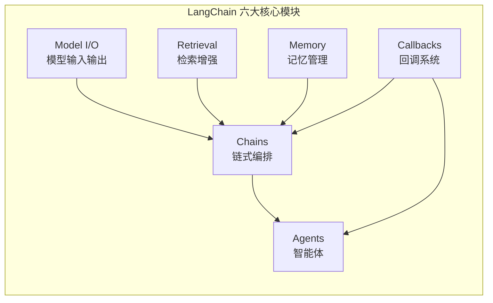
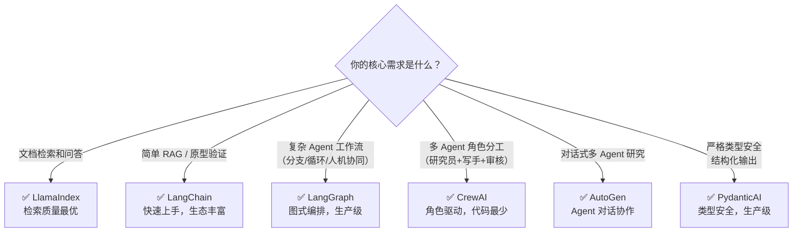

# LangChain 全解：从基础组件到生产级 Agent 开发 —— 2026 年

> **摘要**：LangChain 已成为构建大语言模型应用的事实标准框架。2025 年 10 月，LangChain 与 LangGraph 双双达到 v1.0 里程碑，标志着该生态从“原型开发工具”正式跨入“生产级基础设施”阶段。2026 年，LangChain 的 Python 月下载量已超越 OpenAI SDK，成为 AI Agent 开发的首选平台。然而，LangChain 生态经过三年的快速演进，其组件体系、编程范式和部署模式都发生了深刻变化——从 Chains 到 ReAct Agent，从 SequentialChain 到 LCEL，从单一框架到 LangChain+LangGraph 双核驱动。本文将系统梳理 LangChain 的核心组件、编程范式、生态工具与选型策略，帮助开发者在 2026 年的技术栈中快速定位、高效上手。


## 一、LangChain 是什么：定位、演进与 2026 年的新面貌

### 1.1 一句话定位

如果把大语言模型比作“大脑”，那么 LangChain 就是为这个大脑配备“手脚”、“记事本”和“逻辑流程”的工作流编排框架。它提供了一套标准化的模块抽象，让开发者能够将 LLM 与外部数据源、计算工具、API 深度整合，快速构建复杂的智能应用。

从更宏观的视角看，LangChain 是一个用于开发由 LLM 驱动的应用程序的框架，通过提供标准化且丰富的模块抽象，构建 LLM 的输入输出规范，并利用其核心概念 Chains 灵活地链接整个应用开发流程。

### 1.2 从 2023 到 2026：三代 Agent 框架的演进

LangChain 官方博客回顾了过去三年 Agent 开发模式的演化，将其概括为三代变迁：

**第一代（2023）：Chaining 时代。** 原始的 langchain 因提供了连接基础模型到数据或 API 的最便捷方式而流行。它更像一个“学习提示工程和 RAG 的易用按钮”，而非生产级工具。典型架构是固定的链式调用——提示模板 → 模型调用 → 输出处理，适合翻译、摘要等步骤固定的线性任务。

**第二代（2024-2025）：Orchestration 时代。** LangGraph 应运而生，它更低级、更灵活，内置了支持持久化和状态管理的运行时，解决了 langchain 在控制力和可扩展性上的短板。2025 年 10 月，LangChain 和 LangGraph 双双发布 v1.0，承诺稳定性且无破坏性变更。

**第三代（2025-2026）：Harness 时代。** DeepAgents 作为一个“电池全包”的 Agent 套件，支持长周期任务规划、循环工具调用、上下文卸载到文件系统和子 Agent 编排。它工作得更好是因为 LLM 的推理能力显著提升，你可以将更多决策权委托给 LLM，而非硬编码编排模式。

2026 年，LangChain 生态的推荐组合是：**langchain 作为快速构建 Agent 的高级抽象，langgraph 作为底层运行时引擎，deepagents 作为复杂任务的高级套件**。

### 1.3 为什么需要框架？一个真诚的回答

面对“LLM 越来越强，还需要框架吗？”的质疑，LangChain 团队给出了务实的回答：好的框架应当将最佳实践编码到框架本身、减少样板代码、帮助达到更高质量水平、为大团队创建标准和可读性、铺平通往生产的路径。

但框架并非万能。如果你的 Agent 只调用 2-3 个工具的线性流程，直接用 OpenAI Agents SDK 或 Vercel AI SDK 更轻量。框架在“中间地带”最能发挥价值：人机协同工作流、多 Agent 协调、大型代码库中统一工具 Schema、需要持久化执行或内置追踪。

### 1.4 2026 年的市场地位

2026 年，LangChain 仍是 Agent 生态系统的基础。它是最成熟的选择，拥有庞大的社区和超过 600 个集成。LangChain 和 LangGraph 在 Klarna、Cisco、Vizient 等公司的生产环境中运行着十个已验证的部署案例。

更关键的数据：2025 年 6 月，LangChain 的 Python 月下载量超越 OpenAI SDK，标志着行业从单一 API 调用转向支持多模型、多工具、多编排的 Agent 框架。LangChain 发布的 AI Agent 状态报告显示，51% 的受访者已在生产中使用 Agent，78% 计划在近期部署。


## 二、LangChain 核心组件全景

LangChain 通过模块化的方式高级抽象 LLM 在不同场景下的能力。其核心模块可归纳为六大类：



### 2.1 Model I/O：统一模型接口

Model I/O 模块负责标准化与各类 LLM 的交互，包含三个子模块：

- **Prompt 模板**：管理提示词的模板化生成，支持变量注入、few-shot 示例和消息角色编排。PromptTemplate 使开发者能够使用多个组件为模型构造输入提示。
- **模型包装器**：统一对接 OpenAI、Anthropic、通义千问、文心一言等不同厂商的 API，屏蔽底层差异。
- **输出解析器**：将模型的原始文本输出格式化为结构化数据（JSON、CSV、Pydantic 模型），支持自动纠错和重试。

### 2.2 Retrieval：检索增强模块

Retrieval 模块负责从外部数据源检索相关信息，然后在生成步骤中将其传递给 LLM，包括文档加载、切割、Embedding 等。

核心子模块包括：

- **Document Loaders**：支持 PDF、Word、Markdown、网页、数据库等 80+ 种数据源的加载。
- **Text Splitters**：将长文档切分为适合检索的块。RecursiveCharacterTextSplitter 是目前最常用的方案，按段落→句子→词组的优先级递归分割。
- **Embeddings**：将文本转换为向量表示，支持 OpenAI、BGE、Cohere 等主流嵌入模型。
- **Vector Stores**：向量数据库集成（FAISS、Chroma、Pinecone、Milvus、Weaviate 等），支持语义相似度检索。
- **Retrievers**：检索器抽象，支持向量检索、BM25 关键词检索、混合检索、多查询检索等高级策略。

### 2.3 Chains：链式编排（含 LCEL）

Chains 是 LangChain 框架中最重要的模块，链接多个模块协同构建应用，是实际运作很多功能的高级抽象。

传统 Chains 包括：
- **LLMChain**：最简单的单步链——提示 + 模型 + 可选输出解析器。
- **SequentialChain**：将多个链按顺序连接，前一步输出作为后一步输入。
- **RetrievalQA**：RAG 专用链，封装了检索器和 LLM 的问答流程。

但 2026 年的推荐做法是使用 **LCEL（LangChain Expression Language）** 来构建链。LCEL 是一种革命性的声明式语言，通过引入管道操作符 `|` 和标准化的 `Runnable` 接口，彻底改变了构建复杂 AI 应用的方式。

**LCEL 的核心优势**：

| 特性 | 传统 SequentialChain | LCEL |
|------|---------------------|------|
| 语法 | 冗长，需手动指定 output_key | 简洁的管道语法 `chain = prompt \| llm \| parser` |
| 流式支持 | 需额外配置 | 原生支持同步/异步流式传输 |
| 批处理 | 不支持 | 原生支持并行批处理 |
| 中间结果访问 | 困难 | 可轻松插入调试节点 |
| 可组合性 | 有限 | 像搭积木一样任意组合 |

```python
# LCEL 链式构建示例
from langchain_openai import ChatOpenAI
from langchain_core.prompts import ChatPromptTemplate
from langchain_core.output_parsers import StrOutputParser

llm = ChatOpenAI(model="gpt-4o-mini")
prompt = ChatPromptTemplate.from_template("请用中文回答：{question}")

# LCEL 管道语法
chain = prompt | llm | StrOutputParser()

# 一行执行
response = chain.invoke({"question": "什么是LangChain？"})
```

LCEL 设计之初就支持将原型直接投入生产环境，无需更改代码，适用于从简单的“提示+模型”链条到复杂的、包含数百个步骤的链条。

### 2.4 Memory：记忆管理

Memory 模块以各种方式构建历史信息，维护有关实体及其关系的信息。LangChain 提供了丰富的 Memory 类型：

| Memory 类型 | 适用场景 | 特点 |
|-------------|----------|------|
| ConversationBufferMemory | 短对话 | 完整保留所有历史 |
| ConversationBufferWindowMemory | 有限长度的对话 | 滑动窗口，保留最近 K 轮 |
| ConversationSummaryMemory | 长对话 | LLM 自动生成摘要压缩历史 |
| ConversationSummaryBufferMemory | 混合场景 | 保留最近 K 轮 + 摘要 |
| ConversationKGMemory | 知识密集型对话 | 将对话提炼为知识图谱 |
| VectorStoreRetrieverMemory | 跨会话持久记忆 | 向量数据库语义检索历史 |

2026 年，LangChain 在 LangSmith Agent Builder 中揭示了一种更先进的内存架构：Agent 记忆被表示为文件的集合（虚拟文件系统），实际存储在 Postgres 中，支持用户级和组织级记忆隔离。

### 2.5 Agents：智能体

Agents 是目前最热门的开发实践领域。LangChain 中的 Agent 与用户输入交互，并使用不同的模型进行处理。Agent 决定采取何种行动以及以何种顺序来执行行动。

LangChain 1.0 将 **ReAct 循环**作为 Agent 架构的核心，使其成为构建可靠、可解释、生产就绪型 Agent 的默认结构。ReAct 循环的模式是：Reason（推理）→ Tool Call（工具调用）→ Observe（观察）→ Decide（决策）→ 循环或输出。

**2026 年的 Agent 开发范式**：

`create_agent` 是 LangChain 中构建 Agent 的主要函数，位于 `langchain.agents` 模块中。

```python
from langchain.agents import create_agent
from langchain_openai import ChatOpenAI

llm = ChatOpenAI(model="gpt-4o")
agent = create_agent(
    llm=llm,
    tools=[...],                    # 工具列表
    system_prompt="You are a helpful assistant",
    middleware=[...],               # 中间件（摘要、PII检测、人机协同）
    checkpoint=True                 # 启用状态持久化
)

result = agent.invoke({"messages": [{"role": "user", "content": "..."}]})
```

### 2.6 Callbacks：回调系统

Callbacks 允许连接到 LLM 应用程序的各个阶段，用于日志记录、监控、流传输和其他任务。它与 LangSmith 深度集成，提供全链路的可观测性。


## 三、LangChain vs LangGraph：如何理解这对“黄金搭档”？

### 3.1 二者关系的准确理解

很多开发者困惑于 LangChain 和 LangGraph 的关系。准确地说，LangGraph 是 LangChain 生态的**生产级运行时引擎**，二者是同一团队维护的同一平台的不同层次：

- **LangChain**：基础库，提供集成、提示模板和基础链。
- **LangGraph**：构建在 LangChain 之上的高级编排层。

可以把 LangGraph 理解为 LangChain 2.0——生产就绪的进化版。LangChain 提供了“砖瓦”（基础组件），而 LangGraph 提供了设计并建造复杂“建筑”（动态工作流）的蓝图与脚手架。

### 3.2 LangGraph 的核心抽象

LangGraph 将工作流建模为一个有向图，引入了三个核心概念：

- **State（状态）** ：贯穿整个工作流的共享数据容器，持久化到检查点。
- **Node（节点）** ：执行具体任务（如调用 LLM、运行工具）的单元。
- **Edge（边）** ：连接节点，控制执行流，支持条件分支和循环。

```python
from langgraph.graph import StateGraph, MessagesState, START, END

def llm_node(state: MessagesState):
    response = llm.invoke(state["messages"])
    return {"messages": state["messages"] + [response]}

graph = StateGraph(MessagesState)
graph.add_node("llm", llm_node)
graph.add_edge(START, "llm")
graph.add_edge("llm", END)
app = graph.compile()
```

LangGraph 支持四种多智能体架构模式：
- **网络模式**：Agent 之间直接通信。
- **主管模式**：通过中心主管协调 Worker Agent。
- **分层模式**：战略层→管理层→执行层。
- **群蜂模式**（LangGraph Swarm）：Agent 动态交接控制权。

### 3.3 何时用 LangChain，何时用 LangGraph？

| 场景 | 推荐方案 |
|------|----------|
| 简单 RAG、翻译、摘要 | LangChain 链式调用即可 |
| 需要循环、条件分支、人工审批 | LangGraph |
| 多 Agent 协作 | LangGraph |
| 需要状态持久化和恢复 | LangGraph |
| 快速原型验证 | LangChain 的 `create_agent` |


## 四、LCEL 深度解析：声明式链式编程新范式

### 4.1 Runnable 协议

LCEL 的基础是 `Runnable` 协议——任何实现了 `invoke`、`stream`、`batch` 等方法的对象都可参与 LCEL 管道。核心 Runnable 类型包括：

- **RunnablePassthrough**：透传输入，可配合 `RunnableParallel` 实现分支处理。
- **RunnableLambda**：将普通 Python 函数包装为 Runnable。
- **RunnableParallel**：并行执行多个分支，结果合并为字典。
- **RunnableBranch**：基于条件选择不同的执行分支。

### 4.2 LCEL 的自动能力

当你使用 LCEL 语法构建链时，自动获得以下生产级能力：

- **流式传输**：`.stream()` 方法自动逐 token 输出。
- **批处理**：`.batch()` 方法并行处理多个输入。
- **异步支持**：`.ainvoke()`、`.astream()`、`.abatch()` 方法。
- **回退机制**：`.with_fallbacks()` 指定备选方案。
- **中间结果访问**：可插入调试节点查看任意步骤的输出。

### 4.3 实用模式

```python
from langchain_core.runnables import RunnablePassthrough, RunnableParallel

# 模式1：分支处理
chain = RunnableParallel(
    summary=prompt1 | llm | parser,
    keywords=prompt2 | llm | parser
)

# 模式2：条件分支
from langchain_core.runnables import RunnableBranch

branch = RunnableBranch(
    (lambda x: "复杂" in x["query"], complex_chain),
    (lambda x: "简单" in x["query"], simple_chain),
    default_chain
)

# 模式3：数据增强
chain = {
    "context": retriever,
    "question": RunnablePassthrough()
} | prompt | llm | parser
```


## 五、LangSmith：Agent 可观测性与部署平台

### 5.1 LangSmith 是什么？

LangSmith 是 LangChain 生态的**全链路可观测性平台**。它帮助你理解和改进 AI Agent 应用程序，就像一个仪表板显示应用程序内部发生的情况，允许你：

- **调试**：出现问题时快速定位根因。
- **测试**：评估提示词和逻辑的质量。
- **监控**：实时监控应用程序的运行状态。
- **评估**：量化答案质量。
- **追踪**：跟踪使用情况、速度和成本。

### 5.2 2026 年的关键更新

- **LangSmith Fleet（原 Agent Builder）** ：2026 年 2 月更新引入了文件上传能力、集中式工具注册表和将任意对话转换为可复用 Agent 的功能。
- **LangSmith Sandboxes**：为 Agent 提供锁定、临时的代码执行环境，支持细粒度的访问和资源控制。
- **Polly AI 助手**：在 LangSmith 中全面可用，可以像工程师一样执行操作。
- **ABAC 与审计日志**：企业级权限控制和操作追踪。

### 5.3 部署 CLI

LangGraph Deploy CLI 让你能从终端一步部署 Agent 到 LangSmith Deployment。


## 六、LangChain 生态全景与对比选型

### 6.1 主流框架横向对比

2026 年 AI Agent 框架生态中，主要竞争者包括 LangChain/LangGraph、CrewAI、AutoGen、LlamaIndex、PydanticAI 等。

| 框架 | 核心定位 | 优势 | 弱点 |
|------|----------|------|------|
| **LangChain** | 全能型应用开发框架 | 生态最成熟，600+ 集成，社区最大 | 学习曲线陡峭，抽象层次较多 |
| **LangGraph** | 状态化 Agent 工作流引擎 | 图式编排，支持循环/分支/人机协同 | 需要理解图概念 |
| **CrewAI** | 基于角色的多 Agent 编排 | 直觉性强，原型最快（<3小时），代码最少 | 深度有限，无原生 RBAC |
| **AutoGen** | 对话式多 Agent 系统 | 多 Agent 协作，研究场景表现优异 | 成本高（24,200 tokens/query），可靠性待验证 |
| **LlamaIndex** | 数据密集型 RAG | RAG 检索质量最优，300+ 数据连接器 | 编排能力不如 LangGraph |
| **PydanticAI** | 类型安全的 Agent | 类型安全，生产级，标准 Python 体验 | 集成生态较小 |

### 6.2 选型决策树



LangChain 框架的定位是全能型应用开发框架，其优势在于组件化、功能全面、生态最成熟（MIT 许可证）。LangGraph 则专注于多 Agent 编排和状态化工作流，是从 LangChain 演进出的专门用于复杂状态管理的框架。

**建议**：
- 如果你的团队已有 LangChain 技术栈，直接使用 LangGraph 作为生产级运行时。
- 如果你从零开始且任务类型以文档问答为主，LlamaIndex 更专注高效。
- 如果你需要快速构建多角色 Agent 系统，CrewAI 的学习曲线最平缓。


## 七、实战：从零构建一个完整的 LangChain Agent

### 7.1 环境搭建

```python
# 安装核心库
# pip install langchain langchain-openai langgraph

import os
from langchain.agents import create_agent
from langchain_openai import ChatOpenAI
from langchain_community.tools.tavily_search import TavilySearchResults
from langchain_core.messages import HumanMessage

# 设置 API 密钥
os.environ["OPENAI_API_KEY"] = "your-key"
os.environ["TAVILY_API_KEY"] = "your-key"
```

### 7.2 定义工具

```python
# 网络搜索工具
search_tool = TavilySearchResults(max_results=3)

# 自定义计算器工具
from langchain_core.tools import tool

@tool
def calculator(expression: str) -> str:
    """计算数学表达式，输入为合法的 Python 数学表达式"""
    try:
        result = eval(expression, {"__builtins__": {}}, {})
        return f"计算结果：{result}"
    except Exception as e:
        return f"计算错误：{e}"

tools = [search_tool, calculator]
```

### 7.3 创建 Agent

```python
llm = ChatOpenAI(model="gpt-4o-mini", temperature=0)

agent = create_agent(
    llm=llm,
    tools=tools,
    system_prompt="""你是一个有用的助手。当用户询问需要实时信息的问题时，使用搜索工具。
    当涉及数学计算时，使用计算器工具。回答时请用中文。""",
)

# 执行
result = agent.invoke({
    "messages": [HumanMessage(content="2025年诺贝尔物理学奖得主是谁？")]
})

print(result["messages"][-1].content)
```

### 7.4 进阶：使用 LangGraph 构建有状态工作流

```python
from langgraph.graph import StateGraph, MessagesState, START, END
from langgraph.prebuilt import ToolNode

# 定义节点
def agent_node(state: MessagesState):
    response = llm_with_tools.invoke(state["messages"])
    return {"messages": [response]}

# 构建图
graph = StateGraph(MessagesState)
graph.add_node("agent", agent_node)
graph.add_node("tools", ToolNode(tools))

graph.add_edge(START, "agent")
graph.add_conditional_edges(
    "agent",
    lambda state: "tools" if state["messages"][-1].tool_calls else END
)
graph.add_edge("tools", "agent")

app = graph.compile()

# 执行
result = app.invoke({"messages": [HumanMessage(content="搜索LangChain 1.0的新特性")]})
```


## 八、总结与最佳实践

### 8.1 核心要点回顾

1. **LangChain 是 LLM 应用开发的“操作系统”**：提供模型接口、检索增强、链式编排、记忆管理、Agent 和回调六大核心模块，让开发者能像搭积木一样构建复杂 AI 应用。

2. **LangChain + LangGraph = 双核驱动**：LangChain 提供基础组件和快速原型能力，LangGraph 提供生产级图式编排和状态管理。2026 年，`create_agent` + LangGraph 是推荐组合。

3. **LCEL 是必须掌握的新语法**：声明式、管道化的链式构建方式，自动获得流式传输、批处理、异步支持等生产能力。

4. **框架选型需按场景决策**：简单线性任务用 LangChain 基础链；复杂分支/循环用 LangGraph；纯文档问答考虑 LlamaIndex；多角色分工用 CrewAI。

5. **LangSmith 补齐了可观测性短板**：从调试、评估到部署，LangSmith 提供了完整的企业级工具链。

### 8.2 实践 Checklist

- [ ] 根据任务复杂度评估是否需要框架（简单任务用 SDK 可能更轻量）
- [ ] 新项目优先使用 LCEL 语法，避免已弃用的 SequentialChain
- [ ] Agent 开发优先使用 `create_agent` 而非手动组装
- [ ] 生产环境集成 LangSmith 进行追踪和监控
- [ ] 长时任务使用 LangGraph 的状态持久化功能
- [ ] 定期关注 LangChain 官方博客和 Newsletter 了解版本更新

### 8.3 学习路径建议

**入门级（1-2 周）**：
- 搭建开发环境，运行第一个 LangChain 程序
- 理解 Model I/O、Prompt 模板和 LCEL 基础语法
- 实现一个简单的 RAG 问答系统

**进阶级（2-4 周）**：
- 深入 LCEL 高级模式（分支、并行、回退）
- 掌握 Agent 工具定义和 ReAct 循环
- 使用 LangSmith 进行调试和评估

**生产级（1-2 月）**：
- 学习 LangGraph 图式编排和状态管理
- 构建多 Agent 协作系统
- 集成 LangSmith Deployment 部署到生产

---

*LangChain 走过了从“原型开发工具”到“生产级基础设施”的三年演进之路。2026 年的 LangChain 生态，既有 LangChain 的快速开发能力，又有 LangGraph 的强大编排引擎，还有 LangSmith 的全链路可观测性——三位一体，构成了 LLM 应用开发的最完整技术栈。希望本文能帮助你在 LangChain 的浩瀚生态中找到清晰的航向，快速构建属于你的 AI Agent 应用。*