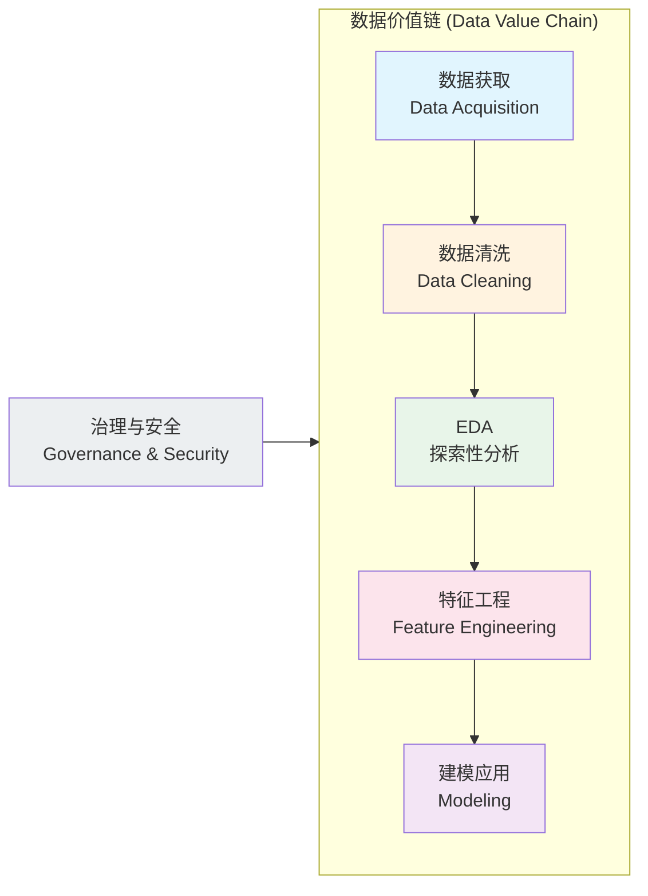
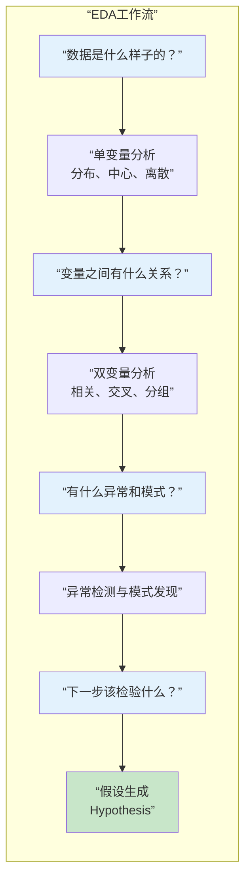
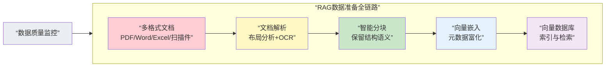
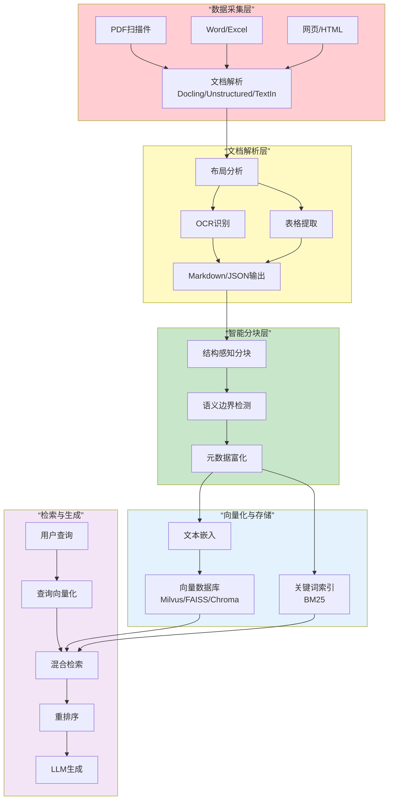
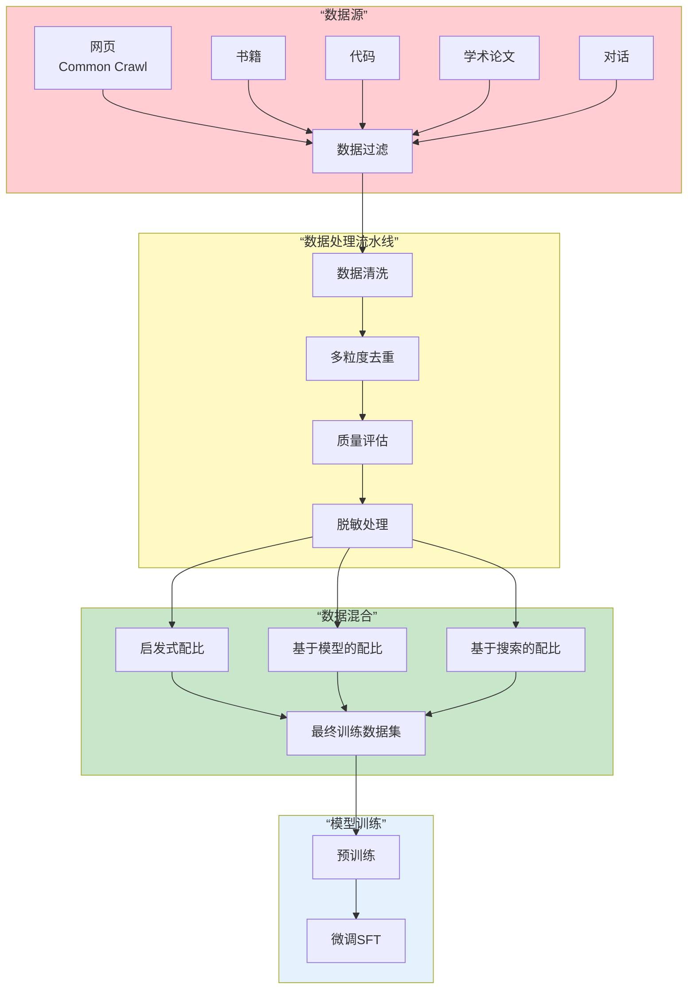

# 数据炼金术：从原始数据到智能应用的全链路实战指南

## 数据处理、数据挖掘与EDA的核心技术与前沿实践

> 数据是新时代的石油，但原油无法直接驱动引擎。从原始数据到智能应用，需要经过一套完整的“炼金”流程——数据预处理、探索性数据分析、特征工程、模型构建与应用部署。本文将系统梳理这条数据价值链的每一个关键环节，重点聚焦LLM与RAG时代数据工程面临的新挑战：海量非结构化文档的解析、向量数据库的数据准备、大规模预训练数据的清洗与质量管控、数据脱敏与隐私保护等。全文贯穿工程化视角与最佳实践，是每一位数据工程师、AI开发者和架构师的必备参考指南。

### 推荐阅读与知识结构

本文体量较大，推荐按需阅读。建议所有读者先阅读第一、二、三章建立基础认知，之后可根据职业方向选择不同路径：
- **数据工程师**：重点阅读第四、五、八章（RAG数据准备、LLM训练数据构建、数据安全与治理）
- **数据分析师/科学家**：重点阅读第一、二、六章（数据预处理、EDA、数据挖掘综述）
- **AI应用开发者**：重点阅读第四、七章（RAG文档处理、MCP协议与工具链）
- **技术管理者**：重点阅读引言、第二章（数据价值链）、第八章（数据安全与治理）、第九章（总结与趋势展望）

此外，建议将本文与作者的另一篇文章《数据分析与统计学基础知识与应知应会》结合阅读，后者系统梳理了描述统计与推断统计的理论基础、概率论与贝叶斯思维的哲学内核，以及可视化方向的深度综述。两篇文章分别覆盖“统计理论”与“工程实践”两个维度，互为补充。


## 导言：为什么数据准备比模型更重要

在AI和大数据狂飙突进的2026年，一个看似反直觉的真相正在被越来越多的实践者所确认：**模型很重要，但数据质量更重要**。

从机器学习到深度学习，从传统BI到大语言模型，数据准备（data preparation）始终是数据科学项目中最耗时、最枯燥、也最决定成败的环节。数据准备旨在对原始数据集进行去噪，发现跨数据集的关系，并从中提取有价值的见解，这对于广泛的数据驱动应用至关重要。有统计显示，超过80%的数据科学项目时间花费在数据清洗和准备上。而在LLM时代，这个比例甚至更高——因为LLM对数据的“饥渴”和“敏感”远超传统模型。

坏数据喂出坏模型，脏数据导致模型幻觉，低质量的数据集甚至会引发伦理风险和安全漏洞。然而，与模型架构的公开透明不同，数据处理的工程细节往往是各大公司和研究机构的“不传之秘”——它们直接决定了模型效果的天花板，却很少被系统性地讨论和总结。

这正是本文的使命：为你揭示从原始数据到智能应用的全链路数据工程实践，让你不仅知道“要用好数据”，更知道“如何把数据用好”。

本文将按照数据价值链的五个关键阶段组织内容：

1. **数据获取与集成**：从多源异构系统采集原始数据
2. **数据清洗与预处理**：修正错误、填补缺失、统一格式
3. **探索性数据分析**：通过统计和可视化理解数据结构
4. **特征工程与转换**：构造模型可用的高质量特征
5. **数据质量与治理**：建立持续的数据保障体系



在数据价值链的每一个环节，我们都会遇到数据质量问题——从数据采集阶段的缺失值和异常值，到数据集成阶段的格式不一致和实体匹配困难，再到数据标注阶段的主观偏差和标注错误。理解这些问题的成因和解决方案，是构建高质量数据产品的第一步。

让我们从最基础的环节开始：数据预处理。


## 第一部分：数据预处理——从“脏数据”到“干净数据”

### 第一章 数据预处理概述：为什么这一步不可跳过

#### 1.1 数据预处理在数据科学全流程中的位置

在任何数据科学项目中，数据预处理都是连接“原始数据”和“可分析数据”的关键桥梁。根据一项面向数据挖掘的综合综述，数据预处理和特征工程对分析结果的准确性、可复现性和可解释性具有显著影响。

现代数据分析中的数据转换被系统性地分类为以下关键类型：数据清洗与预处理、归一化与标准化、特征工程、分类数据编码、数据增强、离散化与数据聚合。这些转换技术共同构成了数据预处理的技术工具箱。

理解数据预处理的价值，首先需要认识到：分析的质量取决于数据的质量。只有经过充分转换的数据，才能为描述性分析和预测性建模提供可靠的基础。

#### 1.2 真实世界数据为什么总是“脏”的

真实世界数据之所以“脏”，源于多个方面：

**数据采集的天然缺陷**：传感器误差、人工录入错误、系统故障都会产生噪声数据。在处理大规模、异构数据集时，数据集成复杂性、安全问题和资源约束进一步加剧了数据质量问题。

**数据来源的多样性**：企业数据通常来自多个异构系统——CRM、ERP、日志系统、第三方API——每个系统有自己的数据格式、编码标准和业务逻辑。

**数据质量的系统性挑战**：大规模数据面临的主要质量挑战包括：噪声数据（包含错误、重复、无意义或有害内容）、分布偏差（特定群体、文化或观点的过度/不足表示）、时效性问题（过时信息可能导致模型知识陈旧）、以及格式不一致（不同来源数据的编码、格式差异）。

**人类因素的介入**：数据标注过程中的主观偏差、对标注标准的理解差异、以及标注员的疲劳和疏忽，都会引入额外的“脏数据”。

#### 1.3 数据预处理的成本与价值

数据预处理是数据科学项目中成本最高的环节之一，但也是最不能跳过的环节。在一次大规模研究中，三个主要类别的预处理技术被系统识别：数据转换（在60%的研究中被使用）、数据归一化与标准化（40%）、以及数据清洗（40%）。这些数字表明，预处理不是单一操作，而是一个包含多种技术组合的系统工程。

从投资回报的角度看，数据预处理的成本主要来自人力投入（数据工程师和分析师的时间）、计算资源（大规模数据处理的算力消耗）和存储成本（原始数据和清洗后数据的保存）。但跳过或简化数据预处理带来的代价往往更高——模型准确率下降、推理结果不可信、以及因数据质量问题导致的错误业务决策。


### 第二章 数据清洗：修复“坏数据”的艺术与科学

数据清洗是数据预处理中最基础也最核心的环节。它涵盖了从数据编译、变量命名与标签设计，到数据检查和变量重编码与转换等一系列操作。本节从五个核心维度系统梳理数据清洗的完整方法。

#### 2.1 缺失值处理：删除、填充还是模型预测？

缺失值是数据清洗中最常见的问题之一。处理方法可以分为三大类：

**删除法**：最简单直接的方法，包括删除含有缺失值的记录（行删除）和删除缺失率过高的变量（列删除）。删除法的优点是简单且不引入人为偏差，但代价是信息损失——当缺失比例较高时，删除法可能显著降低样本的代表性。实践中，通常设定一个阈值（如缺失率>50%）来决定是否删除一个变量。

**填充法**：用某个合理值替代缺失值。常见的填充策略包括：
- 均值/中位数/众数填充：对于数值型变量，用均值或中位数填充；对于分类变量，用众数填充。这是最常用的基线方法。
- 向前/向后填充：对于时间序列数据，用相邻时间点的值填充。
- 分组填充：按某个分组变量的取值分别计算填充值，保留组内差异。
- K近邻填充：利用相似样本的特征值来预测缺失值。

**模型预测法**：将缺失值视为预测目标，用其他特征构建模型来预测缺失值。常用的方法包括多重插补和基于机器学习的插补（如随机森林插补）。

#### 2.2 异常值检测与处理

异常值是那些显著偏离数据整体分布的数据点。它们可能是数据采集错误的产物，也可能代表真实的极端事件。对异常值的处理需要业务判断与统计方法相结合。

**统计检测方法**：
- Z-Score法：计算每个数据点与均值的标准差距离。当|Z|>3时，通常被认为是异常值。这种方法假设数据近似服从正态分布。
- IQR法（四分位距法）：计算Q1-1.5×IQR和Q3+1.5×IQR作为边界，边界之外的点被视为异常值。这种方法不依赖正态性假设，更加稳健。
- DBSCAN聚类：基于密度的聚类算法，将低密度区域的点识别为异常。

**处理策略**：
- 删除：当异常值确认是数据错误时
- 修正：当可以推断正确值时
- 保留：当异常值代表真实的极端事件时（如金融风控中的欺诈交易）
- 变换：通过对数变换等减轻异常值的影响

#### 2.3 重复数据处理

重复数据可能来自多次采集、系统错误或数据合并。处理重复数据的关键步骤包括：

**完全重复检测**：使用哈希算法（如MD5、SHA-256）快速识别内容完全相同的记录。哈希算法可以将任意长度的数据映射为固定长度的哈希值，相同的内容产生相同的哈希，非常适合大规模去重。

**近似重复检测**：对于内容相似但不完全相同的记录，需要更复杂的方法：
- 相似度计算：使用余弦相似度、Jaccard相似度等度量文本相似性
- SimHash与MinHash：用于大规模近似去重的局部敏感哈希算法。SimHash通过计算文本的指纹来实现快速近似匹配；MinHash则通过多个哈希函数的最小值来估计集合的Jaccard相似度。在实际应用中，融合多粒度去重策略可以将重复内容识别率提升至99.7%

**处理策略**：对于完全重复，通常只保留一条记录；对于近似重复，需要结合业务场景判断是合并还是保留多条。

#### 2.4 不一致数据处理

数据不一致包括同一实体的不同表示方式（如“中国”vs“中华人民共和国”）、单位不统一（如“kg”vs“g”）、以及违反业务规则的数据（如结束日期早于开始日期）。

**处理方法**：
- 建立数据标准字典：统一实体的标准名称和代码
- 正则表达式匹配：用于识别和标准化日期、电话号码、邮箱等格式
- 实体匹配：使用模糊匹配算法识别指向同一实体的不同记录
- 业务规则验证：定义数据约束条件，自动检测违反规则的记录

#### 2.5 LLM增强的数据清洗：范式转变

2025-2026年最值得关注的趋势是LLM被引入数据清洗流程。传统的数据准备方法依赖于基于规则的和模型特定的流程，而LLM增强的方法正在迅速成为一种变革性的、潜在的主导范式。

根据一项涵盖数百篇文献的系统综述，LLM在数据准备中的应用被分为三大任务类别：数据清洗（如标准化、错误处理、缺失值插补）、数据集成（如实体匹配、模式匹配）和数据富化（如数据标注、画像）。

LLM的优势在于其语义理解能力：它可以理解数据的“含义”而非仅仅识别“模式”。例如，在数据标准化任务中，LLM可以将“NYC”“New York”“纽约”识别为同一实体的不同表示，而传统的规则方法很难做到这一点。LLM还能在理解上下文的基础上进行数据标注和实体匹配。

然而，LLM方法也有其局限性：规模化成本过高（每次调用都有API成本或算力开销）、即使在高级agent中仍存在持续性的幻觉问题、以及先进方法与弱评估之间的不匹配。这些挑战意味着LLM目前更适合作为数据清洗的辅助工具，而非完全替代传统方法。

```mermaid
flowchart TD
    subgraph RawData[“原始数据 (Raw Data)”]
        R1[缺失值] --> R2[异常值] --> R3[重复数据] --> R4[不一致数据]
    end
    
    subgraph Traditional[“传统清洗方法”]
        T1[均值/中位数填充] --> T5[统计检测] --> T6[哈希去重] --> T7[正则标准化]
    end
    
    subgraph LLMEnhanced[“LLM增强清洗”]
        L1[语义理解填充] --> L2[上下文异常检测] --> L3[语义去重] --> L4[智能标准化]
    end
    
    RawData --> Traditional
    RawData --> LLMEnhanced
    
    Traditional --> CleanData[“干净数据 (Clean Data)”]
    LLMEnhanced --> CleanData
    
    style RawData fill:#ffcdd2
    style CleanData fill:#c8e6c9
    style Traditional fill:#e3f2fd
    style LLMEnhanced fill:#fff9c4
```


### 第三章 数据转换与特征工程

数据清洗解决的是“数据对不对”的问题，而数据转换和特征工程解决的是“数据好不好用”的问题。本章系统梳理从基础转换到高级特征工程的技术体系。

#### 3.1 数据标准化与归一化

标准化和归一化是数值型数据预处理中最基础的操作，目的是消除不同量纲对模型训练的影响。

**归一化**：将数据映射到[0,1]区间。适用于数据分布未知、或需要将不同量纲的数据放到同一尺度的场景。常用方法包括：
- Min-Max归一化：(x - min)/(max - min)
- 适用于神经网络、K近邻等对距离敏感的算法

**标准化**：将数据转换为均值为0、标准差为1的分布。适用于数据近似服从正态分布的场景。常用方法包括：
- Z-score标准化：(x - μ)/σ
- 适用于线性回归、逻辑回归、支持向量机等模型

**选择指南**：
- 数据有异常值：优先使用RobustScaler（基于中位数和四分位距的标准化）
- 数据服从正态分布：使用Z-score标准化
- 数据需要固定范围：使用Min-Max归一化

#### 3.2 分类变量编码

分类变量是数据分析中最常见的数据类型之一，但大多数机器学习模型只能处理数值输入，因此需要对分类变量进行编码。

**独热编码**：为每个类别创建一个二值特征（0或1）。优点是不引入类别之间的“大小”关系，缺点是当类别数量较多时会导致维度爆炸。适用于类别数较少（通常<10）的场景。

**标签编码**：将每个类别映射为一个整数。优点是维度不变，缺点是引入了类别之间的顺序关系（模型可能误以为“3”大于“2”）。适用于有序分类变量（如学历、满意度等级）。

**目标编码**：用目标变量的统计量（如均值）替代类别值。可以保留类别与目标变量的关系，但容易过拟合。适用于高基数分类变量和树模型。

#### 3.3 特征构造与特征选择

**特征构造**是从原始特征中创造出更有预测力的新特征。常见的构造方法包括：
- 多项式特征：通过特征的幂和乘积构造非线性关系
- 分箱/离散化：将连续变量转换为分类变量
- 交互特征：两个或多个特征的乘积，捕捉交互效应
- 聚合特征：基于分组计算统计量（如用户的平均消费金额）

**特征选择**是筛选出对目标变量最有预测力的特征子集，以减少维度、降低过拟合风险。常用方法包括：
- 过滤法：基于统计指标（如相关系数、卡方检验、互信息）评估每个特征的重要性
- 包装法：使用模型性能作为特征子集的评估标准（如递归特征消除）
- 嵌入法：在模型训练过程中同时完成特征选择（如LASSO回归、决策树的特征重要性）

#### 3.4 数据增强技术

数据增强通过对现有数据进行可控变换来生成新的训练样本，是小样本学习和深度学习中的重要技术。

**数值型数据增强**：添加小幅度噪声、SMOTE过采样（通过插值生成新的少数类样本）

**文本数据增强**：同义词替换、回译（翻译到另一种语言再翻译回来）、随机插入/删除/交换

**图像数据增强**：旋转、翻转、裁剪、色彩抖动、添加噪声

在LLM预训练中，数据增强还被用于提高数据的多样性。例如，可以利用大模型将原始数据“净化”并改写，同时保留有用信息，去掉隐私或有害部分。


## 第二部分：探索性数据分析（EDA）——让数据“开口说话”

### 第四章 EDA的方法论体系

#### 4.1 EDA的定义与目的

探索性数据分析是机器学习建模之前的一个关键步骤，它允许研究人员理解数据集的结构、检测异常，并在应用模型之前提取见解。EDA的核心目的不是“得出确定结论”，而是“生成值得检验的假设”——它帮助分析师发现数据中的模式、趋势和异常，为后续的正式建模指明方向。

EDA的典型工作流程包括：单变量分析（了解每个变量的分布）、双变量分析（探索变量之间的关系）、以及多变量分析（理解变量之间的交互效应）。

EDA数据管道的设计目标是在正式建模之前理解、总结和可视化数据集，以发现模式、检测异常、检验假设和检查假设条件。值得注意的是，EDA不是一次性的操作，而是一个迭代的过程——每次分析都可能产生新的问题和新的探索方向。



#### 4.2 单变量分析方法

单变量分析关注单个变量的分布特征，是EDA的第一步。核心方法包括：

**数值型变量的分析**：
- 五数概括：最小值、Q1（第25百分位数）、中位数、Q3（第75百分位数）、最大值
- 分布形态：偏度（衡量对称性）和峰度（衡量“尖峭”程度）
- 可视化工具：直方图（展示分布形态）、箱线图（展示五数概括和异常值）、密度图（平滑的分布估计）

**分类变量的分析**：
- 频数统计：各类别的计数和占比
- 可视化工具：条形图（展示频数）、饼图（展示占比，但类别多时不推荐）

**单变量分析的核心目的**：识别数据的基本特征，发现潜在的数据质量问题（如异常值、分布偏差），为后续分析奠定基础。

#### 4.3 双变量与多变量分析方法

双变量分析探索两个变量之间的关系，是理解数据内部结构的关键。

**数值-数值关系**：散点图是最直观的工具，可以同时展示关系的方向、强度和非线性模式。相关系数（Pearson、Spearman）提供量化的关系度量。

**数值-分类关系**：分组箱线图或小提琴图可以比较不同类别下数值变量的分布差异。ANOVA（方差分析）提供统计显著性检验。

**分类-分类关系**：交叉表（列联表）和堆叠条形图展示两个分类变量的联合分布。卡方检验检验变量之间的独立性。

**多变量分析**涉及三个及以上变量的关系，常用方法包括：
- 降维技术：主成分分析（PCA）将高维数据投影到低维空间，帮助可视化数据的整体结构
- 聚类分析：将相似的样本分组，发现数据中的自然分组
- 平行坐标图：用于高维数据的可视化探索

#### 4.4 可视化在EDA中的核心地位

可视化是EDA中最重要的工具之一。好的可视化可以在几秒钟内揭示数据中的模式和异常，而同样的信息可能需要大量的统计测试才能确认。

**EDA可视化的设计原则**：
- 简单优先：先画散点图和直方图，再考虑复杂图表
- 多图联动：用不同的可视化方式从多个角度审视同一数据
- 迭代探索：根据一张图发现的问题，选择下一张图的类型

**常用可视化工具**：
- Python生态：Matplotlib（底层灵活）、Seaborn（统计图表专精）、Plotly（交互式）
- R生态：ggplot2（基于图形语法的声明式绘图）
- BI工具：Tableau、Power BI（适合业务人员快速探索）

一项研究调查了50种前沿的视觉EDA工具在大规模工业数据集上的可视化探索能力，表明可视化EDA正在向处理更大规模、更高维度数据的方向演进。

#### 4.5 LLM驱动的EDA自动化

2025-2026年的一个重要趋势是使用LLM来自动化EDA过程。自动化EDA对于加速数据科学家的工作流程至关重要。虽然LLM提供了一种有前景的解决方案，但当前仅使用LLM的方法在较少研究的或私有数据集上通常表现出有限的准确性和代码可靠性。

研究人员提出了多种改进方案，包括将RAG与EDA结合——通过检索相关的分析代码片段或领域知识来增强LLM生成的分析代码的质量。另一个方向是使用LLM作为“数据分析助手”，通过自然语言交互来完成数据探索任务，大幅降低非专业用户的使用门槛。

然而，自动化EDA的挑战依然存在：LLM生成的代码可能包含错误或使用不存在的API，对私有数据集缺乏上下文理解，以及生成的图表可能不符合领域最佳实践。在实践中，半自动化（LLM辅助而非完全替代）是更可行的路径。


## 第三部分：数据挖掘——从数据中发现知识的科学

### 第五章 数据挖掘的核心技术与方法论

#### 5.1 数据挖掘的定义与CRISP-DM流程

数据挖掘是从大量数据中发现隐藏的、有价值的模式的过程。它是KDD（知识发现）的核心环节，融合了统计学、机器学习和数据库系统的技术。CRISP-DM是数据挖掘领域最广泛采用的方法论框架，定义了数据挖掘项目的六个阶段：业务理解 → 数据理解 → 数据准备 → 建模 → 评估 → 部署。

理解CRISP-DM框架的意义在于：它强调数据挖掘不是一次性建模，而是一个反复迭代的过程——从评估阶段发现的问题可能回溯到数据准备甚至业务理解阶段，形成持续优化的闭环。

#### 5.2 主要任务类型与技术矩阵

数据挖掘的任务可以按照目标分为以下几大类：

**分类**：预测样本属于哪个类别。这是最常见的数据挖掘任务之一，从垃圾邮件识别到信用评分，应用场景极为广泛。主要算法包括逻辑回归、决策树、随机森林、XGBoost、支持向量机和神经网络。其中，XGBoost和LightGBM因其在处理表格数据上的卓越性能和效率，已成为工业界的首选算法。

**聚类**：将相似的样本自动分组，是无监督学习的典型代表。主要算法包括K-means（简单高效但需要预设聚类数）、层次聚类（产生聚类树，适合探索性分析）、DBSCAN（基于密度的聚类，可以发现任意形状的簇并自动识别噪声点）。在文本数据中，LDA主题模型是一种专门用于发现文档-主题-词语三层结构的概率聚类方法。

**关联规则挖掘**：发现数据项之间的共现关系，最经典的算法是Apriori和FP-Growth。关联规则挖掘的核心挑战之一是从数据集中提取有趣的模式以获取有用知识，涉及基本、高级和扩展的客观度量、多目标优化方法和主观度量等多个维度。

**回归**：预测数值型目标变量。线性回归是最基础的回归方法，但在处理非线性关系时需要更复杂的方法，如决策树回归、随机森林回归和神经网络回归。

**异常检测**：识别不符合整体模式的罕见样本，在金融风控、工业设备监控和网络安全中有广泛应用。方法包括基于统计的检测、基于距离的检测和基于模型的检测。

**文本挖掘**：从非结构化文本中提取有价值的信息。特征选择与提取方法在文本挖掘中的进展包括一系列针对文本数据复杂性设计的新方法，在情感分析、主题建模和信息抽取等任务中有广泛应用。

#### 5.3 数据挖掘的当代挑战

随着数据规模的爆炸式增长和应用场景的多样化，数据挖掘面临新的挑战：

**大规模数据处理**：在大数据时代，子抽样方法为统计和分析大数据集提供了解决方案，有效减轻了计算负担和成本。研究系统梳理了依赖和不依赖于模型的子抽样方法的发展现状。

**数据理解与情境化**：当前方法在系统性支持数据收集和情境化的理解方面存在关键缺口，数据理解的研究不仅涉及理论层面，还需要为组织提供实际指导。

**可解释性与公平性**：随着数据挖掘模型越来越多地用于高风险决策，模型的“黑箱”特性引发了可解释性危机。SHAP、LIME等可解释性工具正在成为数据挖掘流程的标准组成部分。

**数据隐私**：如何在保护个人隐私的前提下进行数据挖掘？差分隐私和联邦学习等技术提供了技术层面的解决方案。


## 第四部分：RAG与LLM时代的数据准备新挑战

如果说前两部分讨论的是数据分析与挖掘的“经典问题”，那么本章要讨论的则是2025-2026年最前沿、最具挑战性的“新问题”——如何为RAG系统和LLM训练准备高质量的数据。

### 第六章 RAG知识库建设的数据准备工程

#### 6.1 RAG数据准备的独特挑战

RAG（检索增强生成）系统的性能严重依赖于文档预处理的质量，然而此前没有研究通过下游问答准确性来评估PDF处理框架的效果。RAG数据准备面临的核心挑战包括：

**格式兼容性不足**：企业文档通常包含PDF、Word、Excel、扫描件等多种格式，传统解析工具难以全面支持，导致数据源处理不完整。

**复杂版面解析困难**：多栏排版、嵌套表格、图文混排等复杂版面结构，传统方法容易导致文本顺序错乱、表格结构破坏、信息丢失等问题。

**信息提取精度有限**：文档中的页眉页脚、水印、印章、手写批注等非核心元素，若不能有效识别和过滤，将影响知识库数据质量。

**处理效率难以满足需求**：面对企业级海量文档处理需求，传统工具在速度、稳定性和成本控制方面存在明显不足。

**两个团队可能使用相同的LLM和向量数据库，却得到完全不同的系统质量**。差异通常来自上游环节：文档如何解析、如何分块、如何嵌入、数据如何索引、检索结果如何排序、最终答案如何组装。数据准备的质量是RAG系统性能的主导因素。



#### 6.2 多格式文档解析的技术路线

文档解析是RAG数据准备的第一步，也是最容易出现质量问题的环节。

##### 6.2.1 主流开源框架深度评测

**Docling**：IBM开源的综合文档解析框架，简化了文档处理流程，支持多种格式解析——包括PDF、DOCX、PPTX、XLSX、HTML、图像、LaTeX等，并提供先进的PDF理解能力，包括页面布局、阅读顺序、表格结构、代码、公式、图像分类等。Docling提供统一、富有表现力的文档表示格式，支持Markdown、HTML、JSON等多种导出格式，并与LangChain、LlamaIndex、Crew AI和Haystack等agentic AI框架无缝集成。在一项2026年的系统评测中，Docling配合层次化分块和图像描述，达到了94.1%的最高自动化准确率。

**Unstructured**：由Unstructured-IO开源的文档处理ETL框架，专注于将复杂的非结构化文档转换为适用于LLM的数据格式。该项目被87%的财富1000强企业采用，是构建RAG和Agentic AI应用的核心基础设施。Unstructured支持64+种文件类型，提供开源库、Serverless API和企业级Platform三种部署方式，核心功能包括文档分区、表格提取、OCR、布局分析和分块。

**Marker** 和 **MinerU**：另两个开源PDF转Markdown框架，在评测中表现各有千秋。字体驱动的层次结构重建始终优于基于LLM的方法，这表明对于文档结构的理解，专门的布局模型比通用LLM更可靠。

**Chunkr**：一个开源文档解析工具，旨在解决RAG/LLM应用中文档解析的“一刀切”问题。Chunkr提供细粒度的控制能力，让用户可以根据用例在速度、质量和功能之间做出平衡。Chunkr已经在医疗、金融、研究、政府、教育和硬件等多个垂直领域得到验证，它基于Rust构建，在单个RTX 4090上每秒可处理约4页文档，每月可处理超过1100万页。

**MDKeyChunker**：一种针对Markdown文档的三阶段管道方法，解决了固定大小分块的局限性。它将标题、代码块、表格和列表视为原子单元进行结构感知分块，通过单次LLM调用为每个块提取标题、摘要、关键词等七个元数据字段，并通过滚动键传播维护文档级别的上下文。在30个查询的实证评估中，该方法在BM25检索上达到了Recall@5=1.000和MRR=0.911的优异表现。

##### 6.2.2 商业与企业级解决方案

**TextIn文档解析**：合合信息的文档解析工具，支持PDF（含扫描件）、Office文档、印刷手写混合文字各类格式的深度解析，能够保留文档的原始层级结构和逻辑关系，为后续处理提供完整的数据基础。其智能版面分析技术能够准确识别标题、段落、列表、表格、图片等各类元素，对多栏布局、嵌套表格等复杂结构进行正确解析。TextIn在性能方面表现突出：批量解析100页文档最快仅需1.5秒，识别稳定率达到99.99%。

**NVIDIA Nemotron RAG**：NVIDIA提供的企业级多模态文档处理方案，能够提取、嵌入和检索结构化数据，包括复杂PDF中的表格和图表。该方案使用NeMo Retriever库进行GPU加速提取，应用多模态嵌入和交叉编码器重排序模型来增强检索精度，并确保答案可追溯到原始来源。

**Databricks文档智能**：Databricks已成为文档智能的强大端到端平台，能够自动化企业使用AI处理文档（PDF、图像等）的流程。

**数栈灵瞳**：一款基于OCR和NLP技术的智能文档解析平台，通过自动化技术将非结构化文档转化为结构化数据。

#### 6.3 PDF解析的深度技术剖析

PDF解析是RAG数据准备中最棘手的难题，值得专门深入讨论。PDF的设计初衷是“打印后看起来一样”，而非“机器可读”——这使得从PDF中高质量提取文本和结构变得异常困难。

**问题根源**：PDF格式不存储文档的逻辑结构（如段落、标题、表格），而只存储每个字符在页面上的坐标位置。当你用PyPDF2或pdfplumber等基础库提取文本时，程序只是按照坐标顺序逐个读取字符，导致：
- 多栏排版的文本顺序错乱（左栏和右栏的内容被交叉读取）
- 表格结构被破坏（变成无意义的字符串）
- 公式和特殊字符丢失或乱码
- 页眉页脚、水印等噪声混入正文

**技术路线演进**：

第一代方案：基于规则的工具（如PyPDF2、pdfplumber、PDFMiner）。优点是轻量、快速、无外部依赖；缺点是只能处理简单的单栏文档，面对复杂版面几乎无能为力。

第二代方案：基于机器学习/深度学习的布局分析模型。PaddleOCR中的PP-StructureV3是这类方案的代表，它能够识别文档中的标题、段落、列表、表格、图片等各类元素，并保留文档的阅读顺序，输出干净的Markdown格式。Docling的Heron布局模型也是一个代表，通过更快的PDF解析能力提升处理效率。

第三代方案：视觉语言模型驱动的理解。Chunkr将文档页面分解为有边界的段落、标题、表格、公式、图表说明等片段，每个片段可以配置不同的处理方式：快速OCR用于文本、VLM用于表格和公式等复杂元素。这种方法的优势是灵活性和准确性，但计算成本较高。

第四代方案：神经符号混合检索。NeuSym-RAG提出了一个混合神经符号检索框架，利用多视角分块和基于模式的解析，将半结构化PDF内容组织到关系数据库和向量存储中，使LLM代理能够迭代地收集上下文直到足以生成答案。

**实证研究的关键发现**：在一项系统性对比研究中，四个开源PDF转Markdown框架在36个葡萄牙语行政文档（1706页，约49.2万词）上进行了评估，使用LLM-as-judge评分方法。结果显示，元数据富化和层次感知分块对准确性的贡献甚至超过了转换框架本身的选择。这说明，仅关注“用什么工具解析”是不够的，更关键的是“解析后如何处理”——高质量的分块和元数据标记同样重要。

#### 6.4 智能分块策略

文档解析只是第一步，如何将解析后的文本切分成适合检索和生成的“块”，是下一个关键环节。

**固定大小分块的问题**：传统RAG管道依赖固定大小的分块，这忽略了文档结构，将语义单元在边界处割裂，并且每个块需要多次LLM调用来提取元数据。

**高级分块策略**：
- **结构感知分块**：基于文档的目录/标题层级进行拆分，保留文档的天然边界。MDKeyChunker将标题、代码块、表格和列表视为原子单元，确保语义单元的完整性。
- **语义分块**：使用TextTiling等算法检测语义边界，确保每个块在语义上是自包含的。
- **长度控制**：确保每个chunk包含200-500个token，平衡语义完整性和检索粒度。
- **滚动键传播**：在分块过程中维护一个“键字典”传递文档级别的上下文，使每个块都能获得充足的文档上下文。
- **基于键的重组**：合并共享相同语义键的块，将相关内容放在一起以便检索。

#### 6.5 向量化与检索优化

文档被分块后，需要转换为向量并存储到向量数据库，这是RAG系统的核心检索层。

**嵌入模型选型**：根据业务场景选择合适模型，BERT-base提供768维向量适合通用语义理解，MiniLM-L6提供384维向量适合资源受限环境，MPNet-base提供768维向量适合高精度相似度计算。建议采用模型蒸馏技术平衡精度与效率，实测显示384维模型在保持92%精度的同时可减少50%存储开销。

**向量数据库选型**：FAISS适合千万级数据需要GPU加速的内存型场景，Milvus支持分布式扩展并提供SQL接口适合企业级部署，Chroma适合单节点部署的开发测试场景。

**检索优化技术**：
- 混合检索：结合向量检索（语义相似）和关键词检索（BM25精确匹配），通过RRF融合结果
- 重排序：使用交叉编码器对初步检索结果进行精细化排序
- 元数据过滤：利用文档标题、日期、来源等元数据进行检索范围限定

#### 6.6 RAG数据准备的实战工作流

一个完整的RAG数据准备工作流通常包含以下步骤：

**Step 1: 文档采集与预处理**
- 收集所有需要入库的文档（PDF、Word、PPT、Excel、扫描件等）
- 初步分类和去重，排除不需要入库的文件

**Step 2: 文档解析与结构化**
- 使用Docling或Unstructured等工具将原始文档转换为统一的中间格式（如Markdown或结构化JSON）
- 对于扫描件和图像类PDF，调用OCR引擎进行文字识别
- 保留文档的元数据（文件名、页数、创建时间、来源等）

**Step 3: 内容清洗与规范化**
- 去除页眉页脚、水印、版权声明等非核心内容
- 标准化特殊符号和格式（全角/半角转换、统一日期格式等）
- 实体识别与统一（如人名、地名、机构名的标准化）

**Step 4: 智能分块**
- 基于文档结构（标题层级）进行初次分块
- 结合语义边界进行二次调整
- 控制每个chunk的token数量在合理范围内
- 为每个chunk生成元数据（来源文档、页码、标题等）

**Step 5: 向量化与入库**
- 选择合适的嵌入模型生成向量
- 将向量和元数据存入向量数据库
- 建立适当的索引以加速检索

**Step 6: 质量评估与持续优化**
- 使用测试查询集评估检索效果（召回率、MRR等指标）
- 根据评估结果调整分块策略和检索参数
- 建立数据更新的增量机制


### 第七章 MCP协议与新一代数据工具链

#### 7.1 MCP协议概述：连接LLM与数据源的新标准

MCP（Model Context Protocol，模型上下文协议）是一种新兴的开放标准，旨在规范LLM应用与外部数据源和工具之间的交互方式。它定义了一套统一的接口，让LLM能够通过标准化的方式访问文件系统、数据库、API和各种工具。

对于数据工程而言，MCP的意义在于：它将“数据连接”从“每个应用单独实现”变为“一次实现、处处复用”。有了MCP，数据分析工具和AI应用可以共享同一套数据连接逻辑，大幅降低了数据集成和维护的成本。

#### 7.2 Docling MCP Server：文档处理的标准化接入

Docling提供MCP服务器支持，使任何支持MCP的agent都能直接调用Docling的文档解析能力。这意味着开发者可以在自己的AI应用中，通过标准化的MCP协议轻松接入Docling的PDF解析、布局分析和OCR功能。

Docling MCP服务器的工作流程：
1. Agent通过MCP协议发起文档处理请求
2. MCP服务器接收请求并调用Docling的核心处理引擎
3. Docling解析文档并返回结构化的内容（Markdown/JSON）
4. Agent获得可用的结构化数据，用于后续的RAG或其他下游任务

#### 7.3 工具链整合趋势

随着Docling、Unstructured、Chunkr等工具纷纷提供标准化接口（如MCP、REST API、Python SDK），RAG数据准备的工具链正在从“手工拼接”向“标准化集成”演进。这一趋势的意义在于：

- **降低切换成本**：开发者可以在不同工具之间灵活切换，而不需要重写整个数据管道
- **促进生态繁荣**：标准化接口让更多开发者可以参与到工具链的建设中
- **提升工程效率**：标准化的数据格式（如Markdown、JSON）让不同阶段的处理结果可以无缝衔接

#### 7.4 从数据到知识：RAG知识库建设的完整视图

让我们用一个完整的流程图来总结RAG知识库建设的全链路：




## 第五部分：LLM训练数据的工程化构建

### 第八章 大规模预训练数据的管理与质量控制

如果说RAG数据准备关注的是“如何使用外部知识增强LLM”，那么LLM训练数据的构建关注的是“如何让LLM本身变得更强大”。这是数据工程领域最复杂、最具挑战性的任务之一。

#### 8.1 LLM训练数据的规模与挑战

2025-2026年，顶级LLM训练数据集的规模已达到前所未有的水平。主流预训练数据集规模超过100万亿token，来源涵盖网页、书籍、学术论文、代码库、对话记录等数十种来源，高质量数据源需要持续更新，每周新增数据量可达数万亿token。

数据规模的增长带来了多重挑战：
- **存储与计算**：PB级数据的高效存储和处理
- **数据流动**：大规模数据在不同处理阶段的高效传输
- **质量评估**：快速、准确地评估海量数据的质量
- **版本控制**：管理数据集的演进和迭代

更重要的是，数据质量直接决定了LLM的性能上限。即使拥有最先进的模型架构和训练算法，如果没有高质量的训练数据，也难以训练出优秀的语言模型。研究表明，数据质量的改进可以让训练效率大幅提升——更高质量的数据可以减少达到相同模型性能所需的数据量。

#### 8.2 Common Crawl数据的过滤与清洗

Common Crawl是目前互联网上最大的公开网络爬虫数据集之一，为LLM训练提供了宝贵的资源。截至2025年，Common Crawl数据集已累积超过8500TB的网页数据，最新的CC-MAIN-2025-06数据集包含超过50亿个网页，覆盖全球超过100种语言。

然而，从原始Common Crawl数据中提取高质量的训练素材并非易事。2025年Common Crawl引入了多项重要更新，包括多模态内容（开始索引网页中的图像和视频元数据）、结构化数据提取（更好地提取表格、列表等内容）、更高质量的内容提取算法（减少HTML噪声）。

**数据过滤的理论基础**：
从信息论角度看，高质量LLM训练数据应具备以下特性：
- 信息密度高：单位长度包含的有效信息量丰富
- 熵值适中：既不过于随机（如乱码），也不过于确定（如重复文本），研究表明理想的训练数据熵值通常在4.5-5.5 bits/字符之间
- 互信息丰富：文本各部分之间具有合理的语义关联

**过滤策略设计**：
- 语言过滤：使用fastText等工具识别并保留目标语言的文本
- 质量评分：基于文本的语法正确性、连贯性、信息量进行评分
- 内容安全：过滤包含有害、敏感、违法内容的文本
- 去重：在文档级别和段落级别进行多粒度去重

**统计学方法在数据评估中的应用**：
- 词汇分布分析：健康的文本应符合Zipf定律，高频词分布合理
- 句长分布：良好的文本应具有多样化但合理的句子长度

#### 8.3 数据清洗与去重技术

**多粒度去重策略**：
融合SimHash与MinHash算法结合的双层级去重机制，可以实现99.7%的重复内容识别率。同时利用知识蒸馏构建轻量化分类器，在保持超90%评分准确率的同时，将计算资源消耗降低至原方案的1/20，高效完成亿级数据筛选。

**脏数据的系统化解决方案**：
在AI训练中，脏数据（错误标注、重复样本、噪声数据、偏差样本等）会显著降低模型性能，导致过拟合、泛化能力差甚至伦理风险。解决方案需要覆盖全流程：

- **数据采集阶段**：定义清晰的数据规范、明确标注标准、多轮审核机制
- **数据清洗阶段**：自动化清洗工具（重复检测、异常值过滤、格式标准化）结合人工校验
- **数据标注阶段**：标注员培训与考核、多轮标注与仲裁、主动学习
- **数据增强阶段**：对少数类进行过采样、对模糊样本进行增强

**数据版本控制**：
记录清洗过程，保存原始数据与清洗后数据的映射关系，使用DVC等工具管理数据集版本。

#### 8.4 数据质量评估与监控

**分层数据架构**：现代大规模预训练数据管理系统采用分层架构，将数据按照处理阶段分为原始数据层、清洗数据层、质量控制层、训练数据集层和评估数据集层。

**存储架构**：采用热存储（SSD/NVMe存储活跃处理中的数据）、温存储（高性能分布式存储近期处理的数据）、冷存储（对象存储归档历史数据）的分层策略，配合Zstandard压缩和内容寻址存储技术提高效率。

**质量控制指标**：
- 数据完整性：缺失率、重复率
- 数据准确性：标注一致性、格式规范性
- 数据多样性：来源分布、语言分布、主题分布
- 数据安全性：隐私信息检测、有害内容检测

#### 8.5 数据脱敏与隐私保护

在LLM训练数据中，隐私保护是一个不可回避的关键议题。预训练数据筛选、语料净化、隐私保护和安全意识的训练目标共同塑造了模型的基础行为和记忆风险。

**常见脱敏技术**：
- 正则表达式匹配：识别并替换身份证号、手机号、邮箱、银行卡号等模式化信息
- 命名实体识别：使用NER模型识别并匿名化人名、地名、机构名
- 差分隐私：在数据中添加可控噪声，确保个体信息无法被还原
- 合成数据替代：用生成的合成数据替代敏感的原始数据

**LLM辅助的隐私保护**：谷歌DeepMind提出的GDR方法提供了一种新思路——不直接生成全新的数据，而是利用大模型把原始数据“净化”并改写，同时保留有用信息，去掉隐私或有害部分。

**合规性要求**：数据采集和使用需符合GDPR等法规要求，确保数据使用的合法性。同时需要去除敏感信息，确保版权合规（使用开源数据集需遵守License要求）。

#### 8.6 数据混合与配比策略

数据混合是LLM预训练中一个被越来越多关注的研究方向。一篇2026年的综述系统梳理了LLM预训练中的数据混合方法，将数据混合形式化定义，并综述了基于启发式、基于模型和基于搜索的三类方法。

**核心问题**：不同来源（网页、书籍、代码、学术论文、对话）和不同质量的数据，应该如何配比？数据混合的核心挑战在于，不同数据源对模型能力的贡献不同，而且数据混合的“最佳配方”会随着训练阶段和模型规模而变化。

**主要方法类别**：
- 启发式方法：基于经验和规则确定数据配比
- 基于模型的方法：使用小规模代理模型测试不同配比的效果
- 基于搜索的方法：自动搜索最优的数据混合比例

**实践经验**：
- 高质量数据（如书籍、学术论文）应给予更高权重
- 代码数据对推理能力有显著贡献
- 多语言数据需要平衡各语言的分布
- 训练后期可增加高质量数据的比例




## 第六部分：数据安全、隐私保护与治理体系

### 第九章 数据安全与隐私保护的工程实践

#### 9.1 数据安全的核心维度

在数据工程中，安全不是一个附加功能，而是贯穿始终的设计原则。数据安全涵盖以下几个核心维度：

**数据访问控制**：确保只有授权用户和系统能够访问特定数据。这包括身份认证（验证“你是谁”）、权限管理（控制“你能做什么”）和审计追踪（记录“谁做了什么”）。现代数据平台通常采用基于角色的访问控制和基于属性的访问控制相结合的方式。

**数据传输安全**：数据在网络中传输时必须加密。TLS/SSL协议是基本的传输层安全保障，对于跨数据中心的数据传输还需要额外的加密措施。

**数据存储安全**：静止的数据也需要保护，包括文件系统的加密、数据库的透明加密、以及备份数据的加密存储。

**数据使用安全**：防止数据在使用过程中被泄露或滥用。差分隐私、安全多方计算等技术提供了在不暴露原始数据的情况下进行计算分析的能力。

#### 9.2 数据隐私保护的合规框架

**GDPR**：欧盟通用数据保护条例是最严格的隐私法规之一，对个人数据的收集、处理、存储和删除提出了全面要求。核心原则包括：合法性、公平性和透明性；目的限制；数据最小化；准确性；存储限制；完整性和保密性。

**CCPA/CPRA**：加州消费者隐私法案赋予消费者对其个人信息的更多控制权，包括知情权、删除权、选择退出权。

**中国个人信息保护法**：中国版的GDPR，对个人信息的处理活动进行规范，强调“告知-同意”原则。

#### 9.3 数据脱敏技术的深入探讨

**静态脱敏**：在数据离开生产环境之前进行脱敏处理，适用于开发、测试和培训环境。常见技术包括替换（用随机值替换真实值）、遮蔽（部分字符隐藏）、泛化（将具体值替换为范围值）。

**动态脱敏**：在数据查询时实时进行脱敏，原始数据保持不变。适用于生产环境的权限控制——不同角色的用户看到不同级别的脱敏结果。

**差分隐私**：通过向查询结果中添加精确校准的噪声，确保单个个体的信息无法被推断出来。差分隐私是当前学术界和工业界公认的最严格的隐私保护框架，被美国人口普查局和苹果等机构采用。

**联邦学习**：模型训练在数据本地完成，只有模型参数（而非原始数据）被传输到中央服务器。这使得多机构可以在不共享数据的情况下协作训练模型，特别适合医疗、金融等高度敏感领域。

#### 9.4 数据治理的组织与流程

数据治理是确保数据资产被妥善管理的组织架构、政策和流程。一个成熟的数据治理体系通常包括以下要素：

**组织架构**：
- 数据治理委员会：制定数据战略和政策
- 数据所有者：对特定数据域的准确性和可用性负责
- 数据管理员：执行数据治理政策的日常运营
- 数据用户：遵守数据使用规范

**核心流程**：
- 数据标准制定：统一的数据定义、格式和编码规则
- 数据质量监控：持续监控数据质量的各项指标
- 数据生命周期管理：从数据创建到归档的全流程管理
- 数据安全与合规审计：定期检查数据使用是否合规

**元数据管理**：元数据是“关于数据的数据”，包括技术元数据（表结构、字段类型）、业务元数据（业务定义、计算逻辑）和操作元数据（数据血缘、更新频率）。元数据管理是数据治理的基础设施。


## 第七部分：总结与未来趋势

### 第十章 从数据到智能：全链路回顾与趋势展望

#### 10.1 数据工程的价值链总结

让我们回顾一下贯穿全文的核心思想：**数据的价值不是天然的，而是通过系统化的工程实践被“炼”出来的**。

数据价值链的五个关键阶段构成了一个完整的闭环：

1. **数据获取与集成**：从多源异构系统采集原始数据
2. **数据清洗与预处理**：修正错误、填补缺失、统一格式
3. **探索性数据分析**：通过统计和可视化理解数据结构
4. **特征工程与转换**：构造模型可用的高质量特征
5. **数据质量与治理**：建立持续的数据保障体系

在这个价值链中，每一步都不可或缺。跳过或简化任何一个环节，都会在后续阶段付出代价——模型准确率下降、推理结果不可信、甚至引发伦理风险。

特别值得注意的是，在LLM和RAG时代，数据工程的重要性被提升到了前所未有的高度。一个RAG系统的性能，主要由文档解析质量、分块策略、向量化方法和检索优化决定；一个LLM的能力，主要由训练数据的质量、多样性、安全性和配比决定。数据准备的质量是系统性能的主导因素。

#### 10.2 2025-2026年的关键趋势

**趋势一：LLM增强的数据准备成为主流范式**

LLM正在从“数据消费者”转变为“数据生产者”和“数据清洗者”。从标准化到实体匹配，从缺失值插补到数据标注，LLM正在改变数据准备的每一个环节。一个系统综述将LLM在数据准备中的应用归纳为数据清洗、数据集成和数据富化三大类。然而，规模化成本、幻觉问题和评估不足仍是当前的主要挑战。

**趋势二：文档解析进入“多模态布局理解”时代**

传统的基于规则的PDF解析已经被基于深度学习的布局分析模型所取代。Docling、Unstructured、Chunkr等工具不仅能够提取文本，还能理解文档的版面结构、表格、公式和图表。视觉语言模型的引入进一步提升了复杂文档的处理能力——可以将图表转换为表格或代码，生成详细的图像描述。

**趋势三：数据质量成为AI竞争的核心壁垒**

随着模型架构的趋同和开源模型的普及，数据质量正在成为AI竞争的核心差异化因素。高质量数据可以减少达到相同模型性能所需的数据量，从而降低训练成本、提升训练效率。数据混合和配比策略的研究正在成为一个独立的研究方向。

**趋势四：数据安全与隐私保护成为刚性要求**

随着AI监管框架的逐步完善（如欧盟AI法案），数据安全与隐私保护正在从“建议”变为“要求”。差分隐私、联邦学习、安全多方计算等技术将在AI数据工程中得到更广泛的应用。数据治理不再只是合规部门的事情，而是数据工程团队的核心能力之一。

**趋势五：自动化与智能化工具链的成熟**

从数据清洗到EDA，从文档解析到特征工程，自动化工具正在让数据工程变得更加高效。NeMo Curator等框架为大规模LLM数据处理提供了标准化的流水线。MCP等标准化协议正在降低工具之间的集成成本。数据工程的“工业化”正在加速。

#### 10.3 学习路径建议

基于本文覆盖的知识体系，建议按以下路径构建数据工程能力：

**入门阶段（1-3个月）** ：
- 掌握pandas进行数据清洗和转换
- 学习描述统计和基础可视化
- 完成1-2个小型数据处理项目

**进阶阶段（3-6个月）** ：
- 深入理解特征工程和模型评估
- 学习SQL和数据库操作
- 掌握至少一种文档解析工具（如Docling或Unstructured）
- 完成2-3个完整的数据分析或RAG项目

**专业阶段（6-12个月）** ：
- 深入LLM训练数据的构建和清洗
- 学习大规模数据处理框架（Spark、Ray）
- 掌握数据治理和安全的最佳实践
- 构建端到端的数据工程作品集

**持续学习**：
- 关注arXiv上最新的数据工程论文
- 参与Kaggle等数据科学竞赛
- 跟踪开源工具链的更新（Docling、Unstructured、LangChain等）
- 积累领域专业知识，将数据工程能力与行业知识结合


## 结语：数据炼金术，从工匠到炼金术士

从数据清洗到EDA，从RAG文档解析到LLM训练数据构建，从数据脱敏到治理体系——我们走完了一条漫长但值得的数据价值链之旅。

如果说传统的数据分析是“工匠活”，那么面向AI的数据工程则是“炼金术”——它需要你将原始的、杂乱的、充满噪声的数据，通过系统化的工程实践，转化为能够驱动智能应用的高质量数据资产。

在这个过程中，工具和方法在不断演进，但核心原则始终不变：**Garbage in, garbage out**。数据质量是AI系统的天花板，而数据工程能力决定你能触及多高的天花板。

无论你是数据分析师、AI工程师还是技术管理者，希望这篇文章能够帮助你建立从数据到智能的系统认知，掌握数据炼金术的核心技艺。

路很长，但每一步都值得。愿你在数据炼金之路上，越走越远。