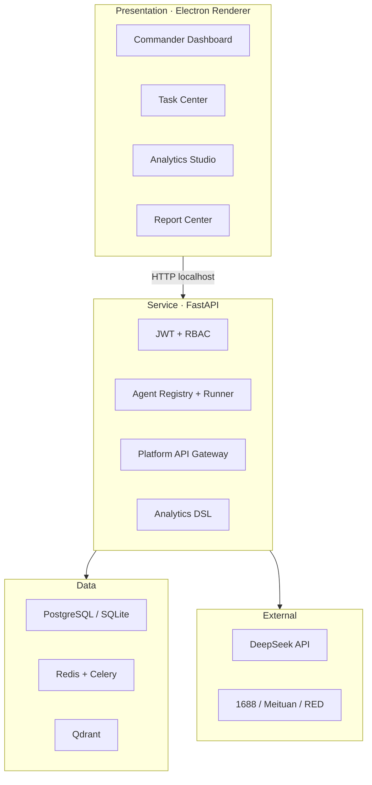
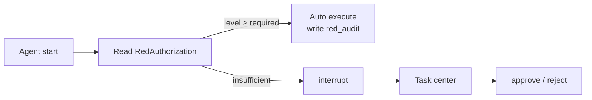

# From Demo to Desktop: Engineering Notes on a Multi-Agent E-Commerce Operations Hub

> **Abstract**: LLMs made “talking AI” ubiquitous, yet what small and mid-sized e-commerce teams often lack is not another chat box but a **local, auditable system that can touch inventory and money without hiding decisions in a black box**. This article documents the engineering story of **Multi-Agent E-Commerce Operations Hub V3.0**—from problem framing through M4 delivery: why an Electron + FastAPI + Vue local-first stack, how eight LangGraph agents collaborate under human-in-the-loop approval, and the real trade-offs behind data immutability rules, red authorization, and the analytics canvas. Architecture diagrams, state charts, and milestone retrospectives are included for developers building vertical agent systems.

**Interactive overview**: [Demo Space · Product Introduction](../pages/demo/product-intro.html)

---

## 1. Introduction: When “Good Recommendations” Are Not Enough

In 2025 I wrote on this blog about LangChain, multi-agent collaboration, tool use, and memory modules. On paper, agents looked like universal adapters that bolt hands and feet onto an LLM. Building an e-commerce operations hub taught me otherwise: **the hard part is not the prompt—it is the business boundary**.

Picture a typical operations day: morning trend scouting on Xiaohongshu (RED), midday price wars on 1688, afternoon Meituan orders and stock deductions, evening reports stitched in Excel. Context lives across browser tabs, WeChat threads, and spreadsheets—**no single source of truth, no decision trail you can replay**. By the time a “hot product” lands in a weekly deck, the window is often three to seven days gone.

Generic ERP excels at SKUs and documents. It struggles with sharper questions:

- How do competitor signals become comparable time series instead of gut feel?
- How do you score margin and supplier risk among thousands of lookalike listings?
- How do you keep multi-channel inventory aligned without silent oversell?

Agents seem to fill the gap—read notes, compare prices, draft reports. Let models place orders or move money, and compliance breaks immediately. Scope was fixed on day one: **AI assists, humans approve; funds stay on-platform; data stays on-machine**.

| In scope | Explicitly out |
|----------|----------------|
| RED insights + Meituan fulfillment + 1688 procurement loop | Pan-platform sprawl (Pinduoduo/Taobao/Douyin) |
| Recommendation lists and pre-filled forms | Payment proxy or fund custody |
| Official APIs + behavior capture + manual reconciliation | Rule-breaking crawlers |
| DeepSeek API + local CLIP vectors | On-prem 70B-class LLMs |

That boundary dictated the shape: **local data pool + interruptible agent graphs + task center**.

---

## 2. Architecture: A Local-First Four-Layer Design

The system converged on **Electron shell · Python FastAPI · Vue 3 · PostgreSQL / Redis / Qdrant**. The backend binds to `127.0.0.1` only—for SMB buyers, data residency is a procurement constraint, not a slogan.

*Fig. 1 · Layering from desktop UI through local backend, storage, and external AI/platform APIs*

### 2.1 Why Electron Instead of Yet Another SaaS Tab

Operators live on one PC all day. Electron buys more than cross-platform packaging:

1. **Terminal-style workflow**—multi-window, tray, auto-start (M5), closer to a Bloomberg desk than a lightweight admin UI;
2. **Clear payment boundary**—embedded browser opens real 1688 checkout; the app records behavior for reconciliation only;
3. **Co-located low latency**—DB and long-running agents sit beside the UI, decoupling stock deduction from public-network RTT.

The price is real too: installer size, PyInstaller + NSIS pipeline, service watchdog reliability—complexity we pay for **data sovereignty and closed-loop ops**.

### 2.2 Processes: Main, Renderer, and FastAPI

- **Electron main**: window lifecycle, tray, local service watchdog;
- **Renderer**: Vue app—dashboard, task center, analytics studio, 15+ routes;
- **FastAPI process**: hot reload friendly; agents and Celery jobs do not block the UI thread.

When dev port moved from 8500 to 8501, Vite proxy and `api/client.ts` drifted apart—an afternoon of 404s. Lesson: in local-first systems, **configuration is as critical as the agent graph** and belongs in docs and CI checks.

---

## 3. Data Layer: Seven Domains and One Non-Negotiable Rule

Twenty-five tables across seven domains: auth, catalog/inventory, procurement, orders, competitors, assets, agent monitoring. What matters is the rule running through all of them:

> **`inventory_records` is INSERT-only; reversals are negative rows; any write touching money, stock, or authority must land in immutable `audit_logs`.**

Competitor image features live in Qdrant; relational tables store `clip_vector_id` only—vectors and transactional data decouple. Each agent run logs to `agent_runs` (tokens, latency, status); human tasks map to `agent_tasks`, aligned with WebSocket events `agent_status` and `task_update`. **“What the model said” must always trace to “who approved what.”**

---

## 4. Multi-Agent System: Graphs, Interrupts, and Red Auth

Eight business agents (plus a demo agent for integration) share the `BaseAgent` → `Registry` → `Runner` pipeline. Each agent is a **stateful graph**: after tools, LLM calls, and DB access, nodes that touch **money, stock, or authority** call `interrupt`, enqueue a task card, and wait for `approve` / `reject`.

| Agent | Design intent | Human interrupt |
|-------|---------------|-----------------|
| Competitor monitor | Daily 8:00 crawl; CLIP + DeepSeek summary | None (fully automatic) |
| Product selection | 1688 search; margin and supplier scoring | After recommendation list |
| Procurement | No payment proxy; logistics → stock | PO creation, goods receipt |
| Order ops | Pull orders, deduct stock, ship, classify after-sales | Stockout, refunds |
| Inventory dispatch | Forecast + safety stock + expiry alerts | Replenishment approval |
| Asset steward | Full lifecycle and maintenance calendar | Scrap, major repair |
| Inspector | Change stream + anomaly detection + NL explanation | Severe alerts |
| Reporter | Metric aggregation + Jinja2 HTML + LLM narrative | None (daily 18:00) |

Externally: `POST /api/v1/agents/{name}/trigger`; approvals via task-center APIs; UI subscribes over WebSocket so “triggered” never means “lost in the void.”

### 4.1 Red Authorization: Auditable Degradation, Not Autopilot

When night shift is down to one person, automation may rise from L0 to L3—but that is **an explicitly audited emergency mode**, not handing authority to the model:

- **L0 (default)**: money, stock, authority—human confirm;
- **L1**: auto-ship when stock suffices, competitor crawl, replenishment suggestions;
- **L2**: high-confidence PO drafts, after-sales intent classification;
- **L3**: emergency replenishment with hard caps and red banner.

**Forever forbidden autonomously**: actual payment, large refunds, privacy export, audit log deletion. Red-period actions carry `red_audit`—ethics that skip the schema surface in incidents later.

### 4.2 Prompt Registry: Operators Edit Copy, Not Code

M4 centralized nine agent prompts in a registry synced to `agent_prompts` on startup. Settings UI edits templates; runtime calls `render_prompt(name, **vars)` with safe fallback—so one empty field does not take down production LLM calls.

---

## 5. Frontend: Information Density for Operators

Stack: Vue 3 Composition API, Ant Design Vue 4, Pinia, ECharts 5 (tree-shaken imports), `grid-layout-plus` drag canvas. The goal is **one screen for GMV, turnover, agent health, and anomalies**—a quant terminal, not a minimalist SaaS admin.

Where effort concentrated:

1. **Commander dashboard**—eight metric cards (M4.5 `commander-metrics`), agent grid, 24h anomaly feed;
2. **Task center**—priority-sorted cards, `Ctrl+Enter` quick approve;
3. **Analytics studio**—DSL (4 sources × 11 metrics × 7 dimensions × 5 windows), 12 presets + template CRUD;
4. **Settings (nine panes)**—LLM providers, platform keys, prompts, red auth, storage—with search and explanatory alerts.

Dark theme via CSS variables plus `darkAlgorithm`; `Ctrl+K` palette for sixteen routes—dogfooding habits turned into product.

**3D warehouse (Three.js)** stays a stub in M4: freeze API contracts, scan real shelf data later. An honest “pending site survey” beats a fake warehouse that misleads acceptance.

---

## 6. Milestones M0–M4: What “Done” Meant in Engineering Terms

Thirteen of fifteen weeks are behind us. “Done” meant:

| Phase | Window | Engineering Done |
|-------|--------|-------------------|
| **M0** Foundation | Weeks 1–2 | Login, dashboard, assets; JWT + RBAC closed loop |
| **M1** Core wiring | Weeks 3–5 | Product/order/inventory stack; hot-swappable platform mocks |
| **M2** Intelligence | Weeks 6–8 | Four agents triggerable; red console; DeepSeek wired |
| **M3** Inspection & reports | Weeks 9–10 | Inspector + reporter; WebSocket; `/anomalies` persisted |
| **M4** Depth | Weeks 11–13 | Analytics DSL + drag UI; prompt admin; theme + commands |
| **M5** Delivery | Weeks 14–15 | Electron ship kit, workshop (in progress) |

By May 2026: **97+ REST endpoints**, **zero TypeScript errors** at M4 close, one-command demo seed (~20 orders, ~¥520k GMV sample). **Clear but open**: production Electron installer, real platform OAuth, live 3D warehouse.

---

## 7. Scars and Trade-offs: Honesty Beats Polish

**(1) Stacked `/api/v1` prefixes**  
Routes registered with full prefix; client must not append again—otherwise `/api/v1/api/v1/...`. Surface bug, root cause: **no single source of truth for API base paths**.

**(2) Heavy ML vs installer size**  
Inspector originally targeted Isolation Forest + Prophet; M4 shipped Z-score, IQR, and exponential smoothing first to keep sklearn off the Windows bundle—not rejecting better models, but **proving anomaly → task → human closure first**.

**(3) The lure of “one more fully automatic node”**  
Each no-interrupt node needs audit and red-auth rules. Competitor crawl and daily reports can be automatic; procurement confirmation and refunds cannot—incidents demand “who authorized this.”

**(4) Strategic mock gateways**  
`xhs_mock`, `1688_mock`, `meituan_mock` unblock UI and agents before commercial API access. Real clients swap under `services/platforms/` **without changing agent contracts**—maintainability for vertical agents.

---

## 8. Security and Compliance: Five Pillars in Code

JWT (30-minute access + 7-day refresh) and four-role RBAC; TOTP in M5; localhost-only binding; AES-stored API keys; `audit_logs` plus `red_audit`; payments on 1688/Meituan with behavior capture for reconciliation; installer signatures planned for M5.

Severe inspector alerts require human closure with feedback—otherwise alerts decay into background noise within two weeks. Security is not slide-deck “five-in-one”; it is **preventing a system you cannot hold accountable**.

---

## 9. Boundary vs ERP and Cloud SaaS: What We Actually Add

| Dimension | Generic ERP | Cloud SaaS | This hub |
|-----------|-------------|------------|----------|
| Competitor intelligence | Weak | Rare | RED + CLIP + LLM summaries |
| Agent orchestration | None | Point copilot | Eight graphs + task center |
| Data residency | Sometimes on-prem | Often cloud | Local by default |
| Emergency delegation | RBAC | RBAC | L0–L3 red auth + dedicated audit |
| Analytics expression | Fixed reports | Partial custom | DSL + drag canvas |

We do not replace ERP general ledger—we compress **high-repeat, high-cognitive-load ops work** (scrolling feeds, price comparison, report assembly, chasing anomalies) into **approvable, replayable agent pipelines**.

---

## 10. M5 and Beyond: From Demo to Double-Click Install

M5 is about **delivery shape**: tray and service watchdog, PyInstaller backend, NSIS wizard, system workshop (agent swimlanes, API metrics, read-only SQL console). Real OAuth replaces mocks; UI and agent contracts should not care—mocks existed for that swap from day one.

If you build “domain know-how + multi-agent” systems, three lessons may beat a stack list:

1. **Draw interrupts on money, stock, and authority before raising automation**;
2. **Win yourself on local-first, then procurement and security**;
3. **Demo seed scripts matter as much as architecture diagrams**—without a clickable end-to-end path, reviews stay slides.

---

## Closing

This hub is my attempt to press a year of writing about agents, RAG, and data engineering into **real constraints**: platform API terms, payment compliance, human approval, immutable logs—each harder than tuning temperature.

Diagrams and capability matrices: [product introduction demo](../pages/demo/product-intro.html). General agent patterns: [Multi-Agent Collaboration](moban_new_md.html?md=../../context/20260421_zh_5.md) and [LangChain guide](moban_new_md.html?md=../../context/20260423_zh_1.md) on this site.

The installer is not double-click ready yet, but **from morning competitor capture to evening HTML report** already runs end-to-end on a laptop. The next post may cover Electron packaging and real 1688 OAuth—by then M5 should be landed.

---

*2026-06-03 · Engineering notes at M4 completion*
