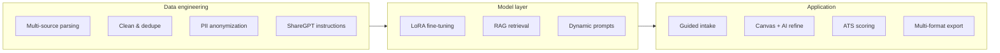

# Undergraduate Thesis Retrospective: An LLM-Based Intelligent Resume Generation Assistant

> **Abstract**: This article reviews an undergraduate thesis project—an **intelligent resume generation assistant powered by large language models**, spanning multi-source data engineering, domain fine-tuning, job-description alignment, and a deployable full-stack application. Written as a **technical achievement summary**: what problem was tackled, how the pipeline was built, what experiments and system tests showed, and what engineering lessons carried forward. **Names, student IDs, university, advisor, and other personally identifiable details are omitted.**

---

## 1. Motivation

As graduate cohorts grow, a resume is often the first gate in hiring. Three pain points recur:

- **Disorganized narratives**—rich experience, weak emphasis on role-relevant skills and metrics;
- **Weak job fit**—one resume reused across JDs without keyword and structure alignment;
- **ATS-unfriendly layout**—tables, keyword stuffing, or non-standard headings that break parsing.

LLMs polish prose well, but resume generation is not open-ended continuation. It combines **hard factual constraints**, **rigid structure**, and **high-stakes outcomes** (privacy, fairness, credibility). The thesis therefore targets an **end-to-end, traceable, constrained** system: anonymized high-quality training data, hallucination control with domain adaptation, and an application layer with ATS feedback plus human-editable output.

---

## 2. Technical Route: Four-Stage Generation + Three Engineering Tracks

The core narrative is **parse → complete → align to job → generate with style**, implemented along three tracks:

### 2.1 Data Engineering

A pipeline for **heterogeneous resume sources** includes:

| Stage | Practice | Goal |
|-------|----------|------|
| Schema unification | Canonical field mapping for JSON and plain text | One training interface |
| Deduplication | Near-duplicate merging | Reduce bias repetition |
| PII anonymization | Consistent fake names, masked phones/emails/IDs | Compliance |
| Quality gates | Manual checks + rules | Control noise |
| Instruction building | Multi-template ShareGPT dialogs | LLaMA-Factory-ready SFT |

Roughly **150k** ShareGPT instruction samples (with augmentation) were produced, plus a **held-out RAG corpus** of strong resume snippets. A **JD–resume matching scorer** blends skill match, experience relevance, and semantic similarity for retrieval and prompt injection.

### 2.2 Model Layer

- **Backbone**: Qwen3.5-9B-Instruct  
- **Fine-tuning**: LLaMA-Factory, LoRA (typical rank 16 / alpha 32), FP16 + gradient checkpointing on 24GB-class GPUs  
- **Generation**: Top-K RAG snippets + **dynamic prompts** (career direction, tone, JD keywords)  
- **JD semantics**: **BERT-Whitening** for embedding alignment; thesis reports **~85% Top-5** match accuracy vs weaker baselines  

### 2.3 Application System

**React 19 + TypeScript** frontend, **FastAPI** backend, bilingual UI. Six functional pillars:

1. Structured extraction (education, work, projects, skills);  
2. Job-oriented generation;  
3. Refine / review / revise workflows;  
4. **ATS scoring** (keywords, skills, experience fit, format, quantified results);  
5. Export to Markdown, PDF, Word, PNG with live canvas preview;  
6. Security stack—PII handling, bias controls, prompt-injection defenses.

---

## 3. Experiments: What the Numbers Mean

### 3.1 Ablation (representative thesis-scale results)

| Variant | BLEU-4 | ROUGE-L | BertScore | ATS score |
|---------|--------|---------|-----------|-----------|
| Backbone zero-shot | 28.2 | 26.4 | 0.812 | 67.3 |
| + LoRA | 38.7 | 37.9 | 0.865 | 78.5 |
| + LoRA + RAG | 41.4 | 40.3 | 0.883 | 82.1 |
| **Full (+ dynamic prompt)** | **43.1** | **42.6** | **0.901** | **85.6** |

**LoRA** drives format and terminology; **RAG** enriches content; **dynamic prompts** lift JD keyword alignment. ANOVA and corrected post-hoc tests reported significant differences across variants.

Closed-model comparisons (GPT-4o, Claude-3.5-Sonnet) used **unified inputs, prompts, sampling, and post-processing**; the full pipeline matched or exceeded strong baselines on automatic metrics with lower perplexity.

### 3.2 Factual Consistency

Triple checks—NLI contradiction, temporal rules, human audit—showed full-model NLI conflict rate dropping to about **3.6%** vs **14.5%** for zero-shot backbone; human factual error rate about **2.8%** vs **11.2%**. For resumes, **truthfulness beats fluency**.

### 3.3 System-Level Validation

- Field extraction macro-F1 about **0.90**;  
- ATS vs multi-agent “invite rate” proxy: Pearson **r ≈ 0.78**;  
- End-to-end latency about **1.9s** on RTX 4090, **1.5s** on A100 (under 3s target);  
- Small user study favored guided intake, RAG references, and ATS feedback—the **generate → score → improve** loop was heavily used.

### 3.4 Security in Depth

Four-layer PII handling, fairness prompts + lexicon + semantic bias classifier, twin-resume pairwise audits, and three-tier injection defense (~**80.7%** success on common attacks, <15ms average intercept). Employment-facing AI must ship safety with UX.

---

## 4. Deployment Engineering

Artifacts support **LoRA merge** plus **FP16 / INT8 / INT4 (AWQ)** export. Serving modes include PEFT hot-swap, OpenAI-compatible LLaMA-Factory API, and **vLLM** for production (~5GB-class quantized footprints). **Docker Compose** bundles API + Redis sessions—moving from notebook demos to operable services with degradation paths when inference fails.

This connects vertically to earlier notes on [data engineering](moban_new_md.html?md=../../context/20260423_zh_3.md) and [RAG](moban_new_md.html?md=../../context/20260420_zh.md) on this site.

---

## 5. Deliverables and Personal Takeaways

| Dimension | Output |
|-----------|--------|
| Data | Pipeline + ~150k instruction set + RAG store |
| Methods | JD–resume matching + LoRA/RAG/dynamic prompt generation |
| System | Interactive assistant with ATS, export, compliance |
| Evidence | Automatic metrics, ablation, consistency checks, performance & usability |

Engineering lessons:

1. **Constraints first** in vertical LLM apps—factual anchoring, editable canvas, explainable ATS beat raw creativity.  
2. **Data work dominates**—anonymization and quality gates cap fine-tuning gains.  
3. **Evaluate on two layers**—similarity metrics plus “would a recruiter trust this?”  
4. **Disclosed AI assistance** for ancillary tasks; core design, experiments, and implementation require independent ownership—consistent with other [engineering posts](moban_new_md.html?md=../../context/20260603_zh_1.md) here.

---

## 6. Limits and Future Work

- Real hiring outcomes remain partially proxied by ATS and agent simulations;  
- Multimodal resumes and deep cross-industry adapters are open;  
- Larger backbones and preference learning cost more data and compute.

Thesis outlook topics—multilingual support, online feedback optimization, stronger privacy techniques—are noted without turning this post into a grant proposal.

---

## Closing

The project pushes LLMs from “can write” toward “helps candidates write **correctly, relevantly, and confidently**.” Data work answers whether training is responsible; LoRA + RAG + prompts answer job fit; ATS + canvas answer usability; security answers whether the tool can be discussed seriously in hiring tech.

If you build **vertical document generation**, map your own interrupt points and evaluation tiers the same way. Search this blog under **LLM · resume generation · LoRA · RAG · data engineering** for related reading.

---

*2026-06-03 · Undergraduate achievement summary (de-identified)*
