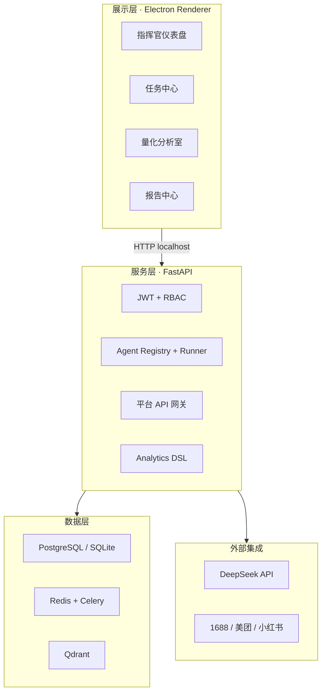
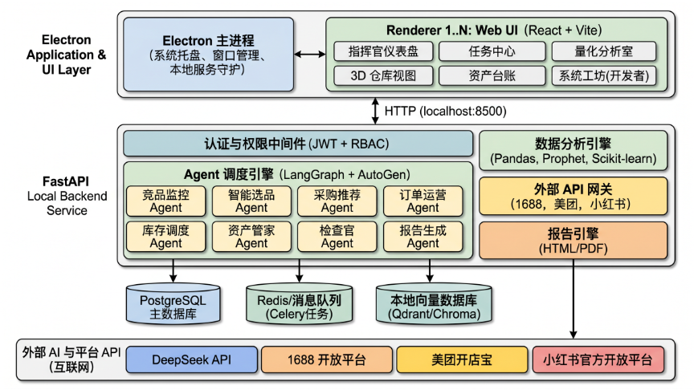
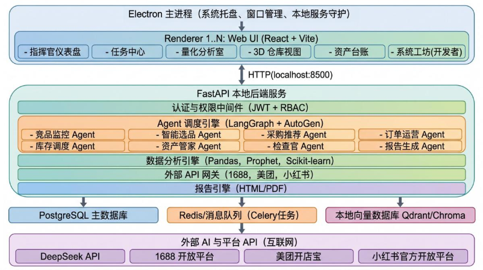
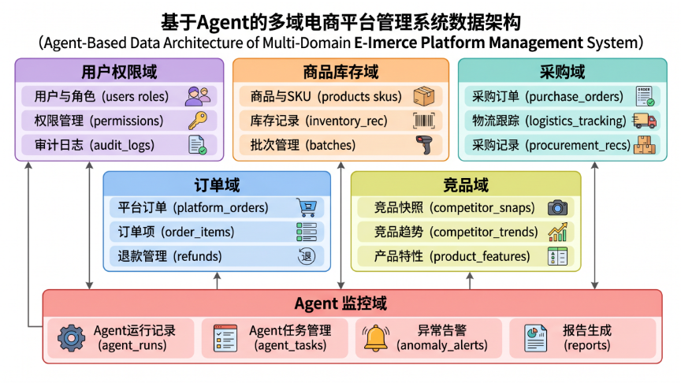
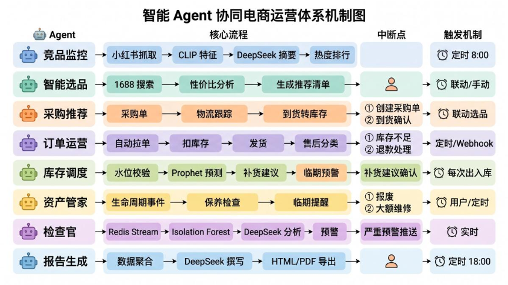
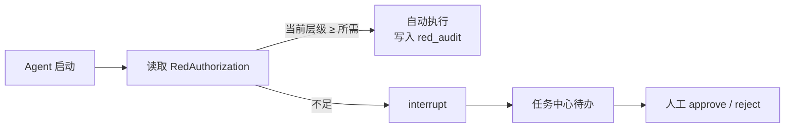
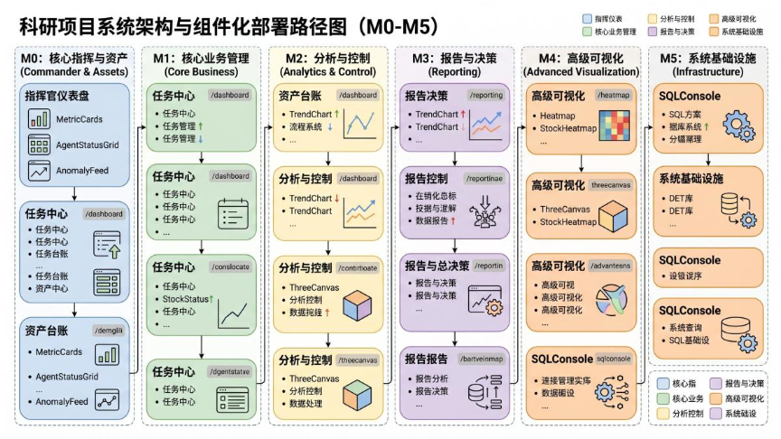

# 从 Demo 到桌面：多 Agent 电商运营中枢的工程实践手记

> **摘要**：大模型让「会说话的 AI」触手可及，但中小型电商团队真正缺的，往往不是又一个聊天框，而是一套**能跑在本地、敢碰钱和货、每一步可审计**的运营系统。本文记录「多 Agent 电商运营中枢 V3.0」从问题定义到 M4 落地的完整工程叙事：为何选择 Electron + FastAPI + Vue 的本地优先架构，八个 LangGraph Agent 如何在「人工终审」下分工协作，以及数据铁律、红色放权、量化分析室等设计背后的真实取舍。文中有架构图、状态图与里程碑复盘，适合正在做垂直行业 Agent 的开发者阅读。

**交互式导读**：[Demo 空间 · 产品介绍页](../pages/demo/product-intro.html)（含架构图与能力矩阵）

---

## 一、引言：当「会推荐」还不够

2025 年，我在博客里写过 LangChain、多智能体协作、工具调用与记忆模块——纸上谈兵时，Agent 像是给 LLM 装上手脚的万能钥匙。真正动手做电商运营系统之后才发现：**最难的不是 prompt，而是业务边界**。

想象一个典型运营日：早上在小红书刷爆款、记笔记；中午在 1688 比价、和供应商扯皮；下午处理美团订单、扣库存、回售后；傍晚打开 Excel 拼日报。这些动作散落在十几个浏览器标签、微信群和表格里——**没有统一上下文，也没有可追溯的决策链**。等爆款趋势写进周报，窗口期往往已经过去三五天。

通用 ERP 擅长管 SKU 和单据，却难以回答三个更尖锐的问题：

- 竞品热度如何从「感觉」变成可对比的时间序列？
- 选品时，如何在成千上万同款里量化毛利与供应商风险？
- 多平台订单与库存如何同步，避免超卖与静默缺货？

Agent 似乎能补上这块拼图：读笔记、比价格、写报告。但若让模型代下单、代付款，合规与风险立刻击穿底线。于是项目在立项之初就划清射程——**AI 辅助决策，人工终审把关；资金不托管，数据不出本机**。

| 在射程内 | 明确不做 |
|----------|----------|
| 小红书洞察 + 美团履约 + 1688 采购闭环 | 全平台大而全（拼多多/淘宝/抖音） |
| 推荐清单与预填单 | 代付、资金托管 |
| 官方 API + 行为采集 + 手工对账 | 规则外的爬虫 |
| DeepSeek API + 本地 CLIP 向量 | 本地部署 70B 级大模型 |

这条边界反过来锁定了技术形态：**本地数据池 + 可中断的 Agent 状态图 + 任务中心**。下文按「为什么 → 怎么搭 → 踩过什么坑 → 接下来去哪」展开。

---

## 二、总体架构：本地优先的四层设计

系统最终收敛为 **Electron 桌面壳 · Python FastAPI 本地服务 · Vue 3 前端 · PostgreSQL / Redis / Qdrant 三存储**。后端只监听 `127.0.0.1`，商业数据默认留在运营者自己的硬盘上——对中小型团队而言，这不是情怀，而是采购决策里的硬约束。

*图 1 · 从桌面 UI 到本地后端、三存储与外部 AI/平台 API 的分层关系*

### 2.1 为什么是 Electron，而不是再做一个 SaaS

运营同学习惯「一台电脑从早用到晚」。Electron 带来的不只是跨平台壳，而是三类工程能力：

1. **工作台式交互**：多窗口、系统托盘、开机自启（M5 交付），接近 Bloomberg 终端的使用节奏；
2. **支付边界清晰**：内嵌浏览器打开 1688 原链接完成付款，系统只记录行为与对账数据；
3. **同机低延迟**：数据库与 Agent 长任务与 UI 同驻，避免把库存扣减链路绑在公网 RTT 上。

代价同样实在：安装包体积、PyInstaller + NSIS 的打包链、主进程守护服务的可靠性——这是为**数据主权与操作闭环**主动支付的复杂度。

### 2.2 进程模型：主进程、渲染进程与 FastAPI

- **Electron 主进程**：窗口生命周期、托盘、本地服务守护；
- **Renderer**：Vue 应用，指挥官仪表盘、任务中心、量化分析室等 15+ 页面；
- **FastAPI 独立进程**：热重载友好，Agent 与 Celery 长任务不阻塞 UI 线程。

开发期曾把端口从 8500 迁到 8501，结果 Vite proxy 与 `api/client.ts` 各写各的——一下午的 404 才教会我：**本地优先项目里，「配置」和 Agent 图一样属于核心资产，必须进文档与 CI 检查。**

---

## 三、数据层：七个业务域与一条不可妥协的铁律

二十五张表划入七个域：用户权限、商品库存、采购、订单、竞品、资产、Agent 监控。域划分本身并不稀奇，稀奇的是贯穿全局的一条铁律：

> **库存流水 `inventory_records` 仅允许 INSERT；冲红用负记录；凡触及资金、库存、权限的写操作，必须进入不可篡改的 `audit_logs`。**

竞品笔记的首图特征进 Qdrant，关系库只存 `clip_vector_id`——向量与事务数据解耦，换向量库时不必动订单表。每次 Agent 运行写入 `agent_runs`（Token、耗时、状态），待办落入 `agent_tasks`，与任务中心、WebSocket 事件 `agent_status` / `task_update` 一一对应。这样，**「模型说了什么」永远能追到「谁批准了什么」**。

---

## 四、多 Agent 体系：状态图、中断点与红权

八个业务 Agent（另有一个 demo Agent 用于联调）共享 `BaseAgent` → `Registry` → `Runner` 管线。每个 Agent 在实现上是一张 **LangGraph 风格的有状态图**：工具调用、LLM 推理、数据库读写之后，凡触及**钱、货、权**的节点，一律 `interrupt`，向任务中心投递卡片，等待 `approve` / `reject`。

| Agent | 设计意图 | 人工中断 |
|-------|----------|----------|
| 竞品监控 | 每日 8:00 抓取；CLIP 向量化 + DeepSeek 摘要 | 无（全自动） |
| 智能选品 | 1688 检索；毛利与供应商评分 | 推荐清单生成后 |
| 采购推荐 | 不代付；物流跟踪 → 到货转库存 | 创建采购单、到货确认 |
| 订单运营 | 拉单、扣库存、发货、售后意图分类 | 库存不足、退款 |
| 库存调度 | 时序预测 + 安全库存 + 临期预警 | 补货建议 |
| 资产管家 | 设备全生命周期与保养计划 | 报废、大额维修 |
| 检查官 | 变动流 + 异常检测 + 自然语言解释 | 严重预警 |
| 报告生成 | 指标聚合 + Jinja2 HTML + LLM 叙述 | 无（每日 18:00） |

对外统一 `POST /api/v1/agents/{name}/trigger`；审批与批量操作走任务中心 API；前端通过 WebSocket 订阅运行态，避免「点了触发不知道跑到哪」的焦虑。

### 4.1 红色放权：缺人时的可审计降级，而非黑盒自动驾驶

夜班只剩一人时，系统允许把自动化从 L0 抬到 L3——但这不是「把权限交给模型」，而是**在审计链上显式标记的应急策略**：

- **L0（默认）**：凡动钱、动货、动权，一律人工确认；
- **L1**：库存充足时自动发货、竞品抓取、生成补货建议；
- **L2**：高置信度采购草稿、售后意图自动分类；
- **L3**：紧急补货匹配供应商（全程红色横幅 + 金额硬顶）。

**永远禁止自主执行**：实际支付、大额退款、隐私导出、删除审计日志。红权期间的每条自动动作带 `red_audit`——产品伦理若不能写进 schema，迟早会在事故里还债。

### 4.2 Prompt 注册中心：让运营改文案，而不是改代码

M4 将九个 Agent 的提示词收入 `prompts.py` 注册表，启动时 `ensure` 同步到 `agent_prompts` 表。设置页可直接编辑，调用侧统一 `render_prompt(name, **vars)`，空内容自动回退默认模板——避免一次手滑把生产 LLM 链路打挂。

---

## 五、前端：运营终端的信息密度

技术选型：Vue 3 Composition API、Ant Design Vue 4、Pinia、ECharts 5（按需打包）、`grid-layout-plus` 拖拽画布。目标不是「简洁后台」，而是让运营**一屏看见 GMV、库存周转、Agent 健康度与异常流**——类似量化终端，而非轻量 SaaS。

投入精力最多的四个模块：

1. **指挥官仪表盘**：八张指标卡（M4.5 `commander-metrics`）、Agent 状态格、24 小时异常流；
2. **任务中心**：按紧急度排序的卡片流，`Ctrl+Enter` 快捷审批；
3. **量化分析室**：Analytics DSL（4 数据源 × 11 指标 × 7 维度 × 5 时间窗），12 个内置预设 + 模板存取；
4. **设置中心（九标签）**：LLM 提供商、平台密钥、Agent 提示词、红权、存储等——搜索框 + 解释性 Alert，降低「不敢改配置」的心理门槛。

暗色主题用 CSS 变量叠加 Ant Design `darkAlgorithm`；`Ctrl+K` 命令面板覆盖 16 个路由跳转——来自自己 dogfood 时「手不离开键盘」的习惯。

**3D 仓库（Three.js）** 在 M4 保持占位：接口契约先冻结，待实地勘察货架数据后再渲染。宁可 Demo 里诚实写「待勘察」，也不画一座误导验收的假仓库。

---

## 六、里程碑 M0–M4：「完成」在工程上意味着什么

十五周路线图里，前十三周已走完主体。各阶段在我心里的「完成定义」如下：

| 阶段 | 周期 | 工程上的 Done |
|------|------|----------------|
| **M0** 基础底座 | 第 1–2 周 | 登录、仪表盘、资产台账；JWT + RBAC 闭环 |
| **M1** 核心连接 | 第 3–5 周 | 商品/订单/库存全栈；三平台 mock 网关可热替换 |
| **M2** 智能注入 | 第 6–8 周 | 四 Agent 可触发；红权控制台；DeepSeek 贯通 |
| **M3** 检查与报告 | 第 9–10 周 | 检查官 + 报告 Agent；WebSocket；`/anomalies` 落库 |
| **M4** 深度体验 | 第 11–13 周 | 分析 DSL + 拖拽画布；Prompt 管理；主题与命令面板 |
| **M5** 交付增强 | 第 14–15 周 | Electron 守护、NSIS、系统工坊（进行中） |

截至 2026 年 5 月：后端 **97+ REST 端点**，前端在 M4 收尾时 **TypeScript 零错误**，`scripts/seed_demo.py` 一键注入演示数据（约 20 单订单、五十万级 GMV 样本）。**尚未完成但路径已清晰**的，是生产级 Electron 安装包、三平台真实 OAuth，以及 3D 仓库实装。

---

## 七、踩过的坑：诚实比漂亮更重要

**（1）API 前缀「叠罗汉」**  
路由注册已带 `/api/v1`，客户端若再拼一层，就会出现 `/api/v1/api/v1/...`。最终约定：注册处写全前缀，client 只发相对路径——这类 bug 表面是配置，本质是**缺少单一真相源（Single Source of Truth）**。

**（2）重 ML 依赖与 Windows 安装包体积**  
检查官原案用 Isolation Forest + Prophet；M4 先用 Z-score、IQR 与指数平滑跑通闭环，把 sklearn 全家桶挡在安装包之外。不是否定算法，而是**先证明「异常 → 任务 → 人处理」链路成立**。

**（3）「再加一个全自动节点」的诱惑**  
每多一个无中断节点，就要多写审计规则与红权校验。竞品抓取与日报生成可以全自动；采购确认与退款处理不能——否则事故时无法回答「谁授权的」。

**（4）Mock 网关的战略价值**  
`xhs_mock`、`1688_mock`、`meituan_mock` 让前端与 Agent 不阻塞在商务对接上。真 API 上线时只换 `services/platforms/` 实现，**Agent 入参与任务模型保持不变**——这是垂直 Agent 系统可维护的关键。

---

## 八、安全与合规：写进代码的五根支柱

身份层用 JWT（access 30 分钟 + refresh 7 天）与四角色 RBAC，TOTP 在 M5 实装；网络层坚持 localhost 绑定，API Key AES 入库；审计层区分日常 `audit_logs` 与红权 `red_audit`；资金层坚持「支付在平台完成，系统只采集对账行为」；完整性层规划安装包签名校验。

检查官对严重预警强制「人处理 + 反馈闭环」——否则告警会在两周内贬值为背景噪音。安全不是 PPT 上的「五位一体」，而是**阻止系统悄悄变成不可追责的黑盒**。

---

## 九、与 ERP、云端 SaaS 的边界：我们补哪一块

| 维度 | 通用 ERP | 云端 SaaS | 本系统 |
|------|----------|-----------|--------|
| 竞品情报 | 弱 | 少见 | 小红书 + CLIP + LLM 摘要 |
| Agent 编排 | 无 | 单点 Copilot | 八张状态图 + 任务中心 |
| 数据驻留 | 可本地 | 多在云端 | 默认本机 |
| 应急放权 | 角色权限 | 角色权限 | L0–L3 红权 + 专项审计 |
| 分析表达 | 固定报表 | 部分自定义 | DSL + 拖拽画布 |

定位不是取代 ERP 的财务总账，而是把运营里**高重复、高认知负担**的环节——刷帖、比价、拼报表、追异常——收敛进**可审批、可回放**的 Agent 流水线。

---

## 十、M5 与之后：从可演示到可安装

M5 的重心不是堆功能，而是**交付形态**：Electron 托盘与服务守护、PyInstaller 后端、NSIS 安装向导、系统工坊（Agent 泳道图、API 用量、只读 SQL 控制台）。真实平台授权替换 mock 时，UI 与 Agent 契约应无感——mock 层从第一天就为这一刻存在。

若你也在做「行业 Know-how + 多 Agent」，三条经验或许比技术栈名单更有用：

1. **先把中断点画在钱、货、权上**，再讨论自动化比例；
2. **本地优先要先说服自己**，再拿去说服采购与安全部门；
3. **Demo 种子脚本与架构图同等重要**——没有可点击的端到端链路，评审只剩幻灯片。

---

## 结语

多 Agent 电商运营中枢，是我把过去一年关于 Agent、RAG、数据工程的思考**压进真实约束**的一次练习：平台 API 条款、资金合规、人工终审、不可删日志——每一项都比调高 `temperature` 更耗神经。

实现细节与图示见 [Demo 产品介绍](../pages/demo/product-intro.html)；通用 Agent 范式可对照本站 [多智能体协作](moban_new_md.html?md=../../context/20260421_zh_5.md)、[LangChain 全解](moban_new_md.html?md=../../context/20260423_zh_1.md) 延伸阅读。

安装包尚不能双击即用，但**从清晨竞品抓拍到傍晚 HTML 日报**的链路，已能在本机完整跑通。下一篇，或许会写 Electron 打包与 1688 真实授权联调——那时 M5 应该已经落地。

---

*2026-06-03 · 基于 M4 主体完成态的工程手记*
