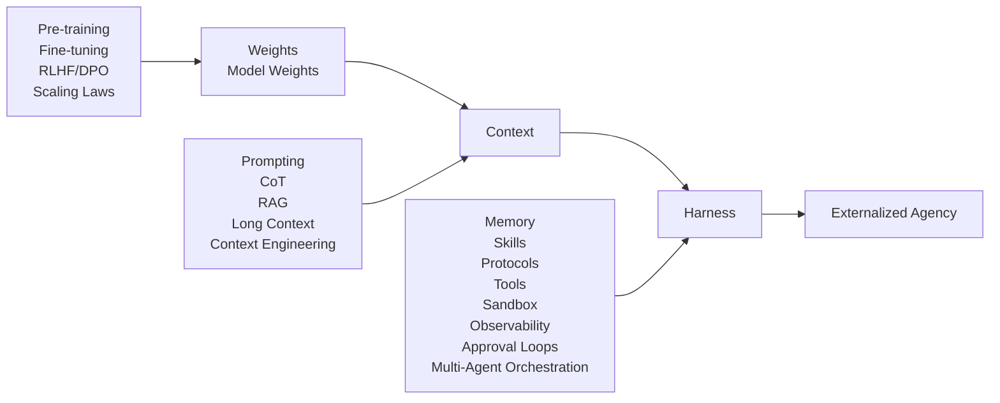
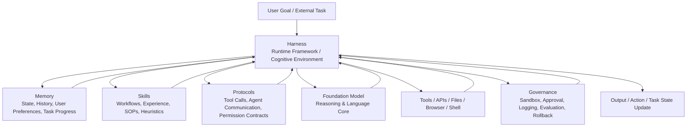
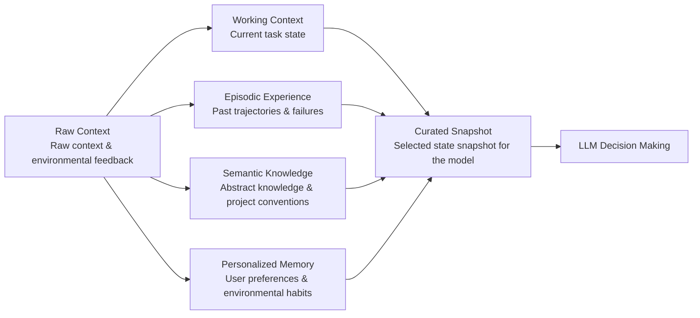
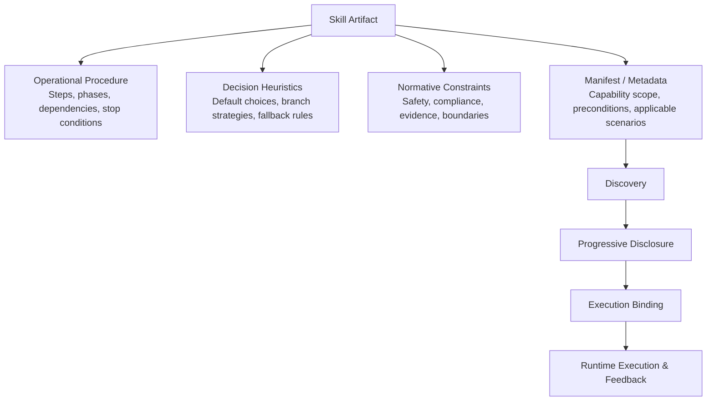
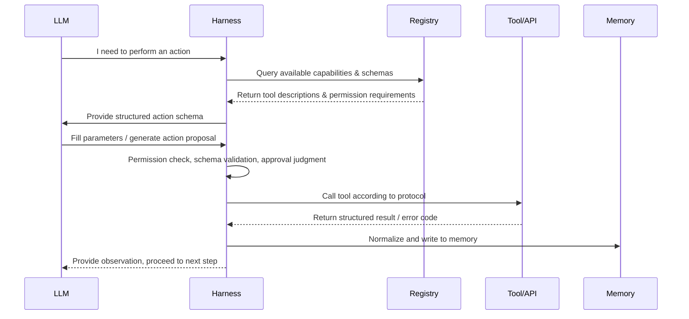
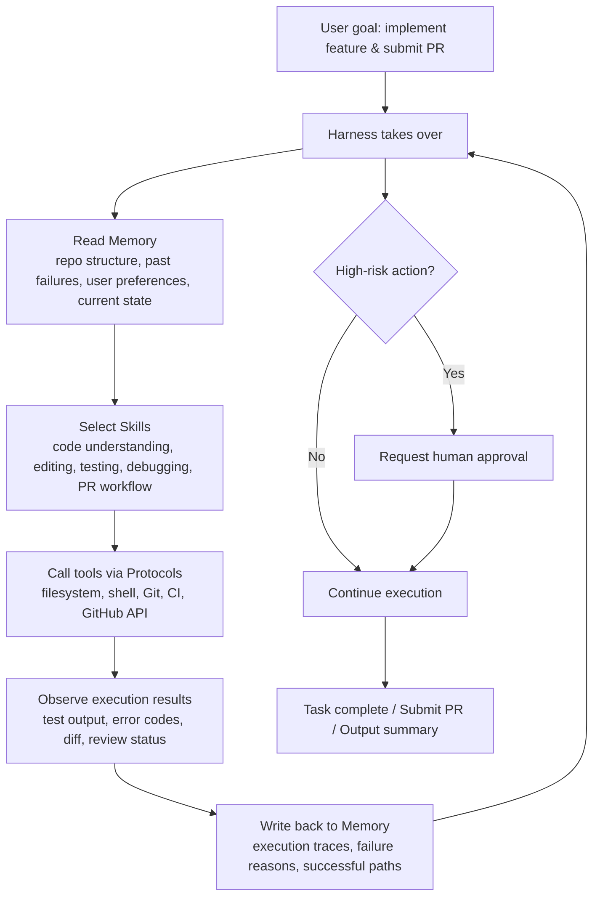

# Why AI Agents Are More Than Just "Large Language Models": Understanding Memory, Skills, Protocols, and Harness from an Externalization Perspective

> Based on the paper: **Externalization in LLM Agents: A Unified Review of Memory, Skills, Protocols and Harness Engineering**
> Target audience: Beginners to AI Agents who want to build a systematic understanding.
> Core question: Why are truly useful AI agents today relying not just on a stronger LLM, but on a whole "cognitive infrastructure" outside the model?

---

## 0. First, a High-Level Judgment: This Paper Is Not About Components—It's About Where Intelligence Resides

If you are just starting to learn about AI, it is easy to develop an intuition:

> AI is stronger because the model is larger, has more parameters, more training data, and better reasoning ability.

That is certainly not wrong, but this paper wants to show us: **This is only part of the source of an AI agent's capabilities.**

A truly complex agent—one that can write code, search for information, operate software, collaborate over long periods, manage tasks, call tools, remember user preferences, communicate with other agents—its capabilities often come not just from inside the model, but from the runtime environment surrounding the model. The paper's abstract states directly that LLM agents are increasingly built not by changing model weights, but by reorganizing the runtime around the model; capabilities that were previously expected to be "recovered inside the model" are now externalized into memory stores, reusable skills, interaction protocols, and the surrounding harness.

The core term in this paper is:

> **Externalization.**

Externalization means:
Taking the cognitive burden that the model would have to handle internally—but which is unstable, opaque, hard to update, and hard to govern—and moving it outside the model, into structures that can be saved, inspected, reused, composed, and constrained.

Thus, an agent's capabilities no longer reside only in the model weights, but are distributed across:

Model weights, context, memory systems, skill systems, protocol layers, tool systems, permission systems, logging systems, sandboxes, approval workflows, evaluators, multi-agent orchestration, and the entire harness runtime framework.

What this paper truly helps us build is a crucial systems view of AI:

> **The AI agent of the future is not an isolated brain, but a system organized by an external cognitive infrastructure.**

---

## 1. Paper in One Sentence: From Weights to Context to Harness

The most important historical thread in the paper is:

> **Weights → Context → Harness**

That is:

> Capabilities were first understood as abilities inside model weights;
> then understood as abilities inside context and prompts;
> and now increasingly understood as abilities inside the infrastructure surrounding the model.

Section 2 of the paper explicitly characterizes the recent development of LLM agents as a process of "moving outward from the model itself": capabilities were first seen as properties of weights, then as properties of prompts and context windows, and now increasingly as properties of the model's operational infrastructure; Figure 2 also shows the community's themes expanding from Weights and Context to Harness, including tool ecosystems, protocols, skills, multi-agent orchestration, etc.

We can first use a Mermaid diagram to establish the overall framework:

This trajectory does not say that weights are unimportant, nor that context is unimportant. The paper emphasizes that these three layers are additive, not substitutive. Weights still provide general linguistic ability, reasoning ability, and world knowledge; Context still provides task materials and temporary constraints; Harness is responsible for organizing long-term state, reusable procedures, tool interactions, permission governance, and execution feedback into a runnable system.

More colloquially:

> **Weights are the brain's base.**
> **Context is the current workbench.**
> **Harness is the work environment, tool room, systems, processes, and operating system.**

---

## 2. Why Call It "Externalization"? Start with Human Cognition

The paper does not begin directly with engineering components; it borrows Donald Norman's theory of "cognitive artifacts."

Norman's core idea is:

> Cognitive artifacts do not change human capabilities. They change the task.

The paper uses shopping lists and maps as examples. A shopping list does not increase your biological memory capacity, but it transforms "recalling what I need to buy from memory" into "recognizing what I need to buy by looking at the list." A map does not directly make you a better navigator, but it turns hidden spatial relationships into a visible structure, allowing you to solve the problem using visual recognition and pathfinding. The paper thus argues that the power of external tools lies in representational transformation—changing the representation of the problem so that the agent can solve it more reliably using its existing abilities.

This idea is very important because it will change how you view AI agents.

In the past, we might have asked:

> Can this model remember user preferences?
> Can this model stably execute complex workflows?
> Can this model call tools correctly?
> Can this model manage its own permissions and failure recovery?

The externalization perspective would counter:

> Why must the model do all these things "inside its brain"?
> Could we externalize long-term state into a memory system?
> Could we write complex workflows as skills?
> Could we use protocols to specify tool-calling formats?
> Could we use a harness to manage permissions, logs, sandboxes, approvals, and failure recovery?

Just as humans do not rely solely on their brains to remember everything—we use notes, calendars, maps, folders, operating systems, project management tools, Git, test frameworks, coding standards, and team processes.

So too for AI agents. A good agent is not just "a smarter model"; it is:

> **The task is reorganized into a form that the model can complete more reliably.**

---

## 3. The Paper's Four Major Proposals: Memory, Skills, Protocols, Harness

The Introduction gives four systematic propositions:

| Module         | What is externalized       | Problem solved                              | How the task changes                                                   |
| -------------- | -------------------------- | ------------------------------------------- | ---------------------------------------------------------------------- |
| **Memory**     | State across time          | Agents forget easily, context is limited    | From recall to retrieval / recognition                                 |
| **Skills**     | Procedural expertise       | Re-inventing workflows each time, high variance | From improvised generation to guided composition                       |
| **Protocols**  | Interaction structure      | Fragile communication between tools, agents, users | From ad hoc coordination to structured contract                        |
| **Harness**    | Unified runtime environment | Modules cannot form a stable action system by themselves | Organizing externalized modules into governed execution                |

The paper states explicitly that Memory systems externalize state across time, Skill systems externalize procedural expertise, Protocols externalize interaction structure, and Harness engineering unifies these modules into a runtime environment with constraints, observability, feedback, and control.

It is important to note: **Harness is not a fourth module alongside Memory, Skills, and Protocols.**

Memory, Skills, and Protocols are three types of externalized content; Harness is the external runtime framework that makes them work together. The paper also emphasizes that the harness is not a fourth externalization beyond memory, skills, and protocols, but the runtime environment in which these externalized forms operate and interact.

You can think of it this way:

> Memory is the agent's external memory.
> Skills are the agent's external experience manual.
> Protocols are the agent's external communication contracts.
> Harness is the agent's external operating system.

---

## 4. Layer One: Weights—Why Model Weights Matter, but Are Not Enough

The Weights layer corresponds to the earliest and most classic paradigm of modern LLMs: capabilities reside mainly in model parameters.

Pre-training compresses statistical regularities, world knowledge, linguistic abilities, and reasoning habits into weights. Scaling laws reinforce the intuition that larger models, more data, and more training yield stronger capabilities. Supervised fine-tuning, preference optimization, RLHF, DPO, and other methods further shape instruction-following, conversational style, refusal behavior, and domain-specific habits. The paper notes that in this view, improving an agent often means modifying or replacing the model itself.

The weights layer has clear advantages.

It is fast. Knowledge and capabilities are already inside the model, requiring no external database retrieval each time.

It is compact. Deployment mainly relies on the model itself, not necessarily a complex system.

It generalizes well. The same model can answer medical questions, write poetry, debug code, and summarize contracts without building a separate pipeline for each task.

But the problems with the weights layer are fundamental:

> It couples knowledge, processes, and strategies too tightly in a static, hard-to-interpret, hard-to-update parameter space.

For example, if a fact changes, it is difficult to update precisely just that fact. If a user has a specific preference, it is hard to personalize for millions of users at the model weights layer. If an agent makes a mistake, it is also hard to audit whether the error came from wrong knowledge, wrong process, wrong strategy, or misleading context.

Thus, the paper says the core limitation of parametric knowledge is the difficulty of selective updating, composition, and governance. This is tolerable for single-turn Q&A, but once an agent enters long-term task execution, where state accumulates, workflows need stability, and tools need coordination, these problems become very prominent.

This is why capabilities began to move from weights to context.

---

## 5. Layer Two: Context—Making Model Behavior Orchestrate-able

The emergence of the Context layer represents developers realizing:

> You can significantly change model behavior without modifying model weights.

Prompt engineering, few-shot examples, role descriptions, Chain-of-Thought, Self-Consistency, ReAct, Tree of Thoughts, Self-Refine, RAG, etc., are all important technologies at the Context layer. The paper says that in this phase, attention shifted from model modification to input design; the same model, under different prompts, different contexts, and different retrieved evidence, can exhibit different capabilities.

RAG is a particularly important example.

Previously we asked:

> Does the model know fact X?

After RAG, we ask:

> If we retrieve fact X and put it into the context, can the model recognize, understand, and use it?

This is exactly the shift from recall to recognition.

The model does not have to "remember" all knowledge from its weights; the system can retrieve relevant documents and put them into the context for the model to read and apply. The paper explicitly views RAG as a more systematic form of externalization because it dynamically injects external documents at query time, shifting attention from "what the model has internalized" to "how the information pipeline around each call is organized."

But the Context layer also has boundaries.

Context windows are limited, token costs are high, and long prompts can introduce noise. The paper mentions that long prompts may suffer from the "lost in the middle" phenomenon, where information placed in the middle of a long context is used less effectively; even if context length expands from 2K to 100K or more, selective curation remains necessary.

More importantly, Context is temporary.

Without external state management, each new conversation still suffers partial amnesia. A prompt can tell the model "please follow these steps," but the prompt itself cannot reliably ensure that state persists across conversations, workflows are scheduled, sub-agents are coordinated, failures are recovered, permissions are enforced, and logs are recorded.

Thus, systems continue to move outward, to the Harness layer.

---

## 6. Layer Three: Harness—Agent Engineering Is Becoming Runtime Environment Engineering

Harness is the most important concept in this paper.

The paper says that as context windows saturate and prompt templates become increasingly unwieldy, engineering attention is shifting from:

> "What should we tell the model?"

to:

> "What environment should the model run in?"

In mature agent systems, reliability increasingly relies on external memory stores, tool registries, protocol definitions, sandboxes, sub-agent orchestration, compression pipelines, evaluators, test harnesses, and approval loops.

This statement is crucial.

It means that agent engineering is no longer just about writing prompts; it is about designing an execution environment. This environment determines what the model can see, what it can remember, what it can call, what it can modify, when approval is needed, how to roll back, how to log, and how to recover from failure.

The paper even says:

> Agent engineering increasingly takes the form of harness engineering.

That is:

> **Agent engineering is increasingly harness engineering.**

We can use the following Mermaid diagram to represent a harnessed LLM agent:

The key in this diagram is not the number of components, but **the redistribution of capabilities**.

- The model handles language understanding, reasoning, synthesis, and local adaptation.
- Memory handles state across time.
- Skills handle reusable workflows.
- Protocols handle structured interaction.
- Harness handles scheduling, constraints, observation, feedback, and governance.

So, for an agent to work reliably, we cannot ask only "how strong is the model?" We must also ask:

> Is its memory system reliable?
> Are skills discoverable, loadable, reusable?
> Is tool calling constrained by protocols?
> Is execution inside a sandbox?
> Can failures be recovered?
> Are operations auditable?
> Do high-risk actions require approval?
> How is the context budget managed?

This is a system-level understanding of AI.

---

## 7. Memory: Externalizing State So Agents Don't Rely Only on Fleeting Context

Section 3 discusses Memory. The paper says it addresses the temporal burden of agency. A bare LLM starts each call with an empty context; long-term continuity, historical experience, user facts, and unfinished tasks all have to be stuffed into the prompt. Once tasks span sessions, branches, or interruptions, this method becomes unstable and expensive. The role of Memory is to externalize this state into a persistent, writable, retrievable store.

The paper divides Agent Memory into four categories.

First is **Working Context**.
It is the real-time intermediate state of the current task, such as open files, temporary variables, current hypotheses, partial plans, execution checkpoints. It changes quickly and expires soon, but if not externalized, it disappears when the context resets or the process is interrupted. Drafts, terminal state, and workspace files in a coding agent belong here.

Second is **Episodic Experience**.
It records what happened in the past: decision points, tool calls, failures, results, reflections. It is not just a log, but raw material for the agent to avoid repeating mistakes, learn from experience, and distill skills. The paper cites Reflexion as an example, where a reflective summary after a failed attempt is stored as reusable experience.

Third is **Semantic Knowledge**.
It stores abstract knowledge that transcends single events, such as domain facts, project conventions, general heuristics, stable world knowledge. Episodic memory says "what happened once," semantic memory says "what is generally true." Common knowledge bases and RAG corpora belong here.

Fourth is **Personalized Memory**.
It records long-term preferences, habits, constraints, and interaction histories of a specific user, team, or environment. The paper emphasizes that such memory should not be mixed with the agent's general self-improvement experience, because user-related data has different retention, retrieval, and privacy rules.

We can use Mermaid to represent the four layers of Memory:

The architecture of Memory is also evolving. The paper summarizes it in four stages:

**Monolithic Context**: All history or summaries are placed into the prompt. Simple and transparent, but poor capacity, summaries drift, and state disappears at session end.

**Context with Retrieval Storage**: Short-term state remains in context, long-term traces are stored externally and retrieved when needed. This solves capacity but introduces retrieval quality issues: wrong retrieval interferes, missed retrieval is like forgetting.

**Hierarchical Memory and Orchestration**: Introduce layering, extraction, integration, forgetting, hot/cold data exchange, making memory a managed object with a lifecycle, not just a passive database.

**Adaptive Memory Systems**: Allow encoding, storage, retrieval, and management modules or retrieval strategies to adapt based on feedback. Memory moves from "storage" to "control."

The most important conclusion of this section is:

> Good memory is not about saving everything, but about making the right history available in the right form at the right moment.

Section 3.4 further states that Memory, as a cognitive artifact, transforms an almost impossible internal task—"retain infinite history in a finite context and think clearly about the current problem"—into an external recognition-and-retrieval problem. The model no longer needs to recover history from parameters, but to recognize and use the relevant history already screened by the memory system.

Memory failures are also not simply "not enough storage." The paper notes that outdated memory misrepresents current state, over-abstraction loses operational details, under-abstraction fills the prompt with noise, and toxic or conflicting memory poisons future reasoning. In other words, the key to memory is not capacity, but representation quality.

---

## 8. Skills: Externalizing Procedural Expertise So Agents Don't Reinvent the Workflow Every Time

Section 4 discusses Skills. The paper says Skill externalization addresses the procedural burden of agency.

A language model may "in principle" know how to complete a certain type of task, but reliably executing it still requires reconstructing the workflow, default choices, constraints, and stopping criteria each time. The longer the task, the more specific the environment, and the more branches, the greater this burden, manifesting as execution variance: missing steps, unstable tool use, early stopping, messy workflows.

The representative shift for Skills is:

> From repeated synthesis to reusable procedure.
> From synthesizing the workflow anew each time to loading a reusable procedure.

The paper emphasizes that a Skill is not just a tool, nor just a prompt. Tools expose operations, protocols specify how operations are described and invoked, but Skills encode "how to use these operations to complete a certain type of task." Skills focus on procedural expertise—reusable practices for completing tasks under recurring assumptions and constraints.

The paper breaks down the procedural expertise contained in a Skill into three parts:

**Operational Procedure**.
It is the task skeleton, specifying steps, phases, dependencies, and stopping criteria. Many agent errors are not about inability to perform an action, but instability at the workflow level: skipping steps, wrong order, early termination. Externalizing the procedure turns fragile process knowledge into an explicit path.

**Decision Heuristics**.
Real-world tasks are not fixed pipelines. Tools may fail, observations may be noisy, multiple actions may seem feasible. Heuristics tell the agent: what to try first, when to fall back, what evidence is sufficient, how to choose among options. Externalizing these heuristics reduces the cost of the model rethinking local strategies at each branch.

**Normative Constraints**.
A workflow may be technically valid but not compliant, unsafe, or not meeting organizational requirements. By externalizing constraints, testing requirements, scope limits, access restrictions, audit requirements, and domain rules become not just post-hoc evaluation criteria, but part of the Skill itself—preconditions, blocking dangerous branches, requiring intermediate verification, or defining completion evidence.

These three together constitute a true Skill.

We can think of a Skill as a "capability package":

The paper also distinguishes three stages of skill development.

The first stage is **Atomic Execution Primitives**. For example, function calls, structured tool calls, allowing the model to invoke a specific tool.

The second stage is **Large-scale Primitive Selection**. When there are many tools, the problem shifts from "can it call a tool?" to "which tool among many should it choose?"

The third stage is **Skill as Packaged Expertise**, packaging the know-how to complete a certain type of task into a reusable capability unit. At this point, the capability unit is no longer a single tool call, but a higher-level artifact centered on procedural guidance and execution structure.

This distinction is particularly important because many newcomers confuse "having tool calls" with "having skills." In reality, tools are action interfaces; skills are ways to accomplish tasks.

For example:

> "Running Python" is a tool.
> "Completing a data analysis report" is a skill.
> "Calling the GitHub API" is a tool.
> "Fixing an issue and opening a PR" is a skill.
> "Searching the web" is a tool.
> "Completing a fact-checking research process" is a skill.

Section 4.3 further points out that skill externalization is not simply writing a static specification file, but a complete process: Specification, Discovery, Progressive Disclosure, Execution Binding, Composition. Skills must be described, discovered, disclosed on demand, bound to actual tools/APIs/files/agents, and composable into larger capability structures before they truly enter the agent runtime.

Skills also evolve. The paper mentions four skill acquisition paths:

**Authored**: Written manually by experts or engineers, e.g., SKILL.md, AGENTS.md, project descriptions, organizational SOPs.

**Distilled**: Extracted from historical trajectories, successful experiences, failure reflections.

**Discovered**: Discovered autonomously by the agent through environmental exploration, e.g., Voyager generating a growing skill library in Minecraft.

**Composed**: Composed from lower-level skills into higher-level skills, e.g., "report generation" composed of data cleaning, statistical analysis, visualization, and narrative summary.

But skills also have risks. The paper notes that skills are not permanently stable modules; they are affected by task changes, environmental changes, context budget, and safety constraints; overly long or overlapping skill files compete for context, and the model may mechanically execute local steps while forgetting the global goal.

Therefore, Skills ultimately lead to Harness. Skills need memory for selection and parameterization, protocols for binding execution, runtime governance for approval, logging, rollback, and lifecycle feedback for revision based on results.

---

## 9. Protocols: Externalizing Interaction Structure So Agents Don't Guess Interfaces with Free Text

Section 5 discusses Protocols.

If Memory solves "what to remember" and Skills solve "how to do it," Protocols solve:

> How does the agent interact with the outside world stably, auditably, and governably?

A bare model may know in principle that it should call a tool, delegate to a sub-agent, or request user confirmation, but without an explicit protocol, it must also improvise message formats, parameter structures, lifecycle semantics, permission boundaries, and error recovery methods. The paper says this makes every external action a fragile prompt-following exercise.

The core shift for Protocols is:

> From free-form communicative inference to structured exchange.
> From inferring communication from free text to structured contract exchange.

The paper breaks down the content externalized by Protocols into four categories:

**Invocation Grammar**.
Tool calls, API requests, delegation messages all require formats: parameter names, types, order, return structure. Without a protocol, the model has to guess each time; with a protocol, the model only needs to fill in fields.

**Lifecycle Semantics**.
Multi-step interactions need to know who acts next, which state transitions are legal, when completion occurs, when failure occurs. Protocols turn these ordering rules into state machines or event streams.

**Permission and Trust Boundaries**.
Real-world agent actions must be constrained by authorization, data flow, evidence requirements. Protocols externalize these rules as runtime-enforceable checks, not left to the model's discretion.

**Discovery Metadata**.
Agents need to know what tools exist, where capabilities reside, how to access them. Protocols externalize this discovery problem into registries, capability cards, schema endpoints.

Protocols can be divided into agent-tool, agent-agent, agent-user, and other vertical workflow protocols. The paper uses MCP as a representative agent-tool protocol, noting that it allows agents to discover tools, inspect schemas, and call tools across heterogeneous services, avoiding bespoke integration logic for each tool; this also transforms tool access from per-interface engineering into protocol-based integration.

This part is crucial for understanding modern agents.

Many people think "protocols are just engineering glue." The paper disagrees. It points out that Protocols are not memory stores or skill descriptions, but contracts that specify how state, requests, and actions move across system boundaries. Protocols enable other externalized intelligence to truly enter the world: Memory needs governed read/write paths, Skills need bindable interfaces, and both rely on Protocols to cross system boundaries in an inspectable, auditable, and recoverable manner.

We can use the following Mermaid diagram to understand the role of protocols:

The importance of protocols is that they turn "the model said something" into "the system can validate, execute, log, and recover an action."

---

## 10. Harness: The Cognitive Environment That Unifies Externalized Modules

Section 6 formally discusses Harness Engineering.

Figure 7 in the paper places the Foundation Model at the center, surrounded by six harness dimensions. Three of them are externalized modules: Memory, Skills, Protocols; the other three are operational surfaces: Permission, Control, Observability. Together they form a ring that continuously coordinates the agent's perception, decision-making, action, and feedback.

The paper's definition of Harness is very important:

> The harness is not a convenience tool for attaching peripheral capabilities to the model, but a designed cognitive environment in which externalized modules collectively function.

That is, the harness is not just an "engineering framework"; it is more like the agent's "cognitive environment." It determines how the model encounters context, how it calls tools, how it saves state, how it responds to feedback, and how it acts within constraints. The paper says that a real agent should be understood as "a model running inside a harness," not "a model plus some peripheral capabilities."

The design dimensions of the Harness include six aspects.

**Agent Loop and Control Flow**.
The simplest agent loop is perceive–retrieve–plan–act–observe: perceive current state, retrieve relevant information, plan, act, observe results. But a real harness must also control termination, recursion, and resource consumption, such as maximum steps, recursion depth, cost per step, timeout limits. Without these controls, an agent might loop infinitely, call tools infinitely, or spawn sub-agents endlessly.

**Sandboxing and Execution Isolation**.
When an agent can write files, execute shell commands, and call APIs, the harness must decide how much of the environment to expose and how to limit side effects. Sandboxes provide controlled execution boundaries, restrict read/write/modify scope, and make failures diagnosable and rollback possible.

**Human Oversight and Approval Gates**.
High-risk actions require human approval, such as sending emails, deleting files, making payments, committing code, modifying production configurations. Approval is not a simple interruption, but a governance node within the harness.

**Observability and Structured Feedback**.
Agent actions must be observable. Structured logs, execution traces, aggregated metrics, and error events allow the system to trace why a failure occurred, which skill was invoked, which tool returned an anomaly.

**Configuration, Permissions, and Policy Encoding**.
Permissions and policies cannot rely solely on prompts reminding the model; they must be encoded into the runtime. For example, a certain agent can only read certain files, certain tools require approval, certain data cannot leave the domain.

**Context Budget Management**.
Memory retrieval, Skill loading, and Protocol schemas all consume context window tokens. The harness must manage what content enters the context, when to compress, when to lazy-load, when to discard. The paper also notes in Section 7 that these modules compete for the same scarce resource: the model's context window.

Thus, the essence of Harness Engineering is:

> Designing an environment that makes it easier for the model to do the right thing and harder to do the wrong thing.

Section 6.4 explains the Harness as a cognitive environment. It is not simply giving the model more tools or more context, but reorganizing the problem the model faces: by externalizing memory, formalizing workflows, introducing explicit control points, and constraining execution, it turns an unbounded task into a structured, guided action environment.

---

## 11. Memory, Skills, Protocols Are Not Isolated Modules—They Reinforce Each Other

Section 7 discusses Cross-Cutting Analysis. The paper reminds us that although Memory, Skills, and Protocols can be analytically separated, the capabilities of a real system come from their interactions.

Figure 8 in the paper summarizes six couplings among the three: Memory provides evidence for skill formation and protocol routing; Skills turn stored experience into reusable workflows and invoke protocolized actions; Protocols constrain execution and write normalized results back to Memory.

We can think of it this way:

**Memory → Skills: experience distillation.**
Historical trajectories, failure cases, and successful paths can be distilled into skills.

**Skills → Memory: execution recording.**
Each skill run generates new trajectories, failures, success rates, user corrections, written back to memory.

**Skills → Protocols: capability invocation.**
Skills specify "what should be done," but actions are executed via protocols calling tools, files, APIs, sub-agents.

**Protocols → Skills: capability generation.**
The more standardized interfaces there are, the easier it is to write new skills around them.

**Memory → Protocols: policy selection.**
Historical success rates, user preferences, past failures can influence whether to execute locally, call a tool, or delegate to a remote agent.

**Protocols → Memory: result absorption.**
Tool outputs, approval events, error payloads, delegation results all need to be normalized by protocols and written back to memory.

This leads to three system-level dynamics.

First, positive feedback. Better memory helps distill better skills, better skills produce more valuable execution traces, better traces improve memory. But errors can also be amplified: a contaminated memory may generate erroneous skills, which in turn produce more contaminated traces.

Second, context competition. Memory retrieval, Skill loading, and Protocol schemas all consume tokens. Expanding one module compresses the others. The harness must manage their relative budgets.

Third, different time scales. Protocol interactions are usually synchronous and fast; Skill loading happens at task or subtask boundaries; Memory distillation and skill evolution may span sessions and long periods. A harness that only optimizes fast tool execution may neglect long-term capability growth.

This part is well summarized in one sentence:

> An agent's intelligence is not the simple sum of three modules, but the closed loop they form within the Harness.

---

## 12. From the LLM I/O Perspective: Memory as Input, Skills as Instructions, Protocols as Action Boundaries

Section 7.2 provides a particularly practical perspective: from the model's boundary, what do the externalized modules appear as?

**Memory as contextual input.**
Memory determines which history and context the model sees when making decisions. It does not stuff the complete log into the model, but selects a small, relevant slice of state, trajectory, or relationships. The quality of selection determines whether the model reasons on accurate history or distorted history.

**Skills as instructional input.**
Skills determine which procedural guidance the model receives. The harness does not have to put all workflows into the system prompt; instead, it loads specialized instructions, examples, and constraints when relevant task patterns appear. The benefit is reducing workflow invention variance; the risk is that overly long skills crowd out other inputs.

**Protocols as action schema.**
Protocols determine the output boundary of the model. Through structured contracts like JSON schemas, MCP messages, OpenAPI-aligned calls, protocols narrow the model's generation space, making downstream execution sufficiently deterministic, verifiable, and governable. Output is no longer just "language," but an action proposal within a clear interface.

This perspective is highly practical for engineering:

> Memory governs "what the model should know now."
> Skills govern "how the model should act now."
> Protocols govern "how the model's actions are executed."
> Harness governs "when these enter, how they are constrained, how feedback is given, how governance is applied."

---

## 13. Parametric Capabilities vs. Externalized Capabilities: Not Substitution, but System Partitioning

Section 7.3 discusses the trade-off between parametric vs. externalized capabilities. This part is important because it prevents us from going to the other extreme: thinking everything should be externalized.

The paper's conclusion is not "more externalization is always better," but:

> This is a systems-partitioning problem.

Which capabilities are better left inside the model?
Stable, general, low-change, fast-response capabilities—such as language understanding, common sense reasoning, general expression, basic semantic abilities—are more suitable for parameterization.

Which capabilities are better externalized?
Capabilities that change often, need versioning, need auditing, need cross-agent reuse, need permission governance, need rollback—these are better placed in external systems.

The paper lists several key dimensions.

**Volatility and update frequency.**
Fast-changing knowledge or rules are suitable for external storage because they can be updated immediately, retaining sources and versions; stable background capabilities are better left in the model.

**Reusability and multi-agent portability.**
If a capability will be reused across tasks, users, and agents, externalization improves portability and composability. Explicit skills, scripts, and interface artifacts can be shared, versioned, and reused.

**Auditability, governance, and alignment.**
When approvals, rollbacks, and policy enforcement are involved, externalized artifacts have advantages over opaque weights. Symbolic interfaces support circuit breakers, schema validation, and traceable execution records; high-risk deployments drive the externalization of governance logic.

**Latency, simplicity, and context burden.**
Externalization also has costs: retrieval, routing, parsing, and tool calls add latency; all artifacts consume context; too many external modules can cause information overload. For ultra-fast, low-variance, purely semantic tasks, directly relying on the model's internal capabilities may be simpler and more reliable.

Therefore, the goal of a good agent system is not "externalize as much as possible," but:

> Externalize the burdens that require persistence, reusability, control, and auditability;
> Keep stable, fast, general capabilities inside the model.

---

## 14. Future Directions: Externalization Will Continue to Expand, But Risks Will Also Grow

Section 8 discusses future directions. The paper proposes six directions.

First, **the boundary of externalization will continue to move**.
Stronger models may pull some capabilities back inside the model, such as more reliable structured output reducing the need for format validation; longer effective context reducing the need for complex memory; stronger tool-use ability reducing the need for intent-capture logic. But more complex harnesses will also place new demands on the model, such as adhering to schemas, cooperating with permission checks, and coordinating staged context injection. Thus, the boundary will move in both directions.

Second, **planning, evaluation, and orchestration logic may themselves become externalized**.
The paper notes that currently many plans are temporarily generated by the model within the context; in the future, plans may become first-class harness objects: persistent, inspectable, revisable, shareable. Evaluation rubrics and verification procedures may also become runtime harness components, not just post-hoc benchmarks.

Third, **multimodal externalization will open up more space**.
Currently, much of memory, skills, and protocols are text-centric. But as multimodal models process images, video, audio, and screen content, Skills will need to encode visual workflows, Memory will need to index visual and auditory experiences, and Protocols will need to support cross-modal schemas. The paper argues this is not simply adding data types, but changing skill specifications, memory indexing, and protocol design assumptions.

Fourth, **externalization will extend from digital agents to embodied agents**.
The paper analogizes robotic systems as externalization: high-level LLMs or multimodal models act like the cerebrum, responsible for goal interpretation, task decomposition, state maintenance, and exception handling; VLA or motor modules act like the cerebellum, responsible for low-latency operations like grasping, placing, pouring, inserting. Tool calls and code interpreters in digital agents correspond to visuomotor policies in embodied agents.

Fifth, **self-evolving harnesses will emerge**.
Current systems still rely on humans to modify memory strategies, rewrite skills, and adjust execution logic. The paper envisions that if orchestration logic itself is externalized, the harness could be programmatically modified. Self-evolution could occur at the module level, system level, or boundary level; technical paths include reinforcement learning, program synthesis, evolutionary methods, and imitation learning.

Sixth, **governance will become more important**.
Externalization is not free. Each added layer of memory, schema, or security rule brings cognitive overhead and latency. More serious are safety risks: memory poisoning can contaminate future reasoning, malicious skill injection can write malicious processes into the skill library, protocol spoofing can falsify tool manifests or endpoints, leading to unauthorized operations. The paper therefore emphasizes that governance must be designed together with externalization, including review gates, provenance tracking, rollback, and regression testing.

Finally, the paper also notes that agent evaluation cannot look only at task completion rates under fixed prompts, because that would underestimate the contribution of externalized infrastructure. Richer evaluations should include transferability, maintainability, recovery robustness, context efficiency, and governance quality.

---

## 15. The Biggest Cognitive Upgrade This Paper Brings to Beginners

After reading this paper, your understanding of AI should upgrade from "model-centric" to "system-centric."

In the past, you might have asked:

> Can this model do X?
> Is this model smart?
> How many parameters does this model have?
> What is this model's benchmark score?

Now you should learn to ask:

> Which capabilities of this agent reside in weights?
> Which are temporarily injected via context?
> Which are externalized into memory, skills, protocols?
> How does it preserve long-term state?
> How does it reuse procedural experience?
> How does it stably call tools?
> How does it handle failures?
> How is it observed, approved, rolled back?
> How is its context budget allocated?
> Are its externalized artifacts auditable, updatable, governable?

This is the key to understanding future agents.

The paper's conclusion states clearly: externalization is the transition logic connecting many important developments in LLM agents; reliable agency increasingly depends on moving selected cognitive burdens from the model into explicit infrastructure. Memory externalizes state across time, Skills externalize procedural expertise, Protocols externalize interaction structure, and the Harness coordinates these layers into a working runtime. A better agent is not just a better reasoner, but a better organized cognitive system.

This sentence deserves to be the closing point of the entire article:

> **The progress of future AI agents will come not only from stronger models, but also from better external cognitive infrastructure.**

---

## 16. A Concrete Example to Tie Everything Together: How a Software Engineering Agent Works

Suppose you want to build a software engineering agent whose task is:

> "Implement a login feature in a large codebase, run tests, fix errors, and open a pull request."

Without externalization, the model would have to remember many things via prompts: repository structure, project conventions, current changes, test results, failure history, tool-calling formats, PR workflow. This easily breaks down.

With externalization, the system can work like this:

In this system:

- Memory prevents the agent from forgetting.
- Skills prevent the agent from reinventing the development workflow each time.
- Protocols make tool calls stable and inspectable.
- Harness makes the whole process schedulable, constrained, observable, approvable, and recoverable.

The model itself may not have changed, but the task it faces has changed: from "remember everything yourself and do everything" to "read state, load skills, act via protocols, and iterate based on feedback in a structured environment."

That is the power of externalization.

---

## 17. A Practical Checklist for Developers: How to Use This Paper to Guide Agent Design

When you design an agent in the future, you can directly use the following set of questions as a checklist.

**Regarding Memory:**

- Does your agent need cross-session continuity?
- Are current state and long-term history separated?
- Do you distinguish working context, episodic experience, semantic knowledge, personalized memory?
- Is there a mechanism for forgetting, compression, updating, and conflict resolution?
- Does retrieval return "state useful for current decisions" or just historical noise?

**Regarding Skills:**

- Which workflows are executed repeatedly?
- Are these workflows worth writing as skills?
- Does the skill include operational steps, decision heuristics, and normative constraints?
- Does the skill have a scope, preconditions, and stopping criteria?
- Can the skill be discovered, loaded on demand, bound to tools, composed into higher-level capabilities?
- Are skill execution results fed back to memory for subsequent revision?

**Regarding Protocols:**

- Do tool calls have explicit schemas?
- Are return results structured?
- Is there a standard representation for errors?
- Are permission and trust boundaries enforced by the runtime, not just left to the model's discretion?
- Do agent-agent communications have capability discovery, delegation contracts, and lifecycle semantics?
- Is there an explicit protocol for user approval and high-risk actions?

**Regarding Harness:**

- Does the agent loop have a maximum step count, timeout, cost limit?
- Is there sandbox isolation?
- Are there structured logs?
- Can the system roll back?
- Are there human approval gates?
- Can the harness manage the context budget for memory, skills, and protocols?
- Can it recover from failures instead of failing to the end?

**Regarding Evaluation:**

- Are you evaluating the model alone, or the model + harness?
- If the underlying model is swapped, does the agent's performance remain stable?
- If a particular memory, skill, or protocol is removed, how much does performance degrade?
- Does the agent drift over long tasks?
- Can it recover after a failure?
- Is the system auditable, accountable, and rollback-capable?

---

## 18. Final Summary: The True Value of This Paper

This paper does not tell us how impressive some new algorithm is. Instead, it provides a unified framework for understanding AI agents.

It unifies the seemingly scattered engineering practices of Memory, Skills, Protocols, and Harness under one idea:

> **Externalization.**

- Memory externalizes state, freeing the agent from relying only on fleeting context.
- Skills externalize experience, freeing the agent from reinventing workflows each time.
- Protocols externalize interaction, freeing the agent from guessing interfaces with free text.
- Harness organizes these externalized structures, making the agent's actions executable, observable, constrainable, and recoverable.

In one sentence that best closes a blog post:

> **The future of AI agents is not about cramming everything into the model's brain, but about learning to place the model inside a well-designed cognitive environment.**

This is also the key turning point for beginners to understand AI:
From "how smart the model is" to "how the system organizes intelligence."
