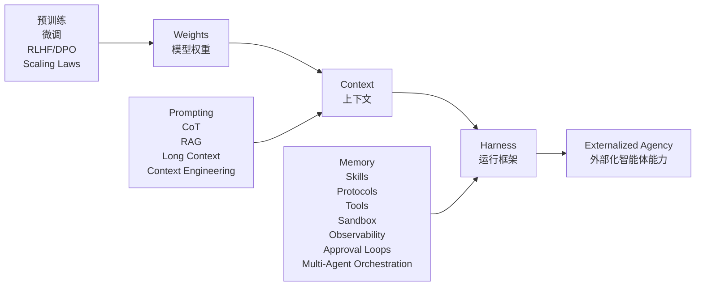
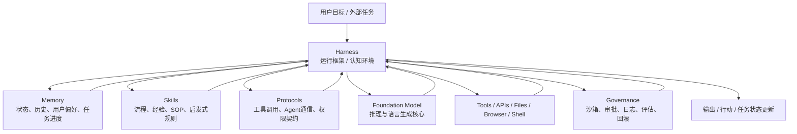
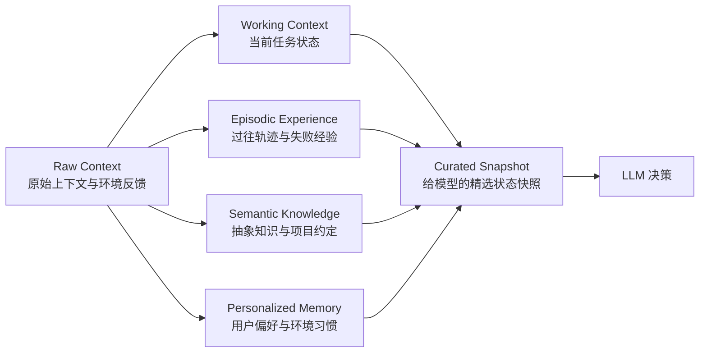
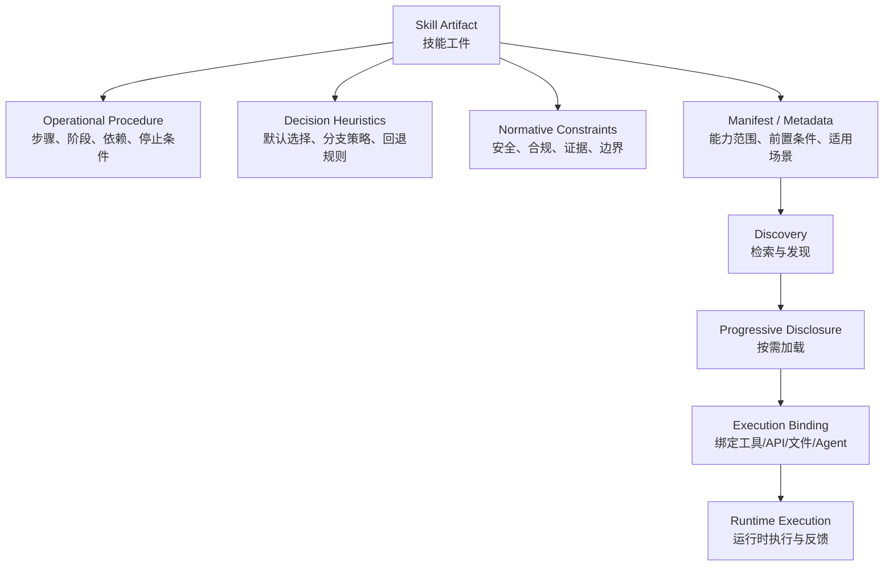
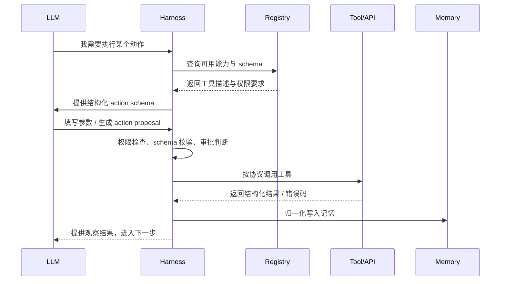
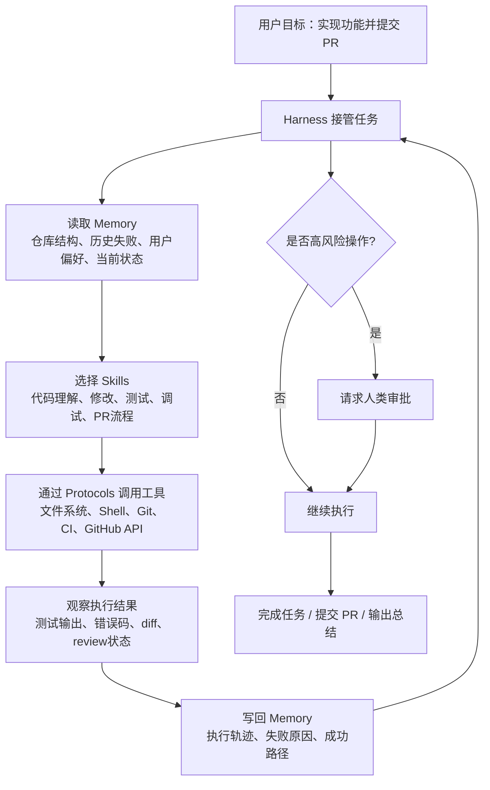

# AI Agent 为什么不只是“大模型”：从外部化视角读懂 Memory、Skills、Protocols 与 Harness

> 基于论文：**Externalization in LLM Agents: A Unified Review of Memory, Skills, Protocols and Harness Engineering**
> 适合读者：刚入门 AI Agent，但希望建立系统级理解的人。
> 核心问题：为什么现在越来越多真正有用的 AI Agent，不只是靠更强的大模型，而是靠模型外部的一整套“认知基础设施”？

---

## 0. 先给你一个总判断：这篇论文真正讲的不是组件，而是“智能放在哪里”

如果你刚开始学习 AI，很容易形成一种直觉：

> AI 越强，是因为模型越大、参数越多、训练数据越多、推理能力越好。

这当然没错，但这篇论文想告诉我们：**这只是 AI Agent 能力的一部分来源。**

真正复杂的 Agent，例如能写代码、查资料、操作软件、长期协作、管理任务、调用工具、记住用户偏好、与其他 Agent 通信的系统，它的能力往往不是只来自模型内部，而是来自模型周围的运行环境。论文摘要开门见山地说，LLM Agent 越来越不是通过改变模型权重来构建，而是通过重新组织模型周围的 runtime；过去期待模型“自己内部恢复”的能力，现在被外部化到 memory stores、reusable skills、interaction protocols 和 surrounding harness 中。

这篇论文的核心词是：

> **Externalization，外部化。**

外部化的意思是：
把原本需要模型在内部完成、但又不稳定、不透明、难更新、难治理的认知负担，搬到模型外部，变成可保存、可检查、可复用、可组合、可约束的结构。

于是，Agent 的能力不再只存在于模型权重里，而是分布在：

模型权重、上下文、记忆系统、技能系统、协议层、工具系统、权限系统、日志系统、沙箱、审批流程、评估器、多 Agent 编排，以及整个 harness 运行框架中。

这篇论文真正帮我们建立的，是一种非常重要的 AI 系统观：

> **未来的 AI Agent，不是一个孤立的大脑，而是一个被外部认知基础设施组织起来的系统。**

---

## 1. 论文一句话总结：从 Weights 到 Context，再到 Harness

论文最重要的历史线索是：

> **Weights → Context → Harness**

也就是：

> 能力先被理解为模型权重中的能力；
> 后来被理解为上下文和提示词中的能力；
> 现在越来越被理解为模型周围基础设施中的能力。

论文第 2 节明确把近期 LLM Agent 的发展概括为一种“从模型自身向外移动”的过程：能力先被看作权重属性，然后被看作 prompt 和 context window 的属性，现在越来越被看作模型运行基础设施的属性；图 2 也把社区主题从 Weights、Context 逐步扩展到 Harness，包含 tool ecosystems、protocols、skills、multi-agent orchestration 等。

我们可以先用一张 Mermaid 图建立整体框架：

这条路线不是说 weights 不重要，也不是说 context 不重要。论文强调，这三层是叠加关系，不是互相替代关系。Weights 仍然提供通用语言能力、推理能力和世界知识；Context 仍然提供任务材料和临时约束；Harness 则负责把长期状态、可复用流程、工具交互、权限治理、执行反馈组织成一个可运行的系统。

更通俗地说：

> **Weights 是大脑底座。**
> **Context 是当前工作台。**
> **Harness 是工作环境、工具间、制度、流程和操作系统。**

---

## 2. 为什么叫“外部化”？先从人类认知讲起

论文不是直接从工程组件开始讲，而是借用了 Donald Norman 的“认知工件”理论。

Norman 的核心观点是：

> Cognitive artifacts do not change human capabilities. They change the task.
> 认知工件并不改变人的底层能力，它们改变任务本身。

论文用购物清单和地图做例子。购物清单并没有让你的生物记忆容量变大，但它把“凭空回忆我要买什么”变成了“看清单识别我要买什么”。地图也不是直接让你导航能力变强，而是把隐藏的空间关系变成可见结构，让你用视觉识别和路径判断来解决问题。论文据此提出，外部工具的力量在于 representational transformation，也就是改变问题的表示形式，让 agent 用已有能力更可靠地解决问题。

这个思想非常重要，因为它会改变你看 AI Agent 的方式。

过去我们可能问：

> 这个模型会不会记住用户偏好？
> 这个模型会不会稳定执行复杂流程？
> 这个模型会不会正确调用工具？
> 这个模型会不会自己管理权限和失败恢复？

外部化视角会反问：

> 为什么一定要让模型“脑内”完成这些事？
> 能不能把长期状态放进记忆系统？
> 能不能把复杂流程写成技能？
> 能不能用协议规定工具调用格式？
> 能不能用 harness 管理权限、日志、沙箱、审批和失败恢复？

这就像人类不会把所有任务都靠大脑硬记。我们会用笔记、日历、地图、文件夹、操作系统、项目管理工具、Git、测试框架、代码规范和团队流程。

AI Agent 也一样。好的 Agent 不只是“模型更聪明”，而是：

> **任务被重新组织成模型更容易可靠完成的形式。**

---

## 3. 论文的四大主张：Memory、Skills、Protocols、Harness

论文在 Introduction 里明确给出四个系统级主张：

| 模块            | 外部化什么  | 解决什么问题            | 任务如何改变                                        |
| ------------- | ------ | ----------------- | --------------------------------------------- |
| **Memory**    | 跨时间状态  | Agent 容易失忆、上下文有限  | 从 recall 变成 retrieval / recognition           |
| **Skills**    | 程序性经验  | 每次重新发明流程、执行方差大    | 从 improvised generation 变成 guided composition |
| **Protocols** | 交互结构   | 工具、Agent、用户之间通信脆弱 | 从 ad hoc coordination 变成 structured contract  |
| **Harness**   | 统一运行环境 | 模块无法自行形成稳定行动系统    | 把外部化模块组织成 governed execution                  |

论文明确说，Memory systems externalize state across time，Skill systems externalize procedural expertise，Protocols externalize interaction structure，而 Harness engineering 则把这些模块统一到一个带约束、可观察、可反馈、可控制的 runtime environment 中。

这里要特别注意：**Harness 不是第四个并列模块。**

Memory、Skills、Protocols 是三种外部化内容；Harness 是让它们一起运转的外部运行框架。论文也强调，harness 不是 memory、skills、protocols 之外的第四种外部化，而是这些外部化形式运行和交互的 runtime environment。

你可以这样理解：

> Memory 是 Agent 的外部记忆。
> Skills 是 Agent 的外部经验手册。
> Protocols 是 Agent 的外部沟通契约。
> Harness 是 Agent 的外部操作系统。

---

## 4. 第一层：Weights，模型权重为什么重要，但不够

Weights 层对应现代 LLM 最早期、最经典的范式：能力主要在模型参数里。

预训练把统计规律、世界知识、语言能力、推理习惯压缩进权重。Scaling laws 又强化了一个直觉：模型越大、数据越多、训练越充分，能力越强。监督微调、偏好优化、RLHF、DPO 等方法则进一步塑造模型的指令遵循、对话风格、拒答行为和领域习惯。论文指出，在这个视角下，改进 Agent 往往意味着修改或替换模型本身。

权重层有明显优势。

它快。知识和能力已经在模型内部，不需要每次检索外部数据库。

它紧凑。部署时主要依赖模型本体，不一定需要复杂系统。

它泛化强。同一个模型可以回答医学问题、写诗、调试代码、总结合同，不需要为每个任务搭一套专门管线。

但权重层的问题也很根本：

> 它把知识、流程和策略过度耦合在一个静态、难解释、难更新的参数空间里。

比如一个事实变了，你很难只精准更新那一个事实。一个用户有特殊偏好，你很难在模型权重层为千万用户分别个性化。一个 Agent 出错了，你也很难审计它到底是知识错、流程错、策略错，还是上下文误导。

所以论文说，parametric knowledge 的核心限制在于难以选择性更新、组合和治理。单轮问答时这个问题还能忍，但一旦 Agent 进入长期任务执行，状态会累积、流程要稳定、工具要协调，这些问题就会变得非常突出。

这就是为什么能力开始从权重走向上下文。

---

## 5. 第二层：Context，上下文让模型行为变得可编排

Context 层的出现，代表开发者开始意识到：

> 不改模型权重，也能显著改变模型行为。

Prompt engineering、few-shot examples、role descriptions、Chain-of-Thought、Self-Consistency、ReAct、Tree of Thoughts、Self-Refine、RAG 等，都是 Context 层的重要技术。论文说，这一阶段的注意力从 model modification 转向 input design；同一个模型，在不同 prompt、不同上下文、不同检索证据下，可以表现出不同能力。

RAG 是一个特别重要的例子。

以前我们问：

> 模型知道事实 X 吗？

RAG 之后我们问：

> 如果把事实 X 检索出来放进上下文，模型能不能识别、理解并使用它？

这正是从 recall 到 recognition 的转变。

模型不必从权重里“想起”所有知识，系统可以把相关文档找出来、放到上下文里，让模型阅读和应用。论文明确把 RAG 看作一种更系统的外部化形式，因为它在查询时动态注入外部文档，把注意力从“模型内部化了什么”转向“每次调用周围的信息管道如何组织”。

但是 Context 层也有边界。

上下文窗口有限，token 成本高，长 prompt 可能引入噪声。论文提到 long prompts 可能因为 “lost in the middle” 现象而降低性能，即信息放在长上下文中间时，模型使用效果可能变差；即使 context length 从 2K 扩展到 100K 甚至更大，选择性整理仍然必要。

更重要的是，Context 是临时的。

如果没有外部状态管理，每次新会话仍然会部分失忆。Prompt 可以告诉模型“请按步骤执行”，但 prompt 本身不能可靠保证状态跨会话保存、工作流被调度、子 Agent 被协调、失败被恢复、权限被执行、日志被记录。

所以系统继续向外走，进入 Harness 层。

---

## 6. 第三层：Harness，Agent 工程正在变成运行框架工程

Harness 是这篇论文最值得重视的概念。

论文说，随着 context window 饱和、prompt template 越来越笨重，工程注意力开始从：

> “我们应该告诉模型什么？”

转向：

> “模型应该运行在什么环境里？”

在成熟 Agent 系统中，可靠性越来越依赖外部 memory stores、tool registries、protocol definitions、sandboxes、sub-agent orchestration、compression pipelines、evaluators、test harnesses 和 approval loops。

这句话非常关键。

它意味着，Agent 工程已经不是单纯写 prompt，而是设计一个执行环境。这个环境决定模型能看到什么、能记住什么、能调用什么、能修改什么、何时需要审批、如何回滚、如何记录、如何失败恢复。

论文甚至说：

> Agent engineering increasingly takes the form of harness engineering.

也就是：

> **Agent 工程越来越表现为 Harness 工程。**

我们可以用下面的 Mermaid 图表示一个 harnessed LLM Agent：

这张图的核心不是组件多，而是**能力被重新分配**。

模型负责语言理解、推理、综合判断、局部适配。
Memory 负责跨时间状态。
Skills 负责可复用流程。
Protocols 负责结构化交互。
Harness 负责调度、约束、观察、反馈和治理。

所以，一个 Agent 能不能可靠工作，不能只问“模型有多强”，还要问：

> 它的记忆系统是否可靠？
> 技能是否可发现、可加载、可复用？
> 工具调用是否有协议约束？
> 执行是否在沙箱里？
> 失败是否可恢复？
> 操作是否可审计？
> 高风险动作是否需要审批？
> 上下文预算如何管理？

这就是系统级 AI 理解。

---

## 7. Memory：外部化状态，让 Agent 不再只能靠短暂上下文活着

第 3 节讲 Memory，论文称它解决的是 agency 的 temporal burden，也就是智能体行动中的时间负担。裸 LLM 每次调用都从一个上下文开始，长期连续性、历史经验、用户事实、未完成任务都要塞进 prompt。任务一旦跨会话、跨分支、跨中断，这种方式就会变得不稳定且昂贵。Memory 的作用，就是把这些状态外部化为可写入、可更新、可检索的 persistent state。

论文把 Agent Memory 分成四类。

第一类是 **Working Context，工作上下文**。
它是当前任务的实时中间状态，例如打开的文件、临时变量、当前假设、部分计划、执行 checkpoint。它变化快，过期也快，但如果不外部化，一旦上下文重置或进程中断就会消失。编程 Agent 中的草稿、终端状态、工作区文件都属于这类。

第二类是 **Episodic Experience，情节经验**。
它记录过去发生过什么：决策点、工具调用、失败、结果、反思。它不是单纯日志，而是 Agent 以后避免重复错误、学习经验、提炼技能的原材料。论文举 Reflexion 为例，它会存储失败尝试后的反思摘要，作为可复用经验。

第三类是 **Semantic Knowledge，语义知识**。
它存储超越单次事件的抽象知识，例如领域事实、项目约定、一般启发式规则、稳定世界知识。Episodic memory 说的是“某一次发生了什么”，Semantic memory 说的是“通常什么规律成立”。常见知识库和 RAG corpus 就属于这一类。

第四类是 **Personalized Memory，个性化记忆**。
它记录特定用户、团队或环境的长期偏好、习惯、约束和交互历史。论文强调，这类记忆不能和 Agent 的通用自我改进经验混在一起，因为用户相关数据有不同的保留、检索和隐私规则。

我们可以用 Mermaid 表示 Memory 的四层：

Memory 的架构也在演化。论文把它概括成四个阶段：

**Monolithic Context**：所有历史或摘要都放进 prompt。简单透明，但容量差、摘要会漂移、会话结束状态消失。

**Context with Retrieval Storage**：短期状态留在上下文，长期痕迹放到外部存储，需要时检索。这解决容量问题，但引入检索质量问题：取错会干扰模型，漏取会像没记住一样。

**Hierarchical Memory and Orchestration**：引入分层、提取、整合、遗忘、冷热数据交换，让记忆成为有生命周期的管理对象，而不是被动数据库。

**Adaptive Memory Systems**：让编码、存储、检索、管理模块或检索策略能根据反馈调整。记忆从“存储”走向“控制”。

这一节最重要的结论是：

> 好记忆不是保存一切，而是在正确时刻，让正确历史以正确形式变得可用。

论文第 3.4 节进一步说，Memory 作为认知工件，把一个几乎不可能的内部任务——“在有限上下文里保留无限历史并清晰思考当前问题”——改造成一个外部 recognition-and-retrieval 问题。模型不再需要从参数中恢复历史，而是识别并使用记忆系统已经筛选出的相关历史。

Memory 的失败也不是简单“没存够”。论文指出，陈旧记忆会错误表示当前状态，过度抽象会丢失操作细节，抽象不足会把噪声塞满 prompt，有毒或冲突记忆会污染未来推理。换句话说，Memory 的关键不是容量，而是表征质量。

---

## 8. Skills：外部化程序性经验，让 Agent 不用每次重新发明流程

第 4 节讲 Skills。论文说，Skill externalization 解决的是 agency 的 procedural burden，也就是程序性负担。

一个语言模型也许“原则上知道”怎么完成某类任务，但可靠执行仍然需要每次重建工作流、默认选择、约束条件和停止标准。任务越长、环境越具体、分支越多，这种负担越大，表现出来就是执行方差：漏步骤、工具使用不稳定、提前停止、流程混乱。

Skill 的代表性转变是：

> 从 repeated synthesis 到 reusable procedure。
> 从每次重新合成流程，到加载可复用程序。

论文强调，Skill 不只是一个工具，也不是一句 prompt。工具暴露操作，协议规定操作如何描述和调用，而技能编码的是“某类任务应该如何使用这些操作完成”。Skill 关注的是 procedural expertise，也就是在重复假设和约束下完成任务的可复用做法。

论文把技能包含的程序性经验拆成三部分：

**Operational Procedure，操作流程。**
它是任务骨架，规定步骤、阶段、依赖关系和停止条件。很多 Agent 错误并不是不会做某个动作，而是流程层面不稳定：跳过步骤、顺序错、提前结束。外部化 procedure 就是把脆弱的过程知识变成显式路径。

**Decision Heuristics，决策启发式。**
现实任务不是固定流水线。工具会失败，观察会有噪声，多个动作看起来都可行。启发式规则告诉 Agent：先试什么、什么时候退回、什么证据足够、多个方案怎么取舍。外部化这些 heuristics 可以降低模型每次在分支处重新思考局部策略的成本。

**Normative Constraints，规范性约束。**
一个流程可能技术上有效，但不合规、不安全、不符合组织要求。外部化约束后，测试要求、范围限制、访问限制、审计要求和领域规则不再只是事后评价标准，而会成为 skill 本身的一部分，用来规定前置条件、阻断危险分支、要求中间验证或定义完成证据。

这三者合起来，才是真正的技能。

我们可以把 Skill 看成一个“能力包”：

论文还区分了技能发展的三个阶段。

第一阶段是 **Atomic Execution Primitives**，原子执行能力。比如函数调用、结构化工具调用，让模型能调用某个工具。

第二阶段是 **Large-scale Primitive Selection**，大规模工具选择。工具多了以后，问题从“能不能调用工具”变成“在很多工具中选哪个”。

第三阶段才是 **Skill as Packaged Expertise**，把完成某类任务的 know-how 包装成可复用能力单元。此时能力单位不再是单个工具调用，而是围绕程序性指导和执行结构的高层工件。

这一区分特别重要，因为很多新人会把“有工具调用”误认为“有技能”。实际上，工具是动作接口，技能是完成任务的做法。

比如：

> “运行 Python”是工具。
> “完成一份数据分析报告”是技能。
> “调用 GitHub API”是工具。
> “修复一个 issue 并提交 PR”是技能。
> “搜索网页”是工具。
> “完成一个事实核查研究流程”是技能。

论文第 4.3 节进一步指出，技能外部化不是简单写一个静态说明文件，而是一个完整过程：Specification、Discovery、Progressive Disclosure、Execution Binding、Composition。技能必须被描述、被发现、被按需披露、被绑定到实际工具/API/文件/Agent，并能组合成更大的能力结构，才真正进入 Agent runtime。

技能还会演化。论文提到四种技能获取路径：

**Authored**：专家或工程师手写，例如 SKILL.md、AGENTS.md、项目说明、组织 SOP。

**Distilled**：从历史轨迹、成功经验、失败反思中提炼。

**Discovered**：Agent 通过环境探索自主发现，例如 Voyager 在 Minecraft 中生成可增长的技能库。

**Composed**：由低层技能组合成高层技能，例如“报告生成”可以由数据清洗、统计分析、可视化、叙事总结多个技能组成。

但技能也有风险。论文指出，技能不是写好以后永远稳定的模块，它会受到任务变化、环境变化、上下文预算、安全约束的影响；过长或重叠的技能文件会争夺上下文，模型可能机械执行局部步骤却忘记全局目标。

所以，Skill 最终一定会指向 Harness。技能需要 memory 来选择和参数化，需要 protocols 来绑定执行，需要 runtime governance 来审批、记录、回滚，需要 lifecycle feedback 来根据结果修订。

---

## 9. Protocols：外部化交互结构，让 Agent 不再靠自由文本猜接口

第 5 节讲 Protocols。

如果 Memory 解决“记什么”，Skills 解决“怎么做”，Protocols 解决的是：

> Agent 如何和外部世界稳定、可审计、可治理地交互？

裸模型可能知道应该调用工具、委托子 Agent、请求用户确认，但如果没有显式协议，它还必须临时发明消息格式、参数结构、生命周期语义、权限边界和错误恢复方式。论文说，这会让每一次外部行动都变成脆弱的 prompt-following exercise。

协议的核心转变是：

> 从 free-form communicative inference 到 structured exchange。
> 从自由文本推断交互，到结构化契约交换。

论文把 Protocols 外部化的内容分成四类：

**Invocation Grammar，调用语法。**
工具调用、API 请求、委托消息都需要格式：参数名、类型、顺序、返回结构。没有协议时，模型要每次猜；有协议后，模型只需要填字段。

**Lifecycle Semantics，生命周期语义。**
多步骤交互需要知道谁下一步行动、哪些状态转移合法、什么时候完成、什么时候失败。协议把这些顺序规则变成状态机或事件流。

**Permission and Trust Boundaries，权限与信任边界。**
真实 Agent 行动必须受到授权、数据流、证据要求约束。协议把这些规则外部化为 runtime 可执行的检查，而不是靠模型自觉。

**Discovery Metadata，发现元数据。**
Agent 需要知道有哪些工具、能力在哪里、如何访问。协议把这个发现问题外部化为 registry、capability card、schema endpoint。

协议可以分成 agent-tool、agent-agent、agent-user 和其他垂直工作流协议。论文以 MCP 为 agent-tool protocol 的代表，指出它让 Agent 能跨异构服务发现工具、检查 schema、调用工具，从而避免每个工具都需要 bespoke integration logic；这也把工具访问从逐接口工程变成 protocol-based integration。

这部分对理解现代 Agent 非常关键。

很多人以为“协议只是工程胶水”。论文反对这种看法。它指出，Protocols 不是 memory store，也不是 skill description，而是规定 state、request 和 action 如何跨系统边界移动的 contract。协议让其他外部化智能能够真正进入世界：Memory 需要被治理的读写路径，Skills 需要可绑定接口，它们都依赖 Protocols 以可检查、可审计、可恢复的形式跨越系统边界。

可以用下面这个 Mermaid 图来理解协议的作用：

协议的重要性在于：它把“模型说了一段话”变成“系统可以验证、执行、记录、恢复的动作”。

---

## 10. Harness：统一外部化模块的认知环境

第 6 节正式讲 Harness Engineering。

论文图 7 把 Foundation Model 放在中心，周围有六个 harness dimensions。其中三类是外部化模块：Memory、Skills、Protocols；另外三类是 operational surfaces：Permission、Control、Observability。它们共同形成一个 ring，持续协调 Agent 的感知、决策、行动、反馈。

论文对 Harness 的定义非常重要：

> Harness 不是给模型附加外围能力的便利工具，而是让外部化模块共同有效的 designed cognitive environment。

也就是说，Harness 不只是“工程框架”，更像 Agent 的“认知环境”。它决定模型如何遇到上下文、如何调用工具、如何保存状态、如何响应反馈、如何在约束中行动。论文说，一个实际 Agent 更应该被理解为“模型在 harness 中运行”，而不是“模型加了一些外围能力”。

Harness 的设计维度包括六个方面。

**Agent Loop and Control Flow。**
最简单的 Agent loop 是 perceive–retrieve–plan–act–observe：感知当前状态、检索相关信息、计划、行动、观察结果。但真正的 harness 还要控制终止、递归和资源消耗，例如最大步数、递归深度、每步成本、超时限制。没有这些控制，Agent 可能无限循环、无限调用工具、无限生成子 Agent。

**Sandboxing and Execution Isolation。**
当 Agent 能写文件、执行 shell、调用 API 时，Harness 必须决定暴露多少环境以及如何限制副作用。沙箱提供受控执行边界，限制读写修改范围，也让失败可诊断、可回滚。

**Human Oversight and Approval Gates。**
高风险动作需要人类审批，例如发送邮件、删文件、付款、提交代码、修改生产环境配置。审批不是简单中断，而是 harness 中的治理节点。

**Observability and Structured Feedback。**
Agent 的行动必须可观察。结构化日志、执行轨迹、聚合指标、错误事件让系统能追踪为什么失败、哪个技能被调用、哪个工具返回异常。

**Configuration, Permissions, and Policy Encoding。**
权限和策略不能只靠 prompt 提醒模型，而要被编码进 runtime。比如某个 Agent 只能读某些文件，某些工具必须审批，某些数据不能出域。

**Context Budget Management。**
Memory 检索、Skill 加载、Protocol schema 都要占用上下文窗口。Harness 必须管理哪些内容进入上下文、何时压缩、何时惰性加载、何时丢弃。论文在第 7 节也指出，这些模块会竞争同一个稀缺资源：模型上下文窗口。

所以，Harness Engineering 的本质是：

> 设计一个环境，让模型更容易做对事，更难做错事。

论文第 6.4 节把 Harness 解释为 cognitive environment。它不是简单给模型更多工具或上下文，而是重新组织模型面对的问题：通过外部化记忆、形式化流程、引入显式控制点、约束执行，把一个无边界任务变成结构化的 guided action environment。

---

## 11. Memory、Skills、Protocols 并不是孤立模块，而是会互相强化

第 7 节讲 Cross-Cutting Analysis。论文提醒我们，Memory、Skills、Protocols 虽然可以分析上分开，但真实系统的能力来自它们的交互。

论文图 8 总结了三者之间的六种耦合：Memory 为技能形成和协议路由提供证据；Skills 把存储经验转化为可复用流程，并调用 protocolized actions；Protocols 约束执行并把归一化结果写回 Memory。

可以这样理解：

**Memory → Skills：经验蒸馏。**
历史轨迹、失败案例、成功路径可以被提炼成技能。

**Skills → Memory：执行记录。**
每次技能运行产生新的轨迹、失败、成功率和用户修正，写回记忆。

**Skills → Protocols：能力调用。**
技能规定“应该做什么”，但要通过协议调用工具、文件、API、子 Agent 执行。

**Protocols → Skills：能力生成。**
标准化接口越多，就越容易围绕这些接口写出新的技能。

**Memory → Protocols：策略选择。**
历史成功率、用户偏好、过去失败可以影响下一步是本地执行、调用工具，还是委托远程 Agent。

**Protocols → Memory：结果吸收。**
工具输出、审批事件、错误 payload、委托结果都需要被协议归一化后写入 Memory。

这会产生三个系统级动态。

第一，正反馈。更好的记忆帮助提炼更好的技能，更好的技能产生更有价值的执行轨迹，更好的轨迹改善记忆。但错误也会被放大：一条被污染的记忆可能生成错误技能，错误技能又产生更多污染轨迹。

第二，上下文竞争。Memory retrieval、Skill loading、Protocol schemas 都占 token。扩展某个模块，就会压缩其他模块。Harness 必须管理它们的相对预算。

第三，时间尺度不同。Protocol interaction 通常同步且快速；Skill loading 在任务或子任务边界发生；Memory distillation 和 skill evolution 可能跨会话、跨长周期发生。一个只优化快速工具执行的 harness，可能忽略长期能力成长。

这部分很适合用一句话总结：

> Agent 的智能不是三个模块简单相加，而是它们在 Harness 中形成闭环。

---

## 12. 从 LLM 输入输出视角看：Memory 是输入，Skills 是指令，Protocols 是动作边界

论文第 7.2 节提供了一个特别实用的视角：从模型边界看，外部化模块分别表现为什么？

**Memory as contextual input。**
Memory 决定决策时模型看到哪些历史和情境。它不是把完整日志塞给模型，而是选出与当前步骤相关的小片段状态、轨迹或关系。选择质量决定模型是在准确历史上推理，还是在扭曲历史上推理。

**Skills as instructional input。**
Skills 决定模型收到哪些程序性指导。Harness 不必把所有 workflow 写进系统 prompt，而是在相关任务模式出现时加载专门的 instructions、examples、constraints。好处是减少流程发明方差，风险是技能太长会挤占其他输入。

**Protocols as action schema。**
Protocols 决定模型输出边界。通过 JSON schema、MCP messages、OpenAPI-aligned calls 等结构化契约，协议把模型生成空间收窄，使下游执行足够确定、可验证、可治理。输出不再只是“语言”，而是明确接口中的 action proposal。

这个视角非常适合工程实践：

> Memory 管“模型现在应该知道什么”。
> Skills 管“模型现在应该怎么做”。
> Protocols 管“模型的行动如何被执行”。
> Harness 管“这些东西何时进入、如何约束、如何反馈、如何治理”。

---

## 13. 参数能力 vs 外部化能力：不是谁取代谁，而是系统分工

论文第 7.3 节讨论 parametric vs externalized 的权衡。这个部分很重要，因为它防止我们走向另一个极端：以为所有东西都应该外部化。

论文的结论不是“外部化越多越好”，而是：

> 这是一个 systems-partitioning problem。
> 系统分工问题。

哪些能力适合留在模型里？
稳定、通用、低变化、需要快速响应的能力，例如语言理解、常识推理、泛化表达、基础语义能力，更适合参数化。

哪些能力适合外部化？
易变化、需要版本管理、需要审计、需要跨 Agent 复用、需要权限治理、需要回滚的能力，更适合放到外部系统。

论文列出几个关键维度。

**Volatility and update frequency。**
变化快的知识或规则适合外部存储，因为能立即更新、保留来源和版本；稳定背景能力适合留在模型里。

**Reusability and multi-agent portability。**
如果某个能力会跨任务、用户、Agent 反复使用，外部化能提高可移植性和组合性。显式 skills、scripts、interface artifacts 可以共享、版本化、复用。

**Auditability, governance, and alignment。**
涉及审批、回滚、策略执行时，外部化 artifact 比不透明权重更有优势。符号接口支持 circuit breakers、schema validation、traceable execution records；高风险部署会推动治理逻辑外部化。

**Latency, simplicity, and context burden。**
外部化也有成本：检索、路由、解析、工具调用会增加延迟；所有 artifact 都会占上下文；过多外部模块可能造成信息过载。对超快、低方差、纯语义任务，直接依赖模型内部能力可能更简单可靠。

所以，优秀 Agent 系统的目标不是“尽可能外部化”，而是：

> 把需要持久性、复用性、控制性、审计性的负担外部化；
> 把稳定、快速、通用的能力留在模型内部。

---

## 14. 未来方向：外部化还会继续扩张，但风险也会变大

第 8 节是未来讨论。论文提出六个方向。

第一，**外部化边界会继续移动。**
模型变强可能把某些能力拉回模型内部，例如更可靠结构化输出会减少格式验证需求；更长有效上下文会降低复杂记忆需求；更强工具使用能力会减少 intent-capture logic。但更复杂 harness 又会对模型提出新要求，例如遵守 schema、配合权限检查、协调 staged context injection。因此边界会双向移动。

第二，**规划、评估和编排逻辑本身也可能被外部化。**
论文指出，当前很多计划是模型在上下文中临时生成的，未来计划可能成为 first-class harness objects：持久、可检查、可修订、可共享。评估标准、rubrics、verification procedures 也可能变成 runtime harness components，而不只是事后 benchmark。

第三，**多模态外部化会打开更大空间。**
当前很多 memory、skills、protocols 以文本为主。但多模态模型处理图像、视频、音频、屏幕内容后，Skills 需要编码视觉流程，Memory 需要索引视觉和听觉经验，Protocols 需要支持跨模态 schema。论文认为，这不是简单增加数据类型，而是改变技能规格、记忆索引和协议设计假设。

第四，**外部化会从数字 Agent 扩展到具身 Agent。**
论文把机器人系统类比为外部化：高层 LLM 或多模态模型像 cerebrum，负责目标解释、任务分解、状态维护和异常处理；VLA 或运动模块像 cerebellum，负责抓取、放置、倒水、插入等低延迟操作。数字 Agent 中的工具调用和代码解释器，在具身 Agent 中对应 visuomotor policies。

第五，**Self-Evolving Harness 会出现。**
当前很多系统还依赖人类修改记忆策略、重写技能、调整执行逻辑。论文设想，如果 orchestration logic 本身被外部化，Harness 就可以被程序化修改。自演化可能发生在模块层、系统层、边界层；技术路径包括 reinforcement learning、program synthesis、evolutionary methods、imitation learning。

第六，**治理会变得更重要。**
外部化不是免费的。每增加一层 memory、schema、安全规则，都会带来认知开销和延迟。更严重的是安全风险：memory poisoning 会污染未来推理，malicious skill injection 会把恶意过程写入技能库，protocol spoofing 会伪造工具 manifest 或 endpoint 导致未授权操作。论文因此强调，governance 必须和 externalization 一起设计，包括 review gates、provenance tracking、rollback、regression testing。

最后，论文还指出，Agent 评估不能只看固定 prompt 下的任务完成率，因为那会低估外部化基础设施的贡献。更丰富的评估应包括 transferability、maintainability、recovery robustness、context efficiency、governance quality 等。

---

## 15. 这篇论文带给新人的最大认知升级

读完这篇论文，你对 AI 的理解应该从“模型中心”升级为“系统中心”。

过去你可能会问：

> 这个模型会不会？
> 这个模型聪不聪明？
> 这个模型参数多不多？
> 这个模型 benchmark 分数高不高？

现在你应该学会问：

> 这个 Agent 的能力哪些在权重里？
> 哪些通过上下文临时注入？
> 哪些被外部化为记忆、技能、协议？
> 它如何保存长期状态？
> 它如何复用流程经验？
> 它如何稳定调用工具？
> 它如何处理失败？
> 它如何被观察、审批、回滚？
> 它的上下文预算如何分配？
> 它的外部化 artifact 是否可审计、可更新、可治理？

这才是理解未来 Agent 的关键。

论文结论部分说得很明确：外部化是连接 LLM Agent 许多重要发展的 transition logic；可靠 agency 越来越依赖把选定的认知负担从模型中迁移到显式基础设施中。Memory 外部化跨时间状态，Skills 外部化程序性经验，Protocols 外部化交互结构，而 Harness 把这些层协调成可工作的 runtime。更好的 Agent 不只是更好的 reasoner，而是更好的 organized cognitive system。

这句话值得作为整篇文章的落点：

> **未来 AI Agent 的进步，不会只来自更强模型，也会来自更好的外部认知基础设施。**

---

## 16. 用一个实际例子把全文串起来：软件工程 Agent 如何工作

假设你要做一个软件工程 Agent，任务是：

> “在一个大型代码仓库中实现登录功能，运行测试，修复错误，并打开 PR。”

没有外部化时，模型要靠 prompt 记住很多东西：仓库结构、项目约定、当前修改、测试结果、失败历史、工具调用格式、PR 流程。这很容易崩。

有外部化后，系统可以这样运转：

在这个系统里：

Memory 让 Agent 不失忆。
Skills 让 Agent 不用每次重新发明开发流程。
Protocols 让工具调用稳定、可检查。
Harness 让整个过程能被调度、限制、观察、审批和恢复。

模型本身也许没变，但它面对的任务变了：从“你自己记住一切并完成一切”，变成“在一个结构化环境中读取状态、加载技能、按协议行动、根据反馈迭代”。

这就是外部化的力量。

---

## 17. 给开发者的实践清单：如何用这篇论文指导 Agent 设计

当你未来设计一个 Agent，可以直接用下面这套问题作为检查表。

**关于 Memory：**

你的 Agent 需要跨会话连续性吗？
当前状态和长期历史是否分开？
是否区分 working context、episodic experience、semantic knowledge、personalized memory？
是否有遗忘、压缩、更新和冲突处理机制？
检索出来的是“对当前决策有用的状态”，还是一堆历史噪声？

**关于 Skills：**

哪些流程会被反复执行？
这些流程是否值得写成 skill？
Skill 是否包含操作步骤、分支启发式和规范约束？
Skill 是否有适用范围、前置条件和停止条件？
Skill 是否能被发现、按需加载、绑定到工具、组合成高层能力？
Skill 的执行结果是否会反馈到 memory，用于后续修订？

**关于 Protocols：**

工具调用是否有明确 schema？
返回结果是否结构化？
错误是否有标准表示？
权限和信任边界是否由 runtime enforce，而不是只靠模型自觉？
Agent-Agent 通信是否有 capability discovery、delegation contract 和 lifecycle semantics？
用户审批和高风险操作是否有明确协议？

**关于 Harness：**

Agent loop 是否有最大步数、超时、成本上限？
是否有沙箱隔离？
是否有结构化日志？
是否可以回滚？
是否有人工审批点？
是否能管理 memory、skill、protocol 的上下文预算？
是否能从失败中恢复，而不是一错到底？

**关于评估：**

你是在评估模型，还是在评估模型 + harness？
如果替换底层模型，Agent 表现还稳定吗？
移除某个 memory、skill、protocol，性能下降多少？
长任务中是否会漂移？
失败后能否恢复？
系统是否可审计、可追责、可回滚？

---

## 18. 最后总结：这篇论文的真正价值

这篇论文不是告诉我们某个新算法多厉害，而是给了一个理解 AI Agent 的统一框架。

它把 Memory、Skills、Protocols、Harness 这些看起来分散的工程实践统一到一个思想下面：

> **外部化。**

Memory 把状态外部化，让 Agent 不再只依赖短暂上下文。
Skills 把经验外部化，让 Agent 不再每次重新发明流程。
Protocols 把交互外部化，让 Agent 不再靠自由文本猜接口。
Harness 把这些外部化结构组织起来，让 Agent 的行动变得可执行、可观察、可约束、可恢复。

用一句最适合作为博客结尾的话来说：

> **AI Agent 的未来，不是把一切都塞进模型脑子里，而是学会把模型放进一个设计良好的认知环境里。**

这也是新人理解 AI 的关键转折：
从“模型有多聪明”，走向“系统如何组织智能”。
