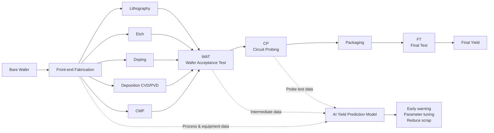
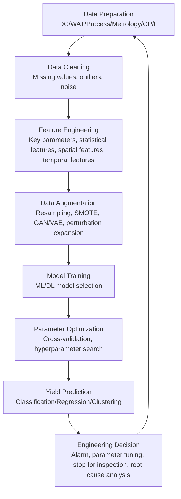
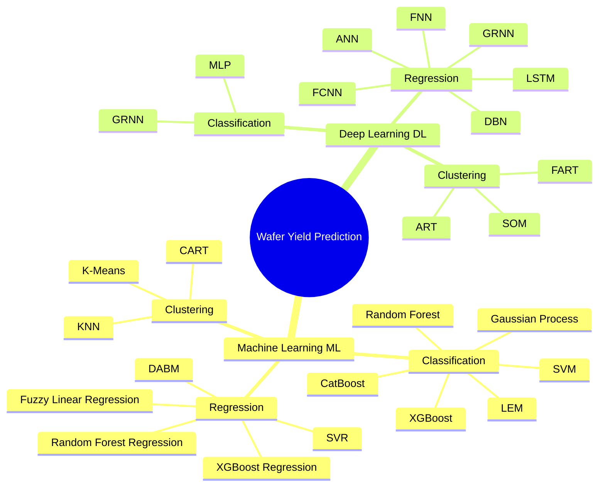
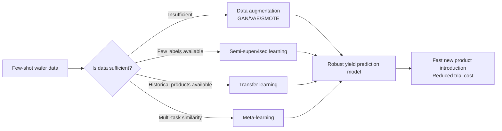
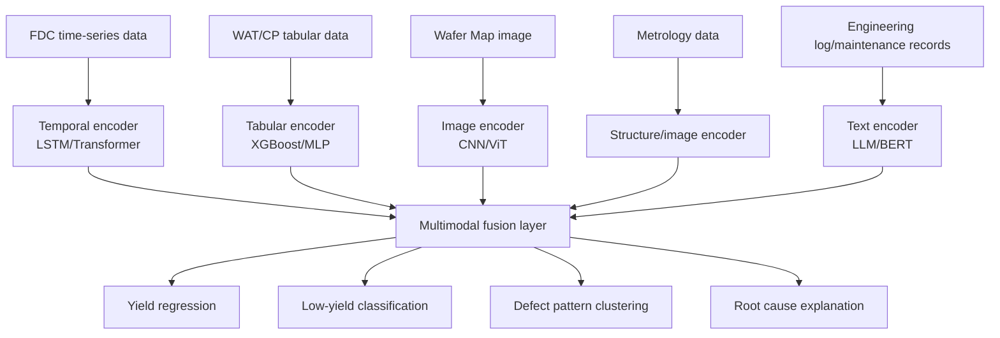

```markdown
# From Wafer to Yield: How AI Predicts the Fate of a Wafer in Advance — An In-depth Read of "A survey on semiconductor wafer yield prediction by artificial intelligence"

> This article provides an in-depth, explanatory review based on the paper **A survey on semiconductor wafer yield prediction by artificial intelligence**. The paper focuses on the question of "using artificial intelligence to predict semiconductor wafer yield," systematically reviewing data types, machine learning methods, deep learning approaches, and three key future directions: few-shot prediction, explainable models, and multimodal prediction.

---

## 1. Clarifying the Problem: Why is "Yield Prediction" So Important?

In semiconductor manufacturing, a wafer is not simply "produced" and finished. It goes through a series of steps: lithography, etching, doping, chemical mechanical polishing, deposition, wafer acceptance test, wafer probe test, packaging, final test, and more. Figure 1 in the paper uses a flowchart to show the basic manufacturing and testing chain from wafer to WAT, CP, and FT: after entering the manufacturing process, the wafer goes through process steps such as Etch, Doping, Lithography, CMP, CVD, and then enters the WAT, CP, and FT testing phases.

An intuitive analogy: a wafer fab is like an extremely expensive, extremely precise "super kitchen." A wafer is like a large dough sheet, on which many chips are "baked." The problem is that if any single link goes wrong — temperature, humidity, gas flow, etch depth, film thickness, lithography misalignment, equipment drift — some chips may fail. The proportion of chips that are ultimately usable is the yield.

The paper gives a very straightforward definition of yield:

\[
Yield = \frac{Qualified\ quantity}{Total\ production\ quantity} \times 100%
\]

That is, the number of qualified products divided by the total production quantity. Higher yield means a more stable process, more effective quality control, and lower production costs and resource waste.

However, the difficulty of "yield prediction" lies in the fact that true yield is usually not known until many processes and tests are completed. By then, if problems have occurred, losses have often already been incurred. The paper points out that predicting yield in advance can help fabs detect potential issues early in the manufacturing process, allowing them to adjust process parameters and reduce losses.

Thus, wafer yield prediction is not an ordinary data modeling task; it is a core industrial problem that directly affects a company's profitability, production line efficiency, R&D cycle, and quality control.

---

## 2. Paper's Main Line: Not "Yet Another Algorithm Survey," but an Industrial AI Problem Map

The value of this paper is that it does not simply list algorithm names; instead, it breaks down "wafer yield prediction" into several key layers:

- **Layer 1 – Manufacturing flow:** What stages does a wafer go through from process to test?
- **Layer 2 – Data sources:** What do FDC, WAT, Process Parameter, Metrology, CP, FT, and other data record?
- **Layer 3 – Prediction paradigms:** Which problems do classification, regression, and clustering suit?
- **Layer 4 – Algorithm spectrum:** How do traditional machine learning and deep learning approach these tasks?
- **Layer 5 – Future challenges:** How to overcome the three major obstacles: scarce data, black-box models, and single data sources?

The paper clearly states that early yield prediction mainly relied on statistical methods, such as modeling defect distributions based on Poisson processes. However, as process complexity, data dimensionality, and nonlinear relationships increased, research focus gradually shifted toward machine learning and deep learning. The paper categorizes current mainstream methods into machine learning and deep learning approaches, further organized by classification, regression, and clustering.

The core message of this paper can be condensed into one sentence:

> The essence of wafer yield prediction is to use multi-source data from the entire manufacturing process to determine as early as possible, before final test results are available, "how many of these wafers, this lot, these chips will ultimately pass."

---

## 3. Understanding Wafer Manufacturing and Yield Prediction at a Glance

Figure 1 in the paper shows the wafer manufacturing flow: after going through process steps such as Etch, Doping, Lithography, CMP, CVD, the wafer enters the WAT, CP, and FT testing phases. To make this path more suitable for a blog display, the following Mermaid diagram redraws it:



This diagram emphasizes a key point: AI does not just "score" after FT is completed; it aims to predict final yield early at the WAT, CP, or even earlier process data stages.

---

## 4. Data as the Fuel for Yield Prediction: Understanding Six Core Data Types

Section 2 of the paper uses substantial space to introduce common data types in wafer manufacturing. Understanding these data is fundamental to understanding the entire paper. In industrial AI scenarios, algorithms are often not the primary success factor; rather, data quality, data timing, data granularity, and data availability are.

### 4.1 FDC Data: "Vital Signs Monitor" for Equipment and Processes

FDC stands for Fault Detection and Classification. It collects equipment operating status and process parameters, such as temperature, pressure, humidity, gas flow, etc., and may record statistical characteristics like minimum, maximum, mean, standard deviation, and process changes. The FDC system acts like an ICU monitor: it keeps a real-time watch on equipment and processes, sounding an alarm as soon as deviations occur.

In yield prediction, the value of FDC data lies in its "earliness." It is often generated during manufacturing, not after final testing. Therefore, if a model can detect anomalous patterns in FDC signals, there is an opportunity to intervene before final yield drops.

### 4.2 WAT Data: Wafer-Level Electrical Health Check

WAT stands for Wafer Acceptance Test. It is typically performed after wafer manufacturing is complete, evaluating electrical parameters on test structures or test points on the wafer. The paper notes that WAT data may include threshold voltage, leakage current, line width, defect density, and many other test items, revealing issues such as short circuits and electrical instability.

WAT is like a "physical examination report" for the wafer. It is not a final user functional test, but it can reveal early whether the manufacturing process has deviated from targets. Many yield prediction studies use WAT data because it is both earlier than FT and highly correlated with final performance.

### 4.3 Process Parameter Data: Real-Time Process Records During Manufacturing

Process Parameter Data refers to data collected in real time by sensors and monitoring equipment during manufacturing, including current, voltage, chemical concentration, equipment operating status, production speed, time, etc. The paper states that such data helps in real-time monitoring and control of the IC manufacturing process, assisting engineers in detecting and correcting anomalies promptly.

This type of data is dynamic, continuous, and complex. It often has time-series properties, so models suitable for modeling temporal dependencies, such as LSTM, RNN, and Transformer, are useful here.

### 4.4 Metrology Data: Precision Measurements of Topography, Dimensions, and Defects

Metrology data comes from measurements taken during manufacturing, including film thickness, photoresist profile, etch depth, defect distribution, etc. The paper points out that monitoring these data ensures manufacturing consistency and stability, helping fabs reduce failure probability and improve yield.

If FDC is equipment status and WAT is electrical health check, Metrology is more like a "microscope structural inspection." In advanced process nodes, nanometer-level deviations can affect chip performance, so Metrology data is crucial for yield modeling.

### 4.5 CP Data: Functional Pre-screening of Each Bare Die

CP stands for Circuit Probing, i.e., wafer probe testing. The paper notes that CP testing is performed after wafer manufacturing is complete, performing functional tests on each die and providing performance data for each die and the CP-stage yield.

CP data is very close to final yield but still occurs before packaging. It tells us which dies on a wafer are already showing anomalies and can also generate a wafer map. Spatial defect patterns on a wafer map often indicate equipment, process, or contamination issues.

### 4.6 FT Data: The Final Exam After Packaging

FT stands for Final Test. The paper points out that FT data covers functional tests of the final IC chip, including logic, electrical performance, and fault detection, such as opens, shorts, and leakage current. FT data is used to confirm whether the chip meets design specifications and also helps identify manufacturing issues, optimize processes, and improve yield.

FT is the final result, but for "advance prediction," FT often comes too late. Therefore, many studies use FT yield as a label and predict it using earlier-stage data such as FDC, WAT, Metrology, CP, etc.

---

## 5. The Paper's Judgment on Data: The Real Scarcity Is Not Algorithms, but High-Quality Wafer Data

The paper specifically points out that the field of wafer yield prediction lacks public datasets. The reasons are practical: data is highly valuable, collection processes are complex, and companies are generally unwilling to share it. Additionally, different studies lack uniform standards for data normalization, dimensionality reduction, cleaning, and other processing steps; manual collection can also introduce data quality variations, affecting model stability. The paper suggests that future efforts should promote standardization and automation of data collection and study methods to mitigate the impact of erroneous data.

This is one of the biggest differences between industrial AI and internet AI.

In internet scenarios, images, text, and clickstream data are often massive and relatively cheap to collect. But in semiconductor manufacturing, every wafer is expensive, every batch of processes carries trade secrets, and every process parameter can be related to a company's competitiveness. So we are not facing "too much data to know what to do with," but "data that is too expensive, too sensitive, too complex, and too non-uniform."

This also explains why the paper lists "few-shot learning" as one of its future directions.

---

## 6. Standard Flow of Yield Prediction: From Data Preparation to Model Deployment

Figure 2 in the paper gives a general yield prediction flow: first prepare data, then perform data cleaning, feature selection, data augmentation, then model training and parameter optimization, finally output the predicted yield.

This flow can be redrawn as the following Mermaid diagram:



What beginners most often overlook is that model training is only part of the process. What really determines the success of an industrial model is often the preceding steps: cleaning, feature selection, label design, data alignment, and the subsequent steps: interpretation, feedback loop.

For example:
- FDC is continuous process data, WAT is test point data, CP may be die-level data, FT is post-packaging chip-level data. Their timestamps, granularities, spatial locations, and lot numbers may all be different. Assembling these into a trainable dataset is a complex engineering task in itself.

---

## 7. Classification, Regression, Clustering: How Are These Three Prediction Tasks Different?

The paper categorizes yield prediction methods by problem formulation into three types: classification, regression, and clustering. Classification models transform yield problems into judgments like high/low yield, pass/fail, etc. Regression models directly predict continuous yield values. Clustering models use unsupervised methods to automatically discover wafer or defect patterns.

### 7.1 Classification: First Determine "Is It Risky or Not?"

Classification tasks answer questions like: "Is this wafer at risk of low yield?" "Is this batch abnormal?" "Is a particular die likely to fail?"

The advantage of classification models is that their output is simple and convenient for decision-making. For example, wafers with yield below a certain threshold are labeled as low yield, and those above as high yield. When production line engineers see a low-yield risk, they can prioritize checking equipment, processes, or material batches.

But classification also has a clear disadvantage: it loses detail. Yields of 89% and 60% might both be labeled as low yield, but their severity levels are completely different.

### 7.2 Regression: Directly Predict "What the Yield Will Be"

Regression tasks answer questions like: "What will the final yield of this wafer be?" "Will FT yield be 92.3% or 85.7%?"

Regression models are more nuanced, supporting finer cost-benefit analyses. For example, if a model predicts that FT yield for a certain batch will drop by 2%, the engineering team can evaluate whether it is worthwhile to pause the line, redo measurements, or adjust the process window.

The paper notes that regression methods are widely used to improve prediction accuracy and reliability. For instance, Jiang et al. proposed a GMM clustering-based ensemble regressor combined with XGBoost to predict FT yield; Chen et al. used fuzzy linear regression to handle uncertainty in manufacturing; Lee et al. proposed DABM, which combines sequential prediction base models with supplementary data.

### 7.3 Clustering: When Labels Are Unknown, First Find "Similar Groups"

Clustering tasks answer questions like: "Do these wafers exhibit similar defect patterns?" "Which batches behave similarly?" "Are there systematic spatial patterns on the wafer map?"

Clustering does not require labels, making it suitable for early exploration and root cause analysis. The paper states that cluster analysis groups observations with similar characteristics, suitable for unlabeled data. K-Means, KNN, CART, etc., are used for defect pattern recognition and process anomaly analysis in wafer manufacturing data.

The disadvantage of clustering is that it usually does not directly tell you "what the final yield is," but rather "this type of wafer looks like some anomalous pattern." Therefore, in modern yield prediction, clustering is often combined with classification, regression, and root cause analysis.

---

## 8. Traditional Machine Learning: Why Are SVM, RF, and XGBoost Still Important?

Many people hearing "AI yield prediction" immediately think of deep learning, but the paper makes it clear that traditional machine learning still has unique advantages on tabular data. Much of the data in semiconductor manufacturing is exactly high-dimensional tabular data, such as WAT parameters, FDC statistics, PCM parameters, etc.

### 8.1 SVM: Suitable for High-Dimensional, Small-Sample, Clear-Boundary Problems

SVM, or Support Vector Machine, is a common method in early wafer classification and yield prediction research. The paper mentions that Baly et al. proposed an SVM-based wafer defect classification system; SVM is effective in high-dimensional spaces and can handle nonlinear classification problems via kernel functions. However, SVM is sensitive to outliers and noise, requiring good data preprocessing.

In wafer scenarios, SVM's appeal comes from two aspects: first, there are many high-dimensional parameters; second, the sample size may not be huge. Especially during new product introduction, small samples, high-dimensional features, and class imbalance are almost the norm.

However, SVM also has engineering limitations: parameter tuning is complex, kernel function choice greatly affects results, training cost increases with sample size, and interpretability is not strong.

### 8.2 Random Forest: Robust, Noise-Resistant, Provides Feature Importance

The paper mentions that Park et al. designed a framework using RF for feature selection and then SVM for final prediction; RF reduces overfitting and improves model robustness through ensemble learning of multiple decision trees, is less susceptible to noise and outliers, and can automatically evaluate feature importance.

RF is well-suited for production line engineers' initial modeling: it does not require particularly complex feature scaling, has some ability to handle nonlinear relationships, and can output feature importance to help engineers identify key parameters that may affect yield.

But RF also has drawbacks: compared to a single tree, training and prediction times are longer, memory usage is higher, and in high-dimensional, strongly correlated feature scenarios, feature importance may be biased.

### 8.3 XGBoost: A Strong Baseline for Industrial Tabular Data

XGBoost performs strongly on many tabular tasks, and the paper frequently mentions XGBoost in yield prediction applications. For example, Wang et al. used PSO for feature selection and acknowledged that although XGBoost has poor interpretability, SHAP methods can be used to explain it.

XGBoost's strengths are strong predictive performance, ability to handle nonlinearities and feature interactions, some tolerance for missing values, and suitability for structured data. Its issues are: many parameters requiring tuning; the model itself remains somewhat black-box, needing explanation tools like SHAP or LIME.

### 8.4 Class Imbalance: Mature Lines and R&D Lines Face Opposite Problems

The paper specifically points out the class imbalance problem in yield classification: mature fabs often have a predominance of high-yield samples, while R&D lines may have more low-yield samples. Existing studies use GAN data augmentation, genetic algorithm under-sampling, SMOTE, and other techniques to handle imbalance.

This is a very real industrial problem.

For mature high-volume lines, the problem is: "too few bad samples, the model struggles to learn anomalies."
For new product R&D lines, the problem is: "too few good samples, the model struggles to learn what normal looks like."

These two scenarios seem opposite, but both stem from imbalanced data distributions. A good yield prediction system cannot simply pursue overall accuracy; it must also consider recall, false positive rate, false negative rate, cost sensitivity, and engineering operability.

---

## 9. Comparison Table of Traditional Machine Learning Methods

| Method         | Suitable Data                  | Advantages                                 | Limitations                                      | Typical Use in Yield Prediction                |
| -------------- | ------------------------------ | ------------------------------------------ | ------------------------------------------------ | ----------------------------------------------- |
| SVM            | High-dim WAT, FDC, PCM         | Works with small samples, kernels for nonlinearity | Sensitive to noise, complex tuning, low interpretability | High/low yield classification, defect classification |
| RF             | Tabular parameters, process stats | Robust, noise-resistant, feature importance | Larger memory and time overhead                  | Feature selection, yield classification/regression |
| XGBoost        | High-dim structured data       | Strong performance, handles nonlinearities and interactions | Many parameters, needs SHAP for interpretation  | FT yield prediction, failure risk classification |
| FLR            | Data with high uncertainty     | Captures fuzzy boundaries and imprecision     | Requires domain knowledge for modeling and interpretation | Yield regression for uncertain manufacturing processes |
| K-Means/KNN    | Unlabeled data, wafer patterns | Discovers similar patterns                    | Does not directly predict continuous yield, distance-dependent | Defect pattern clustering, anomalous lot identification |
| CART           | Structured data like probe test | Relatively interpretable                      | Single tree prone to overfitting                 | Exploratory root cause analysis, rule extraction |

---

## 10. Deep Learning: From "Manual Features" to "Automatic Representation Learning"

Section 4 of the paper turns to deep learning. The core advantage of deep learning is that models can automatically learn implicit patterns from complex data, without relying entirely on manually designed features. The paper lists methods such as MLP, ANN, GRNN, FNN, FCNN, DBN, LSTM, FART, SOM, ART, and organizes them by classification, regression, and clustering.

### 10.1 MLP and ANN: The Most Basic and Most Common Neural Networks

MLP and ANN can be seen as the basic building blocks of deep learning in yield prediction. The paper mentions that Saqlain et al. combined machine learning and neural networks, using a voting mechanism to identify defect patterns; multiple ANNs classify independently, and voting determines the final result. This approach alleviates the limitations of traditional machine learning in handling nonlinear data, but simple MLP structures can also overfit.

MLP/ANN advantages are generality and flexibility; disadvantages are sensitivity to data volume, regularization, and network architecture design, plus lack of interpretability.

### 10.2 GRNN: Suitable for Nonlinear Fitting, but Watch the Smoothing Factor

GRNN stands for General Regression Neural Network. The paper mentions that Wang et al. used GRNN to model wafer probe yield in DRAM manufacturing; GRNN can fit nonlinear relationships without requiring multiple hidden layers for complex mapping like MLP, thus reducing overfitting risk to some extent.

However, GRNN's key is the smoothing factor. If the smoothing factor is not chosen well, prediction performance suffers. For manufacturing data, process fluctuations, equipment drift, and lot-to-lot variation make this parameter selection complex.

### 10.3 FNN: Incorporating "Fuzzy Boundaries" into the Model

Many judgments in manufacturing are not black-and-white. For example, is 92% yield considered high? Is a certain voltage deviation anomalous? It depends on the product, process node, historical distribution, and engineering tolerance.

FNN, or Fuzzy Neural Network, serves exactly this fuzziness. The paper points out that FNN uses the concept of membership to give more specific yield values, and fuzzy rules make the model more interpretable; Wu et al. used FNN to predict CP yield, and Zhang et al. proposed two FNN networks for rescheduling decisions and yield prediction, respectively.

FNN's advantage is handling uncertainty and offering some interpretability. Its challenges are high training load and complex rule design, limiting its use in lightweight applications.

### 10.4 LSTM: Handling Temporal Dependencies in Manufacturing Processes

Manufacturing data is often time-series: equipment status changes over time, process parameters have sequences, and anomalies may manifest after multiple steps. Therefore, LSTM is suitable for modeling long-term dependencies.

The paper mentions that Kim et al. used measurement and equipment data to build a model combining LSTM and feedforward neural networks, outperforming SVR and decision trees; Lee et al. proposed LSTM-AM, combining LSTM with attention mechanisms, using FDC data to predict yield and leveraging attention mechanisms to identify factors affecting yield.

LSTM's value is that it can remember "what happened in the past." In semiconductor manufacturing, this is crucial: a small drift in a previous process step may not cause immediate failure but can amplify in subsequent steps.

### 10.5 DBN: A Path for Multiple Batches, Multiple Tasks, and Complex Features

DBN stands for Deep Belief Network. The paper points out that DBN has adaptive feature learning capability and multi-task generalization, showing value for PCM and FT data. Xu et al. proposed an adaptive virtual metrology model based on Gath-Geva fuzzy clustering and multi-task learning DBN; subsequent studies also combined feature selection methods such as mRMR, genetic algorithms, and Copula functions, showing that BPNN and DBN methods outperform SVM.

The significance of DBN is that it attempts to learn deeper representations from complex, high-dimensional, multi-batch data. For fabs, such models have the potential to uncover "implicit patterns that experience alone cannot see."

### 10.6 Wafer Map and FCNN/CNN: Spatial Patterns Matter

The paper mentions that Jang et al. used wafer map data for yield prediction; Kim et al. built a deep fully connected network to make predictions based on die geometry.

Wafer map is an important image-like data type in semiconductor manufacturing. It tells us which locations on a wafer passed and which failed. Edge anomalies, ring defects, local clusters, scratch-like failures — each may correspond to different root causes. Traditional tabular models may miss this spatial structure, while CNNs or graph models can more naturally leverage spatial information.

---

## 11. Comparison Table of Deep Learning Methods

| Method         | Suitable Data                         | Core Capability                                   | Main Risks                                   | Industrial Value                               |
| -------------- | ------------------------------------- | ------------------------------------------------- | -------------------------------------------- | ---------------------------------------------- |
| MLP/ANN        | Tabular features, PCM, WAT            | General nonlinear fitting                         | Overfitting, poor interpretability           | Quick neural network baseline                  |
| GRNN           | Nonlinear regression data             | Fits complex relationships, relatively simple structure | Sensitive to smoothing factor                 | Wafer probe yield prediction                   |
| FNN            | Uncertain, fuzzy-boundary data        | Fuzzy rules + neural network                      | Complex rule and training                     | Interpretable yield prediction                 |
| FCNN           | Wafer map or geometric features       | Learns representations from complex inputs        | Prone to overfitting                          | Spatial defect pattern modeling                |
| LSTM           | FDC, Process time-series data         | Captures temporal dependencies                    | Complex training, data alignment difficulties | Early detection of process drift               |
| DBN            | PCM, FT, multi-batch data             | Deep representation learning                      | Complex structure, difficult deployment      | Multi-task, multi-batch yield modeling         |
| SOM/FART/ART   | Unlabeled defect patterns             | Unsupervised clustering                           | Does not directly predict yield              | Pattern discovery, root cause assistance       |

---

## 12. Method Overview Diagram from the Paper: Mermaid Version for Blog

Figure 3 in the paper divides yield prediction methods into two major categories: machine learning and deep learning, further subdivided into classification, regression, and clustering. Below is a version suitable for blog reading:



The key message of this diagram is: do not understand yield prediction as "picking the strongest model." Different stages, different data, different business goals correspond to different modeling paradigms.

---

## 13. Real-world Deployment of Classification, Regression, Clustering on the Production Line

To further engineer the paper's content, we can place the three method types into production line decisions.

### 13.1 Classification for "Early Warning"

For example, model output:
- High-yield risk: Low
- Low-yield risk: High
- Engineer intervention needed: Yes

Such outputs are suitable for online alarms in MES, FDC, or APC systems. The goal is not precision to the decimal point, but early flagging of high-risk wafers or lots.

### 13.2 Regression for "Decision Optimization"

For example, model output:
- Estimated CP yield: 94.6%
- Estimated FT yield: 91.2%
- Decrease from historical mean: 2.8%

Such outputs suit cost-benefit analysis. Decisions like whether to continue processing, rework, add tests, or pause equipment for maintenance require quantitative judgment.

### 13.3 Clustering for "Root Cause Discovery"

For example, the model discovers:
- Certain low-yield wafers are concentrated on the same equipment
- Wafer map shows an edge failure pattern
- Some anomalous batches form independent clusters in FDC parameter space

Such outputs do not directly predict yield but help engineers understand "why yield is dropping."

---

## 14. Closed Loop of Wafer Yield Prediction

The SVG below can be embedded directly into a blog page that supports HTML/SVG, showing the closed loop of "data entering the model, model outputting warnings, engineering feedback back to manufacturing." It is a schematic diagram and does not correspond to any original figure in the paper.

```html
<svg width="760" height="330" viewBox="0 0 760 330" xmlns="http://www.w3.org/2000/svg">
  <style>
    .box { fill:#f8fafc; stroke:#334155; stroke-width:2; rx:14; }
    .title { font: 700 18px sans-serif; fill:#0f172a; }
    .txt { font: 14px sans-serif; fill:#334155; }
    .arrow { stroke:#2563eb; stroke-width:3; fill:none; marker-end:url(#arrowhead); }
    .pulse { fill:#ef4444; opacity:0.9; }
    .pulse {
      animation: blink 1.2s infinite alternate;
    }
    @keyframes blink {
      from { opacity:0.15; r:4; }
      to { opacity:0.95; r:9; }
    }
    .flow {
      stroke-dasharray: 8 8;
      animation: dash 1.8s linear infinite;
    }
    @keyframes dash {
      to { stroke-dashoffset: -32; }
    }
  </style>

  <defs>
    <marker id="arrowhead" markerWidth="10" markerHeight="7" refX="9" refY="3.5" orient="auto">
      <polygon points="0 0, 10 3.5, 0 7" fill="#2563eb"/>
    </marker>
  </defs>

  <rect x="30" y="40" width="160" height="90" class="box"/>
  <text x="60" y="75" class="title">Manufacturing Data</text>
  <text x="55" y="102" class="txt">FDC / WAT / CP</text>
  <circle cx="165" cy="64" r="6" class="pulse"/>

  <rect x="300" y="40" width="160" height="90" class="box"/>
  <text x="332" y="75" class="title">AI Model</text>
  <text x="322" y="102" class="txt">Classification / Regression / Clustering</text>

  <rect x="570" y="40" width="160" height="90" class="box"/>
  <text x="602" y="75" class="title">Yield Prediction</text>
  <text x="595" y="102" class="txt">Risk Warning / Yield%</text>
  <circle cx="705" cy="64" r="6" class="pulse"/>

  <rect x="300" y="210" width="160" height="80" class="box"/>
  <text x="332" y="245" class="title">Engineering Feedback</text>
  <text x="317" y="270" class="txt">Tuning / Maintenance / Root Cause Analysis</text>

  <path d="M190 85 C230 85,260 85,300 85" class="arrow flow"/>
  <path d="M460 85 C500 85,530 85,570 85" class="arrow flow"/>
  <path d="M650 130 C650 210,520 250,460 250" class="arrow flow"/>
  <path d="M300 250 C190 250,110 190,110 130" class="arrow flow"/>

  <text x="35" y="315" class="txt">Closed-loop idea: Earlier prediction, earlier intervention; more feedback, the model knows the line better.</text>
</svg>
```

---

## 15. The Paper's Three Most Important Future Directions

Section 5 of the paper gives three future research directions: few-shot prediction, transparent/explainable methods, and multimodal prediction. These three points can almost be seen as the core roadmap for next-generation wafer yield prediction systems.

---

## 16. Future Direction 1: Few-Shot Prediction — When Data is Expensive and Scarce, Can AI Still Learn?

The paper points out that as semiconductor process nodes advance and product complexity increases, obtaining high-quality training data becomes more difficult and expensive. Therefore, achieving high-accuracy yield prediction under few-shot conditions is a key challenge.

This closely matches semiconductor R&D reality. When a new product is first introduced, samples are scarce; advanced processes are expensive, so deliberately creating many failing samples for model training is not feasible; companies are unwilling to share data. Thus, the traditional "big data feeding the model" approach is not always feasible.

The paper mentions that existing research has attempted to generate more data from small samples using multivariate non-normal distributions, correlation analysis, PCA transformations, as well as VAE oversampling and GAN imputation for FDC missing values. However, the limitation is that the quality of generated data cannot be fully guaranteed, and research on how models can truly learn sufficient knowledge from few samples remains insufficient.

The paper further suggests that transfer learning, semi-supervised learning, meta-learning, and sparse learning are worth introducing. Transfer learning can transfer knowledge from historical products or mature processes to new products; semi-supervised learning can use both a small amount of labeled data and a large amount of unlabeled data; meta-learning can enable models to "quickly adapt to new tasks"; sparse learning helps identify the truly critical few features among high-dimensional parameters.

In one sentence:

> The goal of few-shot yield prediction is not to have the model "see many wafers," but to learn the most critical process laws from a small number of wafers.

A research roadmap for the blog:



---

## 17. Future Direction 2: Model Transparency — Fabs Cannot Accept Only "Black-Box Answers"

The paper points out that traditional black-box models, while sometimes highly accurate, lack transparency and explainability. Given the complex physical mechanisms of semiconductor manufacturing and the extremely high production costs, lack of interpretability is a serious drawback. Transparent and explainable models not only improve prediction trustworthiness but also help engineers understand prediction results, optimize manufacturing processes, reduce costs, and improve yield.

This point is especially important.

In a recommendation system, a wrong video recommendation may have little cost. But in a fab, if a model misjudgment leads to an unnecessary equipment halt, wrong parameter adjustment, or unnecessary scrap, the loss can be very high. Engineers will not easily trust a statement like "the model says this lot is at risk." They will ask:

- Which process step caused the risk?
- Which equipment is most suspicious?
- Which parameter deviated the most?
- What is the model's basis?
- Does this match historical failure modes?

The paper mentions that explanation methods like LIME and SHAP can provide local explanations, showing the impact of each feature on the prediction; attention mechanisms can help the model automatically focus on key features, and through attention weights, engineers can see which process parameters and steps most affect yield; GNNs can capture complex relationships among different process steps and parameters, and graph structure visualization aids understanding.

Therefore, next-generation yield prediction models should not just output:

> Predicted yield = 87.4%

They should also output:

> The predicted yield drop is primarily driven by chamber pressure fluctuations in Step 142, etch time shift in Step 187, and leakage current anomaly in WAT; pressure fluctuation contributes 38%, leakage current 24%, etch time 17%.

That is an AI that engineers can use.

---

## 18. Future Direction 3: Multimodal Prediction — A Fab Has More Than Just Tabular Data

The paper points out that fabs have data from sensors, images, text, time series, and more, but current research mostly focuses on single data types. Multimodal models can fuse tabular, image, text, and other sources to give more comprehensive and accurate predictions.

Why is multimodal important?

Because single data types often see only one side of the problem.

- FDC sees equipment and process fluctuations, but not necessarily wafer spatial defects.
- WAT sees electrical anomalies, but not necessarily which process step caused them.
- Wafer maps show spatial distributions, but not necessarily how equipment parameters drifted.
- Engineer logs record maintenance and abnormal events, but are typically unstructured text.
- Metrology images show topographic deviations, but still need connection to electrical and final yield.

Multimodal prediction brings these pieces together, making the model more like an experienced process expert: looking at equipment curves, electrical tests, wafer maps, historical maintenance records, and the context of individual wafers, lots, and equipment.

The paper also notes that multimodality is not easy. In the semiconductor industry, data acquisition costs are high, data privacy is strong; each wafer undergoes hundreds of manufacturing steps and dozens of test flows, making integration into a single model extremely difficult; furthermore, semiconductor images of the same type are highly similar, making even human experts struggle to distinguish them, let alone pixel-level machine analysis.

This means multimodality is not as simple as "throw all data into a large model"; it requires solving a whole set of problems: data alignment, granularity matching, feature fusion, privacy protection, and interpretability.

A multimodal architecture diagram for the blog:



---

## 19. Building a "Deployable" Wafer Yield Prediction System from the Paper

Translating this paper into engineering practice, a complete system can be divided into eight modules.

### 19.1 Data Ingestion Layer

Ingest FDC, WAT, Process Parameter, Metrology, CP, FT data. The key is not simple collection but establishing a unified alignment mechanism for wafer ID, lot ID, equipment ID, recipe ID, step ID, and timestamp.

### 19.2 Data Governance Layer

Handle missing values, outliers, duplicate data, unit inconsistencies, sensor drift, test point changes, etc. The paper notes the lack of unified data collection and processing standards in this field, so standardization and automation are future priorities.

### 19.3 Feature Engineering Layer

Extract different features for different data types:

- FDC: mean, variance, max, min, slope, drift trend, alarm count.
- WAT: parameter distribution, abnormal test items, spatial differences across test points.
- CP: die-level pass rate, wafer map patterns, edge/center differences.
- Metrology: thickness deviation, CD deviation, defect density.
- Process data: time-window features, cross-step correlation features.

### 19.4 Model Training Layer

Choose models based on objectives:

- Need quick warning: classification models
- Need specific yield: regression models
- Need pattern discovery: clustering models
- Data is tabular: RF / XGBoost / SVM
- Data is time-series: LSTM / Transformer
- Data is image: CNN / ViT
- Data is process network: GNN
- Data is very scarce: transfer learning / semi-supervised / meta-learning

### 19.5 Imbalance Handling Layer

Design sampling strategies separately for mature production lines and R&D lines. Mature lines need to address the scarcity of low-yield samples; R&D lines need to address the scarcity of high-yield samples. Consider SMOTE, GAN/VAE, cost-sensitive learning, threshold moving, anomaly detection, etc.

### 19.6 Explanation & Analysis Layer

Introduce SHAP, LIME, attention visualization, rule extraction, graph structure explanation. The model must tell engineers "why it predicts low yield," not just output a score.

### 19.7 Engineering Closed-Loop Layer

Feed prediction results back to process engineering, equipment engineering, and quality engineering teams for:

- Adjusting process parameters
- Checking equipment status
- Optimizing recipes
- Triggering supplementary measurements
- Pausing high-risk lots
- Tracing root causes
- Updating model datasets

### 19.8 Continuous Learning Layer

Processes drift, equipment ages, products change — models must be continuously monitored and updated. Otherwise, the model will become a "historical experience memorial" rather than a yield prediction system.

---

## 20. Paper Contributions and Limitations: What It Solves and What It Leaves Open

The contributions of this paper are mainly threefold.

First, it systematically organizes the data types in wafer yield prediction. Many AI papers jump directly into models, but this paper first explains FDC, WAT, Process Parameter, Metrology, CP, FT — crucial for understanding the industrial context.

Second, it organizes methods along two main lines — machine learning and deep learning — and further breaks them down into classification, regression, and clustering. This structure helps readers quickly build a method map.

Third, it focuses future directions on three points: few-shot, transparent models, and multimodality. These three points are not vague generalities; they directly correspond to the real-world contradictions in semiconductor manufacturing: expensive data, model trustworthiness, and process complexity.

However, from an in-depth reading perspective, there are areas where the paper could be strengthened.

One is the lack of a unified benchmark. Due to the scarcity of public datasets, different studies use different private data, different preprocessing methods, and different evaluation metrics, making fair comparison of algorithms difficult.

Second, the discussion of the engineering closed loop could be deeper. Yield prediction is not just about model accuracy; it also involves alarm thresholds, cost of false alarms, process intervention strategies, model deployment monitoring, drift detection, and other MLOps issues.

Third, the integration of physical knowledge could be discussed further. Semiconductor manufacturing is not a purely data-driven problem; process mechanisms, equipment physics, statistical process control, and design rules can all serve as model priors. A strong future model may not be a pure black-box deep network, but a hybrid system combining "physical knowledge + statistical learning + deep representation + explainable decision-making."

---

## 21. A Beginner's Framework: Think of Yield Prediction as "Early Check-up + Risk Score + Cause Explanation"

If you are new to this field, an analogy with healthcare can help.

- The fab is the hospital.
- Wafers are patients.
- FDC is vital signs monitoring.
- WAT is blood and electrical checkup.
- Metrology is imaging.
- CP is pre-surgical functional testing.
- FT is the final diagnosis.
- The yield prediction model is the AI doctor.
- Engineers are attending physicians.

The AI doctor cannot just say "the patient might be unwell." It must say:

- Which indicators are abnormal?
- At which stage did the abnormality occur?
- Which historical case does it resemble?
- How high is the risk?
- What further tests are recommended?
- Is immediate intervention needed?

That is why the paper emphasizes explainability, multimodality, and few-shot learning. Semiconductor manufacturing is too expensive, too complex, and too high-stakes to rely solely on a black-box score.

---

## 22. Summary for Publication: What Does This Paper Tell Us?

*A survey on semiconductor wafer yield prediction by artificial intelligence* is a review paper on semiconductor wafer yield prediction. Its core significance is to clarify the complex industrial problem of "how AI predicts wafer yield" from four dimensions: manufacturing flow, data types, algorithmic systems, and future challenges.

The paper first explains that wafer manufacturing involves numerous complex process steps, and final yield directly affects manufacturing profitability and production efficiency. Yield is the ratio of qualified chips to total chips, but because it is usually calculated only after complete manufacturing and testing, predicting yield in advance has significant value.

Next, the paper introduces six key data types: FDC, WAT, Process Parameter, Metrology, CP, and FT. These correspond respectively to equipment process monitoring, electrical acceptance test, real-time process parameters, manufacturing metrology, wafer probe test, and post-packaging final test. These data describe the wafer manufacturing process from different angles and together form the foundation for AI yield prediction.

On methods, the paper divides existing research into traditional machine learning and deep learning, further organized by classification, regression, and clustering. Traditional machine learning methods include SVM, RF, XGBoost, FLR, K-Means, KNN, etc., suitable for tabular data, feature selection, risk classification, and continuous yield prediction. Deep learning methods include MLP, ANN, GRNN, FNN, FCNN, LSTM, DBN, SOM, ART, etc., suitable for complex nonlinear relationships, time-series data, spatial patterns, and deep feature learning.

Finally, the paper argues that current research still faces three major challenges: difficulty in collecting large-scale datasets, lack of model transparency, and research mostly focusing on single data types. The corresponding future directions are few-shot prediction, explainable models, and multimodal fusion.

To put it most succinctly:

> The next phase of semiconductor yield prediction is not simply finding a deeper neural network, but building an intelligent system that can learn from small amounts of high-value data, explain the reasons for its predictions, fuse multi-source manufacturing information, and truly serve the engineering closed loop.

---

## 23. One-Sentence Takeaway

The most important takeaway from this paper is: **Wafer yield prediction is not a pure AI modeling competition, but a system engineering effort centered on data, processes, equipment, tests, interpretation, and the engineering decision closed loop.**
