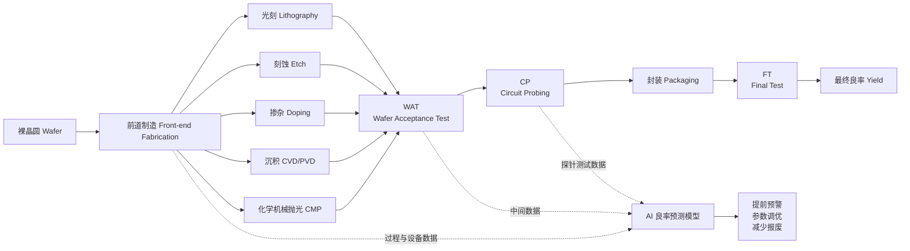
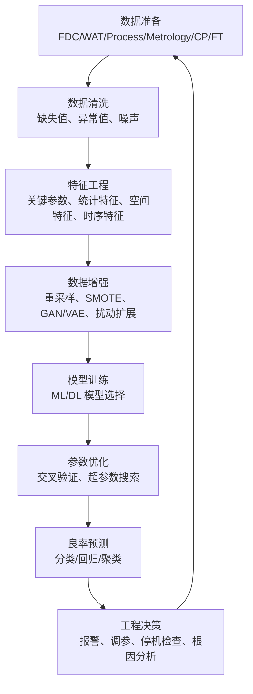
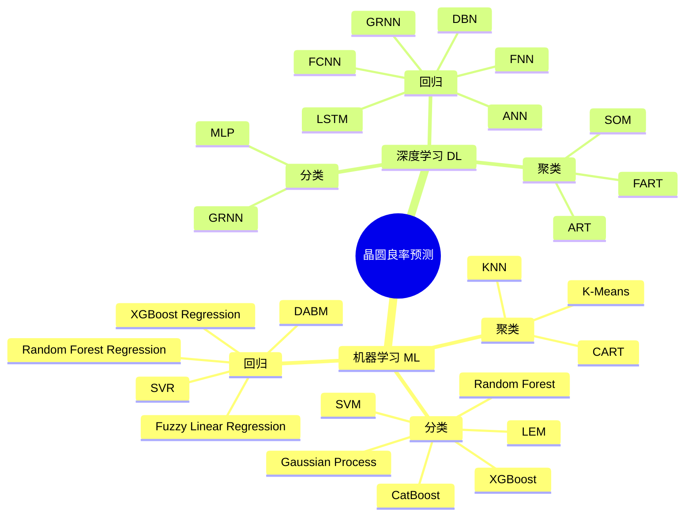
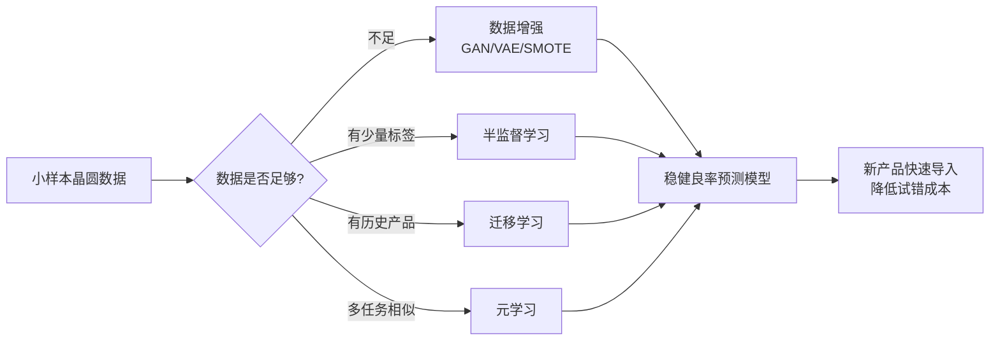
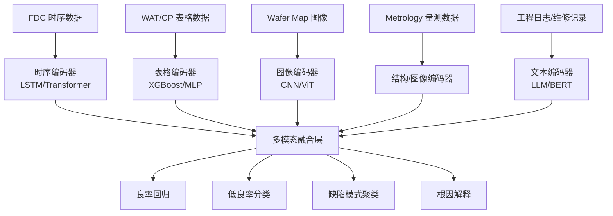

# 从晶圆到良率：AI 如何提前预判一片晶圆的命运？——精读《A survey on semiconductor wafer yield prediction by artificial intelligence》

> 本文基于论文 **A survey on semiconductor wafer yield prediction by artificial intelligence** 展开精读式科普解读。论文聚焦“用人工智能预测半导体晶圆良率”这一问题，系统梳理了数据类型、机器学习方法、深度学习方法，以及未来的三条重要方向：小样本预测、可解释模型、多模态预测。

---

## 1. 先把问题说清楚：为什么“良率预测”这么重要？

在半导体制造里，一片晶圆不是简单地“做出来”就结束了。它要经历光刻、刻蚀、掺杂、化学机械抛光、沉积、晶圆验收测试、晶圆探针测试、封装、最终测试等一连串环节。论文在图 1 中用流程图展示了从 wafer 到 WAT、CP、FT 的基本制造与测试链路：晶圆进入制造流程后，经由 Etch、Doping、Lithography、CMP、CVD 等工艺步骤，再进入 WAT、CP 和 FT 测试阶段。

一个直观比喻是：晶圆厂就像一座极其昂贵、极其精密的“超级厨房”。一片晶圆像一张巨大的面饼，上面会被“烤”出许多芯片。可问题是，只要温度、湿度、气体流量、刻蚀深度、薄膜厚度、光刻偏差、设备漂移中任何一个环节出问题，最后某些芯片就可能失效。最后真正能用的芯片比例，就是良率。

论文给出的良率定义非常直接：

\[
Yield = \frac{Qualified\ quantity}{Total\ production\ quantity} \times 100%
\]

也就是：合格产品数量除以总生产数量。良率越高，意味着过程越稳定，质量控制越有效，生产成本与资源浪费越低。

但“良率预测”的难点在于：真正的良率通常要等很多工艺和测试都完成之后才能计算。到那时，如果问题已经发生，损失往往也已经发生。论文指出，提前预测良率可以帮助工厂在制造过程中尽早发现潜在问题，进而调整工艺参数、降低损失。

所以，晶圆良率预测不是一个普通的数据建模任务，而是一个直接牵动企业盈利能力、产线效率、研发周期和质量控制的核心工业问题。

---

## 2. 论文主线：这不是“又一篇算法综述”，而是一个工业 AI 问题地图

这篇论文的价值在于，它没有只罗列算法名称，而是把“晶圆良率预测”拆成了几个关键层次：

第一层是制造流程：晶圆从制程到测试经历哪些阶段？

第二层是数据来源：FDC、WAT、Process Parameter、Metrology、CP、FT 等数据各自记录什么？

第三层是预测范式：分类、回归、聚类分别适合什么问题？

第四层是算法谱系：传统机器学习和深度学习分别怎么做？

第五层是未来挑战：数据少、模型黑箱、数据单一这三座大山如何突破？

论文明确指出，早期良率预测主要依赖统计方法，例如基于泊松过程建模缺陷分布；但随着制程复杂度、数据维度和非线性关系增加，研究重心逐渐转向机器学习和深度学习。论文将当前主流方法归纳为机器学习方法和深度学习方法，并进一步按照分类、回归、聚类三类问题组织。

这篇论文的核心观点可以压缩成一句话：

> 晶圆良率预测的本质，是利用制造全流程中的多源数据，在最终测试结果出现之前，尽早判断“这片晶圆、这一批次、这些芯片最终能通过多少”。

---

## 3. 一张图看懂晶圆制造与良率预测

论文图 1 展示了晶圆制造流：wafer 经过 Etch、Doping、Lithography、CMP、CVD 等工艺环节后，进入 WAT、CP、FT 等测试阶段。为了让这条路径更适合博客展示，可以用下面的 Mermaid 图重画：



这张图强调一个关键点：AI 并不是等 FT 结束以后才“算分”，而是希望在 WAT、CP，甚至更早的工艺数据阶段就提前预判最终良率。

---

## 4. 数据是良率预测的燃料：六类核心数据如何理解？

论文第 2 节用了相当重要的篇幅介绍晶圆制造中的常见数据类型。理解这些数据，是理解整篇论文的基础。因为在工业 AI 场景里，算法通常不是最先决定成败的因素，数据质量、数据时序、数据粒度和数据可用性才是。

### 4.1 FDC 数据：设备和工艺的“生命体征监护仪”

FDC 是 Fault Detection and Classification，即故障检测与分类系统。它采集设备运行状态和过程参数，例如温度、压力、湿度、气体流量等，并可能记录最小值、最大值、均值、标准差、过程变化等统计特征。FDC 系统的作用像 ICU 监护仪：实时盯着设备和工艺过程，一旦出现偏离，就能尽早报警。

在良率预测里，FDC 数据的价值在于“早”。它往往产生于制造过程中，而不是最终测试之后。因此，如果模型能从 FDC 信号中发现异常模式，就有机会在最终良率下降前进行干预。

### 4.2 WAT 数据：晶圆级电性健康检查

WAT 是 Wafer Acceptance Test。它通常在晶圆制造完成后，对晶圆上的测试结构或测试点进行电性参数评估。论文提到，WAT 数据可能包含阈值电压、漏电流、线宽、缺陷密度等大量测试项，并能揭示短路、电性不稳定等问题。

WAT 很像晶圆的“体检报告”。它不是最终用户功能测试，但它能提前暴露制造过程是否偏离目标。很多良率预测研究都使用 WAT 数据，因为它既比 FT 更早，又与最终性能高度相关。

### 4.3 Process Parameter 数据：制造过程中的实时工艺记录

Process Parameter Data 指制造过程中由传感器和监测设备实时采集的数据，包括电流、电压、化学浓度、设备运行状态、生产速度、时间等。论文指出，这类数据有助于实时监控和控制 IC 制造过程，帮助工程师及时发现并纠正异常。

这类数据的特点是动态、连续、复杂。它常常带有时间序列属性，因此 LSTM、RNN、Transformer 等适合建模时序依赖的模型会有用武之地。

### 4.4 Metrology 数据：形貌、尺寸、缺陷的精密测量

Metrology 数据来自制造过程中的量测，包括薄膜厚度、光刻胶形貌、刻蚀深度、缺陷分布等。论文指出，监测这些数据可以保证制造一致性和稳定性，并帮助晶圆厂降低故障概率、提高良率。

如果说 FDC 是设备状态，WAT 是电性体检，那么 Metrology 更像“显微镜下的结构检查”。先进制程中，纳米级偏差都可能影响芯片性能，因此 Metrology 数据对良率建模非常关键。

### 4.5 CP 数据：每颗裸芯片的功能初筛

CP 是 Circuit Probing，即晶圆探针测试。论文指出，CP 测试在晶圆制造完成后，对每个 die 进行功能测试，并提供每个 die 的性能数据和 CP 阶段良率。

CP 数据很接近最终良率，但仍发生在封装之前。它能告诉我们晶圆上哪些 die 已经表现异常，也能形成 wafer map，即晶圆图。晶圆图上的空间缺陷模式，常常能反推设备、工艺或污染问题。

### 4.6 FT 数据：封装后的最终考试

FT 是 Final Test，即最终测试。论文指出，FT 数据覆盖最终 IC 芯片的功能测试，包括逻辑、电气性能和故障检测，例如开路、短路、漏电流等。FT 数据用于确认芯片是否符合设计规格，也能帮助识别制造问题、优化工艺和提升良率。

FT 是最终结果，但对“提前预测”来说，FT 往往太晚。因此，很多研究会把 FT 良率作为标签，用更早阶段的 FDC、WAT、Metrology、CP 等数据来预测它。

---

## 5. 论文对数据问题的判断：真正稀缺的不是算法，而是高质量晶圆数据

论文特别指出，晶圆良率预测领域缺少公开数据集。原因很现实：数据价值高、采集流程复杂，而且企业通常不愿公开。与此同时，不同研究在数据归一化、降维、清洗等处理方式上没有统一标准；人工采集还可能带来数据质量波动，影响模型稳定性。论文建议未来应推进数据采集标准化、自动化，并研究降低错误数据影响的方法。

这是工业 AI 与互联网 AI 最大的差别之一。

在互联网场景里，图片、文本、点击数据往往规模巨大，收集成本相对低；但在半导体制造里，每一片晶圆都很贵，每一批工艺都带着商业机密，每一个制程参数都可能关系到企业竞争力。于是我们面对的不是“数据多到不知道怎么用”，而是“数据太贵、太敏感、太复杂、太不统一”。

这也解释了为什么论文最后会把“小样本学习”列为未来方向之一。

---

## 6. 良率预测的标准流程：从数据准备到模型上线

论文图 2 给出了一个通用良率预测流程：先准备数据，然后进行数据清洗、特征选择、数据增强，再进入模型训练和参数优化，最后输出预测良率。

可以把这个流程画成下面的 Mermaid 图：



这里最容易被初学者忽略的是：模型训练只是流程中的一部分。真正决定工业模型成败的，往往是前面的清洗、特征选择、标签设计、数据对齐和后面的解释、反馈闭环。

例如：

FDC 是连续过程数据，WAT 是测试点数据，CP 可能是 die 级数据，FT 是封装后芯片级数据。它们的时间戳、粒度、空间位置、批次编号可能都不一样。要把这些数据拼成一个可训练的数据集，本身就是复杂工程。

---

## 7. 分类、回归、聚类：三种预测任务到底有何区别？

论文将良率预测方法按照问题形式分为三类：分类、回归和聚类。分类模型把良率问题转成高良率/低良率、合格/不合格等类别判断；回归模型直接预测连续良率数值；聚类模型则用无监督方式自动发现晶圆或缺陷模式。

### 7.1 分类：先判断“危险不危险”

分类任务适合回答：“这片晶圆是不是低良率风险？”“这个 batch 是否异常？”“某个 die 是否可能失效？”

分类模型的优点是输出简单、便于决策。例如把良率低于某阈值的晶圆标记为 low yield，高于阈值的标记为 high yield。产线工程师看到 low yield 风险，就可以优先检查设备、工艺或材料批次。

但分类也有明显缺点：它会损失细节。良率 89% 和 60% 都可能被标成 low yield，但它们的严重程度完全不同。

### 7.2 回归：直接预测“能有多少良率”

回归任务适合回答：“这片晶圆最终良率可能是多少？”“FT yield 预计为 92.3% 还是 85.7%？”

回归模型更细腻，能支持更精细的成本收益分析。例如，如果模型预测某批晶圆 FT 良率将下降 2%，工程团队可以评估是否值得暂停产线、重做量测或调整工艺窗口。

论文指出，回归方法被广泛用于提升预测精度与可靠性。例如 Jiang 等提出基于 GMM 聚类集成回归器，再结合 XGBoost 预测 FT 良率；Chen 等使用模糊线性回归处理制造过程中的不确定性；Lee 等提出 DABM，将顺序预测基模型与补充数据结合。

### 7.3 聚类：不知道标签时，先找“相似的一群”

聚类任务适合回答：“这些晶圆是否存在类似缺陷模式？”“哪些批次表现相似？”“wafer map 上是否出现系统性空间模式？”

聚类不需要标签，适合早期探索和根因分析。论文指出，聚类分析会把具有相似特征的观测归为一类，适合分析未标注数据。K-Means、KNN、CART 等都被用于晶圆制造数据中的缺陷模式识别和过程异常分析。

聚类的缺点是，它通常不能直接告诉你“最终良率是多少”，而是告诉你“这类晶圆看起来像某种异常模式”。因此，在现代良率预测中，聚类常常和分类、回归、根因分析结合使用。

---

## 8. 传统机器学习：为什么 SVM、RF、XGBoost 仍然重要？

很多人听到“AI 良率预测”会马上想到深度学习，但论文明确指出，传统机器学习在表格数据上仍有独特优势。半导体制造中的很多数据正是高维表格数据，例如 WAT 参数、FDC 统计量、PCM 参数等。

### 8.1 SVM：适合高维、小样本、边界清晰的问题

SVM，即支持向量机，是早期晶圆分类和良率预测研究中常见的方法。论文提到，Baly 等提出了基于 SVM 的晶圆缺陷分类系统；SVM 在高维空间有效，也可以通过核函数处理非线性分类问题。但 SVM 对异常值和噪声敏感，因此需要较好的数据预处理。

在晶圆场景中，SVM 的吸引力来自两个方面：一是高维参数很多，二是样本未必巨大。特别是在新产品导入阶段，小样本、高维特征、类别不平衡几乎是常态。

不过 SVM 也有工程限制：调参复杂，核函数选择影响很大，样本量变大时训练开销增加，解释性也不是最强。

### 8.2 Random Forest：稳健、抗噪、可做特征重要性

论文提到，Park 等设计了一个框架，用 RF 做特征选择，再用 SVM 做最终预测；RF 通过集成多棵决策树降低过拟合、提升模型稳健性，而且不太容易受噪声和异常值影响，还能自动评估特征重要性。

RF 很适合产线工程师初步建模：它不要求特别复杂的特征缩放，对非线性关系有一定处理能力，又能输出 feature importance，帮助工程师找到可能影响良率的关键参数。

但 RF 的缺点也明显：相比单棵树，训练和预测时间更长，内存占用更高；在高维、强相关特征场景下，特征重要性也可能存在偏差。

### 8.3 XGBoost：工业表格数据里的强基线

XGBoost 在大量表格任务中表现强势，论文也多次提到 XGBoost 在良率预测中的应用。例如 Wang 等使用 PSO 做特征选择，并认为 XGBoost 虽然解释性较差，但可以用 SHAP 方法解释。

XGBoost 的优势是预测性能强、能处理非线性和特征交互、对缺失值有一定处理机制，并且适合结构化数据。它的问题是：参数较多，需要调参；模型本身仍偏黑箱，需要借助 SHAP、LIME 等解释工具。

### 8.4 类别不平衡：成熟产线和研发产线会遇到相反问题

论文特别指出，良率分类中存在类别不平衡问题：成熟晶圆厂往往高良率样本占主导，研发线则可能低良率样本更多。已有研究使用 GAN 数据增强、遗传算法欠采样、SMOTE 等技术处理不平衡。

这是非常真实的工业问题。

成熟量产线的问题是：“坏样本太少，模型很难学到异常。”
新产品研发线的问题是：“好样本太少，模型很难知道正常长什么样。”

这两种场景看似相反，但本质都是数据分布不均衡。一个好的良率预测系统，不能只追求总体准确率，还要关注召回率、误报率、漏报率、成本敏感性和工程可操作性。

---

## 9. 传统机器学习方法对比表

| 方法          | 适合数据                | 优点              | 局限                | 在良率预测中的典型用途    |
| ----------- | ------------------- | --------------- | ----------------- | -------------- |
| SVM         | 高维 WAT、FDC、PCM      | 小样本可用，核函数能处理非线性 | 对噪声敏感，调参复杂，可解释性一般 | 高/低良率分类、缺陷分类   |
| RF          | 表格参数、工艺统计量          | 稳健、抗噪、可输出特征重要性  | 内存与时间开销较大         | 特征筛选、良率分类、回归   |
| XGBoost     | 高维结构化数据             | 性能强，适合非线性和特征交互  | 参数多，解释需借助 SHAP    | FT 良率预测、失效风险分类 |
| FLR         | 不确定性强的数据            | 能表达模糊边界和不精确信息   | 建模和解释需领域知识        | 不确定制造过程的良率回归   |
| K-Means/KNN | 未标注数据、wafer pattern | 可发现相似模式         | 不直接预测连续良率，依赖距离定义  | 缺陷模式聚类、异常批次识别  |
| CART        | 探针测试等结构化数据          | 可解释性较好          | 单树容易过拟合           | 探索性根因分析、规则提取   |

---

## 10. 深度学习：从“人工特征”走向“自动表示学习”

论文第 4 节转向深度学习。深度学习的核心优势是：模型可以从复杂数据中自动学习隐含模式，而不完全依赖人工设计特征。论文列举了 MLP、ANN、GRNN、FNN、FCNN、DBN、LSTM、FART、SOM、ART 等方法，并按分类、回归、聚类进行组织。

### 10.1 MLP 与 ANN：最基础也最常见的神经网络

MLP 和 ANN 可以看作深度学习在良率预测中的基础结构。论文提到，Saqlain 等将机器学习和神经网络结合，用投票机制识别缺陷模式；多个 ANN 独立分类，再通过投票决定最终结果。这种方法能缓解传统机器学习处理非线性数据时的局限，但简单 MLP 结构也可能过拟合。

MLP/ANN 的优点是通用、灵活；缺点是对数据量、正则化、网络结构设计较敏感，而且可解释性不足。

### 10.2 GRNN：适合非线性拟合，但要注意平滑因子

GRNN，即广义回归神经网络。论文提到，Wang 等使用 GRNN 对 DRAM 制造中的 wafer probe yield 建模；GRNN 能拟合非线性关系，不需要像 MLP 那样通过多层隐层做复杂映射，因此在一定程度上可降低过拟合风险。

但 GRNN 的关键在于平滑因子。如果平滑因子选择不合理，预测效果会受影响。对于制造数据而言，工艺波动、设备漂移、批次差异都会使这种参数选择变得复杂。

### 10.3 FNN：把“模糊边界”纳入模型

制造过程中的很多判断并不是非黑即白。例如良率 92% 算不算高？某个电压偏移算不算异常？这取决于产品、工艺节点、历史分布和工程容忍度。

FNN，即模糊神经网络，正是为这种模糊性服务。论文指出，FNN 使用隶属度概念给出更具体的良率值，模糊规则也使模型更具解释性；Wu 等将 FNN 用于预测 CP 良率，Zhang 等提出两个 FNN 网络分别用于重调度决策和良率预测。

FNN 的优势是能处理不确定性，并具备一定可解释性。它的问题是训练量大、规则设计复杂，在轻量化应用中受限。

### 10.4 LSTM：处理制造过程的时间依赖

制造数据常常是时间序列：设备状态随时间变化，工艺参数有先后顺序，异常可能在多个步骤后才显现。因此 LSTM 适合建模长期依赖。

论文提到，Kim 等使用测量和设备数据，构建 LSTM 与前馈神经网络结合的模型，效果优于 SVR 和决策树；Lee 等提出 LSTM-AM，将 LSTM 与注意力机制结合，用 FDC 数据预测良率，并借助注意力机制识别影响良率的因素。

LSTM 的价值在于，它能记住“过去发生过什么”。在半导体制造中，这一点很关键：前面某个工艺步骤的小漂移，可能不会立刻造成失效，却会在后续步骤中放大。

### 10.5 DBN：多批次、多任务、复杂特征下的一条路线

DBN，即深度信念网络。论文指出，DBN 具备自适应特征学习能力和多任务泛化能力，在 PCM 和 FT 数据上具有应用价值。Xu 等提出基于 Gath-Geva 模糊聚类和多任务学习 DBN 的自适应虚拟量测模型；后续研究还结合 mRMR、遗传算法、Copula 函数等特征选择方法，并显示 BPNN 和 DBN 方法优于 SVM。

DBN 的意义在于，它试图在复杂、高维、多批次数据中学习更深层的表示。对晶圆厂来说，这类模型有潜力把“经验上看不见的隐含模式”挖出来。

### 10.6 Wafer Map 与 FCNN/CNN：空间模式很重要

论文提到，Jang 等使用 wafer map 数据进行良率预测；Kim 等构建深层全连接网络，根据 die 的几何形状进行预测。

Wafer map 是半导体制造中的重要图像化数据。它告诉我们一片晶圆上哪些位置通过、哪些位置失败。边缘异常、环形缺陷、局部团簇、划痕状失效，都可能对应不同根因。传统表格模型可能看不到这种空间结构，而 CNN 或图模型能更自然地利用空间信息。

---

## 11. 深度学习方法对比表

| 方法           | 适合数据             | 核心能力          | 主要风险       | 工业价值                 |
| ------------ | ---------------- | ------------- | ---------- | -------------------- |
| MLP/ANN      | 表格特征、PCM、WAT     | 通用非线性拟合       | 过拟合、解释性差   | 快速建立神经网络基线           |
| GRNN         | 非线性回归数据          | 拟合复杂关系，结构相对简单 | 平滑因子敏感     | wafer probe yield 预测 |
| FNN          | 不确定、模糊边界数据       | 模糊规则 + 神经网络   | 规则与训练复杂    | 可解释良率预测              |
| FCNN         | wafer map 或几何特征  | 从复杂输入中学习表示    | 易过拟合       | 空间缺陷模式建模             |
| LSTM         | FDC、Process 时序数据 | 捕捉时间依赖        | 训练复杂，数据对齐难 | 提前发现过程漂移             |
| DBN          | PCM、FT、多批次数据     | 深层表示学习        | 结构复杂，部署难度高 | 多任务、多批次良率建模          |
| SOM/FART/ART | 未标注缺陷模式          | 无监督聚类         | 不直接预测良率    | 模式发现、根因辅助            |

---

## 12. 论文中的方法总览图

论文图 3 将良率预测方法分为机器学习和深度学习两大类，再细分为分类、回归、聚类。下面是一个适合博客阅读的复刻版本：



这张图要传达的重点是：不要把良率预测理解成“选一个最强模型”。不同阶段、不同数据、不同业务目标，对应的是不同建模范式。

---

## 13. 分类、回归、聚类在产线里的真实落点

为了把论文内容进一步工程化，可以把三类方法放到产线决策中理解。

### 13.1 分类用于“预警”

例如模型输出：

* 高良率风险：低
* 低良率风险：高
* 是否需要工程师介入：是

这种输出适合 MES、FDC 或 APC 系统中的在线报警。它的目标不是精确到小数点，而是尽早把高风险晶圆或批次标出来。

### 13.2 回归用于“决策优化”

例如模型输出：

* 预计 CP 良率：94.6%
* 预计 FT 良率：91.2%
* 相比历史均值下降：2.8%

这种输出适合成本收益分析。比如是继续流片、返工、补测，还是暂停设备做维护，都需要定量判断。

### 13.3 聚类用于“根因发现”

例如模型发现：

* 某些低良率晶圆集中在同一设备
* wafer map 出现边缘失效模式
* 某些异常批次在 FDC 参数空间中形成独立簇

这类输出不一定直接预测良率，却能帮助工程师理解“为什么良率下降”。

---

## 14. 晶圆良率预测闭环

下面这段 SVG 可以直接嵌入支持 HTML/SVG 的博客页面，用于展示“数据进入模型、模型输出预警、工程反馈回制造”的闭环。它是示意图，不对应论文原图。

```html
<svg width="760" height="330" viewBox="0 0 760 330" xmlns="http://www.w3.org/2000/svg">
  <style>
    .box { fill:#f8fafc; stroke:#334155; stroke-width:2; rx:14; }
    .title { font: 700 18px sans-serif; fill:#0f172a; }
    .txt { font: 14px sans-serif; fill:#334155; }
    .arrow { stroke:#2563eb; stroke-width:3; fill:none; marker-end:url(#arrowhead); }
    .pulse { fill:#ef4444; opacity:0.9; }
    .pulse {
      animation: blink 1.2s infinite alternate;
    }
    @keyframes blink {
      from { opacity:0.15; r:4; }
      to { opacity:0.95; r:9; }
    }
    .flow {
      stroke-dasharray: 8 8;
      animation: dash 1.8s linear infinite;
    }
    @keyframes dash {
      to { stroke-dashoffset: -32; }
    }
  </style>

  <defs>
    <marker id="arrowhead" markerWidth="10" markerHeight="7" refX="9" refY="3.5" orient="auto">
      <polygon points="0 0, 10 3.5, 0 7" fill="#2563eb"/>
    </marker>
  </defs>

  <rect x="30" y="40" width="160" height="90" class="box"/>
  <text x="60" y="75" class="title">制造数据</text>
  <text x="55" y="102" class="txt">FDC / WAT / CP</text>
  <circle cx="165" cy="64" r="6" class="pulse"/>

  <rect x="300" y="40" width="160" height="90" class="box"/>
  <text x="332" y="75" class="title">AI 模型</text>
  <text x="322" y="102" class="txt">分类 / 回归 / 聚类</text>

  <rect x="570" y="40" width="160" height="90" class="box"/>
  <text x="602" y="75" class="title">良率预测</text>
  <text x="595" y="102" class="txt">风险预警 / Yield%</text>
  <circle cx="705" cy="64" r="6" class="pulse"/>

  <rect x="300" y="210" width="160" height="80" class="box"/>
  <text x="332" y="245" class="title">工程反馈</text>
  <text x="317" y="270" class="txt">调参 / 维护 / 根因分析</text>

  <path d="M190 85 C230 85,260 85,300 85" class="arrow flow"/>
  <path d="M460 85 C500 85,530 85,570 85" class="arrow flow"/>
  <path d="M650 130 C650 210,520 250,460 250" class="arrow flow"/>
  <path d="M300 250 C190 250,110 190,110 130" class="arrow flow"/>

  <text x="35" y="315" class="txt">闭环思想：越早预测，越早干预；越多反馈，模型越懂产线。</text>
</svg>
```

---

## 15. 论文最重要的三条未来方向

论文第 5 节给出了三个未来研究方向：小样本预测、透明/可解释方法、多模态预测。这三点几乎可以看作下一代晶圆良率预测系统的核心路线图。

---

## 16. 未来方向一：小样本预测——当数据又贵又少，AI 还能学会吗？

论文指出，随着半导体制程推进和产品复杂度上升，获取高质量训练数据越来越困难和昂贵。因此，在小样本条件下实现高精度良率预测，是关键挑战。

这非常符合半导体研发现实。新产品刚导入时，样本少；先进制程成本高，不可能为了训练模型故意制造大量失败样本；企业也不愿共享数据。因此，传统“大数据喂模型”的思路并不总是可行。

论文提到，已有研究尝试用多元非正态分布、相关分析、PCA 变换从小样本生成更多数据，也有研究用 VAE 过采样、GAN 补全 FDC 缺失值。但这些方法的局限在于：生成数据质量无法完全保证，而且关于模型如何真正从少量样本中学到足够知识的研究仍不足。

论文进一步提出，迁移学习、半监督学习、元学习、稀疏学习等方法值得引入。迁移学习可以把历史产品或成熟工艺中的知识迁移到新产品；半监督学习可以同时使用少量有标签数据和大量无标签数据；元学习可以让模型学会“快速适应新任务”；稀疏学习则有助于在高维参数中找到真正关键的少数特征。

用一句话总结：

> 小样本良率预测的目标，不是让模型“看过很多晶圆”，而是让模型从少量晶圆里学到最关键的工艺规律。

可插入博客的研究路线图：



---

## 17. 未来方向二：模型透明化——晶圆厂不能只接受“黑箱答案”

论文指出，传统黑箱模型虽然有时预测精度很高，但缺少透明度和解释性；而半导体制造物理机制复杂、生产成本极高，因此不可解释是严重短板。透明和可解释模型不仅能提高预测可信度，还能帮助工程师理解预测结果、优化制造过程、降低成本和提升良率。

这点尤其重要。

在推荐系统里，模型推荐错一条视频，损失可能很小；但在晶圆厂里，如果模型误判导致错误停机、错误调参、错误报废，损失可能非常高。工程师不会轻易相信一句“模型说这批晶圆有风险”。他们会追问：

* 哪个工艺步骤导致风险？
* 哪台设备最可疑？
* 哪个参数偏移最大？
* 模型依据是什么？
* 这和历史失效模式是否一致？

论文提到 LIME、SHAP 等解释方法可以提供局部解释，显示各特征对预测结果的影响；注意力机制可以帮助模型自动关注关键特征，并通过注意力权重让工程师看到哪些工艺参数和步骤影响良率最大；GNN 可以捕捉不同工艺步骤和参数之间的复杂关系，并通过图结构可视化帮助理解。

因此，下一代良率预测模型不能只输出：

> 预测良率 = 87.4%

它还应该输出：

> 预测良率下降主要由 Step 142 的腔体压力波动、Step 187 的刻蚀时间偏移、WAT 中漏电流异常共同驱动；其中压力波动贡献 38%，漏电流贡献 24%，刻蚀时间贡献 17%。

这才是工程师能用的 AI。

---

## 18. 未来方向三：多模态预测——一座晶圆厂不只有表格数据

论文指出，晶圆厂拥有来自传感器、图像、文本、时间序列等多种数据，但当前研究大多关注单一数据类型。多模态模型可以融合表格、图像、文本等不同来源，给出更全面、更准确的预测。

为什么多模态重要？

因为单一数据往往只看到问题的一面。

FDC 能看到设备和过程波动，但不一定看到晶圆空间缺陷。
WAT 能看到电性异常，但不一定知道是哪一步工艺导致。
Wafer map 能看到空间分布，但不一定知道设备参数怎么漂移。
工程师日志能记录维护和异常事件，但通常是非结构化文本。
Metrology 图像能看到形貌偏差，但与电性、最终良率之间还要建立连接。

多模态预测就是把这些信息拼起来，让模型更像一个经验丰富的工艺专家：既看设备曲线，也看电性测试；既看晶圆图，也看历史维修记录；既看单片晶圆，也看批次和设备上下文。

论文也指出，多模态并不容易。半导体行业数据获取成本高，数据隐私强；每片晶圆经历数百个制造步骤和几十个测试流程，把所有数据集成进一个模型极其困难；此外，半导体图像同类之间高度相似，连人类专家都可能难以区分，更不用说让机器做像素级分析。

这说明多模态不是“把所有数据扔进大模型”那么简单，而是要解决数据对齐、粒度匹配、特征融合、隐私保护和可解释性等一整套问题。

可插入博客的多模态架构图：



---

## 19. 从论文出发，构建一个“可落地”的晶圆良率预测系统

如果把这篇论文转化为工程实践，一套完整系统可以分为八个模块。

### 19.1 数据接入层

接入 FDC、WAT、Process Parameter、Metrology、CP、FT 数据。重点不是简单采集，而是建立统一的 wafer ID、lot ID、equipment ID、recipe ID、step ID、timestamp 对齐机制。

### 19.2 数据治理层

处理缺失值、异常值、重复数据、单位不一致、传感器漂移、测试点变更等问题。论文指出该领域缺少统一的数据收集和处理标准，因此标准化和自动化是未来重点。

### 19.3 特征工程层

对不同数据做不同特征：

FDC 可提取均值、方差、最大值、最小值、斜率、漂移趋势、报警次数。
WAT 可提取参数分布、异常测试项、测试点空间差异。
CP 可提取 die 级通过率、wafer map 模式、边缘/中心差异。
Metrology 可提取厚度偏差、CD 偏差、缺陷密度。
Process 数据可提取时序窗口特征和步骤间关联特征。

### 19.4 模型训练层

根据目标选择模型：

* 需要快速预警：分类模型
* 需要具体良率：回归模型
* 需要模式发现：聚类模型
* 数据是表格：RF/XGBoost/SVM
* 数据是时序：LSTM/Transformer
* 数据是图像：CNN/ViT
* 数据是工艺网络：GNN
* 数据很少：迁移学习/半监督/元学习

### 19.5 不平衡处理层

对成熟产线和研发产线分别设计采样策略。成熟产线要解决低良率样本少的问题；研发产线要解决高良率样本少的问题。可以考虑 SMOTE、GAN/VAE、代价敏感学习、阈值移动、异常检测等方法。

### 19.6 解释分析层

引入 SHAP、LIME、注意力可视化、规则提取、图结构解释。模型要告诉工程师“为什么预测低良率”，而不是只输出一个分数。

### 19.7 工程闭环层

把预测结果送回工艺工程、设备工程、质量工程团队，用于：

* 调整工艺参数
* 检查设备状态
* 优化 recipe
* 触发补充量测
* 暂停高风险批次
* 追踪根因
* 更新模型数据集

### 19.8 持续学习层

制程会漂移，设备会老化，产品会变化，模型必须持续监控和更新。否则模型会从“良率预测系统”变成“历史经验纪念馆”。

---

## 20. 论文贡献与局限：它解决了什么，又留下了什么？

这篇论文的贡献主要有三点。

第一，它系统整理了晶圆良率预测中的数据类型。很多 AI 论文直接进入模型，但这篇论文先解释 FDC、WAT、Process Parameter、Metrology、CP、FT，这对理解工业背景很重要。

第二，它用机器学习和深度学习两条主线整理方法，并进一步拆成分类、回归、聚类。这种组织方式适合读者快速建立方法地图。

第三，它把未来方向聚焦到小样本、透明模型、多模态三点。这三点不是泛泛而谈，而是直接对应半导体制造中的数据昂贵、模型可信、流程复杂等真实矛盾。

但从精读角度看，论文也有一些可以进一步加强的地方。

一是缺少统一 benchmark。由于公开数据集稀缺，不同论文使用不同私有数据、不同预处理方法和不同评价指标，因此很难公平比较算法优劣。

二是工程闭环讨论还可以更深入。良率预测不只是模型精度问题，还包括报警阈值、误报成本、工艺干预策略、模型上线监控、漂移检测等 MLOps 问题。

三是物理知识融合讨论可以更进一步。半导体制造不是纯数据问题，工艺机理、设备物理、统计过程控制、设计规则都可以成为模型先验。未来的强模型可能不是纯黑箱深度网络，而是“物理知识 + 统计学习 + 深度表示 + 可解释决策”的混合系统。

---

## 21. 给初学者的理解框架：把良率预测看成“提前体检 + 风险评分 + 病因解释”

如果你刚进入这个领域，可以用医疗类比来理解。

晶圆厂是医院。
晶圆是病人。
FDC 是生命体征监测。
WAT 是血液和电性体检。
Metrology 是影像检查。
CP 是术前功能检查。
FT 是最终诊断。
良率预测模型是 AI 医生。
工程师是主治医生。

AI 医生不能只说“病人可能不好”，它必须说：

* 哪些指标异常？
* 异常发生在哪个阶段？
* 与历史哪个病例相似？
* 风险有多高？
* 建议进一步做什么检查？
* 是否需要立即干预？

这就是论文为什么强调可解释、多模态、小样本。半导体制造太贵、太复杂、太高风险，不能只靠一个黑箱分数。

---

## 22. 可发布版总结：这篇论文到底告诉我们什么？

《A survey on semiconductor wafer yield prediction by artificial intelligence》是一篇面向半导体晶圆良率预测的综述论文。它的核心意义在于：把“AI 如何预测晶圆良率”这个复杂工业问题，从制造流程、数据类型、算法体系和未来挑战四个维度梳理清楚。

论文首先说明，晶圆制造包含大量复杂工艺步骤，最终良率直接关系到制造盈利能力和生产效率。良率是合格芯片数量与总芯片数量的比例，但由于它通常要在完整制造与测试后才能计算，所以提前预测良率具有重要价值。

接着，论文介绍了 FDC、WAT、Process Parameter、Metrology、CP、FT 六类关键数据。它们分别对应设备过程监控、电性验收测试、实时工艺参数、制造量测、晶圆探针测试和封装后最终测试。这些数据从不同角度描述晶圆制造过程，共同构成 AI 良率预测的基础。

在方法方面，论文将已有研究分为传统机器学习和深度学习两大类，并进一步按分类、回归、聚类组织。传统机器学习方法包括 SVM、RF、XGBoost、FLR、K-Means、KNN 等，适合表格数据、特征筛选、风险分类和连续良率预测。深度学习方法包括 MLP、ANN、GRNN、FNN、FCNN、LSTM、DBN、SOM、ART 等，适合复杂非线性关系、时序数据、空间模式和深层特征学习。

最后，论文认为当前研究仍面临三大挑战：数据集难以大规模收集，模型缺乏透明性，研究多集中于单一数据类型。对应的未来方向是小样本预测、可解释模型和多模态融合。

用最简洁的话概括：

> 半导体良率预测的下一阶段，不是简单寻找一个更深的神经网络，而是构建一个能在少量高价值数据上学习、能解释预测原因、能融合多源制造信息、能真正服务工程闭环的智能系统。

---

## 23. 一句话读后感

这篇论文最值得带走的观点是：**晶圆良率预测不是单纯的 AI 建模竞赛，而是一场围绕数据、工艺、设备、测试、解释和工程决策闭环展开的系统工程。**
