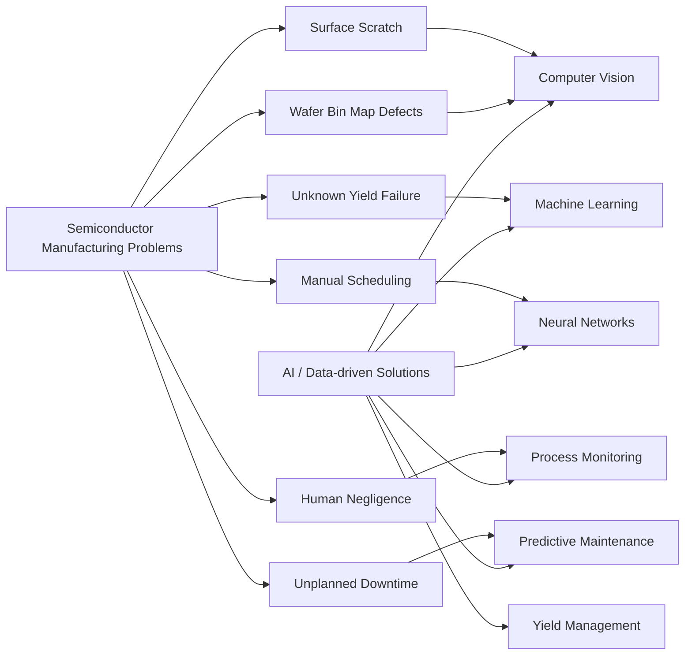
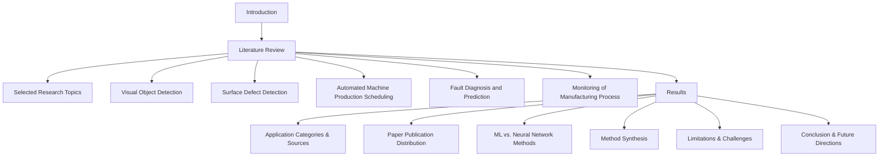
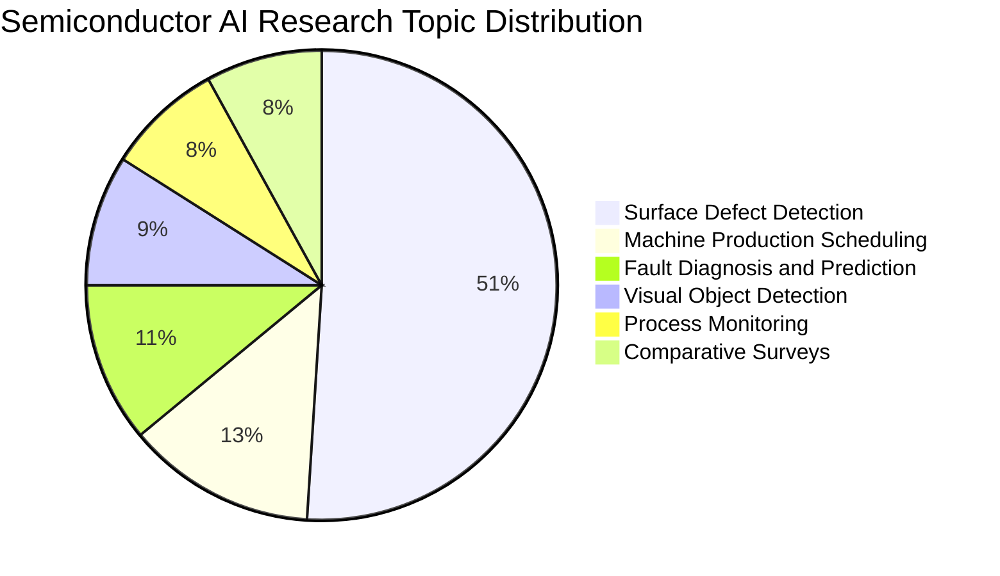
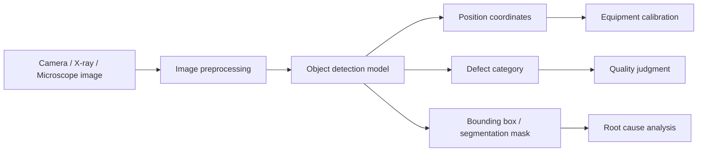
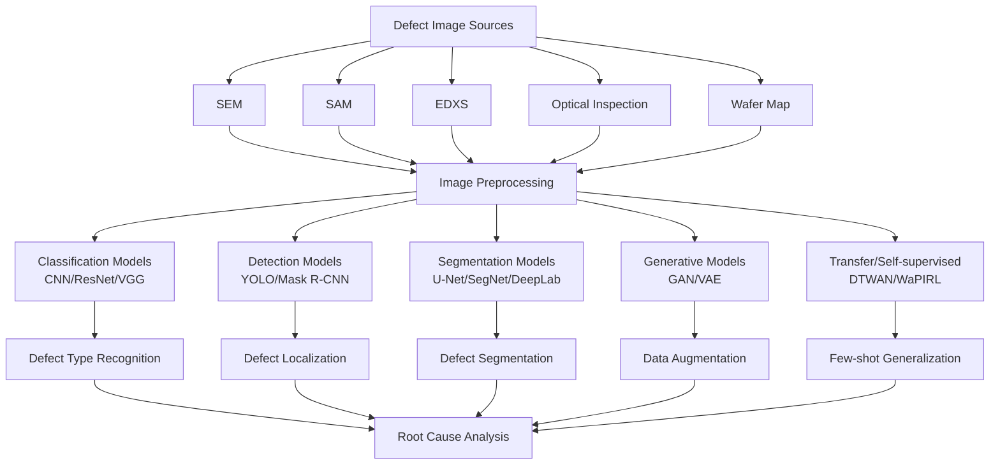
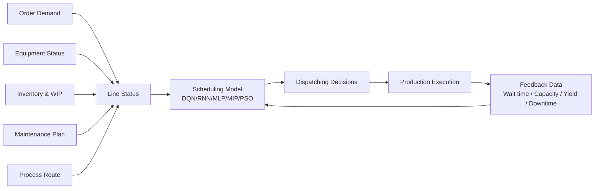
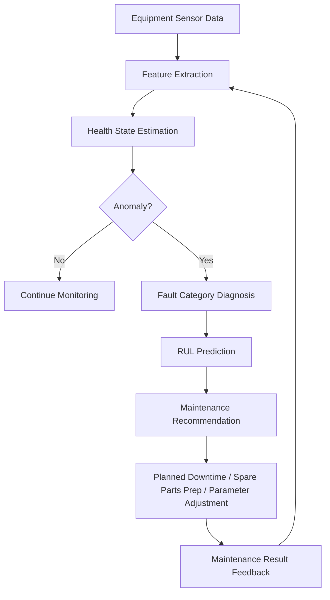
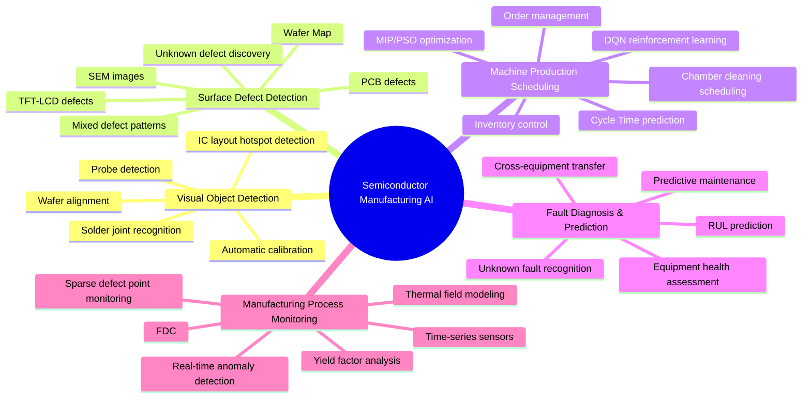
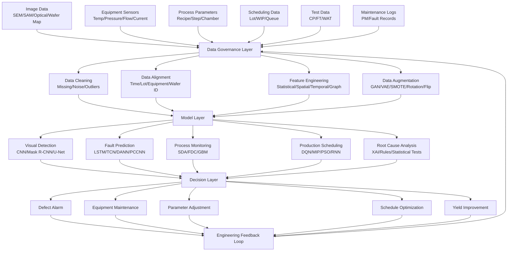

# Teaching the Fab to See, Judge, Schedule, and Heal Itself: An In-depth Read of "A survey on machine and deep learning in semiconductor industry: methods, opportunities, and challenges"

> This long article is based on the paper **A survey on machine and deep learning in semiconductor industry: methods, opportunities, and challenges**. It is not a simple abstract, but a "paper-led" explanatory blog post. I will organize the paper's research background, problem awareness, methodology system, five major application scenarios, representative models, datasets, experimental findings, challenges, and future directions into a ready-to-publish blog article.
>
> The paper was published in *Cluster Computing*, reviewing the applications of machine learning and deep learning in semiconductor manufacturing between 2015 and 2022, with a focus on visual object detection, surface defect detection, machine production scheduling, fault diagnosis and prediction, and manufacturing process monitoring. The paper also summarizes datasets, model architectures, experimental results, and industrial deployment difficulties.

---

## 1. First, Understand What This Paper Is Really About

The title of this paper is:

**A survey on machine and deep learning in semiconductor industry: methods, opportunities, and challenges**

Translated directly:

**A Survey of Machine Learning and Deep Learning in the Semiconductor Industry: Methods, Opportunities, and Challenges.**

It does not only discuss the narrow problem of "wafer yield prediction", but stands from a broader perspective of the semiconductor manufacturing system to answer a more macro question:

> As semiconductor manufacturing becomes increasingly complex, expensive, and approaches physical limits, what problems can machine learning and deep learning actually solve for fabs?

The paper's answer is clear: AI can enter multiple key links in semiconductor manufacturing, especially:

1. Visual object detection
2. Surface defect detection
3. Machine production scheduling
4. Fault diagnosis and prediction
5. Manufacturing process monitoring

In the introduction, the paper notes that modern semiconductor manufacturing already collects vast amounts of data, but as process structures become more complex, it is difficult to achieve uniform, fast, and stable mass production by relying solely on engineers' visual inspection and empirical judgment. At the same time, the development of machine learning and deep learning brings new opportunities for novel devices, integration technologies, computing architectures, and manufacturing systems.

The core value of this paper can be summarized in one sentence:

> **It organizes AI applications in semiconductor manufacturing from "isolated models" into an "industrial problem map".**

That is, it does not simply ask "which model has the highest accuracy?", but asks:

- What are the real pain points in semiconductor manufacturing?
- Which AI techniques are suitable for each pain point?
- Which models have already been validated in the literature?
- Which scenarios have not yet been truly solved?
- Why does high accuracy in the lab not equal real usability in the fab?

This is why this paper is worth reading in depth.

---

## 2. Why Is Semiconductor Manufacturing Particularly in Need of AI?

Semiconductor manufacturing is one of the most complex manufacturing activities in human industrial systems. The paper mentions that advanced wafer fabrication equipment includes lithography, chemical vapor deposition (CVD), physical vapor deposition (PVD), ion milling etching, etching equipment, chemical mechanical polishing (CMP), and more. These equipment collectively serve the fabrication of structures at the micron or even nanometer scale, where any tiny deviation can affect the final chip quality.

Imagine a fab as an extremely precise "automated city".

In this city:

- Lithography machines act like super cameras, projecting circuit patterns onto the wafer;
- Etching equipment acts like nanometer-scale carving knives, removing material bit by bit;
- Deposition equipment acts like atomic-scale sprayers, laying down thin films layer by layer;
- CMP acts like an ultra-precision polisher, flattening the wafer surface;
- Inspection equipment acts like microscopes, X-rays, and electronic eyes, checking defects, topography, and electrical properties;
- Handling systems act like the city's transportation network, moving wafers between different equipment;
- Scheduling systems act like traffic control centers, deciding which lot goes to which machine first.

The biggest problem in this city is: **it is too complex.**

A modern fab may have hundreds or thousands of process steps, each with multiple parameters. Temperature, pressure, gas flow, etch time, film thickness, equipment chamber state, wafer position, maintenance cycles, lot-to-lot variation, raw material changes — all can affect the final result. The paper also emphasizes that maintaining Moore's Law, reducing costs, lowering energy consumption, improving yield, and ensuring product quality at each process step have become extremely challenging tasks.

Traditional fabs rely on three types of capabilities:

First, equipment capability. More advanced equipment can produce smaller and more complex structures.

Second, process experience. Engineers use long-term experience to judge which parameters are abnormal and which patterns indicate a specific fault.

Third, quality inspection. Using optical microscopy, electron microscopy, probe testing, etc., to find defects.

But these capabilities are hitting bottlenecks. The paper notes that as process nodes approach physical limits, simply shrinking device dimensions is no longer sufficient; manufacturing systems must rely on vast amounts of data to control and improve processes.

This is where AI steps in.

The role of AI in semiconductor manufacturing is not to replace process experts, but to transform the massive, complex, real-time, multi-source data in the fab into faster recognition, earlier warnings, better scheduling, and more stable decisions.

---

## 3. Core Message of Figure 1 in the Paper: Production Problems and AI Solutions

Figure 1 on page 2 of the paper is worth attention. The figure juxtaposes "production problems" and "common solutions": production problems include wafer bin map defects, silicon surface scratches, human negligence, unknown yield failures, manual product testing and scheduling, unplanned downtime, etc.; corresponding solutions include manual visual inspection, detectors, yield management systems, neural networks, machine learning, and computer vision.

The subtext of this figure is:

> Semiconductor AI is not a single algorithm problem, but a set of industrial intelligence problems around "seeing, judging, scheduling, controlling, and repairing".

This can be redrawn into a Mermaid diagram more suitable for a blog:



This figure also illustrates that AI in semiconductors is not just "icing on the cake", but a foundational capability to cope with manufacturing complexity.

---

## 4. How Did the Paper Conduct the Review?

The paper did not just pick a few articles at random; it adopted a systematic review approach. The authors searched the literature from 2015 to 2022 in academic networks such as Nature, Elsevier, Springer, Taylor & Francis Online, MDPI, and IEEE, and discussed key achievements, key technologies, experimental results, opportunities, and future research paths. The paper also explicitly aims to compare existing reviews, provide a dataset overview, compare experimental results and performance, and survey new literature from 2015 to 2022.

The paper lists seven main contributions: emphasizing the cross-fertilization of semiconductor technology and computer science, discussing the advantages and disadvantages of combining AI and semiconductors, reviewing ML and DL system designs, summarizing evidence of existing model technologies, surveying paper publication distributions, summarizing current limitations and difficult challenges, and helping researchers locate new research activities.

The structure of the paper is roughly as follows:



The review logic of this paper is well-suited for industrial readers: it is organized by manufacturing problems, not by algorithm names. For the semiconductor industry, this organization is more practical because engineers usually care less about "should I use CNN" and more about "can AI help me detect this defect, this downtime, this scheduling issue, this process drift early and handle it".

---

## 5. Datasets and Experimental Data: Why Is Semiconductor AI So Difficult?

Table 2 in the paper summarizes common data sources and retrieval systems in the research, including WM-811K, kolektorSDD, Benchmark, Mixed WM38, MS COCO, Crystal dataset, DAGM, UCI, MNIST, LSVRC-2012, CVD dataset, IME dataset, etc.; retrieval systems include IEEE, Springer, Nature, Taylor & Francis Online, MDPI, Elsevier, Google Scholar.

These data can be divided into several categories:

| Data Type                | Representative Datasets                  | Corresponding Tasks                                    |
| ------------------------ | ---------------------------------------- | ------------------------------------------------------ |
| Wafer map data           | WM-811K, Mixed WM38                      | Wafer map defect pattern recognition                   |
| Surface image data       | kolektorSDD, DAGM, MS COCO               | Surface defect detection, segmentation, object recognition |
| Layout hotspot data      | ICCAD Benchmark                          | IC layout hotspot detection                            |
| Process parameter data   | CVD dataset, IME dataset                 | Process modeling, fault prediction, process monitoring |
| General image data       | MNIST, LSVRC-2012, MS COCO               | Transfer learning, model pre-training, method validation |
| Industrial classification data | UCI, SECOM-like data                 | Defect classification, fault diagnosis                |

Semiconductor data has several natural difficulties.

First, data is often private. Real fab data involves process secrets, equipment status, product yield, and customer design information, and cannot be publicly released like ordinary image datasets.

Second, data is extremely imbalanced. Normal wafers and normal process data far outnumber anomalous samples. Truly severe defects, rare failures, and unknown categories are scarce.

Third, data is multimodal. Fabs have images, sensor time series, process tables, equipment logs, maintenance records, scheduling data, wafer maps, test results.

Fourth, data drifts. Equipment aging, chamber state changes, process upgrades, product switches all cause data distribution changes.

Fifth, labels are expensive. Wafer defect annotation typically requires experts, and unknown defect types may require root cause analysis even for experts to confirm.

This explains why the paper repeatedly mentions challenges such as data imbalance, lack of annotation, concept drift, unknown classes, and real-time monitoring. The conclusion also notes that studies under experimental conditions often ignore many challenges in the manufacturing environment; the lack of labeled data is a common problem, affecting model generalization.

---

## 6. Research Distribution: Why Does "Surface Defect Detection" Take Half the Pie?

The paper's statistics on the topic distribution of 120 selected studies show: surface defect detection 51%, machine production scheduling 13%, fault diagnosis and prediction 11%, visual object detection 9%, manufacturing process monitoring 8%, comparative surveys 8%. The paper also notes that among these, 100 were published in journals and 20 in conferences; by publisher distribution, IEEE had the highest number, followed by Springer, Elsevier, etc.

We can recreate the topic distribution of Figure 4 using a Mermaid pie chart:



Why does surface defect detection account for the largest share?

The reason is simple: **it most resembles traditional computer vision problems and is the easiest to form trainable data.**

Wafer maps, SEM images, PCB surfaces, TFT-LCD defects, solder joint images, silicon wafer scratches — all can be transformed into image classification, object detection, semantic segmentation, or instance segmentation problems. Deep learning models such as CNN, ResNet, U-Net, Mask R-CNN, GAN, Autoencoder are naturally suited for image processing.

In contrast, scheduling, fault prediction, and process monitoring are more difficult. They require not only models, but also knowledge of equipment, processes, line constraints, and real-time systems. For example, production scheduling cannot just look at accuracy, but also wait time, equipment utilization, due dates, maintenance windows, changeover costs; fault prediction cannot just look at classification accuracy, but also false positives, false negatives, lead time, downtime costs.

Therefore, the abundance of papers on surface defect detection does not indicate it is the most important, but rather that it is the most easily formalized with AI and the easiest to experiment with using public or semi-public datasets.

---

## 7. First Major Application: Visual Object Detection — Enabling Equipment to "See" Key Locations

Visual object detection is a very fundamental type of task in semiconductor manufacturing. The paper points out that the goals of visual detection include: providing high-precision analysis while maintaining productivity, assisting manual inspection on production lines, improving product quality, locating feature positions and orientations of components, comparing with specified error ranges, ensuring coordinate accuracy, and reducing dependence on human judgment for test results.

In semiconductor scenarios, "visual object detection" does not just recognize cats, dogs, or cars, but recognizes:

- Wafer center position;
- Probe position;
- Package solder joints;
- Circuit layout hotspots;
- Anomalous shapes in masks or layouts;
- Interconnect failures in 3D X-ray images;
- Shape deviations caused by lithography or etching.

The paper mentions that research on visual object detection uses a variety of machine learning and neural network methods, including LSTM, YOLO, CNN, FCN, Mask R-CNN, FPNAC, DMBNN, GAN, VGGNet, ResNet, SVM, Random Forest, genetic algorithms, linear programming, and GRASP clustering.

This indicates an important fact: semiconductor visual detection is not something a single CNN can solve. Different tasks require different models.

For example, when identifying chip solder joint defects, Mask R-CNN can simultaneously perform classification, localization, and segmentation; Table 3 in the paper shows that a Mask R-CNN-based solder joint recognition method can simultaneously classify, locate, and segment solder joint defects, achieving 100% classification accuracy and over 90% MAP segmentation accuracy.

Another example: in wafer spatial position alignment, Xu et al. used Fourier transform and least squares regression, requiring only local wafer images to locate the wafer center, with angle algorithm precision of 0.05 and position algorithm precision of 5 pixels, average runtime less than 1.5 seconds.

The essence of visual object detection is to transform "geometric positioning problems" in semiconductor manufacturing into "image understanding problems".

We can think of it this way:



Its industrial value is mainly reflected in three aspects:

First, reduce reliance on manual visual inspection.
Second, improve consistency of positioning and judgment.
Third, base subsequent process control on more accurate spatial information.

However, visual object detection also has clear challenges: semiconductor image defects can be extremely small, background textures complex, real defect samples rare, and production line speed requires the model to respond quickly.

---

## 8. Second Major Application: Surface Defect Detection — The Most Important and Largest Direction in the Paper

Surface defect detection is one of the core parts of the entire paper. The paper notes that multiple processing steps in production can cause surface scratches, wrinkles, protrusions, pits, oxidation, and other defects; starting from early manual inspection, automatic collection and processing of defect information based on machine vision is critical for engineers to identify faults and find root causes.

Why is surface defect detection so important?

Because semiconductor defects are not just "cosmetic issues". A tiny particle, scratch, contamination, lithography anomaly, or etch residue can cause circuit opens, shorts, leakage, performance degradation, ultimately affecting yield and reliability.

The paper mentions that practical scenarios for surface defect detection include large-scale integrated circuit wafers, materials, silicon wafers, PCBs, TFT-LCDs, etc.; commonly used high-performance inspection equipment includes SEM, SAM, EDXS, etc. Computer vision-based methods are widely used for batch automatic inspection of images and for locating and identifying defect types.

### 8.1 From Manual Inspection to CNN

Traditional defect detection relies on manual and rule-based algorithms, such as edge detection, template matching, threshold segmentation, morphological operations. However, as defect shapes become more complex and image backgrounds more varied, such methods gradually become insufficient.

The advantage of CNN is that it can automatically learn texture, edge, shape, and spatial patterns in images, without relying entirely on manually designed features.

Multiple studies in the paper show that CNNs perform outstandingly in wafer map or surface defect detection. For example, Wen et al. proposed a deep convolutional network-based FPNAC and DMBNN method for wafer semiconductor surface defect detection; Table 4 shows that DMBNN achieved an average accuracy of 99.66%.

Cheon et al. used CNN, SAE, MP, SVM, etc., for wafer surface defect classification; Table 4 shows CNN outperformed other models with an average accuracy of 96.2%. However, the authors also note that in real scenarios, to maintain excellent performance, CNN may need retraining as new defect data accumulates, which incurs significant computational burden.

This indicates: CNN is powerful, but it is not a "set-and-forget" tool. New defects appear on the line, and models must be updated.

### 8.2 Wafer Map: Process Root Causes Behind a Single Image

A wafer map is a very important data form in semiconductor AI. It shows the test results for each die on a wafer: which positions pass and which fail.

Common patterns on wafer maps include:

- Center defects;
- Edge defects;
- Ring defects;
- Local clusters;
- Scratch-like defects;
- Random scattered points;
- Mixed defect patterns.

These patterns tell us not only "where it failed", but may also hint at "why it failed". For example, edge ring defects may relate to coating, etch uniformity, or edge handling; local clusters may relate to particle contamination or local equipment anomalies; line defects may relate to mechanical scratches or handling paths.

The paper notes that wafer manufacturing involves hundreds of chemical steps, making it a highly complex and nearly irreversible process; the generation mechanisms of wafer defect maps are diverse, and automatic classification of wafer maps is crucial for revealing defect root causes. Models must not only classify known dominant defect patterns but also discover unknown defect patterns, which is more difficult than binary classification.

### 8.3 Data Imbalance: The Real Challenge of Defect Detection

The paper repeatedly mentions data imbalance. The reason is practical: most wafers are normal or high-yield samples; truly rare defect types are few in number. Yet the model precisely needs to learn to recognize these rare defects.

To address this problem, researchers have used various methods:

- Data augmentation: rotation, flipping, translation, adding noise;
- Random under-sampling;
- SMOTE;
- GAN generation of defect samples;
- VAE augmentation;
- Transfer learning;
- Few-shot detection networks;
- Self-supervised pre-training;
- Active learning.

The paper notes that when wafer defect data is imbalanced, physical data augmentation methods such as wafer flipping, wafer transformation, and wafer combination can be used, as well as random under-sampling; deep transfer learning adversarial networks can be used for knowledge transfer and feature transfer on wafer graphs, alleviating training difficulties and low recognition accuracy when classifying with small labeled samples.

### 8.4 GAN: Using Generative Models to Compensate for Rare Defects

GAN appears frequently in the paper. Its core idea is: use a generator to simulate defect images, use a discriminator to judge real/fake, and finally generate samples closer to the true distribution.

The paper mentions that Kim et al. proposed a GAN model to identify semiconductor crystals and small defects, using multiple models such as Pixel-GAN, Patch-GAN, Vanilla-GAN, with Pixel-GAN achieving an average accuracy of 92.3%. This method no longer needs to assume a data distribution, but directly samples to approximate the real data, solving the difficulty of classifying small-type defects.

This is highly insightful for semiconductors: many critical defects are not uninteresting, but too rare. The significance of GAN, VAE, self-supervised learning, and transfer learning is to enable models to learn effective features even with scarce samples.

### 8.5 Overall Roadmap for Surface Defect Detection



The endpoint of surface defect detection is not "the model gives a category", but to help engineers answer:

> Where did this defect come from? Will it affect yield? Does it require stopping the line, cleaning, adjusting parameters, or tracing a specific piece of equipment?

This is the biggest difference between semiconductor AI and ordinary image recognition.

---

## 9. Third Major Application: Machine Production Scheduling — Teaching the Fab to "Manage Time Better"

Machine production scheduling is a very complex problem in semiconductor manufacturing. The paper notes that semiconductor manufacturers are committed to unified production management paradigms, optimizing scheduling and resource allocation to improve product quality; the importance of deep learning in production scheduling involves not only production parameters and efficiency optimization, but also automatic prediction, scheduling, inventory control, and order management.

Why is fab scheduling difficult?

Because it is not like an ordinary factory where "product goes from A to B to C once". Semiconductor manufacturing has the following characteristics:

- Huge number of process steps;
- The same wafer may return to the same type of equipment multiple times;
- Different products have different recipes;
- Equipment status and maintenance windows differ;
- Some equipment are bottleneck resources;
- Some steps have waiting time constraints;
- Some chambers require periodic cleaning;
- Lot priorities can change;
- Customer due dates, yield risk, equipment utilization conflict with each other.

Thus, scheduling is essentially a dynamic optimization problem.

The paper selected 15 studies on machine production scheduling, of which 7 were published in journals and 8 in conferences; relevant studies account for about 13% of the selected papers. These studies use ML algorithms or combinations to optimize structures, aiming for automated prediction, resource allocation, inventory control, and reducing scheduling complexity such as wafer chamber cleaning.

Models appearing in Table 5 include Deep-Q-Network, Polynomial regression DNN, Two phase DQN, MLP, Bayesian network, BPN, RNN, Timed Petri Net, GAN, MGP, GA, LR, Bayes, RF, AdaBoost, DT, GP, MIP, PSO, etc.

### 9.1 Why Is Reinforcement Learning Suitable for Scheduling?

Reinforcement learning is suitable for "sequential decision-making" problems. A scheduling system must decide at each step:

- Which lot to process next?
- Which equipment receives it?
- Should it wait?
- Should cleaning be triggered?
- Should urgent orders be prioritized?
- Should high-risk equipment be avoided?

An RL agent learns a policy by trial and error in an environment, based on reward signals. Table 5 mentions that Sakr et al. used RL and DQN, with proper definition of system state information and reward functions, to achieve complex dispatching decisions; a good reward function prevents the agent from getting stuck in irrelevant decisions.

This fits the nature of scheduling tasks: it is not a one-shot prediction, but "make a decision, see the consequence, make the next decision".

### 9.2 DNN and MGP: Optimizing Productivity from Geometric Layout

Table 5 mentions that Kim et al. used DNN and MGP models; the Polynomial regression DNN achieved 7.96% higher wafer productivity than a typical MGP model, indicating that changing only the mold base can improve ROI-based productivity.

This type of research shows that AI can not only detect defects but also enter the realm of productivity optimization.

### 9.3 Online Learning and Concept Drift

One of the biggest problems with scheduling systems is: the rules learned today may be invalid tomorrow.

Changes in machine types, production flows, product structures, and order structures all cause the model to face new distributions. Table 5 mentions that Q-Networks may need retraining when machine types and production flows change; other studies use online and incremental learning frameworks to face real concept drift challenges over longer time horizons.

Therefore, semiconductor scheduling AI cannot be a one-time model; it must be a system capable of continuous learning.

### 9.4 The AI Closed Loop for Production Scheduling



The scheduling model ultimately serves the overall efficiency of the production system, not a single prediction metric. Therefore, evaluation should consider:

- Is cycle time reduced?
- Is equipment utilization improved?
- Are due dates more stable?
- Are cleaning and maintenance more reasonable?
- Is unnecessary waiting reduced?
- Are high-risk lots intervened in time?

This also explains why scheduling is harder to deploy than defect classification: it involves the entire factory system.

---

## 10. Fourth Major Application: Fault Diagnosis and Prediction — From "Fix After Break" to "Prevent Before Break"

Fault diagnosis and prediction is a highly valuable AI application in semiconductor manufacturing. The paper points out that automatically identifying faults and defect predictions, classifying and determining root causes of process faults is very important; as wafer size increases, manufacturing processes become more complex, with more potential variables, and the lifetime of production and measurement tools also becomes an important variable for automatic fault and defect prediction.

Fault diagnosis can be divided into two layers:

The first is diagnosis: a problem has occurred, determine what the fault is.

The second is prognosis: not yet broken, predict when it will break.

The paper particularly emphasizes "maintenance instead of repairs", i.e., replacing reactive maintenance with predictive maintenance. However, in real industrial scenarios, data differences between different tools, limited fault data, and class imbalance make the task very challenging.

### 10.1 Predicting Equipment Remaining Useful Life (RUL)

The paper mentions that C. Liu et al., for time-to-failure prediction in an ion abrasion etching process, proposed a two-stage deep transfer learning framework for multiple fault modes. The first stage selects a base fault mode, aligns condition monitoring data from multiple tools via domain adversarial learning, and uses a convolutional network to learn temporal representations from time-series sensor data; the second stage uses the deep model trained in the first stage as a pre-trained model, fine-tuning with data from other fault modes to handle fault prediction under rare conditions.

This idea is crucial: in a fab, different equipment may have different data distributions, and even the same fault may manifest differently depending on equipment, chamber, recipe, environment. Transfer learning and domain adaptation allow models to not start from scratch.

### 10.2 Known Faults vs. Unknown Faults

Many traditional data-driven intelligent fault diagnosis methods can only recognize known classes, but struggle with unknown classes. The paper mentions that Ma et al. proposed a probability confidence convolutional neural network (PCCNN), which computes the probability and confidence level of a sample belonging to each known class via CNN, thereby identifying known and unknown classes; simultaneously, self-learning updates the PCCNN structure and parameters, giving the model the ability to recognize new classes. In experiments, the average accuracies for identifying unknown and known classes on bearing, gearbox, and rotating machinery fault data reached 97.42% and 96.87%, respectively.

This is particularly important for semiconductors. In real production lines, the most troublesome issues are often not known faults, but anomalies appearing for the first time. If a model can only choose among fixed categories, it may force an unknown anomaly into a known category, leading to wrong decisions.

### 10.3 Fault Diagnosis Model Spectrum

The algorithms listed in the fault diagnosis and prediction section include ANN, FFNN, RNN, DANN, LSTM, TCN, CNN, FDC, domain adaptation CNN, PCCNN, SMOTE-SVM, XGBoost, SDA, SVM, LR, DT, RF, MLP, SVC, AdaBoost, GBM, PCA, KNN, Bayes, LDA, GFK, JDA, TCA, BDA, etc.

These algorithms can be understood by task:

| Task                         | Suitable Methods                                  | Explanation                                                |
| ---------------------------- | ------------------------------------------------- | ---------------------------------------------------------- |
| Sensor time-series fault prediction | RNN, LSTM, TCN, CNN                               | Learn temporal dependencies and waveform changes           |
| Small-sample fault classification | SVM, RF, XGBoost, SMOTE                           | Suitable for structured data and imbalance problems        |
| Cross-equipment transfer     | DANN, TCA, JDA, BDA, GFK                          | Address data distribution differences across equipment     |
| Unknown fault recognition    | PCCNN, Open-set methods                           | Recognize new categories not present in training set       |
| Feature compression & denoising | SDA, Autoencoder, PCA                             | Learn robust representations from noisy data               |

### 10.4 Fault Prediction Closed Loop



The thing fabs fear most is unplanned downtime. A critical equipment downtime not only loses equipment capacity, but also affects WIP wait times, due dates, and yield. Therefore, the business value of fault prediction is very direct.

---

## 11. Fifth Major Application: Manufacturing Process Monitoring — Making Process State Visible in Real Time

The paper points out that there are tens of thousands of process steps in semiconductor manufacturing, each with multiple parameters. To effectively manage and monitor process states in real time, a monitoring mechanism is indispensable; developing real-time monitoring and predicting whether the next process or process parameter is abnormal is very important.

Process monitoring is related to fault diagnosis, but with a different focus.

Fault diagnosis is more like determining "is the equipment broken".
Process monitoring is more like determining "is the current process state deviating from the normal track".

### 11.1 FDC: The Vital Signs Monitor for Semiconductor Manufacturing

FDC stands for Fault Detection and Classification. It typically uses time-series signals recorded by in-situ equipment sensors, extracts features useful for fault detection, and feeds them into a classifier. The paper notes that traditional preprocessing and classification methods often lose important information in sensor signals for wafer failure detection. Lee et al. proposed using a stacked denoising autoencoder (SDA) for simultaneous feature extraction and classification; SDA can identify global and invariant features in sensor signals, is robust to measurement noise, and outperforms other models by about 14% in high-noise scenarios.

This indicates that process monitoring does not deal with clean data, but with noise, drift, missing values, and complex nonlinear signals.

### 11.2 LSTM: Handling Long Delays and Dynamic Processes

Crystal growth, thermal field control, etching processes, CVD processes, etc., all have temporal dependencies. The paper mentions that Zhang et al. proposed an LSTM-based network structure and training algorithm, first building a thermal field model to simulate the crystal growth process, then using SVM to determine the model order and lag to improve network input selection and accuracy. In this scenario, CZ silicon single crystals have complex nonlinearity, large delays, and time-varying dynamics; traditional model-based control methods are limited by modeling difficulties and unmodeled dynamics.

This type of problem is very typical: changes in process parameters do not immediately reflect in results; there may be delays, accumulation, and coupling. Time-series models such as LSTM, TCN, and Transformer have natural advantages in such scenarios.

### 11.3 Sparse Convolution: Handling Large-Scale Defect Lists

The paper mentions that Huang et al. proposed a wafer monitoring pipeline based on submanifold sparse convolutional networks. This method can process defect lists as large inputs without losing information, can also handle sparse data of arbitrary resolution, and quickly detect and recognize new patterns.

This indicates that manufacturing process monitoring is not always regular tables or ordinary images. Often, data is sparse, spatial, and irregular, such as defect points distributed on a wafer. Methods like sparse convolution and graph neural networks will become increasingly important in the future.

---

## 12. A Master Diagram of the Five Major Applications of Semiconductor AI



---

## 13. ML vs. DL: How Does the Paper Compare the Two Approaches?

Section 3.3 of the paper summarizes the advantages and disadvantages of machine learning and neural network methods.

The paper argues that ML methods are suitable for small-scale data classification, but initial training can be time-consuming and expensive; if data is insufficient, it is difficult to train a model that optimizes the objective function. ML methods also rely on task specificity and expert experience for feature design, and the output results are not easy to interpret correctly, nor easy to eliminate uncertainty, so tuning training parameters is not simple.

In contrast, neural networks are suitable for larger data volumes because they do not rely heavily on manual feature engineering; they can first learn simple features from large data, then gradually learn complex and abstract deep features; they have capabilities such as self-learning, feedback associative storage, and adaptive high-speed search for optimal solutions, and can handle uncertain or unknown systems.

But neural networks are not a panacea. The paper notes that when the network structure is large, high-order functions contain many parameters, regularization parameters are inappropriate, or the sample size is small, overfitting is prone; when feature dimensions are too small or the model structure is too simple, underfitting is prone. Both cause performance degradation, reduced fault tolerance, or even non-convergence.

We can compare them as follows:

| Dimension            | Traditional Machine Learning                     | Deep Learning                                                |
| -------------------- | ------------------------------------------------ | ------------------------------------------------------------ |
| Suitable data        | Small to medium tabular data, well-defined features | Large-scale images, time series, multimodal data             |
| Feature requirement  | Relies on expert feature engineering             | Can automatically learn hierarchical features                |
| Interpretability     | Generally stronger, especially tree models       | Often weaker, requires explainability techniques             |
| Training cost        | Generally lower, but complex feature selection can be expensive | Generally higher, requires GPU and large data                |
| Generalization issues | Heavily affected by feature quality              | Prone to overfitting, underfitting, or distribution shift    |
| Typical semiconductor applications | SVM, RF, XGBoost, KNN, Bayes                | CNN, RNN, LSTM, GAN, Autoencoder, DANN                       |

My understanding is:

> Semiconductor AI should not be superstitious about deep learning, nor should it stay only with traditional machine learning. Truly effective systems are often hybrid: use process knowledge to construct features, use ML for robust baselines, use DL to learn complex patterns, and use explainable methods to connect models with engineering judgment.

---

## 14. Popular Science Explanations of Common Models in the Paper

### 14.1 CNN: The Workhorse for Semiconductor Image Recognition

CNN is suitable for image processing because it uses local receptive fields and weight sharing to learn edges, textures, shapes, and spatial patterns. In wafer maps, SEM images, PCB surfaces, and TFT-LCD defects, CNN is one of the most common methods.

In the paper, CNN is used for wafer map classification, surface defect recognition, layout hotspot detection, FDC-CNN fault classification, etc.

### 14.2 Mask R-CNN: Not Only Knows What, But Also Where

Mask R-CNN can simultaneously perform object classification, object localization, and pixel-level segmentation. Semiconductor defect detection often requires knowing the exact location and shape of defects, so Mask R-CNN is more suitable than ordinary classification models for scenarios needing localization.

### 14.3 U-Net / SegNet / DeepLab: Pixel-Level Defect Segmentation

In many inspection tasks, engineers not only want to know "there is a defect", but also the precise contour of the defect area. Models like U-Net, SegNet, and DeepLab are suitable for semantic segmentation, classifying each pixel into normal or defect categories.

### 14.4 GAN: Using Generated Data to Alleviate Few-Shot and Imbalance

GAN is often used in the paper for defect sample augmentation and unknown defect simulation. For rare defects, GAN can generate near-realistic samples to help classifiers learn more stable boundaries.

### 14.5 Autoencoder: Extracting Robust Features from Noise

Autoencoder compresses input and then reconstructs it, learning the main structure of the data. Denoising Autoencoder is particularly suitable for noisy scenarios. In the paper, SDA is used for FDC process monitoring, standing out in high-noise sensor signals.

### 14.6 LSTM / RNN: Understanding Time-Series Process Data

Many data in semiconductor processes are time series, such as temperature curves, pressure curves, gas flow, equipment status, current, voltage. LSTM can model long-term dependencies, suitable for predicting delayed effects and dynamic processes.

### 14.7 DQN: Turning Scheduling into Decision Learning

DQN combines reinforcement learning with deep networks for complex scheduling decisions. It is not simply prediction, but learning a policy within a state-action-reward framework.

### 14.8 DANN / Transfer Learning: Addressing Cross-Equipment, Cross-Product, Cross-Process Distribution Differences

Domain shift is severe in semiconductor manufacturing. A model that works well on one piece of equipment may perform poorly on another. Methods like DANN, TCA, JDA, BDA help models learn more transferable features.

---

## 15. Why Does High Lab Accuracy Not Equal Fab Usability?

The paper includes many tables listing model accuracies, some very high. For example, DMBNN achieved an average accuracy of 99.66% on the kolektorSDD surface defect task; CNN with data augmentation achieved 99.29% test accuracy on WM-811K; JLNDA achieved an average model accuracy of 99.98% in large-scale wafer pattern inspection.

These results are exciting, but industrial deployment requires caution.

Because fabs care about more than just accuracy.

They also care about:

- Does the model still work on new products?
- Does it need retraining when defect categories change?
- Are low-frequency severe defects recalled?
- Will false positives cause unnecessary downtime?
- Will false negatives cause batch scrap?
- Does model inference speed meet online inspection requirements?
- Can it be explained to engineers?
- Can it integrate with MES, FDC, APC, YMS systems?
- Can it alert automatically when data distribution drifts?
- Is model maintenance cost acceptable?

The paper also notes that industrial cases show that manufacturing environments and dataset conditions vary greatly across studies, so more validation is needed to compare different techniques. Studies under experimental conditions often ignore many challenges posed by the manufacturing environment; researchers must not only prove models effective but also cope with the high complexity and real-time production process characteristics of manufacturing systems.

This sentence is one of the souls of the entire paper.

The real difficulty of AI in semiconductors is not "training a model", but making the model run reliably in a real fab over the long term.

---

## 16. Core Challenges of Semiconductor AI

### 16.1 Lack of Labeled Data

The paper explicitly states that the lack of labeled data is a common challenge in manufacturing environments, affecting model generalization.

Semiconductor defect annotation typically requires experts, and many anomalies rarely occur. A model that has only seen common defects may fail to recognize unknown risks.

### 16.2 Class Imbalance

The paper notes that not all frameworks can autonomously obtain new class data, and the extreme imbalance in class data volumes leads to inaccurate model training. To address this, researchers use translation, rotation, noise addition, dimensionality reduction, feature extraction, transfer learning, etc., to create new batches of data.

### 16.3 Unknown Classes and Open-Set Recognition

Real production lines present defects not seen in the training set. Ordinary classifiers can only choose among known classes, prone to misclassification. Therefore, open-set recognition, unknown defect detection, PCCNN, self-supervision, and active learning are important.

### 16.4 Cross-Equipment, Cross-Process, Cross-Product Transfer

Data distributions differ across equipment, chambers, and recipes. The paper mentions in the fault prediction section that the coexistence of data differences between different tools and limited fault data is a major challenge in real industrial scenarios.

### 16.5 Concept Drift

Production lines are not static. Equipment aging, maintenance, parameter adjustments, and product switches all cause models to face new distributions. The paper's conclusion proposes the need to develop methods that can learn complex nonlinear relationships without supervised labels and adapt to concept drift.

### 16.6 Lack of Interpretability

Many deep models have high accuracy but cannot explain why. Semiconductor engineers cannot accept just an "anomaly probability of 0.97"; they need to know:

- Which parameter is anomalous?
- Which time period is anomalous?
- Which equipment is suspicious?
- Which spatial region shows a pattern?
- Does this correspond to a known process root cause?

Table 6 mentions that FDC-CNN can provide information on key sensor variables and time periods, helping people without relevant background understand fault diagnosis information.

This type of explainability is key to whether industrial AI can be trusted by engineers.

### 16.7 High Deployment Cost

The paper concludes that introducing AI in manufacturing environments requires significant upfront investment; financial, time, and human costs demand that models and systems perform near-perfectly.

This is realistic. Fabs are not internet applications; they cannot afford trial and error. A wrong model can lead to erroneous downtime, wrong parameter adjustments, wrong scrap, with high costs.

---

## 17. A Deployable Semiconductor AI System Architecture

Based on the paper's content, a semiconductor AI system can be abstracted into the following architecture:



The key of this architecture is not the models themselves, but the closed loop:

**Data → Model → Decision → Execution → Feedback → Re-learn.**

Semiconductor AI only generates real industrial value when it enters this closed loop.

---

## 18. How AI Drives the Fab Closed Loop

The following SVG shows the dynamic closed loop of "data entering the model, model outputting decisions, line feedback continuing training".

```html
<svg width="860" height="360" viewBox="0 0 860 360" xmlns="http://www.w3.org/2000/svg">
  <style>
    .box { fill:#f8fafc; stroke:#334155; stroke-width:2; rx:14; }
    .title { font: 700 18px sans-serif; fill:#0f172a; }
    .txt { font: 14px sans-serif; fill:#334155; }
    .arrow { stroke:#2563eb; stroke-width:3; fill:none; marker-end:url(#arrowhead); }
    .flow { stroke-dasharray:8 8; animation: dash 1.7s linear infinite; }
    .pulse { fill:#ef4444; animation: pulse 1.2s ease-in-out infinite alternate; }
    @keyframes dash { to { stroke-dashoffset:-32; } }
    @keyframes pulse {
      from { opacity:0.2; r:4; }
      to { opacity:1; r:9; }
    }
  </style>

  <defs>
    <marker id="arrowhead" markerWidth="10" markerHeight="7" refX="9" refY="3.5" orient="auto">
      <polygon points="0 0, 10 3.5, 0 7" fill="#2563eb"/>
    </marker>
  </defs>

  <rect x="40" y="50" width="170" height="95" class="box"/>
  <text x="78" y="83" class="title">Manufacturing Data</text>
  <text x="62" y="112" class="txt">Image / FDC / Process / Schedule</text>
  <circle cx="185" cy="72" r="6" class="pulse"/>

  <rect x="345" y="50" width="170" height="95" class="box"/>
  <text x="382" y="83" class="title">AI Models</text>
  <text x="360" y="112" class="txt">CNN / LSTM / GAN / DQN</text>

  <rect x="650" y="50" width="170" height="95" class="box"/>
  <text x="688" y="83" class="title">Smart Decisions</text>
  <text x="672" y="112" class="txt">Inspect / Diagnose / Schedule / Alert</text>
  <circle cx="793" cy="72" r="6" class="pulse"/>

  <rect x="345" y="235" width="170" height="85" class="box"/>
  <text x="383" y="268" class="title">Line Feedback</text>
  <text x="365" y="294" class="txt">Maintenance results / Yield / Process adjustments</text>

  <path d="M210 98 C260 98,295 98,345 98" class="arrow flow"/>
  <path d="M515 98 C565 98,600 98,650 98" class="arrow flow"/>
  <path d="M735 145 C735 230,590 278,515 278" class="arrow flow"/>
  <path d="M345 278 C220 278,125 215,125 145" class="arrow flow"/>

  <text x="40" y="340" class="txt">Core idea: Semiconductor AI is not a one-off model, but a continuous closed loop of data, models, engineering decisions, and line feedback.</text>
</svg>
```

---

## 19. Looking to the Future from the Paper: Where Are the Opportunities for Semiconductor AI?

Although the paper is a 2023 review, many of the challenges it raises remain critical today. Combining the paper's content, future opportunities can be summarized into six directions.

### 19.1 From Point Models to System-Level Intelligence

Much past research solved only one point: classify a defect, predict a fault, optimize a scheduling sub-problem. The more important future is system-level intelligence: linking vision, sensors, testing, scheduling, maintenance, and yield data.

### 19.2 From Supervised Learning to Few-Shot, Semi-Supervised, and Self-Supervised Learning

Semiconductor defect data is scarce, labels are expensive, unknown categories are many, so pure supervised learning is insufficient. Self-supervised pre-training, active learning, semi-supervised learning, and few-shot learning will become increasingly important.

### 19.3 From Closed-Set Classification to Open-Set Recognition

Real factories encounter unknown defects. Models must be able to say "this is not any category I know", rather than force a wrong label.

### 19.4 From Static Models to Continuous Learning

Concept drift is the norm in manufacturing systems. Future models must have online monitoring, drift detection, incremental learning, and safe rollback mechanisms.

### 19.5 From Black-Box Prediction to Explainable Decisions

Engineers need to know why the model alarms. Explainable AI is not just icing on the cake, but a necessary condition for semiconductor AI deployment.

### 19.6 From Single Modality to Multimodal Fusion

Fab data is naturally multimodal: images, time series, tables, logs, spatial coordinates, test results. Future high-value models will certainly fuse multiple data types, rather than looking only at single images or single sensors.

---

## 20. Contributions and Limitations of the Paper

The contributions of this paper are mainly four.

First, it organizes AI applications in semiconductor manufacturing by problem scenarios, not by algorithm stacking. This is very friendly for industrial readers.

Second, it covers a wide range, from visual inspection, surface defects, to scheduling, fault prediction, process monitoring, essentially covering several key directions of smart semiconductor manufacturing.

Third, it compiles many models and datasets, which is very helpful for researchers to get started quickly.

Fourth, it does not only promote the benefits of AI, but also points out challenges in real manufacturing environments, including lack of labeled data, class imbalance, concept drift, overfitting, underfitting, cross-equipment differences, and high deployment costs.

However, the paper also has some limitations.

First, its review scope is broad, so the depth of each direction is not fully balanced. For example, the surface defect detection part is very rich, while scheduling and process control parts are more like method listings.

Second, some model results in the paper come from different datasets, different tasks, and different experimental conditions, and cannot be simply compared horizontally. A model achieving 99% accuracy on WM-811K does not guarantee the same performance on unknown defect detection in a real fab.

Third, the paper does not deeply discuss MLOps, model deployment, industrial system integration, data governance, model drift monitoring, safety validation, and other engineering issues. These are precisely the most critical parts when moving from paper to production line.

Fourth, the paper mainly focuses on literature from 2015 to 2022, with limited discussion of new trends such as large models, vision foundation models, industrial multimodal models, and systematic application of Transformers in manufacturing time series. This is determined by the publication date and does not affect its foundational value as a review of semiconductor AI.

---

## 21. Reading Suggestions for Different Audiences

### For Semiconductor Engineers

The most valuable part of this paper to read is not the accuracy of a particular model, but the "problem–data–model–challenge" map it provides. Engineers can use it to check which category their line problem falls into: visual detection, surface defects, scheduling, fault prediction, or process monitoring.

### For AI Researchers

This paper reminds us that semiconductor manufacturing is not an ordinary Kaggle image classification problem. The real challenges lie in data scarcity, class imbalance, distribution shift, unknown defects, real-time requirements, interpretability, and system integration.

### For Industry Managers

This paper shows that AI can improve efficiency, reduce manual judgment, improve scheduling, assist predictive maintenance, but also requires upfront investment and systematic implementation. AI cannot be viewed as buying a model, but as building a data-driven manufacturing capability.

### For Students and Beginners

Start with surface defect detection, as it is closest to basic computer vision tasks; then read fault diagnosis and process monitoring to understand the time-series nature of semiconductor data; finally read scheduling to understand how AI enters factory operations decisions.

---

## 22. Summarizing the Whole Paper with an Analogy

If we compare a fab to a super hospital:

- Visual object detection is like the radiology department, responsible for seeing structural positions clearly;
- Surface defect detection is like the pathology department, responsible for identifying abnormal tissues;
- Process monitoring is like the ICU, monitoring vital signs in real time;
- Fault prediction is like preventive medicine, determining in advance whether equipment is about to fail;
- Production scheduling is like the hospital's scheduling system, arranging patients, doctors, operating rooms, and equipment;
- AI is like an always-online assistant expert, helping humans find anomalies faster, assess risks earlier, and allocate resources better.

But this AI expert cannot just say "anomaly". It must be able to say:

- Where is the anomaly?
- How severe is it?
- Which process step might it come from?
- Has a similar pattern been seen before?
- Does it require stopping the line?
- Will it affect yield?
- How should it be verified and handled?

This is the key to moving semiconductor AI from papers to industry.

---

## 23. Final Summary: What Does This Paper Really Tell Us?

*A survey on machine and deep learning in semiconductor industry: methods, opportunities, and challenges* is a comprehensive review of smart semiconductor manufacturing. It organizes the applications of machine learning and deep learning in the semiconductor industry between 2015 and 2022 into key directions such as visual object detection, surface defect detection, machine production scheduling, fault diagnosis and prediction, and manufacturing process monitoring, comparing a large number of models, datasets, and experimental results.

The most important insight of the paper is:

> Semiconductor manufacturing has entered a stage of "data-intensive, process-complex, human experience alone insufficient", and the value of AI lies in transforming scattered data into detection, diagnosis, prediction, scheduling, and monitoring capabilities.

But the paper also reminds us:

> The difficulty of semiconductor AI is not just model accuracy, but the lack of labeled data, class imbalance, unknown defects, cross-equipment differences, concept drift, lack of interpretability, and high deployment costs.

Therefore, the truly valuable semiconductor AI of the future will not be just a CNN, a GAN, or a DQN, but an intelligent manufacturing system that integrates multi-source data, continuous learning, explainability, verifiability, deployability, and closed-loop line improvement.

In one sentence:

> **The ultimate goal of semiconductor AI is not to make machines "predict", but to give fabs the ability to sense in real time, warn early, optimize automatically, and improve continuously.**
