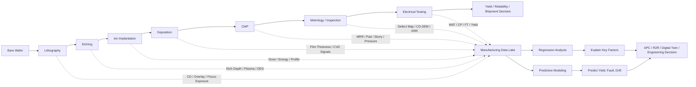
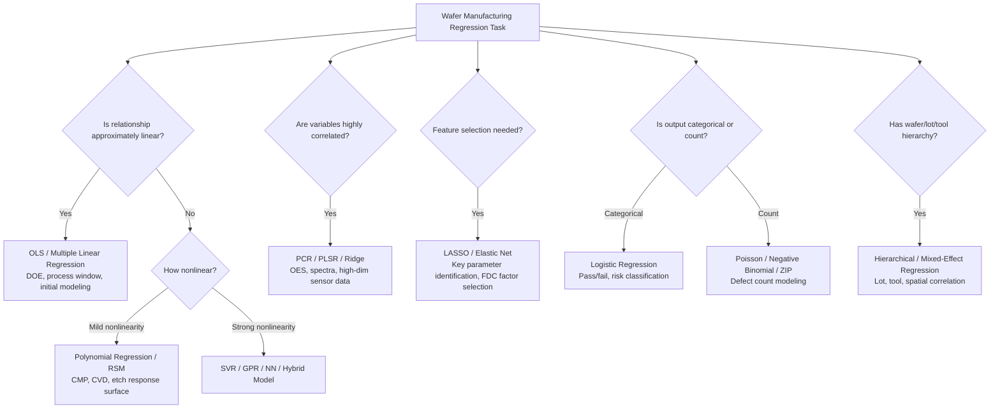
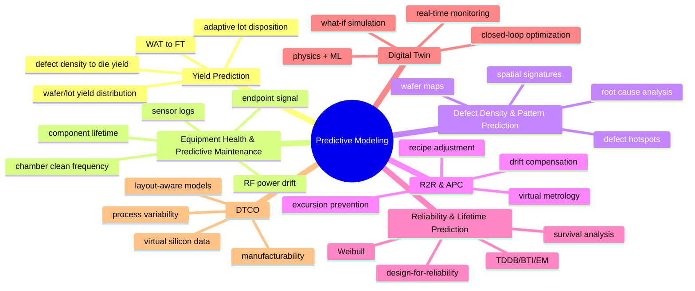
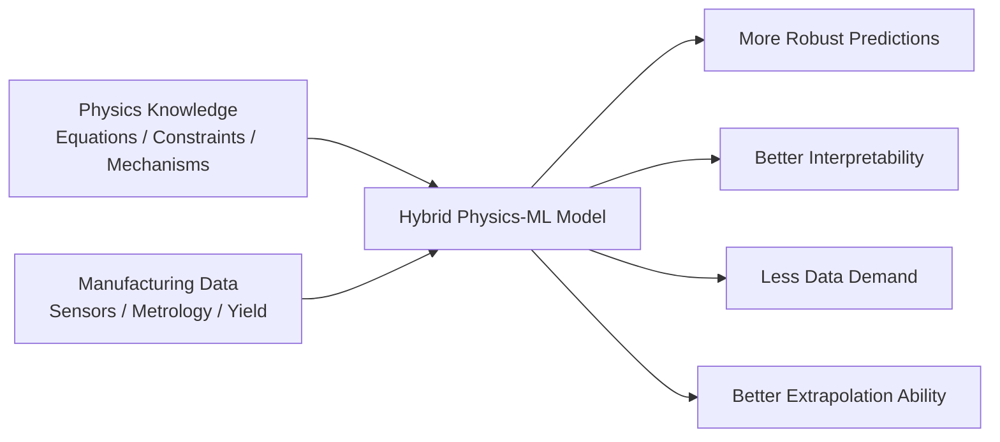
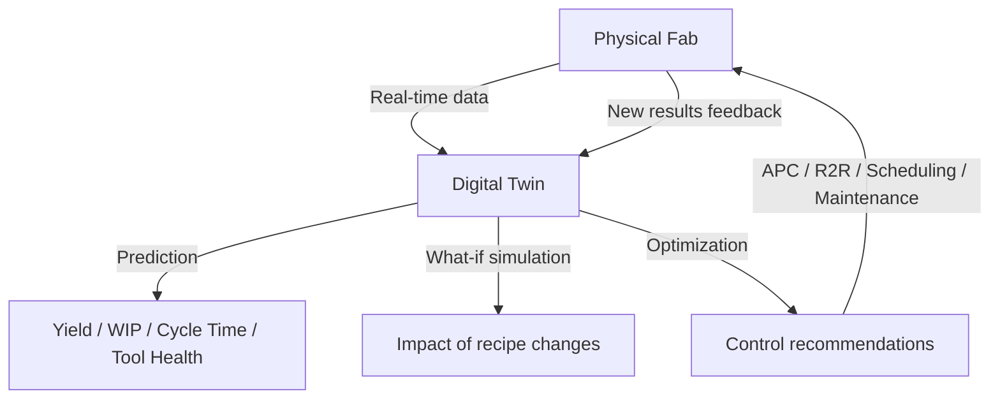
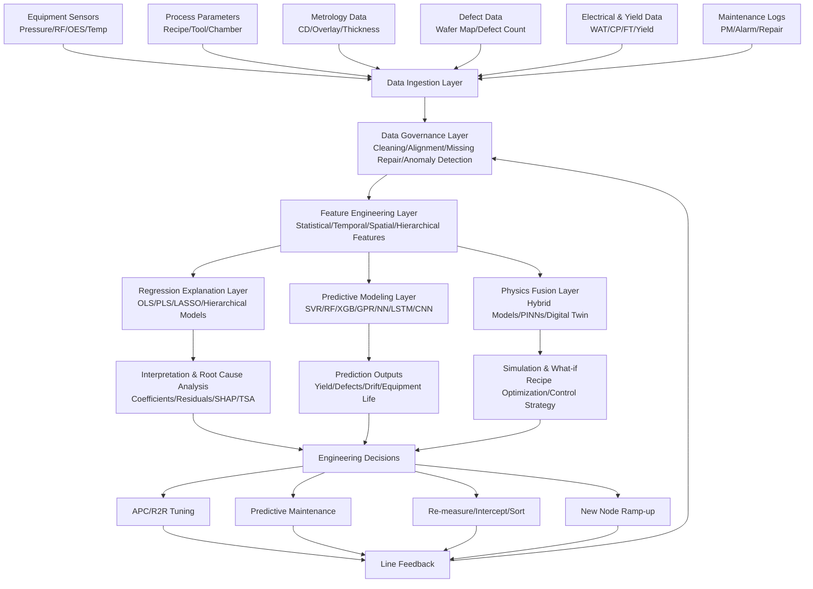

# From "Experience-Based Tuning" to "Predictive Wafer Fab": An In-depth Read of "Review of Applications of Regression and Predictive Modeling in Wafer Manufacturing"

> This article provides an in-depth, explanatory review based on the paper **Review of Applications of Regression and Predictive Modeling in Wafer Manufacturing**, published in *Electronics* by Hsuan-Yu Chen and Chiachung Chen. The paper focuses on "how regression analysis and predictive modeling can be applied to wafer manufacturing," covering topics such as DOE, virtual metrology, fault detection, yield prediction, predictive maintenance, digital twin, APC, explainable AI, and edge AI. The paper points out that wafer manufacturing involves 500–1000 highly coupled steps, and that nanometer or even sub-nanometer deviations at advanced nodes can cause severe yield loss, making regression and predictive modeling a fundamental analytical framework for smart fabs.

---

## 1. What Problem Does This Paper Aim to Solve?

The core question of this paper can be condensed into one sentence:

> **In wafer manufacturing, which is becoming increasingly complex, expensive, and close to physical limits, how can regression analysis and predictive modeling transform massive manufacturing data into explainable, predictable, and controllable engineering decisions?**

Semiconductor manufacturing is not an ordinary assembly line. A single wafer goes through lithography, etching, thin-film deposition, ion implantation, cleaning, chemical mechanical polishing, metrology, defect inspection, electrical testing, and more. The paper notes that manufacturing a single wafer may involve 500 to 1000 sequential process steps, which are interdependent, coupled, and extremely sensitive to minor fluctuations. As technology nodes approach 3 nm and beyond, tiny deviations in parameters such as oxide thickness, critical dimension (CD), and overlay error can be amplified into final yield loss.

This is why traditional "experience + physics-based heuristic" control methods are becoming increasingly inadequate. In the past, process windows were relatively wide, and engineers could rely on experience, design of experiments (DOE), and statistical process control to tune parameters. But in advanced process nodes, too many variables, strong noise, complex coupling, and high costs make it difficult to achieve real-time, stable, and scalable optimization based solely on human experience.

The paper's answer is: **Regression analysis and predictive modeling together form the data intelligence foundation of a wafer fab.**

Regression analysis leans toward "explanation":
It answers “Which process parameters affect the results?” “What is the relationship between temperature, pressure, gas flow, etch time, and film thickness?” “Which parameter is the main driver of yield loss?”

Predictive modeling leans toward “prediction”:
It answers “What will be the final yield of this wafer?” “Is this equipment about to drift?” “Will the next batch be anomalous?” “Is early maintenance or recipe adjustment needed?”

The paper clearly states that regression models have long been used for DOE, process optimization, and yield analysis, and have evolved to multivariate modeling, virtual metrology, and fault detection. Predictive modeling further combines machine learning and AI, leveraging massive sensor and metrology data to achieve real-time process monitoring, yield prediction, and predictive maintenance, and is integrated into APC, digital twins, and automated decision systems.

---

## 2. Understanding Wafer Manufacturing at a Glance: Where Does Data Come From?

Figure 1 in the paper summarizes the wafer manufacturing process into key steps: lithography, etching, ion implantation, deposition, CMP, inspection, and electrical testing. This diagram may look simple, but it hides the most important logic of this article: **every step generates data, and each type of data can become input for predictive models.**

We can redraw the manufacturing flow from the paper with a “data flow” perspective using Mermaid:



From this perspective, a fab is not a linear “process then inspect” flow, but a complex system that continuously generates data and corrects itself. Data is not a byproduct; it is part of manufacturing capability.

---

## 3. Regression Analysis vs. Predictive Modeling: Not Substitutes, but Complements

Table 1 in the paper specifically compares the differences and complementarities between regression analysis and predictive modeling. It defines regression as methods for explaining and quantifying relationships between process variables and outputs, while predictive modeling is defined as methods for predicting future states such as yield, defect density, and equipment health. The strength of regression is interpretability, statistical rigor, and suitability for hypothesis testing; the strength of predictive modeling is its ability to handle nonlinearity, high dimensionality, and noisy data, with higher prediction accuracy, though it may sacrifice interpretability and require more data and computation.

We can understand it as follows:

| Aspect                | Regression Analysis                           | Predictive Modeling                               |
| --------------------- | --------------------------------------------- | ------------------------------------------------- |
| Core question         | Why is it happening?                          | What will happen next?                            |
| Typical outputs       | Parameter relationships, coefficients, significance, residuals | Yield prediction, anomaly probability, equipment health |
| Common methods        | Linear regression, multiple regression, logistic regression, PLS, PCR, LASSO | RF, SVM/SVR, GPR, XGBoost, neural networks, deep learning |
| Suitable scenarios    | DOE, process window, parameter sensitivity, virtual metrology | Real-time monitoring, fault prediction, yield prediction, digital twin |
| Advantages            | Interpretable, engineer-friendly, good for root cause analysis | Handles complex nonlinearity, high dimensions, multi-source data |
| Limitations           | Limited in nonlinear and big-data scenarios   | Black-box, high deployment cost, requires continuous maintenance |

An important insight from the paper is: **A smart fab should not have to choose between "traditional statistics" and "AI black-box". The real value lies in combining the two.**

Regression builds an interpretable engineering bridge, while predictive modeling enhances the ability to foresee complex scenarios. The former is like an engineer's formula and whiteboard; the latter is like a real-time intelligent radar. Together, they transform the fab from “firefighting after the fact” to “prevention before the event.”

---

## 4. Why Is Wafer Manufacturing Particularly Suitable for, and in Need of, Regression?

The intuition of regression analysis is simple: we want to know how input variables affect output variables.

In wafer manufacturing, inputs may be:

* Lithography exposure dose, focus, stage temperature, wafer bow;
* Etching gas flow, RF power, chamber pressure, etch time;
* CVD temperature, gas ratio, deposition time;
* CMP pressure, rotation speed, slurry concentration, pad condition;
* Incoming material lot, equipment ID, recipe version, maintenance cycle.

Outputs may be:

* Film thickness;
* Critical dimension (CD);
* Overlay error;
* Etch depth;
* Material removal rate (MRR);
* Defect density;
* WAT electrical parameters;
* CP/FT yield;
* Reliability lifetime.

The paper notes that regression models are used in wafer manufacturing to quantify mathematical relationships between process inputs and wafer outputs, forming the basis of predictive modeling. Typical applications include process–parameter relationship modeling, metrology correlation modeling, fault detection, and excursion analysis.

In other words, the role of regression in a fab is not as an “old statistical method”, but as a tool that helps engineers transform the chaotic multi-variable manufacturing process into understandable, verifiable, and optimizable mathematical relationships.

---

## 5. The Data Landscape in Wafer Manufacturing as Summarized in the Paper

In the “Data Landscape in Wafer Manufacturing” section, the paper summarizes common data types in fabs: process parameters, in-situ sensor data, metrology data, overlay/flatness/defect data, electrical test data, and yield data. These data are characterized by high volume, high dimensionality, and hierarchical structure, e.g., dies nested within wafers, wafers nested within lots.

For clarity, the data landscape can be organized as follows:

| Data Type                     | Examples                                                                 | Modeling Value                                               |
| ----------------------------- | ------------------------------------------------------------------------ | ------------------------------------------------------------ |
| Process parameters            | Temperature, pressure, RF power, gas flow, rotation speed, recipe time     | Establish relationships between input parameters and output quality |
| In-situ sensor data           | Plasma optical emission, chamber pressure trace, motor current curve      | Capture equipment status, process drift, precursors of anomalies |
| Metrology data                | CD-SEM, scatterometry, film thickness, XRR                               | Used for virtual metrology, process feedback, quality prediction |
| Inspection / defect data      | Defect counts, wafer maps, particles, scratches                          | Used for defect pattern recognition, yield risk prediction   |
| Electrical / yield data       | WAT, parametric tests, threshold voltage, leakage, CP, FT                | Used as final labels or intermediate quality indicators      |
| Hierarchical data             | Die-within-wafer, wafer-within-lot, tool-level history                   | Used for hierarchical regression, mixed-effects models, lot-to-lot variation analysis |

This part is crucial because the real challenge of AI modeling in wafer manufacturing is not “choosing an algorithm”, but handling the complex structure of these data.

A wafer is not an isolated sample. It belongs to a lot, processed by one or more tools, following a recipe, during a certain time window, and then generates measurements at multiple test sites. Each die has a spatial location, each tool has a maintenance history, and each process step has a time-series profile. Thus, the data are naturally multi-level, multi-time, multi-space, and multi-modal.

---

## 6. Typical Applications of Regression Across Different Process Steps

Section 1.2 of the paper lists typical applications of regression and predictive modeling by process step. This can be viewed as a “regression modeling application map” for wafer fabs.

### 6.1 Lithography: Predicting CD, Overlay, and Process Window

Lithography is one of the most critical steps in advanced nodes. Regression models can be used to predict CD uniformity, focus-exposure process window, and overlay error. For instance, overlay error can be regressed against factors such as stage temperature, wafer bow, and lens aberration.

Intuitive understanding: Lithography is like projecting an extremely complex pattern onto a wafer. If focus, exposure dose, lens aberration, or wafer bow deviate even slightly, the pattern position and line width will change. The role of regression is to help engineers determine “which factor caused the pattern to shift.”

### 6.2 Etching and Deposition: Using Sensors to Predict Depth and Thickness

Etching and deposition processes generate a large amount of tool sensor signals, such as RF power, chamber pressure, gas flow, and plasma signal. The paper points out that predictive models can use these sensor signals to predict etch depth and film thickness uniformity, and can also combine 3D etch simulation with machine learning to optimize plasma etching.

This is a typical virtual metrology scenario: instead of performing expensive or time-consuming physical measurements on every wafer, we use process data to predict the measurement results.

### 6.3 CMP: Predicting Material Removal Rate (MRR)

CMP (chemical mechanical polishing) is used to planarize the wafer surface. The paper mentions that regression models can be used to predict MRR in CMP, and some studies use multiple regression models to predict wafer material removal, also using pad asperity radius and asperity density as response variables.

The difficulty of CMP is that it involves mechanical contact, chemical reactions, fluid dynamics, pad state, and wafer topography simultaneously. A pure physics model is very complex, while a pure data model can be unstable. Therefore, CMP is also a valuable scenario for hybrid physics–ML models.

### 6.4 Metrology Correlation: Connecting Inline Data to Final Yield

The paper emphasizes that regression can connect inline inspection data with final wafer yield, and can also use PLS to associate scatterometry spectral data with actual CD measurements.

This is very important because final test is too late. The real value lies in predicting final performance during manufacturing. The essence of metrology correlation is to find a bridge between “early observable signals” and “final outcomes”.

### 6.5 Electrical Testing: Predicting Die Pass/Fail in Advance

The paper also mentions that regression can be used to predict die pass/fail before final test; early studies used principal component methods, regression, and CART to investigate the impact of wafer fabrication processes on wafer quality/yield.

This means regression can be used not only for continuous variables like thickness, CD, and MRR, but also for categorical or risk-based tasks, such as whether a die passes test, whether yield is low, or whether a wafer should be intercepted.

---

## 7. Seven Benefits of Regression and Predictive Modeling

Section 1.3 of the paper summarizes the benefits of regression and predictive modeling in wafer manufacturing, including early yield estimation, process optimization, cost reduction, reliability improvement, shortened ramp-up, yield improvement, and scrap reduction.

These can be understood as the seven questions that fab managers care most about:

| Business Goal         | How Regression/Predictive Modeling Helps                              |
| --------------------- | -------------------------------------------------------------------- |
| Early yield estimation | Predict wafer/lot yield before final test, identify risks early      |
| Process optimization  | Identify key parameters affecting quality, optimize process window  |
| Cost reduction        | Reduce unnecessary metrology, lower rework and scrap, optimize maintenance plans |
| Reliability improvement | Detect minor drifts early, prevent systemic failures from escalating |
| Shortened ramp-up     | Help new nodes and new products learn quickly and ramp up fast       |
| Yield improvement     | Detect yield excursions early, guide tool calibration and recipe adjustment |
| Scrap reduction       | Identify high-risk wafers before packaging or final test to avoid subsequent waste |

The common logic behind these benefits is: **The earlier a problem is found, the cheaper it is; the later it is found, the more expensive it becomes.**

If a problem is found only after FT, all previous process, packaging, and test resources have already been invested. If the risk can be detected at the inline metrology, WAT, or equipment sensor stage, the fab can re-measure, adjust parameters, maintain, divert, or even stop further processing in time.

---

## 8. Three Categories of Regression Applications: Parameter Relationships, Metrology Correlation, Fault Analysis

Section 2 of the paper categorizes regression applications in wafer manufacturing into three types: process–parameter relationship modeling, metrology correlation, and fault detection and excursion analysis.

### 8.1 Process–Parameter Relationship Modeling: Find Out “Who Affects Whom”

This type of model establishes relationships between process variables and wafer metrics. For example, multiple linear regression can predict film thickness variation, with inputs including deposition time, temperature, gas flow, pressure, etc.

The value of such models lies in process understanding. Engineers want not only the predicted result, but also:

* Which parameter is most important?
* Are there interactions between parameters?
* Is the process window wide enough?
* Will parameter fluctuations amplify into final quality issues?

### 8.2 Metrology Correlation: Faster, Fewer, Smarter Measurements

Metrology is expensive and extends cycle time. Some measurements are even destructive or semi-destructive. Regression and predictive modeling can connect inline metrology, tool sensors, and historical test results to achieve virtual metrology.

The paper points out that metrology correlation can link inline metrology with end-of-line electrical tests, supporting virtual metrology, fast feedback, and proactive control, thereby improving yield, reducing cycle time, and enhancing tool monitoring.

### 8.3 Fault Detection and Excursion Analysis: Using Residuals to Detect Anomalies

Regression models have a very practical use: looking at residuals between predicted and actual values.

If a model predicts a certain CD value for a wafer, but the actual measurement deviates significantly, an abnormal residual may indicate equipment drift, chamber state change, sensor anomaly, or recipe execution deviation. The paper mentions that regression residuals can expose abnormal deviations between expected and actual performance and assist in root cause identification.

This is the classic idea of statistical modeling in FDC: the model is not meant to “perfectly fit the past”, but to discover “deviations that should not happen” in the future.

---

## 9. Panorama of Regression Methods: From OLS to Hierarchical Bayes

Section 4 of the paper systematically organizes regression methods used in wafer manufacturing. Below we interpret them from the perspective of “which problem they suit.”

### 9.1 Ordinary Least Squares (OLS): Most Basic, Not Useless

Ordinary least squares regression is the simplest and most classic tool. It models an output variable as a linear combination of multiple input variables. For example, deposition rate can be modeled as a function of chamber pressure and power; CD can be modeled as a function of exposure dose and focus.

Its advantages are strong interpretability, easy deployment, and ease of understanding by engineers. Its disadvantages are sensitivity to assumptions such as independence and homoscedasticity, while real fab data often exhibit wafer-to-wafer correlation, tool drift, and hierarchical nesting. The paper also notes that linear regression is commonly used for DOE and initial process modeling, but its assumptions are often violated in real fab data.

### 9.2 Multiple Regression: Looking at Multiple Factors Together

Wafer manufacturing rarely has single-factor problems. In lithography, focus and dose jointly affect CD; in etching, RF power, pressure, and gas ratio interact; in CMP, pressure, slurry, and pad condition jointly affect MRR.

Multiple regression allows multiple input variables to enter the model simultaneously, capturing multi-factor effects and some interactions. The paper gives examples: multiple regression can be used to analyze oxide thickness instability, and combined with response surface methodology to optimize CMP slurry composition.

### 9.3 Polynomial Regression and Response Surface Methodology: Handling Mild Nonlinearity

Semiconductor processes are rarely strictly linear. Photoresist CD shrinkage may change nonlinearly with bake time and temperature; ion implantation dose response may exhibit quadratic-like behavior.

Polynomial regression approximates nonlinear relationships by adding squared, cubic, and interaction terms. It is more flexible than linear regression, but also more prone to overfitting. Hence, the paper emphasizes careful validation.

### 9.4 Logistic Regression, Poisson, ZIP: Handling Pass/Fail and Defect Counts

Logistic regression is suitable for predicting binary/categorical outcomes, such as presence of a defect, pass/fail, high risk. The paper also mentions studies using Poisson regression, negative binomial regression, and zero-inflated Poisson regression, incorporating die spatial location and defect count as variables to improve yield prediction for spatial defect distributions on wafer maps.

This illustrates that “regression” in wafer manufacturing is not limited to continuous value prediction; it also includes classification probabilities, count data, and spatial defect modeling.

### 9.5 Nonlinear Regression: Facing Complex Tool–Material Interactions

Nonlinear regression is suitable for complex processes such as plasma etch rate, diffusion profile, CVD film growth, and CMP removal. The paper notes that the highly nonlinear dynamics of CMP are suitable for virtual metrology modeling, and MOCVD film growth can also be modeled with hybrid neural networks for nonlinear regression.

The core value of nonlinear regression is that it acknowledges that manufacturing processes are not linear relationships, but are determined by complex physics, chemistry, equipment state, and material interactions.

### 9.6 Principal Component Regression (PCR): Handling Collinearity with Principal Components

PCR first transforms highly correlated input variables into orthogonal principal components, then uses these components for regression. It is suitable for high-dimensional, strongly correlated data, such as sensor features, OES spectra, and multi-variable CMP inputs.

The paper notes that PCR can reduce multicollinearity, enhance robustness in modeling yield, defect density, CD, etc., and support virtual metrology and fault detection.

### 9.7 Partial Least Squares Regression (PLSR): An Important Method in Semiconductor Virtual Metrology

PLSR not only compresses input variables but also considers the covariance between inputs and outputs. It is particularly suitable for high-dimensional, collinear, sample-limited industrial data.

The paper states that PLSR is very important in wafer manufacturing because it can handle collinear and high-dimensional input spaces, extracting latent variables that connect tool signatures to outputs. Applications include ellipsometry spectral modeling, plasma emission monitoring, and etch profile prediction.

### 9.8 Ridge, LASSO, Elastic Net: Preventing Overfitting and Performing Feature Selection

Regularized regression methods are very practical for high-dimensional wafer data. Ridge stabilizes the model by shrinking coefficients; LASSO can drive coefficients of unimportant variables to zero, performing feature selection; Elastic Net combines the advantages of both. The paper notes that these methods are important for high-dimensional, collinear process data, enhancing robustness and interpretability in defect prediction, virtual metrology, yield modeling, and fault detection.

On the production line, such methods are often favored by engineers because they not only predict but also tell which variables deserve the most attention.

### 9.9 Hierarchical and Mixed-Effects Regression: Handling Nested Structures of Wafers, Lots, and Tools

Wafer manufacturing data is naturally nested: dies within wafers, wafers within lots, lots processed by tools or chambers. Ordinary regression tends to ignore this hierarchical structure.

The paper points out that hierarchical and mixed-effects regression can model variability in nested structures such as wafers, lots, and tools, while capturing both fixed process effects and random variations, thereby improving yield prediction, process optimization, and equipment health monitoring.

Such models are particularly good at answering:

* Is an anomaly caused by the product itself or by a specific tool?
* Is a lot’s low yield due to random fluctuation or systematic lot shift?
* Does within-wafer spatial correlation affect yield prediction?

---

## 10. A Diagram Summarizing Regression Method Selection



The key point of this diagram is: **There is no absolute best method, only the best match to the task.**

---

## 11. Predictive Modeling: From “Explaining the Past” to “Predicting the Future”

Section 3 of the paper defines predictive modeling as a broader framework than regression, encompassing advanced machine learning and statistical forecasting, with the goal of predicting wafer quality, yield, or tool health before problems occur.

It includes seven major application directions.

### 11.1 Yield Prediction

Yield is the ultimate KPI of wafer manufacturing. Predictive models can estimate wafer-level or die-level yield before the wafer completes all process steps. The paper mentions that yield prediction can be based on defect density, metrology data, test parameters, and can use logistic regression for pass/fail classification; Jiang et al. used GMM clustering with a weighted ensemble regressor to predict back-end final test yield during wafer fabrication.

The most direct value of such models is: knowing in advance which wafer or lot is likely to have problems, so that decisions can be made about whether to continue processing, re-measure, adjust parameters, or intercept.

### 11.2 Equipment Health Monitoring and Predictive Maintenance

The paper notes that predictive models can use sensor logs and historical maintenance data to predict tool failures before they occur. For example, predicting chamber cleaning frequency based on RF power stability and endpoint signal drift. Equipment health monitoring analyzes sensors, vibrations, and maintenance records to identify degradation patterns and component lifetimes, enabling condition-based maintenance.

This shifts maintenance from “fix after break” to “know it’s about to break before it breaks”.

### 11.3 Defect Density and Defect Pattern Prediction

Defects are not random noise. They often have spatial patterns, tool signatures, and process root causes. The paper points out that predictive models can use inspection data, wafer maps, and process parameters to identify defect sources, spatial patterns, and recurring defect signatures.

This part is closely related to wafer maps, spatial statistics, image models, and classification models. It helps engineers move from “finding defects” to “locating root causes”.

### 11.4 Process Control and Run-to-Run Optimization

Run-to-run (R2R) control is an important control concept in wafer manufacturing: the measurement results of the previous batch or wafer are used to adjust the recipe for the next batch or wafer.

The paper notes that predictive models can analyze metrology data, tool parameters, and historical trends to dynamically adjust recipes between wafer runs. Wan et al. proposed combining virtual metrology with R2R control; a GPR-enabled VM R2R control scheme in a CMP case maintained R2R control advantages while avoiding the cost and cycle time impact of physical measurements.

This is the typical path for predictive models to enter APC: not waiting for results to analyze afterward, but entering the control loop in real time.

### 11.5 Reliability and Lifetime Prediction

Reliability prediction focuses on the degradation of products or equipment over time. The paper mentions that survival analysis, Weibull modeling, and machine learning can be used to predict tool replacement intervals and product reliability, as well as transistor/device degradation, supporting design-for-reliability strategies.

These models connect manufacturing quality to long-term reliability, especially valuable for automotive, server, power device, and other high-reliability applications.

### 11.6 Virtual Manufacturing and Digital Twin

The paper points out that digital twin models replicate semiconductor processes by integrating physics-based models, sensor data, and AI analytics for real-time monitoring and optimization. Digital twins allow engineers to perform “what-if” scenarios, evaluate recipe changes, predict yield outcomes, and accelerate development without costly physical experiments.

A digital twin is not a fancy concept, but an engineering system that connects simulation, real-time data, regression, machine learning, and control systems.

### 11.7 Design–Technology Co-Optimization (DTCO)

The paper also includes DTCO as an application of predictive modeling. DTCO uses layout-aware simulations, process variability models, and manufacturing constraints to consider manufacturability, yield, performance, power, and cost at the design stage. The paper also mentions that GANs can be used to generate wafer-level WAT and CP test data to support process–design co-optimization.

This shows that predictive modeling serves not only the manufacturing floor but also the front-end design and process co-development stages.

---

## 12. Panorama of Predictive Modeling



---

## 13. Predictive Modeling Methods: VM, FDC, Time-Series, Hybrid Models

Section 5 of the paper further discusses predictive modeling from a methodological perspective.

### 13.1 Virtual Metrology Models: Estimate Without Measuring

Virtual metrology (VM) is one of the core keywords of this paper. Its goal is to use upstream sensor data, process parameters, and historical measurement results to predict actual measurement values, such as film thickness, CD, and etch depth. This reduces expensive or time-consuming physical measurements.

The paper repeatedly emphasizes that VM can reduce cycle time, lower metrology costs, and feed results into R2R control earlier.

The essence of VM is:


### 13.2 Yield Prediction Models: Early Prediction of the Ultimate KPI

The paper notes that yield is the ultimate KPI of wafer manufacturing. Predictive models can forecast yield before wafer completion and support adaptive lot disposition, i.e., deciding in advance whether a wafer should continue processing, be reworked, or be scrapped.

Such models typically use WAT parametrics, defect density, wafer maps, functional test values, and hierarchical wafer-within-lot correlations.

### 13.3 FDC Models: Catching Anomalies Before They Escalate

FDC models monitor tool sensors and process data to detect anomalies early, classify fault types, and prevent excursions. The paper notes that FDC models can use regression residuals as anomaly signals, ML classifiers to judge whether a tool run is normal or abnormal, and time-series models to predict drift before an out-of-control event occurs.

This scenario is like an industrial early warning system: warning is issued not after yield has dropped, but as soon as equipment signals start to deviate.

### 13.4 Time-Series Predictive Models: Understanding Temporal Trajectories

Much data in wafer manufacturing is time-series, such as chamber pressure traces, plasma emission, temperature curves, current curves. The paper notes that time-series predictive models can predict tool performance, process drift, and yield trends, enabling proactive fault detection, predictive maintenance, and run-to-run control.

This is why models like LSTM, RNN, TCN, and Transformer are useful. They do not process static points, but entire process trajectories.

### 13.5 Hybrid Models: Combining Physics-Based and Data-Driven Models

The paper points out that hybrid models combine physics-based equations with data-driven algorithms to improve predictive accuracy and interpretability. They allow the model not only to memorize historical data but also to adhere to process physics.

This is particularly important in wafer manufacturing. Pure data models tend to fail when processes change, equipment drifts, or new products are introduced; pure physics models struggle to cover all complex details. Hybrid models attempt to combine the strengths of both.

---

## 14. How Does Machine Learning Merge with Regression?

Section 6 of the paper discusses the integration of regression and machine learning. It notes that decision trees and random forests can capture nonlinear interactions, SVM can be used for wafer/die good/bad classification, neural networks can predict yield from complex multi-variable data; random forests and gradient boosting handle nonlinearity and interactions, neural networks capture complex sensor-output mappings, SVR is effective for high-dimensional metrology data, CNN for wafer map defect classification, and RNN for time-series tool data.

This part looks like extending traditional regression into a modern predictive system.

| Model                                     | Suitable Tasks                                                | Advantages                                    | Caveats                                          |
| ----------------------------------------- | ------------------------------------------------------------- | --------------------------------------------- | ------------------------------------------------ |
| SVR                                       | CD, thickness, OES-to-metrology, virtual metrology            | Handles high dimensions, small samples, nonlinear mapping | Kernel and parameter selection critical           |
| Random Forest                             | Yield prediction, defect classification, feature importance   | Robust, noise-resistant, interpretable, handles nonlinearity | Limited extrapolation ability                     |
| Gradient Boosting / XGBoost / LightGBM    | Defect density, yield, complex tabular data                   | High accuracy, good for nonlinearity and interactions | Black-box, requires SHAP assistance               |
| Neural Networks                           | Complex sensor-to-quality mapping                             | High expressive power, suitable for large data  | Data volume, tuning, interpretability are challenges |
| CNN                                       | Wafer maps, defect images, spatial patterns                   | Automatic spatial feature extraction           | Class imbalance, generalization to new defects difficult |
| LSTM / RNN                                | Tool drift, time-series sensors, yield trends                 | Captures temporal dependencies                 | Data alignment and real-time deployment complex   |
| Hybrid / Ensemble                         | High-dimensional, noisy, imbalanced, multi-source scenarios   | Balances robustness and accuracy               | Higher system complexity                          |

The paper specifically mentions that SVR, through high-dimensional mapping, can capture complex relationships between tool settings and CD variations, supporting virtual metrology, process optimization, and inspection cost reduction; semi-supervised SVR can also leverage unlabeled data to improve prediction accuracy and reduce training time.

For random forests and gradient boosting, the paper notes they excel on noisy, high-dimensional fab data, capturing nonlinear relationships, ranking key features, and supporting root cause analysis, defect classification, and process optimization; relevant studies also combine SHAP to explain feature importance, helping to understand the relationship between yield and features.

For neural networks, the paper emphasizes that they can model highly nonlinear relationships between process parameters and outputs such as yield, defects, and CD, supporting virtual metrology, predictive maintenance, and early anomaly detection; CNN, autoencoder, LSTM, FFNN, etc., are used for multivariate VM, noisy defect data, wafer image classification, and edge yield trend prediction.

---

## 15. Animated SVG for Blog: From Data to Predictive Control Closed Loop

The SVG below can be embedded directly into a blog page that supports HTML/SVG. It shows the core idea of this article: data enters regression and predictive models, models output warnings and control recommendations, and these are fed back to the production line.

```html
<svg width="920" height="390" viewBox="0 0 920 390" xmlns="http://www.w3.org/2000/svg">
  <style>
    .box { fill:#f8fafc; stroke:#334155; stroke-width:2; rx:16; }
    .title { font:700 18px sans-serif; fill:#0f172a; }
    .txt { font:14px sans-serif; fill:#334155; }
    .arrow { stroke:#2563eb; stroke-width:3; fill:none; marker-end:url(#arrowhead); }
    .flow { stroke-dasharray:8 8; animation: dash 1.8s linear infinite; }
    .pulse { fill:#ef4444; animation:pulse 1.2s ease-in-out infinite alternate; }
    @keyframes dash { to { stroke-dashoffset:-32; } }
    @keyframes pulse { from { opacity:.25; r:4; } to { opacity:1; r:9; } }
  </style>

  <defs>
    <marker id="arrowhead" markerWidth="10" markerHeight="7" refX="9" refY="3.5" orient="auto">
      <polygon points="0 0, 10 3.5, 0 7" fill="#2563eb"/>
    </marker>
  </defs>

  <rect x="35" y="55" width="190" height="95" class="box"/>
  <text x="77" y="90" class="title">Manufacturing Data</text>
  <text x="60" y="118" class="txt">Sensors / Metrology / WAT / FT</text>
  <circle cx="200" cy="76" r="6" class="pulse"/>

  <rect x="365" y="35" width="190" height="85" class="box"/>
  <text x="404" y="68" class="title">Regression Analysis</text>
  <text x="385" y="96" class="txt">Explain relationships / Find key factors</text>

  <rect x="365" y="155" width="190" height="85" class="box"/>
  <text x="400" y="188" class="title">Predictive Modeling</text>
  <text x="388" y="216" class="txt">Predict yield / drift / fault</text>

  <rect x="695" y="95" width="190" height="95" class="box"/>
  <text x="735" y="130" class="title">Smart Decisions</text>
  <text x="718" y="158" class="txt">APC / R2R / Maintenance / Sorting</text>
  <circle cx="858" cy="116" r="6" class="pulse"/>

  <rect x="365" y="285" width="190" height="70" class="box"/>
  <text x="405" y="317" class="title">Line Feedback</text>
  <text x="392" y="342" class="txt">Yield results / Engineering validation</text>

  <path d="M225 103 C275 80,315 70,365 77" class="arrow flow"/>
  <path d="M225 103 C275 160,315 190,365 197" class="arrow flow"/>
  <path d="M555 77 C610 82,650 108,695 132" class="arrow flow"/>
  <path d="M555 197 C610 190,650 168,695 148" class="arrow flow"/>
  <path d="M790 190 C790 300,640 320,555 320" class="arrow flow"/>
  <path d="M365 320 C230 320,130 245,130 150" class="arrow flow"/>

  <text x="35" y="375" class="txt">Core closed loop: Data is not just for reporting, but enters regression explanation, predictive warning, control decisions, and continuous learning.</text>
</svg>
```

---

## 16. Challenge 1: Multicollinearity

Section 7 of the paper summarizes the challenges faced by regression and predictive modeling. The first is multicollinearity: tool or process parameters are highly correlated, inflating estimation variance and leading to unstable model coefficients. The paper notes that wafer data is high-dimensional and interconnected; methods such as variable elimination, PCA, ridge regression, and PLS can help.

This is common in fabs. For example, temperature, pressure, RF power, and gas flow may not vary independently; some recipe parameters may be co-determined by the same control strategy. In such cases, ordinary linear regression may give unstable or misleading coefficients.

The solution is not simply “delete variables”, but to combine process knowledge, dimensionality reduction, regularization, and interpretable analysis.

---

## 17. Challenge 2: Nonlinearity, Dynamics, and Nonstationarity

The paper points out that many interactions in wafer manufacturing are highly nonlinear and change over time; linear regression is insufficient. Advanced models such as deep learning, Gaussian processes, and recursive updates can improve uncertainty handling and dynamic prediction capabilities.

This is typical of advanced process nodes:

* Chamber state changes over time;
* Equipment aging causes model coefficient drift;
* After maintenance, equipment distribution can shift abruptly;
* New product introduction changes data distributions;
* Different tools/chambers exhibit domain shift;
* The effect of process parameters on quality may have delayed effects.

Therefore, models in a fab should not be treated as static formulas “trained once, used forever”, but as dynamic systems that require continuous calibration, monitoring, and updating.

---

## 18. Challenge 3: High-Dimensional Data and Overfitting Risk

Modern sensors may generate hundreds or even thousands of variables per wafer. The paper notes that high-dimensional data brings overfitting risk; methods such as PCA, PLS, autoencoders, sufficient dimensionality reduction, and penalized regression are needed for dimensionality reduction and robust modeling.

There is an important engineering lesson here:

> In wafer manufacturing, more variables do not necessarily mean better. What truly matters is finding a stable, interpretable, transferable combination of variables that is consistent with process physics.

Many models perform well on historical data but fail online because they learned spurious correlations, irrelevant variables, or equipment noise specific to a certain period.

---

## 19. Challenge 4: Concept Drift

The paper lists concept drift as a separate challenge for regression: as tools age, recipes change, or fab conditions drift, regression coefficients change; models need online learning, adaptive filtering, ensemble, or continuous learning strategies.

Concept drift is a “chronic disease” of industrial AI. It is not as obvious as a single anomaly, but slowly makes models inaccurate.

A VM model that is accurate today may not be accurate three months later; the state of a tool before and after PM may differ; the same recipe on a different chamber may have a different data distribution. Without drift monitoring, models have an expiration date.

---

## 20. Challenge 5: Interpretability vs. Accuracy Trade-off

The paper notes that engineers prefer interpretable regression models, but AI/ML often provides higher prediction accuracy. Related research shows that methods like GAM, EBM, and SOC can find a compromise between interpretability and performance.

In a fab, interpretability is not “nice to have”; it is key to whether a model will be adopted. Engineers will not stop a line or change a recipe just because a model says “low yield probability 92%”. They will ask:

* Why low yield?
* Which step, which tool, which chamber is suspicious?
* Which sensor signal drove the judgment?
* Is this judgment consistent with physical mechanisms?
* Is there historical case support?
* Will the risk decrease if parameters are changed?

Therefore, a high-value model of the future is not just a predictor, but a decision system with explanations, confidence, root cause clues, and engineering recommendations.

---

## 21. Five Major Challenges of Predictive Modeling

Table 7 in the paper summarizes the challenges of predictive modeling into five categories: data quality and integration, model interpretability, tool-to-tool variation, computational efficiency, and imbalanced data.

| Challenge                     | Manifestation in Fab                                            | Possible Solutions                                           |
| ----------------------------- | --------------------------------------------------------------- | ------------------------------------------------------------ |
| Data quality and integration  | Sensor noise, missing data, timestamp misalignment, inconsistent equipment data | Data cleaning, alignment, error correction, domain knowledge, PINNs |
| Model interpretability        | Black-box models hard to trust by engineers                     | SHAP, XAI, transparent models, causal analysis               |
| Tool-to-tool variation        | Model trained on one tool fails on another                      | Domain adaptation, hierarchical models, transfer learning    |
| Computational efficiency      | Online inference must be fast enough                            | Lightweight models, ROM, surrogate models, edge AI           |
| Imbalanced data               | Defect samples far fewer than normal samples                    | Oversampling, CAE/GAN augmentation, ensemble classifiers     |

These five challenges show that predictive modeling in a fab cannot pursue only academic metrics. It must deal with dirty data, changing distributions, real-time constraints, rare anomalies, and engineering trust in the real manufacturing environment.

---

## 22. Future Trend 1: Hybrid Physics–ML Models

The first future trend in Section 8 of the paper is hybrid physics–ML models. The paper points out that combining process physics with regression/AI can yield more robust predictions; physics-informed neural networks (PINNs) embed physical laws and governing equations into neural networks, improving interpretability, robustness, and data efficiency.

This may be one of the most important directions in semiconductor AI.

Pure machine learning models excel at finding patterns in data, but they do not understand physics. Physics models understand mechanisms, but are often too idealized to cover the complex equipment differences and noise in real fabs. Hybrid models aim to combine both:



In scenarios such as CMP, CVD, etch, and lithography, these methods are particularly valuable.

---

## 23. Future Trend 2: Real-Time Predictive Analytics

The paper points out that predictive models must be able to run in a real-time environment and integrate with fab control systems to trigger immediate corrective actions. It mentions studies that built aggregate models for each work area in a wafer fab, using real-time arrival/departure data to dynamically predict cycle time and WIP; another case used an AnyLogic digital twin with ML models to achieve real-time yield prediction accuracy exceeding 97.8%.

The focus here is not just “model accuracy”, but “model fast enough, stable enough, and able to interface with control systems”.

Real-time predictive analytics ultimately aims to:

* Read tool sensors in real time;
* Update health scores in real time;
* Judge yield risk in real time;
* Trigger re-measurement or maintenance in real time;
* Provide adjustment suggestions to APC/R2R controllers in real time.

---

## 24. Future Trend 3: Digital Twin

The paper defines digital twins as wafer process virtual replicas driven by regression + AI predictive modeling, which can combine physics-based wafer simulators with predictive ML regression for proactive process control.

A digital twin is not simply simulation software, but a system that continuously synchronizes the physical and virtual worlds. Its ideal state is:



Digital twins allow engineers to test process changes in virtual space, reducing expensive experiments, accelerating new node development, and lowering trial-and-error costs.

---

## 25. Future Trend 4: Explainable AI (XAI)

The paper explicitly states that improving the interpretability of complex predictive models is crucial for earning engineers’ trust. It mentions that SHAP can quantify key features and identify process drivers of yield fluctuations; Trace Shapley Attribution can be used for root cause diagnosis in continuous fab processes, identifying process measurements primarily responsible for defect occurrence while handling temporal dependencies.

For a fab, the goal of XAI is not to produce pretty plots, but to translate model predictions into engineering language:

* “Low yield risk is mainly due to pressure drift in Step 42.”
* “The intensity change in the OES 310–450 nm range contributes the most.”
* “This anomaly resembles the pattern before the last chamber clean.”
* “If RF power is returned to the historical centerline, predicted risk drops by 18%.”
* “Model confidence is low; recommend supplementary CD-SEM measurement.”

Such explanations are actionable.

---

## 26. Future Trend 5: Edge AI Deployment

Section 8.5 of the paper points out that deploying predictive models directly on equipment controllers enables fast feedback. For example, edge AI systems can run deep learning models at the sensor layer to achieve real-time endpoint detection and multivariate sensor anomaly detection in complex etch processes; AI-driven image processing can also be embedded in CMP equipment for endpoint and uniformity control.

This shows that model deployment is moving from central data platforms to the edge.

Centralized platforms are suitable for offline analysis, model training, and cross-fab comparison; edge platforms are suitable for millisecond response, online alerts, and closed-loop control within equipment. The intelligent fab of the future is likely a hybrid architecture of “cloud + edge + equipment controllers”.

---

## 27. Designing a Deployable Wafer Predictive Modeling System Based on the Paper

Based on the paper’s content, a regression and predictive modeling system for wafer manufacturing can be designed as follows:



The key is not any single model, but the closed loop:

> **Data ingestion → Data governance → Regression explanation → Predictive warning → Engineering control → Result feedback → Model update.**

Without a closed loop, AI is just reporting; with a closed loop, AI becomes manufacturing capability.

---

## 28. Contributions of This Paper

The value of this paper is mainly reflected in five aspects.

First, it discusses regression analysis and predictive modeling within the same framework, rather than separating traditional statistics from AI. For semiconductor manufacturing, this is very reasonable because real fabs need both interpretable statistical models and high-accuracy machine learning models.

Second, it covers the entire application chain: from DOE, process optimization, metrology correlation, VM, FDC, to yield forecasting, predictive maintenance, R2R control, digital twin, and DTCO. This makes it not just an algorithm survey, but more like a capability map for smart fabs.

Third, it respects process steps. The paper does not talk vaguely about “using AI for manufacturing”, but specifically discusses modeling issues in lithography, etching/deposition, CMP, metrology, electrical testing, and other process stages.

Fourth, it provides a detailed genealogy of regression methods, from OLS, multiple regression, polynomial regression, logistic regression, nonlinear regression, to PCR, PLSR, regularized regression, and hierarchical mixed-effects models. This is very useful for readers new to semiconductor data modeling.

Fifth, it presents challenges and future trends in an engineering-oriented manner: multicollinearity, nonlinear dynamic processes, high-dimensional data, concept drift, interpretability vs. accuracy, data quality, tool-to-tool variation, computational efficiency, imbalanced data — these are all real problems encountered after model deployment.

---

## 29. What Are the Paper’s Limitations?

From an in-depth reading perspective, there are areas where the paper could be strengthened.

First, as a broad survey, the depth of each sub-direction is not fully balanced. For example, regression methods are listed comprehensively, but there is still a lack of uniform comparison on reproducible benchmarks, evaluation metrics, and deployment details for different models in real fabs.

Second, the paper relies heavily on findings from cited studies. Different cases use different data, products, process nodes, evaluation metrics, and experimental conditions, so direct horizontal comparisons of model superiority are not possible. For instance, a model that performs well on CMP MRR may not be the best for lithography overlay or FT yield prediction.

Third, the paper could discuss MLOps and fab integration details more deeply. Deploying a model in a fab requires not just training, but also data permissions, system interfaces, drift monitoring, model versioning, alarm thresholds, engineer confirmation workflows, rollback strategies, and audit mechanisms.

Fourth, while the paper emphasizes future directions including hybrid physics–ML, explainable AI, and autonomous manufacturing, it has limited discussion of large models, multimodal foundation models, and industrial agents in fab decision support. This may be due to the paper’s scope and leaves room for future research.

---

## 30. An Essential Framework for Beginners

If you are just starting to learn about regression and predictive modeling in semiconductor manufacturing, you can use the following “three-layer framework” to understand the entire paper.

### Layer 1: Regression as “Explainer”

It helps you answer:

* Which process parameter has the greatest impact?
* What interactions exist between parameters?
* Which tool or batch introduces systematic bias?
* Does a residual anomaly indicate equipment drift?

Corresponding methods include OLS, multiple regression, RSM, PLSR, LASSO, hierarchical models, etc.

### Layer 2: Predictive Modeling as “Early Warmer”

It helps you answer:

* Will this wafer have low final yield?
* Is this equipment about to become anomalous?
* Does the next batch need re-measurement?
* Will the current defect pattern spread?

Corresponding methods include SVR, RF, XGBoost, GPR, NN, CNN, LSTM, ensemble, etc.

### Layer 3: Digital Twin and APC as “Action System”

It helps you answer:

* How should the recipe be adjusted?
* Is early maintenance needed?
* Should a lot be intercepted?
* What would happen if parameters were changed?

Corresponding systems include VM-enabled R2R control, APC, digital twins, edge AI, hybrid physics–ML models.

---

## 31. An Analogy: The Fab as a “Self-Examining Hospital”

Imagine a fab as a super hospital.

Wafers are patients.
Process steps are treatment procedures.
Sensor data are vital signs.
Metrology data are lab test reports.
WAT/CP/FT are diagnostic results at different stages.
Regression models are the doctor’s cause analysis.
Predictive models are risk scoring systems.
Digital twin is a virtual patient.
APC/R2R is automatic treatment adjustment.

The traditional approach diagnoses after the patient deteriorates; the predictive fab hopes to detect risks early through vital signs and historical cases before the patient truly worsens.

But a good AI doctor cannot just say “risk is high”. It must say:

* Which indicator is abnormal;
* When the abnormality started;
* Which organ or cause it may correspond to;
* Whether supplementary tests are needed;
* How the treatment plan should be adjusted;
* Whether the risk decreases after adjustment.

This is precisely what regression analysis, predictive modeling, explainable AI, and digital twins collectively pursue in wafer manufacturing.

---

## 32. Final Summary: What Does This Paper Really Tell Us?

The most important message of *Review of Applications of Regression and Predictive Modeling in Wafer Manufacturing* is not that “a certain model is powerful”, but that:

> **Wafer manufacturing is shifting from experience-driven, post-hoc analysis to data-driven, real-time prediction, and closed-loop optimization.**

Regression analysis helps engineers understand the relationships between process inputs and outputs. Predictive modeling enables the fab to foresee yield, defects, equipment drift, and maintenance needs in advance. Machine learning and deep learning extend regression’s capabilities in high-dimensional, nonlinear, noisy data. Digital twins, APC, R2R, and edge AI turn model outputs into real-time engineering actions. The paper argues that future directions include hybrid physics–ML models, real-time predictive analytics, digital twins, explainable AI, and edge AI deployment, all pointing toward a more autonomous, intelligent, and interpretable wafer manufacturing system.

In one sentence:

> **Regression analysis helps the fab “understand the past”; predictive modeling helps the fab “foresee the future”; digital twins and automatic control allow the fab to begin “self-optimizing”.**

This is the true meaning of a smart fab: not plugging AI in as a model add-on, but integrating data, statistics, machine learning, physics, control systems, and engineering experience into a continuously learning, continuously feedback-driven, continuously improving manufacturing intelligence.
