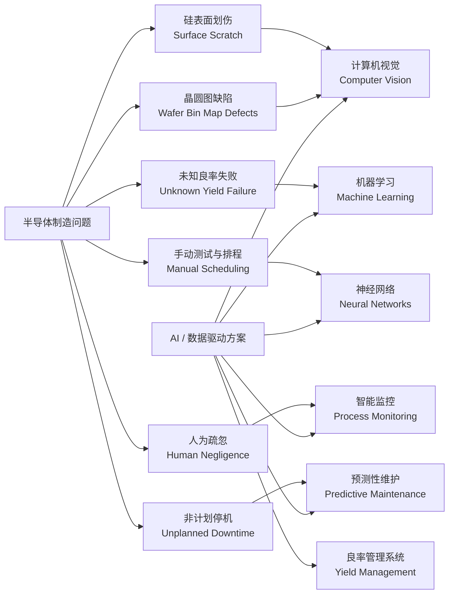
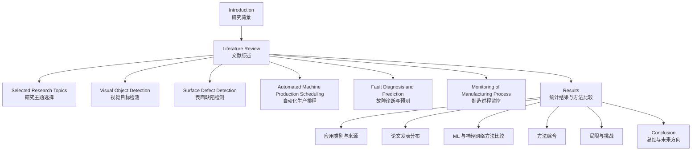
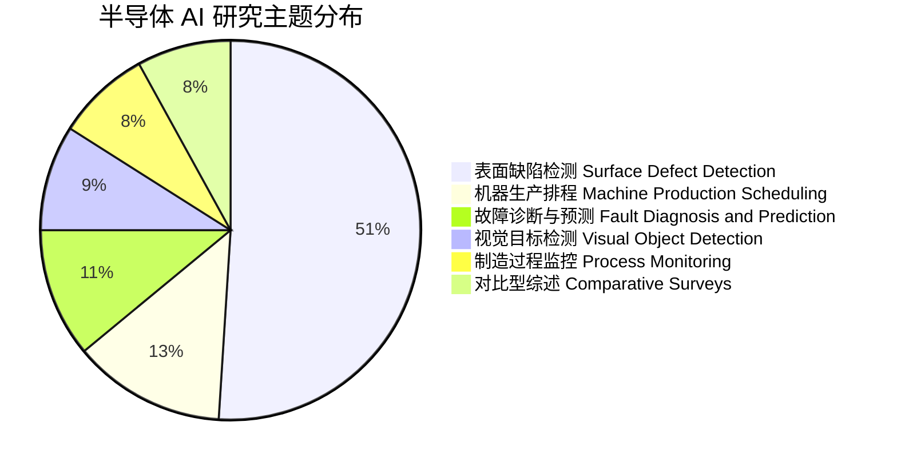
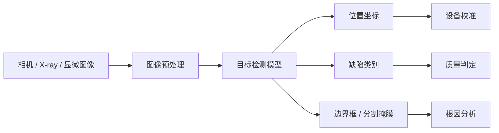
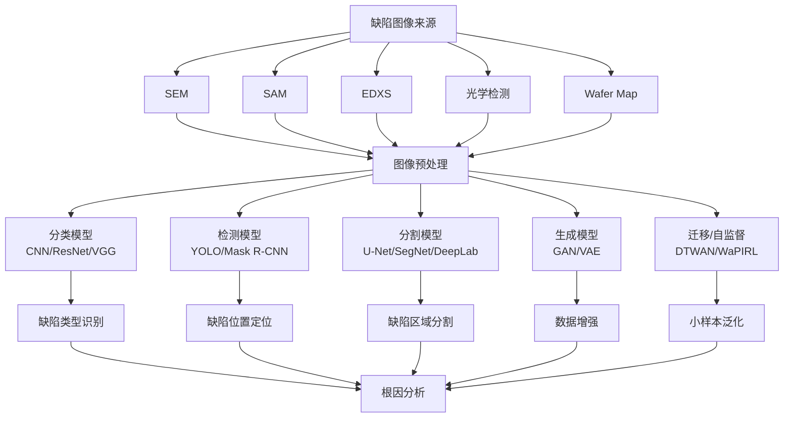
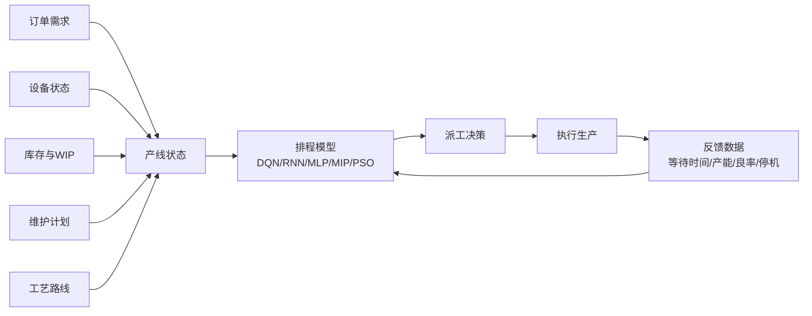
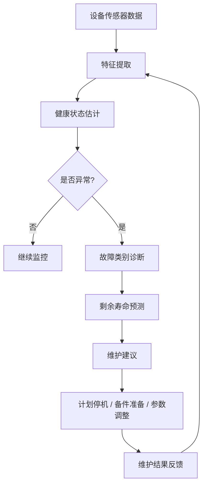
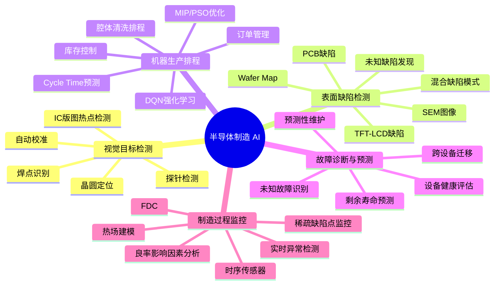
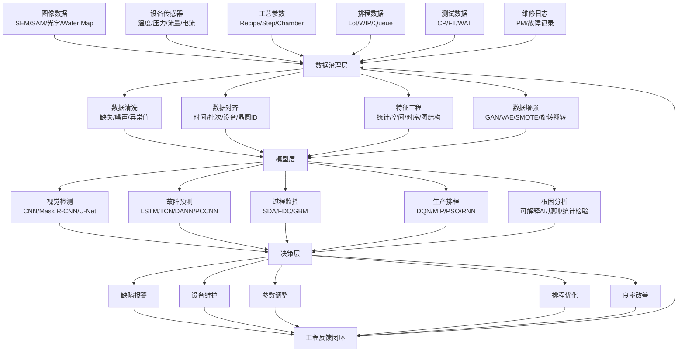

# 让晶圆厂学会“看见、判断、排程与自愈”：精读《A survey on machine and deep learning in semiconductor industry: methods, opportunities, and challenges》

> 这篇长文基于论文 **A survey on machine and deep learning in semiconductor industry: methods, opportunities, and challenges** 展开，定位不是普通摘要，而是“论文领读式”的科普精读：我会把论文的研究背景、问题意识、方法体系、五大应用场景、代表性模型、数据集、实验发现、挑战与未来方向，整理成一篇可直接发布的博客文章。
>
> 这篇论文发表于 *Cluster Computing*，综述了 2015—2022 年间机器学习和深度学习在半导体制造中的应用，重点覆盖视觉目标检测、表面缺陷检测、机器生产排程、故障诊断与预测、制造过程监控等方向。论文也总结了数据集、模型结构、实验结果与产业落地难点。

---

## 1. 先读懂这篇论文到底在讲什么

这篇论文的题目是：

**A survey on machine and deep learning in semiconductor industry: methods, opportunities, and challenges**

直译过来就是：

**半导体行业中机器学习与深度学习的综述：方法、机会与挑战。**

它不是只讨论“晶圆良率预测”的窄问题，而是站在更大的半导体制造系统角度，回答一个更宏观的问题：

> 当半导体制造越来越复杂、越来越昂贵、越来越接近物理极限时，机器学习和深度学习究竟能帮晶圆厂解决哪些问题？

论文的回答很清楚：AI 可以进入半导体制造的多个关键环节，尤其包括：

1. 视觉目标检测
2. 表面缺陷检测
3. 机器生产排程
4. 故障诊断与预测
5. 制造过程监控

论文在引言中指出，现代半导体制造已经大量收集数据，但随着制程结构越来越复杂，单靠工程师肉眼观察和经验判断，很难实现统一、快速、稳定的大规模生产；与此同时，机器学习和深度学习的发展，为新型器件、集成技术、计算架构和制造系统带来了新的机会。

这篇论文的核心价值可以概括为一句话：

> **它把半导体制造中的 AI 应用从“单点模型”整理成了一张“产业问题地图”。**

也就是说，它不是单纯问“哪个模型准确率最高”，而是问：

* 半导体制造到底有哪些痛点？
* 这些痛点分别适合用什么 AI 技术？
* 哪些模型已经在论文中被验证？
* 哪些场景还没有真正解决？
* 为什么实验室高准确率不等于晶圆厂真正可用？

这也是这篇论文值得精读的原因。

---

## 2. 为什么半导体制造特别需要 AI？

半导体制造是人类工业体系中最复杂的制造活动之一。论文提到，先进晶圆制造设备包括光刻、化学气相沉积 CVD、物理气相沉积、离子铣削刻蚀、刻蚀设备、化学机械抛光 CMP 等。这些设备共同服务于微米甚至纳米尺度的结构制造，任何微小偏差都可能影响最终芯片质量。

可以把晶圆厂想象成一座极端精密的“自动化城市”。

在这座城市里：

* 光刻机像超级照相机，把电路图案投影到晶圆上；
* 刻蚀设备像纳米级雕刻刀，把材料一点点刻掉；
* 沉积设备像原子级喷涂机，把薄膜一层层铺上去；
* CMP 像超精密抛光工，把晶圆表面磨平；
* 检测设备像显微镜、X 光和电子眼，检查缺陷、形貌和电性；
* 搬运系统像城市交通系统，把晶圆在不同设备之间移动；
* 排程系统像交通调度中心，决定哪批货先去哪台机器。

这座城市最大的问题是：**它太复杂了。**

一个现代晶圆厂可能有成百上千道工序，每道工序又有多个参数。温度、压力、气体流量、刻蚀时间、薄膜厚度、设备腔体状态、晶圆位置、维护周期、批次差异、原材料变化，全都可能影响最终结果。论文也强调，在半导体制造中，维护摩尔定律、降低成本、减少能源消耗、提高良率，并保证每道工序的产品质量，已经成为极具挑战性的任务。

传统晶圆厂依赖三类能力：

第一是设备能力。设备越先进，越能做出更小、更复杂的结构。

第二是工艺经验。工程师通过长期经验判断哪些参数异常、哪些图案意味着某种故障。

第三是质量检测。通过光学、电子显微镜、探针测试等手段发现缺陷。

但这些能力正在遇到瓶颈。论文指出，随着制程不断逼近物理极限，单纯缩小器件尺寸已不够，制造系统必须依赖大量数据来控制和改善流程。

这就是 AI 登场的原因。

AI 在半导体制造中的作用，不是替代工艺专家，而是把晶圆厂中海量、复杂、实时、多源的数据，转化成更快的识别、更早的预警、更优的排程和更稳定的决策。

---

## 3. 论文图 1 的核心信息：生产问题与 AI 解法

论文第 2 页图 1 很值得关注。图中把“生产导致的问题”和“常见解决方案”并列展示：生产问题包括 wafer bin map 缺陷、硅表面划伤、人为疏忽、未知良率失败、手动测试产品排程、非计划停机等；对应的解决方案包括人工视觉检查、检测器、良率管理系统、神经网络、机器学习和计算机视觉。

这张图的潜台词是：

> 半导体 AI 不是一个单一算法问题，而是一组围绕“看、判、排、控、修”的工业智能问题。

可以把它重新画成一个更适合博客展示的 Mermaid 图：



这张图也说明：AI 在半导体中的应用不是“锦上添花”，而是应对制造复杂性的一种基础能力。

---

## 4. 论文是如何做综述的？

论文不是随便挑几篇文章讲讲，而是采用了系统综述思路。作者在 Nature、Elsevier、Springer、Taylor & Francis Online、MDPI、IEEE 等学术网络中检索 2015—2022 年间的文献，并讨论论文的关键成就、关键技术、实验结果、机会和未来研究路径。论文还明确提出，要比较已有综述、提供数据集概览、比较实验结果与性能，并调查 2015—2022 年间的新文献。

论文给出的贡献主要包括七点：强调半导体技术与计算机科学的交叉融合，讨论 AI 与半导体结合的优缺点，回顾 ML 和 DL 系统设计，总结现有模型技术的证据，调查论文发表分布，总结当前限制和困难挑战，并帮助研究者定位新的研究活动。

论文的组织结构大致如下：



这篇论文的综述逻辑非常适合产业读者：它不是按照算法名称堆砌，而是按照制造问题组织。对于半导体行业来说，这种组织方式更实用，因为工程师真正关心的通常不是“我该不该用 CNN”，而是“这个缺陷、这次停机、这条排程、这个工艺漂移，AI 能不能帮我提前发现和处理”。

---

## 5. 数据集与实验数据：半导体 AI 为什么难做？

论文表 2 汇总了研究中常见的数据源与检索系统，包括 WM-811K、kolektorSDD、Benchmark、Mixed WM38、MS COCO、Crystal dataset、DAGM、UCI、MNIST、LSVRC-2012、CVD dataset、IME dataset 等；检索系统包括 IEEE、Springer、Nature、Taylor & Francis Online、MDPI、Elsevier、Google Scholar。

这些数据可以分成几类：

| 数据类型   | 代表数据集                    | 对应任务                 |
| ------ | ------------------------ | -------------------- |
| 晶圆图数据  | WM-811K、Mixed WM38       | wafer map 缺陷模式识别     |
| 表面图像数据 | kolektorSDD、DAGM、MS COCO | 表面缺陷检测、分割、目标识别       |
| 布局热点数据 | ICCAD Benchmark          | IC layout hotspot 检测 |
| 工艺参数数据 | CVD dataset、IME dataset  | 工艺建模、故障预测、过程监控       |
| 通用图像数据 | MNIST、LSVRC-2012、MS COCO | 迁移学习、模型预训练、方法验证      |
| 工业分类数据 | UCI、SECOM 类数据            | 缺陷分类、故障诊断            |

半导体数据有几个天然难点。

第一，数据往往私有。晶圆厂真实数据涉及工艺机密、设备状态、产品良率、客户设计信息，不可能像普通图像数据集一样大规模公开。

第二，数据极不平衡。正常晶圆和正常工艺数据远多于异常样本，真正严重的缺陷、罕见故障、未知类别反而样本稀少。

第三，数据多模态。晶圆厂既有图像，也有传感器时序、工艺表格、设备日志、维修记录、排程数据、晶圆图、测试结果。

第四，数据会漂移。设备老化、腔体状态变化、工艺升级、产品切换都会导致数据分布改变。

第五，标签很贵。晶圆缺陷标注通常需要专家，未知缺陷类型甚至连专家也要经过根因分析才能确认。

这就解释了为什么论文反复提到数据不平衡、缺乏标注、概念漂移、未知类别、实时监控等挑战。论文在结论中也指出，实验条件下的研究往往忽略了制造环境中的大量挑战，缺少标注数据是一个普遍问题，也会影响模型泛化能力。

---

## 6. 研究分布：为什么“表面缺陷检测”占了半壁江山？

论文统计了 120 篇被选研究的主题分布：表面缺陷检测占 51%，机器生产排程占 13%，故障诊断与预测占 11%，视觉目标检测占 9%，制造过程监控占 8%，对比型综述文章占 8%。论文还指出，这些研究中 100 篇发表在期刊，20 篇发表在会议；从出版社分布看，IEEE 数量最高，另有 Springer、Elsevier 等来源。

可以用 Mermaid 饼图重新展示论文图 4 的主题分布：



为什么表面缺陷检测占比最高？

原因很简单：**它最像传统计算机视觉问题，也最容易形成可训练数据。**

晶圆图、SEM 图像、PCB 表面、TFT-LCD 缺陷、焊点图像、硅片划痕，这些都可以转化为图像分类、目标检测、语义分割或实例分割问题。CNN、ResNet、U-Net、Mask R-CNN、GAN、Autoencoder 等深度学习模型天然适合处理图像。

相比之下，排程、故障预测、过程监控更难。它们不仅需要模型，还需要懂设备、懂工艺、懂产线约束、懂实时系统。比如生产排程不能只看准确率，还要看等待时间、设备利用率、交期、维护窗口、换线成本；故障预测不能只看分类准确率，还要考虑误报、漏报、提前量、停机成本。

因此，表面缺陷检测论文最多，并不代表它最重要，而是说明它最容易被 AI 形式化，也最容易通过公开或半公开数据集做实验。

---

## 7. 第一大应用：视觉目标检测——让设备“看见”关键位置

视觉目标检测是半导体制造中非常基础的一类任务。论文指出，视觉检测的目标包括：在保持生产率的同时提供高精度分析，辅助生产线人工检查，提高产品质量，寻找元件的特征位置和方向，与规定误差范围比较，确保坐标准确，并减少测试结果对人工判断的依赖。

在半导体场景中，“视觉目标检测”并不只是识别猫狗车辆，而是识别：

* 晶圆中心位置；
* 探针位置；
* 封装焊点；
* 电路布局热点；
* 掩膜或版图中的异常形状；
* 3D X-ray 图像中的互连失效；
* 光刻或刻蚀导致的形状偏差。

论文提到，视觉目标检测研究使用了多种机器学习和神经网络方法，包括 LSTM、YOLO、CNN、FCN、Mask R-CNN、FPNAC、DMBNN、GAN、VGGNet、ResNet、SVM、Random Forest、遗传算法、线性规划和 GRASP 聚类等。

这说明一个重要事实：半导体视觉检测不是单一 CNN 就能解决的。不同任务需要不同模型。

比如，识别芯片焊点缺陷时，Mask R-CNN 可以同时完成分类、定位和分割；论文表 3 中提到，基于 Mask R-CNN 的焊点识别方法可以同时分类、定位、分割焊点缺陷，并取得 100% 分类准确率和超过 90% 的 MAP 分割准确率。

再比如，在晶圆空间位置校准中，Xu 等使用傅里叶变换和最小二乘回归，只需获取晶圆局部图像即可定位晶圆中心，角度算法精度为 0.05，位置算法精度为 5 像素，平均运行时间小于 1.5 秒。

视觉目标检测的本质，是把半导体制造中的“几何定位问题”转化为“图像理解问题”。

可以这样理解：



它的产业价值主要体现在三点：

第一，减少人工目检依赖。
第二，提高定位和判定的一致性。
第三，把后续工艺控制建立在更精确的空间信息上。

不过，视觉目标检测也有明显挑战：半导体图像缺陷可能非常微小，背景纹理复杂，真实缺陷样本稀少，生产线速度又要求模型必须快速响应。

---

## 8. 第二大应用：表面缺陷检测——论文中最重要、占比最高的方向

表面缺陷检测是整篇论文最核心的部分之一。论文指出，在生产过程中，多个加工步骤都可能造成表面划伤、褶皱、凸起、凹坑和氧化等缺陷；从早期人工检查开始，基于机器视觉的缺陷信息自动采集与处理，对于工程师识别故障、寻找根因非常关键。

表面缺陷检测为什么这么重要？

因为半导体缺陷不是“外观不好看”这么简单。一个微小颗粒、划痕、污染、光刻异常或刻蚀残留，都可能造成电路开路、短路、漏电、性能退化，最终影响良率和可靠性。

论文提到，表面缺陷检测的实际场景包括大规模集成电路晶圆、材料、硅片、PCB、TFT-LCD 等；常用高性能检测设备包括 SEM、SAM、EDXS 等。基于计算机视觉的方法被广泛用于批量自动检查图像，并定位和识别缺陷类型。

### 8.1 从人工目检到 CNN

传统缺陷检测依赖人工和规则算法，例如边缘检测、模板匹配、阈值分割、形态学操作。但随着缺陷形态越来越复杂、图像背景越来越多变，这类方法逐渐不够用。

CNN 的优势在于：它可以自动学习图像中的纹理、边缘、形状和空间模式，不需要完全依赖人工设计特征。

论文中多个研究都显示 CNN 在 wafer map 或表面缺陷检测中表现突出。例如，Wen 等提出基于深度卷积网络的 FPNAC 与 DMBNN 方法，用于晶圆半导体表面缺陷检测，表 4 中显示 DMBNN 的平均准确率达到 99.66%。

Cheon 等使用 CNN、SAE、MP、SVM 等方法进行 wafer surface defect classification，论文表 4 显示 CNN 优于其他模型，平均准确率为 96.2%。不过作者也指出，在真实场景中，为了保持优异性能，CNN 可能需要随着新缺陷数据积累而重新训练，这会带来显著计算负担。

这说明：CNN 很强，但它不是“一劳永逸”的工具。产线会出现新缺陷，模型也需要更新。

### 8.2 wafer map：一张图背后的工艺根因

Wafer map，也就是晶圆图，是半导体 AI 中非常重要的数据形式。它展示一片晶圆上每个 die 的测试结果：哪些位置通过，哪些位置失败。

晶圆图上常见的模式包括：

* 中心缺陷；
* 边缘缺陷；
* 环形缺陷；
* 局部团簇；
* 划痕状缺陷；
* 随机散点；
* 混合缺陷模式。

这些模式不仅告诉我们“哪里坏了”，还可能反推“为什么坏了”。例如，边缘环形缺陷可能和涂胶、刻蚀均匀性、边缘处理有关；局部团簇可能和颗粒污染、设备局部异常有关；线状缺陷可能和机械划伤或搬运路径有关。

论文指出，晶圆制造涉及数百个化学步骤，是高度复杂且几乎不可逆的过程；wafer defect map 的生成机制多样，自动分类 wafer map 对揭示缺陷根因非常关键。模型不仅要分类已知主导缺陷模式，还要发现未知缺陷模式，这比二分类更困难。

### 8.3 数据不平衡：缺陷检测的真正难题

论文多次提到数据不平衡。原因很现实：大多数晶圆是正常或高良率样本，真正罕见的缺陷类型数量很少。但模型恰恰需要学会识别这些罕见缺陷。

为了解决这个问题，研究者使用了多种方法：

* 数据增强：旋转、翻转、平移、加噪声；
* 随机欠采样；
* SMOTE；
* GAN 生成缺陷样本；
* VAE 增强；
* 迁移学习；
* 小样本检测网络；
* 自监督预训练；
* 主动学习。

论文提到，在 wafer defect data 类别不平衡时，可以使用晶圆翻转、晶圆转换、晶圆组合等物理数据增强方法，以及随机欠采样方法；深度迁移学习对抗网络可用于 wafer graph 上的知识迁移和特征迁移，从而缓解小标签样本分类时训练困难和识别准确率低的问题。

### 8.4 GAN：用生成模型补足“少见缺陷”

GAN 在论文中出现频率很高。其核心思想是：用生成器模拟缺陷图像，用判别器判断真假，最终生成更接近真实分布的样本。

论文提到，Kim 等提出 GAN 模型识别半导体晶体和小缺陷，使用 Pixel-GAN、Patch-GAN、Vanilla-GAN 等多个模型，其中 Pixel-GAN 平均准确率达到 92.3%。该方法不再需要假设数据分布，而是直接采样以逼近真实数据，用来解决小类型缺陷分类困难。

这对半导体很有启发：很多关键缺陷并不是没有价值，而是太少见。GAN、VAE、自监督学习和迁移学习的意义，就是让模型在稀缺样本下也能学到有效特征。

### 8.5 表面缺陷检测的整体路线图



表面缺陷检测的终点不是“模型给一个类别”，而是帮助工程师回答：

> 这个缺陷从哪里来？会不会影响良率？是否需要停机、清洗、调参或追查某个设备？

这就是半导体 AI 与普通图像识别最大的差异。

---

## 9. 第三大应用：机器生产排程——让晶圆厂更会“安排时间”

机器生产排程是半导体制造中非常复杂的问题。论文指出，半导体制造商致力于统一生产管理范式、优化排程和资源分配，以提高产品质量；深度学习在生产排程中的重要性，不仅涉及生产参数和效率优化，也涉及自动预测、排程、库存控制和订单管理。

晶圆厂排程为什么难？

因为它不像普通工厂那样“产品从 A 到 B 到 C 走一遍”。半导体制造具有以下特点：

* 工序数量巨大；
* 同一片晶圆可能多次回到同类设备；
* 不同产品 recipe 不同；
* 设备状态和维护窗口不同；
* 有些设备是瓶颈资源；
* 有些工序有等待时间限制；
* 有些腔体需要定期清洗；
* 批次优先级会变化；
* 客户交期、良率风险、设备利用率彼此冲突。

因此，排程问题本质上是一个动态优化问题。

论文选取了 15 篇关于机器生产排程的研究，其中 7 篇发表于期刊，8 篇发表于会议；相关研究约占所选研究的 13%。这些研究使用 ML 算法或算法组合来优化结构，目标是自动化预测、资源分配、库存控制，并降低 wafer chamber cleaning 等排程复杂度。

表 5 中出现的模型包括 Deep-Q-Network、Polynomial regression DNN、Two phase DQN、MLP、Bayesian network、BPN、RNN、Timed Petri Net、GAN、MGP、GA、LR、Bayes、RF、AdaBoost、DT、GP、MIP、PSO 等。

### 9.1 强化学习为什么适合排程？

强化学习适合处理“连续决策”问题。排程系统每一步都要决定：

* 哪个 lot 先加工？
* 哪台设备接收它？
* 是否需要等待？
* 是否触发清洗？
* 是否优先处理紧急订单？
* 是否避开高风险设备？

强化学习中的 agent 会在环境中试错，依据 reward 学习策略。论文表 5 中提到，Sakr 等使用 RL 和 DQN，通过正确定义系统状态信息和奖励函数来实现复杂派工决策；良好的奖励函数可以防止 agent 陷入无关紧要的决策。

这很符合排程任务的特点：它不是单次预测，而是“做一个决定，看到后果，再做下一个决定”。

### 9.2 DNN 与 MGP：从几何布局优化生产力

论文表 5 提到，Kim 等使用 DNN 和 MGP 模型，Polynomial regression DNN 比典型 MGP 模型的 wafer productivity 高 7.96%，说明仅改变模座即可提升基于 ROI 的生产率。

这类研究说明，AI 不只是检测缺陷，还能进入生产力优化层面。

### 9.3 在线学习与概念漂移

排程系统最大的问题之一是：今天学到的规则，明天可能失效。

机器类型变化、生产流程变化、产品结构变化、订单结构变化，都会导致模型面对新的分布。论文表 5 提到，Q-Network 在机器类型和生产流程变化时可能需要重新训练；也有研究使用在线和增量学习框架，在较长时间范围内面对真实概念漂移挑战。

因此，半导体排程 AI 不能是一次性模型，而必须是可以持续学习的系统。

### 9.4 生产排程的 AI 闭环



排程模型最终要服务的是生产系统整体效率，而不是单个预测指标。因此，评价它时要看：

* cycle time 是否降低；
* 设备利用率是否提高；
* 交期是否更稳定；
* 清洗和维护是否更合理；
* 不必要等待是否减少；
* 高风险批次是否被及时干预。

这也解释了为什么排程问题比缺陷分类更难落地：它牵涉的是整个工厂系统。

---

## 10. 第四大应用：故障诊断与预测——从“坏了再修”到“没坏先防”

故障诊断与预测是半导体制造中极具价值的 AI 应用。论文指出，自动识别故障和缺陷预测、分类并确定工艺故障根因非常重要；随着 wafer size 增加，制造过程更复杂，潜在变量更多，生产工具和测量工具的寿命也成为自动故障与缺陷预测的重要变量。

故障诊断可以分成两层：

第一层是 diagnosis：已经出现问题，判断是什么故障。

第二层是 prognosis：还没坏，预测什么时候会坏。

论文特别强调“maintenance instead of repairs”，也就是用预测性维护取代事后维修。但真实工业场景中，不同工具之间存在数据差异，故障数据有限且类别不平衡，这使任务非常有挑战。

### 10.1 预测设备剩余寿命

论文提到，C. Liu 等针对 ion abrasion etching process 的 time-to-failure 预测，提出多故障模式下的两阶段深度迁移学习框架。第一阶段选择基础故障模式，通过 domain adversarial learning 对来自多工具的状态监测数据进行对齐，卷积网络从时间序列传感器数据中学习时间表示；第二阶段把第一阶段训练出的深度模型作为预训练模型，用其他故障模式数据进行微调，处理稀有条件下的故障预测。

这个思路非常关键：在晶圆厂中，不同设备的数据分布可能不同，同一种故障也可能因为设备、腔体、recipe、环境而表现不同。迁移学习和领域自适应可以让模型不必从零开始。

### 10.2 已知故障与未知故障

很多传统数据驱动智能故障诊断方法只能识别已知类别，却难以处理未知类别。论文提到，Ma 等提出 probability confidence convolutional neural network，通过 CNN 计算样本属于每个已知类的概率和置信水平，从而识别已知类和未知类；同时通过自学习方法更新 PCCNN 结构和参数，使模型具备识别新类别的能力。实验中，该方法对轴承实验数据、齿轮箱实验数据和旋转机械故障数据识别未知与已知类别的平均准确率分别达到 97.42% 和 96.87%。

这对半导体尤为重要。真实产线中，最麻烦的往往不是已知故障，而是第一次出现的异常。模型如果只能在固定类别中选择，就可能把未知异常硬塞进某个已知类别，导致错误决策。

### 10.3 故障诊断模型谱系

论文在故障诊断与预测部分列出的算法包括 ANN、FFNN、RNN、DANN、LSTM、TCN、CNN、FDC、基于领域自适应的 CNN、PCCNN、SMOTE-SVM、XGBoost、SDA、SVM、LR、DT、RF、MLP、SVC、AdaBoost、GBM、PCA、KNN、Bayes、LDA、GFK、JDA、TCA、BDA 等。

这些算法可以按任务理解：

| 任务        | 适合方法                 | 解释            |
| --------- | -------------------- | ------------- |
| 传感器时序故障预测 | RNN、LSTM、TCN、CNN     | 学习时间依赖和波形变化   |
| 小样本故障分类   | SVM、RF、XGBoost、SMOTE | 适合结构化数据和不平衡问题 |
| 跨设备迁移     | DANN、TCA、JDA、BDA、GFK | 解决不同设备数据分布差异  |
| 未知故障识别    | PCCNN、Open-set 方法    | 识别训练集中没有的新类别  |
| 特征压缩与去噪   | SDA、Autoencoder、PCA  | 从噪声数据中学习稳健表示  |

### 10.4 故障预测闭环



半导体工厂最怕非计划停机。因为一台关键设备停机，不仅损失设备产能，还可能影响在制品等待时间、交期和良率。因此，故障预测的商业价值非常直接。

---

## 11. 第五大应用：制造过程监控——让工艺状态实时可见

论文指出，半导体制造过程中有成千上万的工艺步骤，每个步骤又包含多个参数。为了实时有效地管理和监控工艺状态，监控机制不可或缺；开发实时监控并预测下一工序或工艺参数是否异常非常重要。

过程监控和故障诊断有关，但侧重点不同。

故障诊断更像判断“设备是不是坏了”。
过程监控更像判断“当前工艺状态是不是正在偏离正常轨道”。

### 11.1 FDC：半导体制造的生命体征监护仪

FDC 是 Fault Detection and Classification。它通常利用设备原位传感器记录的时间序列信号，提取可用于故障检测的特征，再送入分类器。论文提到，传统预处理和分类方法往往会损失传感器信号中对 wafer failure 检测重要的信息。Lee 等提出使用 stacked denoising autoencoder，也就是 SDA，同时进行特征提取和分类；SDA 能识别传感器信号中的全局与不变特征，对测量噪声具有鲁棒性，在高噪声场景下相比其他模型性能差距可达到约 14%。

这说明过程监控面对的不是干净数据，而是噪声、漂移、缺失和复杂非线性信号。

### 11.2 LSTM：处理长延迟和动态过程

晶体生长、热场控制、刻蚀过程、CVD 过程等都具有时间依赖。论文提到，Zhang 等提出基于 LSTM 的网络结构和训练算法，并先构建热场模型来模拟晶体生长过程，再用 SVM 确定模型阶数和滞后，以提高网络输入选择和准确性。该场景中，CZ 硅单晶具有复杂非线性、大延迟和时变动态，传统基于模型的控制方法受限于建模困难和未建模动态。

这类问题非常典型：工艺参数变化不会立刻反映在结果上，中间可能有延迟、累积和耦合。LSTM、TCN、Transformer 等时序模型，在这类场景中有天然优势。

### 11.3 稀疏卷积：处理大规模 defect list

论文提到，Huang 等提出基于 submanifold sparse convolutional networks 的 wafer monitoring 管线。该方法可以把 defect list 作为大输入处理而不丢失信息，也能处理任意分辨率的稀疏数据，并快速检测和识别新模式。

这说明制造过程监控不一定总是规则表格或普通图片。很多时候，数据是稀疏的、空间化的、不规则的，例如晶圆上分布的缺陷点。稀疏卷积和图神经网络等方法，未来会越来越重要。

---

## 12. 一张总图看懂半导体 AI 的五大应用



---

## 13. ML 与 DL：论文如何比较两类方法？

论文第 3.3 节对机器学习和神经网络方法的优缺点进行了总结。

论文认为，ML 方法适合小规模数据分类，但初始训练可能耗时且昂贵；如果数据不足，很难训练出能优化目标函数的模型。ML 方法也依赖任务特异性和专家经验来设计特征，输出结果不容易正确解释，也不容易消除不确定性，因此训练参数调节并不简单。

相比之下，神经网络适合数据量较大的场景，因为它不依赖大量人工特征工程，可以先从大数据中学习简单特征，再逐渐学习复杂和抽象的深层特征；它具备自学习、反馈联想存储和自适应高速搜索最优解等能力，可以处理不确定或未知系统。

但神经网络也不是万能的。论文指出，当网络结构规模大、高阶函数包含许多参数、正则化参数不当或样本数较小时，容易过拟合；当特征维度太小、模型结构单一时，则容易欠拟合。两者都会造成网络性能下降、容错性降低，甚至不收敛。

可以把两者对比如下：

| 维度      | 传统机器学习                   | 深度学习                              |
| ------- | ------------------------ | --------------------------------- |
| 适合数据    | 小到中等规模表格数据、明确特征          | 大规模图像、时序、多模态数据                    |
| 特征需求    | 依赖专家特征工程                 | 可自动学习层次特征                         |
| 可解释性    | 通常相对更强，尤其树模型             | 常较弱，需要可解释技术                       |
| 训练成本    | 通常较低，但复杂特征选择可能昂贵         | 通常更高，需要 GPU 和大数据                  |
| 泛化问题    | 受特征质量影响大                 | 容易过拟合、欠拟合或受分布漂移影响                 |
| 半导体典型应用 | SVM、RF、XGBoost、KNN、Bayes | CNN、RNN、LSTM、GAN、Autoencoder、DANN |

我的理解是：

> 半导体 AI 不应该迷信深度学习，也不应该停留在传统机器学习。真正有效的系统往往是混合式的：用工艺知识构造特征，用 ML 做稳健基线，用 DL 学习复杂模式，用可解释方法连接模型与工程判断。

---

## 14. 论文中常见模型的科普解释

### 14.1 CNN：半导体图像识别的主力军

CNN 适合处理图像，因为它能利用局部感受野和权重共享学习边缘、纹理、形状和空间模式。在晶圆图、SEM 图像、PCB 表面、TFT-LCD 缺陷中，CNN 是最常见方法之一。

在论文中，CNN 被用于 wafer map 分类、表面缺陷识别、布局热点检测、FDC-CNN 故障分类等多个方向。

### 14.2 Mask R-CNN：不只知道是什么，还知道在哪里

Mask R-CNN 能同时做目标分类、目标定位和像素级分割。半导体缺陷检测常常需要知道缺陷具体位置和形状，因此 Mask R-CNN 比普通分类模型更适合需要定位的场景。

### 14.3 U-Net / SegNet / DeepLab：像素级缺陷分割

在很多检测任务中，工程师不仅想知道“有缺陷”，还想知道缺陷区域的精确轮廓。U-Net、SegNet、DeepLab 等模型适合语义分割，可以把每个像素分到正常或缺陷类别中。

### 14.4 GAN：用生成数据缓解小样本与类别不平衡

GAN 在论文中常用于缺陷样本增强和未知缺陷模拟。对于少见缺陷，GAN 可以生成近似真实的样本，帮助分类器学习更稳定的边界。

### 14.5 Autoencoder：从噪声中提取稳健特征

Autoencoder 可以把输入压缩再重构，从而学习数据中的主要结构。Denoising Autoencoder 尤其适合噪声场景。论文中 SDA 被用于 FDC 过程监控，在高噪声传感器信号中表现突出。

### 14.6 LSTM / RNN：理解时间序列工艺数据

半导体工艺中很多数据是时间序列，如温度曲线、压力曲线、气体流量、设备状态、电流电压。LSTM 能建模长期依赖，适合预测延迟效应和动态过程。

### 14.7 DQN：把排程变成决策学习

DQN 把强化学习与深度网络结合，用于复杂排程决策。它不是单纯预测，而是在状态—动作—奖励框架中学习策略。

### 14.8 DANN / 迁移学习：解决跨设备、跨产品、跨工艺分布差异

半导体制造中的 domain shift 很严重。同一个模型在一台设备上好用，换一台设备可能性能下降。DANN、TCA、JDA、BDA 等方法用于让模型学习更可迁移的特征。

---

## 15. 为什么实验室高准确率不等于晶圆厂可用？

论文中大量表格列出了模型准确率，有些结果非常高。例如 DMBNN 在 kolektorSDD 表面缺陷任务上平均准确率达到 99.66%，CNN 加数据增强在 WM-811K 上取得 99.29% 的测试准确率，JLNDA 在大规模 wafer pattern inspection 中平均模型准确率达到 99.98%。 

这些结果令人振奋，但工业落地必须更谨慎。

因为晶圆厂关心的不只是准确率。

它还关心：

* 模型在新产品上是否仍然有效；
* 缺陷类别变化后是否要重新训练；
* 低频严重缺陷是否能被召回；
* 误报会不会造成不必要停机；
* 漏报会不会造成批量报废；
* 模型推理速度能否满足在线检测；
* 是否能解释给工程师；
* 是否能与 MES、FDC、APC、YMS 系统集成；
* 数据分布漂移后是否能自动报警；
* 模型维护成本是否可接受。

论文也指出，工业案例表明，不同研究的制造环境、数据集条件差异很大，因此需要更多验证来比较各种技术。实验条件下的研究往往忽略制造环境带来的许多挑战，研究者不仅要证明模型有效，还必须应对制造系统高复杂度和实时生产过程特征。

这句话是整篇论文的灵魂之一。

AI 在半导体里真正难的不是“训练一个模型”，而是让模型在真实工厂中长期可靠运行。

---

## 16. 半导体 AI 的核心挑战

### 16.1 缺少标注数据

论文明确指出，缺少标注数据是制造环境中的常见挑战，会影响模型泛化能力。

半导体缺陷标注通常需要专家，且许多异常很少出现。一个模型如果只见过常见缺陷，就可能无法识别未知风险。

### 16.2 类别不平衡

论文指出，并非所有框架都能自行获得新类别数据，且类别数据量极不平衡，会导致模型训练不准确。为此，研究者使用平移、旋转、加噪、降维、特征提取、迁移学习等方法创建新批次数据。

### 16.3 未知类别与开放集识别

真实产线会出现训练集中没有的缺陷。普通分类器只能在已知类别中选择，容易误判。因此，open-set recognition、unknown defect detection、PCCNN、自监督和主动学习很重要。

### 16.4 跨设备、跨工艺、跨产品迁移

不同设备、不同腔体、不同 recipe 之间数据分布不同。论文在故障预测部分提到，不同工具之间的数据差异与有限故障数据并存，这是现实工业场景中的重大挑战。

### 16.5 概念漂移

产线不是静态的。设备老化、维护、参数调整、产品切换都会导致模型面对新分布。论文结论中提出，需要发展能够在无监督标签情况下学习复杂非线性关系，并适应概念漂移的方法。

### 16.6 解释性不足

许多深度模型准确率高，但不能解释为什么。半导体工程师不能只接受一个“异常概率 0.97”，他们需要知道：

* 哪个参数异常？
* 哪个时间段异常？
* 哪个设备可疑？
* 哪个空间区域出现模式？
* 这是否对应已知工艺根因？

论文表 6 中提到 FDC-CNN 能提供关键传感器变量和时间段信息，帮助没有相关背景的人理解故障诊断信息。

这类可解释能力，是工业 AI 能否被工程师信任的关键。

### 16.7 上线成本高

论文最后指出，在制造环境中引入 AI 需要显著前期投资，金融、时间和人力成本都要求模型和系统接近完美执行。

这点很现实。晶圆厂不是互联网应用，不能随便试错。一个错误模型可能导致误停机、误调参、误报废，代价很高。

---

## 17. 一个可落地的半导体 AI 系统架构

基于论文内容，可以把半导体 AI 系统抽象成以下架构：



这套架构的关键不是模型本身，而是闭环：

**数据 → 模型 → 决策 → 执行 → 反馈 → 再学习。**

半导体 AI 只有进入这个闭环，才算真正产生工业价值。

---

## 18. AI 如何驱动晶圆厂闭环

下面用于展示“数据进入模型、模型输出决策、产线反馈继续训练”的动态闭环。

```html
<svg width="860" height="360" viewBox="0 0 860 360" xmlns="http://www.w3.org/2000/svg">
  <style>
    .box { fill:#f8fafc; stroke:#334155; stroke-width:2; rx:14; }
    .title { font: 700 18px sans-serif; fill:#0f172a; }
    .txt { font: 14px sans-serif; fill:#334155; }
    .arrow { stroke:#2563eb; stroke-width:3; fill:none; marker-end:url(#arrowhead); }
    .flow { stroke-dasharray:8 8; animation: dash 1.7s linear infinite; }
    .pulse { fill:#ef4444; animation: pulse 1.2s ease-in-out infinite alternate; }
    @keyframes dash { to { stroke-dashoffset:-32; } }
    @keyframes pulse {
      from { opacity:0.2; r:4; }
      to { opacity:1; r:9; }
    }
  </style>

  <defs>
    <marker id="arrowhead" markerWidth="10" markerHeight="7" refX="9" refY="3.5" orient="auto">
      <polygon points="0 0, 10 3.5, 0 7" fill="#2563eb"/>
    </marker>
  </defs>

  <rect x="40" y="50" width="170" height="95" class="box"/>
  <text x="78" y="83" class="title">制造数据</text>
  <text x="62" y="112" class="txt">图像 / FDC / 工艺 / 排程</text>
  <circle cx="185" cy="72" r="6" class="pulse"/>

  <rect x="345" y="50" width="170" height="95" class="box"/>
  <text x="382" y="83" class="title">AI 模型</text>
  <text x="360" y="112" class="txt">CNN / LSTM / GAN / DQN</text>

  <rect x="650" y="50" width="170" height="95" class="box"/>
  <text x="688" y="83" class="title">智能决策</text>
  <text x="672" y="112" class="txt">检测 / 诊断 / 排程 / 预警</text>
  <circle cx="793" cy="72" r="6" class="pulse"/>

  <rect x="345" y="235" width="170" height="85" class="box"/>
  <text x="383" y="268" class="title">产线反馈</text>
  <text x="365" y="294" class="txt">维护结果 / 良率 / 工艺调整</text>

  <path d="M210 98 C260 98,295 98,345 98" class="arrow flow"/>
  <path d="M515 98 C565 98,600 98,650 98" class="arrow flow"/>
  <path d="M735 145 C735 230,590 278,515 278" class="arrow flow"/>
  <path d="M345 278 C220 278,125 215,125 145" class="arrow flow"/>

  <text x="40" y="340" class="txt">核心思想：半导体 AI 不是一次性模型，而是数据、模型、工程决策和产线反馈的持续闭环。</text>
</svg>
```

---

## 19. 从论文看未来：半导体 AI 的机会在哪里？

论文虽然是 2023 年综述，但它提出的很多挑战到今天仍非常关键。结合论文内容，可以把未来机会总结为六条。

### 19.1 从单点模型走向系统级智能

过去很多研究只解决一个点：分类一个缺陷、预测一个故障、优化一个排程子问题。未来更重要的是系统级智能：把视觉、传感器、测试、排程、维护、良率数据联动起来。

### 19.2 从监督学习走向小样本、半监督和自监督

半导体缺陷数据少、标签贵、未知类别多，因此纯监督学习不够。自监督预训练、主动学习、半监督学习、小样本学习会越来越重要。

### 19.3 从封闭分类走向开放集识别

真实工厂会出现未知缺陷。模型必须能说“这不是我认识的任何类别”，而不是强行给出错误标签。

### 19.4 从静态模型走向持续学习

概念漂移是制造系统的常态。未来模型必须具备在线监控、漂移检测、增量学习和安全回滚机制。

### 19.5 从黑箱预测走向可解释决策

工程师需要知道模型为什么报警。可解释 AI 不只是锦上添花，而是半导体 AI 落地的必要条件。

### 19.6 从单模态走向多模态融合

晶圆厂数据天然多模态：图像、时序、表格、日志、空间坐标、测试结果。未来高价值模型一定会融合多种数据，而不是只看单一图像或单一传感器。

---

## 20. 论文的贡献与不足

这篇论文的贡献主要有四点。

第一，它把半导体制造中的 AI 应用按问题场景组织，而不是按算法堆砌。这对于产业读者非常友好。

第二，它覆盖面广，从视觉检测、表面缺陷，到排程、故障预测、过程监控，基本涵盖了半导体智能制造的几个关键方向。

第三，它整理了大量模型和数据集，对研究者快速入门很有帮助。

第四，它没有只宣传 AI 的好处，也指出了真实制造环境中的挑战，包括缺少标注、类别不平衡、概念漂移、过拟合、欠拟合、跨设备差异、上线成本高等问题。

但这篇论文也有一些局限。

首先，它的综述范围较广，因此每个方向的深度不完全均衡。比如表面缺陷检测部分非常丰富，而排程和过程控制部分相对更像方法罗列。

其次，论文中部分模型结果来自不同数据集、不同任务、不同实验条件，不能简单横向比较。一个模型在 WM-811K 上 99% 准确率，并不代表它在真实晶圆厂未知缺陷检测中也有同样表现。

再次，论文对 MLOps、模型上线、工业系统集成、数据治理、模型漂移监控、安全验证等工程问题讨论不够深入。而这些恰恰是从论文走向产线时最关键的部分。

最后，论文主要聚焦 2015—2022 年文献，对大模型、视觉基础模型、工业多模态模型、Transformer 在制造时序中的系统应用等新趋势讨论有限。这是由发表时间决定的，不影响它作为半导体 AI 综述的基础价值。

---

## 21. 给不同读者的阅读建议

### 对半导体工程师

这篇论文最值得看的不是某个模型的准确率，而是它提供了“问题—数据—模型—挑战”的地图。工程师可以用它检查自己的产线问题属于哪一类：视觉检测、表面缺陷、排程、故障预测，还是过程监控。

### 对 AI 研究者

这篇论文提醒我们，半导体制造不是普通 Kaggle 图像分类。真实挑战在于数据稀缺、类别不平衡、分布漂移、未知缺陷、实时性、解释性和系统集成。

### 对产业管理者

这篇论文说明 AI 可以提升效率、减少人工判断、改善排程、辅助预测性维护，但也需要前期投入和系统化实施。不能把 AI 看成买一个模型，而要看成建设一套数据驱动制造能力。

### 对学生和初学者

可以先从表面缺陷检测读起，因为它最接近计算机视觉基础任务；再读故障诊断和过程监控，理解半导体数据的时序性；最后读排程部分，理解 AI 如何进入工厂运营决策。

---

## 22. 用一个比喻总结整篇论文

如果把晶圆厂比作一座超级医院：

* 视觉目标检测像影像科，负责看清楚结构位置；
* 表面缺陷检测像病理科，负责识别异常组织；
* 过程监控像 ICU，实时监控生命体征；
* 故障预测像预防医学，提前判断设备是否要出问题；
* 生产排程像医院调度系统，安排病人、医生、手术室和设备；
* AI 则像一个永远在线的辅助专家，帮助人类更快发现异常、更早判断风险、更优安排资源。

但这个 AI 专家不能只会说“异常”。它必须能说：

* 异常在哪里；
* 异常有多严重；
* 可能来自哪个工艺步骤；
* 是否见过类似模式；
* 是否需要停机；
* 是否会影响良率；
* 该如何验证和处理。

这正是半导体 AI 从论文走向产业的关键。

---

## 23. 最终总结：这篇论文真正告诉我们什么？

《A survey on machine and deep learning in semiconductor industry: methods, opportunities, and challenges》是一篇面向半导体智能制造的综合综述。它将 2015—2022 年间机器学习与深度学习在半导体行业中的应用，整理为视觉目标检测、表面缺陷检测、机器生产排程、故障诊断与预测、制造过程监控等关键方向，并比较了大量模型、数据集和实验结果。

论文最重要的洞察是：

> 半导体制造已经进入“数据密集、过程复杂、人工经验不足以单独支撑”的阶段，AI 的价值在于把分散的数据转化为检测、诊断、预测、排程和监控能力。

但论文同样提醒我们：

> 半导体 AI 的难点不只是模型准确率，而是缺少标注数据、类别不平衡、未知缺陷、跨设备差异、概念漂移、解释性不足和高昂上线成本。

因此，未来真正有价值的半导体 AI，不会只是一个 CNN、一个 GAN 或一个 DQN，而会是一套融合多源数据、持续学习、可解释、可验证、可部署、能闭环改善产线的智能制造系统。

用一句话概括这篇论文：

> **半导体 AI 的终极目标，不是让机器“会预测”，而是让晶圆厂具备实时感知、提前预警、自动优化和持续改进的能力。**
