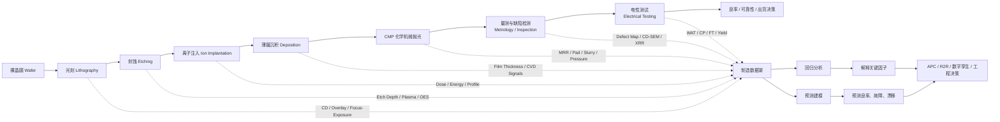
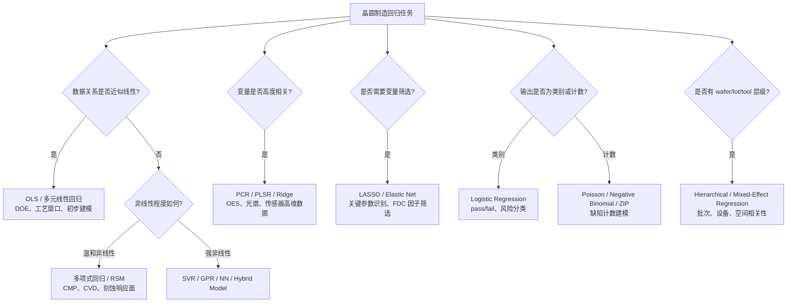
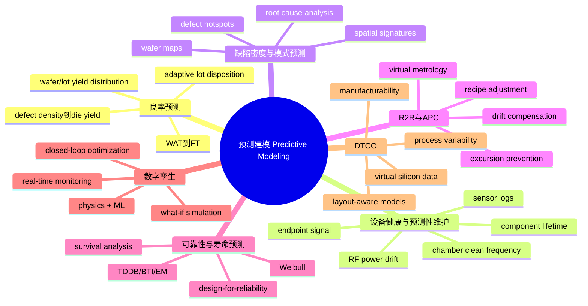
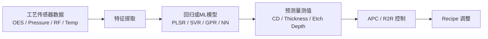
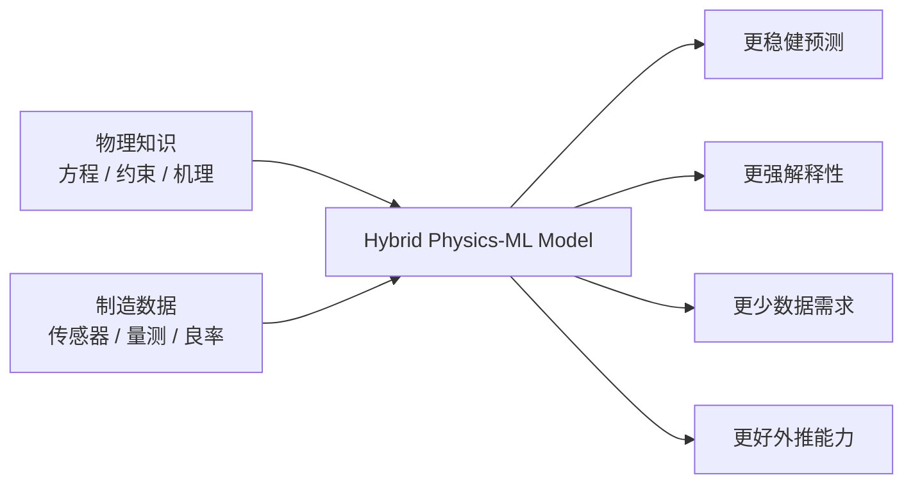
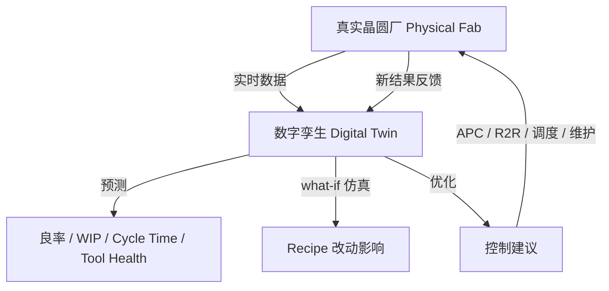
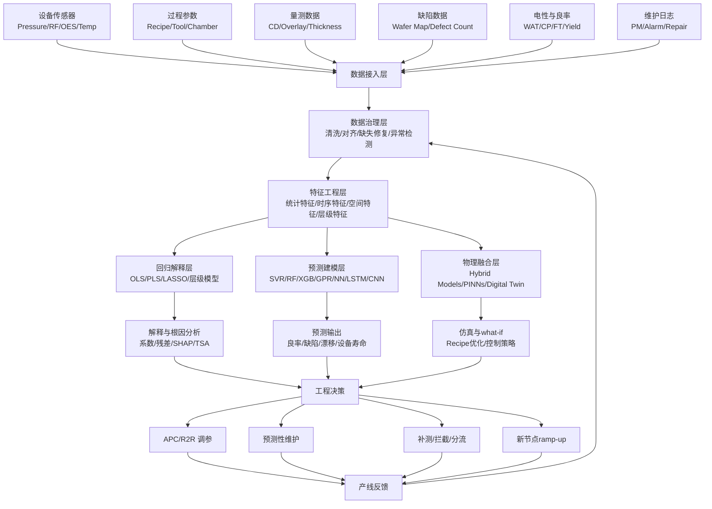

# 从“经验调参”到“预测型晶圆厂”：精读《Review of Applications of Regression and Predictive Modeling in Wafer Manufacturing》

> 本文基于论文 **Review of Applications of Regression and Predictive Modeling in Wafer Manufacturing** 展开精读式解读。该文发表于 *Electronics*，作者为 Hsuan-Yu Chen 和 Chiachung Chen，论文聚焦“回归分析与预测建模如何应用于晶圆制造”，覆盖 DOE、虚拟量测、故障检测、良率预测、预测性维护、数字孪生、APC、可解释 AI 和边缘 AI 等主题。论文指出，晶圆制造包含 500–1000 个高度耦合步骤，且先进节点下纳米级甚至亚纳米级偏差都可能造成严重良率损失，因此回归与预测建模正在成为智能晶圆厂的基础分析框架。

---

## 1. 这篇论文到底想解决什么问题？

这篇论文的核心问题可以浓缩成一句话：

> **在越来越复杂、越来越昂贵、越来越接近物理极限的晶圆制造中，如何用回归分析和预测建模，把海量制造数据转化为可解释、可预测、可控制的工程决策？**

半导体制造不是普通的流水线生产。一片晶圆要经历光刻、刻蚀、薄膜沉积、离子注入、清洗、化学机械抛光、量测、缺陷检测、电性测试等一系列步骤。论文指出，单片晶圆的制造可能包含 500 到 1000 个顺序工艺步骤，这些步骤彼此依赖、相互耦合，对微小波动极其敏感。随着技术节点逼近 3 nm 及更先进节点，氧化层厚度、关键尺寸 CD、overlay 误差等参数的微小偏差，都可能放大成最终良率损失。

这就是为什么传统“经验 + 物理启发式规则”的控制方式越来越吃力。过去工艺窗口相对宽，工程师可以依赖经验、DOE 实验和统计过程控制来调参；但在先进制程中，变量太多、噪声太强、耦合太复杂、成本太高，单纯靠人工经验已经很难做到实时、稳定、可扩展的优化。

论文给出的答案是：**回归分析与预测建模共同构成晶圆厂的数据智能底座。**

回归分析更偏向“解释”：
它回答“哪些工艺参数影响结果？”“温度、压力、气体流量、刻蚀时间和薄膜厚度之间是什么关系？”“哪个参数是良率下降的主要驱动因子？”

预测建模更偏向“预判”：
它回答“这片晶圆最终良率会是多少？”“这台设备是否即将漂移？”“下一批产品是否会异常？”“是否需要提前维护或调整 recipe？”

论文非常明确地说，回归模型长期用于 DOE、过程优化和良率分析，并已发展到多变量建模、虚拟量测和故障检测；预测建模则进一步结合机器学习和 AI，利用海量传感器与量测数据，实现实时过程监控、良率预测和预测性维护，并被集成到 APC、数字孪生和自动化决策系统中。

---

## 2. 先用一张图理解晶圆制造：数据从哪里来？

论文图 1 将晶圆制造过程概括为光刻、刻蚀、离子注入、沉积、CMP、检查和电性测试等关键环节。这个图看起来简单，但背后隐藏着本文最重要的逻辑：**每一个步骤都会产生数据，每一种数据都可能成为预测模型的输入。**

可以用下面的 Mermaid 图重画论文中的制造流程，并加入“数据流”的视角：



在这个视角下，晶圆厂不是一条“先加工再检测”的线性流程，而是一套持续产生数据、持续校正自身的复杂系统。数据不是附属品，而是制造能力的一部分。

---

## 3. 回归分析和预测建模：两者不是替代关系，而是互补关系

论文表 1 专门比较了回归分析和预测建模的差异与互补性。它把回归定义为解释和量化工艺变量与输出之间关系的方法，把预测建模定义为预测未来状态的方法，例如良率、缺陷密度、设备健康状态等。回归的优势是解释性强、统计严谨、适合假设检验；预测建模的优势是适应非线性、高维、噪声数据，预测精度更高，但可能牺牲解释性，并需要更多数据和算力。

可以这样理解：

| 维度   | 回归分析 Regression              | 预测建模 Predictive Modeling         |
| ---- | ---------------------------- | -------------------------------- |
| 核心问题 | 为什么会这样？                      | 接下来会怎样？                          |
| 典型输出 | 参数关系、系数、显著性、残差               | 良率预测、异常概率、设备健康状态                 |
| 常用方法 | 线性回归、多元回归、逻辑回归、PLS、PCR、LASSO | RF、SVM/SVR、GPR、XGBoost、神经网络、深度学习 |
| 适用场景 | DOE、工艺窗口、参数敏感性、虚拟量测          | 实时监控、故障预测、良率预测、数字孪生              |
| 优点   | 可解释、工程师易接受、适合根因分析            | 适合复杂非线性、高维噪声、多源数据                |
| 局限   | 非线性和大数据场景受限                  | 黑箱、部署成本高、需要持续维护                  |

这篇论文的一个重要观点是：**智能晶圆厂并不应该在“传统统计”与“AI 黑箱”之间二选一。真正有价值的是把两者结合起来。**

回归负责建立可解释的工程桥梁，预测建模负责提升复杂场景下的预判能力。前者像工程师的公式和白板，后者像实时运行的智能雷达。两者共同作用，才能把晶圆厂从“事后救火”推向“事前预防”。

---

## 4. 为什么晶圆制造特别适合，也特别需要回归？

回归分析的直觉很简单：我们想知道输入变量如何影响输出变量。

在晶圆制造中，输入可能是：

* 光刻曝光剂量、焦距、stage 温度、晶圆翘曲；
* 刻蚀气体流量、RF power、腔体压力、刻蚀时间；
* CVD 温度、气体比例、沉积时间；
* CMP 压力、转速、slurry 浓度、pad 状态；
* 来料批次、设备编号、recipe 版本、维护周期。

输出可能是：

* 薄膜厚度；
* 关键尺寸 CD；
* overlay 误差；
* 刻蚀深度；
* 材料去除率 MRR；
* 缺陷密度；
* WAT 电性参数；
* CP/FT 良率；
* 可靠性寿命。

论文指出，回归模型在晶圆制造中用于量化过程输入与晶圆输出之间的数学关系，是预测建模的基础。典型应用包括过程参数关系建模、量测相关性建模、故障检测与 excursion 分析。

换句话说，回归在晶圆厂中的作用不是“古老统计方法”，而是帮助工程师把混乱的多变量制造过程转化为可理解、可验证、可优化的数学关系。

---

## 5. 论文列出的晶圆制造数据版图

论文在 “Data Landscape in Wafer Manufacturing” 中总结了晶圆厂常见数据类型：过程参数、原位传感器数据、量测数据、overlay/flatness/defect 数据、电性测试和良率数据。这些数据具有高容量、高维度、层级化的特点，例如 die 嵌套在 wafer 内，wafer 又嵌套在 lot 内。

为了更清楚，可以把数据版图整理如下：

| 数据类型                     | 示例                                                   | 建模价值                 |
| ------------------------ | ---------------------------------------------------- | -------------------- |
| Process parameters       | 温度、压力、RF power、气体流量、转速、recipe 时间                     | 建立输入参数与输出质量之间的关系     |
| In-situ sensor data      | plasma optical emission、腔体压力轨迹、电机电流曲线                | 捕捉设备状态、过程漂移、异常前兆     |
| Metrology data           | CD-SEM、scatterometry、film thickness、XRR              | 用于虚拟量测、过程反馈、质量预测     |
| Inspection / defect data | defect counts、wafer maps、particles、scratches         | 用于缺陷模式识别、良率风险预测      |
| Electrical / yield data  | WAT、parametric tests、threshold voltage、leakage、CP、FT | 用作最终标签或中间质量指标        |
| Hierarchical data        | die-within-wafer、wafer-within-lot、tool-level history | 用于层级回归、混合效应模型、批次差异分析 |

这部分非常关键。因为晶圆制造中的 AI 建模，真正难点不是“选一个算法”，而是如何处理这些数据的复杂结构。

一片晶圆不是一个孤立样本。它属于某个 lot，经由某台或多台设备，经过某个 recipe，在某个时间窗口被加工，然后在多个测试站点产生量测值。每个 die 又有空间位置，每个设备有维护历史，每个工艺步骤有时序曲线。于是，数据天然就是多层级、多时间、多空间、多模态的。

---

## 6. 回归在不同工艺步骤中的典型应用

论文第 1.2 节按照工艺步骤列举了回归和预测建模的典型应用，这部分可以看作“晶圆厂回归建模应用地图”。

### 6.1 光刻：预测 CD、overlay 和工艺窗口

光刻是先进制程中最关键的步骤之一。回归模型可用于预测 CD uniformity、focus-exposure process window 和 overlay error。比如，overlay error 可以和 stage temperature、wafer bow、lens aberration 等因素建立回归关系。

直观理解：光刻就像把一张极其复杂的图案投影到晶圆上。如果焦距、曝光剂量、镜头误差、晶圆翘曲稍有偏差，图案位置和线宽都会变。回归模型的作用，就是帮工程师判断“哪个因素让图案偏了”。

### 6.2 刻蚀和沉积：用传感器预测深度与厚度

刻蚀和沉积过程会产生大量工具传感器信号，例如 RF power、腔体压力、气体流量、plasma signal。论文指出，预测模型可以根据这些传感器信号预测 etch depth 和 film thickness uniformity，也可以结合三维刻蚀仿真和机器学习优化 plasma etching。

这其实就是虚拟量测的典型场景：不一定每片都拿去做昂贵或耗时的物理量测，而是用过程数据预测量测结果。

### 6.3 CMP：预测材料去除率 MRR

CMP 是化学机械抛光，用于让晶圆表面平坦化。论文提到，回归模型可用于预测 CMP 中的 material removal rate，并有研究使用多个回归模型预测 wafer material removal，还将 polishing pad 的 asperity radius 和 asperity density 作为响应变量。

CMP 的难点在于，它同时涉及机械接触、化学反应、流体、pad 状态和 wafer 表面形貌。单纯物理模型很复杂，单纯数据模型又可能不稳。因此 CMP 也是混合 physics–ML 模型特别有价值的场景。

### 6.4 量测相关性：把 inline 数据连接到最终良率

论文强调，回归可把 inline inspection data 与 final wafer yield 连接起来，也可以用 PLS 将 scatterometry 谱数据与实际 CD 测量关联。

这非常重要，因为 final test 太晚。真正有价值的是在制造过程中就预测最终表现。量测相关性的本质是：找到“早期可观察信号”和“最终结果”之间的桥梁。

### 6.5 电性测试：提前预测 die pass/fail

论文还提到，回归可用于在 final test 之前预测 die pass/fail；早期研究也使用主成分方法、回归方法和 CART 来研究 wafer fabrication process 对 wafer quality/yield 的影响。

这意味着回归不仅可以用于连续变量，例如厚度、CD、MRR，也可以用于分类型或风险型任务，例如是否通过测试、是否低良率、是否需要拦截。

---

## 7. 回归与预测建模带来的七大收益

论文第 1.3 节总结了回归与预测建模在晶圆制造中的收益，包括早期良率估计、过程优化、成本降低、可靠性提升、缩短 ramp-up、提高良率、减少 scrap。

可以把它们理解成晶圆厂管理者最关心的七个问题：

| 业务目标       | 回归/预测建模如何发挥作用                          |
| ---------- | -------------------------------------- |
| 早期良率估计     | 在最终测试前预测 wafer/lot 良率，提前识别风险           |
| 过程优化       | 找出影响质量的关键参数，优化工艺窗口                     |
| 成本降低       | 减少不必要量测、降低返工和报废、优化维护计划                 |
| 可靠性提升      | 提前发现微小漂移，避免系统性失效扩大                     |
| 缩短 ramp-up | 帮助新节点、新产品快速学习和快速爬坡                     |
| 提高良率       | 提前检测 yield excursion，指导设备校准和 recipe 调整 |
| 减少 scrap   | 在封装或最终测试前识别高风险晶圆，避免后续浪费                |

这几个收益背后有共同逻辑：**越早发现问题，越便宜；越晚发现问题，越昂贵。**

如果在 FT 之后才发现问题，前面所有工艺、封装、测试资源都已经投入；如果能在 inline metrology、WAT 或设备传感器阶段发现风险，工厂就可以及时补测、调参、维护、分流甚至停止继续加工。

---

## 8. 三类回归应用：参数关系、量测相关、故障分析

论文第 2 节把回归在晶圆制造中的应用归纳为三类：process–parameter relationship modeling、metrology correlation、fault detection and excursion analysis。

### 8.1 Process–Parameter Relationship Modeling：找出“谁影响谁”

这类模型用于建立工艺变量与晶圆指标之间的关系。例如用多元线性回归预测 film thickness variation，输入可能包括 deposition time、temperature、gas flow、pressure 等。

这种模型的价值在于工艺理解。工程师不仅想知道预测结果，更想知道：

* 哪个参数最重要？
* 参数之间是否存在交互？
* 工艺窗口是否足够宽？
* 参数波动会不会放大到最终质量？

### 8.2 Metrology Correlation：让量测更快、更少、更智能

量测非常贵，也会拉长 cycle time。有些量测甚至是破坏性或半破坏性的。回归和预测建模可以把 inline metrology、工具传感器、历史测试结果连接起来，实现 virtual metrology。

论文指出，metrology correlation 可以把 inline metrology 和 end-of-line electrical test 关联起来，支持虚拟量测、快速反馈和主动控制，从而提升良率、减少周期时间并增强工具监控。

### 8.3 Fault Detection and Excursion Analysis：用残差发现异常

回归模型还有一个非常实用的用途：看预测值和实际值之间的残差。

如果模型预测某片 wafer 的 CD 应该是某个值，但实际量测值显著偏离，残差异常就可能说明设备漂移、腔体状态变化、传感器异常或 recipe 执行偏差。论文提到，可以用 regression residuals 暴露 expected vs. actual performance 之间的异常偏差，并辅助根因识别。

这就是统计建模在 FDC 中的经典思路：模型不是为了“完美拟合过去”，而是为了在未来发现“不该发生的偏差”。

---

## 9. 回归方法全景：从 OLS 到层级贝叶斯

论文第 4 节系统整理了晶圆制造中的回归方法。下面我们用“适合什么问题”的角度来解读。

### 9.1 线性回归 OLS：最基础，但不是没用

普通最小二乘回归是最简单也最经典的工具。它把输出变量建模为多个输入变量的线性组合。例如，deposition rate 可以建模为 chamber pressure 和 power 的函数；CD 可以建模为 exposure dose 和 focus 的函数。

它的优点是解释性强、易部署、工程师容易理解。缺点是对独立性、同方差等假设敏感，而真实 fab 数据常常存在 wafer-to-wafer correlation、tool drift 和层级嵌套结构。论文也指出，线性回归常用于 DOE 和初始工艺建模，但真实 fab 数据中其假设往往被破坏。

### 9.2 多元回归：把多个因素放在一起看

晶圆制造几乎没有单因素问题。光刻的 focus 和 dose 会共同影响 CD；刻蚀的 RF power、pressure 和 gas ratio 之间有交互；CMP 的压力、slurry 和 pad 状态共同影响 MRR。

多元回归允许多个输入变量同时进入模型，用来捕捉多因素影响和部分交互关系。论文举例提到，多元回归可用于 oxide thickness instability 的因素分析，也可与响应面方法结合优化 CMP slurry composition。

### 9.3 多项式回归与响应面：处理温和非线性

半导体过程很少是严格线性的。photoresist CD shrinkage 可能随 bake time 和 temperature 呈非线性变化；ion implantation dose response 也可能呈类二次关系。

多项式回归通过加入平方项、三次项、交互项来近似非线性关系。它比线性回归灵活，但也更容易过拟合。因此论文强调，需要谨慎验证。

### 9.4 逻辑回归、Poisson、ZIP：处理通过/失败与缺陷计数

逻辑回归适合预测 binary/categorical outcomes，例如是否有缺陷、pass/fail、是否高风险。论文还提到，有研究使用 Poisson regression、negative binomial regression、zero-inflated Poisson regression，并把 die 的空间位置和缺陷数量作为变量，以改善 wafer map 上空间缺陷分布下的良率预测。

这说明晶圆制造中的“回归”并不只等于连续值预测，也包括分类概率、计数数据和空间缺陷建模。

### 9.5 非线性回归：面对复杂工具—材料相互作用

非线性回归适合 plasma etch rate、diffusion profile、CVD film growth、CMP removal 等复杂过程。论文提到，CMP 高度非线性的动态适合虚拟量测建模，MOCVD 薄膜生长也可以通过混合神经网络进行非线性回归。

非线性回归的核心价值是：它承认制造过程不是直线关系，而是由复杂物理、化学、设备状态和材料交互共同决定。

### 9.6 PCR：用主成分处理共线性

Principal Component Regression 先把高度相关的输入变量转换为正交主成分，再用这些主成分做回归。它适合高维且强相关的数据，例如传感器特征、OES 光谱、CMP 多变量输入。

论文指出，PCR 可以降低多重共线性，增强 yield、defect density、CD 等建模的稳健性，并支持虚拟量测和故障检测。

### 9.7 PLSR：半导体虚拟量测中的重要方法

Partial Least Squares Regression 不只是压缩输入变量，还会考虑输入与输出之间的协方差关系。它特别适合高维、共线、样本有限的工业数据。

论文指出，PLSR 在晶圆制造中非常重要，因为它能处理共线和高维输入空间，提取连接 tool signatures 与 outputs 的 latent variables。应用包括椭偏光谱建模、等离子体发射监控、刻蚀轮廓预测等。

### 9.8 Ridge、LASSO、Elastic Net：既防过拟合，又做特征筛选

正则化回归是高维晶圆数据中非常实用的一类方法。Ridge 通过收缩系数稳定模型；LASSO 可以把不重要变量系数压到 0，从而完成特征选择；Elastic Net 结合两者优点。论文指出，这些方法对高维、共线 process data 很重要，可增强 defect prediction、virtual metrology、yield modeling 和 fault detection 的稳健性与解释性。

在产线上，这类方法常被工程师喜欢，因为它不仅预测，还能告诉你哪些变量最值得关注。

### 9.9 层级与混合效应回归：处理 wafer、lot、tool 的嵌套结构

晶圆制造数据天然是嵌套的：die 在 wafer 内，wafer 在 lot 内，lot 经由 tool 或 chamber 加工。普通回归容易忽略这种层级结构。

论文指出，hierarchical and mixed-effect regression 可以建模 wafer、lot、tool 等嵌套结构中的 variability，同时捕捉固定工艺效应和随机变化，从而改善 yield prediction、process optimization 和 equipment health monitoring。

这类模型特别适合回答：

* 某个异常是产品本身造成的，还是某台 tool 造成的？
* 某个 lot 的低良率是偶然波动，还是批次系统性偏移？
* wafer 内空间相关性是否影响良率预测？

---

## 10. 一张图总结回归方法选型



这张图的重点是：**方法没有绝对优劣，只有任务匹配。**

---

## 11. 预测建模：从“解释过去”走向“预判未来”

论文第 3 节把预测建模定义为比回归更宽的框架，包含高级机器学习和统计预测，目标是在问题发生前预测 wafer quality、yield 或 tool health。

它包含七大应用方向。

### 11.1 良率预测

良率是 wafer manufacturing 的最终 KPI。预测模型可以在晶圆完成全部流程前，预测 wafer-level 或 die-level yield。论文提到，良率预测可基于 defect density、metrology data、test parameters，并可通过逻辑回归进行 pass/fail 分类；Jiang 等研究使用 GMM 聚类与加权集成回归器，在 wafer fabrication 阶段预测 back-end final test yield。

这类模型最直接的价值是：提前知道哪片晶圆或哪个 lot 可能出问题，从而决定是否继续加工、补测、调参或拦截。

### 11.2 设备健康监控与预测性维护

论文指出，预测模型可以使用 sensor logs 和 historical maintenance data，在工具故障发生前进行预判。例如根据 RF power stability 和 endpoint signal drift 预测 chamber clean frequency。设备健康监控通过分析传感器、振动、维护记录，识别 degradation pattern 和 component lifetime，从而支持 condition-based maintenance。

这意味着维护方式从“坏了再修”变成“还没坏就知道它快坏了”。

### 11.3 缺陷密度与缺陷模式预测

缺陷不是随机噪点。它往往有空间模式、设备签名、工艺根因。论文指出，预测模型可根据 inspection data、wafer maps、process parameters 识别 defect sources、spatial patterns 和 recurring defect signatures。

这部分与 wafer map、空间统计、图像模型、分类模型关系密切。它帮助工程师从“发现缺陷”进入“定位根因”。

### 11.4 Process Control 与 Run-to-Run Optimization

R2R 控制是晶圆制造中非常重要的控制思想：上一批或上一片的量测结果，用来调整下一批或下一片的 recipe。

论文指出，预测模型可分析 metrology data、tool parameters 和 historical trends，在 wafer runs 之间动态调整 recipe。Wan 等提出把 virtual metrology 与 R2R control 结合，用 GPR-enabled VM R2R control 在 CMP 案例中保持 R2R 控制优势，同时避免物理量测带来的成本和周期时间影响。

这就是预测模型进入 APC 的典型路径：不是等结果出来再分析，而是实时进入控制闭环。

### 11.5 可靠性与寿命预测

可靠性预测关注产品或设备随时间的退化。论文提到，survival analysis、Weibull modeling 和 machine learning 可用于预测 tool replacement intervals 和 product reliability，也可用于预测 transistor/device degradation，支持 design-for-reliability 策略。

这类模型把制造质量和长期可靠性连接起来，尤其适合车规、服务器、功率器件等高可靠性需求场景。

### 11.6 虚拟制造与数字孪生

论文指出，digital twin models 通过集成物理模型、传感器数据和 AI 分析，复制 semiconductor processes，用于实时监控和优化。数字孪生可以让工程师进行 “what-if” scenarios，在不做昂贵物理实验的情况下评估 recipe 变化、预测 yield outcomes、加速开发。

数字孪生不是一个炫酷概念，而是把仿真、实时数据、回归、机器学习、控制系统连在一起的工程系统。

### 11.7 DTCO：设计与工艺协同优化

论文还把 Design–Technology Co-Optimization 纳入预测建模应用。DTCO 通过 layout-aware simulations、process variability models 和 manufacturing constraints，在设计阶段就考虑工艺可制造性、良率、性能、功耗与成本。论文还提到 GAN 可用于生成 wafer-level WAT 和 CP 测试数据，支持 process 和 design 的协同优化。

这说明预测建模不只服务制造现场，也可以前移到芯片设计与工艺协同阶段。

---

## 12. 预测建模全景图



---

## 13. 预测建模方法：VM、FDC、时序模型、混合模型

论文第 5 节进一步从方法类别讨论预测建模。

### 13.1 Virtual Metrology Models：不量也能估

虚拟量测是本文的核心关键词之一。它的目标是用 upstream sensor data、process parameters、历史量测结果来预测实际量测值，例如 film thickness、CD、etch depth。这样可以减少昂贵或耗时的物理量测。

论文中多次强调，VM 可以减少 cycle time、降低量测成本，并让结果更早进入 R2R 控制。

VM 的本质是：



### 13.2 Yield Prediction Models：最终 KPI 的提前预测

论文指出，yield 是 wafer manufacturing 的 ultimate KPI。预测模型可以在晶圆完成前预测 yield，并支持 adaptive lot disposition，即提前决定某片晶圆是继续加工、补救还是报废。

这类模型通常使用 WAT parametrics、defect density、wafer maps、functional test values、hierarchical wafer-within-lot correlations 等信息。

### 13.3 FDC Models：把异常拦在扩大之前

FDC 模型监控工具传感器和过程数据，早期检测异常、分类故障类型、防止 excursion。论文指出，FDC 模型可使用 regression residuals 作为异常信号，也可用 ML classifier 判断 tool run 是 normal 还是 abnormal，还可用 time-series model 在 out-of-control 事件前预测 drift。

这个场景很像工业“早期报警系统”：不是等良率已经下降，而是在设备信号刚刚偏离时就发出预警。

### 13.4 Time-Series Predictive Models：理解时间轨迹

晶圆制造中大量数据是时间序列，例如腔体压力轨迹、plasma emission、温度曲线、电流曲线。论文指出，time-series predictive models 可以预测 tool performance、process drift 和 yield trends，用于 proactive fault detection、predictive maintenance 和 run-to-run control。

这也是 LSTM、RNN、TCN、Transformer 等模型有用的原因。它们处理的不是单个静态点，而是一段过程轨迹。

### 13.5 Hybrid Models：物理模型和数据模型结合

论文指出，hybrid models 结合 physics-based equations 与 data-driven algorithms，以提升 predictive accuracy 和 interpretability。它们可以让模型不只记住历史数据，还能遵循工艺物理规律。

这在晶圆制造中特别重要。纯数据模型容易在工艺变更、设备漂移、新产品导入时失效；纯物理模型又难以覆盖所有复杂细节。混合模型试图结合两者优势。

---

## 14. 机器学习如何与回归融合？

论文第 6 节讨论了回归与机器学习的结合。它指出，决策树和随机森林可捕捉非线性交互，SVM 可用于 wafer/die good/bad 分类，神经网络可从复杂多变量数据中预测 yield；随机森林和梯度提升可处理非线性与交互，神经网络可捕捉复杂 sensor-output mapping，SVR 对高维 metrology data 有效，CNN 可用于 wafer map defect classification，RNN 可用于 time-series tool data。

这部分非常像把传统回归扩展成现代预测系统。

| 模型                                     | 适合任务                         | 优点               | 需要注意             |
| -------------------------------------- | ---------------------------- | ---------------- | ---------------- |
| SVR                                    | CD、厚度、OES 到量测值、虚拟量测          | 适合高维小样本、非线性映射    | kernel 和参数选择重要   |
| Random Forest                          | 良率预测、缺陷分类、特征重要性              | 抗噪、可解释性较好、能处理非线性 | 对外推能力有限          |
| Gradient Boosting / XGBoost / LightGBM | defect density、yield、复杂表格数据  | 精度强、适合非线性和交互     | 黑箱程度较高，需 SHAP 辅助 |
| Neural Networks                        | 复杂传感器到质量输出映射                 | 表达能力强，适合大规模数据    | 数据量、调参、解释性是挑战    |
| CNN                                    | wafer map、缺陷图像、空间模式          | 自动提取空间特征         | 类别不平衡、新缺陷泛化难     |
| LSTM / RNN                             | tool drift、时序传感器、yield trend | 捕捉时间依赖           | 数据对齐和实时部署复杂      |
| Hybrid / Ensemble                      | 高维、噪声、不平衡、多源场景               | 兼顾稳健性和精度         | 系统复杂度更高          |

论文中特别提到，SVR 可通过高维映射捕捉 tool settings 与 CD variations 之间的复杂关系，并支持 virtual metrology、process optimization 和 inspection cost reduction；半监督 SVR 还可利用 unlabeled data 改善预测准确率并减少训练时间。

对于随机森林和梯度提升，论文指出它们擅长 noisy、high-dimensional fab data，能捕捉非线性关系、排序关键特征，并支持 root cause analysis、defect classification 和 process optimization；相关研究也结合 SHAP 解释 feature importance，帮助理解 yield 与 features 的关系。

对于神经网络，论文强调其可建模 process parameters 与 yield、defects、CD 等输出之间的高度非线性关系，支持 virtual metrology、predictive maintenance 和 early anomaly detection；CNN、autoencoder、LSTM、FFNN 等被用于多变量 VM、噪声缺陷数据、wafer image classification 和 edge yield trend prediction。

---

## 15. 从数据到预测控制闭环

下面展示的是本文核心思想：数据进入回归与预测模型，模型输出预警和控制建议，再反馈到产线。

```html
<svg width="920" height="390" viewBox="0 0 920 390" xmlns="http://www.w3.org/2000/svg">
  <style>
    .box { fill:#f8fafc; stroke:#334155; stroke-width:2; rx:16; }
    .title { font:700 18px sans-serif; fill:#0f172a; }
    .txt { font:14px sans-serif; fill:#334155; }
    .arrow { stroke:#2563eb; stroke-width:3; fill:none; marker-end:url(#arrowhead); }
    .flow { stroke-dasharray:8 8; animation: dash 1.8s linear infinite; }
    .pulse { fill:#ef4444; animation:pulse 1.2s ease-in-out infinite alternate; }
    @keyframes dash { to { stroke-dashoffset:-32; } }
    @keyframes pulse { from { opacity:.25; r:4; } to { opacity:1; r:9; } }
  </style>

  <defs>
    <marker id="arrowhead" markerWidth="10" markerHeight="7" refX="9" refY="3.5" orient="auto">
      <polygon points="0 0, 10 3.5, 0 7" fill="#2563eb"/>
    </marker>
  </defs>

  <rect x="35" y="55" width="190" height="95" class="box"/>
  <text x="77" y="90" class="title">制造数据</text>
  <text x="60" y="118" class="txt">传感器 / 量测 / WAT / FT</text>
  <circle cx="200" cy="76" r="6" class="pulse"/>

  <rect x="365" y="35" width="190" height="85" class="box"/>
  <text x="404" y="68" class="title">回归分析</text>
  <text x="385" y="96" class="txt">解释关系 / 找关键因子</text>

  <rect x="365" y="155" width="190" height="85" class="box"/>
  <text x="400" y="188" class="title">预测建模</text>
  <text x="388" y="216" class="txt">预测良率 / 漂移 / 故障</text>

  <rect x="695" y="95" width="190" height="95" class="box"/>
  <text x="735" y="130" class="title">智能决策</text>
  <text x="718" y="158" class="txt">APC / R2R / 维护 / 分流</text>
  <circle cx="858" cy="116" r="6" class="pulse"/>

  <rect x="365" y="285" width="190" height="70" class="box"/>
  <text x="405" y="317" class="title">产线反馈</text>
  <text x="392" y="342" class="txt">良率结果 / 工程验证</text>

  <path d="M225 103 C275 80,315 70,365 77" class="arrow flow"/>
  <path d="M225 103 C275 160,315 190,365 197" class="arrow flow"/>
  <path d="M555 77 C610 82,650 108,695 132" class="arrow flow"/>
  <path d="M555 197 C610 190,650 168,695 148" class="arrow flow"/>
  <path d="M790 190 C790 300,640 320,555 320" class="arrow flow"/>
  <path d="M365 320 C230 320,130 245,130 150" class="arrow flow"/>

  <text x="35" y="375" class="txt">核心闭环：数据不是只用于报表，而是进入回归解释、预测预警、控制决策和持续学习。</text>
</svg>
```

---

## 16. 挑战一：多重共线性

论文第 7 节总结了回归与预测建模面临的挑战。第一个是 multicollinearity，即工具参数或过程参数之间高度相关，会膨胀估计方差，导致模型系数不稳定。论文指出，晶圆数据高维且互相关联，可用 variable elimination、PCA、ridge regression、PLS 等方法缓解。

这在晶圆厂很常见。比如温度、压力、RF power、gas flow 可能并不是独立变化的；某些 recipe 参数也可能由同一控制策略共同决定。此时普通线性回归可能给出不稳定甚至误导性的系数。

解决思路不是简单“删变量”，而是结合工艺知识、降维、正则化和可解释分析。

---

## 17. 挑战二：非线性、动态性与非平稳

论文指出，晶圆制造中的很多交互是高度非线性且随时间变化的，线性回归难以胜任；深度学习、Gaussian processes、recursive updates 等高级模型能改善不确定性处理和动态预测能力。

这正是先进制程的典型特征：

* 腔体状态会随时间变化；
* 设备老化会导致模型系数漂移；
* 维护后设备分布会发生跳变；
* 新产品导入会改变数据分布；
* 不同 tool/chamber 之间存在 domain shift；
* 工艺参数对质量的影响可能存在延迟效应。

因此，晶圆厂里的模型不应被视作“一次训练永久使用”的静态公式，而应被视为持续校准、持续监控、持续更新的动态系统。

---

## 18. 挑战三：高维数据与过拟合风险

现代传感器每片 wafer 可能产生数百甚至数千个变量。论文指出，high-dimensional data 会带来过拟合风险，需要 PCA、PLS、autoencoder、sufficient dimensionality reduction、penalized regression 等方法进行降维和稳健建模。

这里有一个非常重要的工程经验：

> 在晶圆制造中，变量越多不一定越好。真正重要的是找到稳定、可解释、可迁移、与工艺机制一致的变量组合。

很多模型在历史数据上表现很好，上线后却失效，原因可能就是学到了偶然相关、无关变量或某个时期特定的设备噪声。

---

## 19. 挑战四：概念漂移

论文把 concept drift 单独列为回归挑战：随着工具老化、recipe 变化或 fab conditions 漂移，回归系数会变化，模型需要在线学习、自适应滤波、集成或持续学习策略。

概念漂移是工业 AI 的“慢性病”。它不像一次异常那么明显，而是慢慢让模型变得不准。

一个 VM 模型今天准确，不代表三个月后还准确；一台设备 PM 前后的状态可能不同；同一个 recipe 换到另一台 chamber 后分布可能变掉。没有漂移监控的模型，本质上是有保质期的。

---

## 20. 挑战五：解释性与准确率的矛盾

论文指出，工程师偏好可解释回归模型，但 AI/ML 往往提供更高预测精度。相关研究显示，GAM、EBM、SOC 等方法可以在解释性与性能之间寻找折中。

在晶圆厂，解释性不是“锦上添花”，而是模型能不能被采纳的关键。工程师不会因为模型说“低良率概率 92%”就贸然停机或改 recipe。他们会追问：

* 为什么低良率？
* 哪个 step、哪台 tool、哪个 chamber 可疑？
* 哪个 sensor signal 导致判断？
* 这个判断和物理机制一致吗？
* 有没有历史案例支持？
* 改参数后风险会降低吗？

所以，未来的高价值模型不只是预测器，而是带有解释、置信度、根因线索和工程建议的决策系统。

---

## 21. 预测建模的五大挑战

论文表 7 将预测建模挑战总结为五类：data quality and integration、model interpretability、tool-to-tool variation、computational efficiency、imbalanced data。

| 挑战                     | 晶圆厂中的表现                | 可能解法                                        |
| ---------------------- | ---------------------- | ------------------------------------------- |
| 数据质量与集成                | 传感器噪声、缺失、时间戳错位、设备数据不一致 | 数据清洗、对齐、误差修正、领域知识、PINNs                     |
| 模型解释性                  | 黑箱模型难以被工程师信任           | SHAP、XAI、透明模型、因果分析                          |
| Tool-to-tool variation | 一台设备训练的模型换台设备失效        | domain adaptation、层级模型、迁移学习                 |
| 计算效率                   | 在线推理必须足够快              | 轻量模型、ROM、surrogate model、edge AI            |
| 不平衡数据                  | 缺陷样本远少于正常样本            | oversampling、CAE/GAN 增强、ensemble classifier |

这五个挑战说明，晶圆厂中的预测建模不能只追求论文指标。它必须处理真实制造环境中的脏数据、变分布、实时性、少数异常和工程信任问题。

---

## 22. 未来趋势一：Hybrid Physics–ML Models

论文第 8 节的第一个未来趋势是 hybrid physics–ML models。论文指出，将 process physics 与 regression/AI 结合，可以获得更稳健的预测；物理信息神经网络 PINNs 可把物理定律和 governing equations 嵌入神经网络，提高 interpretability、robustness 和 data efficiency。

这可能是半导体 AI 最重要的方向之一。

纯机器学习模型擅长从数据中找模式，但它不懂物理。物理模型懂机制，但往往过于理想化，难以覆盖真实 fab 中复杂的设备差异和噪声。Hybrid model 的目标是把两者结合：



在 CMP、CVD、etch、lithography 等场景中，这类方法尤其有意义。

---

## 23. 未来趋势二：实时预测分析

论文指出，预测模型必须能在 real-time environment 中运行，并与 fab control systems 集成，才能触发即时纠正动作。文中提到，有研究构建 wafer fab 内各工作区的 aggregate models，利用实时 arrival/departure 数据动态预测 cycle time 和 WIP；也有基于 AnyLogic 数字孪生和 ML 模型实现超过 97.8% 实时良率预测准确率的案例。

这里的重点不是“模型准”，而是“模型够快、够稳、能接入控制系统”。

实时预测分析最终要做到：

* 实时读取 tool sensor；
* 实时更新 health score；
* 实时判断 yield risk；
* 实时触发补测或维护；
* 实时给 APC/R2R 控制器提供调整建议。

---

## 24. 未来趋势三：数字孪生

论文将 digital twins 定义为由 regression + AI predictive modeling 驱动的 wafer process virtual replicas，可把 physics-based wafer simulators 与 predictive ML regression 结合，用于 proactive process control。

数字孪生不是简单仿真软件，而是持续同步物理世界和虚拟世界的系统。它的理想状态是：



数字孪生使工程师可以在虚拟空间中测试工艺变化，减少昂贵实验，加快新节点开发，并降低试错成本。

---

## 25. 未来趋势四：Explainable AI

论文明确指出，提升复杂预测模型的解释性对于获得工程师信任至关重要。文中提到 SHAP 可量化关键特征，识别 yield fluctuations 的 process drivers；Trace Shapley Attribution 可用于连续 fab 过程中的 root cause diagnosis，识别对缺陷发生负主要责任的过程测量项，并处理时间依赖。

对晶圆厂来说，XAI 的目标不是画漂亮图，而是把模型预测变成工程语言：

* “低良率风险主要来自 Step 42 的 pressure drift。”
* “OES 第 310–450 nm 区间的强度变化贡献最大。”
* “该异常与上次 chamber clean 前的模式相似。”
* “如果把 RF power 调回历史中心线，预测风险下降 18%。”
* “当前模型置信度较低，建议补测 CD-SEM。”

这样的解释才是可执行的。

---

## 26. 未来趋势五：Edge AI Deployment

论文第 8.5 节指出，把预测模型直接部署在 equipment controllers 上，可以实现 fast feedback。例如边缘 AI 系统可在 sensor layer 运行深度学习模型，实现复杂 etch 过程中的 real-time endpoint detection 和 multivariate sensor anomaly detection；AI-driven image processing 也可嵌入 CMP 设备，用于 endpoint 和 uniformity control。

这说明模型部署位置正在从中央数据平台下沉到设备端。

中心化平台适合离线分析、模型训练、跨 fab 比较；边缘端适合毫秒级响应、在线报警、设备内闭环控制。未来智能晶圆厂很可能是“云 + 边 + 设备控制器”的混合架构。

---

## 27. 从论文出发，设计一套可落地的晶圆预测建模系统

基于论文内容，一套面向晶圆制造的回归与预测建模系统可以这样设计：



这套系统的关键不是某个单独模型，而是闭环：

> **数据接入 → 数据治理 → 回归解释 → 预测预警 → 工程控制 → 结果反馈 → 模型更新。**

没有闭环，AI 只是报表；有了闭环，AI 才是制造能力。

---

## 28. 这篇论文的贡献

这篇论文的价值主要体现在五个方面。

第一，它把回归分析和预测建模放在同一个框架下讨论，而不是把传统统计和 AI 割裂开。对于半导体制造来说，这是非常合理的，因为真实产线既需要可解释的统计模型，也需要高精度的机器学习模型。

第二，它覆盖了完整应用链条：从 DOE、process optimization、metrology correlation、VM、FDC，到 yield forecasting、predictive maintenance、R2R control、digital twin、DTCO。这使它不仅是一篇算法综述，更像一张智能晶圆厂能力地图。

第三，它重视工艺步骤。论文不是泛泛地说“用 AI 做制造”，而是具体讨论 lithography、etching/deposition、CMP、metrology、electrical test 等工艺环节中的建模问题。

第四，它详细梳理了回归方法谱系，从 OLS、多元回归、多项式回归、逻辑回归、非线性回归，到 PCR、PLSR、正则化回归、层级混合效应模型。这对刚进入半导体数据建模领域的读者非常有用。

第五，它把挑战和未来趋势讲得比较工程化：多重共线性、非线性动态过程、高维数据、概念漂移、解释性与精度、数据质量、tool-to-tool variation、计算效率、不平衡数据，这些都是模型上线后真正会遇到的问题。

---

## 29. 这篇论文也有哪些不足？

从精读角度看，这篇论文也有一些可以进一步加强的地方。

首先，它是一篇覆盖面很广的综述，因此每个子方向的深度不完全均衡。例如，回归方法列得很全面，但对于不同模型在真实 fab 上的可复现 benchmark、评价指标和部署细节，仍然缺少统一比较。

其次，论文大量依赖引用研究的结论，不同案例使用的数据、产品、工艺节点、评价指标和实验条件不同，因此不能简单横向比较模型优劣。比如某个模型在 CMP MRR 上表现好，不代表它在 lithography overlay 或 FT yield prediction 上也最好。

再次，论文对 MLOps 和产线集成细节讨论还可以更深入。晶圆厂模型上线不仅要训练，还要解决数据权限、系统接口、漂移监控、模型版本、报警阈值、工程师确认流程、回滚策略和审计机制。

最后，论文强调 future directions 包括 hybrid physics–ML、explainable AI 和 autonomous manufacturing，但对于大模型、多模态 foundation models、工业 agents 在 fab decision support 中的角色讨论较少。这可能与论文主题定位有关，也为后续研究留下空间。

---

## 30. 对初学者最重要的理解框架

如果你刚开始学习半导体制造中的回归和预测建模，可以用下面这个“三层框架”来理解整篇论文。

### 第一层：回归是“解释器”

它帮助你回答：

* 哪个工艺参数影响最大？
* 参数之间有什么交互？
* 哪个设备或批次产生系统性偏差？
* 残差异常是否说明设备漂移？

对应方法包括 OLS、多元回归、RSM、PLSR、LASSO、层级模型等。

### 第二层：预测建模是“预警器”

它帮助你回答：

* 这片晶圆最终良率会不会低？
* 这台设备是否快要异常？
* 下一批 wafer 是否需要补测？
* 当前缺陷模式是否会扩散？

对应方法包括 SVR、RF、XGBoost、GPR、NN、CNN、LSTM、ensemble 等。

### 第三层：数字孪生与 APC 是“行动系统”

它帮助你回答：

* 应该如何调 recipe？
* 要不要提前维护？
* 是否拦截某个 lot？
* 如果改变参数，会发生什么？

对应系统包括 VM-enabled R2R control、APC、digital twins、edge AI、hybrid physics–ML models。

---

## 31. 用一个比喻总结：晶圆厂是一座“会自我体检的医院”

可以把晶圆厂想象成一座超级医院。

晶圆是病人。
工艺步骤是治疗流程。
传感器数据是生命体征。
量测数据是体检报告。
WAT/CP/FT 是不同阶段的诊断结果。
回归模型是医生的病因分析。
预测模型是风险评分系统。
数字孪生是虚拟病人。
APC/R2R 是治疗方案自动调整。

传统方式是病人出问题后再诊断；预测型晶圆厂则希望在病人真正恶化前，通过生命体征和历史病例提前发现风险。

但一个好的 AI 医生不能只说“风险高”。它必须说：

* 哪个指标异常；
* 异常从什么时候开始；
* 可能对应哪个器官或病因；
* 是否需要补充检查；
* 该如何调整治疗方案；
* 调整后风险是否下降。

这正是回归分析、预测建模、可解释 AI 和数字孪生在晶圆制造中共同追求的目标。

---

## 32. 最终总结：这篇论文真正告诉我们什么？

《Review of Applications of Regression and Predictive Modeling in Wafer Manufacturing》最重要的观点不是“某个模型很强”，而是：

> **晶圆制造正在从经验驱动、事后分析，转向数据驱动、实时预测和闭环优化。**

回归分析让工程师理解工艺输入与输出之间的关系；预测建模让晶圆厂提前预判良率、缺陷、设备漂移和维护需求；机器学习和深度学习扩展了回归在高维、非线性、噪声数据中的能力；数字孪生、APC、R2R 和 edge AI 则把模型输出变成实时工程行动。论文认为，未来方向包括 hybrid physics–ML models、real-time predictive analytics、digital twins、explainable AI 和 edge AI deployment，这些方向共同指向更自主、更智能、更可解释的晶圆制造系统。

用一句话概括：

> **回归分析让晶圆厂“看懂过去”，预测建模让晶圆厂“预判未来”，而数字孪生与自动控制让晶圆厂开始“自我优化”。**

这也是智能晶圆厂的真正含义：不是把 AI 当成一个模型插件，而是把数据、统计、机器学习、物理机理、控制系统和工程经验融合成一个持续学习、持续反馈、持续改进的制造智能体。
