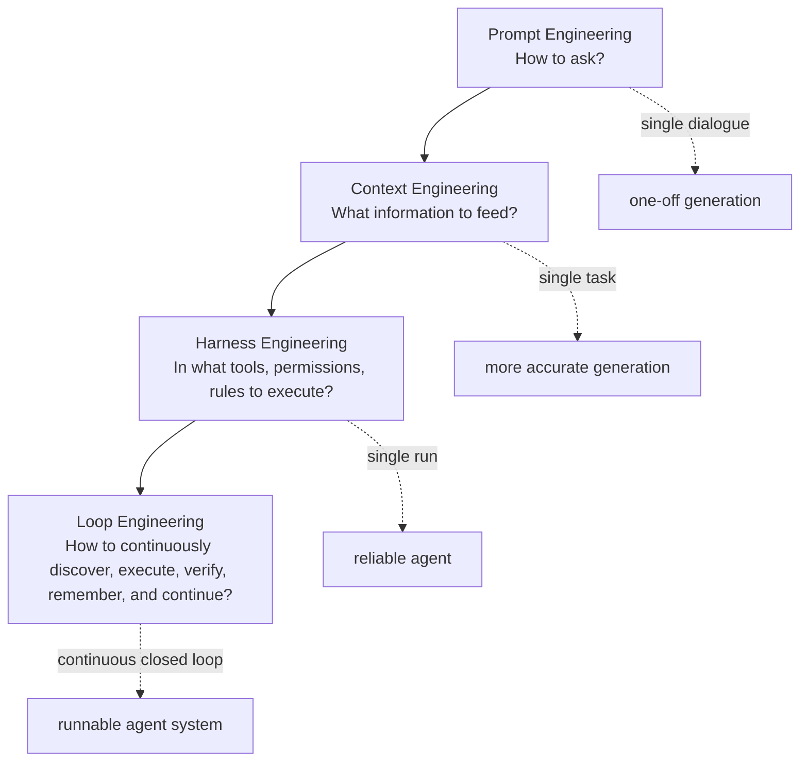
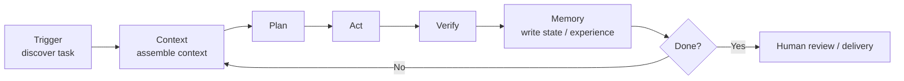
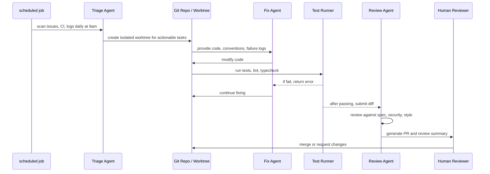
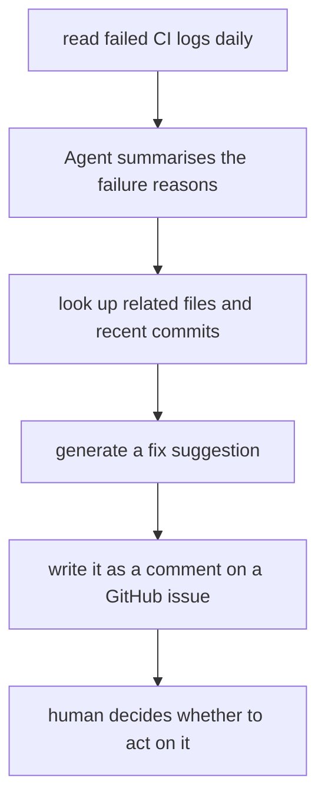
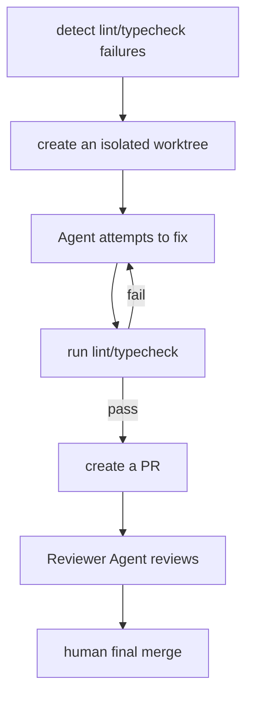

# Loop Engineering: In the Age of AI Agents, Engineers No Longer Write Prompts – They Design Loops

Over the past few years, the key terms in AI engineering have updated like version numbers: **Prompt Engineering**, **Context Engineering**, **Harness Engineering**. Now a new term has emerged: **Loop Engineering**.

It sounds like yet another AI buzzword. But behind it lies a real shift in how we work:
**You no longer prompt an AI round by round; instead, you design a closed‑loop system that can repeatedly discover tasks, execute them, verify results, record state, and decide what to do next.**

In *Loop Engineering*, published on June 7, 2026, Addy Osmani gives a very clear definition: Loop Engineering is not you personally prompting an agent – it is “replacing yourself as the person who prompts the agent”. You design a system that drives the agent; a loop can be thought of as a “recursive goal” – you define the goal and the AI keeps iterating until it’s done. At the same time, he reminds us that this is still early and we must be careful about token costs. ([Addy Osmani][1])

## Loop Engineering in One Sentence

**Prompt engineering** asks: How should I ask the AI?
**Context engineering** asks: What should the AI see?
**Harness engineering** asks: In what tools, permissions, sandboxes, and rules does the AI work?
**Loop engineering** asks: After the AI completes one step, how does the system automatically move to the next step?

In other words:

> A prompt is a one‑off instruction.
> Context is a one‑off assembly of information.
> A harness is a one‑off execution environment.
> A loop is a continuously running control system.

Before, you used AI like this:

```text
Me: Please fix this bug.
AI: There might be a problem here.
Me: Then go ahead and fix it.
AI: Done.
Me: The test failed. Here’s the error.
AI: I’ll fix it again.
Me: There’s also a lint issue.
AI: Fixing it again.
```

In Loop Engineering, you want the system to become:

```text
System discovers a bug
→ assigns it to an agent
→ agent modifies the code
→ tests and lint run automatically
→ if they fail, the error is fed back to the agent
→ agent fixes it again
→ once passes, a PR is created
→ a reviewer agent reviews it
→ state is recorded
→ proceed to the next task
```

This is “human loop” becoming “machine loop”.

---

## Why the Move from Prompt to Loop?

In the early days of AI programming, the core capability was in the model. You would ask: “Which model is smarter?”, “Which model writes React better?”, “Which model hallucinates less?”

Later, people realised that the model alone isn’t enough. Whether a coding agent can actually get work done depends on a whole set of things beyond the model: prompts, tools, context strategies, hooks, sandboxes, sub‑agents, logs, recovery paths, and so on. Addy summarised this in *Agent Harness Engineering* as: **coding agent = model + harness**; the harness is all the code, configuration, and execution logic outside the model – it gives the model state, tool execution, feedback loops, and enforceable constraints. ([Addy Osmani][2])

That is the place of Harness Engineering:
It is not about writing a prettier prompt; it is about putting the AI into a reliable workbench.

But the harness is not enough.

The harness solves: **During one agent run, how do we make it more reliable?**
The loop solves: **Between multiple agent runs, how does the system move forward by itself?**

Addy’s description of this relationship is direct: Loop Engineering sits one level above the harness; you build a small system that discovers work, dispatches it, checks the results, writes down what has been done, and then decides what to do next. ([Addy Osmani][1])

Think of it this way:



---

## What Does Loop Engineering Actually Engineer?

Don’t think of a loop as a magic prompt. What Loop Engineering really designs is a **control loop**.

A usable agent loop typically consists of six stages:



Each stage addresses a different problem.

**Trigger: Where do tasks come from?**
They may come from a GitHub issue, Linear ticket, CI failure, log alert, scheduled job, or even “every morning scan for bugs that appeared yesterday”.

**Context: What should the AI know in this round?**
This includes code, documentation, past decisions, test commands, team conventions, related issues, and the reason for the previous failure. Context engineering still matters here – it just changes from “human copying and pasting” to “system automatically assembling”.

**Plan: How to break down the task?**
Simple tasks can be executed directly; complex tasks need to be broken into subtasks, possibly handed to multiple sub‑agents.

**Act: What can the AI do?**
Read/write files, run commands, call a browser, query a database, access an API, create a PR, update a ticket. This depends on the tools, permissions, and sandbox provided by the harness.

**Verify: How do we know it did the right thing?**
Run tests, run lint, run type checking, compare screenshots, start a service for self‑testing, have another agent do a code review. A loop without verification is not automation – it is an automatic incident creator.

**Memory: How does the next round continue?**
State cannot be kept only in the model’s context. Addy especially emphasises that long‑running agents rely on external memory because the model forgets between runs; memory should be placed in external systems such as disk, Markdown files, issue systems, Linear boards, etc. ([Addy Osmani][1])

---

## The “Five‑Piece Set” of Loop Engineering + Memory

Addy decomposes a loop into “five pieces plus external memory”: Automations, Worktrees, Skills, Plugins/Connectors, Sub‑agents, and a place to persistently store state. ([Addy Osmani][1])

Only when these six things are connected does the system truly become runnable.

```svg
<svg width="900" height="420" viewBox="0 0 900 420" xmlns="http://www.w3.org/2000/svg">
  <defs>
    <style>
      .box { fill:#f7f7f7; stroke:#333; stroke-width:1.5; rx:14; }
      .core { fill:#fff4cc; stroke:#333; stroke-width:2; rx:18; }
      .txt { font-family: Arial, sans-serif; font-size:16px; fill:#111; }
      .small { font-family: Arial, sans-serif; font-size:13px; fill:#444; }
      .arrow { stroke:#333; stroke-width:1.6; marker-end:url(#arrow); fill:none; }
    </style>
    <marker id="arrow" markerWidth="10" markerHeight="10" refX="8" refY="3" orient="auto">
      <path d="M0,0 L0,6 L9,3 z" fill="#333" />
    </marker>
  </defs>

  <rect x="350" y="150" width="200" height="90" class="core"/>
  <text x="450" y="185" text-anchor="middle" class="txt">Loop Controller</text>
  <text x="450" y="210" text-anchor="middle" class="small">decides what to do next</text>

  <rect x="60" y="55" width="190" height="70" class="box"/>
  <text x="155" y="85" text-anchor="middle" class="txt">Automations</text>
  <text x="155" y="108" text-anchor="middle" class="small">scheduled discovery & dispatch</text>

  <rect x="355" y="35" width="190" height="70" class="box"/>
  <text x="450" y="65" text-anchor="middle" class="txt">Worktrees</text>
  <text x="450" y="88" text-anchor="middle" class="small">isolated parallel workspaces</text>

  <rect x="650" y="55" width="190" height="70" class="box"/>
  <text x="745" y="85" text-anchor="middle" class="txt">Skills</text>
  <text x="745" y="108" text-anchor="middle" class="small">encoded project knowledge</text>

  <rect x="60" y="295" width="190" height="70" class="box"/>
  <text x="155" y="325" text-anchor="middle" class="txt">Connectors</text>
  <text x="155" y="348" text-anchor="middle" class="small">connect to GitHub/Slack/DB</text>

  <rect x="355" y="315" width="190" height="70" class="box"/>
  <text x="450" y="345" text-anchor="middle" class="txt">Memory</text>
  <text x="450" y="368" text-anchor="middle" class="small">external state & progress</text>

  <rect x="650" y="295" width="190" height="70" class="box"/>
  <text x="745" y="325" text-anchor="middle" class="txt">Sub‑agents</text>
  <text x="745" y="348" text-anchor="middle" class="small">separate implementer & reviewer</text>

  <path d="M250,90 C310,105 335,140 360,160" class="arrow"/>
  <path d="M450,105 C450,125 450,135 450,150" class="arrow"/>
  <path d="M650,90 C590,105 565,140 540,160" class="arrow"/>
  <path d="M250,330 C310,305 335,260 365,225" class="arrow"/>
  <path d="M450,315 C450,285 450,260 450,240" class="arrow"/>
  <path d="M650,330 C590,305 565,260 535,225" class="arrow"/>
</svg>
```

### 1. Automations – Give the Loop a Heartbeat

Without automation, a loop is just a script you run manually.

Automation can be:

```text
Scan CI failures every day at 9 AM
Automatically review every PR after it is updated
Check online error logs every hour
Generate a priority list of open issues every night
```

The official Claude Code GitHub Actions documentation already productises this kind of capability: when `@claude` is mentioned in a PR or issue, Claude can analyse code, create PRs, implement features, fix bugs, and follow project standards; custom automation workflows can also be built using GitHub Actions. ([Claude Code][3])

### 2. Worktrees – Keep Multiple Agents from Stepping on Each Other’s Files

Once you let multiple agents work in parallel, the most common problem is not model intelligence – it is that they modify the same files.

The solution is to give each agent an isolated workspace, for example a Git worktree:

```text
agent-a → fix-login-bug branch
agent-b → refactor-payment branch
agent-c → update-docs branch
```

Each agent can then run tests independently, commit diffs, and finally have a human or a reviewer agent merge the results.

### 3. Skills – Turn Project Knowledge into Reusable Capabilities

Many failures are not because the model cannot write code, but because it does not know your project conventions:

```text
We use pnpm, not npm.
Do not touch the legacy/ directory.
All APIs must return Result<T>.
New endpoints must include a contract test.
Logging must use internal/logger.
```

These rules should not be repeated in every prompt. They should be distilled into skills, `AGENTS.md`, `CLAUDE.md`, or project specification files.

The introduction of OpenAI’s Codex also mentions that Codex can be guided by an `AGENTS.md` file in the repository, telling it how to navigate the codebase, run tests, and follow project practices; OpenAI also emphasises that agents perform better in a well‑configured development environment with reliable tests and clear documentation. ([OpenAI][4])

### 4. Connectors – Let the Loop Touch the Real World

A loop that only reads and writes local files is very limited. A truly useful loop needs to connect to real tools:

```text
GitHub / GitLab: read issues, create PRs
Linear / Jira: update task status
Slack / Feishu: send progress updates
Database: query online data
Monitoring system: read error logs
Browser: verify page behaviour
```

The key here is: **the AI does not just tell you “what I would do” – it actually acts inside your workflow.**

### 5. Sub‑agents – Separate the Code Writer from the Code Reviewer

A very important principle in Loop Engineering is:

> Do not let the agent that writes the code grade its own work.

Addy also emphasises in *Loop Engineering* that one of the most useful structural capabilities of sub‑agents is separating the proposer from the checker; because the model that writes code is often too friendly to its own output. A second agent, using different instructions or even a different model, can catch issues that the first agent rationalised away. ([Addy Osmani][1])

A common split is:

```text
Explorer Agent: reads code, finds root causes
Implementer Agent: makes the changes
Verifier Agent: reviews against spec, tests, and security requirements
```

This is more expensive than “one agent does everything end‑to‑end”, but it is much more reliable for high‑risk tasks.

### 6. Memory – The Backbone of the Loop

Without external state, a loop becomes a forgetful automaton.

State can be stored in:

```text
PROGRESS.md
TASKS.md
Linear ticket
GitHub issue comment
Database table
Vector store
Build log
PR review thread
```

The key is: **when the next round runs, the system must know what was done in the previous round, where it failed, and which tasks are still unfinished.**

---

## What Does a Real Loop Look Like?

Suppose you maintain a SaaS project and you want to automatically handle a portion of low‑risk bugs every day.

You could design a “daily bug‑fix loop”:



A corresponding pseudo‑configuration might look like this:

```yaml
name: daily-bug-fix-loop

trigger:
  schedule: "0 9 * * 1-5"
  sources:
    - github_issues(label: "bug")
    - ci_failures(branch: "main")
    - sentry_errors(severity: "medium")

context:
  include:
    - AGENTS.md
    - docs/architecture.md
    - recent_commits: 20
    - failing_logs
    - related_tests

agents:
  triage:
    role: "determine which bugs are suitable for automated handling"
  fixer:
    role: "fix bugs in an isolated worktree"
  reviewer:
    role: "strictly review the diff, no self‑review"

verification:
  commands:
    - pnpm test
    - pnpm lint
    - pnpm typecheck
  stop_condition:
    - all_tests_pass
    - reviewer_approved
    - no_security_blockers

memory:
  write_to:
    - .ai/loop-state.md
    - github_issue_comment
    - pull_request_summary

handoff:
  when:
    - test_failed_more_than_3_times
    - touches_auth_or_billing
    - reviewer_confidence_below: 0.8
```

This is not the standard format of any specific product; it is the *mindset* of Loop Engineering:
**Trigger, context, execution, verification, state, stop conditions, human handover.**

---

## What Is the Difference Between Loop Engineering and Ordinary Automation?

Some might say: “Isn’t this just cron jobs + scripts?”

Not exactly.

Ordinary automation is usually deterministic:

```text
Run a script every day at 9am
Input is fixed
Flow is fixed
Output is fixed
```

Loop Engineering involves an agent, so it is semi‑open:

```text
Tasks are discovered at 9am each day
Tasks may differ
Execution paths may differ
The agent adjusts its next steps based on observations
After a verification failure, it self‑corrects
If necessary, it hands over to a human
```

More precisely, Loop Engineering is:

> Automated workflow + Agent Harness + external state + verifiable stop conditions.

The most critical part is the “verifiable stop condition”.

A bad loop is:

```text
Keep fixing until you think it’s fixed.
```

A better loop is:

```text
Keep fixing until:
1. all tests in test/auth pass
2. pnpm lint has no errors
3. new boundary tests cover the token‑expiry scenario
4. the reviewer agent has no blocking comments
5. a PR is created, but not automatically merged
```

The essence of Loop Engineering is not “let the AI run forever” – it is **let the AI iterate autonomously within clear boundaries, and stop at a point that can be reviewed**.

---

## From Prompt to Loop: How the Engineer’s Job Changes

Before, engineers were like “AI operators”:

```text
write a prompt
copy an error
paste the error
ask for a fix
test again
paste again
fix again
```

Now, engineers are more like “system designers”:

```text
define the goal
design the verification
configure permissions
design state management
split agents
design failure handover
review final results
```

This is not about engineers disappearing – it is about the leverage point moving.

Addy also reminds us at the end of the article that a loop does not remove the human from the system. An unattended loop can also make mistakes unattended; engineers still need to confirm that the code works, still need to understand the system – otherwise, the smoother the loop, the easier it is to accumulate “understanding debt”. ([Addy Osmani][1])

I would summarise this shift in a table:

| Stage                 | What you primarily design       | Typical question                         | Artifact                    |
| --------------------- | ------------------------------- | ---------------------------------------- | --------------------------- |
| Prompt Engineering    | instruction                     | How do I ask the AI?                     | prompt template             |
| Context Engineering   | information architecture        | What should the AI see?                  | RAG, context packs, memory  |
| Harness Engineering   | execution environment           | How does the AI work safely & reliably?  | tools, sandbox, hooks, permissions |
| Loop Engineering      | control loop                    | After the AI finishes one step, how does it continue? | automated agent system |

---

## The Most Common Pitfalls in Loop Engineering

### 1. No stop condition

The most dangerous loop is “continue until done” without defining what “done” means.

The right approach is to write verifiable conditions:

```text
Wrong: Fix the login problem.
Correct: All auth‑related tests pass, new refresh‑token expiry test added, lint/typecheck passes, the PR diff does not touch the billing directory.
```

### 2. No budget limits

A loop can burn through tokens, run CI, create branches, and write logs wildly.

You need to set:

```text
Maximum number of iterations
Maximum token cost
Maximum runtime per run
Maximum concurrent agents
Number of failures before handing over to a human
```

The Claude Code GitHub Actions documentation also reminds us about cost and runaway jobs: running Claude Code on GitHub‑hosted runners consumes GitHub Actions minutes, and each interaction also consumes API tokens; the documentation recommends setting `--max-turns`, workflow timeouts, and concurrency limits to avoid excessive iteration. ([Claude Code][3])

### 3. Letting the agent review its own work

The agent that writes the code can often rationalise away its own errors.
At least for critical tasks, you should introduce an independent reviewer agent – possibly using a different model, different prompts, and read‑only permissions.

### 4. Storing memory only in the context window

The context window is not a database.
Long‑term state should live in external systems and be retrieved on demand each round.

### 5. Giving too many permissions from the start

Do not give the loop full permissions at the beginning.

A more reasonable permission layering is:

```text
read‑only scan → writable worktree → can open PR → human merges
```

High‑risk actions should be blocked or require approval:

```text
writing to production databases
deleting many files
force‑pushing to main
modifying permission systems
changing billing logic
sending external emails
```

### 6. Trying to loop‑ify every task

Not all tasks are suitable for a loop.

Tasks that are suitable for a loop usually have:

```text
Recurring occurrence
Stable input sources
Clear verification criteria
Rollback‑able on failure
Low to medium risk
```

Tasks that should not be loop‑ified from the start include:

```text
Product direction decisions
High‑risk security fixes
Major architectural migrations
Exploration of vague requirements
Refactoring legacy systems without test coverage
```

---

## A Simple Heuristic: Which Tasks Are Worth Looping?

Use this simple formula:

```text
Loop value = task frequency × clarity of verification × benefit of automation ÷ risk cost
```

A few examples:

| Scenario                      | Suitable for Loop? | Reason                                                       |
| ----------------------------- | ------------------ | ------------------------------------------------------------ |
| Summarising daily CI failures | Very suitable      | high frequency, low risk, easy to verify                     |
| Automatically fixing lint issues | Suitable         | clear rules, automatically testable                          |
| Automatically adding unit tests | Suitable         | reviewable, verifiable by coverage                           |
| Automatically fixing a P0 online incident | Proceed with caution | high risk, requires human takeover                           |
| Automatically refactoring core payment logic | Not suitable for direct looping | high risk, complex to verify                                 |
| Automatically generating a weekly report | Very suitable      | output is reviewable, low cost of failure                    |

---

## A Minimal Viable Loop: Start Here

Do not try to build a “fully automatic AI software factory” from day one. Start with a very small loop:



This loop does not write code; it only does analysis. The risk is low, yet it saves time immediately.

Take one step further:



This is a relatively safe engineering entry point.

---

## Loop Engineering Is Not “Abandon Prompts” – It Is Moving Prompts into the Background

One misunderstanding is that after Loop Engineering appears, Prompt Engineering becomes obsolete.

That is not true.

There are still prompts inside the loop; they are just no longer written impromptu by a human. Instead, they are automatically generated by the system based on the task, state, context, and rules.

Prompts become internal parts of the loop:

```text
The Trigger generates a task prompt.
The Context module adds background.
Skills inject project conventions.
The Verifier injects acceptance criteria.
Memory injects historical state.
The Loop Controller decides what the next prompt should be.

In other words, Loop Engineering does not replace Prompt Engineering – it productises, automates, and systematises it.
```

---

## Finally: The Essence of Loop Engineering – Turning “Iterative Conversation” into a Runnable System

In the Prompt era, the human was part of the loop.
In the Loop era, the human starts designing the loop itself.

The significance of this is not “will AI replace programmers?”, but rather how the programmer’s focus is shifting:

```text
Less: pestering the AI round by round
More: defining goals, boundaries, state, verification, and handover mechanisms
```

A truly mature Loop Engineering approach does not let the AI run wild without limits. It lets the AI make progress continuously **inside engineered guardrails**.

So Loop Engineering can be summarised in one sentence:

> **Do not treat your AI like an intern that you have to constantly remind. Place it inside a system that has a task source, tools, tests, memory, review, and stop conditions.**

This is the real meaning of moving from Prompt Engineering, Context Engineering, and Harness Engineering to Loop Engineering.

[1]: https://addyosmani.com/blog/loop-engineering/ "AddyOsmani.com - Loop Engineering"
[2]: https://addyosmani.com/blog/agent-harness-engineering/ "AddyOsmani.com - Agent Harness Engineering"
[3]: https://code.claude.com/docs/github-actions "Claude Code GitHub Actions - Claude Code Docs"
[4]: https://openai.com/index/introducing-codex/ "Introducing Codex | OpenAI"
