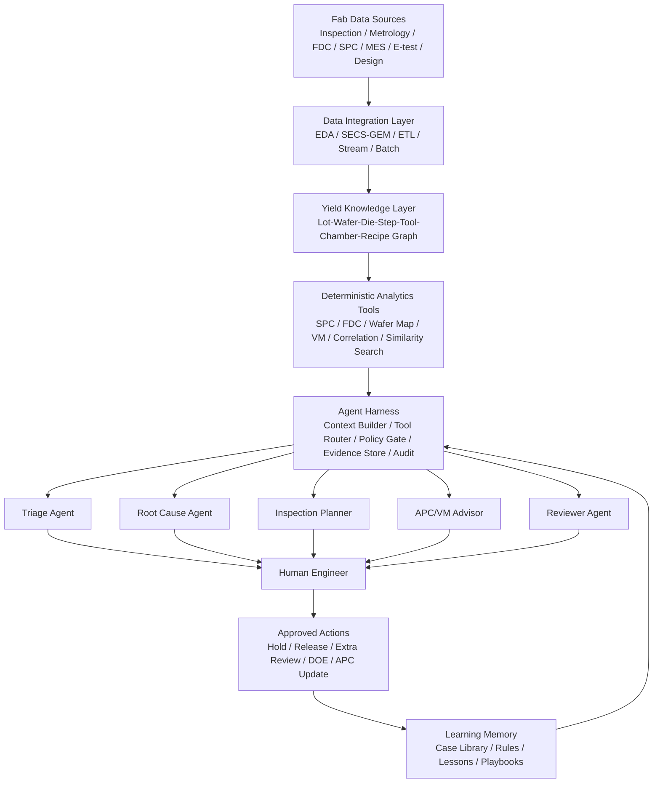
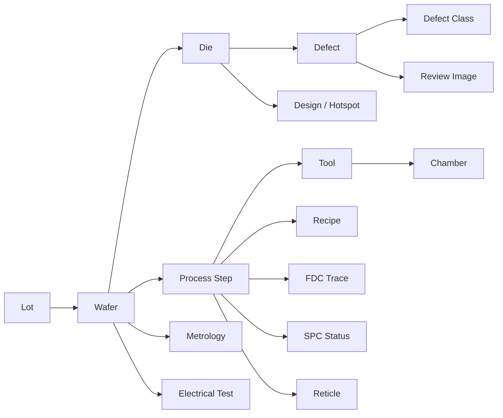
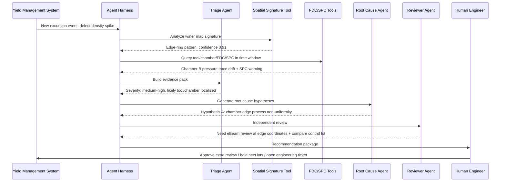
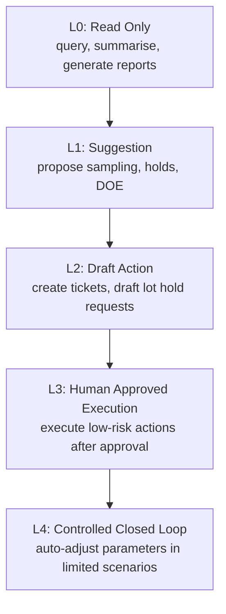
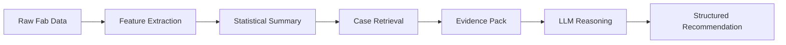
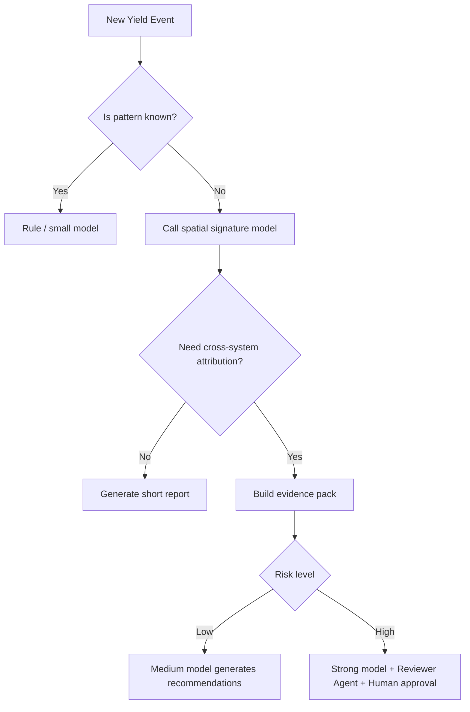
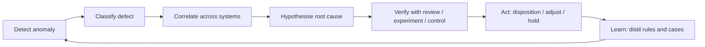
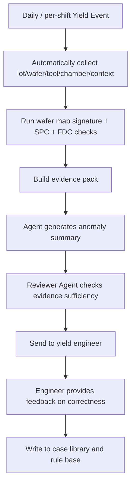

# Harness Engineering: Strapping the Agent into a Semiconductor Yield System, Not Letting It Roam Free in the Fab

Loop engineering sounds appealing: give an AI a goal and let it discover tasks, execute them, verify results, and continue to the next round.

But today, especially in a high‑capital, high‑risk, high‑constraint industry like semiconductors, the loop cannot be romanticised. Token costs, compute supply, model stability, data security, equipment permissions, and process responsibility boundaries – these real‑world constraints mean we cannot simply drop an agent into the fab as a “fully automatic yield engineer”.

A more pragmatic path is to talk about **Harness Engineering** first.

It is not about letting the model loop freely; it is about putting a set of engineered “tack” on the model:
What it can see, what tools it can invoke, what suggestions it can make, which actions must be blocked, which conclusions must be verified, and when it must hand over to a human.

Semiconductor yield detection and improvement happens to be an excellent scenario for understanding harness engineering.

Because what is most needed here is never “yet another chatty AI”, but an intelligent execution base that can organise **inspection equipment, metrology data, FDC, SPC, APC, MES, yield analysis, engineer experience, and anomaly handling workflows**.

---

## 1. The Bottom Line: For a Semiconductor Yield Agent, the Core Is Not the Model, but the Harness

Vivek Trivedy at LangChain proposed a very concise formula in *The Anatomy of an Agent Harness*:

> Agent = Model + Harness

His definition: the harness is all the code, configuration, and execution logic outside the model; a bare model is not an agent. Only when the harness gives it state, tool execution, feedback loops, and enforceable constraints does it become a truly working agent. The article explicitly lists system prompts, tools, MCP, file system, sandbox, browser, orchestration logic, hooks, and middleware as components of the harness. ([LangChain][1])

Addy Osmani further distilled this idea into an engineering habit: when an agent makes a mistake, do not just blame the model; turn the error into a rule, tool, check, sandbox, or feedback path inside the harness. He breaks the harness into prompts, tools, context policies, hooks, sandboxes, sub‑agents, feedback loops, recovery paths, observability, etc. ([Addy Osmani][2])

In the semiconductor yield context, this can be rewritten as:

> **Yield Agent = Model + Fab Harness.**
> The model handles reasoning, interpretation, and hypothesis generation; the harness handles data ingestion, tool execution, permission control, evidence organisation, process constraints, verification loops, and human‑agent handover.

A bare LLM is of almost no value to a fab.
It does not know the lot history, the chamber drift, the spatial signature of the previous wafer map, that a tool’s MFC was replaced yesterday, whether a reticle was just cleaned, or what a casual “suggest adjusting the recipe” means in a real factory.

Therefore, the first question for a semiconductor agent is not:

> Is this model smart enough?

But rather:

> How reliable, how restrained, and how auditable is the engineering system into which this model is placed?

That is harness engineering.

---

## 2. Why Is Semiconductor Yield Particularly Suited for Harness?

Semiconductor manufacturing is not ordinary manufacturing. Several of its characteristics make “pure chat‑based AI” almost impossible to deploy directly.

First, data is extremely multimodal. Yield‑related data is not just tables. It includes wafer maps, defect images, SEM/eBeam review images, optical inspection results, CD/overlay/thickness measurements, FDC sensor traces, recipes, equipment events, lot routes, process steps, reticles, masks, design layout hotspots, and WAT/CP/FT electrical test results.

Second, data is strongly contextual. A defect alone is not enough; you must know which layer it appeared on, after which process step, on which tool, which chamber, which recipe, which product, which die coordinates, and whether it resembles a past excursion.

Third, conclusions must be verifiable. Yield engineering is not about writing a “plausible‑sounding” explanation. It must answer: is this anomaly real? Is the defect a yield killer or a nuisance? Is it a tool issue, process drift, reticle contamination, layout sensitivity, or a sampling artefact?

Fourth, actions are very risky. Suggesting a lot hold, adding eBeam review, adjusting inspection sampling, changing an APC target, updating a recipe, pausing a chamber – none of these is like “click retry” in ordinary software. Each decision can affect WIP, cycle time, capacity, and customer delivery.

Fifth, the fab already has a vast infrastructure. A semiconductor fab is not a blank environment. It already has MES, EAP, SPC, FDC, YMS, APC, EDA/Interface A, SECS/GEM, and other systems. According to SEMI, standard equipment communication and automation suites include SECS/GEM, EDA / Interface A, RITdb, and SMT-ELS, which simplify equipment communication and extend integration; EDA / Interface A is designed to support equipment data acquisition for more complex data needs. ([semi.org][3])

In other words, a semiconductor yield agent is not about building an AI system from scratch.
It is more about adding a layer of **intelligent dispatch, evidence summarisation, anomaly attribution, decision support, and controlled execution** to the existing fab systems.


---

## 3. Yield Detection and Improvement: Not a Single‑Model Task, but an Evidence‑Chain Task

Many people interpret “AI + yield” as training a defect classifier. That direction is certainly important. KLA’s defect inspection and review systems cover chip manufacturing applications from process tool qualification, wafer qualification, and R&D to tool, process, and line monitoring; their systems combine photon, e‑beam, sensor technologies, and AI‑driven algorithms to find, identify, and classify particle and pattern defects on the wafer surface, backside, and edge. ([KLA][4])

Applied Materials’ product literature also explains that at advanced nodes, optical inspection increasingly struggles to distinguish true defects from process noise, leading to high false alarms or high nuisance rates; their SEMVision H20 uses e‑beam technology and deep‑learning AI to automatically extract critical defects from nuisance defects and noise. ([Applied Materials][5])

But yield improvement is more than “better detection”. The real difficulty is:

```text
an anomaly is detected
→ is it significant?
→ identify the spatial pattern
→ correlate with upstream processes
→ find the most likely root cause
→ decide whether to hold / rework / add metrology
→ design a verification experiment
→ update control strategies
→ distil into rules and knowledge
```

This is not a single‑point model; it is a system engineering problem.

Therefore, the core task of a semiconductor yield agent is not “replace a classifier”, but **automatically organise a yield evidence chain**:

```text
What is the defect phenomenon?
Which lot / wafer / die / layer / step?
What does the spatial signature look like?
Has a similar pattern occurred historically?
Is the related tool/chamber/recipe drifting?
Are the FDC traces abnormal?
Is SPC out of control or approaching control limits?
Is it related to reticle, layout, or product mix?
Do we need more review samples?
What action is recommended?
What is the evidence, risk, and confidence for the recommended action?
Who must approve it?
```

This is exactly where the harness comes in.

---

## 4. Overall Architecture of a Fab Harness: Keeping the Agent Inside an “Engineering Cage”

A semiconductor yield agent should not be given direct database access and allowed to roam freely. A more sensible approach is to place it inside a layered harness.



The key in this diagram is not the number of agents, but that **the agents are wrapped by the harness**.

The harness should provide at least seven capabilities:

```text
1. Data ingestion: fetch data from equipment, systems, data lakes
2. Context assembly: compress relevant data into an evidence pack
3. Tool invocation: let the model call deterministic analysis tools instead of guessing
4. Permission control: which actions are read‑only, which require approval
5. Result verification: every conclusion must pass rules, statistics, physics, and engineering review
6. Observability: log every analysis, tool call, cost, latency, and evidence source
7. Knowledge retention: write failures, misjudgements, and engineering rules back into the knowledge base
```

Without these, the so‑called yield agent is just a chatbot that speaks semiconductor jargon.

---

## 5. Data Layer: Not a RAG Document Store, but a Yield Knowledge Graph

Many AI projects start by saying “we put documents into a vector store and then do Q&A”. That is far from sufficient for yield engineering.

The basic unit of yield analysis is not a document; it is a relationship.

A defect event must be linked to at least:

```text
product_id
technology_node
lot_id
wafer_id
die_x / die_y
layer
process_step
tool_id
chamber_id
recipe_id
reticle_id
operator_shift
material_batch
inspection_tool
inspection_recipe
defect_class
defect_coordinates
review_result
metrology_result
FDC_trace_id
SPC_rule_status
electrical_test_result
```

If these keys are not connected, the agent can only do superficial summarisation.

A more appropriate construct is a **Yield Knowledge Graph**:



This graph is not for show; it enables the agent to ask truly meaningful questions:

```text
Has the same chamber exhibited a similar spatial signature in the last 72 hours?
Does the same reticle show defects on different tools?
Does the same product’s layout hotspot repeatedly fail?
Which FDC sensor channels drifted before and after the anomalous wafers?
Do the electrical fail bins align with the inline defect spatial pattern?
```

SEMI E164 aims to promote consistency in equipment metadata representation and conventions; it is based on SEMI E125 (equipment self‑description) and covers common definitions for equipment metadata, as well as the representation of metadata for common communication standards in 300mm fabs. ([semi.org][6])
Such standardised metadata is critical for a yield agent, because the agent needs not just to read “numbers”, but to understand that those numbers come from a specific equipment object, chamber, module, event, and time window.

---

## 6. Tool Layer: Let the Model “Call Yield Tools”, Not “Act as a Yield Tool”

A key principle of harness engineering is:

> If a deterministic tool can solve a problem, do not let the LLM guess.

The tools for a semiconductor yield agent should be strongly typed, auditable, and reproducible.
Do not give the model a universal SQL permission and let it query freely. Instead, give it a set of wrapped tools.

For example:

```yaml
tools:
  get_lot_history:
    input: { lot_id: string }
    output: { route: list, tools: list, chambers: list, timestamps: list }

  get_wafer_map_signature:
    input: { wafer_id: string, layer: string }
    output: { signature_type: string, confidence: number, features: object }

  compare_to_historical_excursions:
    input: { signature_vector: array, product_id: string, layer: string }
    output: { similar_cases: list, similarity_score: number }

  query_fdc_anomaly:
    input: { tool_id: string, chamber_id: string, time_window: string }
    output: { abnormal_channels: list, rule_violations: list }

  run_spc_rule_check:
    input: { metric: string, entity: string, time_window: string }
    output: { western_electric_rules: list, control_status: string }

  estimate_yield_impact:
    input: { defect_class: string, density: number, spatial_pattern: string }
    output: { estimated_impact: number, uncertainty: number }

  propose_review_sampling:
    input: { defect_map: string, budget: int, suspected_classes: list }
    output: { review_points: list, rationale: string }

  generate_engineering_report:
    input: { evidence_pack_id: string }
    output: { summary: string, recommendations: list, risks: list }
```

The output of such tools must include:

```text
data time window
data version
algorithm version
query conditions
sample size
confidence intervals
description of missing data
method for handling outliers
evidence links
```

Otherwise, the agent’s conclusions cannot be audited.

Applied Materials’ Enlight 3 literature notes that its optical inspection system combines high resolution, AI algorithms, and big data to capture more data per scan; ExtractAI uses the big data from Enlight 3 to create a classified, noise‑free map for inline monitoring, and establishes a real‑time intelligent connection between brightfield optical wafer inspection and eBeam review. ([Applied Materials][7])
This shows that in a real yield system, the value of AI is often not a single “generate answer” point, but connecting different inspection and review tools to produce actionable data products.

The agent harness should do the same:
The LLM does not replace inspection equipment, SPC, FDC, VM, or APC; it dispatches them, interprets them, and composes them.

---

## 7. Agent Role Design: Do Not Build a Single Almighty Yield Sage

Semiconductor yield problems are too complex to be handled by one “omnipotent agent”. The harness is better suited to splitting the work into multiple roles that check and balance each other.

### 1. Triage Agent

Responsible for answering:

```text
Is this a known pattern or an unknown pattern?
Is the impact a single wafer, a single lot, a single tool, a single chamber, or cross‑product?
Does it require immediate escalation?
Should a lot hold be recommended?
```

It should be read‑only and have no production action privileges.

### 2. Spatial Signature Agent

Responsible for analysing wafer maps:

```text
center
edge ring
scratch
cluster
radial
donut
reticle field repeat
stepper/scanner signature
random particles
systematic layout hotspot
```

It can call traditional image algorithms, CNNs, pattern matching, and historical case similarity tools, but its final output must include visual evidence.

### 3. Tool/Chamber Drift Agent

Responsible for linking defects to tools, chambers, sensor traces, and PM history.

Its question is not “does this wafer have a defect?” but:

```text
Has this chamber started drifting recently?
Are other chambers on the same tool normal?
Did the distribution change before and after PM?
Which FDC sensor channels contribute the most?
```

### 4. Reticle/Layout Agent

Responsible for checking:

```text
Does the pattern repeat at the same reticle field?
Does it coincide with a layout hotspot?
Does it appear only in areas with a certain pattern density?
Is it related to an OPC / litho hotspot?
```

### 5. VM/APC Advisor

Virtual metrology (VM) and APC are already important directions in semiconductor manufacturing. Siemens‑related work mentions that traditional VM uses FDC data from process chambers to predict metrology results, reducing metrology cost and processing time; in high‑product‑mix manufacturing, combining design features and FDC data into ML‑based VM and then feeding into APC / R2R control can improve process control. In a simulation case, using extended VM in R2R control improved Cpk from 0.86 to 1.30.

But caution is needed here:
An agent can propose APC suggestions, but that does not mean it should directly modify APC targets or production recipes.

### 6. Reviewer Agent

Responsible for challenging all the other agents:

```text
Is the evidence sufficient?
Is correlation mistaken for causation?
Is any data missing?
Is more review sampling needed?
Does the recommendation touch high‑risk process areas?
Is the proposed action excessive?
```

In high‑risk scenarios, the reviewer agent should use different prompts, different tool permissions, and possibly even a different model.
The one who writes the recommendation should not approve it themselves.

---

## 8. A Typical Scenario: From Wafer Map Anomaly to Engineering Disposition Recommendation

Suppose an advanced logic product shows an edge‑ring defect pattern after etch, with a significant increase in defect density.

A traditional workflow might be:

```text
Yield engineer looks at the map
→ pulls lot history
→ checks tool/chamber
→ checks FDC
→ checks metrology
→ searches for historical cases
→ talks to equipment engineer
→ decides whether to hold subsequent lots
→ schedules eBeam review
→ meets to discuss root cause
```

After harnessing, the agent does not “conclude” directly, but automatically organises the evidence chain.



The final report should not look like:

```text
The AI believes the issue may come from Chamber B.
```

It should look like:

```text
Conclusion: Recommend escalating this event as a chamber‑localised excursion, and suspending release of subsequent lots from Chamber B pending additional review.

Evidence:
1. Wafer map spatial signature is edge‑ring with confidence 0.91.
2. Anomaly concentrates after Etch Step E-143.
3. 3 of the last 4 lots processed by Chamber B in the past 24 hours show a similar pattern.
4. Control lots from Chambers A, C, and D do not show the same pattern.
5. FDC pressure channel P-17 drifted before and after the anomalous lots.
6. SPC is not yet out of control but has triggered an early‑warning rule.
7. Historical similar case #2025-ETCH-017 had root cause: edge gas flow drift.

Recommendations:
- Add eBeam review sampling for the current lot.
- Temporarily hold subsequent lots from Chamber B.
- Equipment engineer to check edge gas flow / chuck temperature / chamber clean status.
- Do not adjust the recipe directly until review results are confirmed.

Risks:
- A reticle/layout‑related systematic defect cannot yet be ruled out.
- Need a control sample of the same product and layer from a different chamber.
```

This is what a yield agent should output.

---

## 9. The “Safety Boundary” of the Harness: A Semiconductor Agent Must Be Read‑Only by Default

In a fab, permission design is more important than model capability.

A recommended permission layering is:



In most fabs, a reasonable starting point for a yield agent is L0 to L2.

That means:

```text
Can query data
Can generate evidence packs
Can propose hypotheses
Can draft engineering disposition recommendations
Can create review requests
Can generate DOE plans
But cannot directly modify recipes
Cannot release high‑risk lots
Cannot bypass process owners
Cannot issue control commands to production tools
```

More concretely, the harness should have a policy gate:

```yaml
policy:
  default_mode: read_only

  allowed_without_approval:
    - query_yield_data
    - query_lot_history
    - run_spc_analysis
    - run_wafer_map_signature
    - generate_report
    - draft_ticket

  requires_engineer_approval:
    - request_extra_ebeam_review
    - recommend_lot_hold
    - create_doe_plan
    - change_sampling_plan

  forbidden_for_agent:
    - modify_production_recipe
    - change_apc_target
    - release_held_lot
    - disable_spc_rule
    - write_to_equipment_controller
    - delete_or_overwrite_raw_data
```

The core of harness engineering is not “let the agent do more”, but **let the agent do more reliable things within the right boundaries**.

---

## 10. How to Do Context Engineering in a Fab Harness?

Semiconductor data volumes are huge; you cannot stuff all of it into the model’s context.
Token costs, compute constraints, and limited context windows are real – but they also force better architecture.

The context in a fab harness should not be “dump the data lake to the LLM”.
It should be an **Evidence Pack Builder**.



What should be inside the evidence pack?

```yaml
evidence_pack:
  event:
    type: defect_excursion
    product: P1234
    layer: M2_Etch
    lot: L2026A017
    wafers: [W03, W07, W11]

  observations:
    wafer_map_signature: edge_ring
    defect_density_delta: "+3.2 sigma vs baseline"
    affected_area: outer_5mm
    known_defect_classes: [particle, residue]

  context:
    tool: ETCH_12
    chamber: B
    recipe: R_M2_ETCH_08
    previous_pm: "36 hours ago"
    reticle: R9981
    inspection_recipe: INS_M2_07

  analytics:
    spc_status: warning_not_ooc
    fdc_anomalies:
      - channel: pressure_P17
        deviation: "+2.1 sigma"
      - channel: edge_gas_flow
        deviation: "-1.8 sigma"
    similar_cases:
      - case_id: 2025_ETCH_017
        similarity: 0.87
        confirmed_root_cause: edge_gas_flow_drift

  missing_data:
    - eBeam review pending
    - no control sample from Chamber C in same shift

  constraints:
    - do_not_recommend_recipe_change_without_process_owner
    - prefer_extra_review_before_hold_if_wip_risk_high
```

This evidence pack is what the LLM should see.

The LLM does not need to look at millions of rows of sensor traces.
It needs a data summary that has been computed, statistically compressed, structured, and referenced with evidence.

This is the intersection of harness engineering and context engineering.

---

## 11. Verification Layer: Passing Every Agent Conclusion Through “Five Gates”

The most dangerous thing for a semiconductor yield agent is not “not knowing”, but “appearing to know”.

Therefore, the harness must include a verification layer.

### Gate 1: Statistical Significance

```text
Is it above baseline?
Have we considered product / layer / tool groups?
Is there a multiple‑comparison problem?
Is it just sampling bias?
```

### Gate 2: Spatial Consistency

```text
Is the wafer map signature stable across multiple wafers?
Does it repeat at reticle field boundaries?
Does it align with die‑level electrical fails?
```

### Gate 3: Temporal Causality

```text
Did the anomaly occur after the suspected process step?
Was the suspect tool/chamber already drifting before the anomaly?
Is the PM / recipe / material change aligned in time?
```

### Gate 4: Engineering Physics Constraints

```text
Is the hypothesis consistent with equipment physics?
Could that chamber parameter really produce this spatial pattern?
Could that defect class be introduced by that step?
```

### Gate 5: Human Approval

```text
Does the process owner need to be involved?
Does the equipment engineer need to be involved?
Does the integration engineer need to be involved?
Does this affect customer lots?
Does it affect the production schedule?
```

The verification layer can be encoded as fixed rules in the harness:

```yaml
verification:
  root_cause_claim:
    required_evidence:
      - temporal_alignment
      - spatial_signature_match
      - tool_or_chamber_correlation
      - historical_case_or_physical_mechanism
    forbidden:
      - correlation_only_without_control_group
      - recommendation_without_missing_data_section

  production_action:
    required_approval:
      - yield_engineer
      - process_owner
    require_risk_assessment: true
```

This is exactly the idea of harness engineering:
mistakes the model is prone to make are not handled by “reminding it to be careful next time”, but by encoding them as system rules.

---

## 12. Cost Layer: When Tokens Are Expensive, the Harness Must Learn to “Let the Model Think Less”

A problem with many agent architectures is that they treat the LLM as the default entry point for everything.

A semiconductor yield system should not be designed that way.

In a fab harness, we should follow:

```text
If it can be pre‑computed offline, do not compute it online.
If a traditional algorithm works, do not use an LLM.
If a small model works, do not use a large model.
If a structured summary can be returned, do not return raw data.
If a tool can verify it, do not let the model self‑validate.
If it can be cached, do not analyse it again.
```

A cost‑friendly model routing strategy could be:



Large models should be used for:

```text
Cross‑system evidence summarisation
Root cause hypothesis generation
Explaining contradictory evidence
DOE idea generation
Engineering report writing
Expert knowledge dispatch
Anomaly case post‑mortems
```

They should **not** be used for:

```text
Simple SQL queries
SPC rule decisions
Basic wafer map feature extraction
FDC anomaly detection
Formatting repetitive reports
Known case classification
```

This is why, in the era of high costs, harness is more practical than loop.
The loop pursues “continuous automatic iteration”, while the harness first pursues “every model call is worthwhile”.

---

## 13. From Detection to Improvement: What the Agent Should Really Drive Is Yield Learning

The key to yield improvement is not finding a defect once, but shortening the yield learning cycle.

KLA’s software solutions page states that its semiconductor software centralises and analyses inspection, metrology, and process systems data, supporting runtime process control, defect excursion identification, wafer and reticle dispositioning, scanner and process corrections, defect classification, and other applications. Using AI modelling, visualisation, and data analysis, it helps manufacturers accelerate yield learning and reduce production risk. ([KLA][8])

This statement is critical:
Yield improvement is not about “detecting once”, but about “learning rate”.

The agent harness should be designed around yield learning:

```text
Detect excursions faster
Bound the impact faster
Identify root causes faster
Decide whether to hold or release faster
Design verification experiments faster
Distil experiences into rules faster
Feed rules back into inspection, sampling, SPC, FDC, and APC faster
```

The yield improvement process can be seen as a learning flywheel:



Notice this is not an unattended loop.
It is a learning flywheel where the harness controls the boundaries and humans approve high‑risk actions.

---

## 14. A Conceptual SVG of a Fab Harness

The following diagram can serve as a blog illustration: the model is in the centre, but what truly determines its deployability is the outer harness.

```svg
<svg width="960" height="560" viewBox="0 0 960 560" xmlns="http://www.w3.org/2000/svg">
  <defs>
    <style>
      .title { font-family: Arial, sans-serif; font-size: 24px; font-weight: 700; fill: #111; }
      .label { font-family: Arial, sans-serif; font-size: 16px; fill: #111; }
      .small { font-family: Arial, sans-serif; font-size: 13px; fill: #444; }
      .core { fill: #fff4cc; stroke: #222; stroke-width: 2; rx: 18; }
      .ring { fill: #f7f7f7; stroke: #333; stroke-width: 1.5; rx: 14; }
      .data { fill: #e8f1ff; stroke: #333; stroke-width: 1.5; rx: 14; }
      .policy { fill: #ffecec; stroke: #333; stroke-width: 1.5; rx: 14; }
      .verify { fill: #ecfff2; stroke: #333; stroke-width: 1.5; rx: 14; }
      .arrow { stroke: #333; stroke-width: 1.5; fill: none; marker-end: url(#arrow); }
    </style>
    <marker id="arrow" markerWidth="10" markerHeight="10" refX="8" refY="3" orient="auto">
      <path d="M0,0 L0,6 L9,3 z" fill="#333" />
    </marker>
  </defs>

  <text x="480" y="45" text-anchor="middle" class="title">Fab Agent Harness for Yield Detection & Improvement</text>

  <rect x="380" y="220" width="200" height="100" class="core"/>
  <text x="480" y="258" text-anchor="middle" class="label">LLM / VLM</text>
  <text x="480" y="282" text-anchor="middle" class="small">reasoning, interpretation, hypothesis generation</text>

  <rect x="70" y="95" width="210" height="80" class="data"/>
  <text x="175" y="128" text-anchor="middle" class="label">Data Connectors</text>
  <text x="175" y="152" text-anchor="middle" class="small">Inspection / Metrology / FDC / MES</text>

  <rect x="375" y="90" width="210" height="80" class="ring"/>
  <text x="480" y="123" text-anchor="middle" class="label">Context Builder</text>
  <text x="480" y="147" text-anchor="middle" class="small">Evidence Pack, not raw dump</text>

  <rect x="680" y="95" width="210" height="80" class="ring"/>
  <text x="785" y="128" text-anchor="middle" class="label">Tool Router</text>
  <text x="785" y="152" text-anchor="middle" class="small">SPC / FDC / VM / Similarity</text>

  <rect x="70" y="245" width="210" height="80" class="policy"/>
  <text x="175" y="278" text-anchor="middle" class="label">Policy Gate</text>
  <text x="175" y="302" text-anchor="middle" class="small">Read-only, approval, forbidden actions</text>

  <rect x="680" y="245" width="210" height="80" class="verify"/>
  <text x="785" y="278" text-anchor="middle" class="label">Verification Layer</text>
  <text x="785" y="302" text-anchor="middle" class="small">Stats, physics, reviewer agent</text>

  <rect x="195" y="390" width="230" height="80" class="ring"/>
  <text x="310" y="423" text-anchor="middle" class="label">Evidence Store</text>
  <text x="310" y="447" text-anchor="middle" class="small">Audit trail, cases, decisions</text>

  <rect x="535" y="390" width="230" height="80" class="ring"/>
  <text x="650" y="423" text-anchor="middle" class="label">Human Handoff</text>
  <text x="650" y="447" text-anchor="middle" class="small">Yield / Process / Equipment owners</text>

  <path d="M280,135 C330,150 355,190 390,225" class="arrow"/>
  <path d="M480,170 L480,220" class="arrow"/>
  <path d="M680,135 C630,150 605,190 570,225" class="arrow"/>
  <path d="M280,285 C325,285 345,270 380,270" class="arrow"/>
  <path d="M580,270 C620,270 640,285 680,285" class="arrow"/>
  <path d="M430,320 C390,345 345,365 315,390" class="arrow"/>
  <path d="M530,320 C570,345 615,365 645,390" class="arrow"/>
</svg>
```

---

## 15. A Pragmatic Roadmap: Start with a “Reporting Assistant”, Not “Auto‑Tuning”

The maturity of a semiconductor yield agent can be divided into five levels.

| Level | Capability                                                                                | Risk   | Recommendation      |
| ----- | ----------------------------------------------------------------------------------------- | ------ | ------------------- |
| L0    | Query data, generate daily yield reports, summarise excursions                            | Low    | Do immediately      |
| L1    | Automatically triage anomalies, generate evidence packs                                   | Low‑medium | Highly suitable     |
| L2    | Propose root cause hypotheses and review sampling recommendations                         | Medium | Suitable            |
| L3    | Draft hold / sampling / DOE tickets, human approves                                      | Medium‑high | Proceed cautiously |
| L4    | Recommend APC / R2R adjustments in limited scenarios                                     | High   | Must have strong approval |
| L5    | Unattended automatic parameter tuning                                                    | Very high | Not recommended as an early goal |

The best first step is not “AI automatically improves yield”, but:

```text
Automate the repetitive work engineers do every day: anomaly triage, cross‑system data retrieval, pattern matching, and report writing.
```

A minimal viable system can be designed as:



This system has no dangerous actions, yet it already delivers value:

```text
Reduces time spent retrieving data
Reduces missed anomalies
Standardises report formats
Helps new engineers understand anomalies faster
Makes historical cases reusable
Turns experience into harness rules
```

---

## 16. Evaluation Metrics: Do Not Look Only at Model Accuracy; Look at Yield Engineering Efficiency

Whether a fab harness is successful should not be judged solely by “how expert the model’s answers sound”.

More important engineering metrics:

```text
MTTD: mean time to detect an excursion
MTTRC: mean time to a root‑cause candidate
Time to converge on impact scope
eBeam review sample utilisation rate
Nuisance defect filter rate
False alarm reduction rate
Engineer time saved on data retrieval
Yield learning cycle time reduction
Recurrence rate of similar anomalies
Adoption rate of recommended actions
False positive rate of recommendations
Token / compute cost per confirmed root cause
```

The most important metric is not “model answer accuracy”, but:

> Does it enable the yield engineering team to complete yield learning faster, more reliably, and with fewer misses?

---

## 17. Anti‑Patterns: The Six Most Common Mistakes in Semiconductor Agents

### 1. Making the Agent a Data Lake Chatbot

User asks: “Why is this lot’s yield low?”
The AI retrieves a few documents from the data lake and fabricates an answer.

This is the most dangerous prototype.
Yield analysis needs a structured evidence chain, not document Q&A.

### 2. Treating Wafer Maps as Ordinary Images Rather Than Process Signals

A wafer map is not an ordinary image.
It has die coordinates, reticle field, edge exclusion, process layer, inspection recipe, sampling policy, defect class, and historical baseline.
Without this context, even a strong vision model is prone to misjudgement.

### 3. Doing Only Correlation, Not Engineering Validation

“Chamber B correlates with the anomaly” does not equal “Chamber B is the root cause”.
Temporal order, control groups, physical mechanism, historical cases, or additional experiments are required.

### 4. Giving the Agent Too Much Permission from the Start

Letting the agent create holds, release lots, or modify recipes from day one is a classic over‑automation mistake.
The initial principle for a fab harness should be read‑only first.

### 5. No Reviewer

The agent that proposes a hypothesis cannot verify itself.
At a minimum, there should be an independent reviewer agent; for high‑risk events, a human process owner must be included.

### 6. Not Writing Failures Back into the Harness

If an agent once mistook a sampling artefact for an excursion, the next time the harness should include a rule:

```text
When the inspection sample size is below a threshold, prohibit outputting a high‑confidence root cause.
```

This is the “ratchet effect” of harness engineering: every failure makes the system more reliable.

---

## 18. The Real Philosophy of Such a System: The Agent Is Not the Brain, but the “Evidence Dispatcher”

The core of semiconductor yield engineering is not “AI calls the shots”.

A better positioning is:

```text
The agent is not the process owner.
The agent is not the equipment engineer.
The agent is not the yield manager.
The agent is not the APC controller.

The agent is an evidence dispatcher, anomaly triage clerk, knowledge retriever, report generator, hypothesis proposer, and review assistant.
```

Its value is to free engineers from repetitive work:

```text
Less time hunting across systems
Less time stitching Excel sheets
Less time searching historical cases
Less time writing weekly reports
Fewer missed correlations (chamber, reticle, layout, FDC)
More time for mechanism judgment, experiment design, and final decisions
```

This is more suitable for the current stage than a “fully automatic loop”.

The loop is a distant automation vision.
The harness is an engineering foundation we can start building today.

---

## Closing: The Future of the Semiconductor Yield Agent Is Not Better Conversation, but Better Boundaries

What semiconductor manufacturing least needs is an over‑confident, non‑auditable, non‑reproducible, non‑accountable AI.

What it needs is a new kind of engineering structure:

```text
The model is for reasoning.
Tools are for computation.
Data is for evidence.
Rules are for boundaries.
The reviewer is for challenge.
Humans are for approval.
The harness is for organising all of this.
```

That is harness engineering in the semiconductor yield context.

It is not as radical as loop engineering, nor as lightweight as prompt engineering.
It is heavier, slower, more engineering‑oriented – and much closer to what a real fab needs.

Because in a fab, the real question has never been “can the AI answer?”
The real question is:

> **Can every statement made by the AI be traced back to data, verified by tools, constrained by rules, reviewed by experts, and executed safely by the organisation?**

When we can answer that question, the semiconductor yield agent will truly move from demo to production.

[1]: https://www.langchain.com/blog/the-anatomy-of-an-agent-harness "The Anatomy of an Agent Harness"
[2]: https://addyosmani.com/blog/agent-harness-engineering/ "AddyOsmani.com - Agent Harness Engineering"
[3]: https://www.semi.org/en/products-services/download-standards "Purchase and Download SEMI Standards Documents | SEMI"
[4]: https://www.kla.com/products/chip-manufacturing/defect-inspection-review "Defect Inspection & Review | Chip Manufacturing | KLA"
[5]: https://www.appliedmaterials.com/us/en/product-library/semvision-h20-defect-analysis.html "SEMVision H20 Defect Analysis "
[6]: https://store-us.semi.org/products/e16400-semi-e164-specification-for-eda-common-metadata "E16400 - SEMI E164 - Specification for EDA Common Metadata"
[7]: https://www.appliedmaterials.com/us/en/product-library/enlight-3-optical-inspection.html "Enlight 3 Optical Inspection"
[8]: https://www.kla.com/products/software-solutions/semiconductor "Semiconductor Software Solutions | KLA"
