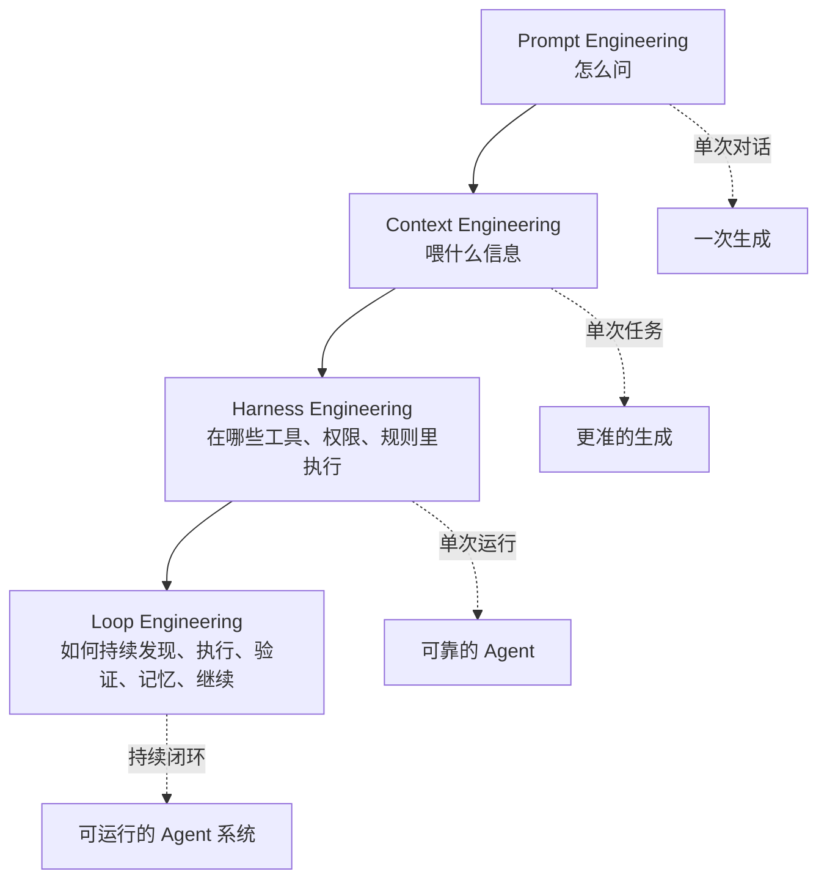
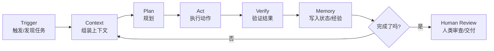
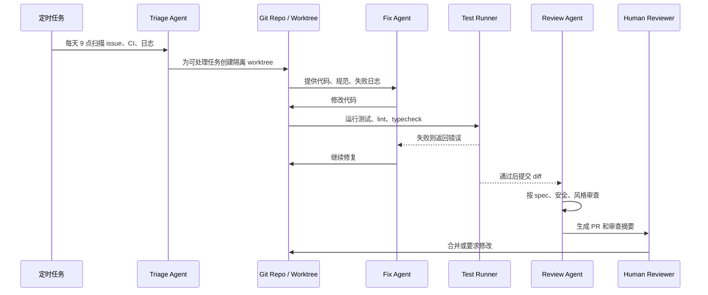
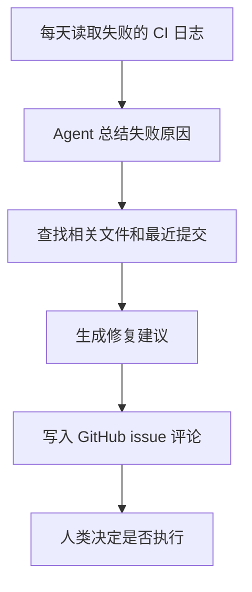
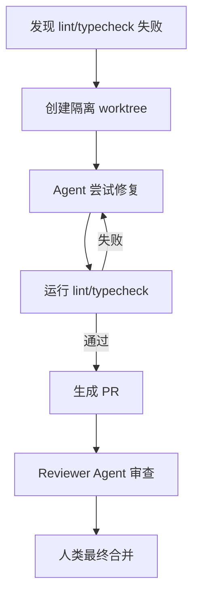

# Loop 工程：AI Agent 时代，工程师不再写 Prompt，而是在设计循环

过去几年，AI 工程的关键词像版本号一样更新：**Prompt Engineering**、**Context Engineering**、**Harness Engineering**，现在又冒出一个新词：**Loop Engineering，循环工程**。

听起来像又一个 AI 圈造词。但这次它背后确实有一个正在发生的工作方式变化：
**你不再一轮一轮地 prompt AI，而是设计一个能反复发现任务、执行任务、验证结果、记录状态、决定下一步的闭环系统。**

Addy Osmani 在 2026 年 6 月 7 日发布的《Loop Engineering》中给了一个很清楚的定义：Loop Engineering 不是你亲自去 prompt agent，而是“替代你自己成为那个 prompt agent 的人”，你设计的是一个系统，让这个系统去驱动 agent；一个 loop 可以被理解成“递归目标”，你定义目标，AI 持续迭代直到完成。与此同时，他也提醒这仍然很早期，并且必须小心 token 成本。([Addy Osmani][1])

## 一句话解释 Loop 工程

**Prompt 工程关心：我该怎么问 AI？**
**Context 工程关心：AI 应该看到什么？**
**Harness 工程关心：AI 在什么工具、权限、沙箱和规则里工作？**
**Loop 工程关心：AI 做完一步之后，系统如何自动进入下一步？**

换句话说：

> Prompt 是一次指令。
> Context 是一次上下文装配。
> Harness 是一次执行环境。
> Loop 是一个持续运行的控制系统。

以前你这样使用 AI：

```text
我：请帮我修这个 bug
AI：这里可能有问题
我：那你改一下
AI：改好了
我：测试失败了，错误如下
AI：再改一下
我：还有 lint 问题
AI：再修一下
```

在 Loop 工程里，你希望系统变成这样：

```text
系统发现 bug
→ 分配给 agent
→ agent 修改代码
→ 自动跑测试和 lint
→ 失败则把错误反馈给 agent
→ agent 再修
→ 通过后生成 PR
→ reviewer agent 审查
→ 记录状态
→ 继续处理下一个任务
```

这就是“人肉循环”变成“机器循环”。

---

## 为什么会从 Prompt 走到 Loop？

AI 编程早期，核心能力在模型。你会问：“哪个模型更聪明？”、“哪个模型写 React 更好？”、“哪个模型更少幻觉？”

后来大家发现，光靠模型不够。一个 coding agent 真正能不能完成工作，取决于模型之外的一整套东西：提示词、工具、上下文策略、hook、沙箱、sub-agent、日志、恢复路径等等。Addy 在《Agent Harness Engineering》中把这总结为：**coding agent = model + harness**；harness 是模型之外所有代码、配置和执行逻辑，它给模型状态、工具执行、反馈循环和可执行约束。([Addy Osmani][2])

这就是 Harness Engineering 的位置：
它不是让你写一句更漂亮的 prompt，而是让你把 AI 放进一个可靠的工作台里。

但 Harness 还不够。

Harness 解决的是：**一次 agent 运行时，如何让它更可靠。**
Loop 解决的是：**多次 agent 运行之间，如何让系统自己推进。**

Addy 对这个关系的描述很直接：Loop Engineering 坐在 Harness 之上一层；你构建一个小系统，系统自己发现工作、分发工作、检查结果、写下已完成事项，然后决定下一件事。([Addy Osmani][1])

可以这么理解：



---

## Loop 工程到底在“工程”什么？

不要把 Loop 想成一句神秘 prompt。Loop 工程真正设计的是一个**控制循环**。

一个可用的 Agent Loop 通常包含六个环节：



这几个环节分别解决不同问题。

**Trigger：任务从哪里来？**
可能来自 GitHub issue、Linear ticket、CI 失败、日志告警、定时任务，甚至是“每天早上扫描昨天新增 bug”。

**Context：这一轮 AI 应该知道什么？**
包括代码、文档、历史决策、测试命令、团队约定、相关 issue、上一次失败的原因。Context 工程在这里仍然重要，只是它从“人手动粘贴”变成了“系统自动装配”。

**Plan：怎么拆任务？**
简单任务可以直接执行，复杂任务需要拆成子任务，甚至交给多个 sub-agent。

**Act：AI 能做什么？**
读写文件、运行命令、调用浏览器、查数据库、访问 API、创建 PR、更新 ticket。这里依赖 Harness 提供的工具、权限和沙箱。

**Verify：怎么知道它做对了？**
跑测试、跑 lint、跑 typecheck、比对截图、启动服务自测、让另一个 agent 做 code review。没有验证的 loop 不是自动化，是自动制造事故。

**Memory：下一轮怎么接着做？**
状态不能只放在模型上下文里。Addy 特别强调，长期运行的 agent 依赖外部记忆，因为模型在多次运行之间会忘记；记忆应该放在磁盘、Markdown 文件、issue 系统、Linear board 等外部系统里。([Addy Osmani][1])

---

## Loop 工程的“五件套”：自动化、工作区、技能、连接器、子智能体，再加记忆

Addy 把一个 Loop 拆成“五件套 + 一个外部记忆”：Automations、Worktrees、Skills、Plugins/Connectors、Sub-agents，以及一个能持久保存状态的地方。([Addy Osmani][1])

这六个东西连起来，才像一个真正能跑的系统。

```svg
<svg width="900" height="420" viewBox="0 0 900 420" xmlns="http://www.w3.org/2000/svg">
  <defs>
    <style>
      .box { fill:#f7f7f7; stroke:#333; stroke-width:1.5; rx:14; }
      .core { fill:#fff4cc; stroke:#333; stroke-width:2; rx:18; }
      .txt { font-family: Arial, sans-serif; font-size:16px; fill:#111; }
      .small { font-family: Arial, sans-serif; font-size:13px; fill:#444; }
      .arrow { stroke:#333; stroke-width:1.6; marker-end:url(#arrow); fill:none; }
    </style>
    <marker id="arrow" markerWidth="10" markerHeight="10" refX="8" refY="3" orient="auto">
      <path d="M0,0 L0,6 L9,3 z" fill="#333" />
    </marker>
  </defs>

  <rect x="350" y="150" width="200" height="90" class="core"/>
  <text x="450" y="185" text-anchor="middle" class="txt">Loop Controller</text>
  <text x="450" y="210" text-anchor="middle" class="small">决定下一轮做什么</text>

  <rect x="60" y="55" width="190" height="70" class="box"/>
  <text x="155" y="85" text-anchor="middle" class="txt">Automations</text>
  <text x="155" y="108" text-anchor="middle" class="small">定时发现与分派</text>

  <rect x="355" y="35" width="190" height="70" class="box"/>
  <text x="450" y="65" text-anchor="middle" class="txt">Worktrees</text>
  <text x="450" y="88" text-anchor="middle" class="small">并行隔离工作区</text>

  <rect x="650" y="55" width="190" height="70" class="box"/>
  <text x="745" y="85" text-anchor="middle" class="txt">Skills</text>
  <text x="745" y="108" text-anchor="middle" class="small">沉淀项目知识</text>

  <rect x="60" y="295" width="190" height="70" class="box"/>
  <text x="155" y="325" text-anchor="middle" class="txt">Connectors</text>
  <text x="155" y="348" text-anchor="middle" class="small">连接 GitHub/Slack/DB</text>

  <rect x="355" y="315" width="190" height="70" class="box"/>
  <text x="450" y="345" text-anchor="middle" class="txt">Memory</text>
  <text x="450" y="368" text-anchor="middle" class="small">外部状态与进度</text>

  <rect x="650" y="295" width="190" height="70" class="box"/>
  <text x="745" y="325" text-anchor="middle" class="txt">Sub-agents</text>
  <text x="745" y="348" text-anchor="middle" class="small">生成者与审查者分离</text>

  <path d="M250,90 C310,105 335,140 360,160" class="arrow"/>
  <path d="M450,105 C450,125 450,135 450,150" class="arrow"/>
  <path d="M650,90 C590,105 565,140 540,160" class="arrow"/>
  <path d="M250,330 C310,305 335,260 365,225" class="arrow"/>
  <path d="M450,315 C450,285 450,260 450,240" class="arrow"/>
  <path d="M650,330 C590,305 565,260 535,225" class="arrow"/>
</svg>
```

### 1. Automations：让 Loop 有心跳

没有自动化，loop 只是你手动跑了一次脚本。

自动化可以是：

```text
每天 9 点扫描 CI 失败
每次 PR 更新后自动审查
每小时检查线上错误日志
每晚生成未关闭 issue 的优先级列表
```

Claude Code GitHub Actions 官方文档就已经把这类能力产品化：在 PR 或 issue 中提到 `@claude`，Claude 可以分析代码、创建 PR、实现功能、修复错误，并遵循项目标准；也可以通过 GitHub Actions 构建自定义自动化工作流。([Claude Code][3])

### 2. Worktrees：让多个 agent 不互相踩文件

一旦你让多个 agent 并行工作，最容易出问题的不是模型智商，而是它们改同一批文件。

解决办法是给每个 agent 一个隔离工作区，例如 Git worktree：

```text
agent-a → fix-login-bug 分支
agent-b → refactor-payment 分支
agent-c → update-docs 分支
```

这样每个 agent 可以独立运行测试、提交 diff，最后再由人或 reviewer agent 合并。

### 3. Skills：把项目知识写成可复用能力

很多失败不是模型不会写代码，而是它不知道你的项目约定：

```text
我们不用 npm，用 pnpm
不要改 legacy/ 目录
所有 API 必须返回 Result<T>
新增接口必须补充 contract test
日志必须用 internal/logger
```

这些规则不应该每次 prompt 一遍，而应该沉淀成 skill、`AGENTS.md`、`CLAUDE.md` 或项目规范文件。

OpenAI 的 Codex 介绍中也提到，Codex 可以由仓库内的 `AGENTS.md` 指导，告诉它如何浏览代码库、运行测试、遵循项目实践；OpenAI 同时强调，agent 在配置好的开发环境、可靠测试和清晰文档下表现更好。([OpenAI][4])

### 4. Connectors：让 Loop 接触真实世界

只会读写本地文件的 loop 很小。真正有用的 loop 需要接入真实工具：

```text
GitHub / GitLab：读取 issue，创建 PR
Linear / Jira：更新任务状态
Slack / 飞书：发送进度
数据库：查询线上数据
监控系统：读取错误日志
浏览器：验证页面效果
```

这一步的关键是：**AI 不只是告诉你“我会怎么做”，而是真的能在你的工作流里做事。**

### 5. Sub-agents：写代码的人和审代码的人分开

一个非常重要的 Loop 工程原则是：

> 不要让写代码的 agent 给自己打分。

Addy 在 Loop Engineering 里也强调，sub-agent 最有用的结构性能力之一，就是把提出方案的人和检查方案的人分开；因为写代码的模型往往会对自己的输出过于友好，第二个 agent 使用不同指令甚至不同模型，可以抓住第一个 agent 自我说服时漏掉的问题。([Addy Osmani][1])

一个常见拆法是：

```text
Explorer Agent：读代码，找原因
Implementer Agent：修改代码
Verifier Agent：按 spec、测试和安全要求审查
```

这比“一个 agent 从头干到尾”更贵，但在高风险任务上更可靠。

### 6. Memory：Loop 的脊柱

Loop 如果没有外部状态，就会变成健忘的自动机。

状态可以存在：

```text
PROGRESS.md
TASKS.md
Linear ticket
GitHub issue comment
数据库表
向量库
构建日志
PR review thread
```

重点是：**下一轮运行时，系统必须知道上一轮做了什么、失败在哪里、哪些任务还没完成。**

---

## 一个真实的 Loop 长什么样？

假设你维护一个 SaaS 项目，希望每天自动处理一部分低风险 bug。

你可以设计一个“每日 bug 修复 loop”：



对应的伪配置可能是这样：

```yaml
name: daily-bug-fix-loop

trigger:
  schedule: "0 9 * * 1-5"
  sources:
    - github_issues(label: "bug")
    - ci_failures(branch: "main")
    - sentry_errors(severity: "medium")

context:
  include:
    - AGENTS.md
    - docs/architecture.md
    - recent_commits: 20
    - failing_logs
    - related_tests

agents:
  triage:
    role: "判断哪些 bug 适合自动处理"
  fixer:
    role: "在隔离 worktree 中修复 bug"
  reviewer:
    role: "严格审查 diff，不允许自己审自己"

verification:
  commands:
    - pnpm test
    - pnpm lint
    - pnpm typecheck
  stop_condition:
    - all_tests_pass
    - reviewer_approved
    - no_security_blockers

memory:
  write_to:
    - .ai/loop-state.md
    - github_issue_comment
    - pull_request_summary

handoff:
  when:
    - test_failed_more_than_3_times
    - touches_auth_or_billing
    - reviewer_confidence_below: 0.8
```

这不是某个具体产品的标准格式，而是 Loop 工程的思维格式：
**触发、上下文、执行、验证、状态、停止条件、人工接管。**

---

## Loop 工程和普通自动化有什么区别？

有人会说：“这不就是 cron job + 脚本吗？”

不完全是。

普通自动化通常是确定性的：

```text
每天 9 点运行脚本
输入固定
流程固定
输出固定
```

Loop 工程里有 agent 参与，因此它是半开放的：

```text
每天 9 点发现任务
任务可能不同
执行路径可能不同
agent 会根据观察结果调整下一步
验证失败后会自我修复
必要时会交给人
```

更准确地说，Loop 工程是：

> 自动化工作流 + Agent Harness + 外部状态 + 可验证停止条件。

其中最关键的是“可验证停止条件”。

一个糟糕的 loop 是：

```text
继续修，直到你觉得修好了
```

一个更好的 loop 是：

```text
继续修，直到：
1. test/auth 全部通过
2. pnpm lint 无错误
3. 新增边界测试覆盖 token 过期场景
4. reviewer agent 没有 block 级意见
5. 生成 PR，但不自动合并
```

Loop 工程的精髓不是“让 AI 一直干”，而是**让 AI 在明确边界内自动迭代，并在可审查的位置停下来**。

---

## 从 Prompt 到 Loop，工程师的工作变了

以前工程师像“AI 操作员”：

```text
写 prompt
复制报错
粘贴报错
要求修改
再测试
再粘贴
再修改
```

现在工程师更像“系统设计者”：

```text
定义目标
设计验证
配置权限
设计状态
拆分 agent
设计失败接管
审查最终结果
```

这不是工程师消失，而是杠杆点移动。

Addy 在文章末尾也提醒，Loop 不会让人从系统里消失。无人值守的 loop 也可能无人值守地犯错；工程师仍然要确认代码能工作，仍然要理解系统，否则 loop 越顺滑，理解债越容易累积。([Addy Osmani][1])

我会把这个变化总结成一张表：

| 阶段                  | 你主要设计什么 | 典型问题          | 产物             |
| ------------------- | ------- | ------------- | -------------- |
| Prompt Engineering  | 指令      | 怎么问 AI？       | prompt 模板      |
| Context Engineering | 信息架构    | AI 应该看到什么？    | RAG、上下文包、记忆    |
| Harness Engineering | 执行环境    | AI 怎么安全可靠地干活？ | 工具、沙箱、hooks、权限 |
| Loop Engineering    | 控制循环    | AI 做完一步后怎么继续？ | 自动化 agent 系统   |

---

## Loop 工程最容易踩的坑

### 1. 没有停止条件

最危险的 loop 是“继续直到完成”，但没有定义“完成”是什么。

正确做法是写成可验证条件：

```text
错误：修好登录问题
正确：所有 auth 相关测试通过，新增 refresh token 过期测试，lint/typecheck 通过，PR diff 不修改 billing 目录
```

### 2. 没有预算上限

Loop 可能疯狂烧 token、跑 CI、开分支、写日志。

要设置：

```text
最大迭代次数
最大 token 成本
最大运行时长
最大并发 agent 数
失败几次后交给人
```

Claude Code GitHub Actions 文档也提醒了成本和失控作业问题：Claude Code 在 GitHub 托管 runner 上运行会消耗 GitHub Actions 分钟数，每次交互也会消耗 API token；文档建议设置 `--max-turns`、工作流超时和并发控制来避免过度迭代。([Claude Code][3])

### 3. 让 agent 自己审自己

写代码的 agent 往往能为自己的错误找到理由。
至少在关键任务上，要引入独立 reviewer agent，甚至使用不同模型、不同 prompt、只读权限。

### 4. 把记忆塞进上下文窗口

上下文窗口不是数据库。
长期状态应该存在外部系统里，每一轮按需读取。

### 5. 权限过大

不要一开始就给 loop 全权限。

更合理的权限分层是：

```text
只读扫描 → 可写 worktree → 可开 PR → 人类合并
```

高风险操作要阻断或审批：

```text
生产数据库写入
删除大量文件
强推 main
修改权限系统
修改计费逻辑
发送外部邮件
```

### 6. 把所有任务都 Loop 化

不是所有工作都适合 loop。

适合 Loop 化的任务通常具备：

```text
重复发生
输入来源稳定
验证标准明确
失败可回滚
低到中等风险
```

不适合一上来 Loop 化的任务包括：

```text
产品方向决策
高风险安全修复
重大架构迁移
模糊需求探索
没有测试保护的遗留系统重构
```

---

## 一个判断公式：什么任务值得做 Loop？

可以用这个简单公式：

```text
Loop 价值 = 任务频率 × 验证清晰度 × 自动执行收益 ÷ 风险成本
```

几个例子：

| 场景           |  是否适合 Loop | 原因          |
| ------------ | ---------: | ----------- |
| 每天总结 CI 失败   |        很适合 | 高频、低风险、容易验证 |
| 自动修复 lint 问题 |         适合 | 规则明确、可自动测试  |
| 自动补充单元测试     |         适合 | 可审查、可覆盖率验证  |
| 自动修复线上 P0 故障 |         谨慎 | 风险高，需要人工接管  |
| 自动重构核心支付链路   | 不建议直接 loop | 风险大，验证复杂    |
| 自动生成周报       |        很适合 | 输出可审查，失败成本低 |

---

## 最小可用 Loop：从这里开始

不要一上来就做“全自动 AI 软件工厂”。可以从一个非常小的 loop 开始：



这个 loop 不写代码，只做分析。风险低，但能立刻节省时间。

再进一阶：



这就是一个比较安全的工程化入口。

---

## Loop 工程不是“不要 Prompt”，而是 Prompt 退居幕后

有一个误解是：Loop 工程出现后，Prompt 工程就过时了。

不是。

Loop 里仍然有 prompt，只是 prompt 不再主要由人临场手写，而是由系统根据任务、状态、上下文和规则自动生成。

Prompt 变成了 Loop 的内部零件：

```text
Trigger 生成任务 prompt
Context 模块补充背景
Skill 注入项目约定
Verifier 注入验收标准
Memory 注入历史状态
Loop Controller 决定下一轮 prompt
```

也就是说，Loop 工程不是取代 Prompt 工程，而是把 Prompt 工程产品化、自动化、系统化。

---

## 最后：Loop 工程的本质是把“反复沟通”变成“可运行系统”

Prompt 时代，人是循环的一部分。
Loop 时代，人开始设计循环本身。

这件事的意义不在于“AI 会不会替代程序员”，而在于程序员的工作重心正在变化：

```text
少一点：逐轮催 AI 干活
多一点：定义目标、边界、状态、验证和接管机制
```

真正成熟的 Loop 工程，不是让 AI 无限制地自由发挥，而是让 AI 在工程化护栏里持续推进。

所以，Loop 工程可以用一句话收尾：

> **不要把 AI 当成一个需要你不断提醒的实习生；把它放进一个有任务来源、有工具、有测试、有记忆、有审查、有停止条件的系统里。**

这就是从 Prompt 工程、Context 工程、Harness 工程走到 Loop 工程的真正含义。

[1]: https://addyosmani.com/blog/loop-engineering/ "AddyOsmani.com - Loop Engineering"
[2]: https://addyosmani.com/blog/agent-harness-engineering/ "AddyOsmani.com - Agent Harness Engineering"
[3]: https://code.claude.com/docs/zh-CN/github-actions "Claude Code GitHub Actions - Claude Code Docs"
[4]: https://openai.com/index/introducing-codex/ "Introducing Codex | OpenAI"
