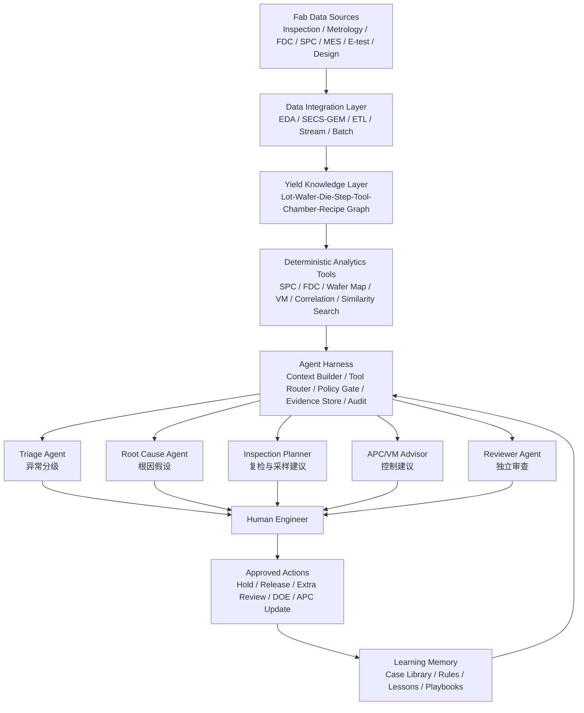
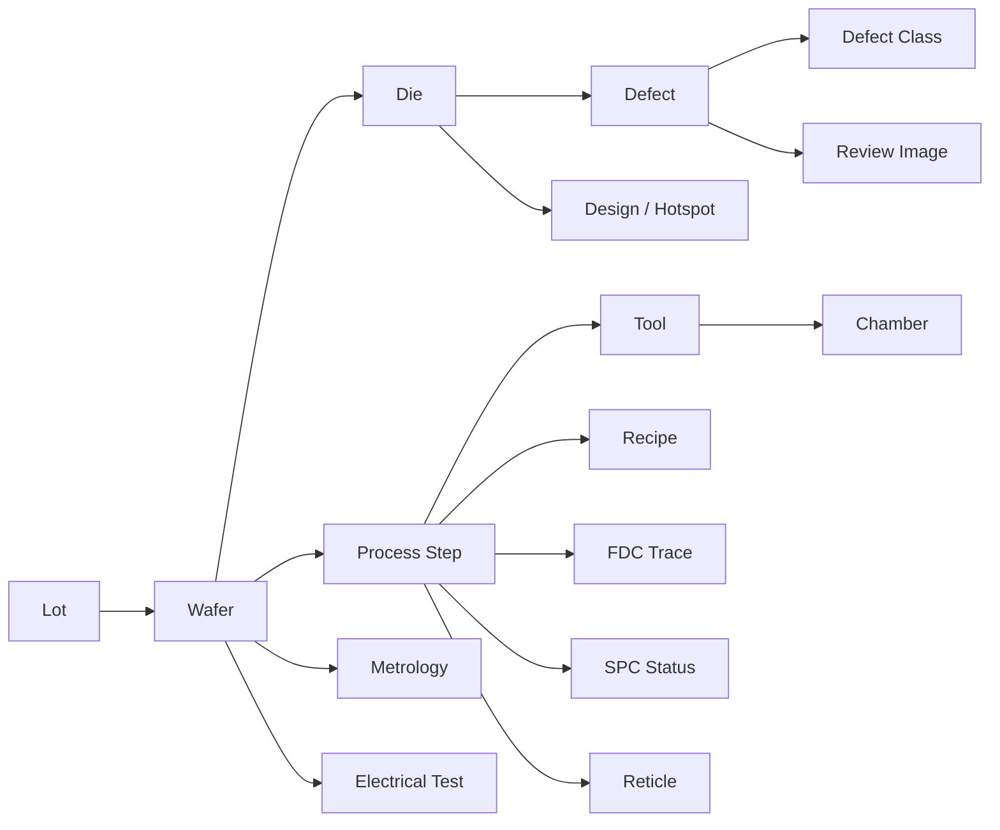
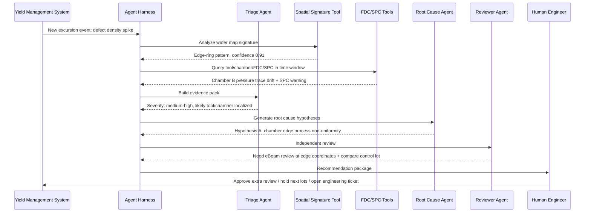
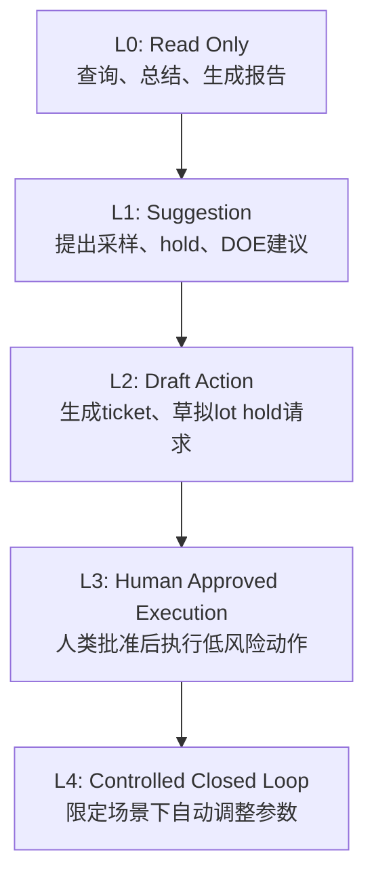
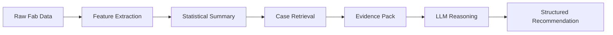
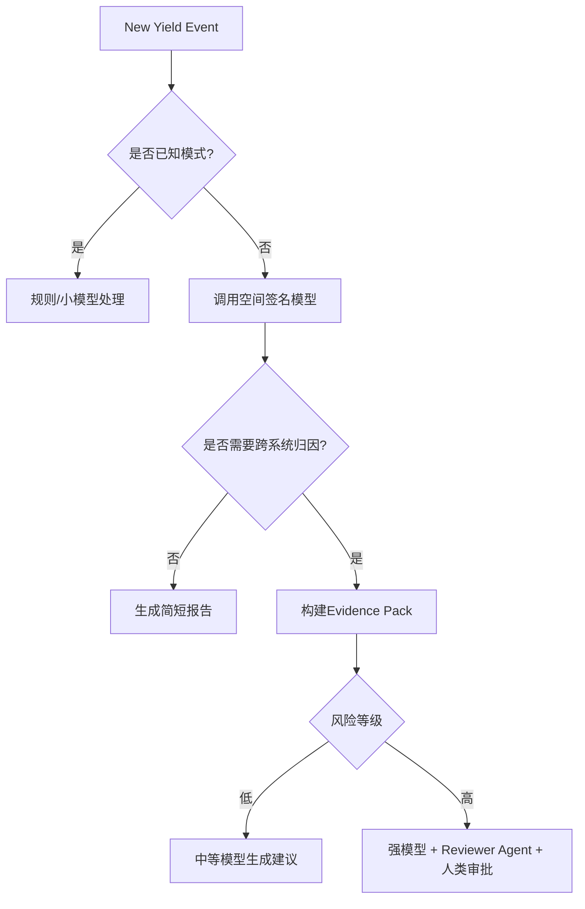
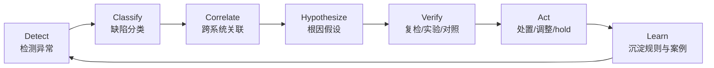
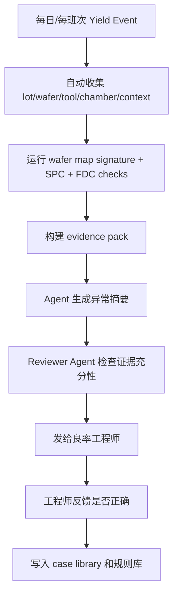

# Harness 工程：把 Agent 绑进半导体良率系统，而不是让它在 Fab 里自由发挥

Loop 工程听起来很诱人：给 AI 一个目标，让它自己发现任务、执行任务、验证结果、继续下一轮。

但在今天，尤其是在半导体这种高资本、高风险、高约束的行业里，Loop 还不能被浪漫化。token 成本、算力供给、模型稳定性、数据安全、设备权限、工艺责任边界，这些现实问题决定了：我们不能把 Agent 当成一个“全自动良率工程师”丢进 Fab。

更务实的路线，是先谈 **Harness 工程**。

不是让模型自由循环，而是给模型套上一副工程化“马具”：
它能看到什么、能调用什么工具、能提出什么建议、什么动作必须被拦截、什么结论必须被验证、什么时候必须交给人。

半导体良率检测与提升，恰好是理解 Harness 工程的绝佳场景。

因为这里最缺的从来不是“再来一个会聊天的 AI”，而是一个能把 **检测设备、量测数据、FDC、SPC、APC、MES、良率分析、工程师经验、异常处置流程** 组织起来的智能执行底座。

---

## 一、先说结论：半导体良率 Agent 的核心不是模型，而是 Harness

Vivek Trivedy 在 LangChain 的《The Anatomy of an Agent Harness》中提出了一个非常简洁的公式：

> Agent = Model + Harness

他的定义是：Harness 是模型之外的一切代码、配置和执行逻辑；裸模型不是 Agent，只有当 Harness 给它状态、工具执行、反馈循环和可执行约束之后，它才变成真正能工作的 Agent。文章还明确列出了 Harness 包含系统提示、工具、MCP、文件系统、沙箱、浏览器、编排逻辑、hooks 和中间件等组件。([LangChain][1])

Addy Osmani 进一步把这个思路总结成工程习惯：当 Agent 犯错时，不要只怪模型，而要把错误变成 Harness 中的规则、工具、检查、沙箱或反馈路径；他把 Harness 具体拆成 prompts、tools、context policies、hooks、sandboxes、subagents、feedback loops、recovery paths 和 observability 等部分。([Addy Osmani][2])

放到半导体良率场景里，这句话可以改写成：

> **良率 Agent = 模型 + Fab Harness。**
> 模型负责推理、解释、生成假设；Harness 负责数据接入、工具执行、权限控制、证据组织、工艺约束、验证闭环和人机交接。

一个裸 LLM 对晶圆厂几乎没有价值。
它不知道 lot history，不知道 chamber drift，不知道上一批 wafer map 的空间签名，不知道这台机台昨天换过 MFC，不知道某个 reticle 是否刚清洗过，也不知道一条“建议调整 recipe”的话在真实工厂里意味着什么风险。

所以，半导体 Agent 的第一性问题不是：

> 这个模型够不够聪明？

而是：

> 这个模型被放进了一个多可靠、多克制、多可审计的工程系统里？

这就是 Harness 工程。

---

## 二、为什么半导体良率特别适合谈 Harness？

半导体制造不是普通制造。它有几个特点，让“纯聊天式 AI”几乎无法直接落地。

第一，数据极度多模态。良率相关数据不只是表格。它包括 wafer map、缺陷图像、SEM/eBeam review 图、光学检测结果、CD/overlay/thickness 量测、FDC sensor trace、recipe、equipment event、lot route、process step、reticle、mask、设计版图热点、WAT/CP/FT 电性测试结果等。

第二，数据强上下文。一个缺陷本身不够，必须知道它出现在哪一层、哪一道工序之后、哪台 tool、哪个 chamber、哪套 recipe、哪个 product、哪个 die 坐标、是否与历史 excursion 相似。

第三，结论必须可验证。良率工程不是写一段“看起来合理”的解释，而是要能回答：这个异常是不是真异常？缺陷是 yield killer 还是 nuisance？是 tool issue、process drift、reticle contamination、layout sensitivity，还是 sampling artifact？

第四，动作风险极高。建议 hold lot、增加 eBeam review、调整 inspection sampling、修改 APC target、更新 recipe、暂停 chamber，这些都不是普通软件里的“点一下重试”。每一步都可能影响 WIP、cycle time、产能和客户交期。

第五，工厂系统已经有庞大基础设施。半导体厂不是空白环境。它已经有 MES、EAP、SPC、FDC、YMS、APC、EDA/Interface A、SECS/GEM 等系统。SEMI 官方资料提到，设备通信和自动化标准套件包括 SECS/GEM、EDA / Interface A、RITdb 和 SMT-ELS，用于简化设备通信和扩展集成；EDA / Interface A 的目标是支持设备数据采集，适应更复杂的数据需求。([semi.org][3])

也就是说，半导体良率 Agent 不是从零搭一个 AI 系统。
它更像是给既有 Fab 系统加一层 **智能调度、证据归纳、异常归因、决策辅助和受控执行的 Harness**。


---

## 三、良率检测与提升，不是一个模型任务，而是一条证据链任务

很多人会把“AI + 良率”理解成训练一个缺陷分类模型。这个方向当然重要。KLA 的缺陷检测与复检系统就覆盖了 chip manufacturing 中从 process tool qualification、wafer qualification、研发，到 tool、process 和 line monitoring 等多种 yield 应用；其系统结合 photon、e-beam、sensor 技术和 AI-driven algorithms 来发现、识别和分类 wafer 表面、背面、边缘的颗粒与图形缺陷。([KLA][4])

Applied Materials 的产品资料也说明，在先进节点上，光学检测区分真实缺陷和工艺噪声越来越困难，可能产生高误报或高 nuisance rate；其 SEMVision H20 使用 eBeam 技术和深度学习 AI，从 nuisance defects 和 noise 中自动提取 critical defects。([Applied Materials][5])

但良率提升不止是“检测更准”。真正困难的是：

```text
检测到了异常
→ 判断异常是否显著
→ 识别空间模式
→ 关联上游工艺
→ 找到最可能 root cause
→ 判断是否需要 hold / rework / 增加量测
→ 设计验证实验
→ 更新控制策略
→ 沉淀为规则和知识
```

这不是一个单点模型，而是一个系统工程。

因此，半导体良率 Agent 的核心任务不是“替代某个分类器”，而是 **把一条良率证据链自动组织出来**：

```text
缺陷现象是什么？
出现在什么 lot / wafer / die / layer / step？
空间签名像什么？
历史上是否发生过类似模式？
相关 tool/chamber/recipe 是否有漂移？
FDC trace 是否异常？
SPC 是否越界或接近控制线？
是否与 reticle、layout、product mix 有关？
是否需要更多 review sample？
建议动作是什么？
建议动作的证据、风险和置信度是什么？
谁来批准？
```

这正是 Harness 的用武之地。

---

## 四、Fab Harness 的总体架构：让 Agent 工作在“工程笼子”里

半导体良率 Agent 不应该直接连上数据库后自由发挥。更合理的方式，是把它放进一个分层 Harness。



这张图里的关键不是 Agent 多，而是 **Agent 被 Harness 包住**。

Harness 至少要提供七类能力：

```text
1. 数据接入：从设备、系统、数据湖中取数
2. 上下文装配：把相关数据压缩成 evidence pack
3. 工具调用：让模型调用确定性分析工具，而不是凭空判断
4. 权限控制：哪些动作只读，哪些动作需要审批
5. 结果验证：所有结论必须经过规则、统计、物理和工程审查
6. 可观测性：记录每次分析、工具调用、成本、延迟、证据来源
7. 知识沉淀：把失败案例、误判、工程规则写回知识库
```

如果没有这些，所谓良率 Agent 只是一个会讲半导体术语的聊天机器人。

---

## 五、数据层：不是 RAG 文档库，而是良率知识图谱

很多 AI 项目一上来就说“我们把文档放进向量库，然后问答”。这对良率工程远远不够。

良率分析的基本单位不是文档，而是关系。

一个缺陷事件至少要连到：

```text
product_id
technology_node
lot_id
wafer_id
die_x / die_y
layer
process_step
tool_id
chamber_id
recipe_id
reticle_id
operator_shift
material_batch
inspection_tool
inspection_recipe
defect_class
defect_coordinates
review_result
metrology_result
FDC_trace_id
SPC_rule_status
electrical_test_result
```

如果这些 key 没打通，Agent 就只能做表面归纳。

更合理的是构建一个 **Yield Knowledge Graph**：



这个图谱不是为了好看，而是为了让 Agent 能问出真正有意义的问题：

```text
同一个 chamber 最近 72 小时是否出现相似空间签名？
同一个 reticle 在不同 tool 上是否也出现缺陷？
同一个 product 的同一 layout hotspot 是否重复失效？
FDC 中哪些 sensor channel 在异常 wafer 前后出现漂移？
电性 fail bin 是否与 inline defect spatial pattern 对齐？
```

SEMI E164 的目标正是推动设备 metadata 表示与约定的一致性，它基于 SEMI E125 的设备自描述规范，覆盖设备 metadata 的通用定义方法，以及 300mm 工厂常见通信标准的 metadata 表示。([semi.org][6])
这类标准化 metadata 对良率 Agent 很关键，因为 Agent 不是只读“数值”，而是要理解这些数值来自哪个设备对象、哪个 chamber、哪个 module、哪个 event、哪个 time window。

---

## 六、工具层：让模型“调用良率工具”，而不是“扮演良率工具”

Harness 工程有一个重要原则：

> 能用确定性工具解决的，就不要让 LLM 猜。

半导体良率 Agent 的工具应该是强类型、可审计、可复现的。
不要给模型一个万能 SQL 权限，让它随便查。应该给它一组经过封装的工具。

例如：

```yaml
tools:
  get_lot_history:
    input: { lot_id: string }
    output: { route: list, tools: list, chambers: list, timestamps: list }

  get_wafer_map_signature:
    input: { wafer_id: string, layer: string }
    output: { signature_type: string, confidence: number, features: object }

  compare_to_historical_excursions:
    input: { signature_vector: array, product_id: string, layer: string }
    output: { similar_cases: list, similarity_score: number }

  query_fdc_anomaly:
    input: { tool_id: string, chamber_id: string, time_window: string }
    output: { abnormal_channels: list, rule_violations: list }

  run_spc_rule_check:
    input: { metric: string, entity: string, time_window: string }
    output: { western_electric_rules: list, control_status: string }

  estimate_yield_impact:
    input: { defect_class: string, density: number, spatial_pattern: string }
    output: { estimated_impact: number, uncertainty: number }

  propose_review_sampling:
    input: { defect_map: string, budget: int, suspected_classes: list }
    output: { review_points: list, rationale: string }

  generate_engineering_report:
    input: { evidence_pack_id: string }
    output: { summary: string, recommendations: list, risks: list }
```

这类工具的输出必须带上：

```text
数据时间窗口
数据版本
算法版本
查询条件
样本数量
置信区间
缺失数据说明
异常值处理方法
证据链接
```

否则 Agent 给出的结论无法审查。

Applied Materials 的 Enlight 3 资料提到，其光学检测系统结合高分辨率、AI 算法和大数据，每次扫描捕获更多数据；ExtractAI 使用 Enlight 3 的大数据，在 inline monitoring 中创建分类后的 noise-free map，并将 brightfield optical wafer inspection 与 eBeam review 建立实时智能连接。([Applied Materials][7])
这说明在真实良率系统中，AI 的价值往往不是单点“生成答案”，而是把不同检测与复检工具连接起来，形成可行动的数据产品。

Agent Harness 也应如此：
LLM 不直接替代检测设备、SPC、FDC、VM、APC，而是调度它们、解释它们、组合它们。

---

## 七、Agent 角色设计：不要造一个万能良率神仙

半导体良率问题太复杂，不应该由一个“全能 Agent”完成所有工作。Harness 更适合把任务拆成多个角色，并让它们互相制衡。

### 1. Triage Agent：异常分诊员

负责回答：

```text
这是已知模式还是未知模式？
影响范围是单片 wafer、单个 lot、单台 tool、单个 chamber，还是跨产品？
是否需要立即升级？
是否建议 hold lot？
```

它应该只读，不应具备任何生产动作权限。

### 2. Spatial Signature Agent：空间签名分析员

负责分析 wafer map：

```text
center
edge ring
scratch
cluster
radial
donut
reticle field repeat
stepper/scanner signature
random particles
systematic layout hotspot
```

它可以调用传统图像算法、CNN、pattern matching、历史案例相似度工具，但最终输出必须包含可视证据。

### 3. Tool/Chamber Drift Agent：设备漂移侦探

负责把缺陷与 tool、chamber、sensor trace、PM history 关联起来。

它的问题不是“这个 wafer 有没有缺陷”，而是：

```text
这个 chamber 是否近期开始偏移？
同一 tool 的其他 chamber 是否正常？
PM 前后分布是否变化？
FDC sensor 中哪些 channel 贡献最大？
```

### 4. Reticle/Layout Agent：设计与掩模关联分析员

负责检查：

```text
是否同一 reticle field 重复？
是否与版图热点重合？
是否只在某类 pattern density 区域出现？
是否与 OPC / litho hotspot 有关？
```

### 5. VM/APC Advisor：虚拟量测与控制建议员

虚拟量测和 APC 本来就是半导体制造的重要方向。Siemens 相关论文中提到，传统 VM 利用 process chamber 的 FDC 数据预测量测结果，以减少 metrology 成本与处理时间；在高产品混合制造场景中，把 design features 和 FDC 数据结合进 ML-based VM，再接入 APC / R2R 控制，可以改善工艺控制。论文中的仿真案例显示，将 extended VM 用于 R2R 控制后，Cpk 从 0.86 提升到 1.30。

但这里要特别小心：
Agent 可以提出 APC 建议，不等于 Agent 可以直接修改 APC target 或 production recipe。

### 6. Reviewer Agent：独立审查员

负责反驳前面所有 Agent：

```text
证据是否充分？
是否把 correlation 当 causation？
是否存在数据缺失？
是否需要更多 review sample？
是否触碰高风险工艺区域？
建议动作是否过度？
```

在高风险场景下，Reviewer Agent 应该使用不同 prompt、不同工具权限，甚至不同模型。
写建议的人，不能自己批准自己。

---

## 八、一个典型场景：从 wafer map 异常到工程处置建议

假设某先进逻辑产品在 etch 后 inspection 出现 edge-ring defect pattern，defect density 明显升高。

传统流程可能是：

```text
良率工程师看图
→ 拉 lot history
→ 查 tool/chamber
→ 查 FDC
→ 查 metrology
→ 找历史案例
→ 询问设备工程师
→ 决定是否 hold 后续 lot
→ 安排 eBeam review
→ 开会讨论 root cause
```

Harness 化之后，Agent 不是直接“下结论”，而是自动组织证据链。



最终报告不应该长这样：

```text
AI 认为问题可能来自 Chamber B。
```

而应该长这样：

```text
结论：建议将该事件升级为 chamber-localized excursion，并对 Chamber B 后续 lot 暂停放行，等待补充 review。

证据：
1. wafer map 空间签名为 edge-ring，置信度 0.91；
2. 异常集中在 Etch Step E-143 后；
3. 最近 24 小时内 Chamber B 处理的 4 个 lot 中有 3 个出现相似模式；
4. Chamber A/C/D 对照 lot 未出现相同模式；
5. FDC pressure channel P-17 在异常 lot 前后出现漂移；
6. SPC 尚未正式 OOC，但触发 early warning rule；
7. 历史相似案例 #2025-ETCH-017 的 root cause 为 edge gas flow drift。

建议：
- 对当前 lot 增加 eBeam review sampling；
- 对 Chamber B 后续 lot 临时 hold；
- 由设备工程师检查 edge gas flow / chuck temperature / chamber clean status；
- 不建议直接调整 recipe，需等 review 结果确认。

风险：
- 目前尚不能排除 reticle/layout 相关系统性缺陷；
- 需要补充一个同 product、同 layer、不同 chamber 的 control sample。
```

这才是良率 Agent 该有的输出。

---

## 九、Harness 的“安全边界”：半导体 Agent 必须默认只读

在 Fab 里，权限设计比模型能力更重要。

一个推荐的权限分层如下：



在大多数工厂中，良率 Agent 的合理起点是 L0 到 L2。

也就是：

```text
可以查数据
可以生成证据包
可以提出假设
可以草拟工程处置建议
可以创建 review request
可以生成 DOE plan
但不能直接改 recipe
不能直接 release high-risk lot
不能绕过 process owner
不能对 production tool 下控制命令
```

更具体地说，Harness 里应该有 policy gate：

```yaml
policy:
  default_mode: read_only

  allowed_without_approval:
    - query_yield_data
    - query_lot_history
    - run_spc_analysis
    - run_wafer_map_signature
    - generate_report
    - draft_ticket

  requires_engineer_approval:
    - request_extra_ebeam_review
    - recommend_lot_hold
    - create_doe_plan
    - change_sampling_plan

  forbidden_for_agent:
    - modify_production_recipe
    - change_apc_target
    - release_held_lot
    - disable_spc_rule
    - write_to_equipment_controller
    - delete_or_overwrite_raw_data
```

Harness 工程的核心不是“让 Agent 做更多”，而是 **让 Agent 在正确边界内做更可靠的事**。

---

## 十、上下文工程在 Fab Harness 里怎么做？

半导体数据量极大，不可能把全部数据塞进模型上下文。
token 贵、算力紧、模型上下文有限，这些现实约束反而会逼出更好的架构。

Fab Harness 的上下文不应该是“把数据湖 dump 给 LLM”。
它应该是一个 **Evidence Pack Builder**。



Evidence Pack 里放什么？

```yaml
evidence_pack:
  event:
    type: defect_excursion
    product: P1234
    layer: M2_Etch
    lot: L2026A017
    wafers: [W03, W07, W11]

  observations:
    wafer_map_signature: edge_ring
    defect_density_delta: "+3.2 sigma vs baseline"
    affected_area: outer_5mm
    known_defect_classes: [particle, residue]

  context:
    tool: ETCH_12
    chamber: B
    recipe: R_M2_ETCH_08
    previous_pm: "36 hours ago"
    reticle: R9981
    inspection_recipe: INS_M2_07

  analytics:
    spc_status: warning_not_ooc
    fdc_anomalies:
      - channel: pressure_P17
        deviation: "+2.1 sigma"
      - channel: edge_gas_flow
        deviation: "-1.8 sigma"
    similar_cases:
      - case_id: 2025_ETCH_017
        similarity: 0.87
        confirmed_root_cause: edge_gas_flow_drift

  missing_data:
    - eBeam review pending
    - no control sample from Chamber C in same shift

  constraints:
    - do_not_recommend_recipe_change_without_process_owner
    - prefer_extra_review_before_hold_if_wip_risk_high
```

这个 evidence pack 才是 LLM 应该看的东西。

LLM 不需要看几百万行 sensor trace。
它需要看经过工具计算、统计压缩、结构化整理、带有证据引用的数据摘要。

这就是 Harness 和 Context Engineering 的结合点。

---

## 十一、验证层：让 Agent 的每个结论都过“五道闸”

半导体良率 Agent 最危险的不是“不知道”，而是“看起来很知道”。

所以 Harness 必须设计验证层。

### 第一闸：统计显著性

```text
是否超过 baseline？
是否考虑 product / layer / tool 分组？
是否存在 multiple comparison 问题？
是否只是 sampling bias？
```

### 第二闸：空间一致性

```text
wafer map signature 是否稳定？
多个 wafer 是否同模式？
是否存在 reticle field repeat？
是否与 die-level electrical fail 匹配？
```

### 第三闸：时间因果顺序

```text
异常是否发生在可疑 process step 之后？
可疑 tool/chamber 是否在异常前已经漂移？
PM / recipe / material change 是否在时间上对齐？
```

### 第四闸：工程物理约束

```text
假设是否符合设备机理？
该 chamber 参数是否真的可能造成这种 spatial pattern？
该 defect class 是否可能由该 step 引入？
```

### 第五闸：人类审批

```text
是否需要 process owner？
是否需要 equipment engineer？
是否需要 integration engineer？
是否影响客户 lot？
是否影响 production schedule？
```

可以把验证层写成 Harness 的固定规则：

```yaml
verification:
  root_cause_claim:
    required_evidence:
      - temporal_alignment
      - spatial_signature_match
      - tool_or_chamber_correlation
      - historical_case_or_physical_mechanism
    forbidden:
      - correlation_only_without_control_group
      - recommendation_without_missing_data_section

  production_action:
    required_approval:
      - yield_engineer
      - process_owner
    require_risk_assessment: true
```

这正符合 Harness Engineering 的思想：
模型容易犯的错，不靠“提醒它下次小心”，而是写成系统规则。

---

## 十二、成本层：在 token 昂贵时，Harness 要学会“少让模型思考”

很多 Agent 架构的问题，是把 LLM 当成所有事情的默认入口。

半导体良率系统不该这样设计。

在 Fab Harness 中，应该尽量遵循：

```text
能离线预计算的，不在线算；
能用传统算法的，不用 LLM；
能用小模型的，不用大模型；
能返回结构化摘要的，不返回原始数据；
能用工具验证的，不让模型自证；
能缓存的，不重复分析。
```

一个成本友好的模型路由策略可以是：



大模型应该用在：

```text
跨系统证据归纳
根因假设生成
相互矛盾证据解释
DOE 思路生成
工程报告写作
专家知识调度
异常案例复盘
```

不应该用在：

```text
简单 SQL 查询
SPC 规则判断
wafer map 基础特征提取
FDC 异常检测
重复报告格式化
已知案例分类
```

这也是为什么在高成本时代，Harness 比 Loop 更实际。
Loop 追求“持续自动迭代”，而 Harness 先追求“每一次模型调用都值得”。

---

## 十三、从检测到提升：Agent 真正应该推动的是 Yield Learning

良率提升的关键不是一次性找出某个缺陷，而是缩短 yield learning cycle。

KLA 的软件方案页面提到，其半导体软件集中和分析 inspection、metrology 与 process systems 数据，支持 run-time process control、defect excursion identification、wafer and reticle dispositioning、scanner and process corrections、defect classification 等应用，并通过 AI modeling、visualization 和数据分析帮助制造商加速 yield learning、降低生产风险。([KLA][8])

这句话非常关键：
良率提升不是“检测一次”，而是 “learning rate”。

Agent Harness 应该围绕 yield learning 设计：

```text
更快发现 excursion
更快定位影响范围
更快识别 root cause
更快决定是否 hold / release
更快设计验证实验
更快把经验沉淀成规则
更快把规则反馈到检测、采样、SPC、FDC、APC
```

可以把良率提升过程看成一条学习飞轮：



注意，这不是无人监管 Loop。
它是一个由 Harness 控制边界、由人类批准高风险动作的学习飞轮。

---

## 十四、Fab Harness 的一个 SVG 概念图

下面这张图可以作为博客插图：模型在中间，但真正决定它能否落地的是外层 Harness。

```svg
<svg width="960" height="560" viewBox="0 0 960 560" xmlns="http://www.w3.org/2000/svg">
  <defs>
    <style>
      .title { font-family: Arial, sans-serif; font-size: 24px; font-weight: 700; fill: #111; }
      .label { font-family: Arial, sans-serif; font-size: 16px; fill: #111; }
      .small { font-family: Arial, sans-serif; font-size: 13px; fill: #444; }
      .core { fill: #fff4cc; stroke: #222; stroke-width: 2; rx: 18; }
      .ring { fill: #f7f7f7; stroke: #333; stroke-width: 1.5; rx: 14; }
      .data { fill: #e8f1ff; stroke: #333; stroke-width: 1.5; rx: 14; }
      .policy { fill: #ffecec; stroke: #333; stroke-width: 1.5; rx: 14; }
      .verify { fill: #ecfff2; stroke: #333; stroke-width: 1.5; rx: 14; }
      .arrow { stroke: #333; stroke-width: 1.5; fill: none; marker-end: url(#arrow); }
    </style>
    <marker id="arrow" markerWidth="10" markerHeight="10" refX="8" refY="3" orient="auto">
      <path d="M0,0 L0,6 L9,3 z" fill="#333" />
    </marker>
  </defs>

  <text x="480" y="45" text-anchor="middle" class="title">Fab Agent Harness for Yield Detection & Improvement</text>

  <rect x="380" y="220" width="200" height="100" class="core"/>
  <text x="480" y="258" text-anchor="middle" class="label">LLM / VLM</text>
  <text x="480" y="282" text-anchor="middle" class="small">推理、解释、生成假设</text>

  <rect x="70" y="95" width="210" height="80" class="data"/>
  <text x="175" y="128" text-anchor="middle" class="label">Data Connectors</text>
  <text x="175" y="152" text-anchor="middle" class="small">Inspection / Metrology / FDC / MES</text>

  <rect x="375" y="90" width="210" height="80" class="ring"/>
  <text x="480" y="123" text-anchor="middle" class="label">Context Builder</text>
  <text x="480" y="147" text-anchor="middle" class="small">Evidence Pack, not raw dump</text>

  <rect x="680" y="95" width="210" height="80" class="ring"/>
  <text x="785" y="128" text-anchor="middle" class="label">Tool Router</text>
  <text x="785" y="152" text-anchor="middle" class="small">SPC / FDC / VM / Similarity</text>

  <rect x="70" y="245" width="210" height="80" class="policy"/>
  <text x="175" y="278" text-anchor="middle" class="label">Policy Gate</text>
  <text x="175" y="302" text-anchor="middle" class="small">Read-only, approval, forbidden actions</text>

  <rect x="680" y="245" width="210" height="80" class="verify"/>
  <text x="785" y="278" text-anchor="middle" class="label">Verification Layer</text>
  <text x="785" y="302" text-anchor="middle" class="small">Stats, physics, reviewer agent</text>

  <rect x="195" y="390" width="230" height="80" class="ring"/>
  <text x="310" y="423" text-anchor="middle" class="label">Evidence Store</text>
  <text x="310" y="447" text-anchor="middle" class="small">Audit trail, cases, decisions</text>

  <rect x="535" y="390" width="230" height="80" class="ring"/>
  <text x="650" y="423" text-anchor="middle" class="label">Human Handoff</text>
  <text x="650" y="447" text-anchor="middle" class="small">Yield / Process / Equipment owners</text>

  <path d="M280,135 C330,150 355,190 390,225" class="arrow"/>
  <path d="M480,170 L480,220" class="arrow"/>
  <path d="M680,135 C630,150 605,190 570,225" class="arrow"/>
  <path d="M280,285 C325,285 345,270 380,270" class="arrow"/>
  <path d="M580,270 C620,270 640,285 680,285" class="arrow"/>
  <path d="M430,320 C390,345 345,365 315,390" class="arrow"/>
  <path d="M530,320 C570,345 615,365 645,390" class="arrow"/>
</svg>
```

---

## 十五、落地路线：从“报告助手”开始，不要从“自动调参”开始

半导体良率 Agent 的成熟度可以分五级。

| 阶段 | 能力                                   |  风险 | 推荐程度      |
| -- | ------------------------------------ | --: | --------- |
| L0 | 查询数据、生成良率日报、总结 excursion             |   低 | 立即可做      |
| L1 | 自动分诊异常、生成 evidence pack              | 低到中 | 非常适合      |
| L2 | 提出 root cause 假设与复检建议                |   中 | 适合        |
| L3 | 草拟 hold / sampling / DOE ticket，人类批准 |  中高 | 谨慎推进      |
| L4 | 限定场景下联动 APC / R2R 控制建议               |   高 | 必须强审批     |
| L5 | 无人值守自动调参                             |  极高 | 不建议作为早期目标 |

最好的第一步不是“AI 自动提升良率”，而是：

```text
把工程师每天重复做的异常分诊、跨系统查数、图谱比对、报告编写自动化。
```

一个最小可用系统可以这样设计：



这个系统没有任何危险动作，但已经能产生价值：

```text
减少查数时间
减少遗漏
统一报告格式
让新人更快理解异常
让历史案例可复用
让经验变成 Harness 规则
```

---

## 十六、评价指标：不要只看模型准确率，要看良率工程效率

一个 Fab Harness 是否成功，不应该只看“模型回答得像不像专家”。

更应该看工程指标：

```text
MTTD: mean time to detect excursion
MTTRC: mean time to root-cause candidate
异常影响范围收敛时间
eBeam review sample 利用率
nuisance defect 过滤率
false alarm 降低比例
工程师查数时间减少比例
良率学习周期缩短比例
同类异常复发率
推荐动作被采纳率
推荐动作误报率
每个 confirmed root cause 的 token / compute 成本
```

其中最重要的不是“AI 回答准确率”，而是：

> 它有没有让良率工程团队更快、更稳、更少遗漏地完成 yield learning？

---

## 十七、反模式：半导体 Agent 最容易做错的六件事

### 1. 把 Agent 做成数据湖聊天机器人

用户问：“为什么这个 lot 良率低？”
AI 去数据湖里检索几段文档，然后编一个答案。

这是最危险的原型。
良率分析需要结构化证据链，不是文档问答。

### 2. 把 wafer map 当图片看，而不是当工艺信号看

wafer map 不是普通图像。
它有 die 坐标、reticle field、edge exclusion、process layer、inspection recipe、sampling policy、defect class、历史 baseline。
脱离这些上下文，视觉模型再强也容易误判。

### 3. 只做相关性，不做工程验证

“Chamber B 和异常相关”不等于 Chamber B 是 root cause。
必须有时间顺序、对照组、物理机制、历史案例或补充实验。

### 4. 给 Agent 太大权限

一开始就让 Agent 创建 hold、release lot、修改 recipe，是典型的过度自动化。
Fab Harness 的初始原则应该是 read-only first。

### 5. 没有 reviewer

提出假设的 Agent，不能自己证明自己。
至少要有独立 reviewer agent；高风险事件还要有人类 process owner。

### 6. 没有把失败写回 Harness

如果 Agent 曾经误把 sampling artifact 当成 excursion，下次就应该在 Harness 中加入规则：

```text
当 inspection sample size 低于阈值时，禁止输出 high-confidence root cause。
```

这才是 Harness Engineering 的“棘轮效应”：每次失败都让系统更可靠。

---

## 十八、这类系统的真正思想：Agent 不做主脑，而做“证据调度器”

半导体良率工程的核心不是“AI 说了算”。

更好的定位是：

```text
Agent 不是 process owner
Agent 不是 equipment engineer
Agent 不是 yield manager
Agent 不是 APC controller

Agent 是证据调度器、异常分诊员、知识检索员、报告生成器、假设生成器和审查辅助器。
```

它的价值在于把工程师从重复劳动中解放出来：

```text
少花时间查系统
少花时间拼 Excel
少花时间翻历史案例
少花时间写周报
少漏掉 chamber / reticle / layout / FDC 的关联
多花时间判断机理、设计实验、做最终决策
```

这比“全自动 Loop”更适合当下阶段。

Loop 是远方的自动化愿景。
Harness 是今天能开始做的工程底座。

---

## 结语：半导体良率 Agent 的未来，不是更会聊天，而是更懂边界

半导体制造最不需要的是一个自信满满、无法审计、无法复现、无法担责的 AI。

它需要的是一种新的工程结构：

```text
模型负责推理
工具负责计算
数据负责证据
规则负责边界
Reviewer 负责质疑
人类负责批准
Harness 负责把这一切组织起来
```

这就是半导体良率场景中的 Harness 工程。

它不像 Loop 工程那样激进，也不像 Prompt 工程那样轻巧。
它更重、更慢、更工程化，但也更接近真实 Fab 的需要。

因为在晶圆厂里，真正的问题从来不是“AI 能不能回答”。
真正的问题是：

> **AI 的每一句判断，是否能被数据追溯、被工具验证、被规则约束、被专家审查、被组织安全地执行。**

当我们能回答这个问题时，半导体良率 Agent 才真正从 demo 走向生产。

[1]: https://www.langchain.com/blog/the-anatomy-of-an-agent-harness "The Anatomy of an Agent Harness"
[2]: https://addyosmani.com/blog/agent-harness-engineering/ "AddyOsmani.com - Agent Harness Engineering"
[3]: https://www.semi.org/en/products-services/download-standards "Purchase and Download SEMI Standards Documents | SEMI"
[4]: https://www.kla.com/products/chip-manufacturing/defect-inspection-review "Defect Inspection & Review | Chip Manufacturing | KLA"
[5]: https://www.appliedmaterials.com/us/en/product-library/semvision-h20-defect-analysis.html "SEMVision H20 Defect Analysis "
[6]: https://store-us.semi.org/products/e16400-semi-e164-specification-for-eda-common-metadata "E16400 - SEMI E164 - Specification for EDA Common Metadata"
[7]: https://www.appliedmaterials.com/us/en/product-library/enlight-3-optical-inspection.html "Enlight 3 Optical Inspection"
[8]: https://www.kla.com/products/software-solutions/semiconductor "Semiconductor Software Solutions | KLA"
