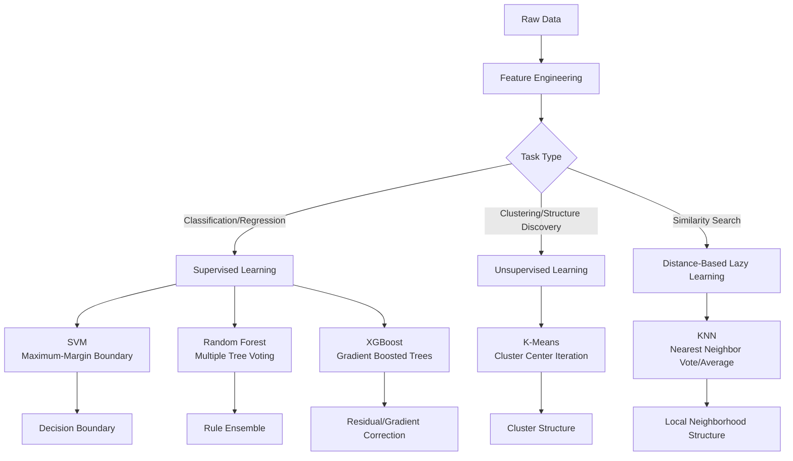
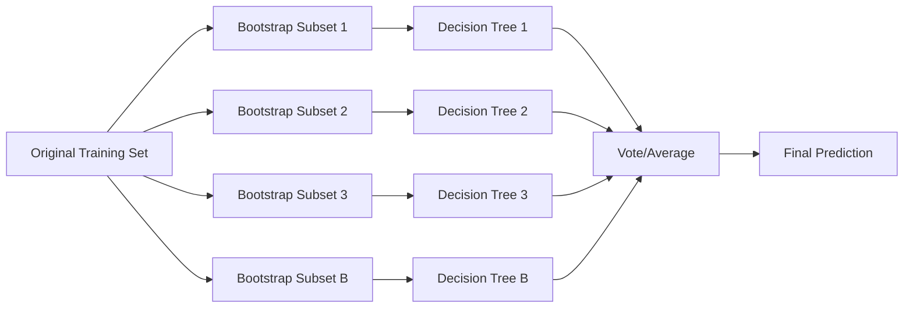
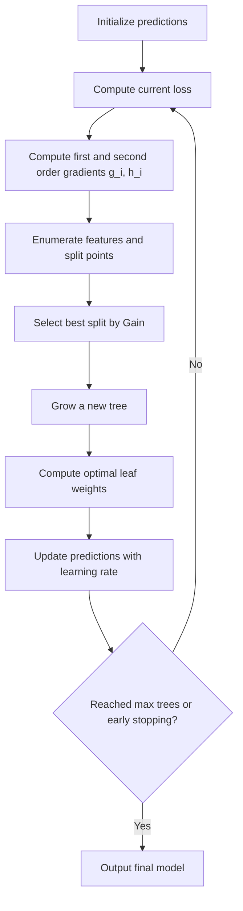
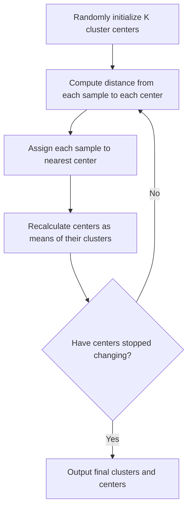
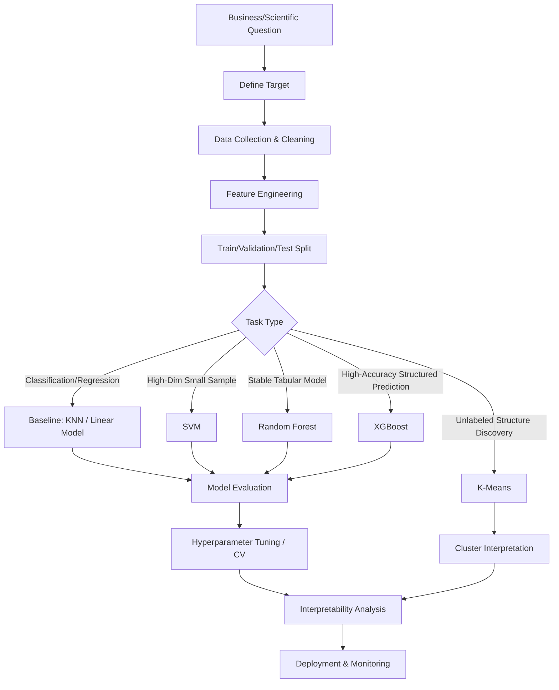
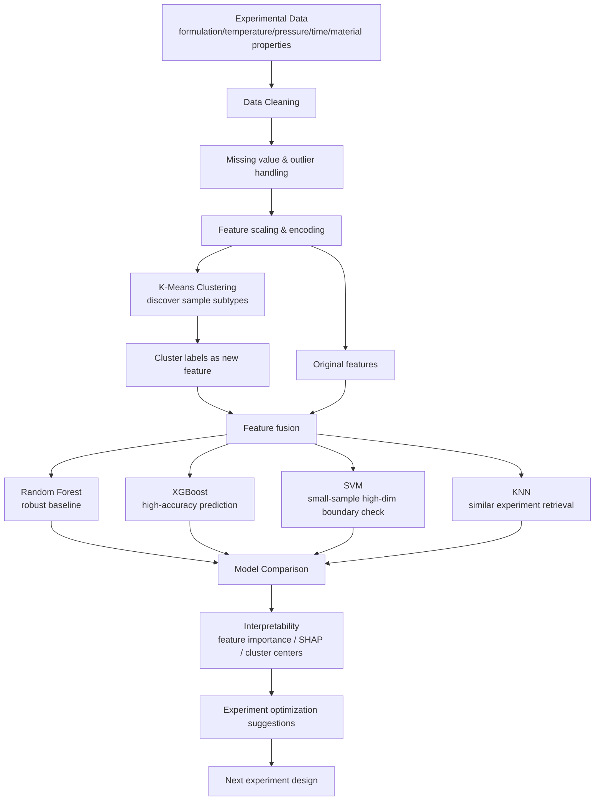

# One Article to Understand SVM, RF, XGBoost, K-Means & KNN: Formulas, Ideas, Operational Logic, and Real-World Modeling Architectures

## Executive Summary

SVM, Random Forest, XGBoost, K-Means, and KNN are five classic and highly practical machine learning algorithms. At first glance they seem scattered, but they can be connected by a single thread:

**The essence of machine learning is to find a “structure” from data: a boundary, a set of rules, a gradient direction, cluster centers, or neighborhood relations.**

- SVM finds the **maximum-margin classification boundary**.
- Random Forest finds **stable rules formed by the collective voting of multiple random decision trees**.
- XGBoost finds **gradient-based corrections from one tree to the next, fixing previous errors**.
- K-Means finds **cluster center structures** hidden inside the data.
- KNN does not explicitly train a model; at prediction time it finds **the closest historical samples to the target**.

From a modeling perspective:

| Algorithm | Type | Core Idea | Suitable Scenarios | Key Hyperparameters |
| --- | --- | --- | --- | --- |
| SVM | Supervised | Maximize classification margin, use kernel trick if needed | Small-to-medium samples, high-dimensional, clear boundaries | `C`, `kernel`, `gamma` |
| RF | Supervised | Multiple random trees voting to reduce variance | Tabular data, many features, robust modeling | `n_estimators`, `max_depth`, `max_features` |
| XGBoost | Supervised | Gradient boosted trees, second-order gradients to correct errors | Structured data competitions, risk control, prediction systems | `learning_rate`, `max_depth`, `lambda`, `subsample` |
| K-Means | Unsupervised | Assign samples to nearest cluster center by distance | User segmentation, image compression, feature clustering | `K`, initialization method, iterations |
| KNN | Supervised / Non‑parametric | Find nearest neighbors for voting or averaging | Small datasets, recommendation, similar-case retrieval | `K`, distance metric, weighting scheme |

---

## 1. A Unified Perspective: What Is Machine Learning Really Optimizing?

Whether classification, regression, or clustering, machine learning usually solves one problem:

> Given data $X$, find a function, structure, or rule that performs well on known data and generalizes to unseen data.

For supervised learning, training data is typically written as:

$$
D = \{(x_i, y_i)\}_{i=1}^{n}
$$

where:

- $x_i$ are the features of the $i$-th sample,
- $y_i$ is the label (categorical or continuous),
- $n$ is the number of samples.

Most supervised algorithms can be abstracted as empirical risk minimization:

$$
\min_f \frac{1}{n}\sum_{i=1}^{n}L(y_i, f(x_i)) + \Omega(f)
$$

where:

- $L(y_i, f(x_i))$ is the loss function,
- $\Omega(f)$ is a regularization term controlling model complexity,
- $f$ is the predictive function to be learned.

For unsupervised learning, there is no label $y$; the algorithm discovers structure from the data itself:

$$
\min_{\theta} \sum_{i=1}^{n}D(x_i, \theta) + \Omega(\theta)
$$

where $\theta$ can be cluster centers, latent variables, low-dimensional representations, etc.

---

## 2. High‑Level Overview of the Five Algorithms




---

# Part I: SVM – Finding the Most Stable Classification Boundary with Maximum Margin

## 1.1 Core Idea of SVM

SVM stands for Support Vector Machine.

Its fundamental question:

> Among all lines or hyperplanes that separate two classes, find the one that is as far as possible from both classes.

Intuitively, if many lines can separate the classes, SVM does not choose the one that “just separates” them; it chooses the one with the **largest margin** on both sides.

In 2D, the boundary is a line; in 3D, a plane; in higher dimensions, a hyperplane.

The classification function is:

$$
f(x) = w^T x + b
$$

The final rule:

$$
\hat{y} = \text{sign}(w^T x + b)
$$

where:

- $w$ determines the direction of the hyperplane,
- $b$ determines its offset,
- $\text{sign}$ is the sign function: positive for one class, negative for the other.

---

## 1.2 Hard‑Margin SVM: Derivation for Linearly Separable Data

Assume labels are:

$$
y_i \in \{-1, +1\}
$$

We want all samples to be correctly classified:

$$
y_i(w^T x_i + b) > 0
$$

For convenience, SVM standardizes the constraint to:

$$
y_i(w^T x_i + b) \geq 1
$$

Points satisfying equality are the **support vectors**:

$$
y_i(w^T x_i + b) = 1
$$

The distance from a point to the hyperplane is:

$$
\frac{|w^Tx_i + b|}{\|w\|}
$$

The width between the two margin boundaries is:

$$
\frac{2}{\|w\|}
$$

Thus, maximizing the margin is equivalent to minimizing $\|w\|$. It is usually written as a differentiable form:

$$
\min_{w,b} \frac{1}{2}\|w\|^2
$$

subject to:

$$
y_i(w^T x_i + b) \geq 1,\quad i=1,2,\dots,n
$$

This is the primal optimization problem for hard‑margin SVM.

---

## 1.3 Soft‑Margin SVM: Allowing a Few Mistakes

Real data is rarely perfectly linearly separable. Noise, outliers, or overlapping regions make strict separation undesirable (overfitting).

We introduce slack variables $\xi_i$:

$$
y_i(w^T x_i + b) \geq 1 - \xi_i
$$

with $\xi_i \geq 0$.

The new optimization objective becomes:

$$
\min_{w,b,\xi} \frac{1}{2}\|w\|^2 + C\sum_{i=1}^{n}\xi_i
$$

This objective has two parts:

1. $\frac{1}{2}\|w\|^2$ – make the margin as large as possible,
2. $C\sum \xi_i$ – penalize misclassifications or points that fall inside the margin.

$C$ is the penalty coefficient.

- Large $C$: the model tries harder to classify all training points correctly → narrower margin, possible overfitting.
- Small $C$: the model allows more mistakes → wider margin, possible underfitting.

Soft‑margin SVM can also be expressed with the **hinge loss**:

$$
\min_{w,b} \frac{1}{2}\|w\|^2 + C\sum_{i=1}^{n}\max(0, 1 - y_i(w^Tx_i+b))
$$

The hinge loss $\max(0, 1 - y_i f(x_i))$ means:

- If a point is correctly classified and lies outside the margin, loss = 0.
- If it is correctly classified but inside the margin, loss > 0.
- If it is misclassified, loss is even larger.

This highlights SVM’s unique characteristic: it cares not only about correctness but also about having a **safe distance** from the decision boundary.

---

## 1.4 Kernel Trick: Why SVM Can Handle Non‑Linear Data

Many datasets cannot be separated by a straight line. For example, concentric circles (inner circle vs. outer ring).

SVM’s solution: **map the data into a higher‑dimensional space where it becomes linearly separable**.

Let the mapping be:

$$
\phi(x)
$$

Then the original inner product $x_i^T x_j$ becomes $\phi(x_i)^T \phi(x_j)$.

Directly computing in the high‑dimensional space may be expensive. The **kernel trick** defines:

$$
K(x_i, x_j) = \phi(x_i)^T \phi(x_j)
$$

We never need $\phi$ explicitly; we just need the kernel function that returns the inner product in the high‑dimensional space.

Common kernels:

### Linear kernel

$$
K(x_i, x_j) = x_i^T x_j
$$

Suitable for high‑dimensional sparse data (e.g., text classification).

### Polynomial kernel

$$
K(x_i, x_j) = (x_i^T x_j + c)^d
$$

Good when feature interactions matter.

### RBF (Gaussian) kernel

$$
K(x_i, x_j) = \exp(-\gamma \|x_i - x_j\|^2)
$$

The most popular choice for complex non‑linear boundaries.

$\gamma$ controls the influence of a single training point:

- Large $\gamma$: small influence radius → more wiggly boundary, risk of overfitting.
- Small $\gamma$: large influence radius → smoother boundary, risk of underfitting.

---

## 1.5 Final SVM Decision Function

The dual form of SVM yields:

$$
f(x) = \text{sign}\left(\sum_{i=1}^{n}\alpha_i y_i K(x_i, x) + b\right)
$$

Only a subset of $\alpha_i$ are non‑zero; the corresponding training points are the **support vectors**.

Thus:

$$
f(x) = \text{sign}\left(\sum_{i \in SV}\alpha_i y_i K(x_i, x) + b\right)
$$

Prediction depends only on support vectors, not on all training data.

---

## 1.6 Pseudo‑Code for SVM

```text
Input: Training set D = {(x_i, y_i)}, kernel K, penalty C

1. Standardize features
2. Build the optimization problem:
   minimize 1/2 ||w||^2 + C * sum hinge_loss
3. Solve for alpha_i using quadratic programming or SMO
4. Identify support vectors (alpha_i > 0)
5. Compute bias b using support vectors
6. For a new sample x:
   score = sum(alpha_i * y_i * K(x_i, x)) + b
   If score >= 0, predict +1; else predict -1
```

---

## 1.7 Practical Advice for Using SVM

SVM excels when:

- The sample size is not huge,
- The feature dimensionality is high,
- Class boundaries are relatively clear,
- You need a mathematically interpretable model,
- Handling small‑sample scientific data (omics, materials, text classification).

Modeling tips:

1. **Always standardize features** – SVM is sensitive to scale.
2. **Start with a linear kernel** – if it works well, no need for more complex ones.
3. **For RBF kernel, tune `C` and `gamma` carefully** – use grid search or Bayesian optimization.
4. **Large datasets make kernel SVM expensive** – complexity can be $O(n^2)$ or higher.


---

# Part II: Random Forest – Reducing Instability with Many Random Trees

## 2.1 Starting from Decision Trees

Random Forest (RF) is essentially an ensemble of many decision trees.

A single decision tree is intuitive:

> At each node, choose a feature and a split point to partition the data, making the resulting subsets as pure as possible.

For example, predicting customer churn:

```text
If login count in last 30 days < 3:
    If number of complaints > 1:
        Predict: high churn risk
    Else:
        Predict: medium churn risk
Else:
    Predict: low churn risk
```

Decision trees are interpretable, but they suffer from high variance – small changes in data can produce a completely different tree.

Random Forest’s core idea:

> Instead of trusting one tree, train many different trees and let them vote.

---

## 2.2 The Two Sources of Randomness in RF

### First: Bootstrap Sampling

From the original training set, draw $n$ samples **with replacement** to create a training subset for each tree.

Because sampling is with replacement, some samples appear multiple times, while others (out‑of‑bag, OOB) are not selected.

OOB samples can be used to estimate generalization error without a separate validation set.

### Second: Feature Subsampling

At each node, instead of considering all features, randomly select a subset of features and find the best split only among them.

This is crucial. If every tree always used the best feature, they would be highly correlated. Feature subsampling decorrelates the trees, making the ensemble more powerful.

---

## 2.3 How Decision Trees Choose a Split

For classification, the Gini impurity is common:

$$
Gini(D) = 1 - \sum_{k=1}^{K}p_k^2
$$

where $p_k$ is the proportion of class $k$ in node $D$.

If a node contains only one class, $Gini(D)=0$.

A split divides $D$ into $D_L$ and $D_R$. The weighted impurity after the split is:

$$
Gini_{split} = \frac{|D_L|}{|D|}Gini(D_L) + \frac{|D_R|}{|D|}Gini(D_R)
$$

The tree chooses the split that minimizes $Gini_{split}$.

For regression, mean squared error (MSE) is used:

$$
MSE(D) = \frac{1}{|D|}\sum_{i \in D}(y_i - \bar{y})^2
$$

The tree picks the split that gives the largest reduction in MSE.

---

## 2.4 Random Forest Prediction

For classification, each tree outputs a class $h_b(x)$. RF takes a majority vote:

$$
\hat{y} = \text{mode}\{h_b(x)\}_{b=1}^{B}
$$

For regression, each tree outputs a numeric value; RF averages them:

$$
\hat{y} = \frac{1}{B}\sum_{b=1}^{B}h_b(x)
$$

$B$ is the number of trees.

---

## 2.5 Why Does Random Forest Work?

A single decision tree has:

- Low bias (can fit data well),
- High variance (sensitive to data perturbations).

Random forest averages many **decorrelated** trees, which reduces variance significantly.

From the bias‑variance decomposition:

$$
Error = Bias^2 + Variance + Noise
$$

RF primarily reduces **variance**, making it much more stable than a single tree.

---

## 2.6 RF Mechanism Diagram



---

## 2.7 Pseudo‑Code for Random Forest

```text
Input: Training set D, number of trees B, number of candidate features m at each split

for b = 1 to B:
    1. Draw a bootstrap sample D_b from D (with replacement)
    2. Train a decision tree on D_b:
       while node can be split:
           a. Randomly select m features
           b. Find the best split among these features
           c. Split the node
    3. Save the tree

To predict a new sample x:
    Classification: Let all trees vote, return the majority class
    Regression: Return the average of all tree predictions
```

---

## 2.8 Practical Advice for Random Forest

RF is workhorse for structured tabular data. Advantages:

1. **Robust to outliers** – voting mitigates their impact.
2. **No need for feature scaling** – trees split on thresholds.
3. **Handles non‑linear relationships and interactions naturally**.
4. **Provides feature importance** – based on impurity reduction or permutation.
5. **Harder to overfit than a single tree** – but still possible with very deep trees.

Common hyperparameters:

- `n_estimators`: more trees → more stable but slower.
- `max_depth`: limit tree depth to control overfitting.
- `min_samples_leaf`: larger values smooth the model.
- `max_features`: smaller values increase tree diversity.


---

# Part III: XGBoost – Correcting Errors Iteratively with Gradient Boosted Trees

## 3.1 How Is XGBoost Different from Random Forest?

Both are tree ensembles, but their philosophies differ.

Random Forest:

> Many trees trained independently in parallel, then vote or average.

XGBoost:

> Trees are trained sequentially; each new tree corrects the errors of the previous ensemble.

Think of it as:

```text
Random Forest: Everyone solves the problem independently, then they vote.
XGBoost: Person A answers first. Person B looks at A’s mistakes and corrects them. Person C corrects the remaining errors, and so on.
```

---

## 3.2 Basic Idea of Boosting

Assume the final model is a sum of trees:

$$
\hat{y}_i = \sum_{k=1}^{K} f_k(x_i)
$$

where $f_k$ is the $k$-th tree.

At round $t$, the model becomes:

$$
\hat{y}_i^{(t)} = \hat{y}_i^{(t-1)} + f_t(x_i)
$$

The new tree $f_t$ is not built from scratch; it adds a correction to the current predictions.

---

## 3.3 XGBoost Objective Function

XGBoost minimizes:

$$
Obj = \sum_{i=1}^{n} l(y_i, \hat{y}_i) + \sum_{k=1}^{K}\Omega(f_k)
$$

The first term is the loss (e.g., logistic loss for classification, squared error for regression). The second term regularizes each tree.

For a single tree $f$:

$$
\Omega(f)=\gamma T + \frac{1}{2}\lambda \sum_{j=1}^{T} w_j^2
$$

where:

- $T$ = number of leaves,
- $w_j$ = weight (score) of leaf $j$,
- $\gamma$ penalizes adding more leaves,
- $\lambda$ penalizes large leaf weights (similar to L2 regularization).

---

## 3.4 Second‑Order Taylor Expansion – Key to XGBoost

At round $t$, the objective is:

$$
Obj^{(t)} = \sum_{i=1}^{n} l\left(y_i, \hat{y}_i^{(t-1)} + f_t(x_i)\right) + \Omega(f_t)
$$

XGBoost approximates the loss using a second‑order Taylor expansion. Define for each sample:

$$
g_i = \frac{\partial l(y_i, \hat{y}_i^{(t-1)})}{\partial \hat{y}_i^{(t-1)}}, \qquad
h_i = \frac{\partial^2 l(y_i, \hat{y}_i^{(t-1)})}{\partial (\hat{y}_i^{(t-1)})^2}
$$

where $g_i$ is the first‑order gradient (direction of error) and $h_i$ is the second‑order gradient (curvature). Then:

$$
Obj^{(t)} \approx \sum_{i=1}^{n}\left[g_i f_t(x_i) + \frac{1}{2}h_i f_t^2(x_i)\right] + \Omega(f_t)
$$

This turns the problem into one that can be optimized using aggregate statistics of $g_i$ and $h_i$ per leaf.

---

## 3.5 Optimal Leaf Weights

Suppose a tree has $T$ leaves, and leaf $j$ contains the set of samples $I_j$. Define:

$$
G_j = \sum_{i \in I_j} g_i, \qquad H_j = \sum_{i \in I_j} h_i
$$

The contribution of leaf $j$ to the approximated objective is:

$$
G_j w_j + \frac{1}{2}(H_j+\lambda)w_j^2
$$

Taking derivative w.r.t. $w_j$ and setting to zero:

$$
G_j + (H_j+\lambda)w_j = 0 \quad \Rightarrow \quad w_j^* = -\frac{G_j}{H_j+\lambda}
$$

Thus each leaf’s optimal weight is determined by the sum of gradients and Hessians in that leaf.

---

## 3.6 Split Gain Formula

When splitting a node into left and right children, XGBoost computes the gain:

$$
Gain = \frac{1}{2}\left[
\frac{G_L^2}{H_L+\lambda}
+
\frac{G_R^2}{H_R+\lambda}
-
\frac{G^2}{H+\lambda}
\right] - \gamma
$$

where $G_L, H_L$ are sums in left child, $G_R, H_R$ in right child, and $G, H$ in the parent node. $\gamma$ penalizes adding a new leaf.

If $Gain > 0$, the split is beneficial; otherwise it is not. This built‑in regularization is why XGBoost often generalizes better than plain GBDT.

---

## 3.7 XGBoost Training Flow



---

## 3.8 Pseudo‑Code for XGBoost

```text
Input: Training set D, loss function l, number of trees K, learning rate eta

Initialize predictions y_hat

for t = 1 to K:
    1. For each sample, compute:
       g_i = first‑order gradient
       h_i = second‑order gradient

    2. Build a tree from root:
       while node can split:
           a. For each candidate feature and split, compute Gain
           b. Choose split with maximum Gain > 0
           c. Stop if no positive Gain

    3. For each leaf j, compute optimal weight:
       w_j = -G_j / (H_j + lambda)

    4. Update predictions:
       y_hat = y_hat + eta * f_t(x)

Output: Sum of all trees
```

---

## 3.9 Practical Advice for XGBoost

XGBoost is a top choice for structured data, e.g.:

- Financial risk scoring,
- Customer conversion prediction,
- Sales forecasting,
- Medical risk prediction,
- Industrial quality control,
- Scientific experiment outcome modeling.

Advantages:

1. **High predictive accuracy** – often the best baseline for tabular data.
2. **Handles non‑linearities and interactions** naturally via trees.
3. **Rich regularization** – tree complexity, leaf weights, learning rate, row/column sampling.
4. **Built‑in missing value handling** – learns the default direction.
5. **Interpretability tools** – feature importance, SHAP, partial dependence plots.

Tuning tips:

- Use a small `learning_rate` (e.g., 0.01–0.1) with more `n_estimators` and early stopping.
- `max_depth` controls tree depth; shallow trees are more regularized.
- `subsample` and `colsample_bytree` add randomness to reduce overfitting.
- `lambda` and `alpha` are L2 and L1 regularization on leaf weights.
- Always use a validation set and early stopping.


---

# Part IV: K-Means – Discovering Data Structure with Cluster Centers

## 4.1 What Is K-Means?

K-Means is a classic unsupervised clustering algorithm. It does not need labels; it partitions data into $K$ clusters based on distances.

The problem:

> Given samples $X = \{x_1, x_2, \dots, x_n\}$, find $K$ cluster centers $\mu_1, \dots, \mu_K$ so that each sample is as close as possible to its assigned center.

The objective is to minimize **within‑cluster sum of squares (WCSS)**:

$$
\min_{\{C_k\}, \{\mu_k\}} \sum_{k=1}^{K}\sum_{x_i \in C_k} \|x_i - \mu_k\|^2
$$

This means: make each cluster as tight as possible around its center.

---

## 4.2 The Two Steps of K-Means

K-Means alternates between two steps until convergence.

### Step 1: Assignment

Assign each sample to the nearest cluster center:

$$
c_i = \arg\min_k \|x_i - \mu_k\|^2
$$

where $c_i$ is the cluster index for sample $x_i$.

### Step 2: Update

Recalculate each cluster center as the mean of its assigned samples:

$$
\mu_k = \frac{1}{|C_k|}\sum_{x_i \in C_k} x_i
$$

Why the mean? For a fixed cluster $C_k$, minimizing $\sum_{x_i \in C_k} \|x_i - \mu_k\|^2$ with respect to $\mu_k$ gives the mean. It is the optimal centroid under squared Euclidean distance.

---

## 4.3 K-Means Mechanism Diagram



---

## 4.4 Pseudo‑Code for K-Means

```text
Input: Samples X, number of clusters K

1. Initialize K cluster centers mu_1, ..., mu_K

repeat:
    2. For each sample x_i:
        Compute distance to each center
        Assign x_i to the closest center

    3. For each cluster C_k:
        Update mu_k = mean of samples in C_k

until centers change very little or max iterations reached

Output: Cluster labels for each sample and final centers
```

---

## 4.5 Practical Advice for K-Means

K-Means is suitable for:

- Customer segmentation,
- Image color compression,
- Document topic clustering,
- Industrial sensor pattern discovery,
- Exploratory data analysis,
- Pre‑processing for downstream supervised models.

Example: In a business model, you can first cluster users with K-Means, then add the cluster label as a feature to an XGBoost model.

Important considerations:

1. **Specify $K$ in advance** – use elbow method, silhouette score, or business judgment.
2. **Scale features** – distances are dominated by large‑scale features otherwise.
3. **Sensitive to initialization** – K‑Means++ helps.
4. **Assumes spherical clusters** – fails on elongated, ring‑shaped, or uneven density clusters.
5. **Sensitive to outliers** – the mean can be pulled far.


---

# Part V: KNN – No Training, Just Trust the Nearest Neighbors

## 5.1 Core Idea of KNN

KNN (K‑Nearest Neighbors) is extremely simple:

> To predict a new sample, look at the $K$ training samples closest to it. For classification, take the majority vote; for regression, take the average.

Unlike SVM, RF, and XGBoost, KNN has essentially no training phase – it just stores the training data.

Training:

```text
Store all training samples.
```

All computation happens at prediction time.

---

## 5.2 KNN for Classification

For a test sample $x$, find its $K$ nearest neighbors $N_K(x)$ from the training set.

The predicted class is:

$$
\hat{y} = \arg\max_c \sum_{i \in N_K(x)} I(y_i = c)
$$

where $I(\cdot)$ is an indicator function.

A weighted version uses distances:

$$
\hat{y} = \arg\max_c \sum_{i \in N_K(x)} w_i I(y_i = c), \quad w_i = \frac{1}{d(x,x_i)+\epsilon}
$$

---

## 5.3 KNN for Regression

Average of neighbors’ target values:

$$
\hat{y} = \frac{1}{K}\sum_{i \in N_K(x)} y_i
$$

Weighted average:

$$
\hat{y} = \frac{\sum_{i \in N_K(x)} w_i y_i}{\sum_{i \in N_K(x)} w_i}
$$

---

## 5.4 Distance Metrics

### Euclidean distance (most common)

$$
d(x_i,x_j)=\sqrt{\sum_{m=1}^{p}(x_{im}-x_{jm})^2}
$$

### Manhattan distance

$$
d(x_i,x_j)=\sum_{m=1}^{p}|x_{im}-x_{jm}|
$$

### Cosine distance

$$
\cos(x_i,x_j)=\frac{x_i^T x_j}{\|x_i\|\|x_j\|}
$$

Often used for text or embedding vectors.

---

## 5.5 Effect of $K$ in KNN

$K$ is the most important hyperparameter.

- Small $K$ (e.g., $K=1$): Very flexible, low bias, high variance → prone to overfitting.
- Large $K$: Smoother decision boundary, higher bias, lower variance → may underfit.

Cross‑validation is typically used to choose $K$.

---

## 5.6 KNN Mechanism Diagram

```mermaid
flowchart TD
    A[New sample x] --> B[Compute distance to all training samples]
    B --> C[Sort distances ascending]
    C --> D[Select K closest samples]
    D --> E{Task type}
    E -->|Classification| F[Majority vote (weighted optional)]
    E -->|Regression| G[Average (weighted optional)]
    F --> H[Output predicted class]
    G --> I[Output predicted value]
```

---

## 5.7 Pseudo‑Code for KNN

```text
Training:
    Store all training samples (x_i, y_i)

Prediction for new sample x:
    1. Compute distance d(x, x_i) for every training sample
    2. Sort distances, keep indices of K smallest
    3. If classification:
        Count class labels among these K neighbors
        Return class with highest count (or weighted vote)
    4. If regression:
        Return average (or weighted average) of y_i among neighbors
```

---

## 5.8 Practical Advice for KNN

KNN is best for:

- Small datasets,
- Similarity search / recommendation prototypes,
- Medical similar‑case retrieval,
- Missing value imputation,
- Anomaly detection (distance to neighbors),
- Baseline models.

Important caveats:

1. **Must standardize features** – otherwise features with large scales dominate distances.
2. **Suffers in high dimensions** – distances become less discriminative (curse of dimensionality).
3. **Prediction is slow** – $O(np)$ per query without indexing.
4. **Speed can be improved** with KD‑Trees, Ball‑Trees, or approximate nearest neighbor (ANN) libraries.


---

# Part VI: K‑Means vs KNN – Similar Names, Different Purposes

| Aspect | K‑Means | KNN |
| --- | --- | --- |
| Learning type | Unsupervised | Supervised (or similarity search) |
| Requires labels? | No | Yes (for prediction) |
| Goal | Find cluster centers | Find nearest neighbors |
| Training | Iteratively update centers | Simply store data |
| Prediction | Assign to nearest cluster center | Find K nearest training samples |
| Output | Cluster ID | Class or numeric value |
| Typical use | Segmentation, clustering | Classification, regression, similarity search |

Remember:

```text
K‑Means: Use K centers to explain unlabeled data.
KNN: Use K neighbors to predict a new sample.
```

---

# Part VII: In‑Depth Comparison of the Five Algorithms

## 7.1 Explicit Training vs. Lazy Learning

| Algorithm | Trains explicit model? | Model form |
| --- | --- | --- |
| SVM | Yes | Support vectors + decision boundary |
| RF | Yes | Ensemble of decision trees |
| XGBoost | Yes | Sequentially added trees |
| K‑Means | Yes | K cluster centers |
| KNN | No (lazy) | Stored training samples |

## 7.2 Decision Boundary Shapes

- SVM with linear kernel: linear hyperplane.
- SVM with RBF kernel: highly non‑linear, smooth boundary.
- RF: Piecewise constant regions from many axis‑aligned splits.
- XGBoost: Similar to RF but shaped by gradient corrections.
- KNN: Locally determined, can be very irregular.
- K‑Means: Not a classifier; produces Voronoi cells based on nearest center.

## 7.3 Need for Feature Scaling

| Algorithm | Strongly needs scaling? | Reason |
| --- | --- | --- |
| SVM | Yes | Margin and kernel depend on feature scales |
| KNN | Yes | Distance calculation |
| K‑Means | Yes | Distance and mean updates |
| RF | Usually no | Tree splits on thresholds |
| XGBoost | Usually no | Tree splits on thresholds |

## 7.4 Interpretability

| Algorithm | Interpretability |
| --- | --- |
| SVM (linear) | Good – feature weights |
| SVM (RBF) | Poor – boundary is complex |
| RF | Moderate – feature importance, individual trees |
| XGBoost | Moderate – needs SHAP or similar |
| K‑Means | Good – cluster centers |
| KNN | Locally interpretable – can show neighbors |

---

# Part VIII: Practical Modeling Architectures

In real projects, we rarely use just one algorithm. Instead, we build pipelines.

## 8.1 Generic Modeling Pipeline



---

## 8.2 Combining Algorithms in a Business Project

Example: Customer churn prediction

```text
Step 1: Collect user behavior data
    login frequency, purchase history, dwell time, complaints, coupon usage, etc.

Step 2: Use K‑Means for user segmentation
    e.g., high‑value active users, low‑activity silent users, price‑sensitive users.

Step 3: Add cluster labels as a new feature
    Original features + K‑Means segment ID

Step 4: Train supervised models
    Random Forest for a robust baseline
    XGBoost to push accuracy
    SVM to check high‑dimensional boundary behavior

Step 5: Interpret the model
    Feature importance, SHAP values

Step 6: Deploy
    Target high‑risk users with retention campaigns
    Design segment‑specific offers
```


Key insight: not “which algorithm is best”, but:

> Use K‑Means to discover structure, RF for a robust baseline, XGBoost for high accuracy, SVM for high‑dim boundary analysis, and KNN for similar‑case explanations.

---

## 8.3 Using These Algorithms in Scientific Research

### SVM: Small sample, high‑dimensional experimental data

Examples:

- Gene expression classification,
- Protein feature classification,
- Material property prediction,
- Medical imaging features,
- Small‑sample disease diagnosis.

Typical characteristics: few samples, many features, expensive data, interpretable boundaries matter.

### Random Forest: Variable screening and non‑linear relationship discovery

Use RF to:

- Identify important features,
- Assess whether relationships are non‑linear,
- Build robust predictive models,
- Handle noisy experimental data.

Often, RF is used first to select important variables, then followed by causal analysis or mechanistic modeling.

### XGBoost: High‑performance prediction with complex interactions

Great for:

- Multi‑factor experimental outcome prediction,
- Clinical risk scores,
- Structured tabular scientific data,
- Process parameter optimization,
- Drug activity prediction,
- Material property forecasting.

Always complement XGBoost with interpretability – do not just report accuracy; explain what the model learned.

### K‑Means: Discovering unknown subgroups

Useful for:

- Sample subtype discovery,
- Patient stratification,
- Crude cell clustering,
- Behavioral pattern discovery,
- Experimental condition grouping,
- Feature pattern summarization.

Always validate clusters with domain knowledge.

### KNN: Similar case reasoning

Ideal for:

- Similar patient or material retrieval,
- Missing value imputation,
- Similar experiment recommendation,
- Embedding space similarity search.

With the rise of vector databases, KNN principles remain highly relevant.

---

# Part IX: Recommended Modeling Strategies

## 9.1 For Classification Tasks

Recommended workflow:

```text
1. Data cleaning and feature standardization (if needed)
2. Simple baseline (e.g., logistic regression or KNN)
3. Random Forest as a robust tree‑based baseline
4. XGBoost to push accuracy
5. If sample size is small and dimensions high, try SVM
6. Use KNN for local explanation or similar‑case retrieval
7. Cross‑validation and independent test set
```

Evaluation metrics:

- Balanced classes: Accuracy.
- Imbalanced classes: Precision, Recall, F1, AUC.
- Medical screening: Focus on Recall / Sensitivity.
- Credit scoring: Precision, Recall, KS, AUC.

## 9.2 For Regression Tasks

```text
1. Baseline: KNN regression or linear regression
2. Random Forest regression to capture non‑linearity
3. XGBoost regression for higher accuracy
4. Analyze residual distribution
5. Interpret using feature importance
6. Sensitivity analysis on key variables
```

Common metrics:

$$
MAE = \frac{1}{n}\sum_{i=1}^{n}|y_i-\hat{y}_i|
$$

$$
MSE = \frac{1}{n}\sum_{i=1}^{n}(y_i-\hat{y}_i)^2
$$

$$
RMSE = \sqrt{MSE}
$$

$$
R^2 = 1 - \frac{\sum_i(y_i-\hat{y}_i)^2}{\sum_i(y_i-\bar{y})^2}
$$

## 9.3 For Clustering Tasks

```text
1. Define clustering goal: segmentation, compression, exploration, or feature for downstream tasks
2. Standardize features
3. Visualize with PCA / UMAP
4. Try K‑Means with different K
5. Use elbow method and silhouette coefficient to choose K
6. Analyze cluster centers and profiles
7. Name clusters with domain knowledge
8. Use cluster labels as features in supervised models
```

Silhouette coefficient:

$$
s(i)=\frac{b(i)-a(i)}{\max(a(i),b(i))}
$$

where $a(i)$ is mean intra‑cluster distance, $b(i)$ is mean nearest‑cluster distance. Values close to 1 indicate well‑separated clusters.

---

# Part X: Complete Combined Architecture Example

Assume a scientific project: predict product performance from experimental parameters, and discover latent sample subtypes.

Architecture:



Strengths:

- K‑Means finds hidden subgroups.
- RF provides a robust baseline.
- XGBoost pushes prediction accuracy.
- SVM checks boundaries in high‑dim small‑sample space.
- KNN enables similar‑case retrieval.
- Interpretability connects models to domain science.
- Results feed back into experimental design.

---

# Part XI: How to Choose an Algorithm?

Experience‑based rules:

## 11.1 Small data, high dimensionality

Try:

```text
SVM (linear or RBF kernel)
```

Typical scenarios: text classification, bioinformatics, medical small samples, high‑dim sensor data.

## 11.2 Tabular data, need a strong robust baseline

Start with:

```text
Random Forest
```

Robust, relatively few hyperparameters, no heavy scaling needed.

## 11.3 Tabular data, need highest accuracy

Go for:

```text
XGBoost
```

Requires more careful tuning, but often gives best performance on structured data.

## 11.4 No labels, discover structure

Use:

```text
K‑Means
```

But be careful with K selection, scaling, and interpretation.

## 11.5 Need similar‑case reasoning

Use:

```text
KNN
```

Ideal for recommendation prototypes, small‑sample classification, similarity search, and embedding‑based retrieval.

---

# Conclusion: The Unified Philosophy Behind the Five Algorithms

These five algorithms represent five important modeling philosophies.

- **SVM** believes: a good boundary should be as far as possible from both classes.
- **Random Forest** believes: a single model is unreliable; many random models voting together are stable.
- **XGBoost** believes: models should correct errors step by step, always controlling complexity.
- **K‑Means** believes: data has hidden centers; samples form clusters around them.
- **KNN** believes: the answer for a sample can be inferred from its most similar historical samples.

In real‑world work and research, the key is not to mechanically memorize formulas, but to understand each algorithm’s **modeling assumptions**:

- Are labels available?
- Is the boundary likely linear or non‑linear?
- Is the dimensionality high?
- How many samples do we have?
- Do we need interpretability?
- Do we need to discover subgroups?
- Do we need similar‑case explanations?
- Will the model be deployed in a real‑time system?

When you can answer these questions and select algorithms accordingly, you are no longer just “applying models” – you are **designing a problem‑oriented modeling system**.
