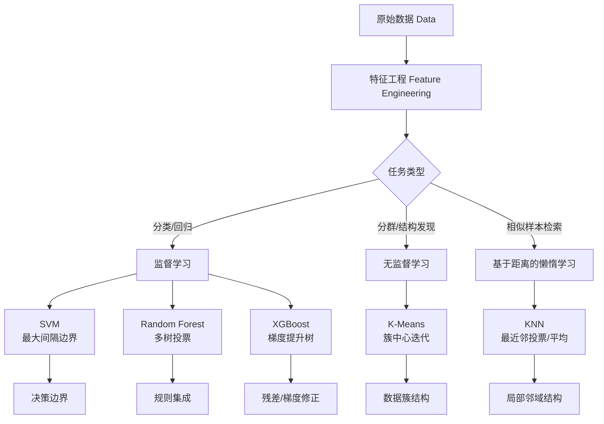
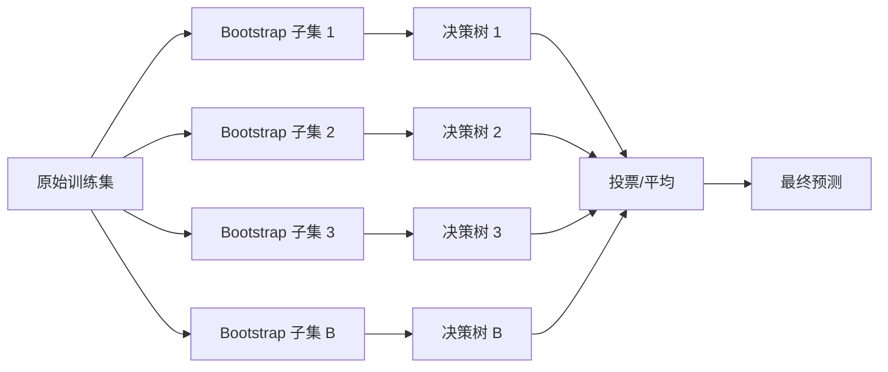
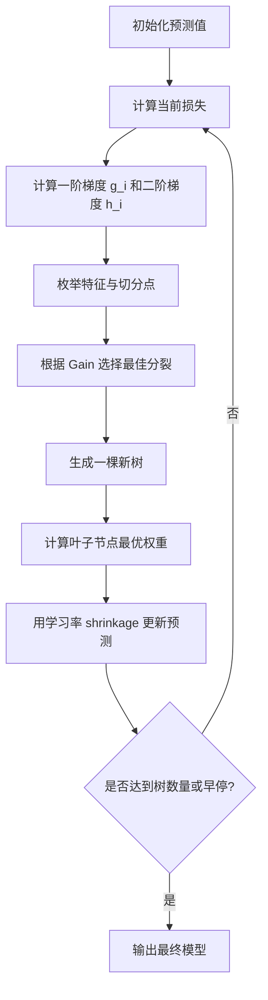
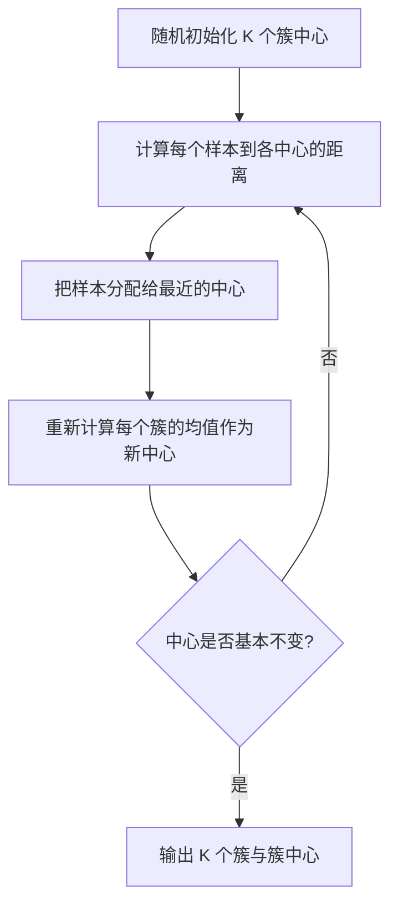
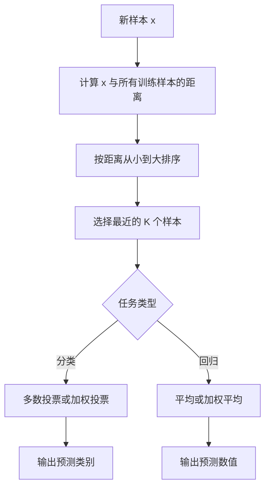
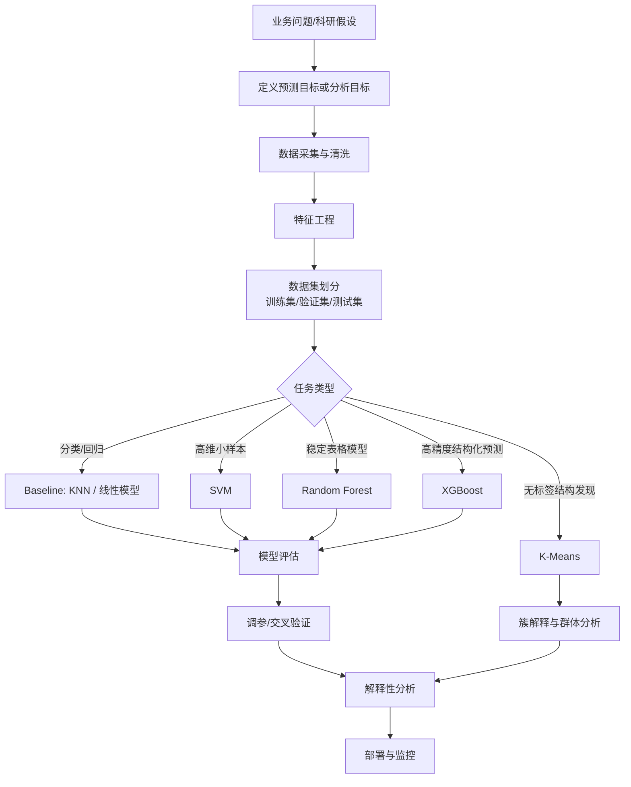
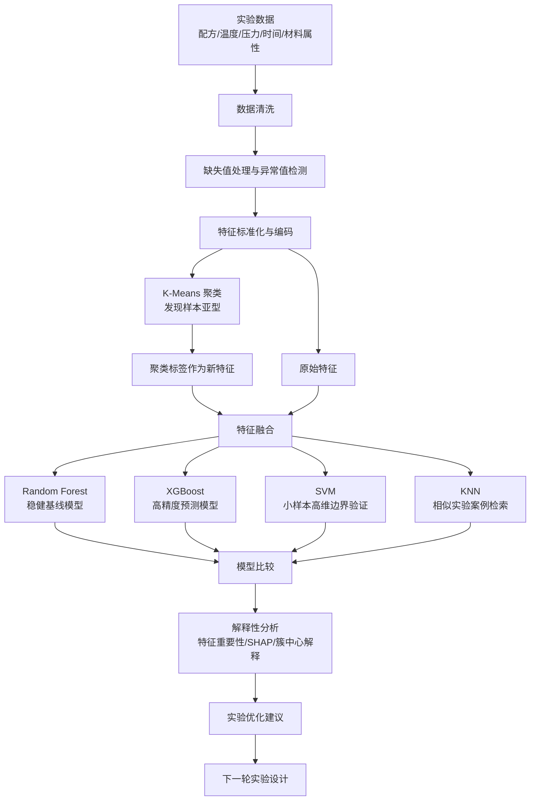

# 一文讲清楚 SVM、RF、XGBoost、K-Means 与 KNN：公式、思想、运算逻辑与实际建模架构

## 总摘要

SVM、随机森林、XGBoost、K-Means 和 KNN 是机器学习中非常经典、也非常实用的五类算法。它们看似分散，其实可以用一条主线串起来：

**机器学习的本质，是从数据中找到一种“结构”：边界、规则、梯度方向、簇中心或邻域关系。**

SVM 寻找的是**最大间隔分类边界**；随机森林寻找的是**多个随机决策树共同投票形成的稳定规则**；XGBoost 寻找的是**一棵棵树对前一轮错误的梯度修正**；K-Means 寻找的是**数据内部的簇中心结构**；KNN 则不显式训练模型，而是在预测时寻找**离目标样本最近的一批历史样本**。

从建模角度看：

| 算法      | 类型       | 核心思想               | 适合场景            | 关键超参数                                            |
| ------- | -------- | ------------------ | --------------- | ------------------------------------------------ |
| SVM     | 监督学习     | 最大化分类间隔，必要时通过核函数升维 | 小中样本、高维、边界清晰    | `C`、`kernel`、`gamma`                             |
| RF      | 监督学习     | 多棵随机树投票，降低方差       | 表格数据、特征较多、鲁棒建模  | `n_estimators`、`max_depth`、`max_features`        |
| XGBoost | 监督学习     | 梯度提升树，用二阶梯度逐步修正误差  | 结构化数据竞赛、风控、预测系统 | `learning_rate`、`max_depth`、`lambda`、`subsample` |
| K-Means | 无监督学习    | 根据距离把样本分到最近的簇中心    | 用户分群、图像压缩、特征聚类  | `K`、初始化方式、迭代次数                                   |
| KNN     | 监督/非参数学习 | 找最近邻样本投票或平均        | 小规模样本、推荐、相似案例检索 | `K`、距离度量、权重方式                                    |

---

## 1. 先建立统一视角：机器学习到底在优化什么？

无论是分类、回归还是聚类，机器学习通常都在解决一个问题：

> 给定数据 $X$，找到一个函数、结构或规则，使得模型在已知数据上表现好，同时对未知数据也具有泛化能力。

对于监督学习，训练数据一般写作：

$$
D = {(x_i, y_i)}_{i=1}^{n}
$$

其中：

* $x_i$ 是第 $i$ 个样本的特征；
* $y_i$ 是标签，可以是类别，也可以是连续数值；
* $n$ 是样本数量。

多数监督学习算法都可以抽象为经验风险最小化：

$$
\min_f \frac{1}{n}\sum_{i=1}^{n}L(y_i, f(x_i)) + \Omega(f)
$$

其中：

* $L(y_i, f(x_i))$ 是损失函数，衡量预测错得有多严重；
* $\Omega(f)$ 是正则化项，控制模型复杂度；
* $f$ 是我们要学习的预测函数。

对于无监督学习，没有标签 $y$，算法要从数据自身中发现结构：

$$
\min_{\theta} \sum_{i=1}^{n}D(x_i, \theta) + \Omega(\theta)
$$

其中 $\theta$ 可以是簇中心、隐变量、低维表示等。

---

## 2. 五种算法的总览图




> 机器学习算法总览机制图，画面中心是“数据”，向外分成三条路径：监督学习、无监督学习、基于距离的学习。监督学习下面连接 SVM、Random Forest、XGBoost；无监督学习下面连接 K-Means；基于距离的学习下面连接 KNN。每个算法旁边用简洁图标表示其核心思想：SVM 是最大间隔超平面，Random Forest 是多棵树投票，XGBoost 是逐轮修正误差的树序列，K-Means 是簇中心吸引数据点，KNN 是围绕测试点的最近邻圈层。

---

# 第一部分：SVM——用“最大间隔”寻找最稳的分类边界

## 1.1 SVM 的核心思想

SVM，全称 Support Vector Machine，支持向量机。

它的基本问题是：

> 在所有能够把两类样本分开的直线或超平面中，找到离两类样本都尽可能远的那一个。

直观来说，如果有很多条线都能把两类样本分开，SVM 不选择“刚好分开”的那条，而是选择**两边留白最大**的那条。

这个“留白”就是 **margin，间隔**。

二维空间中，分类边界是一条直线；三维空间中，是一个平面；更高维空间中，是一个超平面。

分类函数可以写成：

$$
f(x) = w^T x + b
$$

最终分类规则为：

$$
\hat{y} = \text{sign}(w^T x + b)
$$

其中：

* $w$ 决定超平面的方向；
* $b$ 决定超平面的位置；
* $\text{sign}$ 表示符号函数，大于 0 判为正类，小于 0 判为负类。

---

## 1.2 硬间隔 SVM：完全线性可分时的推导

假设标签为：

$$
y_i \in {-1, +1}
$$

我们希望所有样本都被正确分类，即：

$$
y_i(w^T x_i + b) > 0
$$

为了方便推导，SVM 把约束标准化为：

$$
y_i(w^T x_i + b) \geq 1
$$

离超平面最近的点满足：

$$
y_i(w^T x_i + b) = 1
$$

这类点就是 **支持向量**。

点到超平面的距离为：

$$
\frac{|w^Tx_i + b|}{|w|}
$$

两条间隔边界之间的宽度为：

$$
\frac{2}{|w|}
$$

所以，最大化间隔等价于最小化 $|w|$。通常写成更方便求导的形式：

$$
\min_{w,b} \frac{1}{2}|w|^2
$$

约束条件是：

$$
y_i(w^T x_i + b) \geq 1,\quad i=1,2,\dots,n
$$

这就是硬间隔 SVM 的原始优化问题。

---

## 1.3 软间隔 SVM：允许少量样本犯错

现实数据通常不是完全线性可分的。可能存在噪声点、异常点、重叠区域。此时如果强行要求所有点都分对，模型会过拟合。

于是引入松弛变量 $\xi_i$：

$$
y_i(w^T x_i + b) \geq 1 - \xi_i
$$

其中：

$$
\xi_i \geq 0
$$

新的优化目标变成：

$$
\min_{w,b,\xi} \frac{1}{2}|w|^2 + C\sum_{i=1}^{n}\xi_i
$$

这个公式很关键。

它包含两个目标：

1. $\frac{1}{2}|w|^2$：让间隔尽量大；
2. $C\sum \xi_i$：惩罚分类错误或间隔不足的样本。

其中 $C$ 是惩罚系数。

* $C$ 越大，模型越不允许犯错，边界会更贴近训练数据；
* $C$ 越小，模型更宽容，间隔更大，但可能欠拟合。

软间隔 SVM 也可以写成损失函数形式：

$$
\min_{w,b} \frac{1}{2}|w|^2 + C\sum_{i=1}^{n}\max(0, 1 - y_i(w^Tx_i+b))
$$

其中：

$$
\max(0, 1 - y_if(x_i))
$$

叫作 **hinge loss，合页损失**。

它的含义是：

* 如果样本不仅分对了，而且离边界足够远，则损失为 0；
* 如果样本分对了但离边界太近，仍然有损失；
* 如果样本分错了，损失更大。

这正是 SVM 与普通分类器的差异：
SVM 不只关心“对不对”，还关心“有没有足够安全的距离”。

---

## 1.4 核函数：SVM 为什么能处理非线性？

很多数据无法用一条直线分开。例如二维平面中的圆形分布：内圈是一类，外圈是一类。

SVM 的解决方法是：
**把数据映射到更高维空间，在高维空间里寻找线性可分超平面。**

设映射函数为：

$$
\phi(x)
$$

那么原来的内积：

$$
x_i^T x_j
$$

变成：

$$
\phi(x_i)^T\phi(x_j)
$$

但是直接计算高维映射可能非常昂贵。核函数的作用是：

$$
K(x_i, x_j) = \phi(x_i)^T\phi(x_j)
$$

也就是说，我们不需要真的把数据映射到高维，只需要计算两个样本在高维空间中的内积结果。

这就是 **kernel trick，核技巧**。

常见核函数有：

### 线性核

$$
K(x_i, x_j) = x_i^T x_j
$$

适合高维稀疏数据，例如文本分类。

### 多项式核

$$
K(x_i, x_j) = (x_i^T x_j + c)^d
$$

适合存在特征交互的场景。

### RBF 核，高斯核

$$
K(x_i, x_j) = \exp(-\gamma |x_i - x_j|^2)
$$

适合复杂非线性边界，是最常用的核函数之一。

其中 $\gamma$ 控制单个样本影响范围：

* $\gamma$ 大：影响范围小，边界更弯曲，容易过拟合；
* $\gamma$ 小：影响范围大，边界更平滑，容易欠拟合。

---

## 1.5 SVM 的最终决策函数

SVM 的对偶形式最终可以写成：

$$
f(x) = \text{sign}\left(\sum_{i=1}^{n}\alpha_i y_i K(x_i, x) + b\right)
$$

其中只有部分 $\alpha_i$ 不为 0，这些对应的训练样本就是支持向量。

所以实际上：

$$
f(x) = \text{sign}\left(\sum_{i \in SV}\alpha_i y_i K(x_i, x) + b\right)
$$

SVM 的预测只依赖支持向量，而不是所有训练样本。

这也是“支持向量机”这个名字的来源。

---

## 1.6 SVM 运算逻辑伪代码

```text
输入：训练集 D={(x_i, y_i)}, 核函数 K, 惩罚系数 C

1. 对特征进行标准化
2. 构建优化问题：
   minimize 1/2 ||w||^2 + C * sum hinge_loss
3. 使用二次规划或 SMO 方法求解 alpha_i
4. 找到 alpha_i > 0 的样本，作为支持向量
5. 根据支持向量计算偏置 b
6. 对新样本 x：
   score = sum(alpha_i * y_i * K(x_i, x)) + b
   若 score >= 0，预测为 +1
   否则预测为 -1
```

---

## 1.7 SVM 的实际使用建议

SVM 尤其适合以下情况：

* 样本量不算特别大；
* 特征维度较高；
* 类别边界比较清晰；
* 希望模型具有较强的数学可解释性；
* 需要处理小样本科研数据，例如医学组学数据、材料实验数据、文本分类等。

实际建模时要注意：

1. **特征必须标准化**
   SVM 对尺度非常敏感。如果一个特征范围是 0 到 1，另一个特征范围是 0 到 10000，距离和间隔会被大尺度特征主导。

2. **优先从线性核开始**
   如果线性核已经效果不错，就没必要使用复杂核函数。

3. **RBF 核重点调节 `C` 和 `gamma`**
   常见做法是网格搜索或贝叶斯优化。

4. **样本特别大时，核 SVM 成本较高**
   因为核方法通常需要计算样本间核矩阵，复杂度可能接近 $O(n^2)$ 甚至更高。


> 生成一张 SVM 最大间隔分类机制图。图中有二维散点数据，左上方为蓝色圆点，右下方为橙色三角点，中间有一条黑色实线表示最优分类超平面，两侧各有一条虚线表示 margin 间隔边界。靠近虚线的几个样本被高亮标记为“support vectors”。画面需要标注 margin、decision boundary、support vectors，整体风格清晰、数学感强、适合机器学习博客插图。

---

# 第二部分：Random Forest——用“多棵随机树”降低不稳定性

## 2.1 从决策树开始理解随机森林

随机森林，Random Forest，简称 RF。
它本质上是很多棵决策树的集成。

单棵决策树的逻辑很直观：

> 每次选择一个特征和一个切分点，把数据分成两部分，让分裂后的样本尽可能“纯”。

例如判断一个用户是否会流失：

```text
如果 最近30天登录次数 < 3：
    如果 客服投诉次数 > 1：
        预测：高流失风险
    否则：
        预测：中流失风险
否则：
    预测：低流失风险
```

决策树的优点是解释性强，但缺点也明显：
**单棵树很容易过拟合，对数据扰动非常敏感。**

随机森林的核心思想是：

> 不相信一棵树，而是训练很多棵彼此不同的树，然后让它们投票。

---

## 2.2 随机森林的两个“随机”

随机森林的强大来自两个随机机制。

### 第一，样本随机：Bootstrap Sampling

从原始训练集中有放回地抽样，生成不同的训练子集。

假设原始数据有 $n$ 条样本，每棵树也抽 $n$ 次。由于是有放回抽样，有些样本会被重复抽到，有些样本不会被抽到。

没有被某棵树抽到的样本叫作 **OOB 样本，Out-of-Bag 样本**。

OOB 样本可以用来估计模型的泛化误差。

### 第二，特征随机：Feature Subsampling

每个节点分裂时，不是从全部特征中找最优切分，而是随机选择一部分特征，再从这部分特征中找最优切分。

这一步非常重要。
如果每棵树都从全部特征中选择最优切分，那么很多树可能长得很像，集成效果有限。
特征随机可以降低树之间的相关性。

---

## 2.3 决策树如何选择分裂点？

分类树常用 Gini 不纯度：

$$
Gini(D) = 1 - \sum_{k=1}^{K}p_k^2
$$

其中 $p_k$ 表示当前节点中第 $k$ 类样本占比。

如果一个节点中全是同一类样本，那么：

$$
Gini(D)=0
$$

说明节点非常纯。

一次分裂会把数据集 $D$ 分成左子集 $D_L$ 和右子集 $D_R$。分裂后的加权不纯度为：

$$
Gini_{split} = \frac{|D_L|}{|D|}Gini(D_L) + \frac{|D_R|}{|D|}Gini(D_R)
$$

决策树会选择让 $Gini_{split}$ 最小的特征和切分点。

对于回归树，常用均方误差：

$$
MSE(D) = \frac{1}{|D|}\sum_{i \in D}(y_i - \bar{y})^2
$$

树会选择让分裂后总方差下降最多的切分点。

---

## 2.4 随机森林的预测逻辑

对于分类任务，每棵树输出一个类别：

$$
h_1(x), h_2(x), \dots, h_B(x)
$$

随机森林做多数投票：

$$
\hat{y} = \text{mode}{h_b(x)}_{b=1}^{B}
$$

对于回归任务，每棵树输出一个数值，随机森林取平均：

$$
\hat{y} = \frac{1}{B}\sum_{b=1}^{B}h_b(x)
$$

其中 $B$ 是树的数量。

---

## 2.5 随机森林为什么能提升效果？

单棵决策树的特点是：

* 偏差可能较低；
* 方差很高；
* 对训练数据扰动敏感。

随机森林通过平均多个弱相关模型，降低整体方差。

如果每棵树的预测误差彼此不完全相关，那么平均之后误差会被抵消。

从偏差-方差角度理解：

$$
Error = Bias^2 + Variance + Noise
$$

随机森林主要降低的是：

$$
Variance
$$

这就是为什么它比单棵树稳定得多。

---

## 2.6 随机森林机制图



---

## 2.7 随机森林伪代码

```text
输入：训练集 D，树数量 B，每次分裂候选特征数 m

for b = 1 to B:
    1. 从 D 中有放回抽样，得到 D_b
    2. 用 D_b 训练一棵决策树：
       while 当前节点还能继续分裂:
           a. 随机选择 m 个候选特征
           b. 在这些特征中寻找最佳切分点
           c. 分裂节点
    3. 保存第 b 棵树

预测新样本 x：
    分类：让所有树投票，取票数最多的类别
    回归：取所有树预测值的平均
```

---

## 2.8 随机森林的实际使用建议

随机森林在工程中非常常用，尤其适合结构化表格数据。它有几个明显优势：

1. **对异常值相对鲁棒**
   多棵树投票可以缓解个别异常样本的影响。

2. **不强依赖特征缩放**
   与 SVM、KNN 不同，树模型通常不需要标准化。

3. **可以处理非线性特征关系**
   决策树天然可以表达非线性和特征交互。

4. **可以给出特征重要性**
   常见有两类：

   * 基于 impurity decrease 的重要性；
   * 基于 permutation 的重要性。

5. **不容易过拟合到单一噪声模式**
   但如果树太深、数据噪声太大，仍然可能过拟合。

常见调参方向：

* `n_estimators`：树越多越稳定，但训练和预测更慢；
* `max_depth`：限制树深度，控制过拟合；
* `min_samples_leaf`：叶子节点最少样本数，增大它可以让模型更平滑；
* `max_features`：每次分裂考虑的特征数，越小树之间差异越大。


>  Random Forest 随机森林机制图。左侧是一个训练数据表格，中间分裂成多个 bootstrap 数据子集，每个子集训练一棵不同形状的决策树。右侧把多棵树的预测结果汇聚到一个投票箱，最终输出分类结果。

---

# 第三部分：XGBoost——用“梯度提升树”逐轮修正错误

## 3.1 XGBoost 和随机森林有什么不同？

随机森林和 XGBoost 都是树模型集成，但思想完全不同。

随机森林是：

> 多棵树并行训练，每棵树独立，最后投票或平均。

XGBoost 是：

> 一棵树接着一棵树训练，后一棵树专门修正前面模型的错误。

可以简单理解为：

```text
随机森林：大家同时做题，然后投票决定答案。
XGBoost：第一个人先答，第二个人看第一个人错在哪里并修正，第三个人继续修正前两个人的错误。
```

---

## 3.2 Boosting 的基本思想

假设模型由多棵树相加：

$$
\hat{y}*i = \sum*{k=1}^{K} f_k(x_i)
$$

其中：

* $f_k$ 是第 $k$ 棵树；
* $K$ 是树的数量；
* $\hat{y}_i$ 是第 $i$ 个样本的预测值。

第 $t$ 轮训练时，新模型为：

$$
\hat{y}_i^{(t)} = \hat{y}_i^{(t-1)} + f_t(x_i)
$$

也就是说，第 $t$ 棵树不是从零开始预测，而是在已有预测基础上增加一个修正项。

---

## 3.3 XGBoost 的目标函数

XGBoost 的目标函数由两部分组成：

$$
Obj = \sum_{i=1}^{n}l(y_i, \hat{y}*i) + \sum*{k=1}^{K}\Omega(f_k)
$$

第一部分是损失函数：

$$
\sum_{i=1}^{n}l(y_i, \hat{y}_i)
$$

衡量预测误差。

第二部分是正则化项：

$$
\sum_{k=1}^{K}\Omega(f_k)
$$

控制树的复杂度，防止过拟合。

对于一棵树 $f$，正则项通常写成：

$$
\Omega(f)=\gamma T + \frac{1}{2}\lambda \sum_{j=1}^{T}w_j^2
$$

其中：

* $T$ 是叶子节点数量；
* $w_j$ 是第 $j$ 个叶子的分数；
* $\gamma$ 惩罚叶子节点数量，树越复杂惩罚越大；
* $\lambda$ 惩罚叶子权重，控制叶子输出不要过大。

---

## 3.4 二阶泰勒展开：XGBoost 的关键推理

第 $t$ 轮目标函数为：

$$
Obj^{(t)} = \sum_{i=1}^{n}l(y_i, \hat{y}_i^{(t-1)} + f_t(x_i)) + \Omega(f_t)
$$

直接优化这个目标并不方便。XGBoost 使用二阶泰勒展开近似损失函数。

对每个样本定义：

$$
g_i = \frac{\partial l(y_i, \hat{y}_i^{(t-1)})}{\partial \hat{y}_i^{(t-1)}}
$$

$$
h_i = \frac{\partial^2 l(y_i, \hat{y}_i^{(t-1)})}{\partial (\hat{y}_i^{(t-1)})^2}
$$

其中：

* $g_i$ 是一阶梯度，表示当前预测往哪个方向错；
* $h_i$ 是二阶梯度，表示误差曲率，告诉模型修正时要多谨慎。

二阶近似后：

$$
Obj^{(t)} \approx \sum_{i=1}^{n}\left[g_i f_t(x_i) + \frac{1}{2}h_i f_t^2(x_i)\right] + \Omega(f_t)
$$

这一步非常重要。
它把“训练一棵新树”转化成了一个可以根据梯度统计量计算增益的问题。

---

## 3.5 叶子节点的最优权重

假设一棵树有 $T$ 个叶子节点。第 $j$ 个叶子上的样本集合为 $I_j$。

定义：

$$
G_j = \sum_{i \in I_j}g_i
$$

$$
H_j = \sum_{i \in I_j}h_i
$$

则第 $j$ 个叶子的目标函数部分为：

$$
G_jw_j + \frac{1}{2}(H_j+\lambda)w_j^2
$$

对 $w_j$ 求导：

$$
\frac{\partial Obj}{\partial w_j} = G_j + (H_j+\lambda)w_j
$$

令导数为 0：

$$
G_j + (H_j+\lambda)w_j = 0
$$

得到最优叶子权重：

$$
w_j^* = -\frac{G_j}{H_j+\lambda}
$$

这说明一个叶子的输出由该叶子内部样本的一阶梯度和二阶梯度共同决定。

---

## 3.6 分裂增益公式

当一个节点被分裂成左子节点和右子节点时，XGBoost 会计算分裂带来的收益：

$$
Gain = \frac{1}{2}\left[
\frac{G_L^2}{H_L+\lambda}
+
\frac{G_R^2}{H_R+\lambda}-

\frac{G^2}{H+\lambda}
\right] - \gamma
$$

其中：

* $G_L, H_L$ 是左子节点的一阶、二阶梯度和；
* $G_R, H_R$ 是右子节点的一阶、二阶梯度和；
* $G, H$ 是分裂前节点的一阶、二阶梯度和；
* $\gamma$ 是增加一个叶子节点的复杂度惩罚。

如果 $Gain > 0$，说明这次分裂值得做。
如果 $Gain \leq 0$，说明分裂带来的收益不足以抵消复杂度惩罚。

这就是 XGBoost 为什么通常比普通 GBDT 更稳：
它不是只看误差下降，还显式惩罚模型复杂度。

---

## 3.7 XGBoost 训练流程图



---

## 3.8 XGBoost 伪代码

```text
输入：训练集 D，损失函数 l，树数量 K，学习率 eta

初始化预测值 y_hat

for t = 1 to K:
    1. 对每个样本计算：
       g_i = 一阶梯度
       h_i = 二阶梯度

    2. 从根节点开始构建一棵树：
       while 节点可继续分裂:
           a. 枚举候选特征与切分点
           b. 计算分裂增益 Gain
           c. 选择 Gain 最大的分裂
           d. 若 Gain 不足，停止分裂

    3. 对每个叶子节点计算最优权重：
       w_j = -G_j / (H_j + lambda)

    4. 更新预测：
       y_hat = y_hat + eta * f_t(x)

输出：所有树的加和模型
```

---

## 3.9 XGBoost 的实际使用建议

XGBoost 特别适合结构化数据，例如：

* 金融风控评分；
* 用户转化率预测；
* 销售额预测；
* 医疗风险预测；
* 工业质量检测；
* 科研实验条件与结果之间的非线性建模。

它的优势是：

1. **精度通常很强**
   尤其在表格数据上，经常是强基线模型。

2. **能处理非线性和特征交互**
   树结构天然表达“如果 A 特征大于某阈值，并且 B 特征小于某阈值”的组合规则。

3. **正则化机制完善**
   包括树复杂度、叶子权重、学习率、行采样、列采样等。

4. **可以处理缺失值方向**
   XGBoost 会在训练时学习缺失值默认走左子树还是右子树。

5. **可解释性工具成熟**
   可以配合特征重要性、SHAP 值、部分依赖图等进行解释。

常见调参思路：

* `learning_rate` 小一些，`n_estimators` 多一些，通常更稳；
* `max_depth` 控制树的复杂度；
* `subsample` 和 `colsample_bytree` 控制随机性，降低过拟合；
* `lambda` 和 `alpha` 控制正则化；
* 使用验证集 early stopping 防止训练过头。


>  XGBoost 梯度提升机制图。画面从左到右展示多棵树按顺序排列，第一棵树给出初始预测，第二棵树修正第一棵树的残差，第三棵树继续修正前两棵树的错误。每棵树下方有箭头表示“gradient correction”，最终多个树的输出相加得到最终预测。

---

# 第四部分：K-Means——用“簇中心”发现数据结构

## 4.1 K-Means 是什么？

K-Means 是经典无监督聚类算法。
它不需要标签，而是直接根据样本之间的距离，把数据分成 $K$ 个簇。

它要解决的问题是：

> 给定一批样本，找到 $K$ 个中心点，使得每个样本都尽量靠近某个中心点。

假设有样本：

$$
X = {x_1, x_2, \dots, x_n}
$$

希望分成 $K$ 个簇：

$$
C_1, C_2, \dots, C_K
$$

每个簇有一个中心：

$$
\mu_1, \mu_2, \dots, \mu_K
$$

K-Means 的优化目标是：

$$
\min_{{C_k}, {\mu_k}}
\sum_{k=1}^{K}\sum_{x_i \in C_k}|x_i - \mu_k|^2
$$

这个目标叫作 **簇内平方误差和**，也叫 Within-Cluster Sum of Squares，简称 WCSS。

它的含义是：

> 所有样本到自己所属簇中心的距离平方之和尽可能小。

---

## 4.2 K-Means 的两个步骤

K-Means 的训练过程非常简单，反复执行两个步骤。

### 第一步：分配样本

把每个样本分给距离最近的簇中心：

$$
c_i = \arg\min_{k}|x_i - \mu_k|^2
$$

其中 $c_i$ 表示样本 $x_i$ 被分到第几个簇。

### 第二步：更新中心

每个簇的中心更新为该簇所有样本的均值：

$$
\mu_k = \frac{1}{|C_k|}\sum_{x_i \in C_k}x_i
$$

为什么是均值？

因为对于一个簇 $C_k$，我们要最小化：

$$
\sum_{x_i \in C_k}|x_i - \mu_k|^2
$$

对 $\mu_k$ 求导：

$$
\frac{\partial}{\partial \mu_k}\sum_{x_i \in C_k}|x_i - \mu_k|^2 = 0
$$

可以得到：

$$
\mu_k = \frac{1}{|C_k|}\sum_{x_i \in C_k}x_i
$$

也就是说，均值正是使簇内平方距离最小的中心点。

---

## 4.3 K-Means 机制图



---

## 4.4 K-Means 伪代码

```text
输入：样本 X，簇数量 K

1. 初始化 K 个簇中心 mu_1, ..., mu_K

repeat:
    2. 对每个样本 x_i：
       计算它到所有簇中心的距离
       将 x_i 分配给最近的簇中心

    3. 对每个簇 C_k：
       用簇内样本均值更新中心 mu_k

until 簇中心变化很小，或达到最大迭代次数

输出：每个样本的簇标签，以及 K 个簇中心
```

---

## 4.5 K-Means 的 SVG 动图示例

下面这段 SVG 可以作为博客中的机制动图雏形，表达“簇中心移动、样本被吸引”的过程。

```svg
<svg width="900" height="520" viewBox="0 0 900 520" xmlns="http://www.w3.org/2000/svg">
  <defs>
    <linearGradient id="bg" x1="0" y1="0" x2="1" y2="1">
      <stop offset="0%" stop-color="#ffffff"/>
      <stop offset="100%" stop-color="#eef6ff"/>
    </linearGradient>

    <filter id="shadow" x="-20%" y="-20%" width="140%" height="140%">
      <feDropShadow dx="0" dy="6" stdDeviation="8" flood-color="#1e3a8a" flood-opacity="0.16"/>
    </filter>

    <marker id="arrowBlue" markerWidth="10" markerHeight="10" refX="8" refY="3" orient="auto">
      <path d="M0,0 L8,3 L0,6 Z" fill="#2563eb"/>
    </marker>

    <marker id="arrowOrange" markerWidth="10" markerHeight="10" refX="8" refY="3" orient="auto">
      <path d="M0,0 L8,3 L0,6 Z" fill="#f97316"/>
    </marker>
  </defs>

  <rect width="900" height="520" rx="18" fill="url(#bg)"/>

  <!-- Title -->
  <text x="40" y="55" font-size="28" font-family="Arial, sans-serif" font-weight="700" fill="#0f172a">
    K-Means Clustering Mechanism
  </text>
  <text x="40" y="83" font-size="15" font-family="Arial, sans-serif" fill="#475569">
    Assignment step → centroid update → convergence
  </text>

  <!-- Plot area -->
  <rect x="60" y="115" width="620" height="340" rx="16" fill="#ffffff" stroke="#c7d2fe" stroke-width="1.5" filter="url(#shadow)"/>

  <!-- Grid -->
  <g stroke="#e5e7eb" stroke-width="1">
    <line x1="110" y1="130" x2="110" y2="435"/>
    <line x1="170" y1="130" x2="170" y2="435"/>
    <line x1="230" y1="130" x2="230" y2="435"/>
    <line x1="290" y1="130" x2="290" y2="435"/>
    <line x1="350" y1="130" x2="350" y2="435"/>
    <line x1="410" y1="130" x2="410" y2="435"/>
    <line x1="470" y1="130" x2="470" y2="435"/>
    <line x1="530" y1="130" x2="530" y2="435"/>
    <line x1="590" y1="130" x2="590" y2="435"/>

    <line x1="75" y1="170" x2="665" y2="170"/>
    <line x1="75" y1="220" x2="665" y2="220"/>
    <line x1="75" y1="270" x2="665" y2="270"/>
    <line x1="75" y1="320" x2="665" y2="320"/>
    <line x1="75" y1="370" x2="665" y2="370"/>
    <line x1="75" y1="420" x2="665" y2="420"/>
  </g>

  <!-- Voronoi / decision boundary -->
  <path d="M360 125 C345 190, 350 260, 374 335 C388 380, 398 420, 405 455"
        fill="none" stroke="#94a3b8" stroke-width="2.5" stroke-dasharray="8 8"/>
  <text x="390" y="148" font-size="13" font-family="Arial" fill="#64748b">
    evolving cluster boundary
  </text>

  <!-- Blue cluster region -->
  <ellipse cx="190" cy="250" rx="145" ry="115" fill="#3b82f6" opacity="0.07"/>
  <!-- Orange cluster region -->
  <ellipse cx="505" cy="260" rx="135" ry="110" fill="#f97316" opacity="0.08"/>

  <!-- Blue points -->
  <g fill="#3b82f6" stroke="#1d4ed8" stroke-width="1.2">
    <circle cx="120" cy="180" r="6"/>
    <circle cx="155" cy="215" r="6"/>
    <circle cx="205" cy="175" r="6"/>
    <circle cx="245" cy="230" r="6"/>
    <circle cx="135" cy="285" r="6"/>
    <circle cx="210" cy="305" r="6"/>
    <circle cx="270" cy="275" r="6"/>
    <circle cx="185" cy="255" r="6"/>
    <circle cx="250" cy="160" r="6"/>
  </g>

  <!-- Orange points -->
  <g fill="#f97316" stroke="#c2410c" stroke-width="1.2">
    <circle cx="455" cy="180" r="6"/>
    <circle cx="505" cy="205" r="6"/>
    <circle cx="560" cy="170" r="6"/>
    <circle cx="595" cy="235" r="6"/>
    <circle cx="470" cy="300" r="6"/>
    <circle cx="530" cy="325" r="6"/>
    <circle cx="590" cy="305" r="6"/>
    <circle cx="510" cy="265" r="6"/>
    <circle cx="445" cy="245" r="6"/>
  </g>

  <!-- Attraction lines -->
  <g stroke="#2563eb" stroke-width="1.4" stroke-dasharray="5 5" opacity="0.55" marker-end="url(#arrowBlue)">
    <line x1="120" y1="180" x2="196" y2="237"/>
    <line x1="155" y1="215" x2="196" y2="237"/>
    <line x1="205" y1="175" x2="196" y2="237"/>
    <line x1="245" y1="230" x2="196" y2="237"/>
    <line x1="210" y1="305" x2="196" y2="237"/>
  </g>

  <g stroke="#f97316" stroke-width="1.4" stroke-dasharray="5 5" opacity="0.55" marker-end="url(#arrowOrange)">
    <line x1="455" y1="180" x2="520" y2="246"/>
    <line x1="505" y1="205" x2="520" y2="246"/>
    <line x1="560" y1="170" x2="520" y2="246"/>
    <line x1="595" y1="235" x2="520" y2="246"/>
    <line x1="530" y1="325" x2="520" y2="246"/>
  </g>

  <!-- Centroid trajectories -->
  <path d="M300 380 C260 330, 225 280, 196 237"
        fill="none" stroke="#1d4ed8" stroke-width="3" stroke-dasharray="10 8" marker-end="url(#arrowBlue)"/>
  <path d="M405 385 C450 330, 490 285, 520 246"
        fill="none" stroke="#f97316" stroke-width="3" stroke-dasharray="10 8" marker-end="url(#arrowOrange)"/>

  <!-- Moving centroids -->
  <g>
    <circle r="15" fill="#1d4ed8" stroke="#ffffff" stroke-width="4">
      <animate attributeName="cx" values="300;250;215;196;196" dur="4s" repeatCount="indefinite"/>
      <animate attributeName="cy" values="380;320;270;237;237" dur="4s" repeatCount="indefinite"/>
    </circle>
    <text x="168" y="225" font-size="13" font-family="Arial" fill="#1e40af" font-weight="700">μ₁</text>
  </g>

  <g>
    <circle r="15" fill="#ea580c" stroke="#ffffff" stroke-width="4">
      <animate attributeName="cx" values="405;455;495;520;520" dur="4s" repeatCount="indefinite"/>
      <animate attributeName="cy" values="385;330;285;246;246" dur="4s" repeatCount="indefinite"/>
    </circle>
    <text x="535" y="240" font-size="13" font-family="Arial" fill="#c2410c" font-weight="700">μ₂</text>
  </g>

  <!-- Axis labels -->
  <line x1="78" y1="435" x2="650" y2="435" stroke="#334155" stroke-width="1.5"/>
  <line x1="78" y1="435" x2="78" y2="135" stroke="#334155" stroke-width="1.5"/>
  <text x="635" y="425" font-size="14" font-family="Arial" fill="#334155">feature 1</text>
  <text x="88" y="150" font-size="14" font-family="Arial" fill="#334155">feature 2</text>

  <!-- Right explanation panel -->
  <rect x="710" y="115" width="150" height="340" rx="16" fill="#ffffff" stroke="#bfdbfe" stroke-width="1.5" filter="url(#shadow)"/>

  <text x="730" y="150" font-size="18" font-family="Arial" font-weight="700" fill="#0f172a">
    Iterative Process
  </text>

  <g font-family="Arial" font-size="14" fill="#334155">
    <circle cx="730" cy="185" r="6" fill="#3b82f6"/>
    <text x="745" y="190">Assign samples</text>

    <circle cx="730" cy="225" r="6" fill="#f97316"/>
    <text x="745" y="230">Update centroids</text>

    <circle cx="730" cy="265" r="6" fill="#64748b"/>
    <text x="745" y="270">Move boundary</text>

    <circle cx="730" cy="305" r="6" fill="#22c55e"/>
    <text x="745" y="310">Repeat until stable</text>
  </g>

  <rect x="728" y="345" width="112" height="72" rx="10" fill="#eff6ff" stroke="#bfdbfe"/>
  <text x="742" y="372" font-size="13" font-family="Arial" fill="#1e3a8a">
    minimize
  </text>
  <text x="742" y="398" font-size="18" font-family="Georgia" fill="#1e293b">
    Σ ||xᵢ − μₖ||²
  </text>

  <!-- Bottom caption -->
  <text x="105" y="490" font-size="16" font-family="Arial" fill="#334155">
    Points are assigned to the nearest centroid; each centroid moves toward the mean of its assigned samples.
  </text>
</svg>
```

---

## 4.6 K-Means 的实际使用建议

K-Means 非常适合以下任务：

* 用户分群；
* 客户价值分层；
* 图像颜色压缩；
* 文档主题粗聚类；
* 工业传感器状态聚类；
* 科研实验样本的无监督分组；
* 作为下游模型的特征工程。

例如，在业务建模中，可以先用 K-Means 给用户分群：

```text
用户行为特征 -> K-Means 分群 -> 群体标签 -> 加入 XGBoost/RF 模型
```

这样模型不仅能使用原始特征，还能使用“用户属于哪种行为模式”这一高层结构特征。

K-Means 使用时要注意：

1. **必须指定 K 值**
   常见方法包括肘部法、轮廓系数、业务解释性判断。

2. **对特征尺度敏感**
   因为它基于距离，所以通常需要标准化。

3. **对初始中心敏感**
   不同初始化可能得到不同结果。实际中常用 K-Means++ 改善初始化。

4. **适合球形簇**
   如果数据簇是长条形、环形或密度差异很大，K-Means 可能效果不好。

5. **对异常值敏感**
   因为均值会被极端值拉动。


> K-Means 聚类过程图。画面分为三栏：第一栏显示随机初始化的三个簇中心，散点尚未清晰分组；第二栏显示每个数据点根据距离被分配到最近的中心，使用不同颜色表示三个簇；第三栏显示簇中心移动到各簇均值位置，簇结构变得清晰。

---

# 第五部分：KNN——不训练模型，只相信“最近的邻居”

## 5.1 KNN 的核心思想

KNN，全称 K-Nearest Neighbors，K 近邻算法。

它的思想非常朴素：

> 要判断一个新样本属于哪一类，就看它附近最近的 K 个样本大多数属于哪一类。

如果是分类任务，KNN 做投票；
如果是回归任务，KNN 做平均。

它与很多算法不同。
SVM、RF、XGBoost 都会在训练阶段学习一个模型，而 KNN 几乎没有显式训练过程。

KNN 的训练只是：

```text
把训练数据存起来。
```

真正的计算发生在预测阶段。

---

## 5.2 KNN 分类公式

对于一个待预测样本 $x$，先找到距离它最近的 $K$ 个训练样本：

$$
N_K(x)
$$

分类时，预测类别为：

$$
\hat{y} = \arg\max_c \sum_{i \in N_K(x)} I(y_i = c)
$$

其中：

* $N_K(x)$ 表示 $x$ 的 K 个最近邻；
* $I(y_i=c)$ 是指示函数，如果邻居 $i$ 属于类别 $c$，则为 1，否则为 0。

也可以使用距离加权投票：

$$
\hat{y} = \arg\max_c \sum_{i \in N_K(x)} w_i I(y_i=c)
$$

常见权重为：

$$
w_i = \frac{1}{d(x,x_i)+\epsilon}
$$

距离越近，权重越大。

---

## 5.3 KNN 回归公式

对于回归任务，KNN 预测最近邻标签的平均值：

$$
\hat{y} = \frac{1}{K}\sum_{i \in N_K(x)} y_i
$$

如果使用距离加权：

$$
\hat{y} = \frac{\sum_{i \in N_K(x)}w_i y_i}{\sum_{i \in N_K(x)}w_i}
$$

---

## 5.4 距离度量

KNN 的核心是距离。常见距离有：

### 欧氏距离

$$
d(x_i,x_j)=\sqrt{\sum_{m=1}^{p}(x_{im}-x_{jm})^2}
$$

适合连续数值特征。

### 曼哈顿距离

$$
d(x_i,x_j)=\sum_{m=1}^{p}|x_{im}-x_{jm}|
$$

适合网格路径、稀疏特征或对异常值稍微稳健的场景。

### 余弦距离

$$
\cos(x_i,x_j)=\frac{x_i^Tx_j}{|x_i||x_j|}
$$

常用于文本向量、推荐系统、语义向量检索。

---

## 5.5 KNN 的 K 值如何影响模型？

K 值非常关键。

当 $K=1$ 时，模型只看最近的一个邻居。
这样模型很灵活，但容易受噪声影响。

当 $K$ 很大时，模型会参考更多邻居。
这样更稳定，但可能把局部结构抹平。

从偏差-方差角度看：

* 小 $K$：低偏差，高方差，容易过拟合；
* 大 $K$：高偏差，低方差，容易欠拟合。

通常可以通过交叉验证选择合适的 $K$。

---

## 5.6 KNN 机制图



---

## 5.7 KNN 伪代码

```text
输入：训练集 D={(x_i, y_i)}，邻居数 K，距离函数 d

训练阶段：
    保存所有训练样本

预测阶段：
    1. 对新样本 x：
       计算 x 与每个训练样本 x_i 的距离 d(x, x_i)

    2. 将距离从小到大排序

    3. 选择距离最近的 K 个样本

    4. 若是分类：
       对 K 个邻居的标签进行投票
       输出票数最多的类别

    5. 若是回归：
       对 K 个邻居的标签取平均或加权平均
       输出预测值
```

---

## 5.8 KNN 的实际使用建议

KNN 适合：

* 样本量较小的问题；
* 相似案例检索；
* 推荐系统原型；
* 医学相似病例检索；
* 缺失值填补；
* 异常检测；
* embedding 向量检索；
* 作为复杂模型前的 baseline。

KNN 使用时要注意：

1. **必须标准化特征**
   KNN 依赖距离，不同尺度会严重影响结果。

2. **高维空间中效果可能下降**
   维度越高，样本之间的距离越趋同，这叫“维度灾难”。

3. **预测阶段计算成本高**
   朴素 KNN 预测一个样本需要和所有训练样本计算距离，复杂度约为：

   $$
   O(np)
   $$

   其中 $n$ 是训练样本数，$p$ 是特征维度。

4. **可以用索引结构加速**
   如 KD-Tree、Ball-Tree、近似最近邻 ANN 等。


>  KNN 分类机制图。二维平面上有蓝色圆点和橙色三角点，中间有一个黑色星形点表示待预测样本。以黑色星形点为圆心画出一个半透明圆圈，圈内包含 K 个最近邻样本。图中用箭头或标注说明“nearest neighbors vote”，最后显示预测类别由邻居多数决定。

---

# 第六部分：K-Means 和 KNN 为什么名字像，但本质不同？

K-Means 和 KNN 都依赖距离，因此名字和直觉上容易混淆。
但它们解决的问题完全不同。

| 对比项    | K-Means     | KNN             |
| ------ | ----------- | --------------- |
| 学习类型   | 无监督学习       | 监督学习，也可用于检索     |
| 是否需要标签 | 不需要         | 需要标签            |
| 核心目标   | 找簇中心        | 找最近邻            |
| 训练阶段   | 需要迭代更新簇中心   | 基本只保存数据         |
| 预测阶段   | 判断样本离哪个簇中心近 | 找离样本最近的 K 个训练样本 |
| 输出     | 簇编号         | 类别或数值           |
| 典型应用   | 用户分群、聚类分析   | 分类、回归、相似样本检索    |

可以这样记：

```text
K-Means：用 K 个中心解释一堆无标签数据。
KNN：用 K 个邻居预测一个新样本标签。
```

---

# 第七部分：五种算法的深入对比

## 7.1 从“模型是否显式训练”看

| 算法      | 是否显式训练模型 | 模型形态      |
| ------- | -------- | --------- |
| SVM     | 是        | 支持向量与分类边界 |
| RF      | 是        | 多棵决策树     |
| XGBoost | 是        | 顺序相加的提升树  |
| K-Means | 是        | K 个簇中心    |
| KNN     | 否，主要存储数据 | 训练样本集合    |

KNN 常被称为 **lazy learning，懒惰学习**，因为它把主要计算推迟到了预测阶段。

---

## 7.2 从“决策边界形状”看

* SVM 线性核：边界是线性超平面；
* SVM RBF 核：边界可以非常非线性；
* RF：边界是许多树切分形成的阶梯状区域；
* XGBoost：边界也是树结构切分，但逐轮修正，更偏向高精度；
* KNN：边界由局部邻居决定，可能非常不规则；
* K-Means：不是分类边界，而是最近中心形成的 Voronoi 区域。

---

## 7.3 从“是否需要特征缩放”看

| 算法      | 是否强烈需要标准化 | 原因           |
| ------- | --------- | ------------ |
| SVM     | 需要        | 间隔和核函数依赖特征尺度 |
| KNN     | 需要        | 距离计算依赖尺度     |
| K-Means | 需要        | 距离和均值更新依赖尺度  |
| RF      | 通常不需要     | 树模型按特征阈值切分   |
| XGBoost | 通常不需要     | 树模型按特征阈值切分   |

---

## 7.4 从“可解释性”看

| 算法        | 可解释性             |
| --------- | ---------------- |
| SVM 线性核   | 较好，可看特征权重        |
| SVM RBF 核 | 较弱，边界较复杂         |
| RF        | 中等，可看特征重要性和单棵树   |
| XGBoost   | 中等，需要配合 SHAP 等工具 |
| K-Means   | 较好，可解释簇中心        |
| KNN       | 局部可解释，可查看最近邻样本   |

---

# 第八部分：实际工作中的建模架构

真实项目中，很少只使用一个算法。更常见的做法是把这些算法放进一个完整建模流水线中。

## 8.1 通用建模流水线



---

## 8.2 在业务项目中怎么组合这些算法？

一个完整的用户流失预测项目可以这样设计：

```text
第一步：收集用户行为数据
    登录次数、购买次数、停留时长、投诉次数、优惠券使用情况等

第二步：用 K-Means 做用户分群
    例如分成：高活跃高价值用户、低活跃沉默用户、价格敏感用户等

第三步：把分群标签作为新特征
    用户原始特征 + K-Means 群体标签

第四步：训练监督模型
    使用 Random Forest 建立稳健基线
    使用 XGBoost 进一步提升精度
    使用 SVM 检查高维特征下的边界表现

第五步：模型解释
    使用特征重要性或 SHAP 分析关键流失因素

第六步：业务落地
    对高风险用户推送挽留策略
    对不同聚类群体设计不同运营方案
```

这种架构的关键不是“哪个算法最强”，而是：

> 用 K-Means 发现结构，用 RF 建立稳健基线，用 XGBoost 追求高精度，用 SVM 处理高维边界，用 KNN 做相似案例解释或召回。

---

## 8.3 在科研工作中怎么使用？

在科研中，这些算法可以承担不同角色。

### SVM：适合小样本、高维实验数据

例如：

* 基因表达分类；
* 蛋白质特征分类；
* 材料性质判别；
* 医学影像特征分类；
* 小样本疾病诊断模型。

这类任务常见特点是：

```text
样本数少，特征数多，数据昂贵，解释边界重要。
```

SVM 尤其适合作为强基线。

---

### Random Forest：适合变量筛选和非线性关系探索

RF 可以用于：

* 初步筛选重要特征；
* 判断变量与结果之间是否存在非线性关系；
* 构建稳健预测模型；
* 对噪声较大的实验数据进行鲁棒建模。

科研中可以先用 RF 找到重要变量，再进入更精细的因果分析、统计建模或机制实验。

---

### XGBoost：适合高性能预测与复杂特征交互

XGBoost 适合：

* 多因素实验结果预测；
* 临床风险评分；
* 结构化表格数据建模；
* 工艺参数优化；
* 药物活性预测；
* 材料性能预测。

它的优势是能捕捉复杂非线性关系。
但科研中使用时要特别注意解释性，不能只报告准确率，还要分析模型依据。

---

### K-Means：适合探索未知分组

K-Means 可用于：

* 样本亚型发现；
* 病人群体分层；
* 细胞群体粗聚类；
* 行为模式分群；
* 实验条件聚类；
* 特征模式归纳。

聚类结果不应直接当作真理，而应结合领域知识验证。

---

### KNN：适合相似案例推理

KNN 在科研中很适合做：

* 相似病例检索；
* 相似材料配方查找；
* 相似实验条件推荐；
* 缺失值填补；
* embedding 空间中的相似样本召回。

尤其在大模型和向量数据库流行之后，KNN 思想仍然非常重要。很多检索增强系统的底层思想，本质上就是在向量空间中做最近邻搜索。

---

# 第九部分：推荐的实际建模策略

## 9.1 分类任务

可以按如下顺序建模：

```text
1. 数据清洗与特征标准化
2. 建立简单 baseline
3. 使用 RF 作为稳健树模型基线
4. 使用 XGBoost 追求更高精度
5. 如果样本少、维度高，重点尝试 SVM
6. 使用 KNN 做局部解释或相似样本检索
7. 通过交叉验证和独立测试集确认泛化能力
```

评价指标可根据任务选择：

* 类别平衡：Accuracy；
* 类别不平衡：Precision、Recall、F1、AUC；
* 医疗筛查：Recall 和灵敏度更重要；
* 风控审批：Precision、Recall、KS、AUC 都要关注。

---

## 9.2 回归任务

推荐流程：

```text
1. 先用 KNN 回归或线性模型建立 baseline
2. 使用 Random Forest 回归捕捉非线性
3. 使用 XGBoost 回归进一步提升精度
4. 分析残差分布
5. 使用特征重要性解释模型
6. 对关键变量做敏感性分析
```

常见指标：

$$
MAE = \frac{1}{n}\sum_{i=1}^{n}|y_i-\hat{y}_i|
$$

$$
MSE = \frac{1}{n}\sum_{i=1}^{n}(y_i-\hat{y}_i)^2
$$

$$
RMSE = \sqrt{MSE}
$$

$$
R^2 = 1 - \frac{\sum_i(y_i-\hat{y}_i)^2}{\sum_i(y_i-\bar{y})^2}
$$

---

## 9.3 聚类任务

推荐流程：

```text
1. 明确聚类目的：分群、压缩、探索还是下游特征
2. 对特征进行标准化
3. 使用 PCA / UMAP 做可视化辅助理解
4. 使用 K-Means 尝试不同 K 值
5. 用肘部法和轮廓系数选择 K
6. 分析每个簇的中心特征
7. 给每个簇命名，并结合业务或科研知识解释
8. 将簇标签作为后续监督模型特征
```

轮廓系数可以帮助评价聚类质量：

$$
s(i)=\frac{b(i)-a(i)}{\max(a(i),b(i))}
$$

其中：

* $a(i)$ 是样本 $i$ 到同簇其他样本的平均距离；
* $b(i)$ 是样本 $i$ 到最近其他簇样本的平均距离。

$s(i)$ 越接近 1，说明聚类越合理。

---

# 第十部分：一个完整的组合架构案例

假设我们要做一个“科研实验结果预测 + 样本分型”的项目。

目标是根据实验参数预测最终产物性能，同时发现样本是否存在潜在亚型。

可以采用如下架构：



这个架构的优点是：

* K-Means 负责发现隐藏分组；
* RF 提供稳健 baseline；
* XGBoost 提供高精度预测；
* SVM 检查高维小样本下的边界；
* KNN 提供相似案例支持；
* 解释性分析帮助科研人员理解变量影响；
* 最终结果反哺下一轮实验设计。

> 图像生成提示词：
> 生成一张“机器学习科研建模架构图”。左侧是实验数据输入，包括配方、温度、压力、时间、材料属性等特征；中间经过数据清洗、特征工程、K-Means 样本分型；随后分成四个模型分支：Random Forest 稳健基线、XGBoost 高精度预测、SVM 小样本高维分类、KNN 相似案例检索；右侧汇总到模型解释、实验优化建议和下一轮实验设计。整体风格为科研流程图、白底蓝色线条、专业、适合论文方法部分或技术博客。

---

# 第十一部分：如何选择算法？

可以用下面这套经验规则。

## 11.1 数据量不大、特征维度很高

优先考虑：

```text
SVM，尤其是线性 SVM 或 RBF SVM
```

典型场景：

* 文本分类；
* 生物信息学；
* 医学小样本；
* 高维传感器数据。

---

## 11.2 表格数据，需要稳定强基线

优先考虑：

```text
Random Forest
```

它鲁棒、调参相对简单、不需要复杂预处理。

---

## 11.3 表格数据，需要追求更高精度

优先考虑：

```text
XGBoost
```

它通常需要更细致调参，但性能上限更高。

---

## 11.4 没有标签，只想发现数据结构

优先考虑：

```text
K-Means
```

但要注意 K 值选择、标准化和聚类解释。

---

## 11.5 需要基于相似样本做判断

优先考虑：

```text
KNN
```

尤其适合：

* 相似案例检索；
* 推荐系统原型；
* 小样本分类；
* 向量空间检索。

---

# 结语：五种算法背后的统一思想

这五种算法代表了机器学习中五种非常重要的建模哲学。

SVM 相信：

> 好的边界应该离两类样本都尽可能远。

随机森林相信：

> 单个模型不可靠，多个随机模型集体决策更稳定。

XGBoost 相信：

> 模型应该一轮一轮地修正错误，并且每一步都控制复杂度。

K-Means 相信：

> 数据内部存在若干中心结构，样本可以围绕中心形成簇。

KNN 相信：

> 一个样本的答案，可以从它最相似的历史样本中推断出来。

在实际工作和科研中，真正重要的不是机械地背公式，而是理解每个算法的“建模假设”：

* 数据是否有标签？
* 边界是否清晰？
* 特征是否高维？
* 样本量是否足够？
* 是否需要解释？
* 是否需要分群？
* 是否需要相似案例？
* 是否要部署到实时系统？

当你能根据这些问题选择算法，就不再是在“套模型”，而是在设计一套真正面向问题的建模系统。
