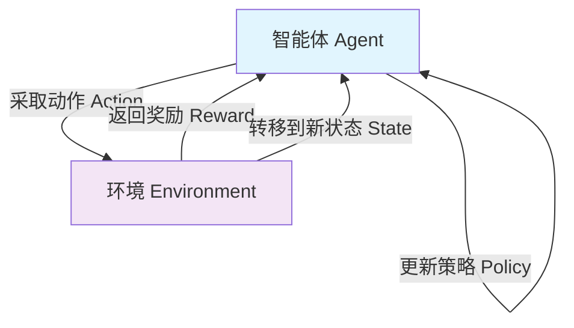

# 强化学习系列第一篇：从试错到智能——强化学习导论与核心框架

> 系列前言：本系列旨在系统梳理强化学习的知识体系，从基础概念到核心算法，逐步深入。这是第一篇，聚焦于强化学习的入门导论与核心框架。

---

## 一、什么是强化学习？

想象一下你正在教一只小狗学会“坐下”这个指令。每当小狗正确坐下时，你给予一块零食作为奖励；当它没有反应时，你什么都不给。经过多次尝试，小狗逐渐明白了“坐下”这个动作与零食之间的关联，学会在听到指令后坐下。

强化学习（Reinforcement Learning, RL）的本质正是如此——**智能体（Agent）通过与环境的持续交互，依据获得的奖励信号来调整自身行为策略，最终学会在特定情境下做出最优决策**。

作为机器学习的三大范式之一，强化学习与监督学习、无监督学习有着本质区别：

- **监督学习**依赖标注好的数据集，像老师拿着标准答案教学生；
- **无监督学习**在无标签数据中发现隐藏结构，像探险家在未知地形中绘制地图；
- **强化学习**则通过“试错-反馈”机制学习，像运动员在比赛中不断调整动作以赢得比赛。

强化学习的核心机制可以概括为：**试错（Trial-and-Error）** ——学习者在序列中依次尝试动作，获得反馈，并据此改进未来的决策。

## 二、一段值得铭记的历史

2025年3月，强化学习领域迎来了历史性时刻——安德鲁·巴托（Andrew Barto）和理查德·萨顿（Richard Sutton）因在强化学习领域的开创性贡献获得了图灵奖。这对师徒在20世纪80年代初便开始将强化学习构建为一个通用问题框架，他们共同开发了时序差分学习、策略梯度方法等基础算法。萨顿与巴托合著的《Reinforcement Learning: An Introduction》被誉为强化学习的“圣经”。

然而，强化学习的思想远早于20世纪80年代：

- **1950年**，图灵就提出过基于奖惩机制的机器学习方法；
- **1951年**，明斯基搭建了SNARC——一个用真空管构建的神经网络装置，通过强化学习机制让系统学会走迷宫；
- **1954年**，法利和克拉克在IBM计算机上首次实现了强化学习的程序化模拟；
- **1959年**，萨缪尔的跳棋程序成为强化学习早期最著名的成功案例。

20世纪80至90年代，强化学习一度被学界冷落。但萨顿始终坚信这一方向的潜力。事实证明他是对的——从AlphaGo击败人类棋手，到ChatGPT背后的RLHF（基于人类反馈的强化学习），强化学习已成为当代人工智能最核心的技术支柱之一。

## 三、强化学习的核心要素

强化学习系统由以下几个核心要素构成：

### 3.1 智能体（Agent）与环境（Environment）

**智能体**是学习和决策的主体；**环境**是智能体交互的对象，智能体无法直接操控环境，只能通过动作施加影响。

### 3.2 状态（State）与观察（Observation）

**状态**是对环境完整信息的描述；**观察**则是智能体受限于感知能力所能获取到的信息片段。

环境可分为两类：
- **完全可观测环境**：智能体可获取全部信息（如国际象棋）；
- **部分可观测环境**：智能体只能获得局部信息（如《超级马里奥》）。

### 3.3 动作（Action）与动作空间（Action Space）

**动作**是智能体在某个状态下可以采取的行为。所有可能动作的集合称为**动作空间**，可分为：
- **离散动作空间**：有限可数的动作（如游戏按键）；
- **连续动作空间**：理论上有无限可能（如方向盘转角）。

### 3.4 奖励（Reward）与回报（Return）

**奖励**是环境给予智能体的即时反馈信号。但强化学习的终极目标并非最大化即时奖励，而是最大化**累积奖励**——即**回报（Return）**。

设从时刻 $t$ 开始的奖励序列为 $r_{t+1}, r_{t+2}, r_{t+3}, \dots$，回报 $G_t$ 定义为：

$$G_t = r_{t+1} + \gamma r_{t+2} + \gamma^2 r_{t+3} + \cdots = \sum_{k=0}^{\infty} \gamma^k r_{t+k+1}$$

其中 $\gamma \in [0,1]$ 是**折扣因子**，体现了未来奖励的重要性：
- $\gamma$ 接近 0：智能体“短视”，只关注即时奖励；
- $\gamma$ 接近 1：智能体“有远见”，同等重视未来奖励。

### 3.5 策略（Policy）

**策略**定义了智能体在特定状态下的行为方式——即从状态到动作的映射。策略可以是确定性的（给定状态，总是输出同一个动作），也可以是随机性的（给定状态，输出一个动作的概率分布）。

---

下图展示了强化学习的基本交互循环：

---

## 四、马尔可夫决策过程——强化学习的数学框架

强化学习的问题可以形式化为**马尔可夫决策过程（Markov Decision Process, MDP）** 。

### 4.1 马尔可夫性质

**马尔可夫性质**：在时序过程中，$t+1$ 时刻的状态只依赖于 $t$ 时刻的状态，与 $t$ 时刻之前的任何状态无关。

$$P(S_{t+1} | S_t) = P(S_{t+1} | S_1, S_2, \dots, S_t)$$

### 4.2 MDP的五元组

MDP由五元组 $(S, A, P, R, \gamma)$ 定义：

- **$S$**：有限状态集合；
- **$A$**：有限动作集合；
- **$P$**：状态转移概率 $P(s'|s,a)$，即在状态 $s$ 执行动作 $a$ 后转移到 $s'$ 的概率；
- **$R$**：奖励函数 $R(s,a)$；
- **$\gamma$**：折扣因子。

MDP的核心在于**状态转移概率**——它量化了环境的不确定性，将MDP与确定性系统区分开来。

### 4.3 价值函数与贝尔曼方程

**状态价值函数** $v_\pi(s)$ 表示在策略 $\pi$ 下，从状态 $s$ 出发的期望回报：

$$v_\pi(s) = \mathbb{E}_\pi[G_t | S_t = s]$$

通过推导（将回报展开并利用期望的线性性质），可以得到**贝尔曼方程**：

$$v_\pi(s) = \mathbb{E}_\pi[R_{t+1} + \gamma v_\pi(S_{t+1}) | S_t = s]$$

这个方程是强化学习的核心：它将当前状态的价值表示为**即时奖励**加上**折扣后的未来状态价值**。换句话说，贝尔曼方程建立了当前价值与未来价值之间的递归关系——这正是强化学习算法能够通过迭代更新来逼近最优策略的数学基础。

类似地，**动作价值函数** $q_\pi(s,a)$ 表示在状态 $s$ 执行动作 $a$ 后遵循策略 $\pi$ 的期望回报：

$$q_\pi(s,a) = \mathbb{E}_\pi[G_t | S_t = s, A_t = a]$$

强化学习的终极目标就是找到**最优策略** $\pi^*$，使得在所有状态下的期望回报都达到最大：

$$v_*(s) = \max_\pi v_\pi(s)$$

$$q_*(s,a) = \max_\pi q_\pi(s,a)$$

### 4.4 MDP与强化学习的关系

需要明确的是：**MDP是问题陈述（环境的数学模型），强化学习是当环境动力学（转移概率）不完全已知时用于求解问题的方法**。如果转移概率已知，可以通过动态规划直接求解；但在大多数现实问题中，转移概率是未知的，智能体必须通过与环境的实际交互来学习。

## 五、探索与利用的平衡

强化学习中最核心的困境之一是**探索-利用权衡（Exploration-Exploitation Dilemma）** 。

- **利用（Exploitation）** ：根据已有知识选择当前认为最优的动作；
- **探索（Exploration）** ：尝试未知动作以获取更多信息，可能发现更优策略。

如果一味利用，可能陷入次优解；如果过度探索，则难以积累有效经验。如何平衡二者，是强化学习算法设计的核心问题之一。

最经典的解决方案是 **$\epsilon$-greedy** 策略：

$$\pi(a|s) = \begin{cases} 1 - \epsilon + \frac{\epsilon}{|A|} & \text{若 } a = \arg\max_{a'} Q(s,a') \\ \frac{\epsilon}{|A|} & \text{否则} \end{cases}$$

即：以 $1-\epsilon$ 的概率选择当前最优动作（利用），以 $\epsilon$ 的概率随机选择动作（探索）。$\epsilon$ 通常随时间衰减——训练初期多探索，后期多利用。

$\epsilon$-greedy 虽简单，却是最常用的探索策略之一。更高级的探索方法包括：基于奖励对比的动态探索控制、基于自编码器的探索率自适应调整等。

---

## 六、强化学习的应用全景

强化学习的应用已从游戏延伸至多个关键领域：

- **游戏AI**：AlphaGo、AlphaZero 等里程碑式成果；
- **机器人控制**：学习复杂运动技能与操作；
- **自动驾驶**：决策控制与路径规划；
- **工业控制与过程优化**：生产调度、资源分配；
- **推荐系统与在线广告**：个性化内容与广告投放优化；
- **大语言模型对齐**：RLHF 已成为 ChatGPT 等模型训练的关键技术；
- **医疗健康**：动态治疗方案设计。

## 七、本篇小结

本文作为系列的第一篇，完成了以下奠基工作：

1. 明确了强化学习的定义——通过试错与奖励信号学习的范式；
2. 回顾了从图灵到图灵奖的发展历程；
3. 系统梳理了智能体、环境、状态、动作、奖励、策略等核心要素；
4. 引入了马尔可夫决策过程这一数学框架，并推导了贝尔曼方程；
5. 讨论了探索与利用的经典权衡及 $\epsilon$-greedy 策略；
6. 展示了强化学习广泛的应用场景。

理解这些基础概念和框架，是后续深入算法的前提。下一篇中，我们将进入**动态规划与表格型强化学习**——从策略迭代、价值迭代开始，逐步展开蒙特卡洛方法、时序差分学习，以及经典的 Q-learning 和 SARSA 算法。

---

> **📚 延伸阅读与参考资源**
> - Sutton R.S., Barto A.G. *Reinforcement Learning: An Introduction* (2nd Edition)
> - 上海交通大学《强化学习》讲义
> - Toquebiau M. et al. *An Introduction to Deep Reinforcement Learning* (2025)
> - 2025年图灵奖相关报道