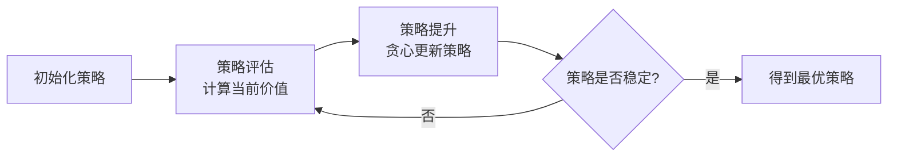

# 强化学习系列第二篇：从蓝图到试错——动态规划、蒙特卡洛与时序差分学习

> 系列回顾：上一篇我们建立了强化学习的“世界观”——智能体、环境、MDP框架与贝尔曼方程。但有了地图（MDP）还不够，我们还需要具体的“行路方式”。本篇将系统梳理求解MDP的三类核心方法：基于模型的动态规划、以及无模型的蒙特卡洛与时序差分学习，并最终引出两个最经典的表格型控制算法——SARSA与Q-learning。

---

### 一、从“已知”走向“未知”

在上一篇的MDP五元组 $(S, A, P, R, \gamma)$ 中，**状态转移概率 $P$** 与**奖励函数 $R$** 是否已知，将强化学习问题一刀切为两个世界：

- **已知环境模型（Model-Based）**：智能体知道在状态 $s$ 执行动作 $a$ 后，转移到 $s'$ 的概率和获得的奖励。此时求解最优策略可依赖**动态规划（Dynamic Programming, DP）**。
- **未知环境模型（Model-Free）**：智能体对环境的“物理规律”一无所知，只能通过实际或模拟的**交互经验**来学习。此时需要**蒙特卡洛（Monte Carlo, MC）** 或**时序差分（Temporal-Difference, TD）** 方法。

现实世界几乎都是“未知”的，但动态规划为后续算法提供了完美的数学骨架——理解它，就理解了所有价值迭代算法的底层逻辑。

---

### 二、动态规划：已知世界的最优蓝图

当 $P$ 和 $R$ 完全已知时，强化学习问题退化为一个可计算的规划问题。动态规划通过贝尔曼方程，将复杂的最优策略求解拆解为重复利用子问题的最优解。

#### 2.1 策略迭代（Policy Iteration）

策略迭代分为两个交替进行的步骤：

**1. 策略评估（Policy Evaluation）**：给定策略 $\pi$，计算其状态价值函数 $v_\pi$。利用贝尔曼期望方程进行“全宽备份”：

$$v_{k+1}(s) = \sum_{a \in A} \pi(a|s) \sum_{s', r} P(s', r|s, a) \big[ r + \gamma v_k(s') \big]$$

反复迭代直到 $v_k$ 收敛至 $v_\pi$。

**2. 策略提升（Policy Improvement）**：基于当前 $v_\pi$，在每个状态选择能使动作价值最大的动作，构造贪心策略 $\pi'(s) = \arg\max_a q_\pi(s, a)$。

策略迭代的流程如下：



#### 2.2 价值迭代（Value Iteration）

策略迭代需要每次评估至收敛，计算开销较大。**价值迭代**将两者融合：不再等待策略评估完全收敛，而是在一次遍历后立即进行策略提升。

其核心是贝尔曼最优方程的迭代形式：

$$v_{k+1}(s) = \max_a \sum_{s', r} P(s', r|s, a) \big[ r + \gamma v_k(s') \big]$$

价值迭代直接将 $v_k$ 推向最优价值 $v_*$。当 $v_{k+1}$ 与 $v_k$ 的差距足够小时，从中提取贪心策略即为最优策略。

> **使用技巧**：动态规划在状态空间巨大时面临“维度灾难”，在实际工程中极少直接使用，但它**教会我们一个核心思想——通过自举（Bootstrapping）利用后续状态的价值来更新当前状态**，这一思想被TD算法完美继承。

---

### 三、蒙特卡洛方法：用平均回报代替期望

当环境模型未知时，我们无法像DP那样“预见”未来状态。蒙特卡洛方法另辟蹊径：**让智能体与环境交互完整的一轮（Episode），记录整条轨迹的真实回报 $G_t$，用多次采样的平均回报来估计状态价值**。

在MC中，价值更新公式为：

$$V(S_t) \leftarrow V(S_t) + \alpha \big[ G_t - V(S_t) \big]$$

其中 $\alpha$ 为步长参数。MC方法有两个关键变体：
- **首次访问MC**：在一轮中只统计状态 $s$ 首次出现时的回报；
- **每次访问MC**：统计状态 $s$ 每次出现时的回报。

MC方法的核心思想是**用完整的观测抵消环境随机性**——正如大数定律所保证的，当采样轮数趋近无穷时，样本平均收敛于期望。

**但MC有一个致命局限**：它必须等到整轮交互结束才能更新价值，这意味着它**无法处理持续性任务（无终止状态的连续过程）**，且学习速度极慢。

> **深层理解**：MC的更新目标 $G_t$ 是真实回报的无偏估计，但方差极大（因为多步随机性累加）。这引出了一个核心权衡：**偏差与方差的博弈**。

---

### 四、时序差分：强化学习的“灵魂算法”

时序差分（TD）结合了DP的**自举性**和MC的**采样性**。它不再等待整轮结束，而是**在每步交互后立即用即时奖励 $R_{t+1}$ 和下一状态的价值估计来更新当前状态**。

TD(0) 的更新公式为：

$$V(S_t) \leftarrow V(S_t) + \alpha \big[ R_{t+1} + \gamma V(S_{t+1}) - V(S_t) \big]$$

其中 $R_{t+1} + \gamma V(S_{t+1})$ 被称为 **TD目标**，而 $\delta_t = R_{t+1} + \gamma V(S_{t+1}) - V(S_t)$ 被称为 **TD误差**。

#### 4.1 MC与TD的对比：一个直观场景

假设通勤上班，每天的路况决定到达时间。MC相当于：“等完整到达公司后，回顾全程，觉得今早出门那个时刻的估值偏低了。” 而TD相当于：“开了10分钟后看到前方路况，立刻修正对出门时刻的估值预测。”

| 特性 | 蒙特卡洛 | 时序差分 |
| :--- | :--- | :--- |
| 更新时机 | 整轮结束后 | 每步之后 |
| 目标值 | $G_t$（真实回报，无偏） | $R + \gamma V(S')$（估计值，有偏） |
| 方差 | 高（多步随机性叠加） | 低（仅依赖单步） |
| 适用场景 | 回合制任务 | 连续性任务与回合制任务 |

> **一个被反复验证的实践经验**：TD在大多数随机环境中比MC收敛更快，因其低方差特性更适合在线学习。这也是TD成为现代强化学习算法基石的深层原因。

---

### 五、无模型控制：SARSA 与 Q-learning

预测（求 $v_\pi$）是基础，控制（求 $\pi_*$）才是终极目标。在无模型环境下，我们需要直接从动作价值 $Q(s, a)$ 入手。

#### 5.1 SARSA：同轨策略（On-policy）的谨慎学习者

SARSA 的更新直接使用了五元组 $(S_t, A_t, R_{t+1}, S_{t+1}, A_{t+1})$：

$$Q(S_t, A_t) \leftarrow Q(S_t, A_t) + \alpha \big[ R_{t+1} + \gamma Q(S_{t+1}, A_{t+1}) - Q(S_t, A_t) \big]$$

**关键特征**：SARSA 在更新价值时，使用 **当前策略 $\pi$ 实际选择的** $A_{t+1}$ 来构建 TD 目标。这意味着它评估并改进的是**它正在执行的同一个策略**——因此称为“同轨策略”。

**算法思想**：SARSA 像一个谨慎的驾驶员，在考虑变道时，会先“想象”如果打了方向盘会发生什么，并据此更新对当前决策的评价。它会把探索带来的危险（如撞车）也纳入价值评估，因此学到的策略会自然地规避高风险动作。

其流程可直观表示为：

```mermaid
graph TD
    A[状态 S_t] --> B[按策略选 A_t]
    B --> C[执行动作, 得 R_{t+1}, 进入 S_{t+1}]
    C --> D[按策略选 A_{t+1}]
    D --> E[更新 Q S_t, A_t]
    E --> F[S_t = S_{t+1}, A_t = A_{t+1}]
    F --> A
```

#### 5.2 Q-learning：离轨策略（Off-policy）的激进学习者

Q-learning 的更新公式是强化学习史上最具标志性的方程之一：

$$Q(S_t, A_t) \leftarrow Q(S_t, A_t) + \alpha \left[ R_{t+1} + \gamma \max_a Q(S_{t+1}, a) - Q(S_t, A_t) \right]$$

**关键特征**：更新 TD 目标时，Q-learning **直接使用下一状态所有动作中价值最大的那个**，而**不管**当前策略实际会选什么动作。它评估的是“最优动作价值”，而非当前策略的价值。

**算法思想**：Q-learning 像一个激进的棋手，它直接假设自己在未来会走出最完美的一步棋，并基于这个假设来评价当下。这种行为策略（用于探索，如 $\epsilon$-greedy）与目标策略（用于优化，即贪心）的分离，使其成为一种**离轨策略（Off-policy）** 算法。

#### 5.3 直观对比

下面用Mermaid展示两者的更新目标差异：

```mermaid
graph TB
    subgraph SARSA更新目标
    S1[S_t] --> A1[A_t]
    A1 --> R1[R_{t+1}, S_{t+1}]
    R1 --> A1_next[A_{t+1} 由当前策略产生]
    A1_next --> Target1[R + γ Q S_{t+1}, A_{t+1}]
    end

    subgraph Q-learning更新目标
    S2[S_t] --> A2[A_t]
    A2 --> R2[R_{t+1}, S_{t+1}]
    R2 --> Target2[R + γ max_a Q S_{t+1}, a]
    end
```

> **使用技巧**：
> - **SARSA 更“安全”**，在训练过程中会规避致命陷阱（如悬崖行走问题），适合在线安全敏感任务。
> - **Q-learning 更“大胆”**，它会学习到最优路径，即使该路径在训练初期因探索而容易坠崖，只要 $\epsilon$ 衰减得当，最终能收敛到最优。
> - **实际应用中**，当 $\epsilon$ 趋于 0 时，两种算法最终收敛于同一最优策略，但收敛路径与鲁棒性截然不同。

---

### 六、本篇小结与经验之谈

我们从“已知”走到“未知”，从“规划”走向“学习”：

1. **动态规划** 给出了利用贝尔曼方程迭代求解的理论范式，是后续一切算法的“母体”。
2. **蒙特卡洛** 用完整采样抵消未知，但高方差和回合制限制使其应用范围有限。
3. **时序差分学习** 结合自举与采样，以低方差、在线更新的优势成为现代RL的核心引擎。
4. **SARSA 与 Q-learning** 分别代表了同轨与离轨控制的经典范式，它们的差异深刻影响着算法的探索策略与收敛鲁棒性。

**一个经常被问及的问题**：何时用SARSA，何时用Q-learning？经验上的判断准则是——**如果你希望智能体在训练过程中本身就表现得尽可能安全，选SARSA；如果你只关心最终收敛的最优策略，且允许训练过程中的“试错成本”，选Q-learning。**

当状态空间是离散且有限时，上述表格型算法优雅而高效。但在围棋、机器人控制或大语言模型对齐等问题中，状态空间是连续或天文数字的——此时必须引入函数近似，即用神经网络来替代表格。

**下一篇预告**：我们将跨入深度强化学习的领域。从 **DQN（深度Q网络）** 的价值网络过估计问题与双重DQN，到 **策略梯度方法**（REINFORCE、Actor-Critic）的直观推导，最终展望PPO等当代主流算法。我们下一篇见。

> **📚 延伸思考**
> - 试着在悬崖行走（Cliff Walking）环境中对比SARSA和Q-learning的路径差异，你会直观理解“保守”与“激进”的含义。
> - TD方法的 $\lambda$ 参数如何优雅地统一MC与TD？可进一步了解 $TD(\lambda)$ 的前向视角与后向视角。