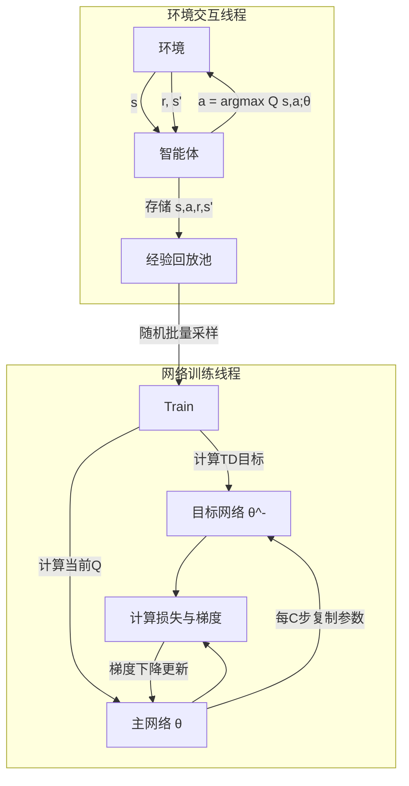

# 强化学习系列第三篇：深度强化学习崛起——DQN、策略梯度与Actor-Critic架构

> 系列回顾：前两篇我们从MDP数学框架出发，走过了动态规划、蒙特卡洛、时序差分，最终抵达了SARSA与Q-learning这两大表格型控制算法。但表格是一张“死地图”——当状态空间是连续或天文数字时（如围棋、机器人关节角、图像像素），表格将彻底失效。本篇，我们正式跨入**深度强化学习（Deep RL）** 的疆域，见证神经网络如何赋予强化学习“泛化之眼”。

---

### 一、为什么表格不再够用？

回顾Q-learning的更新公式：
$$Q(S_t, A_t) \leftarrow Q(S_t, A_t) + \alpha \left[ R_{t+1} + \gamma \max_a Q(S_{t+1}, a) - Q(S_t, A_t) \right]$$

它依赖一张巨大的表格来存储每个“状态-动作”对的价值。假设我们处理的是围棋棋盘（$19 \times 19$，每个位置三种状态），状态数高达 $3^{361}$，这比宇宙中的原子还多。更不用说自动驾驶中连续的激光雷达点云了。

**解决方案**：用带参数 $\theta$ 的函数近似器（如神经网络）来逼近价值函数或策略，即 $Q(s, a) \approx Q(s, a; \theta)$ 或 $\pi(a|s) \approx \pi(a|s; \theta)$。神经网络通过观察有限的样本，能够**泛化**到从未见过的状态，这是深度强化学习在复杂任务中取得成功的关键。

---

### 二、深度Q网络（DQN）——价值网络的革命

2013年，DeepMind提出DQN，让智能体仅凭原始像素就在Atari游戏中超越人类玩家。DQN在传统Q-learning基础上引入了两项关键技术创新，解决了神经网络在强化学习中“不稳定”和“发散”的顽疾。

#### 2.1 核心思想与损失函数

DQN通过深度神经网络参数化动作价值函数 $Q(s, a; \theta)$，其优化目标是最小化**TD误差**的平方：
$$L_i(\theta_i) = \mathbb{E}_{(s, a, r, s') \sim U(D)} \left[ \left( r + \gamma \max_{a'} Q(s', a'; \theta_i^-) - Q(s, a; \theta_i) \right)^2 \right]$$

其中 $\theta_i$ 是当前网络参数，$\theta_i^-$ 是**目标网络**参数。

#### 2.2 两大核心突破

**① 经验回放（Experience Replay）**
智能体将交互得到的四元组 $(s, a, r, s')$ 存入一个大型回放池 $D$，训练时从中**随机批量采样**。这解决了两个问题：一是打破了时序相邻样本间的强相关性（满足独立同分布假设）；二是实现了数据的重复利用，极大提升了样本效率。

**② 目标网络（Target Network）**
在计算TD目标时，DQN使用一个独立且**定期冻结更新**的目标网络 $Q(\cdot; \theta^-)$，而不是实时更新的主网络。这消除了“追逐移动目标”的反馈振荡，使训练稳定收敛。

> **算法思想提炼**：DQN证明了一条铁律——**深度网络虽强大，但在RL中直接套用监督学习的梯度下降注定失败，必须配合“延迟目标”和“打破相关性”的机制。**

#### 2.3 DQN交互与训练流程



尽管DQN取得了巨大成功，但此后人们发现它存在一个系统性问题：**过估计（Overestimation）** 。由于 $\max$ 算子会均匀地将正向误差传递，DQN倾向于高估那些被随机噪声放大的动作价值，且这种高估在价值更新中不断累积，扭曲策略。

**解决方案（Double DQN）**：将动作的选择与评估解耦——用**主网络**选择最优动作，用**目标网络**评估该动作的真实价值：
$$Y_t = R_{t+1} + \gamma Q(S_{t+1}, \arg\max_a Q(S_{t+1}, a; \theta_t); \theta_t^-)$$
这一微调被证明能大幅削减估计偏差。

---

### 三、策略梯度——直接优化行为策略

基于价值的算法（如DQN）存在天然缺陷：它们无法处理**连续动作空间**（如机器人关节力矩）；且在最优策略是随机策略时（如石头剪刀布），确定性价值函数难以表达。

策略梯度方法另起炉灶——**直接对策略 $\pi_\theta(a|s)$ 进行参数化，通过梯度上升最大化累积奖励的期望**。

#### 3.1 策略梯度定理的直观推导

设 $J(\theta)$ 为策略 $\pi_\theta$ 下的期望回报。我们要计算 $\nabla_\theta J(\theta)$ 以更新参数。直接的导数计算是不可行的，因为动作与环境转移均存在采样随机性。

策略梯度定理给出了一个极其优雅的结论：
$$\nabla_\theta J(\theta) = \mathbb{E}_{\pi_\theta} \left[ \nabla_\theta \log \pi_\theta(a|s) \cdot Q^{\pi_\theta}(s, a) \right]$$

**推导的核心理念**（摆脱繁琐数学）：
将期望回报 $\mathbb{E}[G]$ 展开为对所有轨迹求积分。对 $\theta$ 求导时，导数只作用于策略概率 $\pi_\theta$ 上。利用“似然比”技巧 $\nabla_\theta \log \pi_\theta = \frac{\nabla_\theta \pi_\theta}{\pi_\theta}$，将复杂的积分转化为**加权采样**的形式。最终，梯度只依赖于当前策略对动作选择的“对数概率”乘以该动作带来的“累积回报”。

这意味着，我们可以通过采样轨迹来**无偏估计**策略梯度，而不需要知道环境转移概率 $P$——这是无模型强化学习的又一次胜利。

#### 3.2 REINFORCE：最朴素的策略梯度

REINFORCE 是策略梯度的最原始形态。智能体先完成一整轮交互，记录轨迹，然后对每个时间步 $t$ 更新：
$$\theta \leftarrow \theta + \alpha \gamma^t G_t \nabla_\theta \log \pi_\theta(a_t|s_t)$$
即“如果某动作带来了高回报，就增加该动作被选中的对数概率”。

**致命缺陷**：高方差。$G_t$ 的随机波动极大，导致梯度更新方向极不稳定。此外，它仍需等待整轮结束，效率低下。

---

### 四、Actor-Critic（行动者-评论家）——集大成者

既然MC方法方差大，而TD方法（价值网络）方差小但有偏差，何不将两者结合？**Actor-Critic** 架构因此诞生，它已成为现代深度强化学习的标准范式。

#### 4.1 架构拆解

- **Actor（行动者）**：即策略网络 $\pi_\theta(a|s)$，负责生成动作（输出概率分布或确定性动作）。
- **Critic（评论家）**：即价值网络 $V_\phi(s)$ 或 $Q_\phi(s, a)$，负责评估当前状态或动作的好坏。

**算法思想**：Critic 实时估计 TD 误差 $\delta$ 作为“优势”信号，代替 REINFORCE 中高方差的 $G_t$；Actor 接收 Critic 的反馈信号，调整策略概率。

Actor 的更新梯度变为：
$$\nabla_\theta J(\theta) = \mathbb{E}_{\pi_\theta} \left[ \nabla_\theta \log \pi_\theta(a|s) \cdot \delta \right]$$

其中 TD 误差 $\delta = R + \gamma V_\phi(s') - V_\phi(s)$ 充当了“这个动作比平均期望好多少”的实时评价。Critic 的价值网络则通过最小化 $\delta^2$ 来更新自身参数。

#### 4.2 运行流程（基于A2C的同步版本）

```mermaid
graph TD
    S[当前状态 s] --> Actor[Actor 策略网络 π_θ]
    Actor -->|采样动作 a| Env[环境]
    Env -->|奖励 r, 下一状态 s'| Critic[Critic 价值网络 V_φ]
    S --> Critic
    
    Critic -->|计算 δ = r + γV(s') - V(s)| Advantage[优势函数 A]
    Advantage -->|指导方向| Actor
    Advantage -->|TD误差| Critic
    
    Actor -->|∇logπ_θ * A 更新| Update_A[更新 Actor]
    Critic -->|∇(δ²) 更新| Update_C[更新 Critic]
    Update_A --> S
    Update_C --> S
```

> **使用技巧**：
> - **引入熵正则化**：在Actor的损失中加上策略熵的惩罚项 $-\beta \mathcal{H}(\pi)$，鼓励探索，防止策略过早退化到局部最优。
> - **优势函数的通用表达**：除了 $A = r + \gamma V(s') - V(s)$，广义优势估计（GAE）通过引入 $\lambda$ 参数，能够平滑地在偏差与方差之间取得平衡，是目前实践中的黄金标准。

从A2C（同步）扩展到A3C（异步），通过在多个环境线程上并行采样并更新全局网络，极大提升了训练速度与样本多样性。但异步架构的调试复杂性催生了更稳定的替代方案，这些我们留待第四篇讨论。

---

### 五、临界思考：价值方法 vs 策略方法

| 维度 | 价值方法（DQN等） | 策略方法（REINFORCE等） |
| :--- | :--- | :--- |
| **动作空间** | 天然支持离散 | 天然支持连续与离散 |
| **策略形式** | 隐含地派生为 $\epsilon$-greedy | 显式建模概率分布或确定性映射 |
| **随机策略** | 难以表达 | 直接支持（完美应对非完全信息博弈） |
| **稳定性** | 相对稳定（受过估计困扰） | 方差高，需精调学习率 |
| **样本效率** | 高（经验回放复用数据） | 通常较低（依赖新采集的轨迹） |

**收敛性直觉**：在复杂环境中，纯粹的策略梯度如同“在浓雾中走路”——知道方向但每步都颤抖。纯粹的DQN如同“看着地图走路”——地图（价值）很清晰，但无法踏入没有道路的荒野（连续空间）。**Actor-Critic** 则是一位拿着罗盘（Actor）并不断扫雷探路（Critic）的探险家，完美互补。

---

### 六、本篇小结与算法谱系定位

本篇我们走完了从“离散表格”到“连续泛化”的惊险一跃：

1. **DQN** 以经验回放和目标网络解决了深度网络与自举更新的稳定性冲突，开启了深度RL的时代。
2. **策略梯度定理** 打破了价值方法的壁垒，利用似然比巧妙地避开了未知转移概率，奠定了直接策略优化的数学地基。
3. **Actor-Critic** 融合两者的优点——用低方差的TD误差驱动策略更新，成为当下乃至未来所有顶级算法的核心骨架。

---

**第四篇预告（终章）**：我们将目光投向**高级策略优化**领域。当Actor-Critic面临步长选择灾难时，**信任域策略优化（TRPO）** 与**近端策略优化（PPO）** 如何通过约束更新幅度来力挽狂澜？同时，我们还会解读**软演员-评论家（SAC）** 的最大熵强化学习思想，并最终眺望强化学习的前沿星辰——从离线强化学习到大模型时代的RLHF。我们终章见！