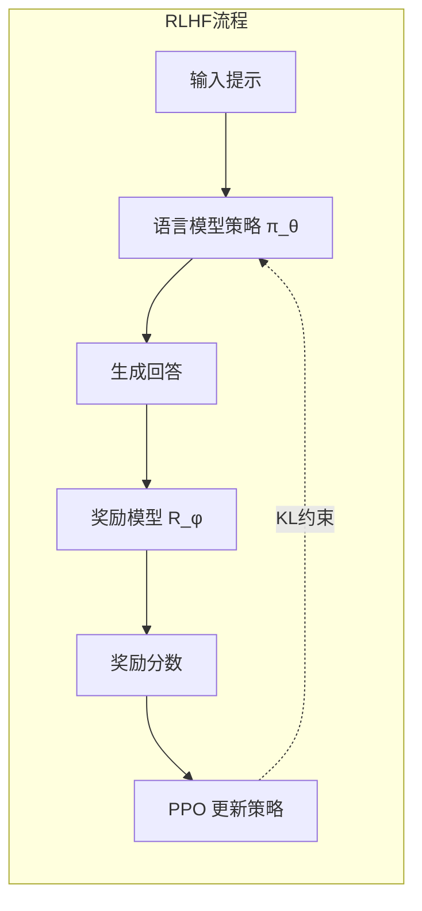
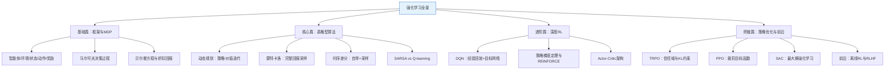

## 强化学习系列第四篇：策略优化的巅峰——从PPO到RLHF的前沿图景

> 系列终章：前三篇我们从MDP的数学骨架出发，走过表格型算法的精妙花园，再跨入深度网络的泛化旷野，最终在Actor-Critic架构处汇合。然而，Actor-Critic虽然架构优雅，却始终受困于一个幽灵——**步长选择的灾难**。本篇我们将直面这一核心难题，解析当今工业界最信赖的算法PPO、探索最大熵原理的SAC，并最终眺望强化学习的前沿：离线强化学习与大模型时代的RLHF。

---

### 一、当Actor-Critic遇上“步长诅咒”

回顾Actor-Critic的更新逻辑：策略网络 $\pi_\theta$ 沿着“优势信号”的方向梯度上升。但这里隐含着一个致命假设——我们认为当前策略与旧策略足够接近，因此用旧策略采样的数据来指导新策略的更新是合理的。

**实际问题**：如果学习率 $\alpha$ 设置不当，策略参数的一次大踏步更新，可能导致新策略 $\pi_{\text{new}}$ 与旧策略 $\pi_{\text{old}}$ 在行为分布上发生**剧烈偏移**。这种偏移会带来两个连锁灾难：
1. **采样数据失效**：Critic的价值估计基于旧策略的轨迹分布，新策略跑到一个“陌生区域”，Critic的评估彻底失准；
2. **策略崩塌（Policy Collapse）** ：一次糟糕的更新将策略推入低回报区域，而后续的采样质量越来越差，最终再也无法恢复。

传统的解决方案是“精细调参”，但在复杂环境中，这种脆弱的平衡让人心力交瘁。我们需要一种**算法层面的强约束**，保证每次更新都在“安全区”内进行。

---

### 二、TRPO：用KL散度给策略上“信任域”锁

**信任域策略优化（Trust Region Policy Optimization, TRPO）** 是第一个系统性地解决步长问题的算法。它的核心思想极其硬核：**我们不限制参数 $\theta$ 的变化幅度，而是限制策略 $\pi_\theta$ 本身的变化幅度**。

#### 2.1 约束优化目标

TRPO 构建了如下的带约束最大化问题：

$$\max_\theta \quad \mathbb{E}_{s \sim \rho_{\pi_{\text{old}}}, a \sim \pi_{\text{old}}} \left[ \frac{\pi_\theta(a|s)}{\pi_{\text{old}}(a|s)} \hat{A}(s, a) \right]$$

$$\text{s.t.} \quad \mathbb{E}_{s \sim \rho_{\pi_{\text{old}}}} \left[ D_{KL}\big(\pi_{\text{old}}(\cdot|s) \parallel \pi_\theta(\cdot|s)\big) \right] \le \delta$$

其中 $\hat{A}$ 是优势函数估计，$\delta$ 是一个极小的阈值（如0.01）。这个约束意味着：**在旧策略访问过的状态上，新策略的概率分布与旧策略的KL散度必须被锁在安全范围内**。

#### 2.2 数学实现与直观理解

TRPO 利用泰勒展开将目标函数近似为线性，将约束近似为二次型，从而将问题转化为一个“在椭球区域内寻找最大线性增量”的数学问题，并通过**共轭梯度法**高效求解。

> **深层思想**：TRPO 告诉我们——策略的“参数距离”毫无意义，真正有意义的是“行为距离”。两个参数向量相差甚远可能行为完全相同；而微小的参数变化却可能导致行为剧变。TRPO直接约束行为，本质上是对策略空间进行了“正规化”。

然而TRPO的实现复杂度极高（涉及二阶导数的共轭梯度计算），且对大规模并行训练不友好。它证明了信任域思想的正确性，却把“简化落地”的任务留给了后人。

---

### 三、PPO：用裁剪实现信任域的工业革命

**近端策略优化（Proximal Policy Optimization, PPO）** 在2017年横空出世，它用极其简洁的数学技巧实现了TRPO的约束效果，迅速成为OpenAI、DeepMind等机构的默认算法，直至今日仍是RLHF（大模型对齐）的核心引擎。

#### 3.1 重要性采样比率

定义概率比率 $r_t(\theta) = \frac{\pi_\theta(a_t|s_t)}{\pi_{\theta_{\text{old}}}(a_t|s_t)}$。当 $r_t(\theta) > 1$ 时，表示新策略更倾向于选择该动作；$r_t(\theta) < 1$ 则表示更不倾向。

原始的目标函数为 $L^{PG}(\theta) = \mathbb{E}[ r_t(\theta) \hat{A}_t ]$。如果不加限制地最大化该目标，$r_t(\theta)$ 会疯狂变大，导致前述的策略崩塌。

#### 3.2 PPO的裁剪目标函数（核心灵魂）

PPO引入了极其精妙的 **裁剪机制**：

$$L^{CLIP}(\theta) = \mathbb{E}\left[ \min \big( r_t(\theta) \hat{A}_t, \ \text{clip}(r_t(\theta), 1-\epsilon, 1+\epsilon) \hat{A}_t \big) \right]$$

- 当优势 $\hat{A} > 0$（该动作好于平均）：目标函数希望增大 $r_t$，但 $r_t$ 被上限 $1+\epsilon$ 卡住，强行阻止策略对该好动作“过度自信”。
- 当优势 $\hat{A} < 0$（该动作差于平均）：目标函数希望减小 $r_t$，但 $r_t$ 被下限 $1-\epsilon$ 卡住，强行阻止策略对该差动作“过度惩罚”。

**这等同于用一阶导数的代价，实现了二阶导数（TRPO）的安全约束效果**。$\epsilon$ 通常设置为0.1或0.2。

#### 3.3 PPO更新流程伪代码

```text
for 每次迭代 do
    for 每个并行环境 do
        用当前策略 π_θ_old 采样 T 步轨迹 {s, a, r}
        计算优势估计 Â_t (使用GAE)
    end for
    
    // 对采样数据做 K 轮小批量梯度上升（通常K=3~10）
    for 每个mini-batch do
        计算概率比率 r_t(θ) = π_θ(a|s) / π_θ_old(a|s)
        计算裁剪损失 L_CLIP
        计算价值损失 L_VF (Critic的MSE)
        计算熵奖励 S (鼓励探索)
        总损失 L = L_CLIP - c1 * L_VF + c2 * S
        反向传播更新 θ
    end for
    
    θ_old ← θ  // 更新旧策略参数
end for
```

> **使用技巧**：PPO的**“重复利用采样数据”**特性——它对同一批数据可以做多次梯度更新，这极大地提升了样本效率。但注意，如果 $K$ 过大导致 $r_t$ 频繁超出 $[1-\epsilon, 1+\epsilon]$，裁剪机制会频繁被激活，此时可以适当调小学习率。实践经验：**在大多数连续控制任务中，PPO比DQN类算法更稳定，调参工作量远小于TRPO**。

---

### 四、SAC：当“探索”被写进目标函数

PPO在策略优化上登峰造极，但在样本效率上仍显不足，尤其对于机器人控制这类昂贵交互的场景。**软演员-评论家（Soft Actor-Critic, SAC）** 另辟蹊径，引入了**最大熵强化学习**的哲学。

#### 4.1 最大熵目标

SAC不仅最大化累积奖励，还同时最大化策略的熵 $\mathcal{H}$：
$$J(\pi) = \sum_{t} \mathbb{E}_{(s_t, a_t) \sim \rho_\pi} \left[ r(s_t, a_t) + \alpha \mathcal{H}(\pi(\cdot|s_t)) \right]$$

其中 $\mathcal{H}(\pi(\cdot|s)) = -\mathbb{E}_{a \sim \pi} \log \pi(a|s)$。熵越高，策略越随机，探索越充分。

**深层思想**：传统强化学习目标是“找到最好的那条路”，而SAC的目标是“找到所有足够好的路，并最好地分散探索能量”。这使得SAC在面对多模态最优解时表现极其稳健，且因为充足的探索，它往往比PPO达到最优值需要更少的交互步数。

#### 4.2 软贝尔曼方程与自动温度调节

SAC的策略评估基于软贝尔曼方程：
$$Q(s, a) = r(s, a) + \gamma \mathbb{E}_{s' \sim p} \left[ V(s') \right]$$
其中 $V(s') = \mathbb{E}_{a' \sim \pi} [ Q(s', a') - \alpha \log \pi(a'|s') ]$（注意价值V减去了熵项）。

SAC还引入了可学习的**温度参数 $\alpha$**，通过一个独立的损失函数自动调整熵正则的强度，使策略的平均熵水平逼近一个预设的目标值——彻底解决了“熵权重”超参数难以调优的痛点。

> **使用对比**：
> - 如果任务需要“高精度、确定性动作”（如机械臂插孔），且仿真器速度快，**PPO** 更合适。
> - 如果任务涉及“复杂的探索空间”或“真实物理环境交互成本极高”（如四足机器人野外行走），**SAC** 以其卓越的样本效率和稳健的探索能力成为首选。

---

### 五、前沿眺望：离线强化学习与RLHF

#### 5.1 离线强化学习（Offline RL）

在线强化学习（如PPO）需要智能体与环境实时交互生成数据。但在医疗、自动驾驶等安全攸关场景中，在线试错是不可接受的。**离线强化学习**旨在从**静态数据集**（如人类专家演示或历史日志）中学习最优策略，训练期间不与环境交互。

**核心挑战**：分布偏移（Distributional Shift）。当策略试图查询一个在数据集中未覆盖的“陌生”动作时，价值估计会凭空产生极高方差。前沿解法包括**保守Q学习（CQL）**——在目标函数中惩罚那些陌生区域的高价值估计。

#### 5.2 RLHF：当PPO遇见大语言模型

这或许是当下强化学习最火热的前沿。**基于人类反馈的强化学习（RLHF）** 是ChatGPT、Claude等大模型实现“对齐”的秘密武器。

其流程分为三步：
1. **监督微调（SFT）**：先训练一个基础语言模型。
2. **奖励建模（Reward Modeling）**：收集人类对模型不同输出的偏好排序，训练一个奖励模型 $R_\phi$，用来“模拟”人类的喜好分数。
3. **PPO微调**：将语言模型视为策略 $\pi_\theta$，将生成文本视为动作，将奖励模型的打分视为奖励。利用 **PPO** 算法引导模型生成更高奖励的回答——同时一般会加入一个**KL惩罚项**，防止模型为了追求高奖励而过度偏离基础模型，导致输出乱码或丧失通用性。



> **趋势洞察**：RLHF的成功证明了一件事——强化学习不仅仅是“打游戏”的工具，它已经成为**让通用人工智能与人类价值观对齐**的核心方法论。

---

### 六、终章总结：全系列思维导航

至此，我们走完了强化学习的完整版图。下图以Mermaid的形式，将整个系列的知识脉络凝结为一幅思维导图：



**四篇走来，我们留下的不仅是公式与算法，更是一套思维方式**：
- **从“规划”到“学习”**（动态规划 → 无模型）是对不确定性的屈服与适应；
- **从“表格”到“网络”**是对复杂性的征服与泛化；
- **从“无约束”到“信任域”**是对算法稳定性的终极追求；
- **从“打游戏”到“对齐人类”**是强化学习从工具走向文明的宏大叙事。

强化学习远未封顶——多智能体交互、世界模型、决策基础模型等星辰大海仍在召唤。希望这一系列文章成为你航行路上的罗盘。感谢阅读，我们研究路上再会。

> **📚 进阶阅读建议**
> - PPO原始论文：*Schulman et al. Proximal Policy Optimization Algorithms* (2017)
> - SAC原始论文：*Haarnoja et al. Soft Actor-Critic* (2018)
> - RLHF经典工作：*Ouyang et al. Training language models to follow instructions with human feedback* (2022)