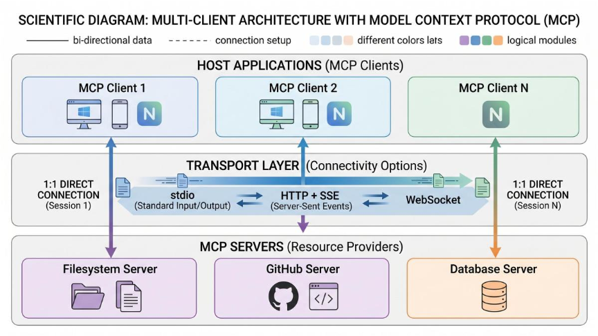
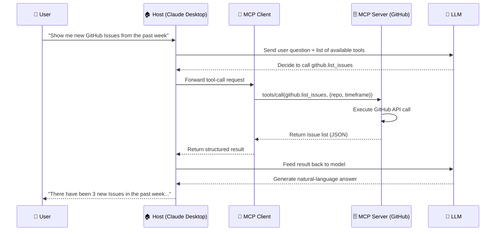
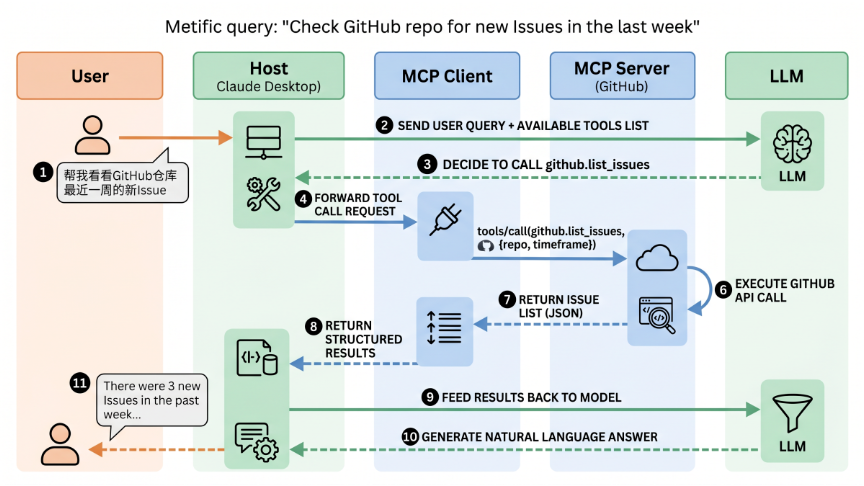

# Demystifying MCP for Large Language Models

## Foreword

If you have followed the development of large language model (LLM) applications over the past year, you have almost certainly encountered the term “MCP.” From its quiet release by Anthropic in late 2024 to its rise as one of the most talked‑about technical standards in the AI community by 2026, MCP’s trajectory has been remarkable.

But what exactly is MCP? How does it differ from Function Calling? Why are all major AI platforms—OpenAI, Google DeepMind, Microsoft—embracing it? These are likely the questions that popped into your mind the first time you heard about MCP.

This article tries to explain MCP clearly. No jargon overload, no parrot‑phrasing of official documentation. Instead, we start with one fundamental question: **why do large language models need a new protocol?** Following that thread, we will gradually unpack MCP’s architecture, core concepts, workflow, and ecosystem landscape.

After reading, you should be able to answer three questions: What problem does MCP solve? How does it work? And where is it taking AI application development?

Let’s begin.

---

## I. A Problem That Has Bothered Everyone for a Long Time

Consider a scenario.

You are building an AI coding assistant. You want it to read local code repositories, query GitHub Issues, and create tickets in Jira. So you start writing integration code—one set for Claude, another for GPT, another for Gemini. Each model has a different calling convention, and each tool requires its own integration logic.

Worse, six months later you decide to swap the underlying model from GPT‑4 to an open‑source one—and you realise you have to rewrite all the tool integrations.

This is the long‑standing **“N×M” integration dilemma** in LLM application development: with N AI models and M external tools, achieving arbitrary model‑to‑tool invocation theoretically requires maintaining N×M separate connectors. Once the API of a data source changes, or the developer switches AI models, all integration work must be redone.

Beyond this core pain point, traditional approaches introduce a host of derivative issues:

- **Data silos**: models cannot proactively fetch real‑time data, access specific databases, or control external systems;
- **Protocol fragmentation**: each platform has its own plugin format—OpenAI plugins, Anthropic tool calls, LangChain custom JSON schemas—forcing teams to re‑implement the same tool integration for every host;
- **Inconsistent security**: different integration styles produce different log formats, making it impossible for security teams to enforce a unified audit model.

These problems all point to the same conclusion: **a standardised protocol is needed**—one that makes communication between AI applications and external tools/data sources as universal as USB‑C.

MCP was born exactly out of this context.

---

## II. What Is MCP?

**Model Context Protocol (MCP)** is an open standard protocol released by Anthropic on November 25, 2024. It defines a unified communication specification and data format to enable secure, bidirectional connections between large language models and external data sources (databases, APIs, file systems) and tools (compute engines, visualisation components, etc.).

In one sentence: **MCP is the universal interface through which AI applications connect to the outside world.**

Its core promise is “**develop once, run everywhere**”—an MCP server built for GitHub can be used simultaneously by Claude Desktop, Cursor, VS Code, or even a custom enterprise AI agent.

As of 2026, adoption numbers are impressive: monthly downloads have reached 97 million, and the community has produced thousands of MCP servers covering DevOps, cloud services, and more. In November 2025, Anthropic officially transferred MCP to the Agentic AI Foundation (AAIF) under the Linux Foundation, with AWS, Google Cloud, and Microsoft immediately announcing full support.

---

## III. MCP Architecture: Three Roles, Each with Its Own Responsibility

MCP adopts a **client‑server architecture** with three core roles:

### Host

The Host is the application that runs the LLM and initiates the integration. Typical hosts include Claude Desktop, Cursor, Windsurf, and various enterprise AI gateways. The Host is responsible for:
- Creating and managing multiple MCP client instances;
- Controlling client connection permissions and lifecycles;
- Enforcing security policies and user authorisation decisions;
- Coordinating AI/LLM integration and sampling.

### Client

The Client is the protocol implementation component embedded inside the Host. Each Client maintains a **1:1 persistent connection** with one and only one Server. The Client handles:
- Protocol handshake and capability negotiation;
- Message serialisation and deserialisation;
- Managing subscriptions and notifications;
- Maintaining security boundaries between different Servers.

### Server

The Server is an independent process that provides capabilities, encapsulating a specific data source or tool. A Server can be extremely simple (e.g., a read‑only SQLite querier) or very complex (e.g., a GitHub operations agent with reasoning capabilities). The Server exposes three types of core capabilities via the MCP protocol:
- **Resources**: data, such as file contents or database records;
- **Tools**: executable operations, such as “create an Issue” or “send an email”;
- **Prompts**: reusable prompt templates.

### Design Principles

MCP’s architecture follows several key principles:

- Servers **must be extremely easy to build**; the Host bears the burden of complex orchestration.
- Servers **should be highly composable**—each server provides a focused, independent capability, and multiple servers can be seamlessly combined.
- Servers **should not be able to read the entire conversation** or “see through” other servers—each server receives only the necessary information; the full conversation history stays on the Host side.
- The protocol **supports progressive extension**—core functionality is minimal, and additional capabilities can be negotiated as needed.

It is worth noting that MCP is a **stateless protocol**: every request is self‑contained, carrying its own protocol version, client identity, and capability declaration.

---

## IV. MCP Transport Layer: How Do They “Speak”?

MCP uses **JSON‑RPC 2.0** as its message encoding format. All messages follow the JSON‑RPC specification, ensuring interoperability across languages and platforms.

MCP supports multiple transport methods:

| Transport | Use Case | Characteristics |
|-----------|----------|-----------------|
| **Stdio (Standard Input/Output)** | Local process communication, command‑line tools | Low latency, naturally isolated from network risks |
| **HTTP + SSE** | Remote services, cloud deployments | Supports streaming responses, easy integration with web ecosystems |
| **WebSocket** | Bidirectional, low‑latency communication | Suitable for real‑time interactive scenarios |

MCP’s architecture can be seen as two layers:
- **Data layer**: defines the JSON‑RPC‑based protocol, including lifecycle management, core primitives (tools, resources, prompts), and notification mechanisms;
- **Transport layer**: manages communication channels and authentication, including connection establishment, message framing, and authorisation.

---

## V. MCP Core Concepts: Tools, Resources, Prompts

MCP organises capabilities through three core primitives. Understanding these three concepts is the key to understanding what MCP can do.

### Tools

Tools are executable functions exposed by a Server. The Client can list available tools via the `tools/list` endpoint and call a tool via `tools/call`.

Tools cover a broad range—from simple weather queries and mathematical calculations to complex code execution and API interactions. A typical tool definition includes a name, a description, and a parameter schema (usually described with JSON Schema).

### Resources

Resources are data provided by a Server. They can be static (e.g., document contents) or dynamic (e.g., database query results). Resources are identified by URIs and can be retrieved by the Client on demand.

### Prompts

Prompts are reusable prompt templates. Servers can pre‑define commonly used prompt structures, which Clients can fetch and fill with parameters as needed.

---

## VI. A Complete MCP Call: From User Question to Final Answer

Let’s walk through a concrete example to illustrate MCP’s workflow.

Suppose you ask a question in Claude Desktop: “Can you show me the new Issues in my GitHub repository from the past week?”

The key steps in this flow are:

1. **Request phase**: the Host packages the user input, tool metadata, and conversation history into a structured prompt;
2. **Decision phase**: the LLM parses the prompt, decides which tool to call, and generates a structured call instruction (tool name + parameters);
3. **Execution phase**: the Client calls the corresponding MCP Server through the standardised interface; the Server performs the operation and returns the result;
4. **Integration phase**: the Host feeds the tool execution result back to the LLM, which generates the final natural‑language response.

The entire process is transparent to the user—you see only a question and an answer, while behind the scenes the Host, Client, Server, and LLM work together.

---

## VII. MCP vs Function Calling: What’s the Difference?

No discussion of MCP is complete without mentioning Function Calling. Both enable models to “call external capabilities,” but their approaches are fundamentally different.

### Function Calling: The Model Directly Outputs Instructions

Function Calling is a capability introduced by OpenAI in 2023. Its workflow is: the application sends tool definitions (function names, parameter schemas) together with the prompt to the model. The model decides which tool to call and outputs a structured format (e.g., JSON) containing the function name and parameters. The application parses that output, executes the corresponding function, and returns the result to the model.

The defining feature of Function Calling is: **the model directly outputs a specific‑format invocation instruction; the tool is bound to the model**.

### MCP: A Standardised Middle Layer

MCP takes a different approach. It inserts a **standardised middle layer** between the model and the tools. The model does not need to know the implementation details of specific tools; it communicates with the Client only via the MCP protocol, and the Client routes requests to the appropriate Server.

### Key Differences

| Dimension | Function Calling | MCP |
|-----------|------------------|-----|
| **Cross‑model compatibility** | ❌ Only for models that support this specification | ✅ Any MCP‑compatible model can use it |
| **Hot‑swappable tools** | ❌ Requires redeployment or modification of model requests | ✅ Tools can be dynamically registered/unregistered |
| **Granularity of permission control** | ⚠️ Depends on model implementation | ✅ Protocol‑level support for operation authorisation verification |
| **Cross‑device invocation** | ❌ Limited to local environment | ✅ Supports remote/cloud tool calls |

### They Are Not Substitutes

A common misconception is that MCP is going to replace Function Calling. In reality, the two can **work together**:

> User request → LLM generates a Function Call → converted into an MCP request → tool invocation

In this hybrid mode, Function Calling handles **intent parsing** (the model understands what the user wants), while MCP handles **protocol transport and tool execution** (translating the intent into concrete calls to specific tools).

In one sentence: **Function Calling is how the model “says what it wants,” while MCP is the standardised channel through which “what is wanted” is fetched.**

---

## VIII. The MCP Ecosystem: What Is Happening Now?

### Explosive Growth

MCP’s development has exceeded many expectations:

- November 2024: Anthropic releases MCP;
- June 2025: Monthly new MCP servers jump from 135 to 5,069;
- November 2025: MCP transferred to the Linux Foundation’s Agentic AI Foundation;
- March 2026: OpenAI, Google DeepMind, and Microsoft announce support;
- May 2026: GitHub MCP Registry goes live; awesome‑mcp‑servers surpasses 85,000 Stars.

### Full Embrace by Mainstream Platforms

Today, MCP has been adopted by almost all major AI platforms:

- **Claude Desktop, Claude Code**: native MCP support;
- **Cursor, Windsurf, VS Code**: MCP capabilities integrated;
- **ChatGPT Desktop**: OpenAI added MCP to ChatGPT in 2025;
- **Gemini**: Google DeepMind has announced support.

The *State of MCP* report published by Zuplo in early 2026 shows that **72% of MCP adopters expect their usage to increase over the next 12 months**, and more than half are very confident about its long‑term viability.

### A Flourishing Server Ecosystem

The range of domains covered by MCP servers is expanding rapidly:

- **Filesystem MCP Server**: extracts files from any local directory;
- **GitHub MCP Server**: manages repositories, Issues, and PRs;
- **Sentry MCP Server**: accesses production issues and errors;
- **SonarQube MCP Server**: exposes security vulnerability information;
- **Context7 MCP Server**: provides up‑to‑date technical documentation.

Academic interest is also rising quickly. The MCP‑Flow project has collected data from 1,166 servers and 11,536 tools, generating 68,733 high‑quality instruction‑function call pairs. The MCP‑Atlas benchmark includes 1,000 natural‑language tasks across 36 real‑world MCP servers and 220 tools.

---

## IX. Security Considerations: The Other Side of MCP

Any technology that lets AI “take actions” inevitably raises security concerns. MCP is no exception.

### Major Risks

- **Excessive Agency**: an MCP Server that exposes too many tools may become a vector for attackers;
- **Indirect Prompt Injection**: malicious instructions embedded in tool responses may trigger lateral tool calls;
- **Session Hijacking**: requires strict session management and authentication mechanisms.

### Security Mechanisms

The MCP protocol has built‑in multi‑layer security protections:

- **Transport‑layer security**: TLS 1.3 is mandatory for encrypted communication;
- **Authentication**: supports both JWT and OAuth 2.0 modes;
- **Fine‑grained authorisation**: resource‑level access control based on an RBAC model;
- **Data masking**: automatic filtering of PII information.

In practice, many teams add a **guardrail layer** between the LLM and the MCP Server—intercepting requests that violate policies before tool invocation, and sanitising sensitive information after tool responses.

Zuplo’s survey shows that **50% of respondents list security and access control as the biggest challenge in using MCP**. This indicates that security remains a critical issue that needs ongoing attention before MCP can achieve large‑scale enterprise adoption.

---

## Final Words

Looking back at this article, we started with one question: why do large language models need a new protocol?

The answer is: **because AI is moving from “having conversations” to “getting things done.”** When models are no longer isolated chat systems but must connect to databases, call APIs, and manipulate file systems, a standardised way of connecting becomes a necessity.

MCP’s value can be summarised in three points:

1. **Standardisation**: it ends the “N×M” integration nightmare, making “develop once, run everywhere” a reality;
2. **Decoupling**: models and tools are no longer tightly bound—switching models no longer requires rewriting tool integrations;
3. **Ecosystem**: anyone can develop an MCP Server, and anyone can use an MCP Server—an open tool ecosystem is taking shape.

Of course, MCP is far from “finished.” Issues such as tool discovery and selection, multi‑tool collaboration, and security governance are still evolving. But one thing is certain: **MCP is becoming the “control plane” of the AI Agent era**—it defines the rules of how AI interacts with the world.

For those of you currently studying LLM technology, understanding MCP is not just about learning a protocol; it is about grasping how the paradigm of AI application development is shifting. Future AI applications will most likely not be “one model that does everything,” but rather a combination of models and an MCP server ecosystem. Mastering MCP is your ticket to this new paradigm.

---

## Resources for Further Exploration

If you want to dive deeper, here are some recommended starting points:

- **Official documentation**: [modelcontextprotocol.io](https://modelcontextprotocol.io) — the complete MCP specification
- **SDKs**: official SDKs are available for Python, TypeScript, Go, and more
- **Server collection**: [awesome-mcp-servers](https://github.com/awesome-mcp-servers) — a community‑maintained list
- **MCP Registry**: GitHub’s official MCP registry for discovering and publishing MCP servers