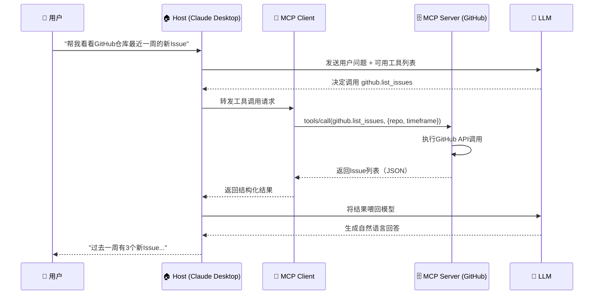

# 把大模型的MCP讲解清楚

## 写在前面

如果你在过去一年里关注过大模型应用开发，一定对“MCP”这个词不陌生。从2024年底Anthropic低调发布，到2026年成为AI圈最炙手可热的技术标准之一，MCP的崛起速度令人侧目。

但MCP到底是什么？它和Function Calling有什么区别？为什么所有主流AI平台——OpenAI、Google DeepMind、Microsoft——都在拥抱它？这些问题，可能是你第一次听到MCP时脑海中闪过的疑惑。

这篇文章试图把MCP讲清楚。不堆砌术语，不照搬官方文档，而是从一个问题出发：**为什么大模型需要一种新的协议？** 沿着这条线索，我们会逐步展开MCP的架构、核心概念、工作流程和生态图景。

读完之后，你应该能回答三个问题：MCP解决了什么问题？它是怎么工作的？它会把AI应用开发带向何方？

好，我们开始。

## 一、一个困扰了所有人很久的问题

先设想一个场景。

你开发了一个AI编程助手，想让它能读取本地代码仓库、查询GitHub Issues、在Jira上创建工单。于是你开始写集成代码——为Claude写一套，为GPT写一套，为Gemini再写一套。每个模型的调用方式都不一样，每个工具的接入逻辑都得重新实现。

更糟的是，半年后你想把底层模型从GPT-4换成一个开源模型，结果发现所有工具集成都要重写。

这就是大模型应用开发中长期存在的 **“N×M”集成困境** ：假设有N个AI模型和M个外部工具，要实现任意模型调用任意工具，理论上需要维护N×M个独立的连接器。一旦数据源的API发生变更，或者开发者决定切换AI模型，所有的集成工作都需要推倒重来。

除了这个核心痛点，传统方案还有一系列衍生问题：

- **数据孤岛**：模型无法主动获取实时数据、访问特定数据库或控制外部系统；
- **协议碎片化**：每个平台都有自己的插件格式——OpenAI的插件、Anthropic的工具调用、LangChain的自定义JSON Schema，团队不得不为每个宿主重复实现相同的工具集成；
- **安全难以统一**：不同集成方式产生不同的日志格式，安全团队无法实施统一的审计模式。

这些问题指向同一个结论：**需要一种标准化的协议**，让AI应用与外部工具、数据源之间的通信变得像USB-C一样通用。

MCP正是在这个背景下诞生的。

## 二、MCP是什么？

**Model Context Protocol（模型上下文协议，MCP）** 是由Anthropic于2024年11月25日发布的开放标准协议。它通过定义统一的通信规范与数据格式，实现大语言模型与外部数据源（数据库、API、文件系统）及工具（计算引擎、可视化组件等）的安全双向连接。

用一句话概括：**MCP是AI应用连接外部世界的通用接口**。

它的核心承诺是“**开发一次，到处运行**”——一个为GitHub开发的MCP服务器，可以同时被Claude Desktop、Cursor、VS Code甚至定制的企业AI代理使用。

截至2026年，MCP的采用数据相当可观：月下载量已达9700万次，社区涌现出数千台MCP服务器，覆盖DevOps、云服务等领域。2025年11月，Anthropic将MCP正式移交给Linux基金会旗下的Agentic AI基金会（AAIF）治理，AWS、Google Cloud、Microsoft等行业巨头随即宣布全面支持。

## 三、MCP的架构：三个角色，各司其职

MCP采用**客户端-服务器架构**，包含三个核心角色：

### Host（主机）

Host是运行LLM的应用程序，是集成的发起端。典型的主机包括Claude Desktop、Cursor、Windsurf以及各类企业级AI网关。Host负责：
- 创建和管理多个MCP客户端实例；
- 控制客户端连接权限和生命周期；
- 执行安全策略和用户授权决策；
- 协调AI/LLM的集成和采样。

### Client（客户端）

Client是嵌入在Host内部的协议实现组件。每个Client与**一个且仅一个**Server维持1:1的持久连接。Client负责：
- 协议握手与能力协商；
- 消息的序列化与反序列化；
- 管理订阅和通知；
- 维护不同Server之间的安全边界。

### Server（服务器）

Server是提供能力的独立进程，封装了特定的数据源或工具。Server可以极其简单（如一个只读的SQLite查询器），也可以极其复杂（如一个具有推理能力的GitHub运维代理）。Server通过MCP协议向外暴露三类核心能力：
- **Resources（资源）** ：数据，如文件内容、数据库记录；
- **Tools（工具）** ：可执行的操作，如“创建Issue”“发送邮件”；
- **Prompts（提示模板）** ：可复用的提示词模板。

### 设计原则

MCP的架构设计遵循几个关键原则：

- **服务器应极其易于构建**，Host承担复杂的编排责任；
- **服务器应高度可组合**，每个服务器提供聚焦的独立功能，多个服务器可无缝组合；
- **服务器不应能读取整个对话**，也不能“看穿”其他服务器——每个服务器只接收必要的信息，完整对话历史保留在Host侧；
- **协议支持渐进式扩展**，核心功能最小化，额外能力可按需协商。

值得一提的是，MCP是一个**无状态协议**：每个请求都是自包含的，携带自己的协议版本、客户端身份和能力声明。

## 四、MCP的传输层：怎么“说话”的

MCP基于 **JSON-RPC 2.0** 作为消息编码格式。所有消息都遵循JSON-RPC规范，确保不同语言、不同平台的实现可以互操作。

MCP支持多种传输方式：

| 传输方式 | 适用场景 | 特点 |
|---------|---------|------|
| **Stdio（标准输入输出）** | 本地进程通信、命令行工具 | 低延迟、天然隔离网络风险 |
| **HTTP + SSE** | 远程服务、云端部署 | 支持流式响应、易于集成Web生态 |
| **WebSocket** | 双向、低延迟通信 | 适合实时交互场景 |

MCP的架构可以理解为两层：
- **数据层**：定义基于JSON-RPC的协议，包括生命周期管理、核心原语（工具、资源、提示）和通知机制；
- **传输层**：管理通信通道和认证，包括连接建立、消息分帧和授权。

## 五、MCP的核心概念：Tools、Resources、Prompts

MCP通过三个核心原语（Primitives）来组织能力。理解这三个概念，就理解了MCP能做什么。

### Tools（工具）

Tools是Server暴露的可执行函数。Client可以通过`tools/list`端点列出可用工具，通过`tools/call`端点调用工具。

工具的范围很广——从简单的天气查询、数学计算，到复杂的代码执行、API交互。一个典型的工具定义包含名称、描述和参数Schema（通常用JSON Schema描述）。

### Resources（资源）

Resources是Server提供的数据，可以是静态的（如文档内容）或动态的（如数据库查询结果）。Resource通过URI标识，Client可以按需获取。

### Prompts（提示模板）

Prompts是可复用的提示词模板，Server可以预定义一些常用的提示结构，Client按需获取并填充参数后使用。

## 六、一次完整的MCP调用：从用户提问到获得答案

让我们用一个具体的例子，把MCP的工作流程串起来。

假设你在Claude Desktop中问了一个问题：“帮我看看我的GitHub仓库里最近一周有哪些新的Issue？”

这个流程的关键在于：

1. **请求阶段**：Host将用户输入、工具元数据、历史上下文打包为结构化提示词；
2. **决策阶段**：LLM解析提示词，判断需要调用哪个工具，生成结构化的调用指令（工具名+参数）；
3. **执行阶段**：Client通过标准化接口调用对应的MCP Server，Server执行操作并返回结果；
4. **整合阶段**：Host将工具执行结果喂回LLM，模型生成最终的自然语言回答。

整个过程对用户来说是透明的——你只看到一个问题和一个答案，背后是Host、Client、Server和LLM的协同工作。

## 七、MCP vs Function Calling：区别在哪？

聊MCP绕不开Function Calling。两者都让大模型能“调用外部能力”，但思路完全不同。

### Function Calling：模型直接输出指令

Function Calling是OpenAI在2023年推出的能力。它的工作方式是：程序在请求时将工具定义（函数名、参数Schema）随提示词一起发给模型，模型判断需要调用哪个工具，然后以结构化格式（如JSON）输出函数名和参数。程序解析这个输出，执行对应的函数，再把结果返回给模型。

Function Calling的核心特征是：**模型直接输出特定格式的调用指令，工具与模型绑定**。

### MCP：标准化中间层

MCP的思路不同。它在模型与工具之间插入了一个**标准化的中间层**。模型不需要知道具体工具的实现细节，只需要通过MCP协议与Client通信；Client负责将请求路由到对应的Server。

### 关键差异对比

| 维度 | Function Calling | MCP |
|------|-----------------|-----|
| **跨模型兼容性** | ❌ 仅限支持该规范的模型 | ✅ 任何兼容MCP协议的模型均可使用 |
| **工具热插拔** | ❌ 需重新部署或修改模型请求 | ✅ 工具可动态注册/卸载 |
| **权限控制粒度** | ⚠️ 依赖模型实现 | ✅ 协议层支持操作授权验证 |
| **跨设备调用** | ❌ 限于本地环境 | ✅ 支持远程/云工具调用 |

### 它们不是替代关系

一个常见的误解是MCP要取代Function Calling。实际上，两者可以**协同工作**：

> 用户请求 → 大模型生成Function Call → 转换为MCP请求 → 调用工具

在这种模式下，Function Calling负责**意图解析**（模型理解用户想要什么），MCP负责**协议传输与工具执行**（把意图转化成对具体工具的调用）。

用一句话概括：**Function Calling是模型“说我要什么”的方式，MCP是“怎么把要的东西拿来”的标准化通道**。

## 八、MCP生态：正在发生什么？

### 惊人的增长速度

MCP的发展速度超出了很多人的预期：

- 2024年11月：Anthropic发布MCP协议；
- 2025年6月：社区月度新增MCP服务器从135个激增至5,069个；
- 2025年11月：MCP移交Linux基金会Agentic AI基金会治理；
- 2026年3月：OpenAI、Google DeepMind、Microsoft相继宣布支持；
- 2026年5月：GitHub MCP Registry上线，awesome-mcp-servers累计85,000+ Stars。

### 主流平台的全面拥抱

如今，MCP已被几乎所有主流AI平台采用：

- **Claude Desktop、Claude Code**：原生支持MCP；
- **Cursor、Windsurf、VS Code**：已集成MCP能力；
- **ChatGPT Desktop**：OpenAI在2025年将MCP加入ChatGPT；
- **Gemini**：Google DeepMind已宣布支持。

Zuplo在2026年初发布的《MCP状态报告》显示：**72%的MCP采用者预计未来12个月使用量将增加**，超过半数对其长期 viability 充满信心。

### 服务器生态的繁荣

MCP服务器覆盖的领域越来越广：

- **Filesystem MCP Server**：从本地任意目录提取文件；
- **GitHub MCP Server**：管理仓库、Issue、PR；
- **Sentry MCP Server**：访问生产问题与错误；
- **SonarQube MCP Server**：暴露安全漏洞信息；
- **Context7 MCP Server**：提供最新的技术文档。

学术界的关注度也在快速上升。MCP-Flow项目已从1166台服务器和11536个工具中收集数据，生成了68733条高质量的指令-函数调用对。MCP-Atlas基准测试包含了36个真实MCP服务器和220个工具上的1000个自然语言任务。

## 九、安全考量：MCP的另一面

任何让AI“动手做事”的技术都绕不开安全问题。MCP也不例外。

### 主要风险

- **过度代理（Excessive Agency）** ：一个暴露了过多工具的MCP Server可能成为攻击者利用的载体；
- **间接提示词注入**：嵌入在工具响应中的恶意指令可能触发横向工具调用；
- **会话劫持**：需要严格的会话管理和认证机制。

### 安全机制

MCP协议内置了多层安全防护：

- **传输层安全**：强制使用TLS 1.3加密通信；
- **身份认证**：支持JWT与OAuth 2.0双模式；
- **细粒度授权**：基于RBAC模型实现资源级访问控制；
- **数据脱敏**：自动过滤PII信息。

实践中，许多团队会在LLM和MCP Server之间增加**护栏层（Guardrail）** ——在工具调用前拦截违反策略的请求，在工具响应后清除敏感信息。

Zuplo的调查显示，**50%的受访者将安全和访问控制列为使用MCP的最大挑战**。这说明安全仍是MCP走向大规模企业应用需要持续攻克的课题。

## 写在最后

回顾整篇文章，我们从一个问题出发：为什么大模型需要一种新的协议？

答案是：**因为AI正在从“会聊天”走向“能办事”** 。当模型不再是孤立的对话系统，而是要连接数据库、调用API、操作文件系统时，一种标准化的连接方式就成了刚需。

MCP的价值可以概括为三点：

1. **标准化**：终结了“N×M”的集成困境，让“一次开发，到处运行”成为可能；
2. **解耦**：模型与工具不再绑定，更换模型无需重写工具集成；
3. **生态化**：任何人都可以开发MCP Server，任何人都可以使用MCP Server，一个开放的工具生态正在形成。

当然，MCP还远未“完成”。工具发现与选择、多工具协同、安全治理等问题仍在演进中。但有一点是确定的：**MCP正在成为AI Agent时代的“控制平面”** ，它定义了AI如何与世界交互的规则。

对于正在学习大模型技术的你来说，理解MCP不仅是在了解一个协议，更是在理解AI应用开发范式正在发生怎样的转变。未来的AI应用，大概率不是“一个模型包打天下”，而是“模型+MCP Server生态”的组合。掌握MCP，就是掌握了这种新范式的入场券。

## 参考资源

如果你想进一步深入，这里有一些推荐的起点：

- **官方文档**：[modelcontextprotocol.io](https://modelcontextprotocol.io) — MCP的完整规范
- **SDK**：官方提供了Python、TypeScript、Go等多语言SDK
- **服务器集合**：[awesome-mcp-servers](https://github.com/awesome-mcp-servers) — 社区维护的服务器列表
- **MCP Registry**：GitHub官方MCP注册表，用于发现和发布MCP服务器