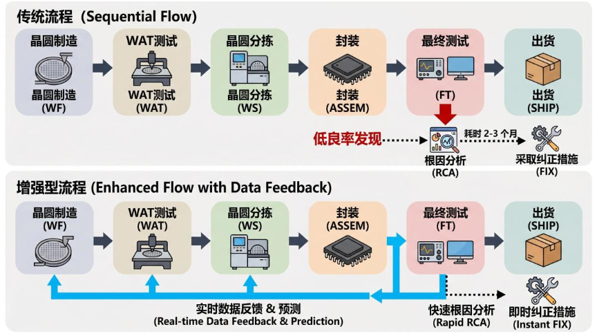
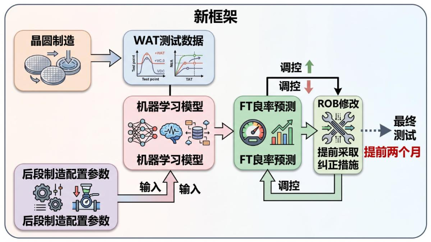
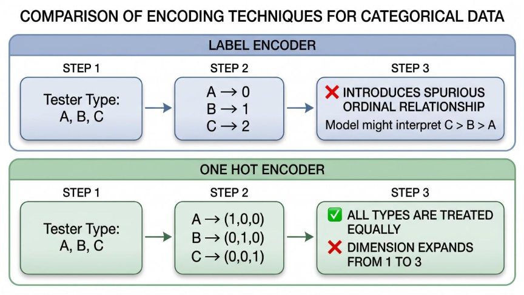
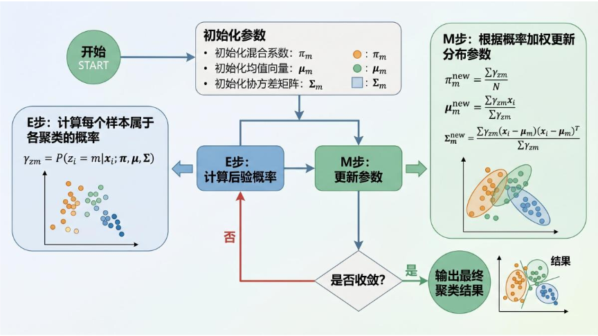
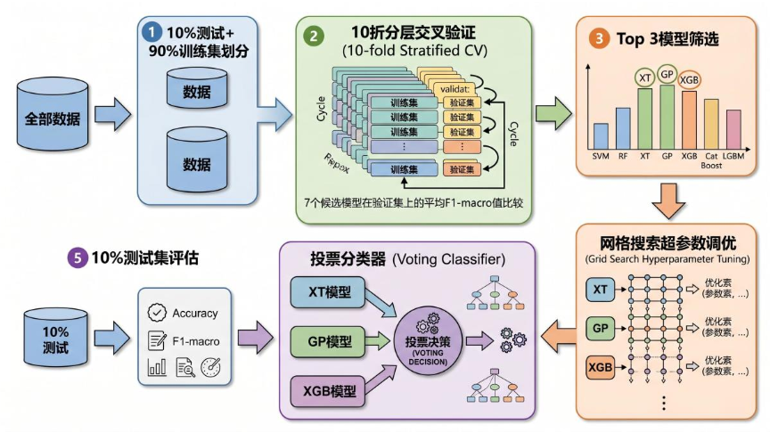
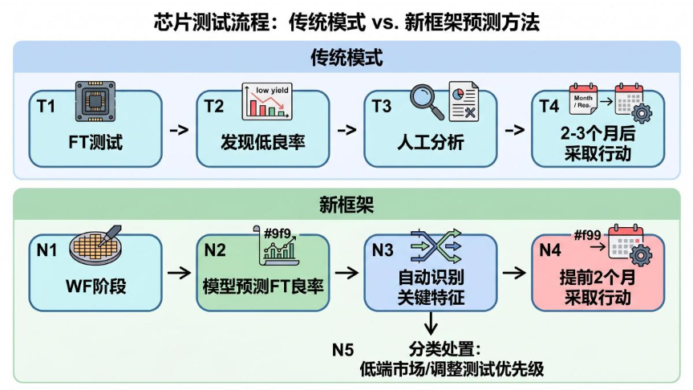

# A Novel Framework for Semiconductor Yield Prediction: Using Machine Learning to Catch Low-Yield Chips Two Months in Advance

## Introduction: The "Black Box" Challenge of Chip Manufacturing

Semiconductor manufacturing is an extremely complex process, involving hundreds of process steps from raw materials to finished chips, with a production cycle of 8‑16 weeks. Throughout this process, massive amounts of production data are generated every day, but the vast majority of this data remains dormant in databases, never fully utilised.

For chip companies, **Final Test (FT)** is the most critical and cost‑intensive checkpoint. It offers the broadest test coverage and the longest test time, with a single goal – ensuring that defective chips are never shipped to customers. However, because FT is the most complex test stage, it is also where low‑yield problems most frequently arise.

In current industry practice, FT low‑yield analysis relies heavily on manual engineer review of data. When a low‑yield alarm sounds, engineers must sift through hundreds of parameters to identify possible root causes – which could be front‑end wafer fabrication process variations, or back‑end assembly/test issues. This process is extremely time‑consuming and heavily dependent on engineer experience.

So, is it possible to predict FT yield two months in advance, right at the wafer fabrication stage? This paper from IEEE Access gives a definitive answer.

---

## 1. Why Predict FT Yield Earlier?

In the traditional semiconductor manufacturing flow, the yield control timeline looks roughly like this:

This passive waiting approach has several critical drawbacks:

1. **Long response cycles** – from problem detection, to root‑cause identification, to corrective action, often takes months.
2. **High sunk costs** – low‑yield chips have already completed the entire manufacturing flow; all costs are already incurred.
3. **Resource waste** – engineers must manually review high‑dimensional data, which is inefficient.

The novel framework proposed in the paper completely overturns this model:

**Core advantage**: FT yield can be predicted as early as the wafer fabrication stage, providing a two‑month early warning and giving engineers valuable lead time for corrective actions.

---

## 2. Data Preprocessing: Making Messy Data "Speak"

A core challenge for the proposed framework is that semiconductor manufacturing data includes both **numerical** (e.g., WAT parameters) and **categorical** (e.g., tester models, package types) variables. How can a machine learning model understand both types simultaneously?

### 2.1 Numerical Data Processing

WAT (Wafer Acceptance Test) parameters are numerical, but their value ranges vary enormously – from \(10^{-13}\) to \(10^3\). To eliminate scale effects, the paper adopts **standardisation**:

$$z = \frac{x - \mu}{\sigma}$$

Additionally, **Pearson correlation coefficients** are used to remove highly redundant parameters (those with correlation >0.9 are retained only once), achieving dimensionality reduction.

### 2.2 The Encoding Debate for Categorical Data

Categorical data handling is one of the highlights of this paper. Two mainstream encoding methods are compared:

**Label Encoder**: maps categories directly to integers (e.g., 6 tester types mapped to 0‑5). The advantage is that dimensionality does not increase, but the drawback is that it introduces an artificial "ordering" – the model might incorrectly assume that type 4 > type 3.

**One Hot Encoder**: creates independent binary features for each category. It avoids ordering artefacts, but suffers from severe dimensionality expansion.

The paper proposes a practical selection criterion:

> **When the total number of features after One Hot encoding is < 10% of the training sample size, One Hot Encoder is preferred; otherwise, Label Encoder is used.**

This rule is validated on three products:

| Product | Data Size | One‑Hot Dimension | Recommended Encoding | F1‑macro Result |
|---------|-----------|-------------------|----------------------|-----------------|
| A       | 1887      | 143 (<10%)        | One Hot ✅            | 0.786           |
| B       | 802       | 186 (23%)         | Label                 | 0.799           |
| C       | 2485      | 700 (28%)         | Label                 | 0.800           |

### 2.3 Output Discretisation: GMM Automatic Clustering

FT yield is a continuous value (0%‑100%), but the paper transforms it into a **classification problem**, because in practice engineers care more about "which yield bracket does this batch belong to".

Traditional quantile‑based or equal‑width binning methods cannot handle multi‑modal distributions. The paper adopts **Gaussian Mixture Models (GMM)** to automatically identify the optimal number of yield classes.

**Core idea of GMM**: assume that the yield data is generated by a mixture of K Gaussian distributions, each representing a "yield population".

$$P(X) = \sum_{m=1}^{M} \pi_m \mathcal{N}(X|\mu_m, \Sigma_m)$$

where \(\pi_m\) is the mixing weight of the \(m\)-th Gaussian component, and \(\mu_m\), \(\Sigma_m\) are its mean and covariance.

**EM algorithm solving process**:

**BIC (Bayesian Information Criterion)** is used to automatically select the optimal number of clusters K (the paper limits K ≤ 4):

$$BIC = -2 \cdot \ln(\hat{L}) + k \cdot \ln(n)$$

where \(\hat{L}\) is the maximum likelihood, \(k\) is the number of parameters, and \(n\) is the sample size. Lower BIC indicates a better model.

---

## 3. Model Architecture: Multi‑Model Ensemble Strategy

### 3.1 Candidate Model Pool

The paper selects 7 different types of classifiers, covering diverse algorithm families:

| Category | Model | Rationale |
|----------|-------|-----------|
| Distance‑based | SVC (Support Vector Classifier) | Kernel tricks for non‑linearity; already used in semiconductor domain |
| Distance‑based | KNN (K‑Nearest Neighbors) | Non‑parametric, no distribution assumptions |
| Probabilistic | GP (Gaussian Process) | Robust, suitable for small datasets |
| Probabilistic | LR (Logistic Regression) | Industry standard baseline |
| Tree‑based | XT (Extra Trees) | Low variance, high computational efficiency |
| Tree‑based | GB (Gradient Boosting) | Robust, good interpretability |
| Tree‑based | XGBoost | Handles sparse data, parallelisable |

### 3.2 Evaluation Metric: Why Not Accuracy?

Semiconductor yield data suffers from severe **class imbalance** – high‑yield chips are the vast majority, while low‑yield ones are rare. If Accuracy were used, a model that simply predicts "high yield" for everything would achieve >90% accuracy, but that would be meaningless.

The paper adopts **F1‑macro** as the core evaluation metric:

$$Precision_m = \frac{TP_m}{TP_m + FP_m}$$

$$Recall_m = \frac{TP_m}{TP_m + FN_m}$$

$$F1_m = 2 \cdot \frac{Precision_m \cdot Recall_m}{Precision_m + Recall_m}$$

$$F1_{macro} = \frac{1}{M} \sum_{m=1}^{M} F1_m$$

**Why macro‑averaging instead of micro‑averaging?**

- Micro‑averaging: aggregates TP/FP/FN across all classes first – the majority class dominates.
- Macro‑averaging: computes F1 per class first, then averages – **each class is weighted equally**.

Macro‑averaging better reflects model performance on the "rare" (low‑yield) classes, which are precisely the most important in production.

### 3.3 Model Ensemble: Voting Classifier

The paper adopts a **two‑stage ensemble strategy**:

1. **Stage 1**: 10‑fold cross‑validation to select the top‑3 models.
2. **Stage 2**: Hyperparameter tuning (Grid Search) on the top‑3 models, then build a Voting Classifier.

Two voting schemes are compared:

- **Hard Voting**: majority rule
- **Soft Voting**: weighted average of prediction probabilities

Experiments show that Soft Voting works better, because although the GP model has slightly lower accuracy, its probability estimates are more reliable.

---

## 4. Experimental Results and Feature Analysis

### 4.1 Performance on Three Products

The framework is validated on three products with different technologies and manufacturing flows:

| Product | Data Size | Yield Range | Number of Classes | VC F1‑macro |
|---------|-----------|-------------|-------------------|-------------|
| A       | 1887      | 82.36%‑99.27% | 3                 | 0.831       |
| B       | 802       | -           | 3                 | 0.889       |
| C       | 2485      | -           | 3                 | 0.961       |

Compared to the baseline LR, the Voting Classifier delivers significant improvements:

- Product A: **28.17%** improvement
- Product B: **3.44%** improvement
- Product C: **23.48%** improvement

### 4.2 Feature Importance Analysis: Identifying Real Root Causes

The paper uses **Gini Importance** to rank features of the XT model. Gini Importance measures how much each feature reduces impurity (the objective function) during decision tree splits.

**Top‑15 features for Product A** (using all data):

1. PACKAGE_MsOP_3 (package type) 🥇
2. PROGRAM_37 (test program) 🥈
3. TESTER_024 (tester) 🥉

The top three are all **categorical features**! This directly confirms that the FT yield issues for this product primarily stem from back‑end manufacturing processes, not wafer fabrication.

Further investigation reveals that batches using PROGRAM_37 and TESTER_024 indeed show abnormally low yields. Engineers can quickly pinpoint the problem and adjust the test program or replace the tester.

**Deeper analysis**: When grouping by package type, the top‑3 WAT parameters change dramatically:

| Condition | Top 1 | Top 2 | Top 3 |
|-----------|-------|-------|-------|
| All data | PACKAGE_MsOP_3 (categorical) | PROGRAM_37 (categorical) | TESTER_024 (categorical) |
| Only PACKAGE_MsOP3 | Contact_Resistance_DNW | Contact_Resistance_Nw | Contact_Resistance_TV |
| Excluding PACKAGE_MsOP3 | Continuity_M6 | Threshold_Voltage_N4H | Contact_Resistance_V3 |

This shows that **under different package types, the critical process parameters affecting yield are completely different**. This discovery has significant practical value for engineers designing targeted process optimisation plans.

---

## 5. Framework Generalisability and Innovation Summary

### 5.1 Comparison with Existing Studies

The paper compares its framework with prior work:

| Dimension | Prior Studies | This Framework |
|-----------|---------------|----------------|
| Prediction stage | Mostly WF/WS | **FT prediction (2 months earlier)** |
| Input data | Specific process parameters (requiring prior knowledge) | **All manufacturing parameters (automatic)** |
| Data types | Mostly numerical | **Numerical + categorical with automatic encoding** |
| Coverage | Specific failure modes | **All failure types** |
| Output | Continuous/binary | **Multi‑class (GMM automatic clustering)** |

### 5.2 Key Innovations

1. **First‑ever FT yield prediction using WAT data**: advances the prediction window by two months.
2. **Fully automatic data preprocessing**: no manual feature selection; GMM automatically identifies yield classes.
3. **Hybrid data‑type handling**: a principled strategy for choosing between One Hot and Label Encoders.
4. **Robust model selection framework**: 7‑model screening + Voting Classifier ensemble.
5. **Feature‑importance‑driven root‑cause analysis**: not just prediction, but also explanation.

---

## 6. Conclusion: From Prediction to Decision‑Making

The greatest value of this paper lies not only in prediction accuracy, but in providing a **practical decision‑support framework**:

Based on the prediction results, engineers can:

1. **Classify and disposition**: low‑yield wafers can be intentionally used for non‑critical applications (e.g., home security, IoT solutions where cost is more important than extreme performance).
2. **Optimise test priority**: adjust test sequencing according to predicted yield to save test costs.
3. **Pinpoint root causes accurately**: leverage feature importance analysis to quickly identify problematic parameters.

As the paper looks forward, future work will focus on **automated root‑cause analysis** – enabling the system not only to predict "there will be a problem", but also to tell engineers "where the problem is" and "how to fix it". This will be a critical step in moving semiconductor smart manufacturing from "passive response" to "active prevention".

---

*Reference: Jiang, D., Lin, W., & Raghavan, N. (2020). A Novel Framework for Semiconductor Manufacturing Final Test Yield Classification Using Machine Learning Techniques. IEEE Access, 8, 197685‑197695.*