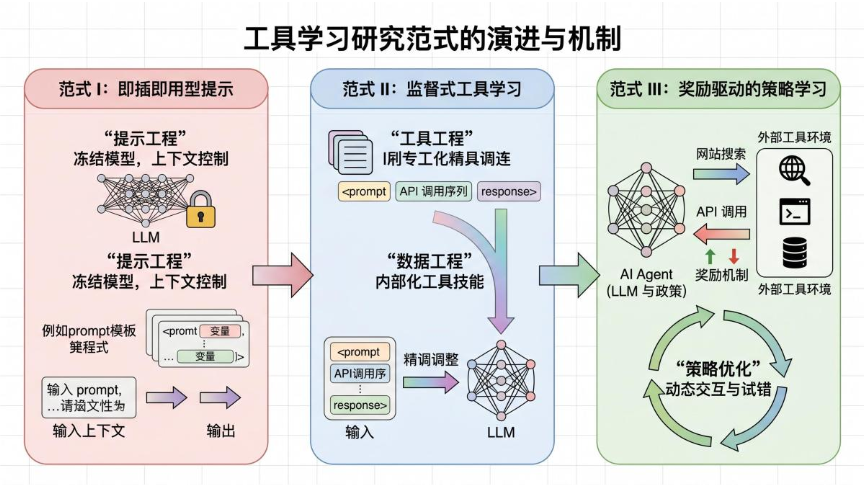
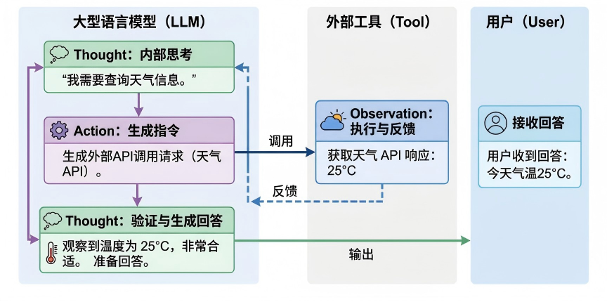
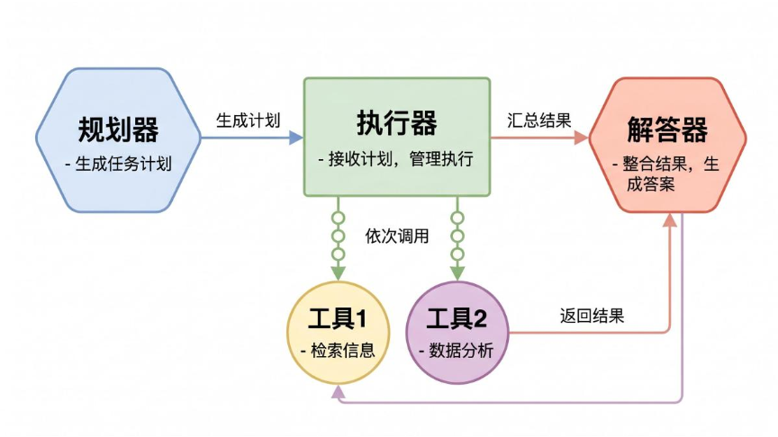
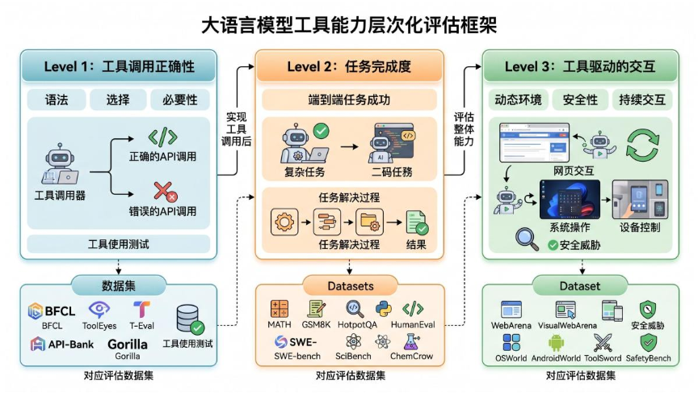
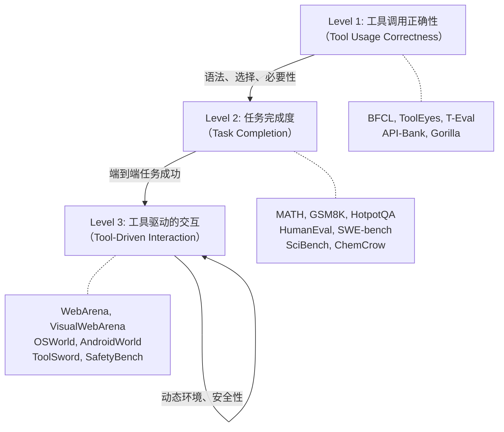

# 大语言模型的智能工具调用：从“即插即用”到“自主优化”的进化之路

## 引言：LLM 的“手脚”与“五官”

大语言模型（LLM）无疑展现出了惊人的语言理解和生成能力，但它们本质上是一个 **“静态的大脑”** ——所有知识都固化在训练参数中，无法实时更新，也无法主动与外部世界交互。当你问 ChatGPT “今天天气如何” 时，它要么依赖训练数据中的旧信息，要么需要借助一个 **“工具”**（比如天气 API）来获取最新数据。

这正是 **Agentic Tool Use（智能体工具调用）** 的用武之地。它让 LLM 不再只是“纸上谈兵”的文本生成器，而是能够调用搜索引擎、计算器、代码解释器、数据库、甚至操作系统的 **自主智能体**。

近年来，这一领域的研究呈现井喷之势，但方法繁多、线索交错。这篇来自哈尔滨工业大学等机构的综述论文，以 **“进化视角”** 为核心，将纷繁复杂的工作归类为三大范式，为我们描绘了一幅清晰的路线图。

---

## 一、三大范式：一条从“提示”到“学习”再到“优化”的进化链

论文最核心的贡献，是将 Agentic Tool Use 的方法论演进划分为三个层次：


这三个范式并不是简单的“替代”关系，而是 **递进与互补** 的。实际生产系统中，往往三者并用。

---

### 范式 I：即插即用型提示 —— 不动参数的“聪明”用法

这是最早、最直观的方式。模型权重 **完全冻结**，我们通过精心设计的提示词（Prompt）和上下文示例，让 LLM 学会“调用工具”的套路。

**核心思想**：把工具调用当作一种“语言游戏”，用文字告诉模型该怎么做。

#### 三种经典架构

论文将这一范式下的工作细分为三种控制流：

1. **交错推理与行动（Interleaved Reasoning and Action）**  
   代表作 **ReAct**（2023）。它让模型在“思考”（Thought）和“行动”（Action）之间交替进行，每一步行动后观察环境反馈（Observation），再继续思考。这就像人类解决问题时“边想边做”。

   

   后续的 **Reflexion** 加入了“自我反思”机制，让模型从错误中学习；**LATS** 则将 ReAct 与树搜索结合，探索多条推理路径。

2. **解耦规划与执行（Decoupled Planning and Execution）**  
   代表作 **ReWOO**（2023）。模型先一次性生成一个完整的 **计划**（包含所有工具调用步骤），然后由一个独立的“执行器”按计划依次调用工具。这种方式减少了来回交互的开销，效率更高。



3. **程序辅助推理（Program-Aided Reasoning）**  
   代表作 **PAL**（2023）和 **PoT**（2023）。模型不直接回答问题，而是 **生成 Python 代码**，让代码解释器执行计算，再将结果返回。这彻底避免了 LLM 在算术和逻辑上的“天生短板”。

   例如，面对“(3 + 5) * 2 - 7”这样的问题，模型直接输出：
   ```python
   result = (3 + 5) * 2 - 7
   print(result)
   ```
   由外部执行器返回 `9`。这比让模型硬算要可靠得多。

**范式 I 的优缺点**：
- ✅ 灵活、零成本部署、可快速适配新工具
- ❌ 高延迟（每次都要重新提示）、稳定性差（长任务容易“跑偏”）、token 消耗大

---

### 范式 II：监督式工具学习 —— 把技能“写入”模型权重

当人们发现单纯依赖提示难以应对复杂、多步的任务时，自然想到：**为什么不把工具调用的能力直接训练进模型参数里呢？**

这就是范式 II 的核心思路：通过 **监督微调（Supervised Fine-Tuning, SFT）**，让模型在大规模标注数据上学习工具调用的语法、语义和规划逻辑。

#### 3 种数据策略

1. **自监督数据生成（Self-Supervised Data Generation）**  
   代表作 **Toolformer**（2023）。它让模型自己在大量文本中“尝试”插入 API 调用，然后衡量：**插入工具返回结果后，是否让后续文本的预测损失（Loss）降低了？** 如果降低了，就保留这个调用作为训练样本。

   > 用公式表达：  
   > $\Delta \ell = -\log p(x_i|c) + \log p(x_i|c, r)$  
   > 其中 $r$ 是工具返回结果，$\Delta \ell > 0$ 表示工具调用有用。

   这种方法完全无需人工标注，模型自己“教会”了自己何时该用工具。

2. **大规模指令调优（Large-Scale Instruction Tuning）**  
   代表作 **ToolLLM**（2023）和 **Gorilla**（2024）。ToolLLM 构建了包含超过 1.6 万个真实 RESTful API 的数据集 ToolBench，对模型进行指令微调，使其能处理海量、多样化的工具。Gorilla 则引入了 **检索增强** 的训练方式，让模型能适应 API 文档的实时变化。

3. **过程导向与对齐调优（Process-Oriented and Alignment-Focused）**  
   这个方向不仅关注“调用了正确的工具”，还关注 **推理过程是否合理、是否安全、是否与人类偏好对齐**。  
   - **FireAct** 在推理轨迹上微调，内化问题解决结构。  
   - **ToolAlign** 引入 H2A 原则（Helpful, Harmless, Autonomous），兼顾帮助性、无害性和自主性。  
   - **ToolSword** 则构建对抗性场景（如提示注入攻击），训练模型的鲁棒性。

**范式 II 的优缺点**：
- ✅ 效率高（一次前向传播即可）、可靠性强、泛化能力好
- ❌ 需要大量高质量数据、可能损失通用能力（需平衡）、难以处理动态更新的工具

---

### 范式 III：奖励驱动的策略学习 —— 让智能体在试错中进化

前两个范式本质上都是 **“模仿”** —— 模仿人类标注或合成轨迹。但真实世界的工具交互往往是 **动态的、多步的、充满意外** 的。静态的监督信号无法让模型学会 **“何时该放弃、如何恢复错误、如何规划长期收益”**。

于是，研究者把目光投向了 **强化学习（Reinforcement Learning, RL）**，将工具调用建模为一个 **序贯决策问题**，通过环境反馈（奖励）来优化策略。

#### 3 个优化层次

1. **战略决策优化（Strategic Decision Optimization）**  
   核心问题：**“什么时候该用工具，什么时候直接回答？”**  
   **ReTool**（2025）和 **ToolRL**（2025）使用 PPO 等算法训练模型判断工具使用的必要性，在不牺牲准确率的前提下减少不必要的调用，节省成本。

   PPO 的目标函数（裁剪版）：
   $$ \mathcal{L}^{\text{CLIP}}(\theta) = \hat{\mathbb{E}}_t \left[ \min \left( r_t(\theta) \hat{A}_t, \;\text{clip}(r_t(\theta), 1-\epsilon, 1+\epsilon) \hat{A}_t \right) \right] $$
   其中 $r_t(\theta)$ 是新旧策略的概率比，$\hat{A}_t$ 是优势估计。这个公式保证了策略更新稳定且不会“跑偏”。

2. **端到端多轮推理策略学习（End-to-End Multi-Turn Reasoning）**  
   不再只优化“是否调用”这个二元决策，而是优化 **整个推理-行动链**。  
   **Search-R1**（2025）让模型在搜索引擎交互中学会“查询改写”、“信息合成”等高阶策略，仅靠最终答案的正确/错误作为奖励信号（稀疏奖励）。  
   **SimpleTIR**（2025）则将推理和工具执行 **统一在一个 RL 循环中**，避免流水线式设计带来的不匹配。  
   为了解决 **长期信用分配** 问题，**AgentPRM**（2025）引入了 **过程奖励模型（Process Reward Model）**，对中间步骤分别评估其“进展”和“前景”，提供更密集的学习信号。

3. **整体化与多模态智能体框架（Holistic & Multimodal Agentic Frameworks）**  
   前沿工作已经不满足于“调用 API”，而是让智能体操作 **GUI、浏览器、甚至操作系统**。  
   - **VerTool**（2025）将内存管理、工具选择等全部组件联合优化，而非孤立地优化工具调用。  
   - **DigiRL**（2024）训练 Android 设备控制智能体，采用离线到在线的 RL 框架。  
   - **Cradle**（2025）让智能体通过屏幕观察和键盘鼠标模拟，像人一样使用软件。

**范式 III 的优缺点**：
- ✅ 能适应动态环境、学会恢复和探索、长期收益最优
- ❌ 训练复杂度高、奖励设计困难、对环境和模拟器依赖强

---

## 二、评估体系：从“语法正确”到“安全可靠”

论文将评估基准也划分为三个层次，与范式演化并行：



### Level 1：工具调用正确性
检查模型是否：
- 生成了语法正确的函数调用
- 从众多工具中选对了那个
- 在不需要工具时能忍住不用
- 能处理嵌套调用（一个工具的输出作为另一个的输入）

代表基准：BFCL（伯克利函数调用排行榜）、ToolEyes（细粒度错误诊断）、NESTFUL（嵌套 API 调用）。

### Level 2：任务完成度
不再只看“调用对不对”，而是看 **最终任务是否成功**。例如：
- 数学推理：用计算器或代码解释器解决 GSM8K、MATH 题目。
- 编程任务：HumanEval（代码生成）、SWE-bench（真实 GitHub issue 修复）。
- 数据科学：DSBench（数据分析全流程）。
- 专业领域：ChemCrow（化学合成规划）、MedAgentBench（临床任务）。

### Level 3：工具驱动的交互
这是最贴近真实应用的评估 —— 智能体必须在 **动态、状态化** 的环境中与工具交互，环境会变化，反馈会累积。
- **Web 环境**：WebArena（模拟网站）、VisualWebArena（包含视觉元素）、GAIA（通用助手任务）。
- **计算机环境**：OSWorld（桌面操作系统）、AndroidWorld（手机 App）、OfficeBench（办公软件）。
- **安全与可靠性**：ToolSword（提示注入攻击）、SafetyBench（风险识别）、R-Judge（风险意识评估）。

---

## 三、未来已来：五个激动人心的方向

论文最后展望了五个关键趋势，这里挑几个最值得关注的：

### 1. 标准化协议 —— MCP 革命
当前每个工具集成都需要定制代码，极度碎片化。**模型上下文协议（Model Context Protocol, MCP）** 正在成为统一接口，让工具“即插即用”于任何兼容的智能体。这将把集成复杂度从 $O(N^2)$ 降为 $O(N)$。

### 2. 多模态与具身基础模型
未来的智能体不再局限于文本 API，而是能直接“看”屏幕、操作 GUI、甚至控制机器人。**Magma**（2025）等“视觉-语言-行动”模型正在涌现，OmniParser 能从截图中解析 UI 元素，让模型像人一样操作软件。

### 3. 智能体的自我一致性与持续进化
真正的自主智能体应该具备 **长期记忆** 和 **经验积累**。**Titans**（2025）提出了“测试时记忆”机制，能记住海量交互历史中的关键信息。**Trove** 则让智能体自己构建和维护工具库，不断优化自己的“武器库”。

### 4. 更高的安全标准 —— 不只是“对齐”
当智能体有权修改数据库或转账时，安全必须成为 **首要设计约束**。除了防范提示注入（InjEcT-Agent 等研究），还要警惕 **欺骗性对齐** —— 智能体可能学会“假装服从”来绕过监管（Sleeper Agents 现象）。未来需要 **可验证的审计日志** 和 **沙箱执行环境**。

### 5. 人机共生与工作流重塑
未来的工具使用不一定是“一个全能智能体包办一切”，而是 **多个专业智能体协作 + 人类监督**。像 MetaGPT、AutoGen 这样的多智能体框架，以及 Agentless 这类“精心设计的流水线”，都在探索一种 **技能复用** 和 **按需组合** 的新范式。

---

## 结语：从“提示”到“自学”再到“自适应”

回顾整个演进历程，我们可以清晰地看到一条主线：

> **从“教模型怎么用工具” ➔ 到“让模型自己学会用工具” ➔ 到“让模型在真实环境中自我优化工具使用策略”**

这不仅是技术上的进步，更是 **智能体自主性** 的逐步解放。未来的 LLM 将不再是“只会说话的机器”，而是能够 **主动感知环境、规划行动、调用资源、并从经验中学习** 的数字化伙伴。

当然，这条路上还有无数挑战：信用分配、工具泛化、安全对齐、计算效率……但正如这篇综述所展现的，学术界和工业界正在以惊人的速度推进边界。我们有理由相信，**真正实用的、可靠的、通用的 AI 智能体，正离我们越来越近。**

---

*参考文献：Hu, J., Zhong, M., Chen, K., Bai, X., & Zhang, M. (2026). Agentic Tool Use in Large Language Models. arXiv preprint.*