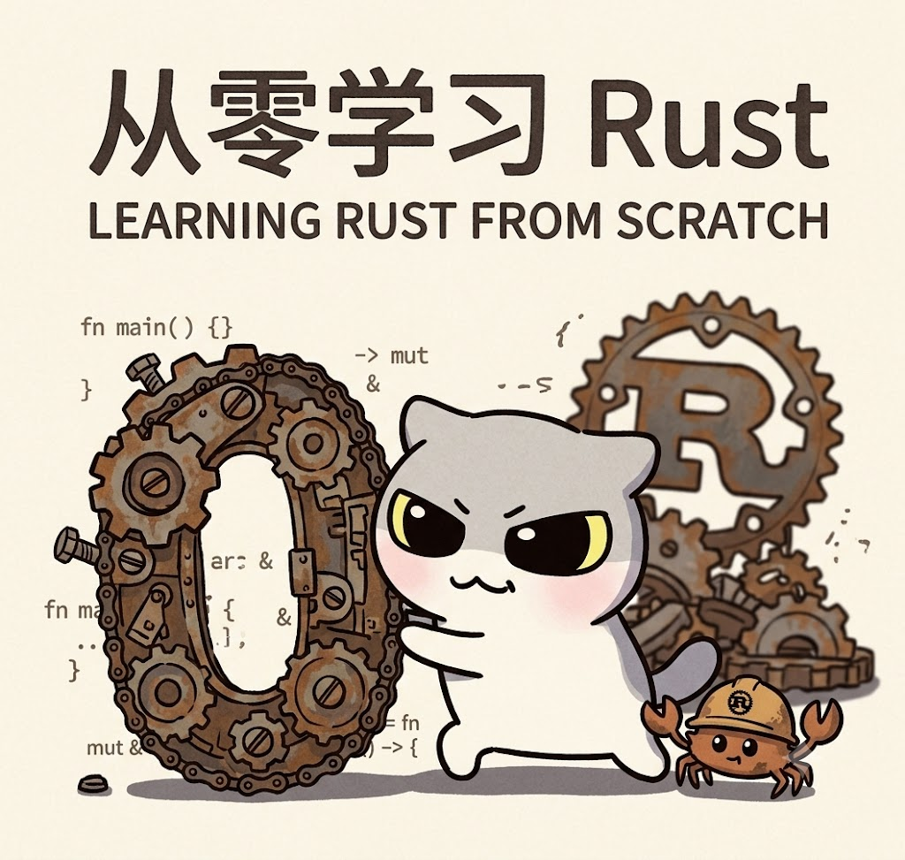

# Rust from Zero to One: Preface

> Assume you understand basic concepts like stack, heap, pointers, and memory management. Each article aims to be substantial, with some depth and a bit of code. You can skim through, learn some Rust, and perhaps it will be enough to get you started.


## Series Outline

This series is planned as **six articles**, progressing step by step. The AI helped me arrange them as follows:

| Article | Topic | Core Content |
|---------|-------|--------------|
| 1 | Why Rust? — Environment Setup and First Look at Ownership | Rust's design philosophy, installation and configuration, Cargo introduction, the three ownership rules |
| 2 | Borrowing and Lifetimes — Rust's Memory Safety Foundation | References and borrowing, mutable and immutable references, lifetime annotations |
| 3 | Building Data Types — Structs, Enums, and Pattern Matching | struct, enum, match, Option and Result |
| 4 | Abstraction and Reuse — Generics, Traits, and Error Handling | generics, traits, custom errors, the ? operator |
| 5 | Collections, Iterators, and Closures — Functional Programming Style | Vec, HashMap, iterator adapters, closure captures |
| 6 | Concurrency and Async — Fearless Concurrency | threads, channels, shared state, Async/Await introduction |

This is **Article 1**.


## Article 1: Why Rust? — Environment Setup and First Look at Ownership

### 1. Why Learn Rust in 2026?

Before answering "how to learn," let's first answer "why learn."

Rust has been the "most loved programming language" in Stack Overflow's developer surveys for years. This isn't just community hype—companies like ByteDance, Alibaba, and Cloudflare are migrating core systems to Rust, covering low-level components such as databases, network proxies, and AI terminal tools. In the Kubernetes ecosystem, well-known projects like Krustlet, Linkerd, and TiKV are all written in Rust.

But "popularity" isn't a reason to learn. What truly draws systems programmers to Rust is that it solves a long-standing dilemma in programming languages: **performance and safety were thought to be mutually exclusive**.

C/C++ give you ultimate performance and low-level control, but manual memory management brings endless dangling pointers, buffer overflows, and data races—in 2022, 62% of publicly disclosed CVEs were directly related to memory management defects. Java/Go/Python give you memory safety (via GC or runtime checks), but sacrifice performance and predictability.

Rust's choice is: **complete memory safety checks at compile time, with zero runtime overhead**. Through its ownership system, borrow checker, and lifetime annotations, Rust builds a complete memory safety防线 at compile time, while achieving performance comparable to C/C++ through zero-cost abstractions. A cloud vendor that refactored its storage service from C++ to Rust saw system crash rates drop by 92% and throughput increase by 35%.

Rust is not just a new language—it's a **new way of thinking about programming**. Understanding Rust's ownership model will give you a deeper understanding of memory management and concurrency safety, insights that can transfer to other languages.

### 2. Environment Setup: Rustup + Cargo

Rust's toolchain experience ranks among the best in mainstream languages. The primary way to install Rust is via `rustup`—it serves as both installer and version manager.

**Installation (macOS/Linux/other Unix-like):**

```bash
curl --proto '=https' --tlsv1.2 -sSf https://sh.rustup.rs | sh
```

**Installation (Windows):** Download `rustup-init.exe` and run it; you need Visual Studio 2013 or later with C++ build tools.

After installation, verify:

```bash
rustc --version   # compiler version
cargo --version   # package manager version
```

**For users in China**, it is recommended to configure a mirror to speed up crate downloads. Add the following to `~/.cargo/config.toml`:

```toml
[source.crates-io]
replace-with = 'ustc'

[source.ustc]
registry = "https://mirrors.ustc.edu.cn/crates.io-index"
```

### 3. First Program: Hello World

First, use `cargo` to create a new project:

```bash
cargo new hello_rust --bin
cd hello_rust
```

`cargo new` generates the following structure:

```
hello_rust/
├── Cargo.toml          # project configuration file (similar to package.json / go.mod)
└── src/
    └── main.rs         # source code entry point
```

Look at `src/main.rs`:

```rust
fn main() {
    println!("Hello, world!");
}
```

Compile and run:

```bash
cargo run   # compile in debug mode and run
cargo build --release  # release mode (with optimizations)
```

The `!` in `println!` indicates that this is a **macro**, not an ordinary function. Rust's macro system is very powerful; we will dive deeper later.

### 4. Variables and Mutability

In Rust, variables are **immutable** by default. This is an important aspect of Rust's design philosophy: safe by default, mutability must be explicitly declared when needed.

```rust
fn main() {
    let x = 5;        // immutable binding
    // x = 6;         // compilation error! cannot assign twice to immutable variable
    
    let mut y = 10;   // mutable binding, using the mut keyword
    y = 11;           // OK
    println!("x = {}, y = {}", x, y);
}
```

This seemingly simple design has a profound impact on coding style: it forces programmers to explicitly distinguish which data changes and which does not, reducing bugs caused by implicit state changes.

Rust also supports **variable shadowing**:

```rust
fn main() {
    let x = 5;
    let x = x + 1;    // new variable shadows the old x
    {
        let x = x * 2; // shadowed again in the inner scope
        println!("inner: {}", x); // 12
    }
    println!("outer: {}", x); // 6
}
```

Shadowing differs from `mut`: shadowing creates an entirely new variable and can change its type; `mut` can only change the value of the same type.

### 5. Ownership — The Core Concept of Rust

> Ownership is Rust's most unique feature and the one that confuses beginners the most. But it is also the key to understanding Rust. Once you understand ownership, Rust's other features become much clearer.

**The three core rules of ownership**:

1. **Each value in Rust has an owner.**
2. **At any given time, a value can have only one owner.**
3. **When the owner goes out of scope, the value will be automatically dropped.**

#### 5.1 Scope and Automatic Deallocation

```rust
fn main() {
    {                      // s is not yet declared
        let s = String::from("hello");  // s comes into scope
        // s can be used here
    }                      // s goes out of scope, memory is automatically freed
    // s cannot be used here
}
```

`String::from` allocates memory on the heap, but Rust does not require you to manually call `free`—when `s` goes out of scope, Rust automatically calls the `drop` function to free the memory. This is similar to C++'s RAII (Resource Acquisition Is Initialization), but enforced by the compiler.

#### 5.2 Move: Transfer of Ownership

For **heap-allocated** data types (such as `String` and `Vec`), assignment operations **transfer ownership**, rather than copying data:

```rust
fn main() {
    let s1 = String::from("hello");
    let s2 = s1;  // ownership of s1 is moved to s2
    
    // println!("{}", s1);  // compilation error! s1 is no longer valid
    println!("{}", s2);     // OK
}
```

This behavior is called a **move**. Its memory model is:

- `s1` holds a pointer to heap memory, length, and capacity
- `let s2 = s1` **copies** these three fields to `s2`, but does **not** copy the heap data
- Then Rust considers `s1` invalid, preventing double-free issues from two pointers pointing to the same heap memory

This is one of the key mechanisms Rust uses to guarantee memory safety without a garbage collector.

#### 5.3 Clone: Deep Copy

If you do need to copy heap data, you can use `.clone()`:

```rust
fn main() {
    let s1 = String::from("hello");
    let s2 = s1.clone();  // deep copy of heap data
    println!("s1 = {}, s2 = {}", s1, s2);  // both are valid
}
```

`.clone()` incurs runtime overhead and should be used with care.

#### 5.4 Copy: Copying Stack Data

For **stack-allocated** simple types (such as integers and booleans), assignment is a **copy** by default, not a move:

```rust
fn main() {
    let x = 5;
    let y = x;    // x is an integer type (implements the Copy trait), this is a copy
    println!("x = {}, y = {}", x, y);  // both are valid
}
```

These types implement the `Copy` trait, meaning they remain valid after assignment. Common `Copy` types include: all integer types, boolean, floating-point types, the character type, and tuples composed of these types.

#### 5.5 Ownership and Functions

Passing values to functions also results in ownership transfer or copying:

```rust
fn main() {
    let s = String::from("hello");
    take_ownership(s);     // ownership of s is moved into the function
    // println!("{}", s);  // compilation error! s is no longer valid
    
    let x = 5;
    makes_copy(x);         // x implements Copy, so this is a copy
    println!("{}", x);     // OK
}

fn take_ownership(some_string: String) {
    println!("{}", some_string);
}  // some_string goes out of scope, memory is freed

fn makes_copy(some_integer: i32) {
    println!("{}", some_integer);
}
```

Return values also transfer ownership:

```rust
fn main() {
    let s1 = gives_ownership();         // return value is moved to s1
    let s2 = String::from("hello");
    let s3 = takes_and_gives_back(s2);  // s2 is moved into the function, return value moved to s3
    // s2 is no longer valid
}

fn gives_ownership() -> String {
    let some_string = String::from("hello");
    some_string  // ownership is moved out
}

fn takes_and_gives_back(a_string: String) -> String {
    a_string  // ownership is moved in, then out
}
```

#### 5.6 Summary of Ownership

The ownership design solves two core problems:

1. **Memory safety**: Each value has exactly one owner; the owner automatically frees memory when it goes out of scope, eliminating dangling pointers and double frees.
2. **Data race prevention**: The ownership rules (along with borrowing rules) rule out data races at compile time.

Think of ownership as **a resource management protocol enforced at compile time**—it turns the memory lifecycle traditionally managed manually (C/C++) or automatically by a GC (Java/Go) into a set of rules statically checked by the type system.

### 6. Practical Example: A Simple File Reading Function

Let's combine our ownership knowledge to write a function that reads file contents:

```rust
use std::fs::File;
use std::io::Read;

fn read_file_contents(path: &str) -> std::io::Result<String> {
    let mut content = String::new();
    let mut file = File::open(path)?;      // ? operator simplifies error handling
    file.read_to_string(&mut content)?;    // mutable borrow to modify content
    Ok(content)  // ownership of content is transferred to the caller
}

fn main() -> std::io::Result<()> {
    let content = read_file_contents("hello.txt")?;
    println!("File content: {}", content);
    // content goes out of scope here, memory is automatically freed
    Ok(())
}
```

Note a few key points:
- The parameter of `read_file_contents` is `&str` (a string slice), which is a **borrow** and does not take ownership
- `content` is created inside the function and ownership is **transferred** to the caller via `Ok(content)`
- `read_to_string(&mut content)` uses a **mutable borrow** to modify `content` without taking ownership

This touches on the concept of "borrowing"—which is exactly the topic of Article 2.

### 7. Summary of This Article

In this article, we:

1. **Understood Rust's design philosophy**: performance and safety achieved simultaneously at compile time
2. **Set up the development environment**: rustup + cargo
3. **Wrote our first program**: learned `cargo new`, `cargo run`, `cargo build`
4. **Mastered variables and mutability**: `let` vs `let mut`, shadowing
5. **Deeply understood ownership**: the three core rules, move semantics, clone, Copy types, ownership and functions

Ownership is the first steep hill in learning Rust. If you feel a bit overwhelmed right now—that is perfectly normal. Every Rust beginner goes through this stage. The key is to **write code** and let the compiler be your teacher. Rust's compiler error messages are extremely helpful; they tell you what's wrong, why it's wrong, and how to fix it.

### 8. Questions and Exercises

1. Can the following code compile? If not, what is the error and why?
   ```rust
   fn main() {
       let s = String::from("hello");
       let s_ref = &s;
       let s2 = s;
       println!("{}", s_ref);
   }
   ```

2. Implement a function `first_word(s: &String) -> &str` that returns the first word of a string (up to the first space). Hint: you'll need borrowing and string slices.

3. (Optional) Read Chapter 4 of [The Rust Programming Language](https://doc.rust-lang.org/book/) in its entirety—it is the most authoritative explanation of ownership.

---

**Next article preview:** We will dive into **Borrowing and Lifetimes**—if ownership is Rust's "constitution," borrowing and lifetimes are its "constitutional interpretations." We will cover reference rules, avoiding dangling references, lifetime annotation syntax, and plenty of code examples to help you truly master these concepts.