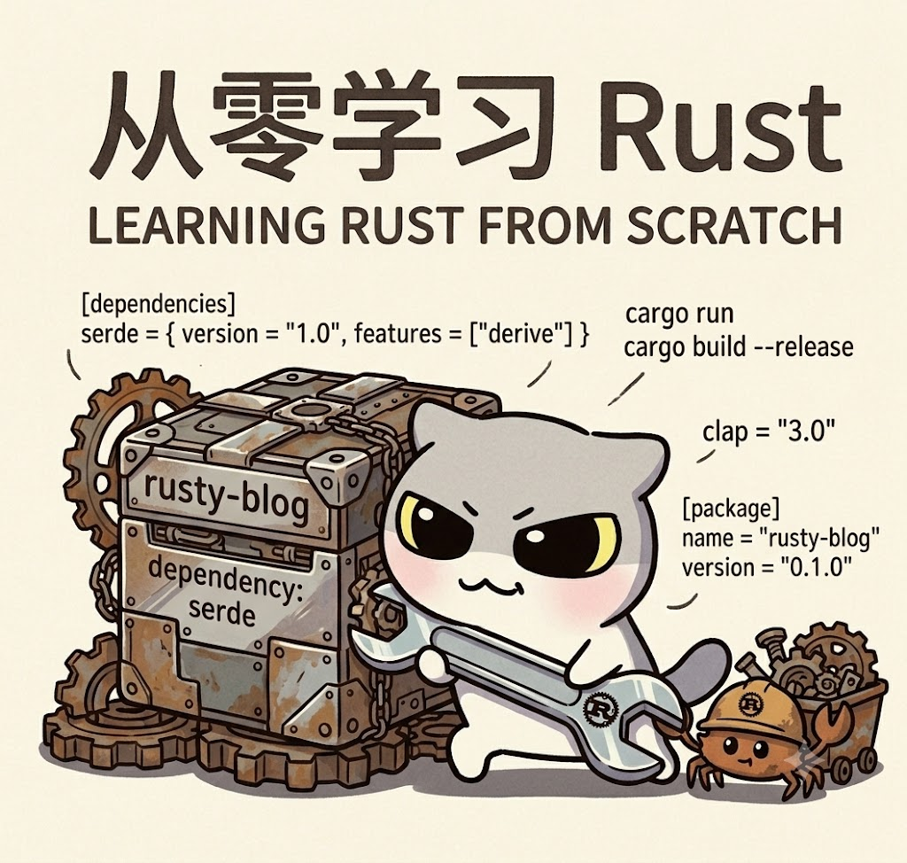

## 第二篇：借用与生命周期 —— 内存安全的“司法解释”

> 本文为第二篇，在阅读前请确保已完成第一篇的环境搭建与所有权基础练习。水平有限。



---

### 开篇答疑：上一篇思考题详解

在正式进入新内容之前，先来回答第一篇末尾留下的三道题——这几道题恰好就是今天主题的绝佳引子。

**思考题 1：以下代码能否编译？**

```rust
fn main() {
    let s = String::from("hello");
    let s_ref = &s;
    let s2 = s;
    println!("{}", s_ref);
}
```

**答案：不能编译。** 错误信息会提示 `cannot move out of 's' because it is borrowed`。

**深度解析：** 当 `let s_ref = &s` 执行时，Rust 创建了一个对 `s` 的**不可变借用**，这个借用的生命周期从创建点开始，持续到 `s_ref` 最后一次被使用（这里是在 `println!`）。在借用仍处于活跃状态时，`let s2 = s` 试图将 `s` 的所有权**移动**给 `s2`。这会导致两个严重问题：
1. `s` 失效后，`s_ref` 就成了指向无效内存的**悬垂指针**；
2. 违反了所有权规则中的“借用期间不得移动原值”。

Rust 的借用检查器在编译期就拦截了这种操作——它要求：**当存在对某个值的借用时，该值的所有权既不能转移（move），也不能被销毁（drop）**。这个规则保证了引用永远指向有效数据。

**思考题 2：实现 `first_word(s: &String) -> &str`**

这是一个非常经典的字符串切片练习。推荐实现如下：

```rust
fn first_word(s: &String) -> &str {
    let bytes = s.as_bytes();          // 将 String 转为字节数组
    for (i, &item) in bytes.iter().enumerate() {
        if item == b' ' {              // 遇到空格，返回到此为止的切片
            return &s[..i];
        }
    }
    &s[..]                             // 没有空格，返回整个字符串
}

fn main() {
    let s = String::from("hello world");
    let word = first_word(&s);
    println!("第一个单词: {}", word);   // 输出 "hello"
    
    // 注意：如果这里尝试修改 s（如 s.clear()），编译会报错
    // 因为 word 仍然借用着 s
}
```

**关键设计意图**：返回的是 `&str`（字符串切片），它本质上是一个**不可变借用**，指向 `s` 内部的一段连续字节序列。这意味着只要 `word` 还存在，`s` 就不能被修改或销毁——借用检查器会在 `main` 的剩余作用域中强制执行这一规则。

**思考题 3（选做）**：鼓励大家阅读官方书第四章，那里有最权威的讲解。

---

这三道题的核心都指向同一个概念：**借用（Borrowing）**。今天我们就以此为起点，深入 Rust 内存安全体系的第二块基石。

---

### 一、回顾：所有权带来的“不便”

在上一篇中我们了解到，所有权规则是这样的：

```rust
fn main() {
    let s1 = String::from("hello");
    let s2 = s1;           // 移动，s1 失效
    // 如果想继续使用 s1 怎么办？
}
```

如果每次把值传给函数或赋值给其他变量都会导致所有权转移，代码会变得极其繁琐——你需要不断地用返回值把所有权“传回来”：

```rust
fn main() {
    let s1 = String::from("hello");
    let (s2, len) = calculate_length(s1);  // s1 移动进去，又通过元组返回
    println!("'{}' 的长度是 {}", s2, len);
}

fn calculate_length(s: String) -> (String, usize) {
    let length = s.len();
    (s, length)   // 把所有权再传回来
}
```

这种写法虽然安全，但毫无 ergonomics（人体工学）可言。**借用（Borrowing）**机制正是为了解决这个问题而生——它允许你**临时使用一个值而不获取其所有权**，就像你从图书馆借书而不需要买下它一样。

---

### 二、引用（Reference）与借用

**引用**是一个指针，它指向某个值但不拥有该值。创建引用的操作叫做**借用**。

#### 2.1 不可变引用（`&T`）

```rust
fn main() {
    let s1 = String::from("hello");
    let len = calculate_length(&s1);   // 传入 &s1，这是不可变引用
    println!("'{}' 的长度是 {}", s1, len);  // s1 仍然有效！
}

fn calculate_length(s: &String) -> usize {  // s 是 String 的引用
    s.len()                                 // 可以读取，但不能修改
} // 这里 s 离开作用域，但因为它不拥有所有权，不会 drop 任何东西
```

关键语义：
- `&s1` 创建了一个指向 `s1` 的引用，但**不拥有** `s1`
- `calculate_length` 中的参数 `s` 是一个引用，函数内部只能读取，不能修改
- 调用结束后，`s1` 的所有权完好无损

#### 2.2 可变引用（`&mut T`）

如果要修改借用的值，需要使用**可变引用**：

```rust
fn main() {
    let mut s = String::from("hello");   // 必须是 mut
    change(&mut s);                      // 传入可变引用
    println!("{}", s);                   // 输出 "hello, world"
}

fn change(s: &mut String) {
    s.push_str(", world");   // 通过可变引用修改原值
}
```

但可变引用有一个**极其严格的限制**：

> **在特定作用域内，对同一数据只能有一个可变引用；或者，可以有多个不可变引用，但不能同时存在可变引用。**

```rust
fn main() {
    let mut s = String::from("hello");
    
    let r1 = &mut s;
    let r2 = &mut s;  // 编译错误！不能同时存在两个可变引用
    
    println!("{}, {}", r1, r2);
}
```

```rust
fn main() {
    let mut s = String::from("hello");
    let r1 = &s;      // 不可变引用
    let r2 = &s;      // 多个不可变引用可以
    let r3 = &mut s;  // 编译错误！不能同时有不可变和可变引用
    
    println!("{}, {}, {}", r1, r2, r3);
}
```

**为什么这么严格？** 这个规则在编译期彻底排除了**数据竞争（data race）**——即两个指针同时读写同一块内存，导致未定义行为。在 C/C++ 中数据竞争是运行时噩梦，而在 Rust 中它是编译期错误。

**注意**：引用的作用域结束于它**最后一次被使用**的地方，而非词法作用域的末尾。因此以下代码是合法的：

```rust
fn main() {
    let mut s = String::from("hello");
    let r1 = &s;
    let r2 = &s;
    println!("{} and {}", r1, r2);  // r1, r2 最后一次使用在这里
    // 之后 r1, r2 不再有效
    
    let r3 = &mut s;               // OK！因为不可变引用已失效
    r3.push_str(" world");
    println!("{}", r3);
}
```

这个细微之处称为 **NLL（Non-Lexical Lifetimes，非词法生命周期）**，是 Rust 2018 版本引入的重要改进，让借用检查更加智能。

---

### 三、悬垂引用（Dangling Reference）与生命周期的诞生

在 C/C++ 中，最令人头疼的问题之一是**悬垂指针**——指针指向的内存已被释放。Rust 在编译期完全杜绝了这个问题。

以下代码**无法编译**：

```rust
fn main() {
    let reference_to_nothing = dangle();
}

fn dangle() -> &String {      // 返回一个 String 的引用
    let s = String::from("hello");
    &s                         // 引用指向 s，但 s 即将被 drop
} // s 离开作用域，内存被释放，引用成为悬垂指针
```

编译器会报错：`missing lifetime specifier`，并提示 `this function's return type contains a borrowed value, but there is no value for it to be borrowed from`。

Rust 如何防止这种情况？答案是**生命周期（Lifetimes）**——这是 Rust 编译器用来跟踪所有引用有效范围的一种静态分析方法。

---

### 四、生命周期标注（Lifetime Annotations）

大多数情况下，Rust 可以**自动推断**生命周期（称为“生命周期省略规则”），无需我们手动标注。但在某些场景下，当编译器无法确定引用的存活时长时，我们需要显式标注。

生命周期标注的语法非常独特：以 `'` 开头，通常使用小写字母，如 `'a`、`'b`。它**不改变引用的实际生命周期**，只是用来描述多个引用之间的**存活关系**。

#### 4.1 最常见的例子：返回两个引用中较长的那个

```rust
fn longest<'a>(x: &'a str, y: &'a str) -> &'a str {
    if x.len() > y.len() { x } else { y }
}

fn main() {
    let string1 = String::from("abcd");
    let string2 = "xyz";   // 字符串字面量是 &'static str
    
    let result = longest(&string1, string2);
    println!("较长的字符串是 {}", result);
}
```

`<'a>` 是泛型生命周期参数，它表示：`x`、`y` 和返回值 **三者拥有相同的生命周期 `'a`**。具体含义是：**返回值的生命周期不会超过 `x` 和 `y` 中较短的那个**。

看一个错误示例来理解：

```rust
fn main() {
    let string1 = String::from("long long");
    let result;
    {
        let string2 = String::from("xyz");
        result = longest(&string1, &string2);
    } // string2 在这里被 drop
    println!("{}", result);  // 编译错误！result 可能引用了已释放的 string2
}
```

编译器会指出：`result` 要求 `'a` 的生命周期至少覆盖到 `println!`，但 `string2` 的生命周期在内部作用域就结束了——Rust 通过生命周期检查阻止了这种悬垂引用。

#### 4.2 结构体中的生命周期

当结构体存储引用时，必须标注生命周期：

```rust
struct ImportantExcerpt<'a> {
    part: &'a str,   // 表示这个引用不能比结构体实例活得短
}

fn main() {
    let novel = String::from("Call me Ishmael. Some years ago...");
    let first_sentence = novel.split('.').next().expect("没有找到句号");
    let excerpt = ImportantExcerpt {
        part: first_sentence,
    };
    // excerpt 的生命周期与 first_sentence 绑定
    println!("{}", excerpt.part);
}
```

这里 `ImportantExcerpt<'a>` 告诉编译器：结构体实例的存活时间**不能超过** `part` 字段所引用的数据的存活时间。只要 `novel` 在 `excerpt` 之前被 drop，就会编译报错。

#### 4.3 静态生命周期 `'static`

`'static` 是一个特殊的生命周期，表示引用**在整个程序运行期间都有效**。所有字符串字面量（如 `"hello"`）都具有 `'static` 生命周期，因为它们直接被编译进二进制文件的只读段。

```rust
let s: &'static str = "我存在于整个程序的生命周期中";
```

但需要谨慎：**不要将 `'static` 当作“万能解药”**。很多时候将引用标注为 `'static` 会过度限制函数的使用场景，而实际上你只是想表达“这个引用至少要活这么久”。在绝大多数场景中，使用泛型生命周期参数是更灵活的选择。

---

### 五、借用与生命周期的联合规则（三条黄金法则）

综合借用与生命周期，Rust 的内存安全核心可以概括为三条编译期检查规则：

1. **所有权法则**：每个值有且仅有一个所有者；所有者离开作用域则值被释放。
2. **借用法则（引用规则）**：
   - 任一时刻，要么有**一个**可变引用，要么有**多个**不可变引用，二者不可共存。
   - 所有引用必须始终有效（即不得悬垂）。
3. **生命周期法则**：借用者（引用的使用方）的生命周期不得超过被借用者（数据的拥有者）的生命周期。

这三条规则构成了 Rust 内存安全的完整静态度量系统——它不需要运行时 GC，也不需要开发者手动管理内存，所有安全检查都在编译期完成。

---

### 六、深度实战：实现一个安全的“单词分割器”

让我们综合运用可变引用、切片和生命周期，构建一个实用的工具函数。

**需求**：实现一个函数，接受一个字符串切片，返回一个迭代器风格的结构体，能够逐个返回单词。

```rust
struct WordSplitter<'a> {
    text: &'a str,
    position: usize,
}

impl<'a> WordSplitter<'a> {
    fn new(text: &'a str) -> Self {
        WordSplitter { text, position: 0 }
    }
    
    fn next_word(&mut self) -> Option<&'a str> {
        let bytes = self.text.as_bytes();
        let len = bytes.len();
        
        // 跳过前导空格
        while self.position < len && bytes[self.position] == b' ' {
            self.position += 1;
        }
        
        if self.position >= len {
            return None;
        }
        
        let start = self.position;
        while self.position < len && bytes[self.position] != b' ' {
            self.position += 1;
        }
        
        Some(&self.text[start..self.position])
    }
}

fn main() {
    let sentence = String::from("   Rust 生命周期  实战  示例  ");
    let mut splitter = WordSplitter::new(&sentence);
    
    while let Some(word) = splitter.next_word() {
        println!("单词: '{}'", word);
    }
    // 输出：
    // 单词: 'Rust'
    // 单词: '生命周期'
    // 单词: '实战'
    // 单词: '示例'
}
```

**生命周期分析**：
- `WordSplitter<'a>` 结构体持有 `text: &'a str`，意味着结构体实例的存活时间必须短于 `text` 所指向的字符串数据。
- `next_word()` 返回 `Option<&'a str>`，保证返回的字符串切片与 `text` 拥有相同的生命周期——即它们指向 `text` 内部的某一段，只要 `text` 有效，切片就有效。
- 在 `main` 中，`sentence` 是 `String`，我们通过 `&sentence` 创建了一个引用传入，这个引用的生命周期覆盖了 `splitter` 的整个使用过程，因此完全安全。

---

### 七、本篇小结

今天我们完成了 Rust 学习路线上最关键的一道门槛：

- **引用的两种类型**：不可变引用 `&T` 和可变引用 `&mut T`，以及它们的并发安全规则。
- **借用的核心约束**：借用期间不得移动或销毁原值，多个借用之间的互斥规则。
- **生命周期的本质**：它不是运行时机制，而是编译期用来验证引用有效性的“标注语言”。
- **生命周期标注语法**：`'a` 泛型参数、结构体中的生命周期、`'static` 常量生命周期。
- **实战构建**：利用生命周期安全地实现一个借用内部数据的迭代器式结构体。

如果说所有权是 Rust 内存安全的“宪法”，那么借用和生命周期就是它的“司法解释”——它们共同构成了一个无运行时开销的内存安全体系。这对于科班出身的你来说，可以理解为：**Rust 在类型系统中编码了资源的生命周期约束，使得非法内存操作在编译期就被类型检查器拒之门外**。这正是类型驱动编程在系统级语言中最强有力的体现。

---

### 八、思考题与练习

1. **修改以下代码使其通过编译**，并解释为什么要这样改：
   ```rust
   fn main() {
       let mut data = vec![1, 2, 3];
       let first = &data[0];
       data.push(4);
       println!("{}", first);
   }
   ```

2. **设计一个函数** `longest_with_announcement<'a, T>(x: &'a str, y: &'a str, ann: T) -> &'a str where T: std::fmt::Display`，它先打印 `ann`，然后返回较长的字符串。这个签名中的泛型生命周期和 trait bound 分别解决了什么问题？

3. **分析以下代码中每个引用的生命周期**，画出内存中的引用关系图：
   ```rust
   fn main() {
       let s = String::from("hello world");
       let words: Vec<&str> = s.split_whitespace().collect();
       let first = words[0];
       println!("{}", first);
   }
   ```
   为什么 `words` 可以持有 `&str` 而不会导致悬垂？

---

**下一篇预告：** 我们将进入 **类型系统** 的腹地——**结构体、枚举与模式匹配**。从 `struct` 的方法实现到 `enum` 的精巧设计，再到 `Option<T>` 和 `Result<T, E>` 的优雅错误处理，你会发现 Rust 的类型系统是如何将“空指针异常”和“异常处理泥潭”变成历史的。敬请期待！