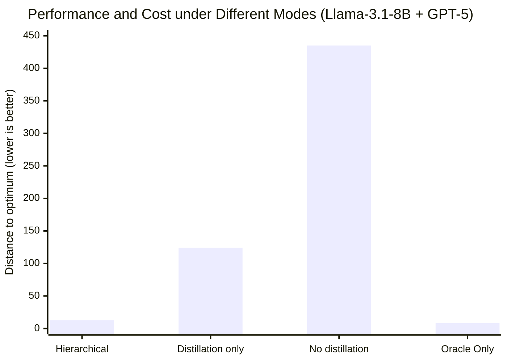

# Hierarchical Prompt-Domain Control and Learning for Resource-Constrained Agentic Language Models

## Introduction: When an 8B Model's "Working Memory" Begins to Fade

Imagine this: you deploy a 7B‑parameter open‑source model as a decision‑making agent for a scientific experiment. At first, it performs perfectly—it selects the right experimental parameters, follows the required output format, and makes sound inferences. But as the experiment proceeds, you keep appending history records to the prompt:

> "Evaluated points: [1.2, 3.4, 5.1, ...] (47 in total), corresponding errors: [...], uncertainties: [...], remaining time: 234s ..."

By round 50, the model starts outputting empty results, format errors, or even gibberish. The prompt is still well within the 128K context window, yet the model has effectively "gone on strike."

**This is not hallucination, nor is it the model getting dumber—it is Prompt‑Domain Drift.**

This paper, from UC Irvine and Los Alamos National Laboratory, is the first to systematically formalise this phenomenon and proposes an elegant hierarchical control and learning framework that keeps compact models stable and reliable in resource‑constrained agent deployments.

---

## 1. Core Problem: Why Does "Adding More Context" Backfire?

### 1.1 Superficial Reasons vs. Deep Causes

Most practitioners, when faced with "performance drop under long contexts," first think:

- Am I exceeding the context window? → Check: no, still far from it.
- Should I use a larger model? → But resources are limited.

The paper points out that the root causes are **Attention Dilution** and **Prompt Saturation**.

**Intuitive explanation**: Each attention head in a Transformer layer acts like a "spotlight" with a fixed total light flux. As the prompt grows longer, that spotlight must illuminate more and more positions, so any particular position—especially early task‑critical information—receives progressively weaker illumination.

### 1.2 Mathematical Formalisation: The Attention Dilution Theorem

The paper provides a concise but powerful theorem (Theorem 5.1):

Let \(\mathbb{R}\) be a **fixed‑size** task‑relevant subsequence within the prompt (e.g., "the optimal value of the objective function is near x=5"). As the total prompt length \(\ell\) grows, the contribution of \(\mathbb{R}\) to the output logits satisfies:

\[
\lim_{\ell \to \infty} \left\| \Delta L_{\mathbb{R}}^{(\ell)} \right\| = 0
\]

That is, no matter how important \(\mathbb{R}\) is, as long as its token count is fixed and the total context keeps expanding, its influence on the final decision **decays to a negligible level**.

 **Caption**: This figure illustrates the core mechanism of attention dilution—the attention weight of the task‑relevant subsequence decays to zero as the total prompt length increases, causing its contribution to the final output to vanish.

### 1.3 Hardware Limits vs. Practical Effective Limits

Using Lemma 5.1, the paper gives the maximum feasible prompt length under hardware constraints:

\[
|\rho|_{\text{feasible}} \leq \min\left\{S_{\text{model}},\ \left\lfloor \frac{M_{\text{max}} - M_w - M_{\text{misc}}}{B \cdot L \cdot (2n_{\text{kv}}d_h) \cdot b_{\text{kv}}} \right\rfloor \right\}
\]

This is the upper bound set by KV cache capacity. However, the experiments in the paper (Table 3) show:

| Model | Hardware‑feasible length | Actual effective length | Ratio |
|-------|--------------------------|-------------------------|-------|
| Llama‑3.1‑8B | 58,000 tokens | ~1,600 tokens | **2.8%** |
| Mistral‑7B | 64,000 tokens | ~940 tokens | **1.4%** |

**The gap is striking**—the model becomes ineffective due to attention dilution long before hitting the hardware limit.

---

## 2. Solution: Hierarchical Control and Learning Architecture

The paper proposes a three‑tier architecture, as shown in the figure:

 **Caption**: This figure illustrates the workflow of the three‑tier architecture. In the forward path, the controller projects the state onto the feasibility domain before feeding it to the student model for output generation. In the feedback path, the output is decomposed into protocol and semantic parts, evaluated by the controller (for format validity) and the Oracle (for semantic correctness), respectively. When drift is detected, the controller triggers lightweight online fine‑tuning to update the student model.

### 2.1 Phase 1: Offline Schema Distillation

**Goal**: Teach the compact model how to "speak" the required format—i.e., to output structures like JSON, `RESULT=[model,point]`, etc., that comply with the system interface.

**Method**: Use an Oracle model to generate standard‑format responses for a large number of states, forming a dataset, and then train the student model via supervised fine‑tuning.

Key insight: **format requirements are static**—once the system interface is fixed, the output format is set. Therefore, this part can be fully learned offline, without the need for trial‑and‑error during deployment.

**Loss function** (protocol‑reweighted KL divergence):

\[
\mathcal{L}_{\text{dis}}(\theta, \mathcal{B}) = \mathbb{E}_{(S_t, S_{t+1}) \sim \mathcal{B}} \left[ D_{\text{KL}}\left( \bar{\pi}_{\phi}(\cdot|\mathcal{S}_t) \parallel \pi_{\theta}(\cdot|\mathcal{S}_{t+1}) \right) \right]
\]

where \(\bar{\pi}_{\phi}\) assigns higher weights to protocol‑critical tokens (e.g., `RESULT`, `[`, `,`, `]`).

### 2.2 Phase 2: Online Semantic Adaptation

**Goal**: During deployment, when the student model exhibits semantic drift, perform lightweight online fine‑tuning using supervised data from the Oracle.

**Key mechanisms**:
- The controller continuously monitors the student model's **protocol validity** and **semantic performance**.
- When drift is detected, it collects the most recent K Oracle‑student paired trajectories.
- These data are used to perform small‑batch LoRA updates on the student.

**Loss function** (semantic consistency):

\[
\mathcal{L}_{\text{ft}}(\theta, \mathcal{T}) = \mathbb{E}_{S_t \sim \mathcal{T}} \left[ D_{\text{KL}}\left( \pi_{\phi}(\cdot|S_t) \parallel \pi_{\theta}(\cdot|\hat{S}_t) \right) \right]
\]

> **Key difference**: Phase 1 learns "how to speak" (format), while Phase 2 learns "what to say" (decisions). They are separated so they do not interfere with each other.

### 2.3 The Controller's Core: Prompt Projection

This is the "brain" of the entire framework. The controller's responsibilities are:

1. **Monitoring**: whether the current accumulated state is still within the student model's feasible prompt domain.
2. **Projection**: when approaching the boundary, compress the full history into a more compact yet sufficiently informative summary.
3. **Triggering**: decide when to call the Oracle for supervision or fine‑tuning.

**Formalisation of projection**:

\[
\mathcal{P}_{\mathcal{O}}: \mathbb{V}^* \to \mathcal{D}, \qquad \tilde{\mathbf{S}}_t = \mathcal{P}_{\mathcal{O}}(\mathbf{S}_t)
\]

where \(\mathbb{V}^*\) is the set of all possible sequences, and \(\mathcal{D}\) is the feasible prompt domain of the student model.

**Projection strategy in the paper (using MFBO as an example)**:
- Partition the historical evaluation points into intervals \(\{I_k\}\).
- Represent each interval by aggregate statistics: mean error \(\bar{e}_k\), mean uncertainty \(\bar{u}_k\).
- Retain representative evaluation points per interval and discard redundant information.
- This ensures that the "global view" is not sacrificed while the prompt length is kept under control.

**Theoretical foundation**: The paper proves that under a certain natural condition (string submodularity), the greedy projection achieves a \((1 - e^{-1})\) approximation guarantee to the optimal summary (Proposition 5.2).

---

## 3. Experimental Validation: Performance on Multi‑Fidelity Bayesian Optimisation

### 3.1 Experimental Setup

The paper uses **Multi‑Fidelity Bayesian Optimisation (MFBO)** as the testbed.

**Why MFBO?**
- It is a classic **sequential decision‑making** task: each round selects the next sampling point and fidelity level.
- The state **grows continuously** with iterations (evaluation points, errors, uncertainties, remaining time).
- The output is **structured**: must return `RESULT=[model,point]`.
- There are **resource constraints**: limited time/computation budget.

**Fidelity models**: 4 models with accuracies 0.25, 0.5, 0.75, and 1.0, and execution costs 1, 2, 3, and 4 minutes, respectively.

**Model configuration**:
- **Student models**: Llama‑3.1‑8B, Mistral‑7B (LoRA fine‑tuned, ~1% of parameters)
- **Oracle models**: GPT‑5, GPT‑5‑nano
- **Hardware**: NVIDIA Tesla V100 16GB

### 3.2 Phase 1: Sample Efficiency of Schema Distillation

| Student model | Data volume | Epochs | Time | Format accuracy |
|---------------|-------------|--------|------|-----------------|
| Llama‑3.1‑8B | 5,000 | 5 | 8:35 | 1.00 |
| Mistral‑7B | 5,000 | 10 | 8:52 | 0.20 |

**Key findings**: Llama‑3.1‑8B achieved 100% format accuracy with 5,000 samples and 5 epochs. Under the same conditions, Mistral‑7B only reached 20%, highlighting significant inter‑model differences.

### 3.3 Phase 2: Difficulty of Semantic Adaptation

| Oracle | Student | Data volume | Model‑selection accuracy | Point error |
|--------|---------|-------------|--------------------------|-------------|
| GPT‑5 | Llama‑3.1‑8B | 50 | 0.42 | 22.81 |
| GPT‑5 | Mistral‑7B | 10 | 0.086 | 61.37 |

**Key findings**: Semantic adaptation is **much more difficult** than format learning. Even with 50 carefully selected online samples, the model‑selection accuracy is only 0.42. Mistral‑7B performs particularly weakly, consistent with its lower effective prompt‑length threshold.

### 3.4 End‑to‑End Results

| Oracle | Student | Mode | Distance to optimum ↓ | # Evaluations ↑ | Oracle invocation frequency | Cost |
|--------|---------|------|-----------------------|-----------------|-----------------------------|------|
| GPT‑5 | Llama | **Hierarchical** | **12.74** | **121** | **3.47%** | **$2.25** |
| GPT‑5 | Llama | Distillation only | 124.1 | 74 | - | ~$0 |
| GPT‑5 | Llama | No distillation | 435.1 | 12 | - | ~$0 |
| GPT‑5 | Oracle Only | - | 8.04 | 144 | 100% | $8.25 |

**Key findings**:
- The hierarchical architecture significantly outperforms both the distillation‑only and no‑distillation baselines.
- Llama‑3.1‑8B in hierarchical mode approaches Oracle‑only performance (12.74 vs 8.04), but at **only 27% of the cost**.
- The Oracle invocation frequency is only 3.47%, meaning 96.5% of decisions are made by the student model independently.
- This demonstrates that hierarchical supervision **maintains decision quality while drastically reducing inference cost**.

 **Caption**: The bar chart shows that the hierarchical architecture significantly outperforms both the distillation‑only and no‑distillation baselines in terms of distance to optimum, approaching Oracle‑only performance.

### 3.5 Visualisation Results

Figures 2‑3 in the paper show the function approximation quality under different modes:

- **Oracle‑only**: black dashed line = true function; coloured dashed lines = fidelity models; blue solid line = actual approximation; confidence intervals are reasonable.
- **Hierarchical**: approximation quality is close to Oracle‑only, with only minor deviations in a few regions.
- **Distillation‑only**: approximation quality degrades substantially, especially near peak regions.
- **No distillation**: almost completely fails to approximate the objective function.

---

## 4. Theoretical Toolbox: Why This Framework Stands on Solid Ground

What makes this paper valuable is not just the engineering implementation, but also the solid theoretical support.

### 4.1 Formalising Feasibility with Greedoids

The paper uses **Greedoids** (a structure more general than matroids) to model the evolution of feasible prompt sequences. This guarantees that:

- The empty sequence is always feasible.
- Any non‑empty feasible sequence can be reduced to a smaller feasible sequence by removing some element.
- For any two feasible sequences, the shorter one can be extended by adding an element from the longer one.

**Intuitive translation**: The process of constructing prompts always has a "path" forward and will not get stuck in a dead end.

### 4.2 String Submodularity

The paper defines **String Submodularity**:

\[
f(\mathbb{S}^1 \oplus s) - f(\mathbb{S}^1) \geq f(\mathbb{S}^2 \oplus s) - f(\mathbb{S}^2), \quad \text{when } \mathbb{S}^1 \preceq \mathbb{S}^2
\]

**Intuitive meaning**: The marginal benefit of adding information diminishes. When you already have a lot of information, adding a little more yields less benefit than when you have little information.

This is precisely the theoretical basis for "retaining a representative summary instead of the entire history"—because much of the historical information has already become "saturated."

### 4.3 Greedy Approximation Guarantee for Projection

Based on submodularity, the paper proves that the greedily selected summary achieves a \((1 - e^{-1}) \approx 63\%\) approximation guarantee to the optimal summary (Proposition 5.2).

This provides a solid mathematical endorsement for the projection operation—it is not arbitrary truncation, but an approximately optimal compression with theoretical guarantees.

---

## 5. Broader Connections: How This Framework Fits into the Existing Ecosystem

### 5.1 Comparison with PivotRL

PivotRL identifies "pivot" intermediate states in expert trajectories and performs local policy updates at those states.

| Dimension | PivotRL | This Framework |
|-----------|---------|----------------|
| Feasibility guarantee | Verifier reward | **State‑level projection** |
| Triggering mechanism | High‑variance states | **Prompt‑domain boundary + drift detection** |
| Core advantage | Policy optimisation with low compute | **Keeping the model in its stable operating region** |

The two are complementary—PivotRL optimises the policy, while this framework guarantees a "safety zone" for policy execution.

### 5.2 Relationship with Prompt Compression (LLMLingua)

LLMLingua compresses prompts by removing low‑utility tokens to accelerate inference.

The projection in this framework can be seen as a **structured version** of LLMLingua:
- First distinguish "protocol/format tokens" from "semantic/history tokens".
- Protocol tokens **must be retained** (otherwise system communication fails).
- Only the semantic part is compressed.

This ensures that "format correctness" is never compromised by compression.

### 5.3 Synergy with MemGPT

MemGPT treats long contexts as a memory management problem across different tiers.

This framework provides **feasibility‑aware memory management rules**: proactively project before reaching the state boundary, rather than reacting passively when context overflows.

---

## 6. Limitations and Future Directions

### 6.1 Limitations of the Experimental Scope

- Validation was performed only on MFBO, not on broader agent benchmarks such as WebArena or ALFWorld.
- Only two compact models (7B/8B) and two Oracles were tested.
- The hyperparameter space for online fine‑tuning was explored only to a limited extent.

### 6.2 Safety and Ethical Considerations

The paper frankly acknowledges:

> "More reliable agentic systems may also be misused… In high‑stakes domains, this framework should be combined with domain‑specific safety constraints, access control, human oversight, and careful evaluation."

This is not a "fully autonomous" solution—it balances automation with human supervision by controlling the frequency of Oracle invocations.

### 6.3 Future Directions

- **Broader benchmarking**: WebArena, ALFWorld, GAIA.
- **Adaptive scheduling**: dynamic adjustment of learning rates, LoRA ranks, buffer sizes, and intervention frequencies.
- **Cross‑architecture generality**: MoE models, different instruction‑tuning strategies.
- **Learnable projection**: using neural networks to learn the projection instead of greedy rules.

---

## 7. Conclusion: From "Bigger" to "Smarter"

In the wave of pursuing "larger models" and "longer contexts," this paper offers a sobering reminder:

> **A larger context window does not equal a more reliable decision‑making agent.** Before hitting hardware limits, the attention mechanism of compact models has already "diluted" the early critical information.

The hierarchical framework proposed in this paper—**offline format learning, online decision tuning, and state‑aware projection**—provides a pragmatic path:

- Do not blindly rely on giant models.
- Do not stack unlimited history.
- Under finite resources, use structured control and learning to enable compact models to achieve reliability close to that of much larger models.

This may well become the norm for future agent deployments: **not always using the most powerful model to its limit, but making the right model work in the smartest way under the right constraints.**

---

*References: Vendrell Gallart, J., Bent, R., & Grosskopf, M. (2026). Hierarchical Prompt-Domain Control and Learning for Resource-Constrained Agentic Language Models. arXiv:2605.27703.*