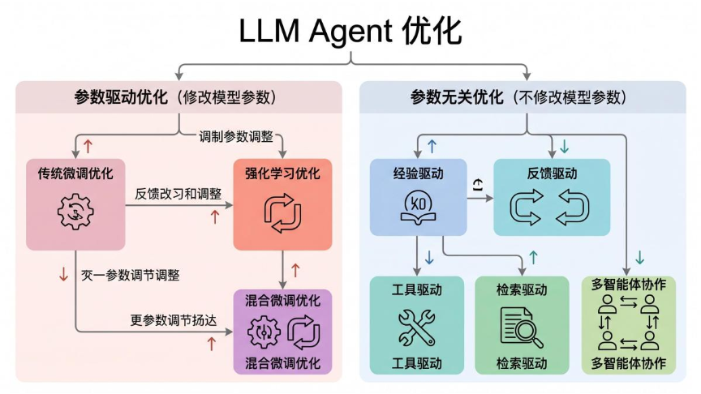
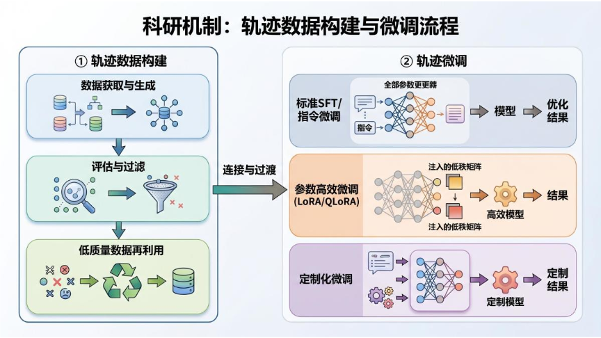

# 大语言模型智能体的优化之道：从参数微调到无参数进化

## 引言：当 LLM 穿上“智能体”的外衣

大语言模型（LLM）无疑是近年 AI 领域最耀眼的明星。它们能写诗、能编程、能推理，但你有没有想过——**如果只是让 LLM 回答一个静态问题，那它和一部高级百科全书有什么区别？**

真正的智能，体现在 **与环境交互、自主决策、持续学习** 的能力上。这正是 **LLM 智能体（LLM-based Agent）** 的使命：把 LLM 作为“大脑”，赋予它感知、规划、记忆、行动和执行的能力，让它能像人一样完成复杂的多步任务。

然而，理想很丰满，现实很骨感。原始的 LLM 是为“下一个词预测”而训练的，它并不擅长 **长期规划、错误恢复、动态适应**。于是，研究者们开始思考一个核心问题：

> **如何优化 LLM，使其成为更强大、更可靠的智能体？**

这篇来自华东师范大学等机构的综述论文，首次将这一领域的所有方法系统性地划分为 **参数驱动（Parameter-driven）** 与 **参数无关（Parameter-free）** 两大阵营，并进一步拆解为六大类优化策略。下面，就让我们沿着这条清晰的路线图，一探 LLM 智能体优化的全貌。

---

## 一、全景概览：优化的两条主线

整个优化宇宙可以这样划分：

**参数驱动** 的方法就像“训练运动员”——通过调整模型内部的权重，让 LLM 从根本上学会智能体的行为模式。**参数无关** 的方法则像“给运动员配装备”——不改变模型本身，而是通过提示工程、外部知识、多智能体协作等方式，在推理时提升表现。

两者并非对立，而是 **互补** 的。实际生产中，最强大的智能体往往是“训练有素”且“装备精良”的。

---

## 二、参数驱动优化：重塑智能体的“肌肉记忆”

### 2.1 传统微调优化 —— 从模仿开始

这是最基础的优化路径。核心思路是：**收集大量高质量的“智能体行为轨迹”，然后用监督学习的方式让 LLM 学会这些轨迹**。

整个流程分为两步：

#### 轨迹数据从哪来？

论文归纳了四种主要来源，各有优劣：

| 来源 | 优点 | 缺点 |
|------|------|------|
| **专家标注** | 质量最高，任务对齐好 | 成本高、规模小、难以获取 |
| **强 LLM 生成**（如 GPT-4） | 稳定、高质量 | 费用高、可能引入偏差 |
| **自探索环境交互** | 成本低、易扩展 | 容易产生低质量轨迹，需严格过滤 |
| **多智能体协作生成** | 多样性好、鲁棒性强 | 协调机制复杂，设计难度大 |

其中，**自探索** 方法近年来备受关注。比如 **ReAct** 风格的轨迹（思考→行动→观察交替进行）被广泛用作基础数据。而 **Toolformer** 甚至让模型自己在语料中“尝试”插入 API 调用，如果插入后能降低预测损失，就保留下来——完全无需人工标注！

#### 数据过滤：确保“好钢用在刀刃上”

生成的数据不能全盘接收，必须经过筛选。论文将过滤方法分为三类：

- **环境反馈型**：根据任务成功/失败给出二值奖励（如 AgentTuning）。
- **人工/规则型**：人工检查或基于预定义标准（如多样性、一致性）评分。
- **模型型**：用 LLM（如 GPT-4）自动评分、排序（如 COEVOL）。

#### 低质量数据的“变废为宝”

失败轨迹同样有价值。一些方法（如 ETO、AgentBank）通过配对成功与失败轨迹，让模型学会区分“对”与“错”。另一些则利用失败案例训练模型识别错误、避免幻觉。

#### 微调策略三剑客

- **标准 SFT**：全参数微调，最直接有效。AgentTuning、Agent-FLAN 等都采用此方法。
- **参数高效微调（PEFT）**：如 LoRA、QLoRA，只更新少量参数，大大降低资源消耗。FireAct、Agent Lumos 等广泛使用。
- **定制化微调**：针对特定任务设计专用损失函数或训练流程，如 ATM 的 MITO 损失（结合 SFT 与 KL 正则化），ENVISIONS 的对比学习循环微调。

**小结**：传统微调优化提供了稳定、可控的基线，但它的本质是 **“克隆”** ——模仿已有行为，缺乏探索和适应新环境的能力。这就引出了下一个层级。

---

### 2.2 强化学习优化 —— 在试错中进化

如果说微调是“照着食谱做菜”，那强化学习就是“自己尝味道、调整火候”。LLM 智能体与环境交互，根据 **奖励信号** 或 **偏好比较** 来优化自己的策略。

论文将 RL 优化分为两条分支：

#### 分支一：奖励函数驱动的优化

核心是设计一个奖励函数，告诉智能体“做得好”还是“做得差”，然后用 PPO、Actor-Critic 等算法更新策略。

奖励的来源多种多样：

| 奖励类型 | 代表工作 | 特点 |
|----------|----------|------|
| **环境奖励** | AgentGym, CMAT | 直接来自任务成败，简单但稀疏 |
| **模型奖励** | WebRL, StepAgent | 用辅助模型提供细粒度、步骤级反馈 |
| **定制奖励** | AGILE, SaySelf, DeepResearcher | 结合任务特定目标（如效率、置信度）设计复合奖励 |

例如，**AGILE** 设计了一个平衡任务完成度与“求助专家”成本的奖励函数，让智能体在遇到困难时懂得主动求助，而非死磕到底。**DeepResearcher** 则让智能体在真实网页环境中进行多轮搜索与推理，用 RL 优化整个调研流程。

#### 分支二：偏好对齐优化

当明确的奖励信号难以定义时，偏好对齐成为替代方案。最流行的方法是 **DPO（Direct Preference Optimization）**。

DPO 不需要训练一个独立的奖励模型，而是直接使用偏好数据 $(x, y_w, y_l)$（其中 $y_w$ 是更优回答，$y_l$ 是较差回答），通过一个简洁的损失函数优化策略：

$$ \mathcal{L}_{DPO} = -\mathbb{E}\left[\log \sigma\left(\beta \log\frac{\pi_\theta(y_w|x)}{\pi_{ref}(y_w|x)} - \beta \log\frac{\pi_\theta(y_l|x)}{\pi_{ref}(y_l|x)}\right)\right] $$

这个公式的本质是：**增加优秀回答的相对概率，减少差劲回答的相对概率**，同时通过 $\beta$ 控制更新幅度，防止偏离参考模型太远。

偏好数据的构建也有不同策略：

- **专家/人类偏好**：直接使用人类标注或专家轨迹（如 IPR、DMPO）
- **任务/环境偏好**：根据任务成功率、环境反馈自动生成偏好对（如 ETO、Agent Q）

**Agent Q** 是其中的佼佼者：它使用蒙特卡洛树搜索（MCTS）探索动作空间，然后从 MCTS 的访问次数和成功反馈中构建偏好对，再用 DPO 优化策略，在复杂交互任务上取得了显著提升。

---

### 2.3 混合微调优化 —— 兼收并蓄

既然 SFT 稳定但缺乏探索，RL 探索力强但成本高，那何不 **先 SFT 热身，再 RL 冲刺**？

这正是混合优化的核心思想。大多数工作采用 **顺序式** 混合：先用行为克隆（BC）或 SFT 训练一个基础智能体，再在其上应用 RL（PPO/DPO）进行微调。

例如：
- **ETO**：先用 BC 训练，再用 DPO 对齐偏好。
- **AGILE**：先用 SFT，再用 PPO 优化决策。
- **AMOR**：先用 SFT，再用 KTO（Kahneman-Tversky Optimization）进行偏好调整。

也有少数 **非顺序式** 方法，如 **OPTIMA** 在训练过程中交替使用 SFT 和 DPO，实现迭代式提升。

混合优化已成为当前最流行的范式，OpenAI 的 **Reinforcement Fine-Tuning (RFT)** 正是这一思路的典型代表。

---

## 三、参数无关优化：不动模型，也能变强

并非所有优化都需要修改模型参数。在资源受限或快速迭代的场景下，参数无关方法提供了轻量、灵活的替代方案。

### 3.1 经验驱动优化 —— 让智能体“长记性”

这类方法通过 **记忆模块** 存储历史交互经验，并在后续任务中检索和复用这些经验。

- **Optimus-1** 将探索轨迹转化为层次知识图谱，辅助任务规划。
- **Agent Hospital** 维护医疗记录库和经验库，基于成功/失败案例不断更新指导规则。
- **Expel** 和 **AutoManual** 让智能体自主收集、组织并检索经验知识，指导未来行动。

这就像人类从自己的经历中学习 —— 做得多了，自然就成了“老手”。

---

### 3.2 反馈驱动优化 —— 从批评中成长

反馈可以是来自环境的信号，也可以是模型自身的评价。分为三个子类：

1. **自我反思（Self-Reflection）**  
   **Reflexion** 将任务结果或启发式评估转化为文本反馈，让模型进行自我反思并调整行为。**SAGE** 则引入“检查员”智能体提供迭代反馈，“助理”智能体根据反馈自我修正。

2. **外部反馈（External Feedback）**  
   类似 Actor-Critic 架构，一个外部模型或模块对智能体的行为进行评价。  
   **Retroformer** 训练一个“回顾模型”分析失败原因；**COPPER** 使用共享的“反射器”生成反事实反馈；**InteRecAgent** 用“评论家 LLM”检查“演员”是否违规。

3. **元提示优化（Meta-Prompt Optimization）**  
   不修改模型参数，而是 **优化提示词本身**。  
   **OPRO** 从失败尝试中提取信息，迭代生成更优的指令；**MetaReflection** 类似；**MPO** 则通过 SFT 和 DPO 训练一个“元规划器”，指导高层提示设计。

---

### 3.3 工具驱动优化 —— 学会“使唤”外部资源

智能体区别于普通 LLM 的关键之一就是 **能调用外部工具**（搜索、计算器、代码解释器等）。工具优化方法旨在让智能体更聪明地选择和使用工具。

- **TPTU** 优化任务分解和工具调用顺序。
- **AVATAR** 通过对比不同样本对之间的性能差异，诊断工具使用问题。
- **Middleware** 引入错误反馈机制，对齐工具输入输出。
- **AgentOptimizer** 将函数视作可学习的权重，根据执行结果迭代调整工具集合。

---

### 3.4 检索驱动优化 —— 知识库就是外脑

检索增强（RAG）类方法让智能体在推理时动态获取外部知识，提升事实准确性和适应性。

- **Self-RAG** 将检索与自我反思结合，迭代精炼生成内容。
- **RaDA** 将动态检索和过往经验用于任务分解和动作生成。
- **WebThinker** 实现“推理→检索→合成”的深度调研循环，并用 RL 增强工具调用能力。
- **FlowSearch** 构建动态多智能体知识流框架，支持并行探索与递归证据整合。

---

### 3.5 多智能体协作优化 —— 三个臭皮匠，顶个诸葛亮

让多个各司其职的智能体协同工作，往往能产生超越单体的智能。

- **MetaGPT** 和 **ChatDev** 将软件开发流程角色化（规划、编码、调试、文档）。
- **DyLAN** 和 **MacNet** 动态构建智能体网络，使用重要性评分和早停信号优化推理。
- **Agentverse** 和 **CAPO** 支持迭代提案、评估和计划修订。
- **SMoA** 和 **MAD** 通过“法官”或“选择器”协调多智能体辩论，提高决策质量。

这些框架表明，**协作结构本身也是一种强大的优化手段**。

---

## 四、评估与数据集：我们如何衡量进步？

没有度量，就没有优化。论文系统梳理了评估方法和常用数据集。

### 评估方法论

- **人工评估**：适用于主观任务（创造性、连贯性、情感智能等），但成本高、难扩展。
- **自动化评估**：
  - **静态数据集**：使用既定指标（准确率、执行成功率）评估，适合客观任务。
  - **LLM 作为裁判**：用更强大的模型对输出进行评分或比较。
  - **交互环境评估**：在模拟器中运行智能体，综合规则检查、执行反馈和模型判断。

### 常用基准数据集

| 任务域 | 代表数据集 | 评估指标 |
|--------|------------|----------|
| 数学推理 | GSM8K, MATH, AIME | Exact Match, Pass@k |
| 问答 | HotpotQA, MMLU, PubMedQA | EM, F1, Accuracy |
| 代码 | HumanEval, SWE-bench, LiveCodeBench | Pass@k, 执行成功率 |
| 工具调用 | T-Eval, ToolEval, MINT-Bench | 选择准确率, 调用成功率 |
| Web导航 | WebArena, Mind2Web, WebShop | 任务成功率, 步数效率 |
| 环境交互 | ALFWorld, ScienceWorld, RLCard | 成功率, 平均奖励 |
| 多模态 | VQA v2.0, A-OKVQA, EgoSchema | VQA准确率, 推理准确率 |

此外，还有 **多任务综合基准** 如 AgentBench、AgentEval、GAIA 等，覆盖多个领域，用于评估智能体的泛化能力。

### 微调专用数据集

为了让 LLM 学会智能体行为，专门的轨迹数据集不可或缺。如 AgentInstruct、AgentBank、Agent-FLAN、FireAct、ToRA-CORPUS 等，包含了来自 web、编程、数学、工具调用等场景的高质量 ReAct 风格轨迹。

---

## 五、应用落地：智能体正在改变这些领域

### 🏥 医疗健康

智能体已用于医学问答、诊断、治疗规划、临床模拟。**AI Hospital** 提供动态医患交互环境，**MDAgents** 模拟全科与专科医生协作。最新方法（如 HuatuoGPT-o1）结合 PPO/DPO 强化长期临床推理。但医疗幻觉、隐私合规和长病历处理仍是挑战。

### 🔬 科学研究

**CellAgent** 自动化单细胞数据分析，**ProtAgents** 辅助蛋白质设计，**CRISPR-GPT** 设计基因编辑实验。**AlphaEvolve** 让代码进化型智能体自主发现高效算法，**InternAgent** 构建从想法生成到实验执行的闭环系统。科学领域的高计算成本和长知识检索周期仍待突破。

### 🦾 具身智能

机器人领域，**Voyager** 展示长期记忆和技能迭代学习，**SayCan** 将 LLM 推理与真实机器人动作结合。**AutoT**、**Multiply** 等多模态方法整合视觉、语言、触觉信号。现实世界的不确定性、安全性和长时程一致性是最大难题。

### 💰 金融

金融智能体处理市场预测、交易决策、风险管理。**FinMem** 和 **FinCon** 利用分层记忆和概念强化，**TradingAgents** 采用多智能体分析师协作。**FinVerse** 引入代码执行能力支持精确计算。金融数据敏感性、市场快速变化和可解释性要求高。

---

## 六、挑战与未来方向

### 6.1 算法适应性与效率

当前 RL 算法（PPO）计算开销大，DPO 虽轻量但更适合单步优化。**混合方法** 是提升适应性与效率的 promising 方向。此外，领域迁移时分布偏移问题严重，需要更好的泛化策略。

### 6.2 标准化评估指标

不同任务使用不同指标，难以横向比较。需要统一基准，不仅要衡量任务完成度，还要能 **量化优化的“增量”** ，即追踪 step-wise 改进。

### 6.3 成本与效率约束

长上下文、多轮交互导致 token 消耗和延迟激增。解决方案包括 **上下文优化**、**自适应记忆**、**高效提示工程**，以及可自动生成或本地部署的训练环境。

### 6.4 安全性与鲁棒性

智能体易受提示注入、越狱攻击，且在动态环境中表现不稳定。防御策略包括输入输出过滤、多模型共识、人类在环验证，以及 **对齐驱动训练** 和 **安全感知优化**。

### 6.5 多智能体系统优化

目前多智能体大多依赖冻结 LLM 和基于提示的工作流，缺乏 **联合参数优化**。未来需研究角色规范、信息交换、奖励共享、分层决策等机制，让多智能体系统真正协同进化。

---

## 结语：优化是智能体进化的引擎

从“克隆行为”的微调，到“试错探索”的强化学习，再到“不动声色”的提示与检索增强——LLM 智能体的优化之路，正沿着一条 **从静态到动态、从单一体到协作体、从模仿到创新** 的轨迹飞速演进。

正如这篇综述所揭示的，**没有一种方法能包打天下**。未来的智能体系统必然是多策略融合的“复合体”：用 SFT 打好基础，用 RL 打磨决策，用提示和检索适应变化，用多智能体协作突破局限。

而我们，正站在这一进化洪流的前沿，见证着人工智能从“会说话的模型”走向“会行动的伙伴”。

---

*参考文献：Du, S., Zhao, J., Shi, J., Xie, Z., Jiang, X., Bai, Y., & He, L. (2026). A Survey on the Optimization of Large Language Model-based Agents. arXiv preprint.*