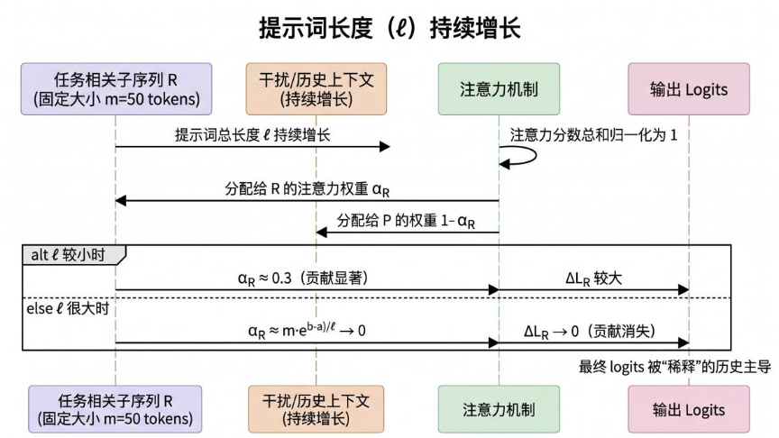
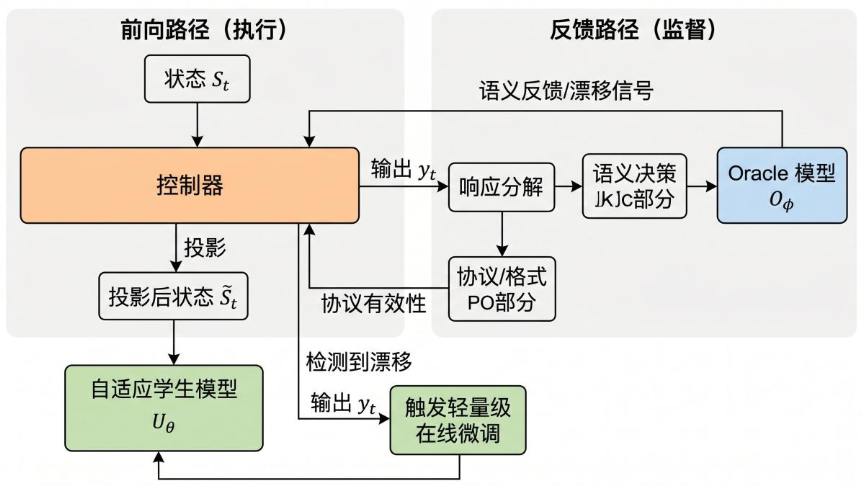

# 资源受限下智能体语言模型的分层提示域控制与学习

## 引言：当 8B 模型的“工作记忆”开始褪色

想象一下：你部署了一个 7B 参数的开源模型作为科学实验的决策智能体。起初，它表现完美——能正确选择实验参数、遵循输出格式、做出合理的推理。但随着实验进行，你不断把历史记录追加到提示词中：

> “已评估点：[1.2, 3.4, 5.1, ...]（共 47 个），对应的误差为 [...]，不确定性为 [...]，剩余时间 234 秒……”

到第 50 轮时，模型开始输出空结果、格式错误、甚至胡言乱语。提示词明明还没超过 128K 的上下文窗口，但模型就是“罢工”了。

**这不是幻觉，也不是模型变笨了——而是提示域漂移（Prompt-Domain Drift）。**

这篇来自 UC Irvine 和 Los Alamos 国家实验室的论文，首次系统性地形式化了这一现象，并提出了一个优雅的分层控制与学习框架，让紧凑模型在资源受限的智能体部署中保持稳定可靠。

---

## 一、核心问题：为什么“加更多上下文”会适得其反？

### 1.1 表面原因 vs 深层原因

大多数从业者遇到“长上下文表现下降”时，第一反应是：

- 是不是超出上下文窗口了？→ 检查：没有，远未达到
- 是不是模型不够强，换更大的？→ 但资源不够

论文指出，根本原因在于 **注意力稀释（Attention Dilution）** 和 **提示域饱和（Prompt Saturation）**。

**直观理解**：每个 Transformer 层的注意力头就像一个“聚光灯”，总光通量是有限的。当提示词越来越长时，这个聚光灯需要照亮越来越多的位置，任何特定位置（尤其是早期任务相关关键信息）获得的光照强度就会越来越弱。

### 1.2 数学形式化：注意力稀释定理

论文给出了一个简洁而有力的定理（Theorem 5.1）：

 设 \(\mathbb{R}\) 是提示中一个**固定大小**的任务相关子序列（如“目标函数最优值在 x=5 附近”）。随着总提示长度 \(\ell\) 增长，\(\mathbb{R}\) 对输出 logits 的贡献满足：
 
 \[
 \lim_{\ell \to \infty} \left\| \Delta L_{\mathbb{R}}^{(\ell)} \right\| = 0
 \]

也就是说，无论 \(\mathbb{R}\) 多么重要，只要它的 token 数量固定，而总上下文不断膨胀，它对最终决策的影响就会**衰减到可以忽略不计**。


 **描述**：该图展示注意力稀释的核心机制——任务相关子序列的注意力权重随总提示长度增加而衰减至零，导致其对最终输出的贡献消失。

### 1.3 硬件极限 vs 实际有效极限

论文用 Lemma 5.1 给出了硬件约束下的最大提示长度：

\[
|\rho|_{\text{feasible}} \leq \min\left\{S_{\text{model}},\ \left\lfloor \frac{M_{\text{max}} - M_w - M_{\text{misc}}}{B \cdot L \cdot (2n_{\text{kv}}d_h) \cdot b_{\text{kv}}} \right\rfloor \right\}
\]

这是 KV Cache 撑爆的上限。但论文的实验表明（Table 3）：

| 模型 | 硬件可行长度 | 实际有效长度 | 比例 |
|------|-------------|-------------|------|
| Llama-3.1-8B | 58,000 tokens | ~1,600 tokens | **2.8%** |
| Mistral-7B | 64,000 tokens | ~940 tokens | **1.4%** |

**差距惊人**——在达到硬件极限之前很久，模型就已经因为注意力稀释而失效了。

---

## 二、解决方案：分层控制与学习架构

论文提出了一套三层架构，如图所示：



 **描述**：该图展示三层架构的工作流。前向路径中，控制器对状态进行可行性投影后交给学生模型生成输出；反馈路径中，输出被分解为协议部分和语义部分，分别由控制器（检查格式有效性）和 Oracle（检查语义正确性）评估。当检测到漂移时，控制器触发轻量级在线微调更新学生模型。

### 2.1 第一阶段：离线格式蒸馏（Schema Distillation）

**目标**：让紧凑模型学会“说话”的格式，即输出符合系统要求的 JSON、RESULT=[model,point] 等结构。

**方法**：用 Oracle 模型对大量状态生成标准格式的响应，形成数据集，然后通过监督微调训练学生模型。

关键洞察：**格式要求是静态的**——一旦系统接口确定，输出格式就固定了。因此这部分完全可以离线学好，不需要在部署时反复试错。

**损失函数**（协议重加权 KL 散度）：

\[
\mathcal{L}_{\text{dis}}(\theta, \mathcal{B}) = \mathbb{E}_{(S_t, S_{t+1}) \sim \mathcal{B}} \left[ D_{\text{KL}}\left( \bar{\pi}_{\phi}(\cdot|\mathcal{S}_t) \parallel \pi_{\theta}(\cdot|\mathcal{S}_{t+1}) \right) \right]
\]

其中 \(\bar{\pi}_{\phi}\) 对协议关键 token（如 `RESULT`、`[`、`,`、`]`）赋予更高权重。

### 2.2 第二阶段：在线语义适应（Semantic Adaptation）

**目标**：在部署过程中，当学生模型出现语义漂移时，用 Oracle 的监督数据进行轻量级在线微调。

**关键机制**：
- 控制器持续监控学生模型的**协议有效性**和**语义表现**
- 检测到漂移时，收集最近 K 个 Oracle-学生配对轨迹
- 用这些数据对学生进行小批量 LoRA 更新

**损失函数**（语义一致性）：

\[
\mathcal{L}_{\text{ft}}(\theta, \mathcal{T}) = \mathbb{E}_{S_t \sim \mathcal{T}} \left[ D_{\text{KL}}\left( \pi_{\phi}(\cdot|S_t) \parallel \pi_{\theta}(\cdot|\hat{S}_t) \right) \right]
\]

> **关键差异**：第一阶段学“怎么说”（格式），第二阶段学“说什么”（决策）。两者分离，互不干扰。

### 2.3 控制器的核心：提示域投影（Prompt Projection）

这是整个框架的“大脑”。控制器的职责是：

1. **监控**：当前累积状态是否仍在学生模型的有效提示域内
2. **投影**：当接近边界时，将完整历史压缩为更紧凑但仍信息丰富的摘要
3. **触发**：决定何时呼叫 Oracle 进行监督或微调

**投影的形式化**：

\[
\mathcal{P}_{\mathcal{O}}: \mathbb{V}^* \to \mathcal{D}, \qquad \tilde{\mathbf{S}}_t = \mathcal{P}_{\mathcal{O}}(\mathbf{S}_t)
\]

其中 \(\mathbb{V}^*\) 是所有可能序列的集合，\(\mathcal{D}\) 是学生模型的可行提示域。

**论文的投影策略（以 MFBO 为例）**：
- 将历史评估点划分为区间 \(\{I_k\}\)
- 每个区间用聚合统计量表示：平均误差 \(\bar{e}_k\)、平均不确定性 \(\bar{u}_k\)
- 保留区间代表性评估点，丢弃冗余信息
- 这保证了“全局视野”不被牺牲，同时提示长度被控制

**理论基础**：论文证明了在某种自然条件下（字符串子模性），贪心投影达到最优摘要的 \((1 - e^{-1})\) 近似保证（Proposition 5.2）。

---

## 三、实验验证：多保真贝叶斯优化中的表现

### 3.1 实验设置

论文使用 **多保真贝叶斯优化（MFBO）** 作为测试平台。

**为什么选 MFBO**？
- 这是一个典型的**序贯决策**任务：每轮选择下一个采样点和保真度模型
- 状态随迭代**持续增长**（评估点、误差、不确定性、剩余时间）
- 输出**结构化**：必须返回 `RESULT=[model,point]`
- 有**资源约束**：有限的时间/计算预算

**保真度模型**：4 个模型，精度分别为 0.25、0.5、0.75、1.0，执行成本分别为 1、2、3、4 分钟。

**模型配置**：
- **学生模型**：Llama-3.1-8B、Mistral-7B（LoRA 微调，约 1% 参数）
- **Oracle 模型**：GPT-5、GPT-5-nano
- **硬件**：NVIDIA Tesla V100 16GB

### 3.2 阶段一：格式蒸馏的样本效率

| 学生模型 | 数据量 | Epochs | 时间 | 格式准确率 |
|----------|--------|--------|------|-----------|
| Llama-3.1-8B | 5,000 | 5 | 8:35 | 1.00 |
| Mistral-7B | 5,000 | 10 | 8:52 | 0.20 |

**关键发现**：Llama-3.1-8B 在 5000 条数据、5 个 epoch 后达到 100% 格式准确率。Mistral-7B 在同样条件下仅 20%，显示出显著的模型间差异。

### 3.3 阶段二：语义适应的难度

| Oracle | 学生 | 数据量 | 模型选择准确率 | 点误差 |
|--------|------|--------|---------------|--------|
| GPT-5 | Llama-3.1-8B | 50 | 0.42 | 22.81 |
| GPT-5 | Mistral-7B | 10 | 0.086 | 61.37 |

**关键发现**：语义适应比格式学习**困难得多**。即使是 50 条精心选择的在线数据，模型选择准确率也仅为 0.42。Mistral-7B 的表现尤其弱，这与其较低的有效提示长度阈值一致。

### 3.4 端到端结果

| Oracle | 学生 | 模式 | 到最优距离 ↓ | 评估点数 ↑ | Oracle 调用频率 | 成本 |
|--------|------|------|-------------|------------|----------------|------|
| GPT-5 | Llama | **分层** | **12.74** | **121** | **3.47%** | **$2.25** |
| GPT-5 | Llama | 仅蒸馏 | 124.1 | 74 | - | ~$0 |
| GPT-5 | Llama | 无蒸馏 | 435.1 | 12 | - | ~$0 |
| GPT-5 | Oracle Only | - | 8.04 | 144 | 100% | $8.25 |

**关键发现**：
- 分层架构显著优于仅蒸馏和无蒸馏基线
- Llama-3.1-8B 在分层模式下接近 Oracle-only 性能（12.74 vs 8.04），但**成本仅为 27%**
- Oracle 调用频率仅 3.47%，意味着 96.5% 的决策由学生模型独立完成
- 这表明分层监督在**保持决策质量的同时大幅降低推理成本**


 ```mermaid
 xychart-beta
     title "不同模式下的性能与成本对比 (Llama-3.1-8B + GPT-5)"
     x-axis ["分层", "仅蒸馏", "无蒸馏", "Oracle Only"]
     y-axis "到最优距离 (越低越好)" 0 --> 450
     bar [12.74, 124.1, 435.1, 8.04]
 ```
 
 **描述**：柱状图展示分层架构在到最优距离指标上显著优于仅蒸馏和无蒸馏基线，接近 Oracle-only 性能。

### 3.5 可视化结果

论文 Figure 2-3 展示了各模式下的函数逼近质量：

- **Oracle-only**：黑色虚线表示真实函数，各保真度模型用彩色虚线表示，蓝色实线为实际逼近，置信区间合理
- **分层架构**：逼近质量接近 Oracle-only，仅少数区域有偏差
- **仅蒸馏**：逼近质量大幅下降，尤其在峰值区域
- **无蒸馏**：几乎无法逼近目标函数

---

## 四、理论工具箱：为什么这个框架经得起推敲

论文的可贵之处在于，它不仅有工程实现，还有扎实的理论支撑。

### 4.1 用 Greedoid 形式化可行性

论文用 **Greedoid**（一种比拟阵更一般的结构）来描述可行提示序列的演化。这保证了：

- 空序列总是可行的
- 任何非空可行序列都可以通过移除某个元素得到更小的可行序列
- 任意两个可行序列，较短的可以通过添加较长序列中的某个元素扩展

**通俗解释**：提示词的构建过程总是“有路可走”的，不会卡在某个死胡同。

### 4.2 字符串子模性

论文定义了字符串子模性（String Submodularity）：

\[
f(\mathbb{S}^1 \oplus s) - f(\mathbb{S}^1) \geq f(\mathbb{S}^2 \oplus s) - f(\mathbb{S}^2), \quad \text{当 } \mathbb{S}^1 \preceq \mathbb{S}^2
\]

**直观含义**：增加信息时，边际收益递减。已经有很多信息时，再加一点新信息的收益不如信息少时显著。

这正是“保留代表性摘要而非全部历史”的理论基础——因为大量历史信息已经“饱和”了。

### 4.3 投影的贪心近似保证

基于子模性，论文证明贪心选择的摘要达到最优摘要的 \((1 - e^{-1}) \approx 63\%\) 的近似保证（Proposition 5.2）。

这为投影操作提供了坚实的数学背书——它不是随意截断，而是有理论保证的近似最优压缩。

---

## 五、更广的连接：这个框架如何融入现有生态

### 5.1 与 PivotRL 的对比

PivotRL 在专家轨迹中识别“枢轴”中间状态，并在这些状态上执行局部策略更新。

| 维度 | PivotRL | 本框架 |
|------|---------|--------|
| 可行性保障 | 验证者奖励 | **状态级投影** |
| 触发机制 | 高方差状态 | **提示域边界 + 漂移检测** |
| 核心优势 | 低计算成本的策略优化 | **保持模型在稳定工作区** |

两者是互补的——PivotRL 优化策略，本框架保证策略执行的“安全区”。

### 5.2 与提示压缩（LLMLingua）的关系

LLMLingua 通过移除低效用 token 来压缩提示以加速推理。

本框架的投影可以看作 LLMLingua 的**结构化版本**：
- 先区分“协议/格式 token”和“语义/历史 token”
- 协议 token **必须保留**（否则系统通信失败）
- 仅对语义部分进行压缩

这保证了“格式正确性”永远不会因为压缩而被破坏。

### 5.3 与 MemGPT 的协同

MemGPT 将长上下文视为跨不同层级内存的管理问题。

本框架提供了**可行性感知的内存管理规则**：在达到状态边界之前主动投影，而非被动地在上下文溢出时才处理。

---

## 六、局限性与未来方向

### 6.1 实验范围的局限

- 仅在 MFBO 上验证，未在 WebArena、ALFWorld 等更广泛的智能体基准上测试
- 仅测试了两个紧凑模型（7B/8B）和两个 Oracle
- 在线微调的超参数空间探索有限

### 6.2 安全与伦理考虑

论文坦率地指出：

> “更可靠的智能体系统也可能被滥用……在高风险领域，本框架应与领域特定的安全约束、访问控制、人类监督和审慎评估相结合。”

这不是一个“完全自主”的解决方案——它通过控制 Oracle 调用频率来平衡自动化与人类监督。

### 6.3 未来方向

- **更广泛的基准测试**：WebArena、ALFWorld、GAIA
- **自适应调度**：学习率、LoRA 秩、缓冲大小、干预频率的动态调整
- **跨架构通用性**：MoE 模型、不同指令调优策略
- **投影的可学习版本**：用神经网络学习投影，而非贪心规则

---

## 七、结语：从“更大”到“更聪明”

在追求“更大模型”和“更长上下文”的浪潮中，这篇论文给出了一个清醒的提醒：

> **更大的上下文窗口不等于更可靠的决策智能体。** 在达到硬件极限之前，紧凑模型的注意力机制就已经“稀释”了早期关键信息。

论文提出的分层框架——**离线学格式、在线调决策、投影控状态**——提供了一条务实的路径：

- 不盲目依赖大模型
- 不堆砌无节制历史
- 在有限资源下，通过结构化的控制与学习，让紧凑模型发挥出接近大模型的可靠性

这或许正是未来智能体部署的常态：**不是把最强大的模型用到底，而是让合适的模型在合适的约束下，用最聪明的方式工作。**

---

*参考文献：Vendrell Gallart, J., Bent, R., & Grosskopf, M. (2026). Hierarchical Prompt-Domain Control and Learning for Resource-Constrained Agentic Language Models. arXiv:2605.27703.*