# 《Ensemble Virtual Metrology Models of Semiconductor Processes》：用 LASSO + RF 把半导体量测搬到“实时预测”里
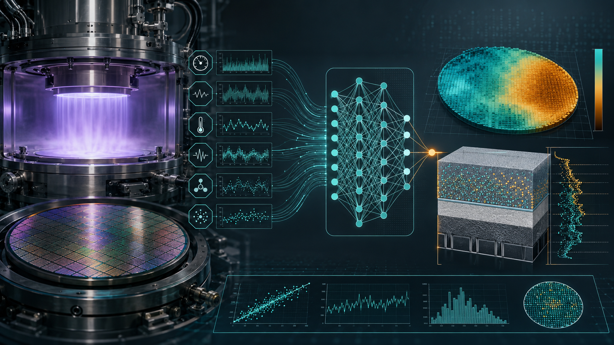

> 这篇论文发表于 IEEE Sensors Journal, 2026 年 5 月 1 日，题目是《Ensemble Virtual Metrology Models of Semiconductor Processes》，作者 Yawei Chen、Shaohua Chang、Eric Chien 来自华润微电子制造中心 8A fab 良率提升相关团队。

论文研究的对象不是一个泛泛的机器学习玩具问题，而是半导体制造里非常具体、也非常有工程味的问题：在 0.13 微米晶圆制造的 BEOL 阶段，用高密度等离子体 HDP 工艺沉积 FSG 介电薄膜时，如何用设备传感器数据实时预测薄膜中的氟浓度。论文给出的主模型 M4 是一个两级特征提取的集成虚拟量测模型，核心组合是相关性增强特征筛选、二阶多项式特征、LASSO 稀疏选择和随机森林非线性建模。实验结果显示，M4 在 4632 片 wafer 数据上取得了 R²=0.985、MAE=0.011、RMSE=0.009、MAPE=0.173 的表现，并且训练时间、预测时间和解释性都控制在可工程部署的范围内。

如果把这篇论文放在半导体新手视角下看，它真正想解决的问题可以先翻译成一句话：晶圆厂不可能把每一片 wafer 的每一个关键工艺结果都拿去物理量测，因为量测设备慢、贵、会排队、还会占 cycle time；但如果我们能从设备的 FDC 传感器数据里学出“工艺参数到质量指标”的映射，就能在 wafer 还没有进入物理量测机台之前，给出接近实时的质量预测。这就是 virtual metrology，中文常译作虚拟量测。它不一定完全替代物理量测，但可以让抽样式的离线检查，变成更高频、更接近 wafer-by-wafer 的在线质量监控。

衍生知识备注：半导体制造里的 metrology 指的是对关键尺寸、膜厚、浓度、overlay、etch depth 等质量指标的测量。传统物理量测通常依赖专门设备，例如椭偏仪、CD-SEM、膜厚仪、光学量测系统等；virtual metrology 则用工艺设备自身记录的 sensor trace、recipe 参数和历史量测结果训练模型，预测本该由量测设备给出的结果。它的价值不只是“省一次量测”，更重要的是缩短反馈链路：当工艺漂移、腔体状态变化或某个批次异常时，模型能更早给 APC、SPC、MES 等系统提供信号。

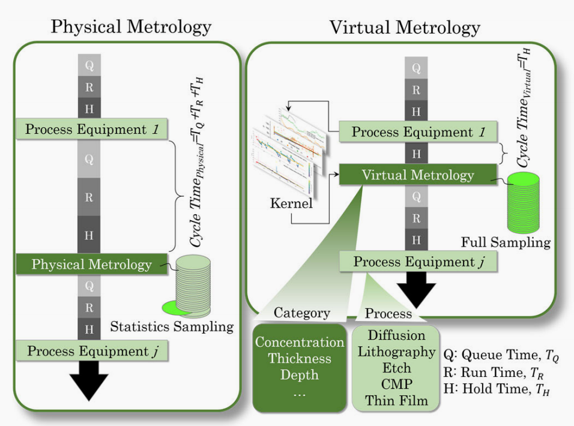
“物理量测与虚拟量测在 cycle time 中的位置对比。物理量测依赖抽样和排队，VM 借助模型将工艺设备数据转化为接近实时的全量预测，从而改善反馈速度和量测覆盖率。”

## 一、为什么半导体制造会需要 VM：不是“多一个模型”，而是“少一次等待”

论文引言从晶圆厂的现实压力讲起：AI 和先进制造让设备参数越来越多，传感器越来越密，工艺之间的耦合越来越强。传统物理量测的统计抽样方式不能覆盖每个 lot 的每个 slot，更不可能对每片 wafer 的每个关键层都做完整检测。对良率提升团队来说，这就形成了一个典型矛盾：一方面希望更早发现质量问题、扩大抽样覆盖、提升 chamber matching 能力；另一方面又不能无限增加物理量测设备、量测时间和工程 hold 时间。

VM 的意义就在这里。它利用 process equipment 的 FDC 数据、recipe 参数和历史物理量测数据，训练一个预测模型。工艺跑完后，模型立刻输出质量预测值和置信指标，APC 系统再根据这些结果做动态补偿或异常拦截。论文明确提到，VM 能减少机台停机、校准、试跑、返工，也能抑制异常造成的周期性波动。这些听起来像制造管理语言，但背后其实都是同一条线：越早知道 wafer 质量状态，就越少让问题继续向下游扩散。

衍生知识备注：FDC 是 Fault Detection and Classification，即故障检测与分类系统。它会采集设备运行过程中的压力、温度、气体流量、电源功率、电流、电压、阀门角度、处理时间等数据。APC 是 Advanced Process Control，先进过程控制，用来根据量测结果或模型预测结果调整工艺；SPC 是 Statistical Process Control，统计过程控制，用控制图、规格线等方式监控过程稳定性；MES 是 Manufacturing Execution System，制造执行系统，负责 lot、recipe、设备状态、hold/release 等生产执行动作。VM 真正落地时，通常不是一个孤立模型，而是要嵌进这些系统的闭环。

论文还用专利趋势说明 VM 的产业热度。作者以 IPC G01 量测相关类别和“virtual metrology”“semiconductor manufacturing”等关键词做检索，展示 1990-2024 年全球 VM 相关专利出版趋势，并指出半导体 VM 研究在 2004 年后明显上升。从工艺类别看，CVD、PVD 和 etch 相关研究占比最高，合计约 59%；CMP 和 lithography 分别约 14% 和 9%。这也符合直觉：薄膜沉积和刻蚀设备有丰富的过程传感器数据，工艺结果又高度依赖腔体状态、气体流量、功率和时间，因此很适合 VM 建模。

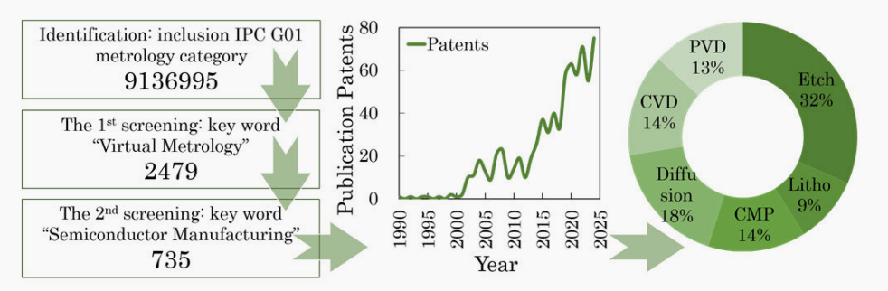
“1990-2024 年半导体制造 VM 专利趋势与工艺类别分布。VM 在 2004 年后明显升温，CVD/PVD/Etch 是最活跃的应用场景。”

## 二、这篇论文预测的到底是什么：HDP FSG 薄膜里的氟浓度

这篇文章的目标变量是 FSG 介电薄膜中的 fluorine concentration，即氟浓度。FSG 是 fluorosilicate glass，中文可理解为含氟硅酸盐玻璃，是 BEOL 互连阶段可能使用的一类低介电常数材料。BEOL 是 Back End of Line，指晶体管做好之后，进行金属互连、介质层沉积、通孔/沟槽等后段工艺的阶段。论文场景里，FSG 薄膜由 HDP 工艺沉积，HDP 是 high-density plasma，高密度等离子体。HDP CVD 的特点是反应气体在等离子体中被激发，沉积和一定程度的溅射/填充能力结合，常用于对沟槽填充质量要求较高的薄膜场景。

论文 Fig. 4 给出了 HDP 设备主框架、腔体关键部件和 FSG 工艺应用示意。设备中有 wafer load lock、transfer robot、process chamber、cooling chamber 等模块；工艺腔体内有 shower head、MFC 反应气体控制、FDC 系统、温控系统、bias power system、pump system 等。论文给出的反应示意是 `SiH4 + SiF4 + O2 -> FSG + by product`。因此，从材料形成机理看，FSG 中的氟浓度必然会受到含氟气体 SiF4、氧气 O2、硅烷 SiH4、等离子体功率、腔体温度、压力、处理时间等变量影响。只不过这种影响不是单纯线性的：气体供应、等离子体能量、表面吸附和腔体状态会相互耦合。

衍生知识备注：介电常数越低，互连线之间的电容越小，RC delay 越低，这对芯片速度和功耗都有帮助。FSG 通过在 SiO2 网络中引入氟来降低介电常数，但氟含量也会影响薄膜稳定性、应力、吸湿性和后续整合风险。因此氟浓度不是一个“越多越好”的指标，而是需要稳定落在工艺窗口内。对 fab 来说，这种指标如果只能靠离线抽样量测，就容易在批次间留下盲区。

【插图建议 3：建议直接截取论文 Fig. 4】图注可写为：“HDP 设备与 FSG 工艺示意。MFC 控制反应气体输入，RF power 维持等离子体环境，FDC 采集腔体状态和过程参数，最终薄膜氟浓度由多种参数共同决定。”

论文 Table I 选取了 18 个 top FDC sensors/process features，包括 Ar flow、O2 flow、SiF4 flow、SiH4 side flow、SiH4 top flow、chamber inter/outer He flow、chamber pressure、electrostatic chuck current/voltage、Bias RF forward、Side RF forward、Top RF forward、He leak rate、process time、throttle valve angle、dome heater temperature、chamber temperature。这些变量覆盖了气体供给、压力/抽气、温度、等离子体能量、ESC 状态和处理时长，基本对应了一个 CVD/HDP 过程里能决定反应速率、薄膜组成和片内均匀性的主要控制量。

衍生知识备注：MFC 是 mass flow controller，质量流量控制器，单位常见 SCCM；ESC 是 electrostatic chuck，静电吸盘，用来固定 wafer，也会影响热接触和片温；RF forward power 是射频前向功率，反映输入到等离子体系统的能量；throttle valve angle 影响抽气和腔体压力；dome heater/chamber temperature 影响反应动力学和表面过程。这些变量本身并不等价于薄膜氟浓度，但它们是“过程发生的证据链”。

## 三、核心算法：两级特征提取不是堆模型，而是在给复杂工艺“降噪后再拟合”

论文提出的模型框架可以概括为“增强特征筛选 + 多项式 LASSO + RF”。作者称其为 two-level feature extraction ensemble machine learning model。它的动机很清楚：LASSO 这类线性模型轻量、可解释、能做特征选择，但面对强耦合、非线性的先进工艺参数时容易欠拟合；随机森林这类非线性集成模型能捕捉复杂模式，也比较鲁棒，但在特征冗余、小样本、高维交互和超参数调试方面又容易遇到复杂度、过拟合和解释性问题。论文要做的不是简单把两个模型串起来，而是利用 LASSO 做稀疏化和线性/多项式交互提取，再让 RF 接手非线性拟合。

用更朴素的话说，第一层先问：“这些传感器变量及其二阶交互项里，哪些真的和目标有关？”第二层再问：“保留下来的关键信号和原始变量之间，有没有更复杂的非线性组合能解释氟浓度？”这样做的好处是，RF 不需要在一大堆冗余特征里盲目分裂，LASSO 也不用独自承担所有非线性关系。论文把这个过程放进 Algorithm 1：输入特征组 ALT、目标变量 VAR、相关阈值 λ=0.1、多项式阶数 d=2、树数量 N=100；先计算特征与目标的相关性，保留绝对相关超过阈值的特征，再对多项式特征做 LASSO，之后把一级输出和非线性特征交给 RF regressor，最后计算 R² 并用 SHAP 做解释。
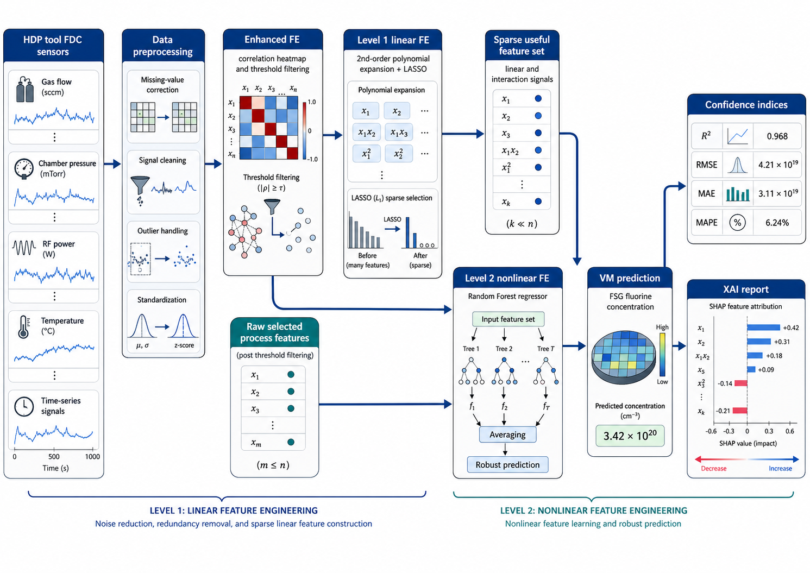

衍生知识备注：LASSO 的全称是 least absolute shrinkage and selection operator，它在线性回归损失函数后面加上 L1 正则项。L1 正则会把一部分系数压到 0，因此天然具备特征选择能力。随机森林 RF 则是 bagging 思想下的树模型集合，每棵树在样本和特征子集上训练，最后对回归结果取平均。RF 的强项是非线性、交互、鲁棒性；弱项是如果输入特征过多且噪声大，模型复杂度和解释成本会上升。

论文中的多项式特征变换可以理解为给原始变量增加交互项。原始特征是 \(X=\{x_1,x_2,\ldots,x_n\}\)，当多项式阶数 \(d=2\) 时，模型不仅看单个变量，还看类似 `temperature * pressure`、`SiF4 flow * RF power` 这样的组合影响。半导体工艺里这很合理，因为很多结果并不是单一旋钮决定的。例如 SiF4 流量提供氟来源，但最终氟进入薄膜多少，还要看等离子体能量、腔体温度、表面反应环境和处理时间。多项式扩展的问题是维度膨胀，所以论文紧接着使用 LASSO 把无用项压掉。

<svg width="100%" height="260" viewBox="0 0 900 260" xmlns="http://www.w3.org/2000/svg" role="img" aria-label="Two-level feature extraction animation">
  <defs>
    <linearGradient id="g1" x1="0" x2="1" y1="0" y2="0">
      <stop offset="0%" stop-color="#2f6f73"/>
      <stop offset="100%" stop-color="#7a8f3a"/>
    </linearGradient>
    <marker id="arrow" markerWidth="10" markerHeight="10" refX="9" refY="3" orient="auto" markerUnits="strokeWidth">
      <path d="M0,0 L0,6 L9,3 z" fill="#334155"/>
    </marker>
  </defs>
  <rect x="20" y="30" width="170" height="70" rx="8" fill="#f8fafc" stroke="#64748b"/>
  <text x="105" y="58" text-anchor="middle" font-size="16" fill="#0f172a">FDC Sensors</text>
  <text x="105" y="82" text-anchor="middle" font-size="12" fill="#475569">18 process parameters</text>
  <rect x="255" y="30" width="170" height="70" rx="8" fill="#ecfeff" stroke="#0e7490"/>
  <text x="340" y="56" text-anchor="middle" font-size="16" fill="#164e63">Enhanced FE</text>
  <text x="340" y="82" text-anchor="middle" font-size="12" fill="#475569">correlation filtering</text>
  <rect x="490" y="30" width="170" height="70" rx="8" fill="#fefce8" stroke="#a16207"/>
  <text x="575" y="56" text-anchor="middle" font-size="16" fill="#713f12">LASSO</text>
  <text x="575" y="82" text-anchor="middle" font-size="12" fill="#475569">sparse polynomial terms</text>
  <rect x="715" y="30" width="160" height="70" rx="8" fill="#f0fdf4" stroke="#15803d"/>
  <text x="795" y="56" text-anchor="middle" font-size="16" fill="#14532d">Random Forest</text>
  <text x="795" y="82" text-anchor="middle" font-size="12" fill="#475569">nonlinear ensemble</text>
  <path d="M190 65 H255" stroke="#334155" stroke-width="2" marker-end="url(#arrow)"/>
  <path d="M425 65 H490" stroke="#334155" stroke-width="2" marker-end="url(#arrow)"/>
  <path d="M660 65 H715" stroke="#334155" stroke-width="2" marker-end="url(#arrow)"/>
  <rect x="350" y="155" width="210" height="54" rx="8" fill="url(#g1)" opacity="0.92"/>
  <text x="455" y="178" text-anchor="middle" font-size="15" fill="white">VM Prediction</text>
  <text x="455" y="198" text-anchor="middle" font-size="12" fill="white">FSG fluorine concentration</text>
  <path d="M795 100 C795 150, 560 130, 515 155" stroke="#334155" fill="none" stroke-width="2" marker-end="url(#arrow)"/>
  <circle cx="105" cy="120" r="6" fill="#0ea5e9">
    <animate attributeName="cx" values="105;340;575;795;455" dur="4s" repeatCount="indefinite"/>
    <animate attributeName="cy" values="120;120;120;120;155" dur="4s" repeatCount="indefinite"/>
    <animate attributeName="opacity" values="0.2;1;1;1;0.2" dur="4s" repeatCount="indefinite"/>
  </circle>
  <text x="455" y="235" text-anchor="middle" font-size="12" fill="#475569">动画含义：工艺传感器数据经过筛选、稀疏化和非线性集成，最终转化为虚拟量测预测值。</text>
</svg>

## 四、增强特征提取：热力图不是答案，而是第一道筛子

论文 Fig. 5 用相关性热力图展示 18 个工艺参数与物理量测值之间的 Pearson 相关系数。作者据此识别出六个关键参数：dome heater temperature、electrostatic chuck voltage、O2 flow、SiF4 flow、side forward power、process time。值得注意的是，热力图里的相关系数并不夸张，和 physical metrology values 的相关值大致在 0.17-0.25 的量级，例如 dome heater temperature 约 0.25，SiF4 flow 约 0.24，process time 约 0.23，O2 flow 约 0.22，side RF forward 约 0.19，ESC voltage 约 0.17。这说明单个变量对目标的线性解释能力有限。

这点恰恰是论文方法成立的关键。如果某个特征和氟浓度有极强线性关系，简单线性模型可能就够了；但真实工艺里每个单变量的相关性都不算高，说明目标受多变量组合、非线性关系和工艺状态共同影响。增强特征提取先用相关性做初筛，把完全无关或噪声较大的变量降权，再通过二阶多项式和 LASSO 捕捉更有价值的交互，最后交给 RF 学习非线性边界。这是一种很工程化的折中：既不过早相信黑盒模型，也不幻想线性相关能解释全部工艺。

衍生知识备注：Pearson 相关系数只衡量线性相关，不代表因果关系，也不擅长发现阈值效应、饱和效应和多变量交互。例如某个气体流量在正常范围内与氟浓度正相关，但超过某个窗口后可能造成反应不均匀，导致预测误差变大。半导体工艺里常见这种“局部线性 + 全局非线性”的形态，因此相关性热力图适合做探索和筛选，不适合当最终解释。
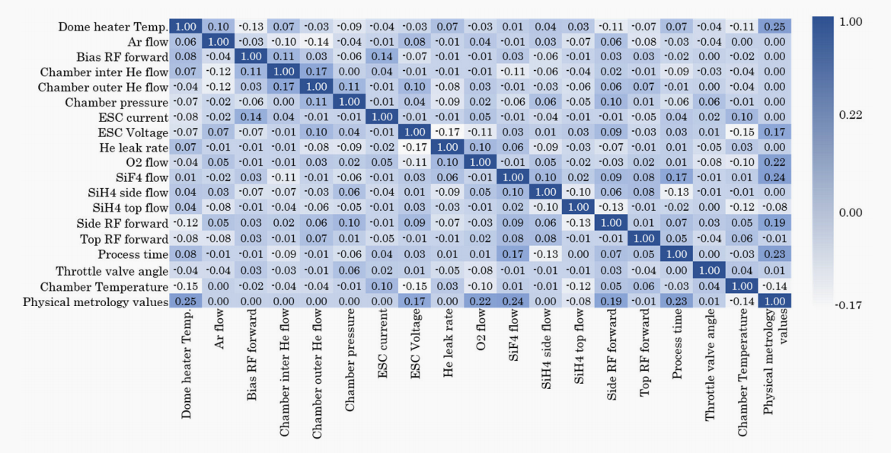
“工艺参数与物理量测值的相关性热力图。单变量相关性整体不高，提示氟浓度预测需要考虑多变量交互和非线性关系。”

## 五、消融实验告诉我们：M4 赢在模块顺序

论文最有说服力的部分是 Table IV 的消融对比。作者设置了五个模型：M1 是传统 LASSO+RF baseline；M2 去掉第一级 polynomial-LASSO 线性特征提取；M3 去掉 enhanced FE；M4 是完整的 two-level polynomial-LASSO-RF ensemble；M5 去掉第二级 RF 非线性特征提取。结果显示，M4 的 R²=0.985、MAE=0.011、RMSE=0.009、MAPE=0.173，是五者中最佳。M1 的 R²=0.964、RMSE=0.026，已经不差，但 M4 仍明显提升；M2 的 R² 降到 0.942，说明没有一级多项式 LASSO 会损失很多交互信息；M3 的 R²=0.965、RMSE=0.021，说明增强 FE 对减少噪声和保留强相关特征有贡献；M5 的 R²=0.939、RMSE=0.038，说明缺少第二级 RF 后，非线性拟合能力不足。

这组实验的价值在于，它没有只说“我的模型比 baseline 好”，而是拆解了为什么好。完整模型不是因为算法名字更复杂而赢，而是因为顺序合理：先用相关性筛掉明显弱信号，再用 LASSO 在多项式空间里做稀疏选择，最后用 RF 吸收非线性关系。换句话说，M4 既给 RF 减少了无效搜索空间，也给 LASSO 找到了它擅长处理的稀疏线性/交互特征。对于工业数据来说，这种顺序往往比盲目堆更大的模型更重要。

| 模型 | 结构含义 | R² | MAE | RMSE | MAPE |
|---|---|---:|---:|---:|---:|
| M1 | 传统 LASSO+RF baseline | 0.964 | 0.021 | 0.026 | 0.294 |
| M2 | 去掉第一级 FE | 0.942 | 0.032 | 0.041 | 0.404 |
| M3 | 去掉增强 FE | 0.965 | 0.025 | 0.021 | 0.305 |
| M4 | 完整模型 | 0.985 | 0.011 | 0.009 | 0.173 |
| M5 | 去掉第二级 FE | 0.939 | 0.030 | 0.038 | 0.395 |

衍生知识备注：R² 衡量模型解释目标变量方差的比例，越接近 1 越好；MAE 是平均绝对误差；RMSE 是均方根误差，对大误差更敏感；MAPE 是平均绝对百分比误差。工业场景不会只看一个指标，因为高 R² 可能掩盖局部异常，大误差又可能对良率造成不成比例的影响。VM 里 RMSE 和异常点表现尤其重要，因为模型输出可能触发 lot hold、recipe 调整或工程处置。

【插图建议 5：建议直接截取论文 Fig. 6 和 Table IV】图注可写为：“五种模型结构的消融实验。M4 同时保留增强 FE、一级 polynomial-LASSO 和二级 RF，因此在 R²、MAE、RMSE、MAPE 上均取得最佳表现。”

## 六、交叉验证与压力测试：模型不只要准，还要抗脏数据

论文使用 4632 片 wafer 数据，按 70%/20%/10% 划分训练、验证和测试，即训练 3243 片、验证 926 片、测试 463 片。作者还对 M4 做了 fivefold cross-validation。Table II 显示三组数据的五折 RMSE 分布，论文正文写到 95% CI RMSE 从 0.0878 到 0.0943，Fig. 7 也展示了各 fold 的 RMSE 条形图。这里需要谨慎理解：论文 Table IV 报告 M4 总体 RMSE 为 0.009，而 Table II/Fig. 7 的 cross-validation RMSE 约 0.09，数值尺度存在不完全一致的地方，可能涉及单位缩放、表头 `×10^-3` 的表达、目标变量量纲或论文排版/文本描述差异。写技术复盘时应忠实记录这个现象，不宜强行把两处数字混为一个。

比交叉验证更贴近生产现场的是 stress testing。论文设置了四类扰动：concept drift，加 3% 突发数据注入；missing values，模拟 20% 缺失数据；noise injection，加入标准差 10% 的高斯噪声；outliers，加入 10% 极端异常值。结果显示 M4 在四类扰动下的 R² 分别为 0.977、0.962、0.933、0.941，对应退化约 0.008、0.023、0.052、0.044；传统 M1 的原始 R²=0.964，扰动后分别降到 0.902、0.927、0.895、0.889，尤其对噪声注入和 outlier 更敏感。作者据此认为 M4 的退化可控制在 0.055 以下，鲁棒性优于传统 M1。

衍生知识备注：concept drift 指数据分布随时间变化，半导体里可能来自 chamber aging、PM 后状态变化、气体纯度波动、零件更换、recipe 微调或环境变化。missing values 常来自传感器采集异常、通信丢包或数据系统同步问题。noise 和 outlier 则可能来自传感器漂移、瞬时干扰、阀门/压力波动等。工业模型最怕“测试集上很美，线上一脏就倒”，所以压力测试是 VM 论文里很值得看的部分。
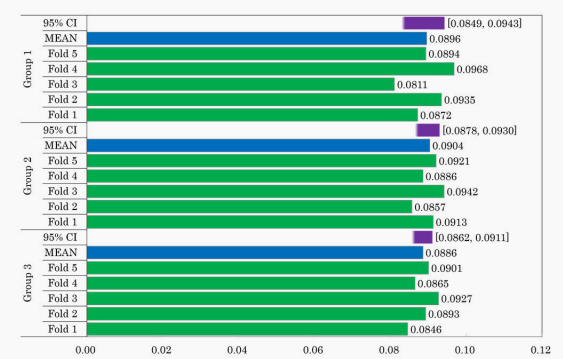
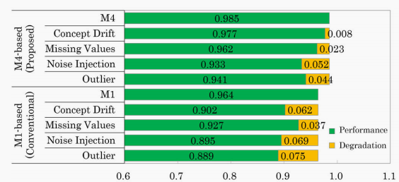
“M4 的五折交叉验证与压力测试表现。相比传统 M1，M4 在概念漂移、缺失值、噪声注入和异常值条件下的 R² 退化更小。”

## 七、横向 benchmark 与计算效率：M4 的工程味在于 CPU 可用、预测足够快

论文还将 M4 与 LASSO、RF、XGBoost、RF+XGBoost、传统 M1 对比。Table VI 中，LASSO 的 R² 只有 0.256，RMSE=0.113，说明纯线性稀疏模型无法处理该场景的复杂性；RF 的 R²=0.942，RMSE=0.032，已经体现出树模型对非线性的优势；XGBoost 的 R²=0.824，RMSE=0.047；RF+XGBoost 的 R²=0.901，RMSE=0.054；传统 M1 的 R²=0.964，RMSE=0.026；M4 最终达到 R²=0.985，RMSE=0.009。Fig. 9 的预测-物理量测散点图也很直观，M4 的点云最贴近对角线。

效率方面，论文在 Intel Core i7-13700 CPU、16 cores、24 threads、Python 3.11/PyCharm 环境下实现模型，并用 GOPS、参数量、训练时间和单点预测时间评估复杂度。M4 的 GOPS=0.31、参数量约 0.7M、训练时间 247s、预测时间 0.089ms。相比之下，M1 的 GOPS=0.37、训练时间 468s、预测时间 0.065ms；RF+XGBoost 的 GOPS=0.41、训练时间 1655s、预测时间 0.191ms。M4 的单点预测时间略慢于 M1 和 RF，但仍远低于 200ms 量级的在线要求，且训练时间明显优于 M1 和 RF+XGBoost。

这部分很重要，因为 fab 里的模型不是 Kaggle 排行榜。VM 模型要能在已有 IT/OT 环境中运行，最好不强依赖 GPU，训练迭代要快，单点预测延迟要低，输出还要能被 APC/MES/SPC 消费。论文强调 M4 可在 CPU 上训练，未来甚至可部署到 FPGA 或 MCU 平台，这说明作者的目标不是证明一个深度模型有多强，而是把算法复杂度压在工业系统可承受范围内。

衍生知识备注：GOPS 是 giga operations per second，用来粗略衡量计算复杂度。单点预测时间对 VM 尤其关键，因为 FDC 数据可能按 wafer、lot、step 或时间窗口持续进入系统；如果预测延迟太高，APC 就无法及时做拦截或补偿。训练时间则影响模型迭代：工艺开发、PM 后恢复、chamber matching、recipe setup 都可能需要快速重训或校准模型。

| 模型 | R² | RMSE | 训练时间 | 预测时间 |
|---|---:|---:|---:|---:|
| LASSO | 0.256 | 0.113 | 39s | 0.003ms |
| RF | 0.942 | 0.032 | 1271s | 0.061ms |
| XGBoost | 0.824 | 0.047 | 382s | 0.124ms |
| RF+XGBoost | 0.901 | 0.054 | 1655s | 0.191ms |
| M1 | 0.964 | 0.026 | 468s | 0.065ms |
| M4 | 0.985 | 0.009 | 247s | 0.089ms |

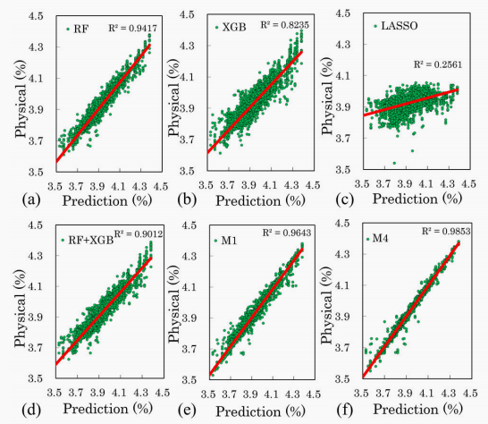
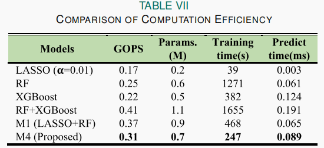
“不同模型的预测散点图与计算效率对比。M4 在精度、训练时间和可部署复杂度之间取得较好平衡。”

## 八、SHAP 解释：把“模型说了算”变成“哪些工艺变量在说话”

集成模型的问题往往是解释性不足。论文引入 SHAP 来解释 M4 的特征贡献。SHAP 的思想来自 Shapley value：把一次预测看作多个特征共同合作得到的结果，然后估计每个特征对预测值的边际贡献。论文 Fig. 10 给出 SHAP summary 和平均绝对 SHAP 值排名。最重要的特征是 Bias RF forward，平均 SHAP 约 0.0396；之后依次是 chamber outer He flow，约 0.0196；SiH4 top flow，约 0.0172；SiF4 flow，约 0.0165；dome heater temperature，约 0.0122；O2 flow，约 0.0038；SiH4 side flow，约 0.0030；chamber inter He flow，约 0.0024；ESC current 接近 0。

这个排序和工艺知识基本一致。Bias RF forward 代表等离子体与 wafer 偏压相关能量，对离子轰击、表面反应和薄膜形成有重要影响；SiF4 和 SiH4 是 FSG 形成的关键反应气体，决定反应物供应；O2 参与氧化环境和薄膜网络形成；dome heater temperature 影响反应动力学；He flow 可能与背面冷却、热传导、腔体环境或设备状态有关。论文指出，核心气相反应参数如 power 和 reaction gas flow rate 的 SHAP 最高，符合 CVD 机理中“反应气体浓度决定反应物供应”的认知。

不过也要注意，SHAP 是 post-hoc attribution，也就是事后解释。它能告诉我们模型在数据分布下“依赖了哪些特征”，但不等价于严格因果证明。比如某个 He flow 特征重要，可能直接影响温度，也可能只是某种 chamber 状态的代理变量；某个功率变量贡献高，也可能与 recipe step、腔体负载或其他参数联动。论文在 limitations 中也承认，SHAP 没有直接纳入 CVD 物理，例如气相反应和表面吸附，因此对强耦合参数的因果分析能力有限。

衍生知识备注：在半导体制造中，解释性有两层价值。第一层是工程信任：工艺工程师看到 top features 与机理一致，会更愿意使用模型。第二层是问题定位：当某批 wafer 的 VM 预测偏高或偏低时，SHAP 可以提示是功率、气体、温度还是压力相关变量在拉动预测，从而缩短排查路径。但 SHAP 不能替代 DOE、机理模型和工程验证。
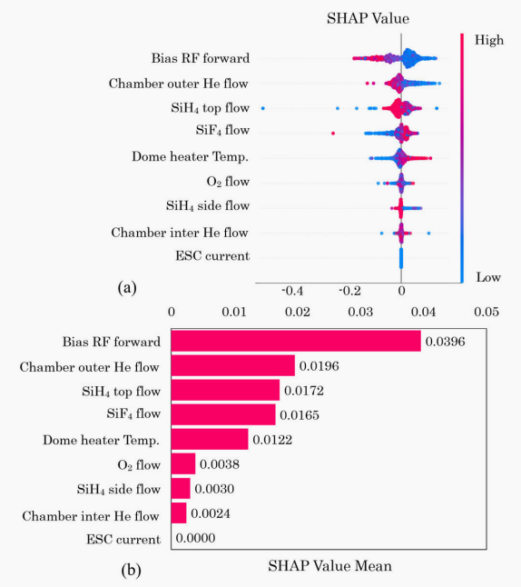
“M4 的 SHAP 解释结果。Bias RF forward、He flow、SiH4/SiF4 flow 和 dome heater temperature 是影响 FSG 氟浓度预测的主要变量。”

## 九、从模型到 fab 系统：VM 真正的终点是闭环控制

论文 Fig. 11 展示了传统系统与增强 APC 系统的对比。传统方式依赖 FDC、MES、SPC 各自运行，然后通过物理量测抽样给出质量反馈；增强方案则把 AI-driven APC system 接入 FDC/MES/SPC，采集 process cluster sensors data，结合 SPC 中的物理量测数据训练和校验模型，并通过 MES 对异常设备或异常批次进行 blocking。系统输出包括自动预测结果、动态阈值、VM 数据和可解释报告。作者还提到 AI-driven kernel system commands 遵循 TCP/IP 协议，可支持 inline 和 cloud 部署。

这说明论文中的 VM 不是孤立 notebook，而是一个生产系统组件。FDC 负责“看见设备发生了什么”，SPC 负责“确认真实质量结果如何”，MES 负责“决定生产动作”，APC 负责“根据结果做过程调节”。VM 模型在中间扮演翻译器：把海量设备过程数据翻译成质量预测，再把预测结果交给制造系统做处置。这样的闭环如果运行稳定，就可以在不增加物理量测硬件的情况下，提升量测覆盖率和异常响应速度。

衍生知识备注：fab 里的 bottleneck 不一定总是生产机台，有时量测设备也是瓶颈。量测设备属于 nonproductive equipment，它不直接加工 wafer，却会决定 lot 是否能 release 到下一步。如果某个关键层必须等待量测结果，WIP 就会排队。VM 通过减少不必要的物理量测、提前预警异常和辅助动态抽样，可以同时改善 cycle time、WIP flow 和量测设备 capacity。
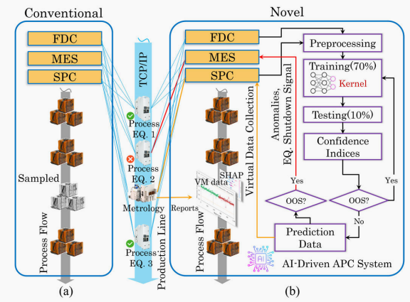
“AI-driven VM/APC 系统集成示意。FDC、MES、SPC 与模型 kernel 形成预测、解释、阈值和异常拦截闭环。”

论文 Fig. 12 进一步展示了 fab KPI 改善。作者写到，VM 方法可以让 wafer cycle time 改善 30%-50%，具体取决于 inline wafer metrology steps 的数量；同时减少物理量测 run time 和工程 hold time，直接扩展约 20% 的物理量测工具 capacity。图中还展示了 wafer-by-wafer 预测如何帮助识别异常浓度点，以及 VM implementation 后低良率偏移减少。这些指标比模型分数更贴近 fab 管理层关心的问题：少排队、少 hold、少低良率事件、更多产能。
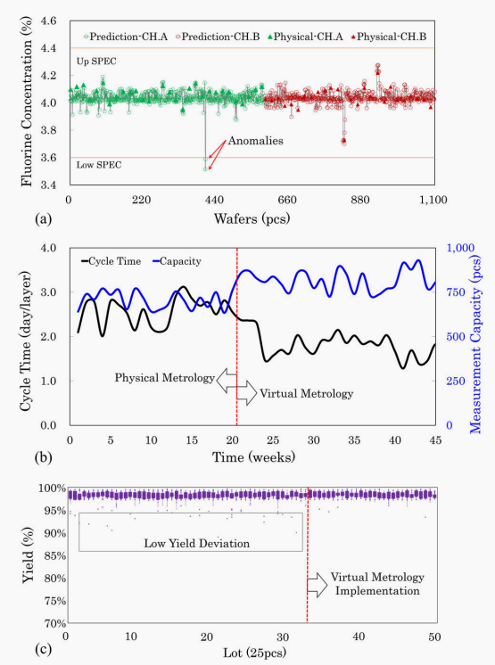
“VM 在真实 CVD 制造环境中的 KPI 影响。通过减少量测等待和提升全量筛查能力，VM 有望改善 cycle time、量测 capacity 和 yield stability。”

## 十、论文的局限与下一步：跨腔体、长期漂移和机理融合

论文在局限部分写得比较坦诚。第一，模型训练数据来自单一类型 CVD tool，即 Applied Materials 设备，并且 batch 有限，因此跨 chamber 的泛化能力仍受限制。第二，模型没有充分处理 chamber gas purity variation 引起的分布漂移。第三，离线训练缺少 adaptive updating，面对 chamber degradation、时间漂移和 PM 后状态变化时，长期稳定性不足。第四，SHAP 解释仍是后验归因，没有显式融合 CVD 物理，例如气相反应、表面吸附等。第五，虽然模型被放入 APC 闭环讨论，但 dry run 环境里并没有完整覆盖实际扰动，例如流量波动、压力 ripple、气体中断等。

这些局限其实非常真实，也指出了工业 VM 的难点。半导体设备不是静态实验台，同一 recipe 在不同 chamber、不同 PM 周期、不同耗材寿命、不同气体状态下都可能产生分布差异。一个模型如果只在历史数据上训练好，却不能在线更新或做 domain adaptation，很容易在几个月后逐渐失准。因此作者在 conclusion 后提出未来方向：开发 incremental learning 和 domain adaptation，使模型能动态适应 chamber degradation、post-maintenance drift 和 cross-tool distribution shift，提升长时序稳定性。

衍生知识备注：incremental learning 是增量学习，模型不断吸收新数据更新，而不是每次从零训练。domain adaptation 是领域自适应，用来处理训练数据和目标部署环境分布不同的问题。对 fab 来说，这两者非常关键，因为 chamber matching 和 tool-to-tool variation 永远存在。VM 如果想从单点 demo 走向规模化部署，必须解决“换腔体还能不能准”“PM 后还能不能准”“半年后还能不能准”的问题。

## 十一、我对这篇论文的理解：它的贡献不在“发明了 LASSO 或 RF”，而在把二者放进了 fab 语言

从机器学习角度看，LASSO、随机森林、多项式特征、SHAP 都不是新算法。但这篇论文的价值在于把它们组织成了一个适合半导体 VM 的工程结构，并且围绕真实 fab 指标讨论了 cycle time、measurement capacity、wafer yield、APC、FDC/MES/SPC 集成和可部署复杂度。对工业论文来说，这种“算法 + 工艺对象 + 系统闭环 + KPI”的组合，比单纯追求模型新颖性更有意义。

我认为这篇文章最值得学习的点有三条。第一，它没有迷信复杂模型，而是承认线性模型和非线性模型各有边界，通过两级 FE 让二者互补。第二，它把消融实验做到了模块级，能证明 enhanced FE、polynomial-LASSO 和 RF 各自的贡献。第三，它没有把 SHAP 当作装饰图，而是尝试把特征重要性和 CVD 工艺机理对齐，让模型解释能被工程师理解。当然，论文也留下了值得继续追问的地方：cross-validation RMSE 与总体 RMSE 的尺度差异需要进一步核对；单一 tool 数据上的高精度能否迁移到更多 chamber；真实线上闭环干预后的效果是否会引入新的反馈偏差。

如果把这篇文章作为半导体 AI 入门材料，它给我的最大启发是：虚拟量测不是“拿传感器数据训练一个回归模型”这么简单，而是要回答四个连续问题。第一，物理量测慢在哪里，VM 要替代或补充哪一段等待？第二，工艺机理告诉我们哪些传感器变量可能有意义？第三，模型如何在高维、强耦合、小样本和漂移环境里保持准确、鲁棒、可解释？第四，预测结果如何进入 FDC/MES/SPC/APC 的工程闭环，真正改变 cycle time、capacity 和 yield？这四个问题都回答到位，VM 才能从论文指标走向 fab 价值。

