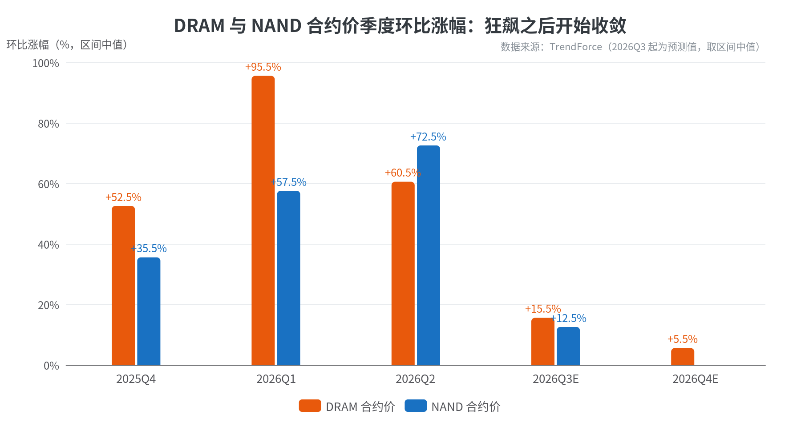
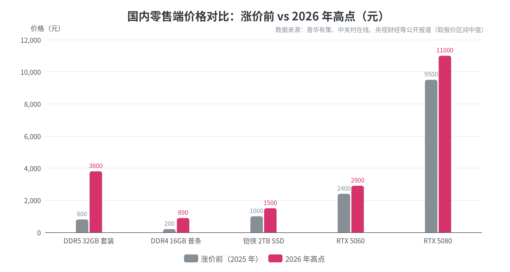
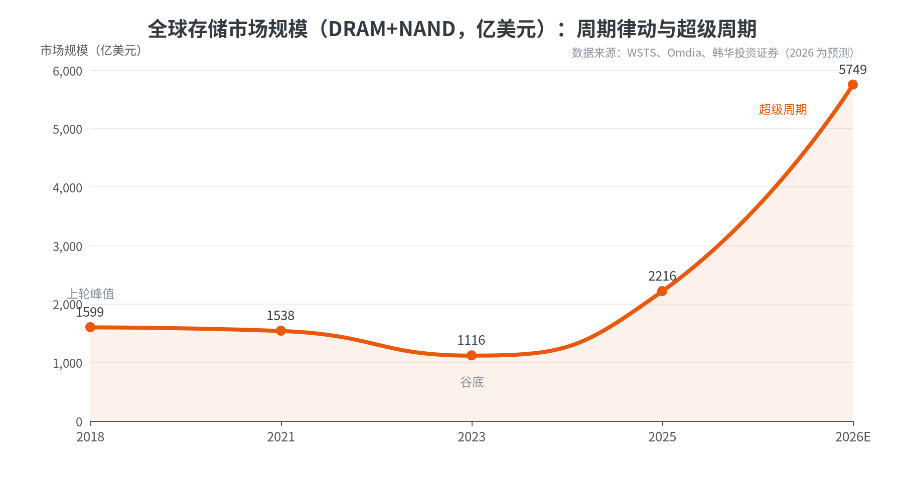
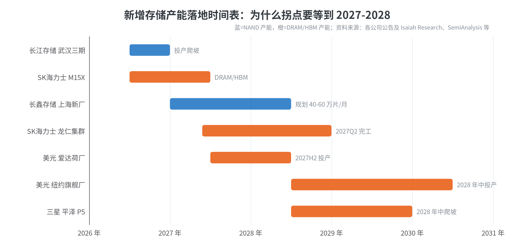

# 等等党的至暗时刻：电脑配件全线涨价的周期、原因、趋势与未来

## 核心结论（TL;DR）

如果你正打算装一台高性能台式机，那么坏消息和好消息各有一个。**坏消息**：这不是一次普通的涨价，而是存储行业四十年历史上最猛烈的一轮超级周期——DRAM 合约价 2026 年一季度环比暴涨 **93%–98%**，NAND 闪存二季度环比再涨 **70%–75%**，涨价已从内存、SSD 蔓延到显卡、机械硬盘、电源、散热器乃至机箱线材，国内中端游戏主机两个月贵了 **1500–3000 元**[^103^][^2^][^36^]。**好消息**：价格环比涨幅自 2026 年三季度起明显收敛（DRAM 回落至 +13%–18%），消费级现货市场已经开始松动回调；行业共识是**绝对价格高位将维持到 2027 年下半年，真正的降价拐点大概率出现在 2028 年**，届时三星、SK 海力士、美光以及国产长鑫、长江存储的新产能将集中落地[^103^][^73^][^69^]。对"等等党"而言：刚需不必死等——涨幅最陡的阶段已经过去；非刚需可以等，但等的终点是 2027H2–2028，而且几乎不可能等回 2024 年的"白菜价"。

## 一、涨价全景：到底涨了多少

### 1.1 一组创纪录的数字

本轮涨价的核心引擎是存储芯片。根据 TrendForce（集邦咨询）的数据，常规 DRAM 合约价在 2026 年一季度环比上涨 **93%–98%**，创有统计以来最大单季涨幅；二季度再涨 **58%–63%**[^72^]。NAND 闪存同步狂飙：2025 年四季度涨 33%–38%，2026 年一季度涨 55%–60%，二季度进一步加速到 **70%–75%**，史上首次在单季涨幅上超过 DRAM[^2^]。现货市场更加疯狂：Tom's Hardware 的内存价格指数显示，16Gb DDR5 颗粒现货价从 2025 年 9 月的约 6.84 美元飙升至 12 月的约 27.20 美元，**一个季度涨了 298%**[^1^]。金士顿报告称 NAND 晶圆成本到 2025 年 12 月已上涨 246%，其中 70% 的涨幅集中在年末最后 60 天[^2^]。

零售端的传导同样触目惊心。国内市场方面，DDR5 32GB 台式机内存条从 2025 年 9 月的约 800 元涨至 2026 年 3 月电商均价约 **3800 元**，半年涨幅 375%；DDR4 16GB 普条从约 200 元涨至约 890 元[^41^]。显卡在 2026 年 7 月底出现年内第二波跳涨：RTX 5060 从 2300–2500 元涨至 2700–3100 元，RTX 5080 突破 1.1 万元，华强北渠道"一日一价"，上午的报价单下午就作废[^14^]。2TB 规格 SSD 在 2024 年促销季只要 110–130 美元，2026 年中已涨到 350–480 美元[^2^]；连被认为"夕阳产业"的机械硬盘，批发价也已连续五个季度上涨，2026 年二季度环比涨幅扩大到 10%[^46^]。

### 1.2 没有配件能幸免：涨价品类总览

与 2017–2018 年（主要涨内存）或 2020–2021 年（主要涨显卡）不同，本轮涨价覆盖了装机清单上的几乎每一行。下表汇总了各品类的涨幅、直接原因与货源状态：

| 配件品类 | 涨幅量级（2025 年中→2026 年中） | 直接原因 | 货源状态 |
|---|---|---|---|
| 内存（DDR5） | 颗粒现货 +298%/季；国内 32GB 套装约 4 倍[^1^][^41^] | HBM 挤占晶圆产能、原厂转产 | 分配供货，服务器优先 |
| 内存（DDR4/DDR3） | 国内 16GB 普条约 +345%；DDR4 合约价 Q3 预估再 +50%[^41^][^93^] | 三巨头停产淡出、企业级 SSD 反拉需求 | 老款比新款更贵成常态 |
| SSD（NAND） | 合约价三季累计约 4.2–4.5 倍；2TB 零售约 3 倍[^2^] | 产能优先供企业级 SSD | 消费级被"冷落" |
| 显卡（GPU） | 16GB GDDR7 批量价 +200%+；国内渠道价较 MSRP 溢价 20%–59%[^13^][^27^] | 显存成本传导 + NVIDIA/AMD 调价 | 部分板卡厂暂缓批量供货 |
| 机械硬盘（HDD） | 半年整体约 +50%；批发价连涨 5 个季度[^38^][^46^] | AI 数据中心买光全年产能、巨头不扩产 | 西数/希捷 2026 产能售罄 |
| 电源 / CPU 散热器 | 预警上调 6%–10% / 6%–8%[^34^] | 铜、银等原材料涨价 | 促销取消、按新价销售 |
| 主板 / 机箱 / 线材 | 普涨（装机商口径"挨个涨"）[^36^] | 铜、铝、ABS 塑料原料涨价 | 报价一日一更 |

整机层面，郑州科技市场的装机商向记者算账：两个月前落地约 7800 元的中端游戏机型，现在同配置直奔 **9300 元**；高端机型两个月普遍涨 2800–3000 元；联想、华硕、惠普等品牌整机和游戏本也上调了 800–1200 元[^36^]。海外市场同样如此——IDC 预计 2026 年 PC 平均售价上涨最多 8%，索尼、任天堂、微软三大主机厂在 2026 年史无前例地集体上调了在售主机价格，微软直言"存储和内存成本涨了 2.5 倍以上"[^1^]。

### 1.3 一个容易被忽略的插曲：2026 年 3 月的"假崩盘"

值得注意的是，本轮上涨并非一条直线。2026 年 3 月，国内内存条价格曾出现一轮**断崖式跳水**：16GB DDR5 单条从峰值 980 元跌到 680 元，32GB 套装从 3800 元缩水到 2200 元，跌幅超 40%[^42^]。触发因素有三：长鑫存储二期量产、DDR5 良率提升填补了消费级缺口；全行业库存从 3–4 周回升到 6–7 周；前期把内存当"电子理财"囤货的投机商资金链承压、踩踏抛售[^42^]。

但这次回调被证明只是现货市场的"情绪出清"而非趋势反转——上游合约价当季仍在以 93%–98% 的幅度上涨，二者随后重新收敛，价格再度走高[^72^]。这个插曲对等等党有重要启示：**现货零售价比上游合约价波动大得多**，短期跳水随时会发生（尤其在大促节点），但只要合约价还在涨，回调就只是"阶段性买点"而非"等等党的胜利"。2026 年 7 月的最新行情再次印证了这一点——DDR5 16GB 现货从峰值 1800 元回落到 1000–1200 元，而同期合约价仍在上涨[^88^]。

## 二、分配件拆解：每一类为什么涨

### 2.1 内存：本轮风暴的风暴眼

内存是本轮涨价的绝对主角，其逻辑链条可以概括为一句话：**AI 数据中心用高带宽内存（HBM）抽干了普通 DRAM 的产能**。三星、SK 海力士、美光三家控制着全球 95% 以上的 DRAM 产出，而生产 1GB HBM 消耗的晶圆面积约为普通 DDR5 的 3–4 倍，HBM 的利润率又是消费级 DDR5 的 2–3 倍——在"晶圆零和博弈"下，每一片分给英伟达 AI 加速卡的 HBM 晶圆，都意味着消费级内存条少一份供给[^1^][^3^]。TrendForce 估算，2026 年 AI 相关需求将吞噬全球 DRAM 晶圆产能的约 20%；HBM 占 DRAM 晶圆产出的比重已从 2025 年的 19% 升至 2026 年的 23%[^9^][^10^]。

更具标志性的事件是供给端的主动撤退：2025 年 12 月，美光宣布**退出消费级内存市场**，停掉运营近三十年的 Crucial 英睿达消费品牌，将全部精力转向数据中心和 HBM 产品[^10^]。三星与 SK 海力士则加速淡出 DDR4——结果出现罕见的价格倒挂：DDR4 16Gb 现货价比同规格 DDR5 更贵已成常态，2026 年三季度 DDR4 8Gb 合约价预估环比再涨 50%，原因竟是企业级 SSD（每 1TB NAND 需配 1GB 独立 DRAM 缓存）向 16–30TB 大容量演进后反拉 DDR4 需求[^93^]。甚至过时的 DDR3 都出现需求回升，七彩虹传出复刻 DDR3 主板的消息，侧面反映短缺之严峻[^45^]。

### 2.2 固态硬盘（SSD）：NAND 的"企业级优先"困境

SSD 涨价的机理与内存同构：AI 服务器对存储的胃口是传统系统的数倍，原厂把 NAND 产能优先分配给高毛利的企业级 SSD（eSSD），消费级 SSD 只能分到剩余产能[^2^][^102^]。TrendForce 在 2026 年一季度报告中明确表示，当季订单量"大幅超越供应商产能"，客户端 SSD 以 40% 以上的环比涨幅领跑所有 NAND 品类；戴尔、联想随即在 2026 年新款笔记本中下调 SSD 标配容量以控制成本[^2^]。

连锁反应还蔓延到了相邻品类：与主流 NAND 共享产能的 NOR Flash 和 SLC NAND，2026 年上半年合约价累计涨幅超过 100%[^2^]。而机械硬盘缺货后，云厂商转而采购大容量 QLC SSD 填补近线存储缺口，又反过来加剧了 NAND 的紧张——存储各环节之间已形成"你缺我也缺"的恶性循环[^38^]。

### 2.3 显卡：显存成本传导 + 厂商定价权下放

显卡涨价的直接导火索是显存。16GB GDDR7 显存的批量采购价从 2026 年初的 80–90 美元暴涨至 200–300 美元，涨幅超 200%——仅显存一项就让 RTX 5060 Ti 16GB 的单卡制造成本增加约 80%[^13^]。2026 年 1 月，英伟达通知合作伙伴全面上调 GDDR6/GDDR7 采购价 15%–25%，并**取消"GPU+显存"捆绑销售**，转由板卡厂商自行采购显存，等于把成本压力完全转嫁给 AIC 品牌；随后又终止了 OPP 开放定价计划补贴，终端价格失去"稳定器"[^15^]。

国内市场的第二波跳涨发生在 2026 年 7 月 25 日前后：英伟达再次上调 GPU 套件价格（GDDR7 每 2GB 涨近 20 美元，8GB 配置单卡显存成本增加约 560 元），京东多款显卡临时下架，七彩虹、微星、华硕等分销价一夜之间上调 8GB 加 600 元、12GB 加 900 元、16GB 加 1200 元[^11^][^27^]。AMD 也在 7 月执行了约 10% 的调价[^13^]。雪上加霜的是，英伟达主动削减了 RTX 50 系列游戏卡 20%–30% 的产能（其数据中心业务收入占比已达 91.75%），RTX 50 SUPER 系列因 24Gb GDDR7 颗粒短缺从年初推迟到三季度发布[^15^][^25^]。黄仁勋在财报电话会上直言："2026 年上半年游戏显卡供应会非常紧张，价格将明显大幅上涨"[^15^]。

### 2.4 机械硬盘：被 AI 重新"点亮"的夕阳产业

机械硬盘的剧情颇具戏剧性。AI 大模型训练产生的海量冷数据（图片、视频、语料存档）对单位 GB 成本极度敏感，而 HDD 的单位成本仅为 SSD 的约 1/7，瞬间从"板砖变金砖"[^55^]。需求爆发的另一面是供给躺平：西数 CEO 早在 2024 年 10 月就表态"没有扩产必要"，希捷在 2026/27 年产能售罄的情况下依然拒绝扩产——三大厂（希捷、西数、东芝）宁可控产保利润[^55^]。结果是：西部数据与希捷均已确认 **2026 年全年 HDD 产能基本被 AI 数据中心客户预定一空**，近半年硬盘整体涨价接近 50%，消费级西数蓝盘 4TB 从 70–80 美元涨到 140 美元以上[^38^]。

2026 年二季度的最新数据显示，HDD 大宗交易价环比上涨 10%，3.5 英寸 1TB 盘结算价约 58.9 美元，已是**连续第五个季度上涨**，而此前每季涨幅仅 1%–4%[^46^]。此外还有一些奇特的扰动因素：全球氦气供应紧张导致充氦硬盘产能下降（16TB 以上型号一度缺货），俄罗斯 2026 年 4 月起的氦气出口管制又给上游晶圆厂增添了成本压力[^33^][^50^]。

### 2.5 其余配件：原材料涨价的"毛细血管"传导

如果说存储和显卡是"主动脉"，那么电源、散热器、主板、机箱、线材的涨价则是"毛细血管"——它由铜、银、铝、塑料等大宗商品价格上涨驱动。2026 年 1 月，广州鑫鸿正等厂商向渠道发出预警函：电源上调 6%–10%、CPU 散热器上调 6%–8%，2 月起促销全面取消[^34^]。铜材广泛用于主板 PCB、电源绕组、散热铜管和显卡，铝材用于机箱与散热鳍片，ABS/PC 工程塑料用于外壳与风扇叶片——这些原料涨价叠加存储成本，使装机商遭遇"挨个涨"的全面夹击[^36^][^40^]。对整机预算而言，这部分单项涨幅虽小（个位数到 10%），但叠加后让"5000–6000 元装主流游戏主机"这一曾经的常规预算目标在 2026 年变得难以实现[^34^]。

## 三、根因分析：为什么所有配件在同一时间飞涨

### 3.1 表层原因：AI 算力军备竞赛

所有线索最终都指向同一个源头——AI 基础设施的空前资本开支。2026 年全球 14 家最大数据中心运营商的资本开支逼近 **7500 亿美元**，数据中心预计将消耗全球内存芯片产量的约 70%（2022 年这一比例仅 20%–30%）[^79^][^10^]。单台 AI 服务器的内存用量约为传统服务器的 8 倍，AI 服务器内存采购额预计从 2025 年的 350–400 亿美元膨胀到 2027 年的 1750–1900 亿美元[^76^]。英伟达 Vera Rubin 平台出货、Agentic AI（智能体）应用对 x86 通用服务器 RDIMM 的持续拉动，使企业级需求在 2026 年下半年依然旺盛[^103^]。

关键是，这轮需求的"付款方式"与以往不同：超大规模云厂商（CSP）通过**长期供货协议（LTA）提前锁定产能**——美光 HBM 2026 年产能已全部售罄，铠侠在洽谈至 2029 年的三年期 LTA，闪迪与铠侠的合作延长至 2034 年，甚至有客户向三星提出签至 2030 年的五年合约[^10^][^45^][^81^]。杰富瑞一针见血地指出：没有任何手机、PC、游戏机厂商能向存储供应商签署这样的长期协议——消费级市场在这场产能争夺战中**结构性出局**，只能被动接受剩余产能和涨价[^73^]。

### 3.2 深层原因：寡头格局 + 产能刚性 + 投资真空

本轮短缺之所以如此猛烈，是三重供给侧因素叠加的结果。其一，**寡头格局**：DRAM 全球 95% 以上产能集中在三星、SK 海力士、美光三家，HDD 几乎被希捷、西数、东芝三家垄断，供给端具备极强的"纪律性"——2023 年全行业巨亏的惨痛记忆（SK 海力士全年净利率约 -28%）让厂商宁愿缺货也不盲目扩产[^1^][^59^]。其二，**产能刚性**：一座先进存储晶圆厂造价 150–200 亿美元、建设周期 2–3 年，供给对需求的响应存在天然时滞，这正是存储行业"蛛网周期"的物理基础[^66^][^62^]。

其三，也是最容易被忽视的一点：**2024–2025 年的投资真空**。IEEE Spectrum 采访的存储专家指出，2023 年存储价格跌破成本线后，三星曾罕见地减产 50% 保价，此后"所有存储厂商都对扩产非常警惕，2024 年和 2025 年大部分时间几乎没有新产能投资"[^62^]。当 AI 需求在 2025 年爆发时，行业恰好处于资本开支的历史低谷——短缺因此格外尖锐。再加上 HBM 产线的"转换损耗"（每转向 HBM 的前道产能约 10–12 万片/月，相当于抹掉 30–35 万片/月的常规 DRAM 产出），消费级市场承受的是双重挤压[^76^]。

### 3.3 放大器：惜售、囤货与"一日一价"

在结构性短缺之上，渠道行为放大了终端价格波动。2025 年下半年的涨价中，大量商家和圈外人把内存条当作"稳赚不赔"的理财品疯狂囤货，人为推高价格；2026 年 3 月的崩盘正是这批投机库存踩踏抛售的结果[^42^]。而在 2026 年 7 月的显卡涨价中，渠道商反过来改为"订单驱动"模式——先收定金锁定价格再按需采购，华强北经销商直言"报价单只管当天"[^14^][^52^]。央视财经记者在华强北看到：铠侠 2TB SSD 一个月从 1000 元涨到 1500 元，金百达 64GB 内存套装从 3000 元涨到 4500 元，一台约 12500 元的整机仅因存储涨价就在一个月内贵了 25%[^52^]。这种"合约价定方向、现货价放波动"的双层结构，是理解当前行情的关键框架。

## 四、历史周期复盘：这一次有何不同

### 4.1 存储行业的"蛛网周期"铁律

存储芯片是半导体中商品化程度最高的品类：标准化、可替代、固定成本巨大，因此四十年来始终遵循 3–4 年一轮的"繁荣—萧条"循环——需求爆发、价格暴涨→厂商暴利、疯狂扩产→2–3 年后产能集中释放→供给过剩、价格崩盘、全行业亏损→减产出清、等待下一轮[^66^][^68^]。以美光为样本的历史复盘显示：1993–1996 年 Windows PC 超级周期后，DRAM 价格 1996 年跌 51%、1997 年再跌 65%；2016–2018 年云+手机超级周期把美光毛利率推到 58.9% 的峰值，随后 2019 年 DRAM 价格崩跌 50% 以上；2020–2021 年疫情周期后，2022–2023 年出现"史上最严重库存过剩"，NAND 一度跌破现金成本[^66^][^61^]。

周期研究还提炼出一套可操作的**领先指标序列**：现货价通常领先行业营收顶点 3–6 个月见顶；库存周数超过 12–15 周是危险信号（谷底时仅 8–10 周）；资本开支公告到产能洪峰的时滞约 12–18 个月[^58^]。按这套框架对照当下：2026 年二季度起现货市场松动、三季度合约价涨幅收敛至 20% 以下、原厂库存处于 3–4 周的极低水位但渠道库存在回升——"斜率见顶"的信号已经出现，但"绝对价格见顶"还未到来[^105^][^88^][^76^]。

### 4.2 三轮涨价周期对比：2017、2021、2025

把本轮放进历史坐标系，差异一目了然：

| 维度 | 2017–2018 内存周期 | 2020–2021 显卡/芯片荒 | 2025–2026 存储超级周期 |
|---|---|---|---|
| 核心驱动 | 智能手机扩容 + 云计算 + 矿机 | 疫情宅经济 + 加密货币挖矿 | AI 数据中心 + HBM 产能转移 |
| 性质 | 需求侧拉动 | 需求侧拉动（含投机） | **供给侧主动再分配** |
| 峰值表现 | DDR4 零售价约翻倍 | 显卡长期 2–3 倍于 MSRP | DRAM 合约价单季 +95%；DDR5 现货单季 +298%[^72^][^1^] |
| 回落方式 | 18 个月后产能追上、价格腰斩 | 矿难 + 供应链恢复后崩盘 | 机构预测高位持续到 2027H2–2028[^73^][^81^] |
| 恢复后价格 | 回到涨价前 | 基本回到 MSRP | 普遍预期**回不到 2024 年低点**[^74^] |

本轮与前两轮最本质的区别在于：**短缺的根源不是消费者买了太多，而是供给被高利润产品"虹吸"**。2017 年和 2021 年，只要需求退潮（手机饱和、矿难），价格就会快速回落；而 2026 年的逻辑是——只要 HBM 的利润率仍是消费级 DDR5 的 2–3 倍，原厂就没有动力把晶圆还给消费市场，这与需求是否退潮关系不大[^1^]。IDC 将其称为"硅晶圆产能的潜在永久性战略再分配"[^9^]。

### 4.3 "周期失灵"之争：这次真的不一样吗？

当前行业最大的争论是：存储的周期律是否已被 AI 改写。支持"失灵论"的证据相当充分：传统四年周期本该在 2025 年见顶、2027 年见底，但增长率峰值提前到 2024 年且至今未确认顶部，出货量已远超前两轮峰值；韩华投资证券预测 2026 年全球存储市场规模达 **5749 亿美元**，是 2018 年峰值（1599 亿美元）的 3.6 倍[^63^]。HBM 直接决定大模型的 token 产出速率，存储从"算力配套"升级为"AI 核心基础设施"，与生产力直接挂钩——这是以往任何一轮周期都不具备的属性[^85^][^72^]。

但"周期律终将回归"的一方同样论据扎实。三星前半导体业务高管公开预警：**AI 驱动的存储超级周期将于 2027 年下半年正式终结**；《大空头》原型 Michael Burry 已公开做空美光，理由只有一句"存储产业的周期性无人能改"[^69^][^78^]。历史总是押韵：2017–2018 年厂商也曾鼓吹"数据中心需求终结周期"，结果 2019 年产能过剩 20%–30%、价格崩跌 60%–70%[^58^]。目前三大原厂正把创纪录的现金流砸向扩产（SK 海力士韩国本土投资超千亿美元、美光美国长期投资上调至 2500 亿美元），这些产能恰好在 2027–2028 年集中爬坡——剧本与前几轮如出一辙[^78^]。更微妙的信号是：存储股已在 2026 年年中"顶着史上最强劲的基本面跌入熊市"，而历史上股价总是领先基本面 1–2 个季度见顶[^59^][^66^]。

## 五、趋势与未来：拐点在哪里

### 5.1 2026 下半年：涨幅收敛，但不是降价

截至 2026 年 8 月初，最确定的判断是：**价格还在涨，但涨速明显放缓**。TrendForce 7 月初预测三季度 DRAM 合约价环比上涨 13%–18%、NAND 上涨 10%–15%——这是一年多来季度涨幅首次跌破 20% 关口[^103^]。PC DRAM 四季度预估进一步收敛到 +3%–8%[^89^]。收敛的原因不是供给改善，而是**消费端承受力到达极限**：PC OEM 库存偏高、接受新一轮涨价的意愿大降，手机厂商以提价对冲 LPDRAM 成本反而压制了整机销量[^103^][^105^]。换言之，市场正在逼近"痛苦阈值"，涨价的边际空间被需求萎缩封住。

但局部品类仍在加速，需区分看待。企业级市场因 CSP 长期协议锁定，涨价压力转向无 LTA 客户，威刚董事长陈立白称三季度 DRAM 合约价或再涨 20%–30%、NAND 涨 35%–40%，且"下半年 NAND 涨势将明显强于 DRAM"[^98^][^83^]。DDR4/DDR3 等老款内存因三巨头淡出 + 企业级 SSD 反拉需求，Q3 合约价预估环比 +50%，供需缺口最长可能持续两年[^93^]。显卡方面，7 月底的调价刚落地，渠道预计显存后续还有涨幅，部分经销商已开始囤卡待涨[^27^]。消费级现货则因"买不动"而松动——DDR5 16GB 现货从峰值 1800 元回落至 1000–1200 元，为刚需提供了阶段性窗口[^88^]。

### 5.2 2027 年：高位平台期，内部分化

主流机构对 2027 年的判断高度一致：**价格维持高位，但不同品类开始分化**。内存方面，HBM 占 DRAM 晶圆比重将升至 31%，服务器 RDIMM 按容量计的供给 2027 年仅增长 15%–20%，远低于服务器 CPU 出货增速，TrendForce 预计服务器 DRAM 合约价将逐季上涨至 2027 年下半年（涨幅逐季收敛）[^88^][^101^]。小米总裁卢伟冰、荣耀高管林林均公开判断本轮存储涨价是长周期，将维持高位到 2027 年底甚至 2028 年[^81^]。

SSD 则可能率先迎来拐点：随着长江存储三期投产（月产能从 20 万片向 30–50 万片爬坡）和 NAND 新产能释放，2027 年下半年消费级 SSD 供需有望转向宽松、价格率先回落[^88^][^83^]。瑞银将 NAND 涨价周期见顶时间从 2027 年二季度延后至三季度，触发因素正是长江存储三期的产能分配方案——单家中国厂商的投产计划已能牵动全球机构的价格预判[^83^]。机械硬盘方面，分析师预计 2027 年供需才会出现转机，但届时 AI 存储需求大概率同步增长、足以抵消新增产能，不宜抱太大期望[^38^]。

### 5.3 2028 年：产能洪峰与周期反转风险

2028 年是几乎所有预测的交汇点。杰富瑞预计存储价格真正的明显缓和要等到 2028 年——届时新增晶圆产能逐步释放、国产厂商加入，全球供给可能增加 15%–20%，若 AI 需求同步放缓，平均售价才会回落[^73^]。Intel 与主控厂硅运动（Silicon Motion）同样把"正常化"指向 2028 年[^1^]。供给侧的时间表支持这一判断：

三星平泽 P5 要到 2028 年中才爬坡、2029 年满产；SK 海力士龙仁集群 2027 年二季度完工；美光爱达荷厂 2027 年下半年投产、纽约旗舰厂 2028 年中投产；国产方面，长鑫存储上海新厂规划月产能 40–60 万片、2027 年量产，三年内总产能目标 100 万片/月（较 2025 年扩大 5 倍），长江存储三期投产后 NAND 月产能升至 30–50 万片、可满足全球约 15% 的 3D NAND 需求[^80^][^69^][^83^]。三大原厂新一波 DRAM 产能 2027–2028 年集中落地后，全球 DRAM 年产能将突破 3000 万片，市场供给将彻底过剩[^69^]。

历史经验提示，产能洪峰 + 需求边际放缓的组合往往导致**矫枉过正**：2028 年出现的可能不是"温和回落"而是新一轮下行周期。多家机构已预警 2027–2028 年存储公司业绩将因高基数和价格下行连续下滑，那些在高点签下五年长约的云厂商，或许会发现自己锁在了历史最高采购价上[^69^][^78^]。对消费者而言，这意味着 2028 年大概率是近几年最好的装机窗口——即便回不到 2024 年的价格。

### 5.4 最大变数：AI 资本开支的可持续性

所有 2027–2028 年预测都建立在一个前提上：AI 资本开支不掉头。这个前提并非坚不可摧——2025 年五大超大规模云厂商资本开支占收入比重已突破 22%，而此前四年历史均值仅 11%–16%，均值回归的压力客观存在；若回归历史均值，2026 年资本开支理论上存在 20%–30% 的回调空间[^77^]。财新采访的经济学家给出的监测清单值得收藏：**半导体全球销售同比、DRAM 出口价格同比、存储季度合约价环比涨幅、云厂商资本开支指引**——其中价格上涨斜率可能在 2026 年下半年到四季度见顶[^85^]。

如果 AI 资本开支增速放缓，存储价格可能**提前见顶回落**；反之，若推理需求（尤其 Agentic AI 的 KV Cache 存储需求，随用户数和对话长度线性膨胀）持续超预期，高价平台期可能延长到 2028 年以后[^69^][^76^]。另一个结构性变量是国产产能的兑现速度：SemiAnalysis 预计长鑫存储在全球 DRAM 供应中的占比将从 2025 年的约 11% 升至 2028 年的约 17%，杰富瑞则提醒国产产能短期（2026–2027 年）的影响集中在低端和国内成熟产品市场，高端服务器 DRAM 和 HBM 的追赶仍需时间[^73^]。

## 六、等等党实操指南：现在装，还是继续等

### 6.1 先回答灵魂拷问：等，能等来什么

基于第五部分的证据链，可以给出三个层次的判断。**第一，等不来"暴跌"**：本轮是供给再分配型短缺，只要 HBM 利润优势存在、原厂产能售罄、长约锁死供给，就不存在 2021 年矿难式的崩盘机制；2026 年 3 月的现货跳水已经是"最坏时刻的反弹"，而非趋势反转[^42^]。**第二，等得到"涨幅收敛 + 现货回调"**：三季度起合约价涨幅已收窄到 20% 以下，消费级现货在需求萎缩下阶段性松动，双 11、618 等大促节点仍会有相对低点[^105^][^88^]。**第三，真正的"胜利"在 2027H2–2028**：SSD 可能 2027 年下半年率先降价，内存和整体平台 2028 年新产能落地后才有望显著回落，但行业普遍预期回不到 2024 年的"白菜价"[^88^][^74^]。

把"等"换算成经济账会更清晰：以一套中端配置为例，当前装机成本已比 2025 年低点贵约 2000–4000 元；若现在不买、等到 2028 年，省下的可能是这部分溢价的大部分，但代价是两年没有新电脑用。**电脑是生产工具和娱乐消费品，不是理财产品**——等待的机会成本就是这两年的使用价值。除非你的现有设备完全够用，否则"为了等降价而硬扛"在多数场景下并不划算。

### 6.2 按 urgency 分类的决策矩阵

| 用户类型 | 建议 | 理由 |
|---|---|---|
| 刚需（旧机报废/工作急需） | **现在就买，但改变买法**：优先买内存和 SSD，趁现货回调窗口下单；容量按需、不为"战未来"囤量 | 涨幅最陡阶段已过但方向仍向上；现货回调窗口（如 DDR5 16GB 从 1800 元回落至千元档）是近一年内较好买点[^88^] |
| 半刚需（现有设备能用但体验差） | **先升级局部，不整机换**：加内存/换 SSD 提升最明显；显卡可先用旧的或二手过渡 | 局部升级把涨价暴露面降到最低；显卡溢价率高的型号等换代更划算 |
| 等等党（完全不急） | **设定触发条件再出手**：① 合约价连续两季环比转负；② 云厂商资本开支指引下修；③ 2027H2 起关注 SSD 先行降价信号 | 三个信号分别对应周期拐点、需求拐点、品类拐点[^85^][^88^] |
| 追新党（等 RTX 50 SUPER/下一代） | 降低预期：SUPER 系列因 GDDR7 短缺已推迟，显存成本涨 100%+，首发价大概率"远超此前预期"[^25^][^24^] | 新品叠加显存涨价，"加量不加价"本轮周期内难现 |

### 6.3 分配件的购买策略

**内存与 SSD：买现在，不买未来。** 这两个品类是合约价上涨的核心，也是现货波动最大的品类。策略是趁现货回调窗口（大促、3 月/7 月式的情绪性跳水）一次性买够**当前所需容量**，但不要为两年后的升级囤条子——2028 年产能落地后，你现在囤的高价内存大概率贬值。DDR4 平台用户尤其要果断：三巨头持续淡出 DDR4，Q3 合约价还要涨 50%，老款只会越来越贵[^93^]。国产颗粒（长鑫 DDR5、长江存储 NAND 模组）在本轮提供了相对低价的选择，且产能爬坡最快，值得优先考虑[^42^][^83^]。

**显卡：区分型号，关注 8GB 与二手。** 涨价幅度与显存容量正相关——8GB 型号（RTX 5060、5060 Ti 8GB）涨幅最小甚至部分渠道价格倒挂，16GB 以上型号溢价最狠（较 MSRP +40%–59%）[^13^][^27^]。预算有限的游戏玩家可认真考虑 8GB 主流型号或上一代库存卡；二手市场虽也在跟涨（RTX 3060 12GB 涨 100–200 元），但溢价率仍低于新卡[^14^]。若不追光追帧，核显/旧卡过渡 + 2028 年再换卡是完全理性的路径。

**机械硬盘：刚需别等。** 希捷、西数 2026 年产能已售罄且明确不扩产，等待不会等来降价，反而可能遭遇缺货；大容量 NAS 盘（14TB+）涨幅最大，4–8TB 消费级相对温和（+20%–35%）[^38^][^39^]。**电源、散热、机电散**：单项涨幅 6%–10%，不必专门囤货，随整机一起买即可，但要接受"促销取消、按新价销售"的新常态[^34^]。

### 6.4 给等等党的信号清单

把复杂的产业分析浓缩成可执行的动作，只需盯紧四类公开信号。**信号一：TrendForce 季度合约价**——当 DRAM/NAND 合约价环比涨幅连续两季收窄至个位数乃至转负，确认周期顶部；目前处于"涨幅收敛"的第一阶段[^103^]。**信号二：云厂商资本开支指引**——微软、谷歌、亚马逊、Meta 财报中的 capex 指引若集体下修，存储需求预期将立刻重估，价格可能提前见顶[^85^][^77^]。**信号三：国产产能爬坡**——长鑫上海厂 2027 年量产进度、长江存储三期产能利用率，这是供给端最确定的增量[^69^][^83^]。**信号四：渠道库存与现货/合约价差**——现货价持续低于合约价、渠道库存周数回到 6–8 周以上，意味着下行拐点临近（历史上库存超 12–15 周即危险区）[^58^][^42^]。

最后是一条心理建设：等等党的对手从来不是"奸商"，而是晶圆厂的投产时间表。本轮周期里，"等"的合理目标不是回到过去，而是**避开最陡的涨价段、在收敛期和回调窗口买入**——这一窗口在 2026 年下半年已经打开；或者干脆把预算锁死，接受"按需、够用、国产优先"的新装机哲学，把省下的溢价留给 2028 年那场大概率到来的、产能过剩下的降价周期。

## 免责声明

本报告基于 2026 年 8 月 4 日前公开的行业数据、机构预测与媒体报道整理，内容仅供一般信息参考，不构成任何投资、采购或消费决策的专业建议。存储与 PC 硬件价格波动剧烈，文中涉及的预测（包括 2027–2028 年拐点判断）均存在不确定性，实际价格走势可能因 AI 资本开支、地缘政策、产能进度等因素显著偏离。购买前请以实时行情为准。

[^1^]: https://shattered.io/ram-prices-ai-memory-shortage-2026/
[^2^]: https://www.oscooshop.com/blogs/blogs/when-will-ssd-prices-go-down-q3q4-2026-outlook
[^3^]: https://globx.eu/blog/supply-chain-insight/memory-chip-shortage-2026
[^9^]: https://techbytehaven.com/why-are-phones-more-expensive-2026/
[^10^]: https://byteiota.com/ram-shortage-2026-ai-data-centers-drive-90-price-surge/
[^11^]: https://diy.zol.com.cn/1220/12205802.html
[^13^]: https://post.smzdm.com/p/al373geo
[^14^]: https://diy.zol.com.cn/1226/12264364.html
[^15^]: https://post.smzdm.com/p/a709r35g
[^24^]: https://finance.sina.com.cn/tech/roll/2026-01-05/doc-inhfhici2053220.shtml
[^25^]: https://g.pconline.com.cn/x/2013/20137552.html
[^27^]: https://wccftech.com/nvidia-amd-gpu-prices-massive-increase-in-china-gddr6-gddr7-costs-climb-intensively/
[^33^]: https://www.dt-stor.com/dayi/20386.html
[^34^]: https://cj.sina.cn/articles/view/2716611913/a1ec354900101jzpo?froms=ggmp
[^36^]: https://finance.jrj.com.cn/2026/08/02202357988396.shtml
[^38^]: https://www.ithome.com/0/964/665.htm
[^39^]: https://www.sohu.com/a/1010532684_121623754
[^40^]: https://news.china.com/socialgd/10000169/20260802/49649372.html
[^41^]: https://www.163.com/dy/article/KONDN9EF0518WMF4.html
[^42^]: https://www.sohu.com/a/1002792833_122656778
[^45^]: http://www.dram.com.cn/wap/views.asp?msv=1&menuid=34&sortid=0&id=85302&lanid=1
[^46^]: https://www.eet-china.com/mp/a503138.html
[^50^]: https://emcreative.eastmoney.com/app_fortune/article/index.html?artCode=20260416062808602805540&postId=1694047884
[^52^]: https://www.cztv.com/newsDetail/846478
[^55^]: https://www.huxiu.com/article/4820112.html
[^58^]: https://www.useluminix.com/reports/industry-analysis/dram-cycle-position-analysis-peak-timing-indicators
[^59^]: https://www.fool.com/investing/2026/07/20/what-history-reveals-about-the-road-ahead-for-memo/
[^61^]: https://www.viksnewsletter.com/p/evaluating-memory-hog-cycles-in-the-ai-era
[^62^]: https://spectrum.ieee.org/dram-shortage
[^63^]: https://www.tmtpost.com/7892844.html
[^66^]: https://www.uncoveralpha.com/p/every-memory-cycle-ends-the-same
[^68^]: https://pdf.dfcfw.com/pdf/H3_AP202304141585462680_1.pdf
[^69^]: https://app.myzaker.com/news/article.php?pk=6a5c336cb15ec0784f3c7a05
[^72^]: https://np-newsimg.dfcfw.com/download/A2UUC202606305636248097187382755?newsid=202606293786560159
[^73^]: https://www.guancha.cn/economy/2026_06_29_821966.shtml
[^74^]: https://xueqiu.com/3167081651/380122067
[^76^]: https://www.thediligencestack.com/p/memorys-200b-inflection
[^77^]: https://www.futuriom.com/articles/news/hyperscaler-capex-could-drop-27-next-year/2025/04
[^78^]: https://k.sina.cn/article_7879996653_1d5af34ed02001ja04.html
[^79^]: https://accuristech.com/blog/ai-data-center-electronic-component-supply/
[^80^]: https://www.isaiahresearch.com/Insight/Detail/105
[^81^]: http://news.17173.com/content/03262026/160502095.shtml
[^83^]: https://www.eefocus.com/article/2020421.html
[^85^]: https://finance.caixin.com/2026-07-22/102467074.html
[^88^]: https://post.smzdm.com/p/a6zlekqz
[^89^]: https://www.oscooshop.com/blogs/blogs/why-is-ram-so-expensive-2026-ddr5-outlook
[^93^]: https://tech.ifeng.com/c/8ucH07SKwGI
[^98^]: https://www.trendforce.com/news/2026/07/08/news-memory-rally-extends-as-taiwan-module-maker-adata-reportedly-sees-q3-dram-prices-up-20-30-nand-up-35-40/
[^101^]: https://www.trendforce.com/presscenter/news/20260709-13140.html
[^102^]: https://hwcompass.cc/article/dram-and-nand-prices-to-surge-in-q3-2026-ad7818f8
[^103^]: https://www.trendforce.com/presscenter/news/20260703-13134.html
[^105^]: https://h5.ifeng.com/c/vivoArticle/v002sPKtRkpRCHvS8DjU1E5Awbq786l9s3txEuPCq7GPr28__?isNews=1&showComments=0
